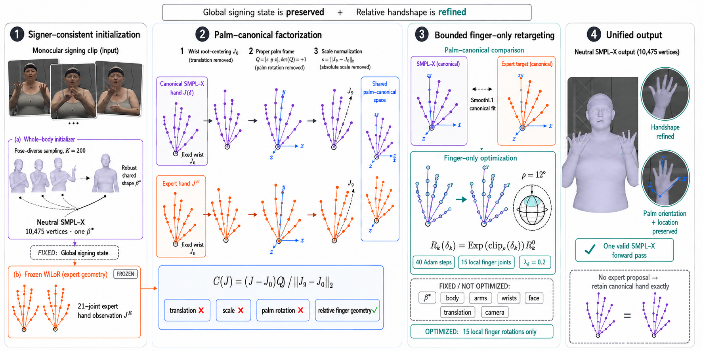

# SignEFT-X: Signer-Consistent Palm-Canonical Finger Retargeting for Monocular 3D Sign Language Reconstruction

## Abstract

Monocular 3D sign language reconstruction must recover a coherent whole-body avatar while preserving handshape, palm orientation, location, and movement. A specialist hand estimator supplies detailed articulation, but directly substituting its rotations into SMPL-X is convention-dependent and can corrupt an already plausible wrist–arm state. We present **SignEFT-X**, a training-free test-time framework that first estimates one robust signer shape and re-fits every frame to that shared neutral-SMPL-X identity. It then maps both the reconstructed hand and a frozen WiLoR proposal to a wrist-centered, palm-oriented, scale-normalized 21-point representation. Only the 15 local finger rotations are fitted, each within a fixed $12^\circ$ geodesic ball; wrist, upstream body pose, translation, facial state, and shape are immutable, with exact fallback for a missing proposal. On 57 isolated German Sign Language signs and 1,493 fixed SGNify frames, the clean pipeline reduces official translation-aligned upper-body-without-face/left-hand/right-hand error from 29.9074/13.5735/12.9271 to 29.0791/12.2806/11.4150 mm. Paired PA-MPVPE reduces mean two-hand error from 9.3170 to 8.4740 mm (9.05%); a 100,000-replicate sign bootstrap gives a 0.8411 mm mean gain with 95% interval [0.6552, 1.0259]. Direct rotation substitution instead yields 15.0091/13.2890 mm on the two hands. The evidence shows that the expert is useful only when relative finger geometry and protected signing state are explicitly separated.

## 1. Introduction

Sign languages are visual–gestural languages whose lexical and grammatical content is expressed through coordinated manual and non-manual activity. At the manual level, handshape, orientation, location, and movement are distinct but interacting parameters [1]. This makes 3D reconstruction unusually sensitive to where an error occurs. A locally plausible finger pose can still express the wrong handshape; a geometrically convenient wrist correction can change palm orientation; and a small upstream arm change can displace a hand from its intended signing-space location.

Dedicated sign-reconstruction systems have made substantial progress. SGNify [2] introduced linguistic constraints for monocular SMPL-X fitting. Neural Sign Actors [3] and Signs as Tokens (SOKE) [4] developed reconstruction pipelines as data sources for sign production. DexAvatar [6] added learned signing-specific body and hand priors, temporal consistency, biomechanical penalties, and hand-decision logic. Among directly relevant peer-reviewed reconstruction papers located by our literature review, DexAvatar is the most recent; Tamaththul3D [7] is a later 2026 preprint. Together, these works show that general-purpose human-mesh recovery does not fully model the articulation, occlusion, and motion patterns of signing.

In parallel, hand-only models such as HaMeR [14] and WiLoR [15] resolve finer local structure than a whole-body estimator can usually recover from the same frame. The difficult step is integration. SMPL-X inherits MANO-derived hand components [8,9], so the models are not unrelated; nevertheless, direct parameter substitution is not convention-invariant. Handedness conversion, crop coordinates, rest-pose conventions, global hand rotation, scale, and upstream wrist state must all be handled explicitly. Prior integration systems either compose separately regressed parts [10], infer the wrist and fingers from different contextual features [11], or modify the elbow/wrist chain to reconcile a hand estimate [12,13]. Such strategies are appropriate for generic mesh recovery, but they do not guarantee that a sign reconstruction's existing wrist orientation and hand location remain unchanged.

Our premise is that the final integration step should have a narrow contract: **the whole-body reconstruction owns global signing state; the hand expert contributes relative finger geometry**. SignEFT-X implements this contract in three stages. It first forces morphology to be constant across the collection by estimating a shared SMPL-X shape. It then re-fits upper-limb and hand pose to absorb that shape change while retaining the initializer's global placement and non-manual state. Finally, it compares reconstructed and expert hands only after removing wrist translation, palm orientation, and global hand scale. A bounded optimization changes the 15 local finger rotations of each available side and nothing else.

The distinction between the last two stages is important. Canonical re-fitting may adjust shoulders, elbows, wrists, and fingers to reconcile all frames with one identity. Once that coherent avatar state has been established, the proposed palm-canonical stage freezes the complete upstream chain and specializes only the fingers. Thus, “wrist preservation” is a guarantee of the final expert-transfer operator, not a claim that no earlier stage ever changes wrist pose.

Our contributions are:

1. We formulate hand-expert integration for signing as a protected-state retargeting problem. A 21-point palm-canonical representation removes residual translation, proper rotation, and positive global scale before any cross-model comparison, while the final optimizer changes only local finger articulation.

2. We couple this operator to a signer-consistent neutral-SMPL-X reconstruction. A robust shared identity, an explicit stage-wise variable partition, fixed per-joint $SO(3)$ update bounds, hash-checked inputs, and exact fallback checks produce one coherent parametric output without training or ground-truth access at inference.

3. We provide a protocol-separated evaluation on all 57 signs and 1,493 released frames, including official translation-aligned error, per-region similarity-aligned MPVPE, paired sign-level bootstrap intervals, component ablations, expert-transfer ablations, and a clean rerun that verifies the selected method without the historical Transformer cache.

We do **not** claim palm frames, wrist/finger factorization, specialist/whole-body integration, or bounded rotation updates as individually new. The research contribution is their sign-specific combination with an exact protected-state contract and a same-frame empirical analysis.

## 2. Related Work

### 2.1 Monocular 3D sign language reconstruction

SGNify [2] introduced a 57-sign German Sign Language (DGS) motion-capture benchmark and an optimization pipeline based on SMPLify-X. Its symmetry and within-hand invariance constraints encode linguistic regularities and improve both vertex error and perceptual recognition. The work also exposes two enduring limitations of the domain: evaluation is dominated by one signer performing isolated signs, and per-frame vertex distance does not directly measure temporal quality or sign intelligibility.

Several sign-production papers include reconstruction as a data-curation stage. Neural Sign Actors [3] combines an OSX initialization, MediaPipe evidence, pose regularization, and temporal refinement. SOKE [4] reports a pipeline that combines OSX and WiLoR and optimizes arm/shoulder state; its supplement reports strong hand errors on SGNify, but does not fully specify an alignment and frame subset identical to ours. FESLAR [5] accelerates SGNify-style processing through motion-aware critical-frame selection and interpolation rather than proposing a new accuracy objective.

DexAvatar [6] is the closest peer-reviewed sign-specific method. It initializes from SMPLer-X [20] and HaMeR [14], then optimizes with learned SignBPoser and SignHPoser priors, temporal consistency, biomechanical terms, collision handling, and one-/two-handed decision logic. Its main table explicitly evaluates 2,872 central frames with translation-aligned vertex error. SignEFT-X addresses a different question: given an existing whole-body reconstruction and a detailed hand proposal, can the proposal improve finger articulation without being allowed to revise the final wrist or upstream pose?

Tamaththul3D [7] is a close, later preprint. It combines SMPLer-X, WiLoR, MediaPipe, closed-form forearm inverse kinematics, shoulder refinement, and temporal smoothing. Its design imports global hand orientation and propagates compatibility corrections through the upper limb. SignEFT-X takes the complementary design choice: after signer-consistent canonicalization, it treats the reconstructed wrist and upstream chain as protected and imports only palm-relative articulation. Tamaththul3D does not expose a frame/alignment/evaluator identity that matches our 1,493-frame protocol, so we discuss it as concurrent context rather than use its reported values in a direct ranking.

### 2.2 Whole-body and hand-model integration

SMPL-X [8] provides a unified body, hand, and face surface with 10,475 vertices; its hand components reuse MANO templates, pose space, and corrective structure [9]. This common ancestry makes parametric integration possible, but it does not remove differences introduced by independent regressors, crop cameras, handedness conventions, or upstream body estimates.

FrankMocap [10] established modular whole-body recovery by estimating body and hands separately and integrating them into a parametric avatar. Hand4Whole [11] showed that wrist orientation benefits from body context whereas finger rotations benefit from local hand evidence. PyMAF-X [12] observed that naive part integration can produce unnatural wrists and introduced an adaptive strategy that changes the elbow/wrist configuration. Hand4Whole++ [13], a concurrent general-purpose preprint, combines a frozen whole-body model with hand-specific features and differentiable alignment, explicitly improving wrist prediction as well as fingers.

Our objective is narrower than these general-purpose systems. We do not learn a fusion module and do not ask the hand expert to correct global wrist pose. Instead, we define a test-time operator whose feasible variables exclude the wrist and every upstream degree of freedom. This gives an auditable guarantee about what the expert can and cannot change.

### 2.3 Specialist hand estimation and canonical hand geometry

HaMeR [14] reconstructs MANO hands from crops with a transformer architecture. WiLoR [15] couples hand localization to high-fidelity cropped-hand MANO regression and is used here as a frozen source of 21-point local hand geometry. SignEFT-X does not use WiLoR's predicted camera in its fitting loss; it imports root-centered local joints and explicitly handles the left-hand reflection.

Wrist-centered and palm-attached coordinate systems predate this work. Cascaded Hand Pose Regression [16] removes global hand translation and orientation with a local palm frame, while GANerated Hands [17] separates wrist/global pose from 15-joint articulation during model fitting. Our novelty claim is therefore deliberately specific: we use palm-canonical geometry as the interface between a frozen specialist and a signer-consistent SMPL-X avatar, impose independent bounded $SO(3)$ residuals, and enforce exact preservation of the final upstream signing state.

## 3. Method

### 3.1 Problem formulation and state ownership

Let $\mathcal{I}=\lbrace I_t\rbrace_{t=1}^{T}$ be a monocular signing clip collection. A frozen initializer provides a per-frame SMPL-X state

$$
\widehat{\Theta}_t =
\left(
\widehat{\boldsymbol{\beta}}_t,\,
\widehat{\mathbf{g}}_t,\,
\widehat{\boldsymbol{\theta}}^b_t,\,
\widehat{\boldsymbol{\theta}}^\ell_t,\,
\widehat{\boldsymbol{\theta}}^r_t,\,
\widehat{\boldsymbol{\psi}}_t,\,
\widehat{\boldsymbol{\tau}}_t
\right),
$$

where $\boldsymbol{\beta}\in\mathbb{R}^{10}$ is shape, $\mathbf{g}$ is global orientation, $\boldsymbol{\theta}^{b}$ is body pose, $\boldsymbol{\theta}^{\ell},\boldsymbol{\theta}^{r}\in\mathbb{R}^{45}$ are the 15 local axis-angle finger rotations for each hand, $\boldsymbol{\psi}$ groups facial parameters, and $\boldsymbol{\tau}$ is translation. The desired output is a sequence of neutral SMPL-X meshes

$$
V_t=\mathcal{M}\!\left(
\boldsymbol{\beta}^{\ast},
\mathbf{g}_t,
\boldsymbol{\theta}^{b}_t,
\boldsymbol{\theta}^{\ell}_t,
\boldsymbol{\theta}^{r}_t,
\boldsymbol{\psi}_t,
\boldsymbol{\tau}_t
\right)\in\mathbb{R}^{10475\times 3},
$$

with one shared signer shape $\boldsymbol{\beta}^{\ast}$. Frontend camera/crop quantities are not optimized by the proposed refinement.

The method avoids one unconstrained objective by assigning variables to stages:

**Table 1. Stage-wise ownership of SMPL-X state.**

| Stage | Optimized variables | Fixed variables | Geometric target |
|---|---|---|---|
| Shared-identity estimation | One $\boldsymbol{\beta}$; small per-calibration-frame finger offsets | Global orientation, body pose, face, translation | Frozen initializer mesh |
| Signer-consistent canonical refit | Six upper-limb body rotations; both 15-joint hand poses | Shared shape, global orientation, remaining body pose, face, translation | Frozen initializer mesh |
| Palm-canonical expert transfer | 15 local finger rotations for each available side | Shape, global orientation, complete body/arm/wrist state, face, translation | Frozen WiLoR local joints |

All targets in this table are predictions derived from the RGB input. Evaluation meshes and region masks are inaccessible to the inference API.

### 3.2 Overview

**Figure 1. SignEFT-X overview.** A robust shape is shared across pose-diverse frames and used to construct a signer-consistent neutral-SMPL-X sequence. For each available hand, both the avatar skeleton and frozen expert skeleton are mapped to a shared palm-canonical space. The final stage fits 15 local finger rotations under independent $12^\circ$ update bounds while preserving the established global signing state. A missing expert proposal retains the canonical hand exactly. The figure is schematic; the precise stage-wise variable ownership is given in Table 1.

### 3.3 Target-free frozen frontends

#### Whole-body initializer

The released pipeline consumes a locked, full-coverage view of per-frame SMPL-X parameters and meshes. Its primary source is the frozen WiLoR-based whole-body reconstruction used in the experiments; if either the parameter file or mesh is absent, the view selects one complete HaMeR-based fallback frame rather than mixing parameter groups across sources. Paths and selections are materialized before optimization. SignEFT-X does not train or fine-tune either frontend.

Inference manifests are built from RGB images, the public sign list, and public central-segment bounds. The implementation selects every supplied RGB image whose numeric frame identifier lies inside its sign's central interval and aborts unless the result contains exactly 57 signs and 1,493 frames. The sign-class field is retained as metadata but does not change an inference objective.

#### WiLoR observations

WiLoR is run on the same hashed RGB frames with detector threshold 0.3 and crop rescale factor 2.0. If multiple candidates of one handedness are present, the candidate with the highest detector confidence is selected. For a right-hand output, joints and 15 local rotation matrices are stored directly. For a left hand, we use

$$
F=\mathrm{diag}(-1,1,1),\qquad
J^\ell=J^rF,\qquad
R_k^\ell=FR_k^rF,
$$

which preserves $\det R_k=+1$ while changing handedness. All expert joints are then wrist-centered. RGB, checkpoint, detector, source-commit, and sidecar hashes are stored with the frozen observation cache.

### 3.4 Robust signer identity

Per-frame shape estimates can drift even when every frame depicts the same signer. We first select $K=200$ pose-diverse frames. The feature for frame $t$ concatenates axis-angle rotations of the six upper-limb body joints (shoulders, elbows, and wrists) with both 45-D hand poses:

$$
\mathbf{z}_t=
\left[
\boldsymbol{\theta}^{b}_{t,15:21};
\boldsymbol{\theta}^{\ell}_t;
\boldsymbol{\theta}^{r}_t
\right]\in\mathbb{R}^{108}.
$$

Each feature dimension is standardized. Deterministic farthest-point sampling starts from the sample with largest standardized squared norm and repeatedly selects the sample farthest from the current set.

On the selected shape vectors, a coordinate-wise Huber location estimate initializes identity. Starting from the median $m_j$ with robust scale $\sigma_j=1.4826\,\mathrm{median}_t|\widehat{\beta}_{tj}-m_j|+10^{-6}$, ten reweighting iterations use

$$
r_{tj}=\frac{\widehat{\beta}_{tj}-\beta_j}{\sigma_j},
\qquad
w_{tj}=\min\!\left(1,\frac{1.5}{|r_{tj}|+\epsilon}\right),
\qquad
\beta_j\leftarrow
\frac{\sum_t w_{tj}\widehat{\beta}_{tj}}{\sum_t w_{tj}}.
$$

Denote the result by $\boldsymbol{\beta}_0$. The configured run then refines one shared $\boldsymbol{\beta}$ together with small left/right hand-pose offsets for the calibration frames. Let $\widetilde V_t$ be the frozen initializer mesh and $H_\ell,H_r$ be the official 778-vertex MANO-to-SMPL-X correspondences. Define centered hand MSE

$$
D_H(V,\widetilde V)=
\frac{1}{2}\sum_{h\in\lbrace\ell,r\rbrace}
\mathrm{MSE}\!\left(
V_{H_h}-\mu(V_{H_h}),
\widetilde V_{H_h}-\mu(\widetilde V_{H_h})
\right).
$$

The identity objective is

$$
\mathcal{L}_{\mathrm{id}}=
D_H(V,\widetilde V)
+0.02\,\mathrm{MSE}(V,\widetilde V)
+10^{-4}\!\left[
\mathrm{MSE}(\Delta\boldsymbol{\theta}^{\ell})
+\mathrm{MSE}(\Delta\boldsymbol{\theta}^{r})
\right].
$$

The released configuration places no additional anchor on $\boldsymbol{\beta}-\boldsymbol{\beta}_0$. Optimization uses Adam [19] for 300 steps at learning rate 0.01. Because $\widetilde V_t$ is an RGB-derived initializer output rather than motion-capture ground truth, this stage standardizes identity without target leakage.

### 3.5 Signer-consistent canonical refit

Replacing every $\widehat{\boldsymbol{\beta}}_t$ with $\boldsymbol{\beta}^{\ast}$ changes joint locations and surface geometry. We therefore re-fit each sign in chunks of at most 32 frames through the exact neutral-SMPL-X layer. The free pose variables are:

- body-pose entries 15:21, corresponding to shoulders, elbows, and wrists; and
- all 15 finger rotations of both hands.

Global orientation, translation, all remaining body joints, jaw, eyes, and expression remain fixed. With $V_t(\Delta)$ denoting the shared-shape output, the configured objective is

$$
\mathcal{L}_{\mathrm{can}}=
D_H\!\left(V_t(\Delta),\widetilde V_t\right)
+0.02\,\mathrm{MSE}\!\left(V_t(\Delta),\widetilde V_t\right).
$$

No temporal term or pose anchor is active. We run at most 300 Adam steps at learning rate 0.01 and stop after 15 steps without an improvement larger than $10^{-10}$. A chunk fails closed if the mean centered-hand residual for either side exceeds 8 mm. The coordinate-boundary $180^\circ$ rotation about $x$ is applied exactly once on export. This stage yields one topology and one shape for the signer while allowing the upper-limb chain to absorb morphology-induced displacement.

### 3.6 Palm-canonical hand representation

For either side, let $J\in\mathbb{R}^{21\times 3}$ contain the wrist, 15 articulated joints, and five fingertips in WiLoR-compatible order. We use the wrist $J_0$, index MCP $J_5$, middle MCP $J_9$, and little-finger MCP $J_{17}$.

First remove wrist translation:

$$
\overline J_i=J_i-J_0.
$$

The transverse palm axis points from the little-finger MCP to the index MCP:

$$
\mathbf{x}=
\frac{\overline J_5-\overline J_{17}}
{\Vert\overline J_5-\overline J_{17}\Vert_2}.
$$

We construct a longitudinal direction from the outer-MCP midpoint and orthogonalize it against $\mathbf{x}$:

$$
\widetilde{\mathbf{y}}=
\frac{\overline J_5+\overline J_{17}}{2},
\qquad
\mathbf{y}=
\frac{
\widetilde{\mathbf{y}}-
(\widetilde{\mathbf{y}}^\top\mathbf{x})\mathbf{x}
}{
\left\Vert
\widetilde{\mathbf{y}}-
(\widetilde{\mathbf{y}}^\top\mathbf{x})\mathbf{x}
\right\Vert_2
}.
$$

The normal and re-orthogonalized longitudinal axis are

$$
\mathbf{z}=
\frac{\mathbf{x}\times\mathbf{y}}
{\Vert\mathbf{x}\times\mathbf{y}\Vert_2},
\qquad
\mathbf{y}\leftarrow\mathbf{z}\times\mathbf{x}.
$$

With $Q=[\mathbf{x},\mathbf{y},\mathbf{z}]$ and palm scale $s=\Vert\overline J_9\Vert_2$, the canonical hand is

$$
\mathcal{C}(J)=
\frac{\overline JQ}{\max(s,10^{-6})}.
$$

The implementation requires $\det Q>0.999$ for expert, reference, and optimized hands. For any translation $\mathbf{a}$, positive scale $c$, and proper rotation $R$, applying the same similarity transform to the hand leaves $\mathcal{C}$ unchanged up to numerical precision. A reflection is intentionally not treated as a valid rotation; handedness is resolved before this step.

### 3.7 Bounded finger-only retargeting

Let $R_k^0\in SO(3)$ be the canonical SMPL-X local rotation of finger joint $k$, $k=1,\ldots,15$. We optimize a tangent vector $\boldsymbol{\delta}_k\in\mathbb{R}^3$ and left-compose its exponential:

$$
R_k(\boldsymbol{\delta}_k)=
\exp\!\left(
\mathrm{clip}_{\rho}(\boldsymbol{\delta}_k)
\right)R_k^0,
\qquad
\rho=12^\circ,
$$

where radial clipping is

$$
\mathrm{clip}_{\rho}(\boldsymbol{\delta})=
\boldsymbol{\delta}
\min\!\left(
1,\frac{\rho}{\Vert\boldsymbol{\delta}\Vert_2+\epsilon}
\right).
$$

Thus, every joint has an independent fixed geodesic update bound. This is a constrained parameterization, not an adaptive trust-region optimization algorithm.

Let $J_h(\boldsymbol{\delta})$ be the 21 SMPL-X hand joints from a differentiable forward pass and $J_h^E$ the frozen WiLoR proposal. The wrist is excluded because both hands are root-centered. With componentwise Smooth-L1 loss $\ell_{\mathrm{SL1}}$, the per-frame, per-side objective is

$$
\mathcal{L}_{\mathrm{hand}}=
\frac{1}{20}
\sum_{i=1}^{20}\sum_{d=1}^{3}
\ell_{\mathrm{SL1}}\!\left(
\mathcal{C}(J_h(\boldsymbol{\delta}))_{i,d}
-
\mathcal{C}(J_h^E)_{i,d}
\right)
+0.2\,
\frac{1}{15}\sum_{k=1}^{15}
\Vert\boldsymbol{\delta}_k\Vert_2^2.
$$

The residual prior is applied to the raw, pre-clipped tangent vectors. We optimize 40 Adam steps at learning rate 0.03 with cosine annealing and gradient-norm clipping at 1.0, retaining the lowest-energy valid iterate for each frame. Available left and right sides are optimized independently.

### 3.8 Protected state, fallback, and unified output

During palm-canonical fitting, only the corresponding 15 finger rotations are mutable:

| State group | Final expert-transfer status | Enforcement |
|---|---|---|
| Shared shape $\boldsymbol{\beta}^{\ast}$ | Frozen | Exact array comparison |
| Global orientation and translation | Frozen | Exact array comparison |
| Torso, shoulders, elbows, and wrists | Frozen | Complete body-pose array comparison |
| Jaw, eyes, and expression | Frozen | Exact array comparison |
| Available-side local finger pose | Optimized | Bounded $SO(3)$ residual |
| Unavailable-side local finger pose | Frozen | Exact equality to canonical input |

The released run contains 2,596 valid hand-side proposals over 1,493 frames: 1,130 frames have two sides, 336 have one side, and 27 have neither. Therefore, at least one side is refined in 1,466 frames (98.19%), and side-level proposal coverage is 86.94%. When neither side is available, the entire state and mesh are copied exactly; when one side is unavailable, only that side is held identical.

After fitting, both hand poses and every protected parameter are decoded in a single neutral-SMPL-X forward pass. The result is not a pasted MANO/SMPL-X hybrid and has the standard 10,475-vertex topology.

### 3.9 End-to-end inference procedure

For reproducibility, the complete procedure is:

1. Build a target-free manifest from hashed RGB frames and public clip metadata; require 57 signs and 1,493 frames.
2. Construct a locked full-coverage initializer view using one complete primary or fallback reconstruction per frame.
3. Select 200 pose-diverse frames, estimate a robust shared shape, and refine it against frozen initializer geometry.
4. Re-fit every sign to the shared neutral-SMPL-X shape using only upper-limb and finger pose variables.
5. Materialize immutable canonical states and verify their hashes.
6. For each valid WiLoR side, convert expert and avatar skeletons to palm-canonical coordinates.
7. Fit 15 local finger rotations with independent $12^\circ$ bounds; retain the best finite iterate.
8. Decode one SMPL-X mesh, verify every protected state field, and write hashes and the decision reason.
9. Freeze all predictions before invoking any evaluator.

## 4. Experiments

### 4.1 Dataset and frame protocol

We use the motion-capture benchmark introduced by SGNify [2]. It contains 57 isolated DGS signs performed by one native, right-handed signer. The original acquisition uses synchronized marker-based motion capture and frontal RGB; evaluation discards transitions and retains manually annotated expressive central portions.

The published SGNify/DexAvatar protocol contains 2,872 central RGB frames [2,6]. The RGB export available to the released SignEFT-X pipeline contains 1,493 central frames. Its manifest builder selects all available frame identifiers inside the public segment intervals and fails unless the exact 57-sign/1,493-frame contract is met. Every direct baseline comparison, paired statistic, and ablation in this paper uses these same 1,493 identities. We do not treat our result as directly numerically comparable to a method evaluated only on the published 2,872-frame set.

One-handed metadata affects evaluation only. The official left-hand TR convention excludes the 15 one-handed signs, leaving 42 eligible signs; right-hand TR covers all 57. The PA evaluator reports both hands on every frame and additionally defines an active-hand metric that uses the right hand for one-handed signs and the mean of both hands otherwise.

### 4.2 Evaluation metrics

#### Official translation-aligned vertex error

Our primary metric is the author-provided translation-aligned vertex-to-vertex error (TR-V2V). For region $S$, prediction and ground truth are centered independently:

$$
E_{\mathrm{TR}}(S)=
\frac{1}{|S|}
\sum_{i\in S}
\left\Vert
\left(V_i-\mu(V_S)\right)
-
\left(V_i^\ast-\mu(V_S^\ast)\right)
\right\Vert_2.
$$

We report all vertices, upper body, upper body without face, upper body without head, and the two official 778-vertex hand regions. No scale or rotational alignment is applied.

#### Per-region PA-MPVPE

To isolate local surface configuration, we also fit an independent similarity transform to each frame and region:

$$
(s^\ast,R^\ast,\mathbf{t}^\ast)=
\arg\min_{\substack{s>0,\,R\in SO(3),\,\mathbf{t}}}
\sum_{i\in S}
\left\Vert sRV_i+\mathbf{t}-V_i^\ast\right\Vert_2^2,
$$

and report

$$
E_{\mathrm{PA}}(S)=
\frac{1}{|S|}
\sum_{i\in S}
\left\Vert s^\ast R^\ast V_i+\mathbf{t}^\ast-V_i^\ast\right\Vert_2.
$$

The implementation follows Umeyama's proper-rotation similarity alignment [18]. A separate transform is estimated for every frame and every region. Consequently, hand PA-MPVPE measures palm-relative surface configuration but cannot by itself validate global wrist location or orientation.

#### Wrist-/pelvis-aligned surface error

As a diagnostic between TR and full PA, we translate a surface using the corresponding regressed SMPL-X root: pelvis for the full mesh and wrist for a hand. This remains **MPVPE**, because distance is averaged over vertices. The regressed joint is used only to define translation.

We do not report joint MPJPE or PA-MPJPE because the released evaluator does not compute them. Its root-aligned fields remain surface-vertex metrics; labeling them as VideoPose3D Protocol #1 would be incorrect.

#### Aggregation and uncertainty

Reported scalar metrics are frame-micro averages in millimeters. For paired uncertainty, we first average each method within a sign, compute baseline-minus-candidate gain, and resample the 57 signs with replacement for 100,000 replicates using seed 20260902. This respects sign-level clustering better than treating 1,493 adjacent frames as independent samples.

### 4.3 Compared systems and protocol discipline

The direct baseline is the DexAvatar-based reconstruction used by the experiment pipeline, with HaMeR hand initialization, re-evaluated on the exact 1,493-frame manifest. Component studies then add WiLoR initialization, signer-consistent canonicalization, and palm-canonical refinement cumulatively.

For literature context only, Table 2 reproduces the 2,872-frame TR-V2V comparison reported by DexAvatar [6]. SignEFT-X is deliberately absent because its released frame set differs.

**Table 2. Published SGNify context from DexAvatar, using 2,872 central frames and TR-V2V (mm). Lower is better.**

| Method | UBody (−Face) ↓ | Left hand ↓ | Right hand ↓ |
|---|---:|---:|---:|
| FrankMocap | 78.07 | 20.47 | 19.62 |
| PIXIE | 60.11 | 25.02 | 22.42 |
| PyMAF-X | 68.61 | 21.46 | 19.19 |
| SMPLify-SL | 56.07 | 22.23 | 18.83 |
| SGNify | 55.63 | 19.22 | 17.50 |
| OSX | 47.32 | 18.34 | 18.12 |
| Neural Sign Actors | 46.42 | 16.17 | 15.23 |
| EVA* | 40.38 | 13.73 | 13.68 |
| DexAvatar | **30.13** | **13.53** | **13.08** |

SOKE reports 46.73/10.55/8.94 mm for upper body without face/left/right hand in a reconstruction supplement [4], but does not fully restate a matching alignment and central-frame subset. Tamaththul3D reports 29.28/10.65/8.90 mm under a PA-MPVPE label [7], but its table reuses several legacy values originally reported as TR-V2V and does not establish evaluator identity. Neither row is used for a direct numerical claim here.

### 4.4 Implementation details

The complete selected configuration is:

| Component | Setting |
|---|---|
| Random seed | 20260903; deterministic PyTorch algorithms requested |
| Identity calibration | 200 frames; standardized farthest-point sampling; Huber $\delta=1.5$; 10 reweighting iterations |
| Identity refinement | 300 Adam steps; LR 0.01; hand MSE weight 1; whole-mesh weight 0.02; beta anchor 0; pose offset weight $10^{-4}$ |
| Canonical refit | Chunks ≤32; at most 300 Adam steps; LR 0.01; 15-step patience; whole-mesh weight 0.02; pose anchor 0 |
| Canonical fail-closed threshold | 8 mm mean centered hand residual per side/chunk |
| WiLoR extraction | Detector confidence 0.3; crop rescale 2.0; highest-confidence candidate per side |
| Final hand refinement | Batch size 8; 8 workers; 40 Adam steps; LR 0.03; cosine schedule; gradient clip 1.0 |
| Finger update bound | $12^\circ$ independently for each of 15 local joints |
| Tangent residual prior | 0.2 |
| Final output | Neutral SMPL-X, 10 shape coefficients, 10,475 vertices |

The hand workers process disjoint contiguous shards while preserving the sequential batch partition. Models and checkpoints for SMPL-X, WiLoR, and HaMeR are external third-party dependencies and are not bundled.

## 5. Results

### 5.1 Same-frame official TR-V2V

Table 3 compares the re-evaluated DexAvatar-based baseline with the clean released SignEFT-X pipeline. Both rows use all 1,493 protocol frames.

**Table 3. Direct 1,493-frame comparison with the official translation-aligned evaluator (mm).**

| Region | DexAvatar-based baseline ↓ | SignEFT-X clean release ↓ | Reduction | Relative reduction |
|---|---:|---:|---:|---:|
| All | 42.5867 | **42.0535** | 0.5332 | 1.25% |
| Upper body | 26.4560 | **25.7755** | 0.6805 | 2.57% |
| Upper body (−Face) | 29.9074 | **29.0791** | 0.8283 | 2.77% |
| Left hand | 13.5735 | **12.2806** | 1.2929 | 9.53% |
| Right hand | 12.9271 | **11.4150** | 1.5121 | 11.70% |

The largest relative reductions occur on the hands, matching the method's intended scope. Upper-body masks also contain hand vertices, so an aggregate upper-body gain must not be interpreted as evidence that the final finger-only stage changes the torso. The earlier shared-identity/canonical stage may change upper-limb pose; the last expert-transfer stage cannot.

### 5.2 Paired PA-MPVPE

The archived paired artifact compares the baseline and the frozen full experiment run on identical frames. Table 4 reports micro averages; positive gain means lower error for SignEFT-X.

**Table 4. Paired per-region PA-MPVPE on 57 signs/1,493 frames (mm).**

| Region | Baseline ↓ | SignEFT-X ↓ | Gain | Relative gain |
|---|---:|---:|---:|---:|
| All | 36.4627 | **36.4406** | 0.0221 | 0.06% |
| Upper body | 26.8264 | **26.4034** | 0.4231 | 1.58% |
| Upper body (−Face) | 30.6916 | **30.1418** | 0.5498 | 1.79% |
| Upper body (−Head) | 40.0741 | **39.2518** | 0.8222 | 2.05% |
| Left hand | 8.8528 | **8.1493** | 0.7035 | 7.95% |
| Right hand | 9.7812 | **8.7987** | 0.9824 | 10.04% |
| Mean of both hands | 9.3170 | **8.4740** | 0.8430 | 9.05% |
| Active hand(s) | 9.6385 | **8.6365** | 1.0020 | 10.40% |

The clean release gives 8.1493/8.7999 mm on the left/right hands and 30.1391 mm on upper body without face, differing from the archived row only at the third decimal place. PA improvements are again localized most strongly to manual regions.

### 5.3 Sign-level uncertainty

**Table 5. Baseline-minus-SignEFT-X PA-MPVPE gain under 100,000 sign-level bootstrap replicates.**

| Region | Mean sign gain (mm) ↑ | 95% percentile interval | Improved / worse signs |
|---|---:|---:|---:|
| All | 0.0542 | [−0.1499, 0.2680] | 28 / 29 |
| Upper body | 0.4801 | [0.2639, 0.7007] | 42 / 15 |
| Upper body (−Face) | 0.6115 | [0.3666, 0.8591] | 43 / 14 |
| Upper body (−Head) | 0.8259 | [0.4647, 1.1915] | 44 / 13 |
| Left hand | 0.6978 | [0.4910, 0.9185] | 49 / 8 |
| Right hand | 0.9844 | [0.7357, 1.2244] | 46 / 11 |
| Mean of both hands | 0.8411 | [0.6552, 1.0259] | 50 / 7 |
| Active hand(s) | 1.0162 | [0.7955, 1.2327] | 50 / 7 |

Every reported manual and upper-body interval lies above zero. The all-vertex interval crosses zero, so the evidence does not resolve an all-surface PA improvement. This is expected: face and lower-body vertices dominate the full surface but are not targets of final hand fitting.

### 5.4 Wrist-/pelvis-aligned surface diagnostic

Table 6 uses translation from a regressed root joint but still averages surface-vertex distances.

**Table 6. Root-aligned MPVPE diagnostic on the paired 1,493-frame experiment (mm).**

| Surface | Baseline ↓ | SignEFT-X ↓ | Micro gain | Mean sign gain [95% interval] |
|---|---:|---:|---:|---:|
| All, pelvis aligned | 59.6307 | **58.9217** | 0.7090 | 0.7660 [0.5001, 1.0464] |
| Left hand, wrist aligned | 41.0349 | **40.0693** | 0.9657 | 1.0132 [0.3724, 1.6707] |
| Right hand, wrist aligned | 20.7007 | **18.5481** | 2.1527 | 2.2561 [1.7469, 2.7930] |
| Mean hand surface | 30.8678 | **29.3087** | 1.5592 | 1.6347 [1.2766, 2.0025] |

These errors retain differences in palm orientation and scale after root translation, unlike PA-MPVPE. Their improvement is consistent with better integrated hand geometry, but they are not joint-position metrics.

### 5.5 Clean-method verification and Transformer exclusion

The selected package consumes the direct frozen initializer and contains no Transformer or sequence network. A historical learned cache had changed only six right-hand poses among 4,479 evaluated region-frame decisions; body and left-hand poses were identical. Thirty frames also contained cache-time shape consolidation rather than learned pose changes. We reran the full pipeline without that cache.

**Table 7. Clean direct-initializer rerun versus the former full experiment (mm).**

| Metric | Clean release | Former experiment | Clean − former |
|---|---:|---:|---:|
| Official TR all | 42.0535 | 42.0501 | +0.0034 |
| Official TR upper body | 25.7755 | 25.7788 | −0.0033 |
| Official TR upper body (−Face) | 29.0791 | 29.0829 | −0.0038 |
| Official TR left hand | 12.2806 | 12.2807 | −0.0001 |
| Official TR right hand | 11.4150 | 11.4156 | −0.0006 |
| PA-MPVPE upper body | 26.4008 | 26.4034 | −0.0025 |
| PA-MPVPE upper body (−Face) | 30.1391 | 30.1418 | −0.0027 |
| PA-MPVPE left hand | 8.1493 | 8.1493 | +0.0000 |
| PA-MPVPE right hand | 8.7999 | 8.7987 | +0.0011 |

Every overlapping difference is below 0.004 mm. This audit supports the simpler method definition and shows that the archived ablation endpoint is numerically representative of the clean release.

## 6. Ablation Studies

All ablations use all 57 signs and 1,493 frames. They are frozen experiment records from the former full run; Table 7 quantifies their parity with the selected clean pipeline. Because the component table is cumulative rather than factorial, a row-to-row change includes interactions with preceding stages.

### 6.1 Cumulative component progression

**Table 8. Cumulative components under official TR-V2V (mm).**

| Configuration | WiLoR init. | Shared identity/canonical refit | Palm-canonical refinement | All ↓ | UBody ↓ | UBody (−F) ↓ | UBody (−H) ↓ | LHand ↓ | RHand ↓ |
|---|:---:|:---:|:---:|---:|---:|---:|---:|---:|---:|
| DexAvatar-based baseline (HaMeR) |  |  |  | 42.5867 | 26.4560 | 29.9074 | 40.7960 | 13.5735 | 12.9271 |
| + WiLoR hand initialization | ✓ |  |  | 42.2423 | 26.2236 | 29.6196 | 40.2368 | 12.8102 | 12.1148 |
| + signer-consistent canonicalization | ✓ | ✓ |  | 42.0936 | 25.8311 | 29.1458 | 39.6963 | 12.8466 | 12.1275 |
| **+ palm-canonical refinement** | ✓ | ✓ | ✓ | **42.0501** | **25.7788** | **29.0829** | **39.5782** | **12.2807** | **11.4156** |

WiLoR initialization gives the first large manual gain. Canonicalization improves every upper-body aggregate but slightly raises hand error relative to the preceding row, consistent with the cost of imposing one morphology. Palm-canonical fitting recovers and surpasses the manual accuracy: relative to the canonical row, it reduces left/right hand error by 0.5659/0.7119 mm while leaving the final state on one coherent SMPL-X identity.

### 6.2 Is palm-canonical geometry necessary?

All rows in Table 9 use the same protected body state and an $8^\circ$ per-joint bound. “Direct rotations” substitutes cross-model local rotations without fitting 21-point palm-canonical geometry.

**Table 9. Expert-transfer representation ablation, official TR-V2V (mm).**

| Configuration | Expert proposal | Palm-canonical geometry | All ↓ | UBody ↓ | UBody (−F) ↓ | UBody (−H) ↓ | LHand ↓ | RHand ↓ |
|---|:---:|:---:|---:|---:|---:|---:|---:|---:|
| No final hand refinement |  |  | 42.0936 | 25.8311 | 29.1458 | 39.6963 | 12.8466 | 12.1275 |
| Direct local-rotation substitution | ✓ |  | 42.2166 | 26.0140 | 29.3793 | 40.1659 | 15.0091 | 13.2890 |
| **Palm-canonical geometry fitting** | ✓ | ✓ | **42.0506** | **25.7794** | **29.0836** | **39.5795** | **12.2839** | **11.4250** |

Direct substitution is worse than performing no final refinement, increasing left/right errors by 2.1625/1.1615 mm. Palm-canonical fitting instead improves them by 0.5627/0.7025 mm. The 2.7252/1.8640 mm gap between the two expert-transfer variants is the clearest causal evidence for the proposed interface: the hand expert alone is insufficient; its information must be expressed in a compatible geometry.

### 6.3 Sensitivity to the per-joint update bound

**Table 10. Fixed geodesic update-radius ablation, official TR-V2V (mm).**

| Maximum update per finger joint | All ↓ | UBody ↓ | UBody (−F) ↓ | UBody (−H) ↓ | LHand ↓ | RHand ↓ |
|---:|---:|---:|---:|---:|---:|---:|
| $4^\circ$ | 42.0564 | 25.7858 | 29.0913 | 39.5940 | 12.3415 | 11.5304 |
| $8^\circ$ | 42.0506 | 25.7794 | 29.0836 | 39.5795 | 12.2839 | 11.4250 |
| **$12^\circ$** | **42.0501** | **25.7788** | **29.0829** | **39.5782** | **12.2807** | **11.4156** |

Most of the gain appears between $4^\circ$ and $8^\circ$; $8^\circ$ to $12^\circ$ changes errors only slightly. The selected $12^\circ$ value is best in all six aggregates, but the saturation indicates that the result does not require large unconstrained corrections.

### 6.4 Explicit target bone-length normalization

Palm scale already removes one global size variable. We additionally tested rebuilding the expert target with signer-specific per-bone lengths at the $8^\circ$ setting.

**Table 11. Target bone-length ablation at an $8^\circ$ update bound, official TR-V2V (mm).**

| Explicit per-bone normalization | All ↓ | UBody ↓ | UBody (−F) ↓ | UBody (−H) ↓ | LHand ↓ | RHand ↓ |
|:---:|---:|---:|---:|---:|---:|---:|
| ✓ | **42.0484** | **25.7782** | **29.0821** | **39.5769** | 12.3154 | 11.5259 |
|  | 42.0506 | 25.7794 | 29.0836 | 39.5795 | **12.2839** | **11.4250** |

Per-bone normalization marginally improves large-region aggregates by at most 0.0026 mm but worsens the left/right hand regions by 0.0315/0.1009 mm. We retain only global palm-scale normalization in the selected method.

### 6.5 Proposal filtering

The archived confidence-gating study belongs to the $8^\circ$, normalized-target branch; comparisons should be made within Table 12 rather than against the $12^\circ$ endpoint. A 2D gate asks a secondary image-space estimator to approve the proposal, whereas a canonical-3D gate compares local geometry before fitting.

**Table 12. Proposal-gating ablation within the fixed normalized-target branch, official TR-V2V (mm).**

| 2D gate | Canonical-3D gate | All ↓ | UBody ↓ | UBody (−F) ↓ | UBody (−H) ↓ | LHand ↓ | RHand ↓ |
|:---:|:---:|---:|---:|---:|---:|---:|---:|
| ✓ | ✓ | 42.0696 | 25.8053 | 29.1131 | 39.6254 | 12.5219 | 11.9180 |
| ✓ |  | 42.0696 | 25.8054 | 29.1132 | 39.6252 | 12.5214 | 11.9160 |
|  | ✓ | **42.0483** | **25.7780** | **29.0819** | **39.5776** | 12.3193 | 11.5311 |
|  |  | 42.0484 | 25.7782 | 29.0821 | 39.5769 | **12.3154** | **11.5259** |

The 2D gate rejects useful refinements and noticeably worsens both hands. The canonical-3D gate changes large-region errors by at most 0.0002 mm and does not improve either hand. The selected implementation therefore accepts every structurally valid WiLoR proposal and falls back only when a side is unavailable.

### 6.6 Should the wrist be optimized in the final stage?

We added at most $1^\circ$ of wrist residual while retaining the $12^\circ$ finger bound.

**Table 13. Wrist-state ablation, official TR-V2V (mm).**

| Final-stage wrist state | All ↓ | UBody ↓ | UBody (−F) ↓ | UBody (−H) ↓ | LHand ↓ | RHand ↓ |
|---|---:|---:|---:|---:|---:|---:|
| Up to $1^\circ$ residual | 42.0504 | 25.7792 | 29.0835 | 39.5799 | 12.2827 | 11.4159 |
| **Locked** | **42.0501** | **25.7788** | **29.0829** | **39.5782** | **12.2807** | **11.4156** |

The geometric difference is very small, so this ablation should not be read as evidence of a universal numerical advantage for locking the wrist. It does show that wrist freedom is unnecessary for the observed gain. We choose the locked variant because it provides the stronger semantic and implementation guarantee: the hand expert cannot purchase lower finger error by moving palm orientation.

## 7. Discussion

### 7.1 What the experiments identify

The results support three claims at different strengths. First, using a stronger hand frontend helps: the WiLoR initialization row improves both hands. Second, enforcing one signer shape creates a coherent identity but can slightly perturb local hand fit, motivating a subsequent articulation stage. Third, and most decisively, cross-model transfer must account for coordinate and rest-state differences: direct rotation substitution is substantially worse than both no transfer and palm-canonical geometry fitting.

The final operator's exact protected-state checks are stronger than an empirical “approximately unchanged” statement. They establish that any final-stage difference outside the available-side finger pose is an implementation error. Conversely, these checks do not prove that the canonical wrist is correct; they only prevent the specialist from changing it.

### 7.2 Relationship to DexAvatar, SOKE, and Tamaththul3D

DexAvatar learns priors and jointly optimizes signing pose, while SignEFT-X performs no training and assumes an existing whole-body state. The two are therefore compositional rather than mutually exclusive: a DexAvatar-like system can supply the global anchor, and palm-canonical retargeting can supply a constrained local correction.

SOKE and Tamaththul3D demonstrate that WiLoR-to-SMPL-X integration is already an active direction. Their pipelines allow global hand orientation or upstream arm variables to participate. SignEFT-X's distinctive design is the protected-state boundary after canonicalization. Which policy is preferable depends on the failure mode: upstream optimization can repair an incorrect wrist, while strict locking prevents a good wrist from being overwritten. A future system could select between these modes using calibrated uncertainty, but such a selector is not part of the present method.

### 7.3 What the metrics do and do not establish

Official TR-V2V retains rotational and scale discrepancies after translation centering, whereas per-region PA-MPVPE removes them. Improvement under both metrics is useful: it shows that the result is not only a favorable global translation. However, PA hand alignment explicitly removes wrist location and orientation, so it cannot validate their preservation; preservation follows from the state contract, while correctness still depends on the initializer.

Neither metric measures sign identity, naturalness, temporal coarticulation, or comprehensibility. SGNify showed the value of perceptual evaluation [2]; a similarly designed study with native signers would be necessary before claiming that the measured hand improvements reduce lexical error.

### 7.4 Limitations

**Restricted benchmark diversity.** The quantitative benchmark contains one DGS signer, 57 isolated signs, and a controlled capture setting. A shared signer shape is well matched to this collection, but cross-signer, cross-language, continuous-sign, clothing, body-shape, and camera generalization remain untested.

**Partial frame protocol.** The released result covers 1,493 central frames rather than the published 2,872-frame protocol. Same-frame gains are valid, but a full 2,872-frame rerun is required for an apples-to-apples literature leaderboard.

**Frame-independent final fitting.** The selected hand refiner contains no temporal loss. Independent frames can jitter even if average surface error decreases. Velocity, acceleration, and perceptual motion metrics should accompany future continuous-sequence experiments.

**Dependence on the frozen expert and initializer.** Incorrect WiLoR detections may produce an incorrect local target; absent detections preserve the canonical state rather than repair it. More importantly, locking the wrist protects an initializer error as faithfully as it protects a correct orientation.

**Hyperparameter selection.** The radius and auxiliary design choices were evaluated on the same benchmark used for final reporting. A new multi-signer validation split is needed to separate model selection from final testing.

**Metric and ground-truth limitations.** The SGNify surface reference can contain hand artifacts, and region averages weight dense vertices rather than linguistic contrasts. We report no joint metric because no matching released evaluator exists, and no human study is available.

**Compute reporting.** The release specifies optimization steps, batching, and hardware-independent determinism controls, but the archived run does not provide a complete end-to-end latency and peak-memory report. This should be added for a final camera-ready comparison with feed-forward systems.

**Ablation reproducibility.** The active package exposes the selected inference path and frozen aggregate ablation records, but not configuration switches for every rejected filtering, bone-normalization, and wrist variant. A camera-ready artifact should release those switches and their per-sign outputs.

### 7.5 Ethical and accessibility considerations

Sign language technology should not treat one signer or one national sign language as representative of Deaf communities. Reconstructed data may reproduce capture bias, body-shape bias, and errors in culturally specific articulation. Any downstream dataset release should preserve performer consent and licensing, document whether meshes are predictions or motion-capture references, and involve native signers in semantic and naturalness evaluation. A lower geometric error is not a substitute for community validation.

## 8. Conclusion

We presented SignEFT-X, a training-free framework for signer-consistent monocular 3D sign language reconstruction. Its central design is a strict division of responsibility: the canonical whole-body reconstruction owns global signing state, while a frozen hand expert supplies only relative finger geometry. Wrist-centered, palm-oriented, scale-normalized 21-point fitting, independent bounded $SO(3)$ residuals, and exact protected-state checks turn that division into an enforceable operator.

On a fixed 57-sign/1,493-frame protocol, SignEFT-X improves both hands under official translation alignment, regional similarity alignment, and wrist-aligned surface evaluation. The direct-rotation ablation shows that the improvement does not follow automatically from adding WiLoR; the geometry and state partition are essential. At the same time, the evidence supports a same-frame improvement claim rather than a cross-protocol SOTA claim. A full published-protocol rerun, multi-signer continuous signing, runtime analysis, and native-signer perceptual evaluation are the clearest next steps toward a conference-complete validation.

## Appendix A. Reproducibility and artifact contract

### A.1 Inference/evaluation separation

The inference configuration accepts RGB, public sign/segment metadata, frozen initializer artifacts, model assets, frozen WiLoR observations, and an output path. It explicitly rejects keys named evaluator, evaluation root, ground-truth root, GT root, or target-mesh root. Evaluation code is imported only after predictions have been frozen and exported.

The official evaluator adapter verifies a fixed SHA-256 digest, captures standard output and error, records the exact command, and parses all required region metrics. The PA evaluator is separate and writes both aggregate JSON and per-sign CSV. This boundary is important because the identity and canonical objectives use initializer geometry that resembles a pseudo-target; the API contract establishes that this geometry is RGB-derived and not the motion-capture reference.

### A.2 Determinism and fail-closed checks

| Check | Failure behavior |
|---|---|
| Sign/frame count differs from 57/1,493 | Abort before inference |
| Required initializer parameter or mesh missing | Use one complete fallback frame; never mix partial sources |
| RGB hash differs from frozen WiLoR cache | Abort |
| WiLoR rotation is non-orthogonal or improper | Abort |
| Palm frame determinant ≤0.999 | Abort |
| Canonical mean centered-hand residual >8 mm | Abort |
| Non-finite loss or geometry | Abort |
| Completed output would be overwritten | Abort |
| Protected state changes | Abort |
| Unavailable-side finger pose changes | Abort |
| Merged shard hash differs from decision record | Abort |

The global seed is 20260903. Python, NumPy, and PyTorch RNGs are seeded, and deterministic PyTorch algorithms are requested with warnings enabled.

### A.3 Verified release inventory

The clean release audit records:

- 57 canonical sequences;
- 1,493 final SMPL-X states;
- 1,493 final meshes;
- 1,493 per-frame decision records with output hashes;
- 2,596 refined hand sides;
- 27 exact full-frame fallbacks;
- zero ground-truth/evaluator paths in the inference configuration.

Third-party repositories and licensed model files are required to reproduce extraction and decoding. The source release provides their adapters and hash contracts, not their checkpoints.

## References

[1] D. Brentari. [“Introduction.”](https://doi.org/10.1017/9781316286401.001) In *Sign Language Phonology*, Cambridge University Press, 2019.

[2] M.-P. Forte, P. Kulits, C.-H. P. Huang, V. Choutas, D. Tzionas, K. J. Kuchenbecker, and M. J. Black. [“Reconstructing Signing Avatars From Video Using Linguistic Priors.”](https://openaccess.thecvf.com/content/CVPR2023/html/Forte_Reconstructing_Signing_Avatars_From_Video_Using_Linguistic_Priors_CVPR_2023_paper.html) CVPR, 2023.

[3] V. Baltatzis, R. A. Potamias, E. Ververas, G. Sun, J. Deng, and S. Zafeiriou. [“Neural Sign Actors: A Diffusion Model for 3D Sign Language Production from Text.”](https://arxiv.org/abs/2312.02702) CVPR, 2024.

[4] R. Zuo, R. A. Potamias, E. Ververas, J. Deng, and S. Zafeiriou. [“Signs as Tokens: A Retrieval-Enhanced Multilingual Sign Language Generator.”](https://openaccess.thecvf.com/content/ICCV2025/html/Zuo_Signs_as_Tokens_A_Retrieval-Enhanced_Multilingual_Sign_Language_Generator_ICCV_2025_paper.html) ICCV, 2025.

[5] R. Ahmed, I. S. Ahmad, and N. M. Khan. [“FESLAR: Reducing Computational Overhead in Sign Language Avatar Reconstruction via Motion-Aware Critical Frame Selection.”](https://link.springer.com/chapter/10.1007/978-3-032-21582-6_9) ISPR, 2025.

[6] K. Kundu, H. B. Barua, L. Robertson-Bell, Z. Cai, and K. Stefanov. [“DexAvatar: 3D Sign Language Reconstruction with Hand and Body Pose Priors.”](https://openaccess.thecvf.com/content/WACV2026/html/Kundu_DexAvatar_3D_Sign_Language_Reconstruction_with_Hand_and_Body_Pose_WACV_2026_paper.html) WACV, 2026.

[7] E. Alghamdi, S. Altuuaim, O. Ghulam, A. Qutah, and Y. Basoodan. [“Tamaththul3D: High-Fidelity 3D Saudi Sign Language Avatars from Monocular Video.”](https://arxiv.org/abs/2605.05367) arXiv:2605.05367, 2026.

[8] G. Pavlakos, V. Choutas, N. Ghorbani, T. Bolkart, A. A. A. Osman, D. Tzionas, and M. J. Black. [“Expressive Body Capture: 3D Hands, Face, and Body From a Single Image.”](https://openaccess.thecvf.com/content_CVPR_2019/html/Pavlakos_Expressive_Body_Capture_3D_Hands_Face_and_Body_From_a_Single_Image_CVPR_2019_paper.html) CVPR, 2019.

[9] J. Romero, D. Tzionas, and M. J. Black. [“Embodied Hands: Modeling and Capturing Hands and Bodies Together.”](https://doi.org/10.1145/3130800.3130883) ACM Transactions on Graphics, 36(6), 2017.

[10] Y. Rong, T. Shiratori, and H. Joo. [“FrankMocap: A Monocular 3D Whole-Body Pose Estimation System via Regression and Integration.”](https://arxiv.org/abs/2108.06428) ICCV Workshops, 2021.

[11] G. Moon, H. Choi, and K. M. Lee. [“Accurate 3D Hand Pose Estimation for Whole-Body 3D Human Mesh Estimation.”](https://arxiv.org/abs/2011.11534) CVPR Workshops, 2022.

[12] H. Zhang, Y. Tian, Y. Zhang, M. Li, L. An, Z. Sun, and Y. Liu. [“PyMAF-X: Towards Well-aligned Full-body Model Regression from Monocular Images.”](https://arxiv.org/abs/2207.06400) IEEE TPAMI, 45(10), 2023.

[13] G. Moon. [“Enhancing Hands in 3D Whole-Body Pose Estimation with Conditional Hands Modulator.”](https://arxiv.org/abs/2603.14726) arXiv:2603.14726, 2026.

[14] G. Pavlakos, D. Shan, I. Radosavovic, A. Kanazawa, D. Fouhey, and J. Malik. [“Reconstructing Hands in 3D with Transformers.”](https://openaccess.thecvf.com/content/CVPR2024/html/Pavlakos_Reconstructing_Hands_in_3D_with_Transformers_CVPR_2024_paper.html) CVPR, 2024.

[15] R. A. Potamias, J. Zhang, J. Deng, and S. Zafeiriou. [“WiLoR: End-to-end 3D Hand Localization and Reconstruction in-the-wild.”](https://openaccess.thecvf.com/content/CVPR2025/html/Potamias_WiLoR_End-to-end_3D_Hand_Localization_and_Reconstruction_in-the-wild_CVPR_2025_paper.html) CVPR, 2025.

[16] X. Sun, Y. Wei, S. Liang, X. Tang, and J. Sun. [“Cascaded Hand Pose Regression.”](https://openaccess.thecvf.com/content_cvpr_2015/html/Sun_Cascaded_Hand_Pose_2015_CVPR_paper.html) CVPR, 2015.

[17] F. Mueller, F. Bernard, O. Sotnychenko, D. Mehta, S. Sridhar, D. Casas, and C. Theobalt. [“GANerated Hands for Real-Time 3D Hand Tracking from Monocular RGB.”](https://handtracker.mpi-inf.mpg.de/projects/GANeratedHands/) CVPR, 2018.

[18] S. Umeyama. [“Least-Squares Estimation of Transformation Parameters Between Two Point Patterns.”](https://doi.org/10.1109/34.88573) IEEE TPAMI, 13(4), 1991.

[19] D. P. Kingma and J. Ba. [“Adam: A Method for Stochastic Optimization.”](https://arxiv.org/abs/1412.6980) ICLR, 2015.

[20] Z. Cai, W. Yin, A. Zeng, C. Wei, Q. Sun, Y. Wang, H. E. Pang, H. Mei, M. Zhang, L. Zhang, C. C. Loy, L. Yang, and Z. Liu. [“SMPLer-X: Scaling Up Expressive Human Pose and Shape Estimation.”](https://openreview.net/forum?id=n8hpztIuet) NeurIPS, 2023.
