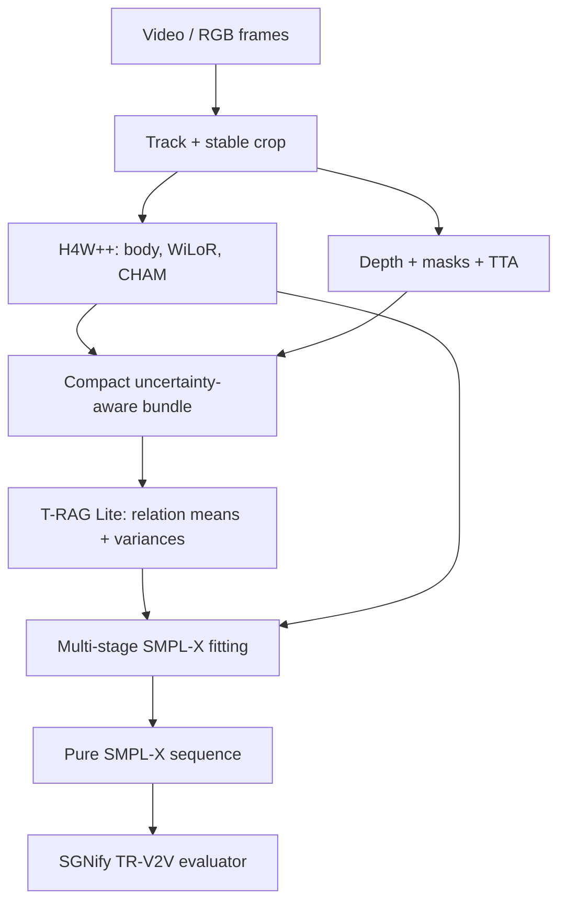

# SignAlign-TR Lite — Blueprint triển khai end-to-end

**Bài toán:** Monocular 3D Sign Language Reconstruction

**Mục tiêu output:** pure SMPL-X sequence và kết quả SGNify TR-V2V UBody(-F), LHand, RHand

**Ngày khóa thiết kế:** 28-08-2026
**Phiên bản:** v2 — T-RAG Lite / no-full-dataset profile

## 0. Quyết định triển khai

Ta không sửa trực tiếp DexAvatar thành một monolith lớn hơn. Ta xây một package mới, dùng các upstream repositories như front-end/reference đã pin commit:

| Repo | Commit đã audit | Vai trò |
|---|---|---|
| [Hand4Whole++](https://github.com/mks0601/Hand4Whole-plus-plus_RELEASE/tree/f81d35ddd2b74206c40142243eb62b6d64ce0d65) | `f81d35d` | Front-end mặc định: SMPLer-X-L32 + WiLoR + CHAM + DWPose |
| [DexAvatar](https://github.com/kaustesseract/DexAvatar/tree/a0dfd427f60f5811aadb35c8657b3856d47f56b5) | `a0dfd42` | Baseline, optional SignB/H priors và nguồn đối chiếu fitting |
| [SMPLest-X](https://github.com/MotrixLab/SMPLest-X/tree/fdebd887a317f9004b435c57812d1a8936295360) | `fdebd88` | Secondary initialization/ablation; không phải default |
| [SGNify](https://github.com/MPForte/SGNify/tree/bae2a71d8388df73af56117731f7f454e36e5b2e) | `bae2a71` | Baseline/reference protocol; code có license research-only |

Method cuối:

> **Hand4Whole++ initialization → compact uncertainty-aware observations → T-RAG Lite relation prediction → multi-stage pure-SMPL-X fitting → exact TR-V2V evaluation.**

**Ràng buộc triển khai mặc định:** không tải toàn bộ InterHand2.6M, không cache raw H4W++/WiLoR feature maps và không retrain các front-end lớn. T-RAG Lite được thiết kế để train bằng parameter-only synthetic denoising và các compact observation shards; real-image subsets chỉ là optional fine-tuning.

Không có một mạng HMR thứ hai dự đoán toàn pose. Module học mới chỉ dự đoán **observation-conditioned relative 3D relations và uncertainty** từ các tín hiệu bắt nguồn từ ảnh. SMPL-X kinematic layer chịu trách nhiệm biến observations thành mesh hợp lệ.



### 0.1 Những gì v1 không làm

- Không port CHAM sang SMPLest-X trước khi baseline H4W++ được tái lập.
- Không chép cứng WiLoR global wrist rotation vào SMPL-X.
- Không tối ưu L2 giữa hai axis-angle vectors.
- Không tin monocular depth là metric depth.
- Không gọi method là phonology-grounded khi chưa có phonological labels/classifier được validate trên DGS.
- Không dùng mesh MANO-insert của H4W++ làm output parametric chính.
- Không tải full InterHand/ReInterHand/AGORA/ARCTIC như dependency mặc định.
- Không lưu raw H4W++/WiLoR spatial feature maps.
- Không tune bằng SGNify test ground truth.

## 1. Vì sao phải tạo package mới

Các upstream có module names chung như `model`, `config`, `utils`, global `cfg`, thay đổi `sys.path`, hard-coded `.cuda()` và dependency versions khác nhau. Import H4W++, SMPLest-X và DexAvatar vào cùng process rất dễ lấy nhầm module.

Cấu trúc đề xuất:

```text
signalign-tr/
├── configs/
│   ├── frontend_h4wpp.yaml
│   ├── synthetic_relations.yaml
│   ├── trag_lite_train.yaml
│   ├── trag_lite_input.yaml
│   ├── trag_lite_calibrate.yaml
│   ├── fit_sgnify.yaml
│   └── eval_sgnify.yaml
├── third_party/
│   ├── hand4whole_pp/       # pinned f81d35d
│   ├── dexavatar/           # pinned a0dfd42, reference-only by default
│   ├── smplest_x/           # pinned fdebd88, optional
│   └── sgnify/              # pinned bae2a71, research protocol only
├── signalign/
│   ├── schema/
│   │   ├── manifest.py
│   │   ├── observations.py
│   │   └── state.py
│   ├── frontends/
│   │   ├── h4wpp_adapter.py
│   │   ├── smplest_adapter.py
│   │   ├── depth_adapter.py
│   │   └── mask_adapter.py
│   ├── geometry/
│   │   ├── joint_registry.py
│   │   ├── camera.py
│   │   ├── torso_frame.py
│   │   ├── palm_frame.py
│   │   ├── hand_descriptor.py
│   │   ├── so3.py
│   │   └── anchors.py
│   ├── models/
│   │   ├── trag_lite.py
│   │   ├── numeric_embeddings.py
│   │   ├── graph_layers.py
│   │   ├── temporal_adapter.py
│   │   └── graph_solver.py
│   ├── losses/
│   │   ├── reprojection.py
│   │   ├── relation_nll.py
│   │   ├── hand_local.py
│   │   ├── orientation.py
│   │   ├── ordinal_depth.py
│   │   ├── temporal.py
│   │   ├── priors.py
│   │   └── physical.py
│   ├── fitting/
│   │   ├── smplx_forward.py
│   │   ├── objective.py
│   │   ├── stages.py
│   │   ├── optimizer.py
│   │   └── candidate_selector.py
│   ├── data/
│   │   ├── synthetic_relations.py
│   │   ├── compact_shards.py
│   │   ├── optional_real_subset.py
│   │   ├── sign_video.py
│   │   └── collate.py
│   └── evaluation/
│       ├── trv2v.py
│       ├── diagnostics.py
│       ├── bootstrap.py
│       └── report.py
├── tools/
│   ├── build_manifest.py
│   ├── extract_h4wpp.py
│   ├── extract_smplest.py
│   ├── extract_depth.py
│   ├── build_synthetic_relations.py
│   ├── select_compact_subset.py
│   ├── train_trag_lite.py
│   ├── calibrate_uncertainty.py
│   ├── fit_clips.py
│   └── evaluate_sgnify.py
└── tests/
```

H4W++ và SMPLest-X nên chạy bằng subprocess/native environment riêng, ghi ra một schema thống nhất. Fitting process không import các global configs của upstream.

## 2. Data contracts bắt buộc

### 2.1 Canonical units và coordinate systems

Toàn pipeline nội bộ dùng:

- 3D: **meters**.
- 2D: pixel trong body crop `256×192`, đồng thời lưu normalized coordinates `[-1,1]`.
- Camera frame: (+x) sang phải ảnh, (+y) xuống ảnh, (+z) từ camera vào scene.
- Rotation: matrix (3×3) trong optimization; axis-angle chỉ dùng khi đọc/ghi upstream files.
- SMPL-X topology: 10.475 vertices, neutral model, 10 betas cho primary result.

Mỗi adapter phải có một `CoordinateConvention` và một unit test projection. Không sửa dấu trục rải rác trong dataset code.

### 2.2 Manifest

`manifest.jsonl` có một record/frame:

```json
{
  "dataset": "sgnify",
  "split": "test",
  "clip_id": "sign_001",
  "frame_id": 17,
  "timestamp_sec": 0.5667,
  "image_path": "/abs/path/frame_000017.png",
  "person_track_id": 0
}
```

Split được quyết định ở manifest level. Training loader không được tự động thấy `split=test`.

### 2.3 `SMPLXState`

```python
@dataclass
class SMPLXState:
    global_R: Tensor       # [T, 1, 3, 3]
    body_R: Tensor         # [T, 21, 3, 3]
    left_hand_R: Tensor    # [T, 15, 3, 3]
    right_hand_R: Tensor   # [T, 15, 3, 3]
    jaw_R: Tensor          # [T, 1, 3, 3], frozen by default
    beta: Tensor           # [1, 10], shared per clip
    expression: Tensor     # [T, 10], frozen by default
    translation: Tensor    # [T, 3]
    log_focal_delta: Tensor  # [1], optional shared camera correction
```

State optimization dùng tangent variables `delta_so3`; current rotation được compose:

\[
R_{t,j}=\operatorname{Exp}(\delta\omega_{t,j})R^0_{t,j}.
\]

Không cộng axis-angle trực tiếp vì phép cộng đó không tương đương composition trên \(SO(3)\).

### 2.4 `ObservationBundle`

```python
@dataclass
class ObservationBundle:
    image_to_crop: Tensor       # [T,3,3]
    crop_to_image: Tensor       # [T,3,3]
    K_crop: Tensor              # [T,3,3]
    body_uv: Tensor             # [T,Jb,2]
    body_uv_cov: Tensor         # [T,Jb,2,2]
    body_valid: BoolTensor      # [T,Jb]
    hand_uv: Tensor             # [T,2,21,2]
    hand_uv_cov: Tensor         # [T,2,21,2,2]
    hand_valid: BoolTensor      # [T,2,21]
    wilor_joints_cam: Tensor    # [T,2,21,3]
    wilor_palm_R: Tensor        # [T,2,3,3]
    wilor_ori_sigma: Tensor     # [T,2]
    inv_depth: Tensor           # [T,Hd,Wd]
    depth_order: Tensor         # [T,P]
    depth_order_conf: Tensor    # [T,P]
    segmentation: Tensor        # [T,H,W], optional
    hand_local_xyz: Tensor      # [T,2,20,3], palm-normalized
    hand_local_cov: Tensor      # [T,2,20,3] diagonal mặc định
    init_anchor_cam: Tensor     # [T,30,3]
    init_anchor_torso: Tensor   # [T,30,3]
    anchor_uv: Tensor           # [T,30,2], normalized body crop
    anchor_quality: Tensor      # [T,30,Q]
    anchor_valid: BoolTensor    # [T,30]
    init_state: SMPLXState
    init_mesh_parametric: Tensor  # optional cache [T,10475,3]
    init_mesh_hybrid: Tensor      # optional diagnostic only
```

Mỗi compact shard có `schema_version`, upstream commit hashes, model weight hashes, crop config và unit convention. Default schema không chứa RGB hoặc raw feature maps.

## 3. Phase A — video preprocessing

### 3.1 Frame extraction và sign segmentation

- Giữ original FPS; SGNify là 30 FPS.
- Không bỏ frame trước fitting vì temporal weights và paired evaluation cần đúng frame identity.
- Nếu input chứa nhiều signs, segment clip trước. Nếu chưa có sign boundaries, dùng fixed windows khi fitting nhưng lưu original timestamps.

### 3.2 Person tracking và crop hai lượt

H4W++ demo chọn person bbox confidence cao nhất cho từng frame độc lập. Cách đó gây crop jitter và có thể cắt tay. Thay bằng:

1. YOLO person detection trên original frame.
2. Track identity bằng IoU + appearance hoặc một tracker đơn-person đơn giản.
3. Chạy coarse whole-body keypoints; mở rộng bbox để chứa mọi wrist/hand keypoint confidence `>0.3`, cộng margin 10%.
4. Smooth center và log-size bằng median filter 5 frame rồi EMA `α=0.7`.
5. Ép aspect ratio `384/512`; không resize méo.
6. Lưu homogeneous transforms `H_img_to_crop` và inverse.

Nếu detector mất person tối đa hai frame, nội suy bbox từ hai phía; lâu hơn thì đánh dấu frame invalid, không copy pose frame trước với confidence 1.

### 3.3 Kiểm thử crop

- Round-trip một grid điểm qua `image_to_crop` rồi `crop_to_image`, sai số `< 1e-4 px`.
- Wrist/hand confident points phải nằm trong crop; báo tỷ lệ clipped points.
- Crop change giữa hai frame liên tiếp phải được log; không dùng smoothing để che một identity switch.

## 4. Phase B — trích xuất Hand4Whole++

### 4.1 Luồng upstream chính xác

Trong [H4W++ `Model.forward`](https://github.com/mks0601/Hand4Whole-plus-plus_RELEASE/blob/f81d35ddd2b74206c40142243eb62b6d64ce0d65/main/model.py):

1. Input RGB `512×384` được resize thành body image `256×192`.
2. DWPose trả keypoints SMPL-X-style `(x,y,score)` và hand bboxes.
3. `HandRoI` đổi bbox từ body coordinates sang input coordinates, ROI-align mỗi tay thành `256×256`.
4. WiLoR chạy right hand và horizontally-flipped left hand cùng batch; trả MANO vertices, 21 joints, root/hand pose, beta, translation và feature map. T-RAG Lite chỉ giữ geometry/pose/quality; raw feature map bị discard.
5. [HandControlNet/CHAM](https://github.com/mks0601/Hand4Whole-plus-plus_RELEASE/blob/f81d35ddd2b74206c40142243eb62b6d64ce0d65/common/nets/module.py) cross-attend hai tay, tạo 24 maps, undo hand crop về lưới body `16×12` và merge trái/phải bằng elementwise maximum.
6. [ViT](https://github.com/mks0601/Hand4Whole-plus-plus_RELEASE/blob/f81d35ddd2b74206c40142243eb62b6d64ce0d65/common/nets/vit.py) cộng map thứ `i` vào spatial tokens trước block `i`.
7. Body head trả root/body pose, beta và camera translation; finger poses lấy từ WiLoR.
8. SMPL-X mesh được tạo, sau đó 778 vertices mỗi tay bị thay bằng rigid-aligned MANO vertices và smooth boundary.

### 4.2 Không patch upstream: dùng forward hooks

`H4WFeatureAdapter` đăng ký hooks trước official forward:

```python
cache = {}
handles = [
    model.wilor.register_forward_hook(
        lambda m, x, y: cache.__setitem__("wilor", y)),
    model.dwpose.register_forward_hook(
        lambda m, x, y: cache.__setitem__("dwpose", y)),
]
try:
    out = model(inputs, {}, {}, "test")
finally:
    for handle in handles:
        handle.remove()
```

Không hook `model.encoder` trong cấu hình Lite. `store_raw_feature_maps=false` phải là default và training code fail-fast nếu compact schema bất ngờ chứa feature tensor lớn.

WiLoR tuple ở [wrapper upstream](https://github.com/mks0601/Hand4Whole-plus-plus_RELEASE/blob/f81d35ddd2b74206c40142243eb62b6d64ce0d65/common/nets/wilor.py) phải parse bằng named adapter:

| Tuple index | Tensor |
|---:|---|
| 0–5 | right vertices, joints, root pose, finger pose, beta, translation |
| 6 | right raw feature — parse rồi discard ở Lite |
| 7–12 | left vertices, joints, root pose, finger pose, beta, translation |
| 13 | left raw feature — parse rồi discard ở Lite |

Không để tuple indices lan ra phần còn lại của code; đổi ngay thành `WiLoROutput` dataclass.

### 4.3 Tách pure mesh và hybrid mesh

`out['smplx_vert_cam']` là hybrid mesh. Pure parametric mesh phải được regenerate từ:

- `smplx_root_pose`;
- `smplx_body_pose`;
- `smplx_lhand_pose`, `smplx_rhand_pose`;
- jaw/eyes/expression;
- `smplx_shape`;
- `smplx_trans`.

```python
pure = smplx_layer(
    global_orient=root_pose,
    body_pose=body_pose,
    left_hand_pose=lhand_pose,
    right_hand_pose=rhand_pose,
    jaw_pose=jaw_pose,
    leye_pose=leye_pose,
    reye_pose=reye_pose,
    expression=expr,
    betas=beta,
    transl=translation,
).vertices
```

File output luôn dùng keys:

```text
mesh_parametric_init
mesh_hybrid_init
```

Không dùng key chung `mesh`.

### 4.4 H4W++ quality flags

Một hand observation invalid nếu một trong các điều kiện:

- upstream `hand_exist == 0`;
- ít hơn 4 hand keypoints có score `>0.3`;
- bbox hand nhỏ hơn `0.5%` body crop area;
- crop bị cắt ở biên quá 15%;
- TTA disagreement vượt threshold ở mục 6.

Khi invalid, không zero loss target; dùng mask `False` để term biến mất và prior/temporal tiếp quản.

## 5. Optional SMPLest-X hypothesis

SMPLest-X chỉ chạy bằng subprocess riêng. [Encoder](https://github.com/MotrixLab/SMPLest-X/blob/fdebd887a317f9004b435c57812d1a8936295360/models/module.py) có 32 blocks, 1.280 channels, 80 task tokens; [model forward](https://github.com/MotrixLab/SMPLest-X/blob/fdebd887a317f9004b435c57812d1a8936295360/models/SMPLest_X.py) tạo final mesh từ body-chain wrist rotations và finger poses. Predicted `lhand_root_pose/rhand_root_pose` không được truyền vào `get_coord`; chúng phục vụ training consistency.

Vì thế:

- V1 chỉ dùng official SMPLest-X output làm candidate initialization.
- Candidate score dùng 2D NLL + T-RAG Lite NLL + local hand/orientation + physical checks; không dùng test GT.
- Chọn một candidate cho cả clip hoặc đoạn dài, không đổi backbone từng frame gây jitter.

### 5.1 Nếu sau này port hand fusion sang SMPLest-X — ngoài low-storage V1

Không copy nguyên 32×2 zero-convs 1.280→1.280 vì quá nặng. Dùng **Token-CHAM**:

1. Project raw WiLoR maps `1280→256` bằng shared `1×1` conv.
2. Flatten thành hand tokens, thêm 2D position + side embeddings.
3. Cross-attend task tokens body `1:22` và hand tokens `33:65` với hand tokens trong 3 layers, dimension 256, 8 heads.
4. Project residual về 1.280 và cộng qua zero-initialized scalar gates.
5. Freeze SMPLest encoder/decoder ở vòng đầu; chỉ train trên compact selected shards. Full AGORA/ARCTIC/InterHand/ReInterHand không là dependency mặc định.
6. Chỉ unfreeze top 4 encoder blocks nếu adapter-only plateau và development metric có lợi.

Wrist information phải đi vào upper body tokens tương ứng shoulder–elbow–wrist; chỉ refine hand-root tokens không đổi final mesh.

### 5.2 DexAvatar: chỉ tái dùng priors qua adapter sạch

Audit đường chạy chính cho thấy:

- [config chính thức](https://github.com/kaustesseract/DexAvatar/blob/a0dfd427f60f5811aadb35c8657b3856d47f56b5/dexavatar_fitting/cfg_files/fit_smplx_vposer_x.yaml) đặt `data_3d_weights: [0,0,0]`, trong khi init body/hands đều có weight 1200;
- [fit_single_frame.py](https://github.com/kaustesseract/DexAvatar/blob/a0dfd427f60f5811aadb35c8657b3856d47f56b5/dexavatar_fitting/smplifyx/fit_single_frame.py) tạo SignB latent 33 chiều và hai SignH latents 23 chiều, rồi `final_params` chủ yếu chỉ chứa các embeddings này;
- body/camera/shape parameters không được thêm vào optimizer ở đoạn active hiện tại;
- [fitting.py](https://github.com/kaustesseract/DexAvatar/blob/a0dfd427f60f5811aadb35c8657b3856d47f56b5/dexavatar_fitting/smplifyx/fitting.py) có nhánh relative 3D hand nhưng weight mặc định bằng 0 và mapping dựa trên positional slices;
- [data_parser.py](https://github.com/kaustesseract/DexAvatar/blob/a0dfd427f60f5811aadb35c8657b3856d47f56b5/dexavatar_fitting/smplifyx/data_parser.py) có forward-fill detections/poses khi missing; không được mang semantics confidence đó sang package mới.

Vì vậy không subclass `SMPLifyLoss`/`fit_single_frame`. Nếu checkpoints hợp lệ có sẵn, tạo process riêng:

```python
class SignPriorAdapter:
    def decode_body(self, z_body): ...  # assert runtime output topology
    def decode_hand(self, z_hand, side): ...
    def latent_energy(self, z): return (z * z).sum(-1)
```

Adapter phải:

1. ghi checkpoint SHA-256 và latent/output dimensions;
2. decode axis-angle rồi đổi sang named rotation matrices;
3. assert output body/hand joint order bằng template tests;
4. freeze decoder;
5. không nhận gloss, sign class hoặc GT hand label ở test;
6. không dùng các legacy joint slices.

Nếu bật prior trong fitting, dùng auxiliary latent \(z\) và khoảng cách geodesic:

\[
E_{sign-prior}(\Theta,z)
=\sum_j \left\|
\operatorname{Log}\!\left(R_j^{decode(z)T}R_j(\Theta)\right)
\right\|^2_{\Sigma_j^{-1}}
+\lambda_z\|z\|_2^2.
\]

Tối ưu \(z\) cùng pose ở weak frames, nhưng nhân toàn term bằng uncertainty gate ở mục 11.8. Đây là cách tái dùng learned manifold mà vẫn cho image-conditioned relations sửa pose.

## 6. Xây dựng observation có uncertainty

Mục tiêu của tầng observation không phải tạo thêm một bộ pose “ground truth giả”, mà là chuyển mọi detector thành phép đo có:

1. hệ tọa độ rõ ràng;
2. covariance hoặc độ tin cậy;
3. validity mask;
4. provenance để truy vết.

### 6.1 Test-time augmentation

Với mỗi frame, chạy DWPose và WiLoR trên sáu biến thể:

```text
body crop scale ∈ {0.95, 1.00, 1.05}
horizontal flip ∈ {false, true}
```

Sau flip phải:

- unflip tọa độ ảnh;
- đổi semantic side trái/phải;
- conjugate rotation bằng reflection đúng quy ước, hoặc tốt hơn regenerate 3D joints rồi refit rotation;
- giữ `augmentation_id` để debug parity.

Với keypoint 2D thứ \(k\), dùng robust mean và covariance:

\[
\bar{u}_k=\frac{\sum_a w_{ka}u_{ka}}{\sum_a w_{ka}},\qquad
\Sigma^{2D}_k=\frac{\sum_a w_{ka}(u_{ka}-\bar u_k)(u_{ka}-\bar u_k)^T}{\sum_a w_{ka}}+\sigma_{floor}^2I.
\]

`w_ka` là detector confidence sau temperature calibration. Dùng Huber mean hoặc loại sample có Mahalanobis distance quá lớn; không dùng mean thường nếu một augmentation hỏng.

Giá trị khởi đầu:

```yaml
tta:
  crop_scales: [0.95, 1.0, 1.05]
  horizontal_flip: true
  keypoint_sigma_floor_px: 1.5
  max_outlier_mahalanobis: 3.5
```

Đây là cấu hình ban đầu, phải tune trên validation chứ không phải hằng số đã được “chứng minh tối ưu”.

### 6.2 Palm frame ổn định

Với một hand có wrist \(J_w\) và các MCP, đặt:

\[
u_0=J_{index}-J_{pinky},\qquad
v_0=J_{middle}-J_w.
\]

Gram–Schmidt:

\[
u=\frac{u_0}{\|u_0\|},\qquad
v=\frac{v_0-u(u^Tv_0)}{\|v_0-u(u^Tv_0)\|},\qquad
n=u\times v.
\]

Sau đó đặt \(R_{palm}=[u,v,n]\in SO(3)\). Dấu normal **không được hard-code bằng trực giác**. Cần một unit test trên MANO template:

1. lấy palm surface faces và average outward normal;
2. so dấu với \(u\times v\) cho cả hai side;
3. lưu `normal_sign_left/right` trong model registry;
4. kiểm tra `det(R)>0.999` cho mọi sample hợp lệ.

Uncertainty orientation lấy từ geodesic dispersion của các TTA rotations:

\[
\sigma_R^2=\frac{1}{A}\sum_a\left\|\operatorname{Log}(\bar R^TR_a)\right\|_2^2+\sigma_{R,floor}^2.
\]

Nếu geodesic spread lớn hơn khoảng 35–45° hoặc palm area quá nhỏ, `palm_valid=False`; không ép một normal sai vào optimizer.

### 6.3 Hand-local articulation descriptor

Không so trực tiếp MANO axis-angle với SMPL-X axis-angle. Descriptor hình học cho hand \(h\):

\[
q_h(J)=\left\{
\frac{R_{palm}^T(J_k-J_w)}{s_h}
\right\}_{k=1}^{20},\qquad
s_h=\frac{1}{5}\sum_{m\in MCP}\|J_m-J_w\|.
\]

Có thể nối thêm:

- 20 normalized bone directions;
- 10 fingertip-pair distances quan trọng;
- thumb-to-four-fingertip distances;
- signed flexion/abduction angles khi frame local ổn định.

V1 nên dùng normalized joints + bone directions trước, vì differentiable và ít phụ thuộc convention. Tensor contract:

```python
HandLocalObservation(
    joint_xyz_local: FloatTensor,   # [T, 2, 20, 3]
    bone_dir_local: FloatTensor,    # [T, 2, 20, 3]
    covariance: FloatTensor,        # [T, 2, 20, 3, 3] hoặc diagonal
    valid: BoolTensor,              # [T, 2, 20]
    palm_scale_m: FloatTensor,      # [T, 2]
)
```

WiLoR joint topology phải map bằng joint names. Viết một bảng `wilor_mano21_to_canonical21.yaml`; tuyệt đối không dùng slice kiểu `12:42` như nhánh HaMeR của DexAvatar.

### 6.4 Depth chỉ là relative/ordinal observation

Tạo interface độc lập với model depth:

```python
class DepthAdapter(Protocol):
    def infer(self, rgb: Tensor) -> DepthObservation:
        """Trả relative inverse-depth, validity và confidence; không hứa metric scale."""
```

Với depth map \(D\):

1. lấy median vùng torso làm center \(m_T\);
2. lấy MAD vùng torso làm scale \(s_T=1.4826\operatorname{median}|D-m_T|+\epsilon\);
3. chuẩn hóa \(\tilde D=(D-m_T)/s_T\);
4. sample hand/chest bằng median của mask hoặc patch, không sample một pixel;
5. suy ra sign của \(\tilde D_i-\tilde D_j\) và confidence từ khoảng cách tới noise floor.

Các pair V1:

```text
left_palm  ↔ chest
right_palm ↔ chest
left_palm  ↔ right_palm
```

Raw depth không được dùng để đặt cm/mm. Magnitude \(z\) do T-RAG Lite học từ synthetic/compact 3D supervision; depth estimator chỉ cung cấp ordinal sign và một residual cue. Điều này tránh giả định sai rằng monocular depth có metric scale ổn định giữa frame.

### 6.5 Quality state machine

Mỗi hand/frame có một trong bốn trạng thái:

| State | Điều kiện | Loss được bật |
|---|---|---|
| `VALID_STRONG` | bbox tốt, nhiều keypoints, TTA nhất quán | 2D, hand-local, palm, T-RAG Lite |
| `VALID_WEAK` | detector tồn tại nhưng uncertainty cao | loss như trên nhưng precision thấp |
| `OCCLUDED` | track tồn tại, detector mất hoặc clipped | T-RAG Lite từ context, adaptive prior, temporal |
| `MISSING` | không đủ bằng chứng/track | prior + temporal; không pseudo-target |

Không copy pose frame trước rồi gắn confidence bằng 1 như parser hiện tại của DexAvatar. Nếu forward-fill để khởi tạo số học, phải gắn `source=forward_fill`, covariance lớn và `valid_visual=False`.

## 7. Translation-Residual Articulator Graph Lite (T-RAG Lite)

### 7.1 Anchor registry

V1 có 30 anchors. Mọi consumer truy cập bằng tên:

```yaml
body:
  - chest
  - neck
  - left_shoulder
  - right_shoulder
  - left_elbow
  - right_elbow
  - left_wrist
  - right_wrist
left_hand:
  - left_palm
  - left_thumb_mcp
  - left_index_mcp
  - left_middle_mcp
  - left_ring_mcp
  - left_pinky_mcp
  - left_thumb_tip
  - left_index_tip
  - left_middle_tip
  - left_ring_tip
  - left_pinky_tip
right_hand:
  - right_palm
  - right_thumb_mcp
  - right_index_mcp
  - right_middle_mcp
  - right_ring_mcp
  - right_pinky_mcp
  - right_thumb_tip
  - right_index_tip
  - right_middle_tip
  - right_ring_tip
  - right_pinky_tip
```

`chest` là midpoint của left/right shoulder hoặc SMPL-X joint/vertex anchor đã được khóa trong registry; không thay định nghĩa giữa train và test.

### 7.2 Fixed edge registry

V1 dùng 39 directed canonical edges; loss có thể coi vector có hướng, còn graph message passing dùng cả hai chiều.

| Nhóm | Số | Edges |
|---|---:|---|
| upper torso/arms | 7 | chest–neck, chest–L/R shoulder, L/R shoulder–elbow, L/R elbow–wrist |
| wrist–palm | 2 | L/R wrist–palm |
| palm–MCP | 10 | mỗi palm tới 5 MCP |
| MCP–tip | 10 | mỗi MCP tới fingertip tương ứng |
| long-range body–hand | 4 | chest/neck tới L/R palm |
| cross-hand | 6 | palm–palm và 5 cặp fingertip đồng danh |

Trong YAML, mỗi edge có:

```yaml
- name: chest_to_left_palm
  src: chest
  dst: left_palm
  type: long_range_body_hand
  frames: [camera, torso]
  train_datasets: [agora, arctic, sign3d]
```

Không phải mọi dataset supervise mọi edge. `edge_valid[T,E]` kiểm soát chính xác phần được train.

### 7.3 Torso coordinate system

Cho (S_L,S_R,N,C) lần lượt là hai shoulder, neck, chest:

\[
x_T=\frac{S_R-S_L}{\|S_R-S_L\|},\quad
y_0=\frac{N-C}{\|N-C\|},\quad
z_0=\frac{x_T\times y_0}{\|x_T\times y_0\|}.
\]

Chọn dấu (z_T) nhất quán với trục hướng về camera theo camera convention đã khai báo; sau đó:

\[
y_T=z_T\times x_T,\qquad R_T=[x_T,y_T,z_T],\qquad
s_T=\operatorname{clamp}(\|S_R-S_L\|,s_{min},s_{max}).
\]

Torso-normalized location:

\[
\ell_i=R_T^T(X_i-C)/s_T.
\]

T-RAG Lite dự đoán quan hệ trong **cả camera frame và torso frame**. Chỉ dùng torso frame có thể che một global rotation sai vì cả torso lẫn hand cùng quay.

### 7.4 Residual target

Với edge (e=(i,j)):

\[
\Delta^{0,c}_e=X^0_j-X^0_i,\qquad
\Delta^{*,c}_e=X^*_j-X^*_i,
\]

\[
r^{*,c}_e=\frac{\Delta^{*,c}_e-\Delta^{0,c}_e}{s_T}.
\]

Torso-frame residual tương tự sau phép đổi basis. Network dự đoán (r_e), log-variance và reliability. Target cuối dùng khi fitting:

\[
\hat\Delta_e^c=\Delta_e^{0,c}+s_T\hat r_e^c.
\]

Residual formulation quan trọng vì:

- network không cần học lại anatomy đã đúng từ H4W++;
- output zero nghĩa là giữ initialization;
- uncertainty cao có thể tự động giảm tác động;
- calibration theo edge type dễ hơn dự đoán absolute 3D.

## 8. T-RAG Lite: tensor-level implementation

### 8.1 Nguyên tắc Lite

T-RAG Lite **không nhận RGB và không nhận raw H4W++/WiLoR feature maps**. Network chỉ nhận compact observations đã được trích bởi các frozen front-ends. Nó vẫn image-conditioned gián tiếp qua DWPose, WiLoR, depth, masks và H4W++ initialization, nhưng storage/training không phụ thuộc hàng triệu ảnh.

Per-anchor input có schema cố định 45 scalars:

| Nhóm | Số chiều | Nội dung |
|---|---:|---|
| initial geometry | 6 | camera anchor \(X_i^0/s_T\), torso anchor \(\ell_i^0\) |
| image observation | 5 | normalized \(u,v\) và 3 covariance parameters |
| hand-local geometry | 9 | local XYZ, bone direction, 3 log-standard deviations |
| palm orientation | 7 | continuous 6D rotation representation + log-\(\sigma_R\) |
| depth | 2 | normalized inverse depth + confidence |
| detection/TTA | 6 | detector confidence, TTA \(u,v\) spread, bbox log-area, clipped fraction, aspect error |
| initialization evidence | 2 | current 2D reprojection residual |
| quality state | 4 | one-hot strong/weak/occluded/missing |
| modality masks | 4 | has-2D, has-hand-local, has-palm, has-depth |
| **Tổng** | **45** | body anchors zero-fill hand-only fields nhưng giữ masks bằng 0 |

Tensor contract:

```python
TRAGLiteInput(
    anchor_numeric,       # [B,T,30,45], FP16 storage / FP32 compute
    anchor_type,          # [30] integer registry ids
    anchor_side,          # [30] center/left/right
    edge_index,           # [2,39]
    edge_type,            # [39]
    frame_dt,             # [B,T,1]
    clip_context,         # [B,T,8]
    anchor_valid,         # [B,T,30]
)
```

`clip_context` gồm normalized focal/principal point (4), frame \(\Delta t\) (1), shoulder scale (1), left/right valid-hand fractions (2).

### 8.2 Normalization không cần raw features

Continuous fields được normalize bằng statistics từ **training split compact bundles**:

\[
\bar x_f=\operatorname{median}(x_f),\qquad
s_f=1.4826\operatorname{MAD}(x_f)+\epsilon,\qquad
\tilde x_f=\operatorname{clip}((x_f-\bar x_f)/s_f,-8,8).
\]

Không dùng SGNify test để tính median/MAD. Statistics JSON có hash schema và split. Missing fields được zero sau normalization và luôn đi cùng modality mask; zero không được hiểu là một observation thật.

### 8.3 Numeric anchor tokenizer

\[
z_i=\operatorname{LN}\left(
\operatorname{MLP}_{num}(\tilde o_i)
+E_{type(i)}+E_{side(i)}+E_{state(i)}
\right).
\]

Implementation:

```python
numeric_mlp = Sequential(
    Linear(45, 128), GELU(),
    Linear(128, 128),
)
context_mlp = Sequential(Linear(8, 128), GELU(), Linear(128, 128))
```

Context token được nối vào graph. Không có convolution, ROI sampling hoặc trainable image projection.

### 8.4 Graph/temporal encoder

Default low-storage configuration:

```yaml
trag_lite:
  input_dim: 45
  dim: 128
  graph_layers: 4
  heads: 8
  mlp_dim: 512
  dropout: 0.1
  temporal_layers: 2
  temporal_window: 9
  use_raw_image_features: false
```

Mỗi graph layer gồm edge-type bias attention, residual, LayerNorm và MLP. Attention mask dùng 39 fixed edges cộng context token. Temporal adapter chạy theo từng anchor trên window 9 frames, nhận `frame_dt`, validity và motion magnitude; missing frames dùng learned missing token, không copy observation từ frame trước.

### 8.5 Edge head

Cho encoded endpoints (z_i,z_j), tạo:

\[
h_e=[z_i,z_j,z_i-z_j,z_i\odot z_j,E_{edge\_type}].
\]

MLP output:

```python
EdgePrediction(
    residual_cam_mean,       # [B,T,E,3]
    residual_cam_logvar,     # [B,T,E,3]
    residual_torso_mean,     # [B,T,E,3]
    residual_torso_logvar,   # [B,T,E,3]
    valid_logit,             # [B,T,E]
)
```

Clamp standard deviation trong shoulder units, ví dụ `[0.005, 0.50]`, để tránh precision vô hạn hoặc loss biến mất. Các bounds này là safety bound; calibration quyết định multiplier cuối.

### 8.6 Weighted graph projection và cycle consistency

Independent edge predictions có thể mâu thuẫn. Gọi \(B\in\mathbb R^{E\times A}\) là incidence matrix và \(W\) là diagonal precision. Fix chest tại gốc, giải reduced weighted least squares:

\[
\hat X=\arg\min_X\|W^{1/2}(BX-\hat\Delta)\|_F^2
=(B^TWB+\epsilon I)^{-1}B^TW\hat\Delta.
\]

Trong code dùng `torch.linalg.solve`, không tạo inverse. Loss cycle:

\[
\mathcal L_{cycle}=\frac{1}{|V|}\sum_i m_i\rho(\hat X_i-X_i^*),
\]

với cả hai được center tại chest và normalize shoulder width. Cholesky fallback sang least-squares nếu matrix gần suy biến; unit test phải cover graph thiếu edge.

### 8.7 Storage contract

Mỗi frame có \(30\times45=1{,}350\) FP16 values, tức khoảng 2.7 KB cho anchor input. Cộng targets, masks, IDs và metadata, budget thực tế nên giữ trong khoảng **5–15 KB/frame**:

| Số frames | Compact shards ước lượng |
|---:|---:|
| 10.000 | 50–150 MB |
| 50.000 | 0,25–0,75 GB |
| 100.000 | 0,5–1,5 GB |

Shard theo 2.048–8.192 frames, dùng safetensors/NPZ + JSON index và atomic writes. Loader không cần truy cập lại raw dataset sau ETL.

### 8.8 Vì sao relation loss bám sát TR-V2V

Sau khi evaluator loại một translation chung, đặt vertex residual \(e_i=V_i^{pred}-V_i^{gt}\). Với squared residual:

\[
\frac1N\sum_i\|e_i-\bar e\|^2
=\frac{1}{2N^2}\sum_{i,j}\|e_i-e_j\|^2.
\]

Do đó lỗi sau translation alignment chính là năng lượng của các sai khác **quan hệ cặp điểm**. T-RAG Lite không trực tiếp optimize test vertices, nhưng camera-frame anchor relations, hand-local relations và palm/body relations là surrogate có cấu trúc cho đại lượng này. Đây là chứng minh alignment của objective, **không phải chứng minh chắc chắn benchmark sẽ giảm**; synthetic-to-real generalization và detector noise vẫn phải được đo thực nghiệm.

### 8.9 Capability boundary của bản Lite

Không có raw visual features nghĩa là T-RAG Lite không thể khai thác texture/shading để tự suy ra metric hand depth. Depth magnitude đến từ initialization, procedural/parameter pose distribution và compact geometric observations; depth estimator chỉ bổ sung order/confidence. Vì vậy:

- tăng covariance cho (z) hơn (x,y) trong synthetic-only mode;
- luôn giữ ordinal-depth loss riêng;
- dùng acceptance/rollback về deterministic fitting khi relation evidence yếu;
- không claim T-RAG Lite tương đương feature-heavy model nếu chưa có ablation.

## 9. Huấn luyện T-RAG Lite không cần full InterHand

### 9.1 Ba data tiers

| Tier | Bắt buộc? | Storage | Vai trò |
|---|---|---:|---|
| S0 procedural/parameter-only | **có cho learned T-RAG Lite** | sinh on-the-fly | học denoising relation/camera/torso geometry |
| S1 compact real-3D shards | khuyến nghị nếu có | khoảng 0,1–2 GB | calibration và giảm synthetic domain gap |
| S2 curated RGB subset | tùy chọn | transient | chạy frozen H4W++ một lần rồi discard raw data khi điều khoản cho phép |
| Full InterHand/ReInterHand/AGORA/ARCTIC | **không** | rất lớn | chỉ scaling ablation ngoài V1 |

Nếu chưa có cả parameter/checkpoint source phù hợp, chạy baseline fitting-only ở Milestone 1; không train một network bằng pseudo-GT không kiểm soát.

`no_dataset_download` profile yêu cầu:

- pretrained H4W++/WiLoR/DWPose checkpoints để inference;
- licensed SMPL-X/MANO model assets;
- optional depth checkpoint;
- input videos cần reconstruct;
- procedural generator code và random seeds.

Nó **không yêu cầu** InterHand images, ReInterHand, AGORA hoặc ARCTIC. Model checkpoints/assets vẫn chiếm dung lượng riêng; hard cache budget ở mục 13.4 chỉ kiểm soát generated training/observation data.

### 9.2 Synthetic parameter-only generator

Nguồn có thể là licensed compact SMPL-X/MANO parameter clips hoặc frozen SignB/SignH/VPoser-style samplers; không cần RGB. Với mỗi training sample:

1. sample plausible GT body/hand rotations \(\Theta^*\), shared beta và camera;
2. forward pure SMPL-X để lấy GT joints/30 anchors;
3. tạo initialization \(\Theta^0\) bằng perturb upper chain/hands;
4. project GT anchors thành noisy 2D observations;
5. tạo palm/local-hand observations với noise và uncertainty;
6. sinh ordinal-depth pairs từ GT rồi flip/drop theo confidence model;
7. target là camera/torso residual \(r^*=\Delta^*-\Delta^0\);
8. chỉ lưu seed khi generation on-the-fly, hoặc compact tensors khi muốn deterministic shards.

Source priority:

1. frozen sign-pose sampler/checkpoint đã có license;
2. compact SMPL-X sign-motion parameter clips;
3. `procedural_signspace_ik` — zero-dataset default;
4. generic body/hand pose priors để pretrain geometry;
5. independent random joint-limit sampling chỉ dùng smoke test.

Nếu chỉ có procedural/generic sources, T-RAG Lite phải gắn `domain_scope=articulatory_geometry`; không gọi nó là sign-trained cho tới khi có sign-pose source hoặc real sign fine-tune.

#### Zero-dataset `procedural_signspace_ik`

Generator không random từng joint độc lập. Nó sample target articulators rồi giải IK:

1. sample \(\beta\sim\mathcal N(0,I)\), clamp trong plausible range;
2. dựng torso frame từ neutral/current SMPL-X;
3. sample palm targets trong torso-normalized signing space;
4. giải shoulder–elbow–wrist IK với joint limits;
5. sample full palm orientation;
6. sample correlated finger articulation;
7. tạo sequence spline, rồi loại trajectory vi phạm velocity/collision bounds.

Palm-location mixture ban đầu:

```yaml
procedural_signspace:
  independent_two_hand: 0.45
  approximately_symmetric: 0.25
  hand_to_hand_proximal: 0.15
  hand_to_body_proximal: 0.15
  x_range_shoulder_units: [-1.25, 1.25]
  y_range_shoulder_units: [-0.75, 1.25]
  z_range_shoulder_units: [-0.75, 0.75]
  sequence_length: [16, 64]
```

Finger generator dùng coupled flexion/abduction và thumb opposition; không sample DIP/PIP độc lập vô hạn. Các modes hình học như open, flexed, pointing, pinch chỉ dùng để phủ pose space, không gắn gloss/phonological label.

Sau IK, reject sample nếu:

- elbow/wrist/finger vượt biomechanical bounds;
- self-penetration quá threshold;
- palms nằm ngoài camera frustum;
- shoulder width/torso frame suy biến;
- sequence acceleration vượt configured percentile.

Đây là nguồn **không tốn dataset storage** và đủ để học mapping từ noisy geometric observations về relative relations. Nhược điểm là domain distribution chưa phải DGS thật; uncertainty phải bảo thủ và optional compact real validation vẫn có giá trị lớn.

Seed perturbation curriculum:

```yaml
synthetic_noise:
  global_rotation_deg: [2, 8]
  shoulder_deg: [5, 15]
  elbow_deg: [4, 12]
  wrist_deg: [8, 22]
  finger_deg: [6, 18]
  keypoint_sigma_px: [1.0, 8.0]
  hand_drop_probability: [0.0, 0.35]
  ordinal_flip_probability: [0.0, 0.15]
  zero_residual_fraction: 0.20
  severe_failure_fraction: 0.05
```

Ranges là curriculum seed, không phải H4W++ error distribution đã được chứng minh. Khi có một compact paired validation set, fit lại noise mixture theo observed residuals.

### 9.3 Optional real subsets

Ưu tiên dữ liệu theo tác động lên TR-V2V:

1. sign-domain SMPL-X/3D parameter clips;
2. compact torso–arm–hand 3D frames;
3. ARCTIC/AGORA subset cho upper-chain relations;
4. InterHand/ReInterHand subset chỉ cho local/cross-hand/orientation;
5. full InterHand chỉ là D4 scaling experiment, không tải trong `no_dataset_download` profile.

InterHand optional subset nên khoảng 5k–20k **đa dạng** frames, chọn theo subject/capture và pose clustering thay vì random frame:

\[
d=[q_{hand},R_{palm},d_{LR},visibility,camera\_view].
\]

Dùng k-center/cluster trên annotation descriptors; chỉ tải sequence shards được chọn nếu nguồn cho phép. Nếu packaging buộc tải toàn dataset, bỏ InterHand khỏi V1. Không để bước này chặn method.

### 9.4 Compact batch contract

```python
TRAGLiteBatch(
    anchor_numeric,                       # [B,T,30,45]
    clip_context,                         # [B,T,8]
    init_anchor_cam, init_anchor_torso,   # [B,T,30,3]
    gt_anchor_cam, gt_anchor_torso,       # synthetic/real-3D only
    anchor_valid, edge_valid,
    shoulder_scale,
    source_kind, sequence_id, frame_id,
)
```

Split real data theo signer/subject/capture. Synthetic seeds của validation không được xuất hiện trong train.

### 9.5 Numeric augmentation

Áp dụng trên compact tensors:

- crop translation/scale/aspect perturbation cùng camera update;
- covariance-aware keypoint noise;
- whole-hand/modality dropout;
- left/right flip với semantic swap;
- palm rotation tangent noise;
- depth affine/noise và ordinal sign corruption theo confidence;
- temporal frame dropout và variable frame rate;
- init-pose perturbation curriculum.

Không có feature-map dropout hoặc synthetic RGB occluder. Mỗi transform geometric phải biến đổi coordinates/GT/camera nhất quán và có inverse/parity test.

### 9.6 Heteroscedastic objective

Với residual error \(d=\hat r-r^*\), diagonal variance \(\sigma^2=\exp(s)\), dùng robust standardized NLL:

\[
\mathcal L_{NLL}=m\sum_{a\in\{x,y,z\}}
\left[\rho\!\left(d_a/\sigma_a\right)+\log\sigma_a\right].
\]

\(\rho\) là smooth-L1 trên standardized residual với transition nhỏ. Full objective khởi đầu:

\[
\mathcal L_{train}=
\mathcal L_{cam}^{NLL}
+0.5\mathcal L_{torso}^{NLL}
+0.25\mathcal L_{cycle}
+0.2\mathcal L_{valid}
+0.05\mathcal L_{\sigma-reg}.
\]

Các weight trên là seed config. Báo cáo ablation/sensitivity; không ghi chúng như universal constants.

`L_valid` là focal BCE trên edge observability. `L_sigma-reg` chỉ ngăn variance dính bounds, không ép network overconfident.

### 9.7 Ba phase training

**Phase A — frame graph**

- freeze H4W++, WiLoR và DWPose;
- sinh parameter-only samples on-the-fly;
- train numeric tokenizer, graph encoder và edge heads;
- `T=1`;
- early stop theo held-out synthetic NLL/anchor error và compact real validation nếu có.

**Phase B — temporal adapter**

- load Phase A;
- train temporal layers với `T=9`, frame dropout;
- ban đầu freeze graph encoder 2–5k updates, sau đó unfreeze với LR thấp hơn 5×;
- monitor cả static accuracy lẫn acceleration/jitter để tránh oversmoothing.

**Phase C — calibration**

- freeze toàn network;
- fit multiplier uncertainty theo edge type và axis trên held-out validation;
- lưu calibration riêng kèm hash checkpoint.

Starting optimizer config:

```yaml
optimizer:
  name: adamw
  lr: 2.0e-4
  weight_decay: 1.0e-4
  warmup_updates: 1000
  schedule: cosine
  grad_clip_norm: 1.0
training:
  frame_phase_max_updates: 50000
  temporal_phase_max_updates: 15000
  mixed_precision: bf16_if_supported
  select_by: calibrated_validation_nll
```

Số update chỉ là ngân sách khởi đầu; early stopping quyết định checkpoint.

### 9.8 Post-hoc uncertainty calibration

Trên validation, với edge type \(g\), tính standardized residual \(z=|r^*-\hat r|/\hat\sigma\). Multiplier 95%:

\[
\tau_g=\frac{Q_{0.95}(z_g)}{1.96}.
\]

Variance đưa vào fitting:

\[
\Sigma_{total}=\tau_g^2\Sigma_{head}+\kappa\Sigma_{TTA}+\Sigma_{floor}.
\]

Tune \(\kappa\) trên validation bằng NLL/coverage. Với palm rotation, dùng tangent-space covariance của \(\operatorname{Log}(\bar R^TR_a)\).

Có hai chế độ:

- `real_3d`: dùng một subject-exclusive compact validation set, có thể chỉ 500–2.000 frames; đây là chế độ duy nhất được phép claim real-data coverage;
- `synthetic_conservative`: khi chưa có real 3D validation, bắt buộc đặt multiplier/floor bảo thủ, đánh dấu `claimable_real_coverage=false` và dùng candidate rollback mạnh hơn.

File calibration phải ghi:

```json
{
  "checkpoint_sha256": "...",
  "input_schema": "trag-lite-compact-45d-v1",
  "edge_registry_sha256": "...",
  "multipliers_by_edge_type_axis": {},
  "tta_kappa": 0.0,
  "calibration_mode": "real_3d_or_synthetic_conservative",
  "claimable_real_coverage": false,
  "created_from_split": "held_out_source"
}
```

Nếu calibration file không khớp registry/checkpoint/input-schema hash, fitting phải fail-fast. Không mô tả uncertainty là “calibrated trên real data” khi file ghi `synthetic_conservative`.

## 10. Pure SMPL-X fitting engine

### 10.1 Một nguồn sự thật cho forward model

Tạo `SMPLXForward` duy nhất:

```python
class SMPLXForward(nn.Module):
    def forward(self, state: SMPLXState) -> SMPLXOutput:
        """Trả pure vertices, canonical named joints, anchors và projections."""
```

Yêu cầu:

- `smplx` package version và model asset hash được ghi trong run manifest;
- `use_pca=False` cho hai hands;
- đơn vị output là mét;
- không thay 778 vertices bằng MANO trong forward;
- 21 hand joints được tạo bằng named SMPL-X regressor + fingertip vertex IDs từ asset local;
- assets SMPL-X/MANO không được đóng gói lại trong repository nếu license không cho phép.

`CanonicalJointRegistry` đọc names thay vì slices. Original SMPL-X body names đã được hai repo dùng gồm:

```text
Pelvis, L_Hip, R_Hip, Spine_1, L_Knee, R_Knee, Spine_2,
L_Ankle, R_Ankle, Spine_3, L_Foot, R_Foot, Neck,
L_Collar, R_Collar, Head, L_Shoulder, R_Shoulder,
L_Elbow, R_Elbow, L_Wrist, R_Wrist
```

Trong code, `body_pose` không chứa Pelvis/global orient. Registry phải chuyển name → slot và assert đúng trên một neutral template.

### 10.2 Biến tối ưu

Với clip (T) frames:

| Biến | Shape | Chia sẻ | Default |
|---|---:|---|---|
| global orientation increment | `[T,3]` | theo frame | optimize |
| upper-body joint increments | `[T,13,3]` | theo frame | optimize |
| left/right hand increments | `[T,2,15,3]` | theo frame | optimize |
| camera translation | `[T,3]` | theo frame | optimize |
| shape beta | `[1,10]` | toàn clip | optimize nhẹ ở S0, rồi khóa/regularize mạnh |
| log focal correction | `[1]` | toàn clip | off mặc định; chỉ bật khi dev chứng minh lợi |
| jaw/eyes/expression | như SMPL-X | theo frame | giữ initialization |
| hips/legs/feet | body slots còn lại | theo frame | freeze |

Upper-body set theo names:

```text
Spine_1, Spine_2, Spine_3, Neck,
L_Collar, R_Collar, Head,
L_Shoulder, R_Shoulder,
L_Elbow, R_Elbow,
L_Wrist, R_Wrist
```

Không truyền raw axis-angle làm parameter tự do qua nhiều vòng. Dùng tangent increment \(\delta\in\mathbb R^3\):

\[
R=\operatorname{Exp}(\delta)R_0.
\]

Option `trust_radius_rad` map parameter unconstrained (a) qua

\[
\delta=r\tanh(a)
\]

theo từng axis, hoặc clip geodesic norm sau optimizer step. Điều này ngăn detector sai làm elbow/wrist lật 180°.

### 10.3 Initialization và clip-shared shape

1. Regenerate pure mesh từ H4W++ parameters.
2. Tính torso quality mỗi frame: shoulder/hip keypoint confidence, crop clipping, reprojection residual.
3. Chọn top \(K=\max(5,\lceil0.2T\rceil)\) frames.
4. Robust aggregate beta bằng coordinate-wise weighted median/Huber estimate.
5. Regenerate toàn clip với shared beta, rồi refit translation (t_x,t_y,t_z) để giữ projection gần initialization.
6. Nếu shared-beta reprojection tăng quá threshold, rollback individual beta hoặc chia clip theo track identity; đây thường là dấu hiệu tracking đổi người/crop.

Không copy cách DexAvatar thay mọi beta bằng mean shape vô điều kiện. Shared beta giảm jitter nhưng vẫn giữ identity estimate.

### 10.4 Camera convention

H4W++ project trên virtual body crop \(256\times192\) với:

\[
K_0=\begin{bmatrix}
5000&0&96\\
0&5000&128\\
0&0&1
\end{bmatrix}.
\]

Projection:

\[
\pi_K(X)=\left(f_xX_x/X_z+c_x,\;f_yX_y/X_z+c_y\right).
\]

Đây là coordinate trong **body crop**, không phải original frame. Mọi observed point phải được biến bằng stored homography. Default giữ \(K_0\) cố định vì focal-depth ambiguity. Nếu bật focal correction:

\[
f=f_0\exp(0.20\tanh\eta),
\]

tức giới hạn khoảng \(-18\%\) đến \(+22\%\), thêm \(L_f=\eta^2\), và chỉ một \(\eta\) cho cả clip.

Assertions:

- tất cả optimized joints có \(Z>z_{near}\);
- round-trip original→crop→original dưới 0.1 px;
- projection của state ban đầu khớp H4W++ `project_coord` trong tolerance.

## 11. Losses ở fitting time

Mọi loss trả `(sum, effective_count, diagnostics)`. Tổng term được chia `max(count,1)` trước khi nhân weight, để frame có nhiều keypoint không tự động lấn át.

### 11.1 Covariance-weighted 2D reprojection

Với observed point \(\hat u_k\), covariance \(\Sigma_k^{2D}\):

\[
r_k=\pi_K(J_k(\Theta))-\hat u_k,\qquad
E_{2D}=\frac{1}{\sum m_k}\sum_km_k\rho\left(r_k^T(\Sigma_k^{2D})^{-1}r_k\right).
\]

Body và hands dùng named maps riêng. Face có thể giữ weight thấp hoặc tắt khi metric là UBody(-F). Không dùng confidence như target coordinate; confidence chỉ điều khiển precision/mask.

### 11.2 Camera-frame T-RAG Lite Mahalanobis loss

Với predicted relative vector \(\hat\Delta_e^c\):

\[
d_e^c=[X_j(\Theta)-X_i(\Theta)]-\hat\Delta_e^c,
\]

\[
E_{\mathrm{TRL}}^{cam}=\frac{1}{\sum m_e}\sum_e m_e\rho\left((d_e^c)^T(\Sigma_e^c)^{-1}d_e^c\right).
\]

`Sigma` đã được calibration và đổi từ shoulder-normalized units về mét. Precision clamp để một edge không có weight vô hạn. Khi `calibration_mode=synthetic_conservative`, cap precision thấp hơn và khởi tạo relation weight ở 0.25–0.5; chỉ tăng nếu development data cho thấy lợi.

### 11.3 Torso-frame signing-space loss

Tính \(R_T(\Theta),s_T(\Theta)\) differentiably từ current mesh, không đóng băng torso init:

\[
\Delta_e^T=R_T(\Theta)^T[X_j(\Theta)-X_i(\Theta)]/s_T(\Theta).
\]

So với T-RAG Lite torso prediction bằng mode-aware uncertainty-weighted Mahalanobis loss. Nếu shoulder width gần degenerate hoặc torso observation weak, mask term. Camera + torso losses cùng tồn tại để tránh gauge error.

### 11.4 Hand-local geometry

Từ current SMPL-X hand joints tính lại palm frame và \(q_h(J(\Theta))\):

\[
E_{hand}=\frac{1}{\sum m_{hk}}
\sum_{h,k}m_{hk}\rho\left(
[q_{hk}(\Theta)-\hat q_{hk}]^T
\Sigma_{hk}^{-1}
[q_{hk}(\Theta)-\hat q_{hk}]
\right).
\]

Loss không tác động translation/global rotation, nên bổ sung chứ không trùng với palm/body relation.

### 11.5 Palm orientation

Với current \(R_h(\Theta)\) và observation \(\hat R_h\):

\[
\omega_h=\operatorname{Log}(\hat R_h^TR_h(\Theta)),\qquad
E_{ori}=\sum_hm_h\rho(\omega_h^T\Sigma_{R,h}^{-1}\omega_h).
\]

Phải dùng full frame rotation hoặc tangent vector, không chỉ \(1-n^T\hat n\), vì normal giống nhau vẫn có thể sai in-plane hand direction. Khi normal sign ambiguous, tăng covariance theo normal axis hoặc tắt term.

### 11.6 Ordinal relative-depth loss

Với depth observation cho biết \(y_{ij}\in\{-1,+1\}\) và confidence \(c_{ij}\), định nghĩa camera \(z\)-difference current \(\delta z=z_i-z_j\). Sau khi xác nhận sign convention của depth adapter bằng unit test:

\[
E_{ord-z}=\sum_{ij}m_{ij}c_{ij}\operatorname{softplus}
\left(-y_{ij}\frac{\delta z}{\tau_zs_T}\right).
\]

Không ép raw depth magnitude. Nếu \(c\) thấp hoặc pair gần đồng-depth, mask/soft weight term.

### 11.7 Initialization trust prior

Với joint rotation \(R_j\), init \(R_j^0\):

\[
E_{init}=\sum_j
\operatorname{Log}((R_j^0)^TR_j)^T
\Lambda_j
\operatorname{Log}((R_j^0)^TR_j).
\]

\(\Lambda_j\) lấy từ visual/TTA reliability:

- detector mạnh và consistent: moderate trust vào init;
- T-RAG Lite/visual evidence mạnh nhưng init disagreement lớn: giảm trust;
- cả visual lẫn graph yếu: tăng prior hoặc dùng learned pose prior.

Không dùng một constant `1200` cho mọi body/hand/camera như config fitting hiện tại của DexAvatar.

### 11.8 Optional learned sign priors

SignBPoser/SignHPoser chỉ là fallback adapter, không phải contribution chính:

\[
w_{prior}=w_{min}+(w_{max}-w_{min})
(1-q_{visual})(1-q_{rel}).
\]

Chỉ bật khi checkpoint/license có sẵn và validation cho thấy lợi. Khi observation mạnh, prior weight gần \(w_{min}\) để không kéo một sign hiếm về population mean. Không dùng gloss/test label.

### 11.9 Motion-adaptive temporal term

Không penalize first-order velocity mạnh vì sign thật có chuyển động nhanh. Dùng chest-centered anchors:

\[
\tilde X_{t,i}=R_{T,t}^T(X_{t,i}-C_t)/s_{T,t},
\]

\[
a_{t,i}=\tilde X_{t+1,i}-2\tilde X_{t,i}+\tilde X_{t-1,i}.
\]

Motion-adaptive weight:

\[
w_{t,i}^{temp}=\frac{q_{gap}}{1+\gamma\|v^{obs}_{t,i}\|},
\qquad E_{acc}=\sum_{t,i}w_{t,i}^{temp}\rho(a_{t,i}).
\]

`q_gap` cao khi frame giữa yếu/missing, thấp khi visual evidence mạnh. Term giảm jitter ở gaps nhưng không xóa intentional acceleration.

### 11.10 Biomechanics, collision và contact

V1 giữ:

- soft joint-limit/barrier cho elbow, wrist và fingers;
- self-penetration giữa hands/body với low weight;
- foot/standing terms chỉ nếu whole-body setting cần;
- semantic contact **off mặc định** cho đến khi có contact predictor/calibration đáng tin.

Generic self-contact/collision không phải novelty mới vì SGNify đã có related terms. Nếu sau này bật semantic contact, phải predict anatomical pair + probability từ image; không tự chọn nearest surfaces rồi gọi là phonological contact.

### 11.11 Optional silhouette

Nếu segmentation mask sạch, render soft silhouette và dùng symmetric signed-distance loss. Tắt hoặc giảm mạnh khi hand overlap body vì monocular silhouette không phân biệt depth ordering. Silhouette không được phép kéo fingers dính vào torso chỉ để khớp outline.

### 11.12 Dimensionless normalization

Trước weight:

| Term | Normalization |
|---|---|
| 2D | detector covariance hoặc crop diagonal |
| camera 3D relation | shoulder width và calibrated covariance |
| torso relation | đã shoulder-normalized |
| hand local | palm scale và covariance |
| orientation | radians/tangent covariance |
| temporal | shoulder scale và frame time |
| penetration | shoulder scale |

Nhờ đó weights có thể ở order 0.05–10 thay vì phụ thuộc mm/pixel và các hằng số hàng nghìn.

## 12. Multi-stage optimization

### 12.1 Stage schedule

| Stage | Biến mở | Loss chính | Mục đích |
|---|---|---|---|
| S0 camera/shape | translation, shared beta; optional global/focal nhỏ | 2D torso, silhouette, shape/init | ổn định scale/camera trước articulation |
| S1 upper chain | global + 13 upper-body joints + translation | 2D, T-RAG Lite, palm orientation, ordinal z | đặt wrists/palms đúng signing space |
| S2 hands | 30 finger joints + wrist/elbow trust region | hand-local, 2D hands, orientation, T-RAG Lite | sửa handshape mà không phá arm |
| S3 joint refine | upper body + hands + translation | tất cả uncertainty-scaled terms + temporal/physics | giải coupling và làm mượt có điều kiện |

Jaw/eyes/lower body giữ fixed ở cả bốn stage. Với clip chỉ crop upper body, không cố suy ra legs từ evidence không tồn tại.

### 12.2 Starting weights

```yaml
stages:
  S0:
    weights: {kpt2d: 1.0, silhouette: 0.2, shape: 10.0, init: 1.0}
  S1:
    weights:
      {kpt2d: 1.0, trag_lite_cam: 1.0, trag_lite_torso: 0.5,
       palm_ori: 0.2, ordinal_z: 0.25, init: 0.5,
       biomech: 0.1, temporal: 0.05}
  S2:
    weights:
      {kpt2d: 1.0, trag_lite_cam: 1.0, trag_lite_torso: 0.5,
       hand_local: 2.0, palm_ori: 0.5, ordinal_z: 0.25,
       init: 0.2, temporal: 0.05}
  S3:
    weights:
      {kpt2d: 1.0, trag_lite_cam: 1.0, trag_lite_torso: 0.5,
       hand_local: 1.5, palm_ori: 0.5, ordinal_z: 0.3,
       silhouette: 0.1, temporal: 0.1, biomech: 0.1,
       penetration: 0.05}
```

Đây là normalized seed weights. Tune trên development split bằng fixed search space và báo sensitivity; không tune trên SGNify test.

### 12.3 Optimizer schedule

Starting schedule:

| Stage | Adam | LR | Optional LBFGS |
|---|---:|---:|---:|
| S0 | 80 steps | `1e-2` | 15 iters |
| S1 | 100 steps | `5e-3` | 20 iters |
| S2 | 80 steps | `3e-3` | 20 iters |
| S3 | 60 steps | `1e-3` | 15 iters |

Implementation rules:

- Adam handles imperfect/non-quadratic observations trước; LBFGS chỉ chạy khi closures deterministic;
- disable stochastic augmentation/dropout trong fitting;
- gradient norm clip 1.0;
- save best state theo stage evidence score, không chỉ last iterate;
- rollback nếu NaN, non-finite vertices, negative/near-zero depth hoặc objective tăng liên tục;
- giảm LR 10× và retry tối đa một lần; sau đó fallback stage trước;
- mixed precision off cho Rodrigues/SO(3), graph solve, collision và LBFGS; T-RAG Lite numeric encoder có thể BF16 nhưng outputs/covariance được cast FP32 trước fitting.

### 12.4 Windowed optimization

- Nếu \(T\le96\), optimize cả clip để beta/camera/temporal nhất quán.
- Nếu dài hơn, window 32, overlap 8.
- Shared beta và optional focal được estimate toàn clip trước rồi giữ fixed trong windows.
- Window sau initialize overlap từ window trước.
- Ghép bằng chọn param state có lower uncertainty-normalized evidence trong overlap; nếu cần blend, blend trong SO(3) bằng geodesic interpolation, không average axis-angle/vertices.

### 12.5 Candidate checkpointing và acceptance

Lưu candidates:

```text
H4W pure initialization
optional SMPLest-X pure initialization
S1 upper-chain result
S2 hand result
S3 full result
```

Candidate score không dùng GT:

\[
S=E_{2D}+E_{\mathrm{TRL}}+E_{hand}+E_{ori}+E_{ord-z}
+E_{bio}+E_{penetration}+E_{temporal},
\]

trong đó mỗi term đã được normalize theo declared uncertainty mode và score weights được khóa trên development. Reject một stage nếu:

- uncertainty-normalized visual/graph score không giảm đủ;
- reprojection của strong observations xấu đi lớn;
- penetration/joint-limit tăng vượt safety threshold;
- số hand valid giảm do numerical failure.

Chọn **một parametric state**, không trộn vertices giữa candidates. Acceptance layer giảm rủi ro regression nhưng vẫn không thể nhìn thấy GT TR-V2V, nên không tạo bảo đảm tuyệt đối.

### 12.6 Pseudocode fitting

```python
def fit_clip(manifest, observations, init_candidates, cfg):
    assert_schema_and_hashes(manifest, observations, cfg)

    init = select_initialization_without_gt(
        init_candidates,
        observations,
        score_terms=("kpt2d", "trag_lite", "hand_local", "palm_ori", "physics"),
    )
    state = make_pure_smplx_state(init)
    state.beta = robust_clip_shared_beta(init, observations)
    state = refit_translation_after_shared_beta(state, observations)

    candidates = {"init": detach_copy(state)}
    best = candidates["init"]

    for stage_name in ("S0", "S1", "S2", "S3"):
        variables = build_named_stage_parameters(best, cfg.stages[stage_name])
        trial = optimize_adam_then_lbfgs(
            base_state=best,
            variables=variables,
            loss_fn=lambda s: compute_normalized_losses(
                smplx_forward(s), observations, stage_name, cfg
            ),
            rollback_checks=(finite_mesh, positive_depth, trust_region, physics),
        )
        candidates[stage_name] = detach_copy(trial)
        if accept_without_gt(previous=best, trial=trial,
                             observations=observations, cfg=cfg.acceptance):
            best = trial

    audit = build_audit_log(candidates, best, observations, cfg)
    return best, candidates, audit
```

Mỗi optimization step phải gọi `SMPLXForward` rồi derive joints/anchors/mesh từ cùng state. Không được dùng joints từ một model và vertices từ model khác trong cùng objective.

## 13. Luồng chạy end-to-end và artifact contracts

### 13.1 Thứ tự lệnh

Các CLI dưới đây là interface cần implement, không phụ thuộc working directory:

```bash
# 1. Tạo split/track/frame manifest
python -m tools.build_manifest \
  --config configs/data_sgnify.yaml \
  --output runs/sgnify/manifest.jsonl

# 2. Stable crops + pure/hybrid params + compact DWPose/WiLoR observations
python -m tools.extract_h4wpp \
  --manifest runs/sgnify/manifest.jsonl \
  --config configs/frontend_h4wpp.yaml \
  --discard-feature-maps \
  --output runs/sgnify/observations/h4wpp

# 3. Relative depth/mask observations
python -m tools.extract_depth \
  --manifest runs/sgnify/manifest.jsonl \
  --config configs/depth.yaml \
  --output runs/sgnify/observations/depth

# 4. Khai báo parameter-only generator; không materialize hàng triệu frames
python -m tools.build_synthetic_relations \
  --config configs/synthetic_relations.yaml \
  --mode on_the_fly \
  --output runs/trag_lite/generator_manifest.json

# 5. Train T-RAG Lite từ synthetic parameters + optional compact shards
python -m tools.train_trag_lite \
  --generator runs/trag_lite/generator_manifest.json \
  --config configs/trag_lite_train.yaml \
  --output runs/trag_lite/v1

# 6. Calibration bảo thủ; đổi sang real_3d khi có compact paired validation
python -m tools.calibrate_uncertainty \
  --checkpoint runs/trag_lite/v1/best.safetensors \
  --mode synthetic_conservative \
  --config configs/trag_lite_calibrate.yaml \
  --output runs/trag_lite/v1/calibration.json

# 7. Build 45D compact inputs và fit pure SMPL-X
python -m tools.build_trag_lite_inputs \
  --observations runs/sgnify/observations \
  --config configs/trag_lite_input.yaml \
  --output runs/sgnify/observations/trag_lite

python -m tools.fit_clips \
  --manifest runs/sgnify/manifest.jsonl \
  --observations runs/sgnify/observations \
  --trag-lite-checkpoint runs/trag_lite/v1/best.safetensors \
  --calibration runs/trag_lite/v1/calibration.json \
  --config configs/fit_sgnify.yaml \
  --output runs/sgnify/signalign_tr_lite

# 8. Chỉ evaluate khi protocol/masks đã được khóa
python -m tools.evaluate_sgnify \
  --pred runs/sgnify/signalign_tr_lite \
  --gt /path/to/authorized/sgnify_gt \
  --config configs/eval_sgnify_locked.yaml \
  --output runs/sgnify/signalign_tr_lite/evaluation
```

Mỗi command hỗ trợ `--dry-run`, `--resume`, deterministic seed, per-clip status và fail-fast khi hash/schema mismatch.

### 13.2 Output tree

```text
runs/sgnify/signalign_tr_lite/
├── run_manifest.json
├── resolved_config.yaml
├── environment.lock.txt
├── clips/
│   └── sign_001/
│       ├── params_init.npz
│       ├── params_s1.npz
│       ├── params_s2.npz
│       ├── params_final.npz
│       ├── mesh_parametric_final.npz
│       ├── mesh_hybrid_init.npz
│       ├── observations.safetensors
│       ├── trag_lite_predictions.safetensors
│       ├── audit.json
│       └── preview.mp4
└── evaluation/
    ├── per_frame.parquet
    ├── per_sign.csv
    ├── summary.json
    └── bootstrap.json
```

`params_final.npz` tối thiểu chứa rotations hoặc axis-angle theo documented order, beta, expression, translation, camera K, timestamps, gender/model type và SMPL-X asset hash. `mesh_parametric_final` phải regenerate được từ file params trong tolerance `<1e-6 m` trên cùng environment.

### 13.3 Audit log mỗi clip

```json
{
  "selected_init": "h4wpp",
  "selected_final_stage": "S3",
  "stage_acceptance": {"S0": true, "S1": true, "S2": true, "S3": false},
  "valid_hand_fraction": {"left": 0.97, "right": 0.94},
  "fallback_frames": [],
  "loss_before_after": {},
  "max_joint_update_deg": {},
  "nonfinite_count": 0,
  "schema_hashes": {},
  "checkpoint_hashes": {}
}
```

Log per-term loss both raw và normalized để nhận ra một term giảm chỉ vì count/mask thay đổi.

### 13.4 Cache budget

Raw maps sẽ tốn khoảng 1.38 MB/frame và **bị cấm trong default Lite schema**. Compact input/targets tốn 5–15 KB/frame:

- 2.872 SGNify frames: khoảng 14–43 MB;
- 50.000 optional training frames: khoảng 0,25–0,75 GB;
- 100.000 frames: khoảng 0,5–1,5 GB.

Rules:

- extraction chỉ giữ WiLoR/DWPose geometry, scores và TTA statistics;
- assert các keys `body_feat`/`hand_feat` không tồn tại;
- raw feature tensors sống trong GPU memory của official forward rồi được giải phóng;
- checksum mỗi shard và atomic rename sau khi ghi xong;
- không recompute H4W++ trong mỗi optimizer iteration.

Optional curated RGB phải nằm ngoài run artifact và được xử lý theo kiểu one-pass ETL. Chỉ xóa/giải phóng raw source khi điều khoản dataset và hạ tầng cho phép; pipeline không tự động xóa dữ liệu.

Hard storage guard:

```yaml
storage:
  synthetic_on_the_fly: true
  store_raw_feature_maps: false
  reject_feature_tensor_keys: true
  max_optional_real_frames: 20000
  max_compact_cache_gb: 5.0
  shard_frames: 4096
  stop_before_budget_exceeded: true
```

Writer tính projected shard size trước khi commit. Nếu vượt budget, dừng sạch và giữ các shards đã hoàn tất; không silently ghi tràn disk.

### 13.5 Upstream isolation

Mỗi frontend subprocess xuất `adapter_report.json`:

```json
{
  "repo": "Hand4Whole-plus-plus_RELEASE",
  "commit": "f81d35ddd2b74206c40142243eb62b6d64ce0d65",
  "checkpoint_sha256": "...",
  "python": "...",
  "torch": "...",
  "input_shape": [512, 384],
  "body_shape": [256, 192],
  "observation_schema": "h4wpp-compact-no-feature-v1",
  "store_raw_feature_maps": false
}
```

Không import `third_party/*/config.py` vào main fitting process. Đây là phòng lỗi thực tế, không chỉ style code.

## 14. SGNify TR-V2V evaluator

### 14.1 Những gì nguồn chính thức xác nhận

[SGNify paper](https://openaccess.thecvf.com/content/CVPR2023/papers/Forte_Reconstructing_Signing_Avatars_From_Video_Using_Linguistic_Priors_CVPR_2023_paper.pdf) xác nhận:

- 57 DGS signs;
- chỉ central expressive portions, tổng 2.872 RGB frames;
- cùng SMPL-X topology;
- “TR” là translational alignment per frame, mô tả là center predicted và GT meshes;
- Upper Body dùng vertices phía trên pelvis, có head nhưng không face, và gồm hands;
- báo riêng left/right hand errors.

Tuy nhiên [SGNify repository](https://github.com/MPForte/SGNify/tree/bae2a71d8388df73af56117731f7f454e36e5b2e) không chứa evaluator/vertex mask chính thức; supplementary chỉ minh họa masks bằng hình. Vì vậy không tự nhận một mask gần đúng là official.

### 14.2 Candidate implementation phải kiểm chứng

Diễn giải trực tiếp nhất của “center meshes” là lấy một translation từ **toàn mesh**:

\[
t_f=\operatorname{mean}_{v\in\mathcal V}\left(V^{gt}_{f,v}-V^{pred}_{f,v}\right),
\]

\[
\operatorname{TRV2V}_{f,R}=
\frac1{|R|}\sum_{v\in R}
\left\|V^{pred}_{f,v}+t_f-V^{gt}_{f,v}\right\|_2\times1000.
\]

**Cùng một \(t_f\)** phải được áp trước khi lấy Upper Body, LHand, RHand. Không wrist-align từng hand, không xoay, không scale. Nhưng đây chỉ được đánh dấu `protocol=locked` sau khi tái lập số published; nếu benchmark code chính thức định nghĩa center khác, phải dùng đúng code chính thức.

Evaluator nên implement các modes phục vụ xác minh, không phục vụ cherry-pick:

```yaml
alignment_candidates:
  - whole_mesh_centroid
  - upper_body_centroid
  - pelvis_joint
region_masks:
  source: official_required
aggregation_candidates:
  - mean_all_frames
  - mean_per_sign_then_signs
```

Chạy matrix modes trên archived outputs của SGNify/DexAvatar; mode duy nhất tái lập published table trong rounding tolerance được khóa vào `eval_sgnify_locked.yaml`. Sau khóa, script từ chối CLI override.

### 14.3 Aggregation và statistics

Lưu per-frame nhưng inference thống kê ở level sign:

1. tính mean frames trong từng sign;
2. báo macro mean 57 signs nếu đó là protocol được xác nhận;
3. paired differences method A–B theo sign;
4. bootstrap 10.000 resamples của 57 signs với replacement;
5. báo mean delta và 95% confidence interval;
6. thêm Wilcoxon signed-rank như secondary, không thay effect size.

Nếu official table là frame-weighted thay vì sign-macro, báo official primary và sign-macro secondary. Không đổi aggregation để có số đẹp hơn.

### 14.4 Pure và hybrid phải là hai hàng

```text
SignAlign-TR Lite (pure SMPL-X parameters)
SignAlign-TR Lite + MANO insertion (optional diagnostic)
```

Primary claim luôn pure. Hybrid chỉ là diagnostic về giới hạn representation của SMPL-X/hand regressor.

### 14.5 Diagnostic metrics

Ngoài ba TR-V2V columns, báo:

- palm orientation geodesic error (degrees);
- torso-relative palm location error;
- palm/chest và L/R palm relative-depth error;
- hand-local joint error;
- L–R hand root relative position error;
- penetration volume/rate;
- chest-centered anchor acceleration/jitter;
- failure/rollback rate;
- metrics stratified theo hand visibility, contact/overlap và one-/two-hand signs nếu labels hợp lệ.

Diagnostics giải thích *vì sao* metric đổi; chúng không thay thế primary benchmark.

## 15. Correctness test suite

### 15.1 Geometry/unit tests

| Test | Pass condition |
|---|---|
| crop homography round-trip | max error `<1e-4 px` |
| H4W projection parity | canonical projection khớp upstream tolerance |
| meter/mm conversion | synthetic 1 cm error trả 10 mm |
| SO(3) exp/log round-trip | geodesic error `<1e-6` ngoài vùng π |
| rotation composition | không tương đương phép cộng axis-angle giả |
| torso frame | orthonormal, `det>0.999`, side/camera signs đúng |
| palm frame both sides | orthonormal, outward normal sign đúng template |
| named joint registry | mỗi name map đúng neutral-template joint |
| hand 21 map | wrist + 15 joints + 5 tips đúng side/order |
| pure regeneration | params→mesh trùng cached pure mesh `<1e-6 m` |
| hybrid distinction | hybrid không được pass regeneration test như pure |

### 15.2 Augmentation/adapter tests

- Flip ảnh hai lần trả đúng image/joints/rotation ban đầu.
- Left/right flip parity trên asymmetric synthetic pose.
- WiLoR tuple adapter map đúng geometry fields 0–5 right, 7–12 left; feature fields 6/13 bị discard.
- Invalid hand tạo mask false, không tạo zero coordinate target.
- Forward-filled initialization không có `valid_visual=True`.
- Hand ROI/body/original coordinate round-trip dưới tolerance.
- TTA covariance tăng khi inject một corrupted crop.
- Compact observation extraction cùng commit/checkpoint deterministic trong tolerance.
- Output shard không chứa `body_feat`, `hand_feat` hoặc tensor có spatial feature-map schema.

### 15.3 T-RAG Lite tests

- Registry có đúng 30 anchors, 39 unique named edges và connected graph.
- `anchor_numeric` có đúng shape `[B,T,30,45]`; masks khớp zero-filled modalities.
- Numeric normalization chỉ dùng train statistics và round-trip đúng trong unclipped range.
- Same synthetic seed tạo cùng GT/init/observation/target.
- Synthetic generator không ghi RGB/rendered frames khi `mode=on_the_fly`.
- Serialized compact shard nằm trong configured byte budget; loader reject raw feature keys.
- Incidence signs cho `src→dst` đúng bằng synthetic coordinates.
- Zero residual + perfect initialization tạo target zero.
- Camera↔torso conversion round-trip.
- Weighted graph solve reconstruct anchors tới translation gauge.
- Missing edges vẫn solve hoặc phát fallback có kiểm soát.
- Cycle loss bằng zero trên consistent graph.
- NLL tăng khi error tăng với fixed variance.
- NLL không giảm vô hạn bằng variance do clamp/regularizer.
- `real_3d` calibration đạt held-out coverage trong tolerance.
- `synthetic_conservative` bắt buộc `claimable_real_coverage=false` và precision cap hoạt động.
- Finite-difference/`gradcheck` cho graph solve trên double precision toy graph.

### 15.4 Fitting tests

- S0 chỉ update variables trong whitelist.
- S1 không update fingers/legs; S2 không update beta/legs.
- Strong hand observation kéo synthetic perturbed hand về GT.
- Invalid hand để visual loss count bằng zero nhưng prior/temporal vẫn finite.
- Trust region chặn > configured geodesic update.
- Ordinal depth sign đúng trên một scene synthetic trước/sau.
- Shared beta giống nhau cho mọi frame.
- Rollback khôi phục last finite accepted state.
- Candidate selector không đọc GT keys/path.
- Loss normalization bất biến với việc duplicate identical valid points.

### 15.5 Evaluator tests

- Cộng cùng một translation tùy ý vào prediction không đổi TR-V2V.
- Một pure rotation hoặc scale error **không** bị alignment loại.
- Cùng global translation được dùng cho cả ba region masks.
- Per-hand wrist alignment test phải fail/không tồn tại trong locked protocol.
- Face vertices bị loại khỏi UBody theo official mask; hand vertices giữ lại nếu protocol xác nhận.
- Frame order/central-frame list khớp manifest.
- Synthetic constant vertex error trả exact expected mm.
- Published baseline reproduction nằm trong rounding tolerance trước khi evaluator được gắn `locked=true`.

### 15.6 Integration tests

1. Một frame synthetic từ known SMPL-X state → render → adapter/mock observations → fit; recover trong tolerance.
2. Clip 10 frames có moving right hand và hai occluded frames; output không NaN, hand track không đổi side.
3. Một real clip ngắn chạy subprocess H4W++ → compact 45D → T-RAG Lite → fit → regenerate → preview.
4. CI CPU chạy geometry/schema/evaluator synthetic tests; GPU nightly chạy frontend/optimizer smoke tests.
5. Data-leak test assert SGNify `test` IDs không xuất hiện trong train/calibration manifests.

## 16. Ablation plan và các gate ra quyết định

### 16.1 Ablation theo thứ tự có thể quy trách nhiệm

| ID | Method | Câu hỏi |
|---|---|---|
| A0 | SMPLer-X-L32 upstream | generic baseline gốc |
| A1 | SMPLest-X upstream | secondary front-end có thực sự mạnh hơn không |
| A2 | H4W++ official pure | WiLoR+CHAM giúp bao nhiêu trên đúng evaluator |
| A3 | A2 + stable crop/shared beta/camera | engineering correctness đem lại bao nhiêu |
| A4 | A3 + hand-local | local hand geometry có giảm L/R Hand không |
| A5 | A4 + gated palm orientation | wrist/palm orientation đóng góp gì |
| A6 | A5 + synthetic T-RAG Lite \((x,y)\) relations | relation graph chưa depth giúp placement không |
| A7 | A6 + learned \(z\) + ordinal depth | giải depth ambiguity có giảm cả UBody/Hands không |
| A8 | A7 + uncertainty mode (`synthetic_conservative`/`real_3d`) | gating có giảm failure tail không |
| A9 | A8 + adaptive prior | occluded/weak frames có tốt hơn không |
| A10 | A9 + motion-adaptive temporal | jitter giảm mà TR-V2V không xấu đi không |
| A11 | optional contact | chỉ giữ nếu calibrated predictor cho gain riêng |

Mỗi row dùng cùng crop, manifest, model assets, pure mesh evaluator và seed policy. Report mean, paired CI và worst-decile signs.

### 16.2 Data/storage ablation

| ID | Training source | Dung lượng local mục tiêu | Ý nghĩa |
|---|---|---:|---|
| D0 | không learned graph | gần 0 | deterministic fitting baseline |
| D1 | parameter-only synthetic on-the-fly | dưới 1 GB | default low-storage learned model |
| D2 | D1 + compact real-3D validation/fine-tune | 0,1–2 GB | đo domain-gap và real calibration |
| D3 | D2 + curated InterHand/ARCTIC/AGORA shards | 1–5 GB processed | optional scaling |
| D4 | full datasets/raw maps | không chạy mặc định | chỉ research ablation nếu có hạ tầng |

Paper phải báo D1 riêng; nếu chỉ D3/D4 tốt thì không được claim method thực sự low-storage.

### 16.3 Component acceptance criteria

- Giữ một component nếu primary target metric cải thiện với CI hợp lý **hoặc** cải thiện diagnostic mà không gây regression đáng kể, và failure tail không xấu.
- Bỏ palm orientation nếu TTA/calibration không phân biệt được normal side hoặc hand error tăng ở overlap frames.
- Bỏ raw depth magnitude nếu per-sign z error không correlate với GT; chỉ giữ ordinal.
- Bỏ temporal term nếu fast-motion signs bị oversmooth dù global jitter giảm.
- Không thêm semantic contact nếu contact labels/predictor chưa đạt precision đủ cao trên held-out sign data.

### 16.4 Metric gates

Published reference numbers cần tái lập trước:

| Method | UBody(-F) | LHand | RHand |
|---|---:|---:|---:|
| SGNify | 55.63 | 19.22 | 17.50 |
| DexAvatar | 30.13 | 13.53 | 13.08 |

Research target sau khi evaluator khóa:

```text
UBody(-F) < 28.5 mm
LHand     < 10.5 mm
RHand     <  8.9 mm
```

Đây là **go/no-go target có margin**, không phải dự đoán được bảo đảm. Claim tốt hơn DexAvatar chỉ hợp lệ nếu cùng GT, frames, masks, centering, aggregation và pure-mesh policy.

## 17. Lộ trình triển khai khả thi

### Milestone 0 — protocol first

- xin/kiểm tra authorized SGNify GT và official masks/evaluator;
- chạy SGNify/DexAvatar archived outputs;
- khóa `eval_sgnify_locked.yaml`;
- không làm model tuning trước bước này.

### Milestone 1 — deterministic pure baseline

- package/schema/subprocess adapters;
- stable tracking/crop;
- H4W++ extraction;
- pure regeneration test;
- A0–A3 metrics.

**Deliverable:** một baseline có thể tái lập và audit, chưa có T-RAG Lite.

### Milestone 2 — observation-only refinement

- TTA covariance;
- hand-local + palm orientation;
- pure SMPL-X stages S0–S2;
- A4–A5.

**Gate:** nếu H4W++ pure không hơn DexAvatar hand metrics hoặc orientation observation quá noisy, sửa frontend/calibration trước khi train graph.

### Milestone 3 — synthetic frame T-RAG Lite

- graph registry + 45D numeric tokenizer;
- parameter-only on-the-fly generator;
- train frame model không cần full image dataset;
- synthetic-conservative calibration;
- A6 camera/torso \((x,y,z)\) ablations.

### Milestone 4 — depth + temporal

- ordinal depth adapter;
- temporal T-RAG Lite window 9;
- motion-adaptive fitting;
- A7–A10.

### Milestone 5 — optional research extensions

- SMPLest-X candidate or Token-CHAM;
- compact real-3D fine-tune và curated dataset shards;
- full-dataset scaling chỉ khi có hạ tầng;
- semantic contact graph;
- sign-domain fine-tuning;
- perceptual/recognition evaluation.

Không để Milestone 5 chặn một core method đúng đắn.

## 18. Những failure modes phải dự kiến

| Dấu hiệu | Nguyên nhân có thể | Kiểm tra | Xử lý |
|---|---|---|---|
| L/R hand đổi chỗ | detector order bị hiểu là side | flip parity, `is_right`, track continuity | named side adapter, Viterbi/track consistency |
| hand mesh đẹp nhưng TR-V2V hand cao | wrist/global placement sai | palm–chest, wrist–palm diagnostics | điều chỉnh mode-aware T-RAG Lite upper-chain, không wrist-align eval |
| UBody giảm nhưng hands xấu | fingers bị kéo bởi arm loss | local hand loss/counts | stage S2, separate trust radii |
| depth oscillates frame-to-frame | monocular depth affine/noisy | order confidence, TTA | ordinal only, temporal graph, uncertainty upweight |
| palm flips 180° | normal sign/convention sai | template outward-normal test | fix side registry, gate ambiguous frames |
| optimizer tạo NaN | SO(3)/collision/near-zero Z | finite logs, stage trace | FP32/64 critical ops, trust radius, rollback |
| result chỉ tốt ở hybrid | MANO insertion không parametric | regeneration gap | report separate; improve SMPL-X hand fitting |
| metric “đột nhiên” rất thấp | per-region alignment/mask leakage | evaluator unit tests | one translation, official masks, lock config |
| temporal output quá trơn | velocity/acceleration weight cao | fast-sign stratification | motion-adaptive weight, reduce window |
| T-RAG Lite overconfident OOD | synthetic-to-real gap | coverage by visibility/sign | conservative floor, TTA covariance, precision cap, fallback |
| candidate selector luôn giữ init | score scales sai | normalized term audit | calibrate score, inspect effective counts |
| candidate selector nhận bad stage | proxy–GT mismatch | paired dev scatter | revise acceptance on dev only, retain rollback |

## 19. Cơ sở đúng đắn và giới hạn của “chứng minh”

### 19.1 Điều có thể chứng minh

Cho anchor-error matrix \(E\in\mathbb R^{A\times3}\) đã bỏ translation và graph liên thông có weighted Laplacian \(L\), Poincaré inequality cho:

\[
\lambda_2(L)\|E\|_F^2
\le \operatorname{tr}(E^TLE)
=\sum_{(i,j)\in\mathcal E}w_{ij}\|e_i-e_j\|_2^2.
\]

Suy ra:

\[
\|E\|_F^2\le\frac{1}{\lambda_2(L)}
\sum_{(i,j)}w_{ij}\|e_i-e_j\|^2.
\]

Nói cách khác, nếu connected relative-edge errors giảm, centered anchor error được upper-bound. Cùng với đẳng thức pairwise ở mục 8.8, đây là lý do T-RAG Lite bám đúng translation-residual structure hơn một absolute camera translation loss.

Ta cũng có thể chứng minh bằng tests rằng:

- coordinate transforms/projection đúng convention;
- output là một pure SMPL-X state regenerate được;
- evaluator loại đúng một translation và không loại rotation/scale;
- gradient/loss finite và variables đúng stage;
- uncertainty coverage đúng trên declared validation scope trong statistical tolerance; không suy từ synthetic sang real.

### 19.2 Điều không thể chứng minh trước benchmark

Một monocular image có thể tương ứng nhiều 3D configurations có cùng projection nhưng khác hand depth. Do đó không tồn tại bảo đảm deterministic rằng output đúng cho mọi GT khả dĩ từ cùng image. Relation model cũng có domain shift và calibration error.

Vì vậy phát biểu khoa học đúng là:

> SignAlign-TR Lite tối ưu một uncertainty-aware relation surrogate có cấu trúc phù hợp với translation-aligned vertex error, đồng thời bổ sung evidence cho local hand articulation, palm orientation và relative depth mà không cần full raw-image training datasets. Việc giảm TR-V2V được xác lập bằng paired evaluation trên protocol đã khóa, không bằng lời hứa trước thí nghiệm.

### 19.3 Vì sao proposal này khả thi hơn proposal SAR/SRG ban đầu

- Handshape vẫn là differentiable geometry nhưng target có covariance và local frame rõ.
- Palm orientation có gating/normal convention test, không ép WiLoR ở mọi frame.
- Signing-space location có learned 3D mean/variance, không bịa \(z\) từ 2D.
- Relative depth dùng ordinal cue; metric magnitude đến từ synthetic/compact-3D-supervised residual model.
- Relational graph dự đoán observations cụ thể thay vì chỉ là một tên module.
- Optional priors/contact được uncertainty-gate, không trùng contribution của SGNify/DexAvatar.
- Pure SMPL-X fitting sửa upper kinematic chain; không chỉ thay vertices bằng MANO.

## 20. Definition of done

Một implementation chỉ được coi là hoàn thành khi:

- [ ] Bốn upstream commits/checkpoints/assets có hashes và licenses được ghi.
- [ ] H4W++ adapter chạy subprocess, xuất pure/hybrid riêng và pass parity tests.
- [ ] Canonical joint/anchor/edge registries không dùng magic slices.
- [ ] Stable crop/tracking giữ đúng signer và coordinate round-trip.
- [ ] T-RAG Lite input đúng 45D schema và không chứa raw feature maps.
- [ ] Synthetic seeds/sources tách train-validation; real shards nếu có split signer-exclusive.
- [ ] Full InterHand/ARCTIC/AGORA không là dependency bắt buộc.
- [ ] Compact data budget được log và nằm trong configured limit.
- [ ] Uncertainty file khớp checkpoint/registry; real coverage chỉ claim ở `real_3d` mode.
- [ ] S0–S3 optimizer pass variable-whitelist, finite-gradient và rollback tests.
- [ ] Final params regenerate pure mesh trong tolerance.
- [ ] SGNify masks/alignment/aggregation được xác nhận và evaluator tái lập published baseline.
- [ ] Ablations A0–A10 chạy cùng evaluator; per-sign paired CI được báo.
- [ ] Primary table là pure SMPL-X; hybrid chỉ secondary.
- [ ] Claim metric chỉ được viết sau khi target gate thực sự đạt.

## 21. Kết luận triển khai

Đường triển khai nên bắt đầu bằng **H4W++ pure baseline + exact evaluator**, sau đó thêm **hand-local/palm observations**, train **T-RAG Lite từ parameter-only synthetic denoising**, rồi đưa camera/torso residuals vào **multi-stage upper-chain/hand SMPL-X fitting**. Default path không tải full InterHand và không lưu raw feature maps.

Phần không nên làm trong V1 là port CHAM sang SMPLest-X, tải full datasets chỉ để lặp lại pretraining của H4W++, hard-code semantic contact, tin raw monocular depth là metric hoặc tuyên bố bảo đảm thắng benchmark. Nếu A0–A10 và D0–D3 được chạy đúng protocol, kết quả sẽ cho biết rõ gain đến từ front-end, geometry, synthetic learned relations, optional compact real data, depth hay temporal refinement.

## Appendix A — Mapping trực tiếp từ code audit sang implementation

| Upstream file/function | Điều đã xác minh trong code | Quyết định triển khai |
|---|---|---|
| [H4W++ `main/config.py`](https://github.com/mks0601/Hand4Whole-plus-plus_RELEASE/blob/f81d35ddd2b74206c40142243eb62b6d64ce0d65/main/config.py) | input 512×384, body 256×192, hand 256², ViT map 16×12, focal 5000, feature 1024 | khóa crop/K/tensor schema đúng các giá trị này |
| [H4W++ `main/model.py`](https://github.com/mks0601/Hand4Whole-plus-plus_RELEASE/blob/f81d35ddd2b74206c40142243eb62b6d64ce0d65/main/model.py) | DWPose → hand ROI → WiLoR → CHAM → ViT → SMPL-X → MANO insertion | chạy official forward; regenerate pure mesh từ params |
| [H4W++ `common/nets/wilor.py`](https://github.com/mks0601/Hand4Whole-plus-plus_RELEASE/blob/f81d35ddd2b74206c40142243eb62b6d64ce0d65/common/nets/wilor.py) | tuple right 0–6, left 7–13; feature 1280×16×12 | parse geometry thành named dataclass; discard feature indices 6/13 |
| [H4W++ `HandControlNet`](https://github.com/mks0601/Hand4Whole-plus-plus_RELEASE/blob/f81d35ddd2b74206c40142243eb62b6d64ce0d65/common/nets/module.py) | 3 cross-attention layers, 24 zero-convs, warp hand map về body grid rồi max-merge | coi CHAM là front-end feature fusion, không claim novelty mới |
| [H4W++ `vit.py`](https://github.com/mks0601/Hand4Whole-plus-plus_RELEASE/blob/f81d35ddd2b74206c40142243eb62b6d64ce0d65/common/nets/vit.py) | conditional map cộng vào spatial tokens trước từng block | hiểu upstream CHAM nhưng không hook/cache encoder output ở T-RAG Lite |
| [Dex config](https://github.com/kaustesseract/DexAvatar/blob/a0dfd427f60f5811aadb35c8657b3856d47f56b5/dexavatar_fitting/cfg_files/fit_smplx_vposer_x.yaml) | 3D loss tắt; init tethers 1200; three-stage LBFGS | không xem HaMeR-depth branch là active baseline |
| [Dex `fit_single_frame.py`](https://github.com/kaustesseract/DexAvatar/blob/a0dfd427f60f5811aadb35c8657b3856d47f56b5/dexavatar_fitting/smplifyx/fit_single_frame.py) | active optimizer list chỉ chứa SignB/SignH latent embeddings | viết direct named SMPL-X optimizer mới |
| [Dex `fitting.py`](https://github.com/kaustesseract/DexAvatar/blob/a0dfd427f60f5811aadb35c8657b3856d47f56b5/dexavatar_fitting/smplifyx/fitting.py) | 2D, prior, init, collision, biomechanics; hand-3D mapping dựa slices | chỉ đối chiếu công thức; thay bằng named mapping/covariance |
| [Dex `data_parser.py`](https://github.com/kaustesseract/DexAvatar/blob/a0dfd427f60f5811aadb35c8657b3856d47f56b5/dexavatar_fitting/smplifyx/data_parser.py) | missing detections có thể được copy từ frame trước; hand role/order assumptions | track/quality state machine mới, không copy confidence |
| [SMPLest-X `module.py`](https://github.com/MotrixLab/SMPLest-X/blob/fdebd887a317f9004b435c57812d1a8936295360/models/module.py) | ViT-H 32 blocks, 1280 dim, 80 task tokens; body/hand token slots riêng | subprocess secondary candidate; Token-CHAM mới nếu port |
| [SMPLest-X `SMPLest_X.py`](https://github.com/MotrixLab/SMPLest-X/blob/fdebd887a317f9004b435c57812d1a8936295360/models/SMPLest_X.py) | final mesh dùng body-chain wrist + finger hand poses; hand-root predictions không đi vào final forward | phải condition shoulder–elbow–wrist/body tokens, không chỉ hand-root |
| [SGNify config](https://github.com/MPForte/SGNify/blob/bae2a71d8388df73af56117731f7f454e36e5b2e/cfg_files/fit_sgnifyx_sv.yaml) | 5 stages, 2D/bone orientation, VPoser/hand priors, symmetry, temporal, collision/self-contact | reproduce baseline nhưng không gọi các term này là novelty |
| [SGNify `fit_single_frame.py`](https://github.com/MPForte/SGNify/blob/bae2a71d8388df73af56117731f7f454e36e5b2e/smplifyx/fit_single_frame.py) | camera/global/body variables được xử lý theo staged fitting và previous-frame init | tham khảo staged continuation; thay first-order smoothing bằng uncertainty/motion-adaptive terms |

## Appendix B — License và reproducibility boundary

| Thành phần | License/boundary | Hệ quả |
|---|---|---|
| [Hand4Whole++](https://github.com/mks0601/Hand4Whole-plus-plus_RELEASE/blob/f81d35ddd2b74206c40142243eb62b6d64ce0d65/LICENSE) | MIT cho code repository | vẫn kiểm tra licenses của DWPose/WiLoR/checkpoints/assets đi kèm |
| [DexAvatar](https://github.com/kaustesseract/DexAvatar/blob/a0dfd427f60f5811aadb35c8657b3856d47f56b5/LICENSE) | MIT ở repository root | checkpoints SignB/H và nested projects có thể có điều khoản riêng |
| [SMPLest-X](https://github.com/MotrixLab/SMPLest-X/blob/fdebd887a317f9004b435c57812d1a8936295360/LICENSE.txt) | license S-Lab, non-commercial nếu không có permission khác | không giả định dùng thương mại; ghi dependency rõ |
| [SGNify](https://github.com/MPForte/SGNify/blob/bae2a71d8388df73af56117731f7f454e36e5b2e/LICENSE) | research/non-commercial restrictions | dùng làm reference/baseline theo đúng điều khoản; không copy/redistribute tùy tiện |
| SMPL-X/MANO model files | license riêng từ chủ sở hữu model | user tự tải/đồng ý license; repository mới chỉ lưu hashes/paths, không lưu assets |
| SGNify GT | controlled benchmark data | không redistribute; không dùng test GT cho train/calibration/candidate selection |

Trước release, chạy một dependency/license inventory thực tế trên exact checkpoints và nested repositories; bảng này không phải tư vấn pháp lý.
