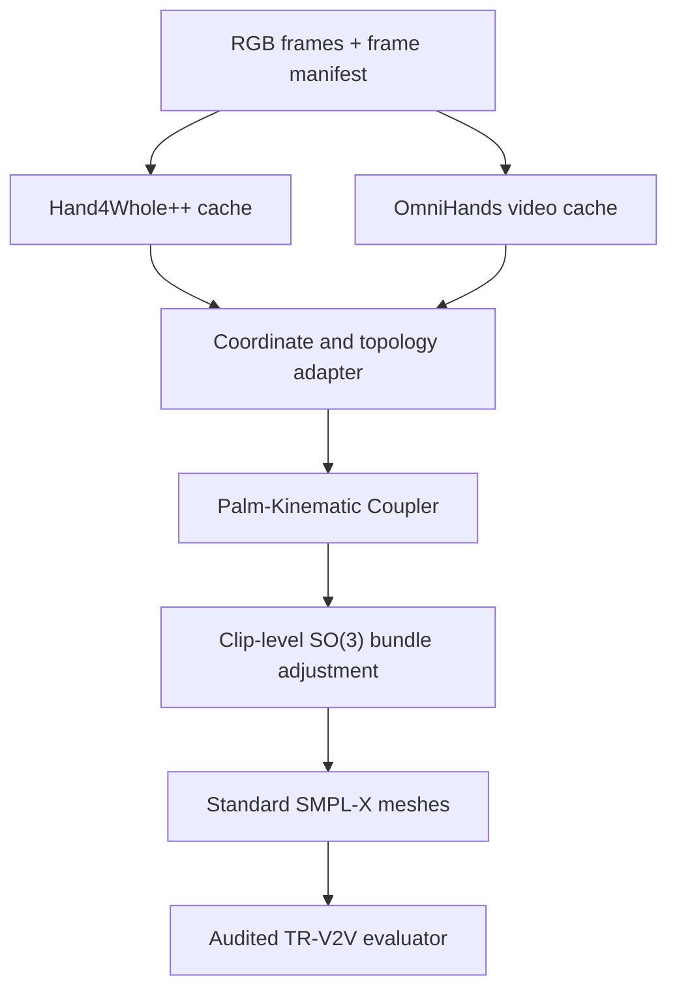

# SignPK-BA

## Sign-Structured Palm-Kinematic Coupling with Uncertainty-Gated Bidirectional Clip Optimization for 3D Sign Language Reconstruction

**Document type:** end-to-end research proposal and implementation specification  
**Primary benchmark:** SGNify TR-V2V, reported for UBody(-F), LHand, and RHand  
**Primary baseline:** DexAvatar  
**External components:** Hand4Whole++, OmniHands, SMPL-X/MANO, DexAvatar priors  
**Document date:** 2026-08-28  
**Status:** proposed method; numerical improvements must be established experimentally

---

## 0. Executive summary

This document proposes **SignPK-BA**, an offline monocular-video method for reconstructing standard-topology SMPL-X signing meshes. The method is designed specifically to reduce all three SGNify TR-V2V regions:

- **UBody(-F):** correct the root/spine/clavicle/shoulder/elbow/wrist chain, its depth, and the relative placement of the hands with respect to the torso;
- **LHand and RHand:** correct local finger articulation, palm orientation, and hand shape after per-hand translation alignment;
- **temporal behavior:** use bidirectional evidence to correct systematic errors, without imposing a zero-velocity prior that suppresses real signing motion.

The final system has four layers:

1. **Hand4Whole++ observer** provides per-frame SMPL-X body pose, WiLoR hand articulation, hand-conditioned upper-body reasoning through CHAM, and reusable image/body/hand features.
2. **OmniHands video observer** provides bidirectional, relation-aware MANO estimates for both hands, including local articulation, palm/root rotation, shape, hand-relative vertices, and the relative left-right root vector.
3. **Palm-Kinematic Coupler (PKC), the main learned contribution**, represents signing using explicit handshape, palm orientation, body-relative location, movement, and bimanual relation tokens. It predicts residual rotations and calibrated uncertainty for the upper-body and hand joints.
4. **Bidirectional clip bundle adjustment (BA)** refines a full `start:end` clip on the rotation manifold, using robust 2D evidence, uncertainty-weighted observer factors, palm and hand factors, phase-aware motion targets, shared shape, and interaction-gated physical terms.

The method deliberately does **not** use the following as its core:

- direct wrist copying;
- stronger first-order smoothing toward the previous frame;
- an additional generic biomechanical prior;
- universal hard contact constraints;
- silhouette-driven body shape fitting;
- dynamic-camera/global-trajectory machinery that is unnecessary for the fixed SGNify camera and translation-centered metric.

The recommended research target is:

| Level | UBody(-F) | LHand | RHand | Interpretation |
|---|---:|---:|---:|---|
| DexAvatar reference | 30.13 mm | 13.53 mm | 13.08 mm | reported baseline |
| Minimum credible target | <= 27.0 mm | <= 12.5 mm | <= 12.5 mm | clear improvement in all regions |
| Strong target | 24-26 mm | 11-12 mm | 11-12 mm | likely publication-strength if reproducible |

These are **go/no-go research targets**, not promised results.

---

## 1. Problem definition

### 1.1 Input

For each sign sequence `s`:

- monocular RGB frames from the SGNify video;
- sign-specific central segment `[start_s, end_s]`;
- optionally, a one-/two-handed sign class supplied by the SGNify/DexAvatar metadata;
- standard SMPL-X model files and the required MANO assets;
- pretrained Hand4Whole++, OmniHands, SignBPoser, and SignHPoser checkpoints.

The primary protocol processes only the evaluated central segment. Context outside `start:end` must not silently enter the main benchmark result. At temporal-window boundaries, use reflection or replicate padding and record that policy in the experiment metadata.

### 1.2 Output

For every evaluated frame:

- a standard SMPL-X mesh with 10,475 vertices and the exact expected face topology;
- SMPL-X parameters:
  - root orientation;
  - body pose;
  - left/right hand pose;
  - body shape;
  - face parameters, even if they remain frozen;
  - translation/camera parameters needed for rendering;
- a frame manifest that explicitly associates output mesh IDs with source video IDs and GT mesh IDs.

The primary output must remain compatible with the SGNify evaluator. Replacing the topology, exporting MANO-only meshes, or changing vertex order is forbidden.

### 1.3 Evaluation objective

The benchmark reports translation-aligned vertex-to-vertex error for three regions:

\[
\operatorname{TRV2V}_r(V, V^*)
=
\frac{1}{|r|}
\sum_{i\in r}
\left\|
(V_i-\bar V_r)-(V_i^*-\bar V_r^*)
\right\|_2,
\]

where `r` is UBody(-F), LHand, or RHand.

This has a direct design implication:

- independent hand translations are removed from LHand/RHand metrics;
- finger articulation, palm rigid orientation, and shape remain;
- for UBody(-F), the entire upper-body subset is centered only once, so relative torso-arm-hand geometry remains important;
- root/camera translation does not directly reduce the reported score, but it remains necessary for correct 2D reprojection and for recovering a consistent 3D pose.

### 1.4 Observed failure modes in the supplied DexAvatar results

The supplied output contains 12 signs and 298 unique frames. The principal qualitative patterns are:

| Sign/example | Persistent failure | Main target |
|---|---|---|
| `Akzeptieren` | true hands are relatively flat/downward; reconstruction remains claw-like for most of the sequence | both hands |
| `AusgebenGeldVerschwenden` | open-hand configuration becomes overly curled | both hands |
| `Ablehnen` | incorrect palm orientation and small upper-chain displacement | UBody + hands |
| `Arzt` | handshape and relative two-hand geometry are inconsistent | UBody + hands |
| `BroetchenAufschneiden` | persistent inter-hand depth/placement error and visible interpenetration/fusion | UBody + interaction |
| `BesuchenEinmischen` | close hand-body and hand-hand geometry remains ambiguous | UBody + interaction |
| `Blume` | hand near face has palm/finger orientation error | hand + wrist |
| `Auto`, `Dort`, `Boese` | predictions are already relatively good | uncertainty/fallback |

The errors are often stable across consecutive frames. This rules out stronger zero-velocity smoothing as the primary solution.

### 1.5 Scope and non-goals

In scope:

- fixed-camera, clean, central sign clips;
- offline/bidirectional inference;
- standard SMPL-X output;
- strong UBody and hand reconstruction;
- public-code-based components;
- reproducible SGNify evaluation.

Not primary goals:

- real-time operation;
- dynamic-camera world-space trajectories;
- face-expression improvement;
- lower-body reconstruction;
- heavy-occlusion recovery as the main contribution;
- language recognition or gloss prediction.

---

## 2. Evidence-driven method selection

### 2.1 Why another generic biomechanics prior is insufficient

DexAvatar's own ablations show that data filtering is useful, but adding biomechanical loss on top of the filtered body/hand prior gives tiny or mixed changes. For example, BPf to BPf+bio changes UBody(-F) from 30.28 to 30.44 mm, while HPf to HPf+bio changes the three reported regions only marginally. Therefore, the remaining error is unlikely to be solved by increasing anatomical regularization alone.

The proposed method keeps SignBPoser/SignHPoser as weak out-of-distribution safeguards, not dominant observations.

### 2.2 Why direct hand-body stitching is unsafe

Hand4Whole++ reports that directly copying the hand-estimator wrist orientation into the whole-body model severely worsens both hand and body errors. CHAM succeeds because hand evidence modulates body features and lets the body estimator preserve kinematic coherence.

Consequently:

- no direct assignment such as `smplx_wrist_R = mano_global_R` is allowed;
- all wrist and upper-chain corrections must be predicted or optimized jointly;
- MANO observations should constrain palm geometry and local articulation, not override the SMPL-X kinematic chain.

### 2.3 Why temporal evidence must be corrective rather than smoothing-only

OmniHands demonstrates that temporal context improves hand accuracy and stability, but its largest gain is in temporal acceleration error. The supplied DexAvatar sequences show systematic pose bias rather than only jitter. Therefore, the method uses temporal features to predict a corrected pose and corrected motion target, then regularizes toward that target.

It does not use:

\[
\mathcal L_{zero-vel}=\sum_t\|\theta_t-\theta_{t-1}\|^2
\]

as the principal temporal term.

### 2.4 Why generic temporal hand-body fusion is not enough novelty

DanceHMR already introduces residual hand-body fusion inside a temporal SMPL-X estimator. A proposal described only as "Hand4Whole++ plus a temporal transformer" would overlap substantially with that work.

SignPK-BA instead makes the signing structure explicit:

- handshape;
- palm orientation;
- location relative to the body;
- movement;
- bimanual relation;
- hold/stroke phase;
- interaction state.

These structured tokens are used both by the learned coupler and the clip optimizer.

### 2.5 Why OmniHands is used, and Dyn-HaMR/ViDiHand are not core dependencies

OmniHands is chosen because:

- video inference code and checkpoints are public;
- it supports single-hand and interacting-hand inputs;
- it explicitly predicts bimanual relative motion;
- it exposes MANO pose, shape, local/world-relative vertices, and relation outputs internally;
- its 9-frame bidirectional design is compatible with the short SGNify clips.

Dyn-HaMR is valuable as an optimization reference, but its main global-camera/world-motion machinery is misaligned with the fixed SGNify camera and translation-centered metric. ViDiHand is scientifically interesting but is not a reproducible core dependency until its implementation/checkpoints are actually released.

---

## 3. Method overview

### 3.1 Notation

For frame `t` and hand `h in {L,R}`:

- `I_t`: RGB frame;
- `Theta_t`: complete SMPL-X pose parameters;
- `beta`: body shape shared across the clip;
- `beta_h^O`: nuisance MANO shape used only to decode an OmniHands observer, fixed to a robust per-clip estimate; it is **not** an independent SMPL-X hand-shape variable;
- `V_t = SMPLX(Theta_t, beta)`: standard SMPL-X vertices;
- `J_t`: SMPL-X joints;
- `R_{t,j}`: joint rotation matrix;
- `P_t^h = (R_{p,t}^h, p_{w,t}^h)`: palm frame and wrist origin;
- `H_t`: Hand4Whole++ observations/features;
- `O_t`: OmniHands temporal observations/features;
- `z_t`: Palm-Kinematic token;
- `s_t`: soft phase gate, where high values represent stable/hold-like frames;
- `g_t`: soft interaction gate;
- `sigma_{t,j}`: predicted observation uncertainty;
- `delta xi_{t,j}`: test-time Lie-algebra rotation residual.

### 3.2 High-level computation



### 3.3 Main contributions intended for a paper

1. **Sign-structured, phonology-inspired palm-kinematic representation.** The model explicitly decomposes each manual signal into handshape, palm orientation, body-relative location, movement, and bimanual relation rather than using an unstructured concatenation of image features.
2. **Uncertainty-, phase-, and interaction-gated hand-to-body coupling.** The model learns when temporal hand evidence should correct the upper-body chain and when reliable per-frame body evidence should be retained.
3. **Metric-aware residual clip optimization.** A standard-topology SMPL-X sequence is refined on SO(3) using region-centered geometry, bidirectional motion targets, observer uncertainty, and gated interaction factors.
4. **Audited frame-identity evaluation.** Prediction/GT pairing is defined by explicit frame IDs, preventing silent ordinal misalignment.

### 3.4 Inference modes

The implementation should expose three modes:

| Mode | Components | Purpose |
|---|---|---|
| `h4w_init` | Hand4Whole++ only | fast baseline and integration test |
| `pkc_feedforward` | H4W++ + OmniHands + PKC | learned method without test-time optimization |
| `signpk_ba` | all components + clip BA | final method |

---

## 4. Reproducible codebase integration

### 4.1 Reviewed repository revisions

The implementation reviewed for this proposal used:

| Repository | Commit |
|---|---|
| DexAvatar | `a0dfd427f60f5811aadb35c8657b3856d47f56b5` |
| Hand4Whole++ | `f81d35ddd2b74206c40142243eb62b6d64ce0d65` |
| OmniHands | `935e1f580975263be799ebf56932e27ab18e1a01` |

Record revisions in every cache and experiment result. If a repository is updated, create a new cache namespace rather than overwriting earlier observations.

### 4.2 Integration principle

Do not directly modify the three external repositories for the first implementation. Build thin wrappers in a new project and cache observer outputs. This provides:

- independent environments for incompatible CUDA/PyTorch dependencies;
- deterministic feature/parameter caching;
- easier ablations;
- lower training cost because frozen experts run once;
- protection against accidental changes in upstream code.

Subprocess or RPC-style caching is acceptable initially. A shared Python environment can be considered only after the numerical interfaces are validated.

### 4.3 Hand4Whole++ interface

The reviewed `main/model.py` returns the following relevant tensors:

| Key | Expected shape | Use |
|---|---:|---|
| `smplx_root_pose` | `[B,3]` | root orientation initializer |
| `smplx_body_pose` | `[B,63]` | body initializer |
| `smplx_lhand_pose` | `[B,45]` | left hand initializer |
| `smplx_rhand_pose` | `[B,45]` | right hand initializer |
| `smplx_shape` | `[B,10]` | per-frame body shape observation |
| `smplx_trans` | `[B,3]` | camera translation observation |
| `smplx_vert_cam` | `[B,10475,3]` | validation/rendering observation |
| `smplx_kpt_cam` | model-dependent joint count | 3D joint observation |
| `rhand_bbox`, `lhand_bbox` | `[B,4]` | crop/relation features |

Add an export hook for:

- upper-body/body-pose tokens before `BodyRotationNet`;
- WiLoR right/left spatial hand features before `HandControlNet`;
- CHAM/HandControlNet fused features if memory permits;
- hand-existence flags and detector/keypoint confidences.

Recommended cache precision:

- parameters/joints/vertices: FP32;
- large frozen image features: FP16;
- frame IDs, bounding boxes, scores, coordinate metadata: exact JSON/FP32.

### 4.4 OmniHands interface

The internal `inference_temp_forward` result already includes:

| Key | Expected shape | Use |
|---|---:|---|
| `mano_pose_left/right` | `[B,48]` | global + 15 local joint rotations |
| `mano_pose6d_left/right` | `[B,96]` | continuous rotation representation |
| `mano_shape_left/right` | `[B,10]` | hand shape observation |
| `verts3d_left/right` | `[B,778,3]` | MANO local vertices |
| `joints3d_left/right` | `[B,21,3]` | MANO local joints |
| `verts3d_world_left/right` | `[B,778,3]` | relation-aware root-relative geometry |
| `joints3d_world_left/right` | `[B,21,3]` | relation-aware joints |
| `root_rel` | `[B,3]` | left-right relative root translation |
| `cam_aligned_left/right` | `[B,3]` | camera translation for overlay |
| temporal token | `[B,1024]` before MANO head | PKC feature input |

The published demo renders these outputs but does not persist them. Add one deterministic exporter that writes a tensor cache before rendering.

The official video configuration uses `SEQ_LEN=9`. The demo's temporal sampling gap is hard-coded separately from the configuration. Treat temporal gap as an explicit dataset parameter, never a hidden demo default.

### 4.5 DexAvatar integration

Use DexAvatar for:

- SignBPoser and SignHPoser decoders;
- anatomical/angle prior code where numerically stable;
- SMPLify-X infrastructure, robustifiers, and collision code if useful;
- baseline reproduction and output format comparison.

Do not preserve the following release behavior in the final optimizer:

- `data_3d_weights = [0,0,0]`;
- initialization anchors of 1200 for all three fitting stages;
- axis-angle L1 as the main rotation distance;
- causal previous-pose smoothing with fixed weight 2000;
- hand 3D loss restricted to an unreliable coordinate component;
- single-frame-only optimization.

The new optimizer can reuse modules, but its variables and objective should be implemented explicitly rather than patched through many legacy conditionals.

### 4.6 Licensing and model assets

Do not redistribute SMPL-X or MANO model files. Require the user to obtain them under their respective licenses. Record upstream code licenses and checkpoint usage restrictions before releasing a combined repository. A paper can describe the method independently of whether every pretrained model file is redistributable.

---

## 5. Canonical data and frame manifest

### 5.1 Never align frames by ordinal position

Create one authoritative manifest per sign:

```json
{
  "sign_name": "Akzeptieren",
  "segment_start": 62,
  "segment_end": 92,
  "sampling_policy": "logical_to_gt_x2",
  "records": [
    {
      "sequence_index": 0,
      "video_frame_id": 62,
      "rgb_path": ".../frame_000062.png",
      "gt_frame_id": 124,
      "gt_obj_path": ".../124.obj",
      "prediction_frame_id": 124,
      "prediction_obj_path": ".../mesh_000124.obj",
      "timestamp_sec": 2.48
    }
  ]
}
```

The example illustrates the observed `x2` mapping but must be generated from actual dataset metadata. Do not assume that every extracted RGB directory uses the same filename convention.

### 5.2 Manifest invariants

Before inference:

1. `sequence_index` is dense and starts at zero.
2. `video_frame_id` is unique.
3. `gt_frame_id` is unique.
4. all RGB paths exist;
5. every evaluated GT path exists, or the missing-frame policy is recorded;
6. the expected segment ordering is monotonic;
7. timestamps are monotonic;
8. the one-/two-hand class and dominant-hand convention are stored explicitly.

Before evaluation:

1. prediction IDs exactly equal expected GT IDs;
2. face arrays are exactly identical;
3. vertex count equals 10,475;
4. no NaN or Inf appears;
5. units are meters before conversion to millimeters;
6. shuffled or missing predictions raise an error rather than being silently paired.

### 5.3 Proposed Python data structure

```python
from dataclasses import dataclass
from pathlib import Path

@dataclass(frozen=True)
class FrameRecord:
    sequence_index: int
    video_frame_id: int
    gt_frame_id: int
    prediction_frame_id: int
    timestamp_sec: float
    rgb_path: Path
    gt_obj_path: Path | None

@dataclass(frozen=True)
class SignManifest:
    sign_name: str
    segment_start: int
    segment_end: int
    handedness_class: str
    dominant_hand: str
    records: tuple[FrameRecord, ...]
```

### 5.4 Observer cache layout

For each sign:

```text
cache/<experiment_hash>/<sign>/
  manifest.json
  h4w_params.npz
  h4w_features.pt
  omni_params.npz
  omni_features.pt
  keypoints_2d.npz
  cache_metadata.json
```

`cache_metadata.json` must contain:

- repository commits;
- checkpoint hashes;
- configuration hash;
- source frame IDs;
- coordinate-system definition;
- unit convention;
- left-hand mirroring policy;
- image resize/crop transforms;
- software versions;
- deterministic seed.

---

## 6. Coordinate, rotation, and topology harmonization

### 6.1 Canonical coordinate system

Use one documented camera convention throughout SignPK-BA:

- `+x`: image right;
- `+y`: image down;
- `+z`: forward from camera into the scene;
- distance unit: meters;
- rotation matrices act on column vectors unless stated otherwise.

Every observer must provide an explicit `3x3` transform from its native coordinates into this canonical system.

### 6.2 CoordinateAdapter

Implement:

```python
class CoordinateAdapter:
    def points_to_canonical(self, xyz, source: str): ...
    def rotations_to_canonical(self, R, source: str): ...
    def project(self, xyz_canonical, camera): ...
    def validate_reprojection(self, xyz, uv, camera, tolerance_px): ...
```

Do not infer axis flips only by visually looking at a rendered mesh. Validate using at least four non-coplanar or semantically known joints and their 2D projections.

### 6.3 Unit validation

Automatically reject caches with implausible bone lengths:

- wrist-to-middle-MCP outside a broad human range;
- shoulder width outside a broad human range;
- a sudden factor of 1000 between observers;
- sign-specific shape varying by orders of magnitude.

The validator should report the inferred scale but must not silently rescale without writing the transformation into metadata.

### 6.4 Rotation representation

Use:

- 6D rotation representation for PKC prediction;
- `3x3` matrices for composition and loss;
- Lie algebra `delta xi in R^3` for test-time residual optimization;
- axis-angle only at SMPL-X/MANO API boundaries.

Geodesic rotation distance:

\[
d_{SO(3)}(R_1,R_2)
=
\left\|\log(R_1^\top R_2)\right\|_2.
\]

Never use raw axis-angle subtraction as the primary rotation loss.

### 6.5 Left-hand convention

Left MANO commonly introduces mirroring or axis flips in different repositories. The reviewed OmniHands code flips the left-hand x coordinate in part of its world-relative output path. Therefore:

1. use the left MANO layer for left pose decoding;
2. tag every exported tensor as native/canonical and local/world-relative;
3. never apply a second mirror without a unit test;
4. verify left/right palm normals on a synthetic known pose;
5. verify that a symmetric two-hand pose produces the expected mirrored palm frames.

### 6.6 MANO to SMPL-X compatibility

The primary output path should optimize standard SMPL-X hand parameters to match MANO observations. It should not simply paste an unrelated MANO topology into the final mesh.

Recommended strategy:

1. Decode OmniHands MANO parameters with the exact source convention.
2. Convert the decoded MANO vertices/joints to canonical coordinates.
3. Root-align them at the wrist for local-hand losses.
4. Fit or supervise the SMPL-X hand pose through corresponding hand vertices/joints and palm frames.
5. Generate the final vertices only through the standard SMPL-X layer.

H4W++'s direct MANO-to-SMPL-X vertex transfer can be retained as an ablation, but the main result should use the topology-safe parametric path.

### 6.7 Topology tests

Add the following tests:

```text
test_vertex_count_is_10475
test_faces_equal_reference_exactly
test_hand_vertex_indices_match_reference
test_zero_pose_hand_correspondence
test_left_hand_mirror_convention
test_smplx_forward_is_differentiable
test_export_import_obj_preserves_order
```

---

## 7. Palm-Kinematic representation

The representation is **phonology-inspired**, not a claim that the model discovers or recognizes categorical linguistic units. Its variables are continuous geometric analogues of manual dimensions used in sign description. The main model requires neither gloss labels nor discrete phonological annotations; those labels may be explored only as an explicitly separate auxiliary-supervision ablation.

### 7.1 Stable palm frame

For each hand, use wrist `w`, index MCP `i`, middle MCP `m`, and pinky MCP `p`.

Define:

\[
\tilde x = i-p,
\qquad
\tilde y = m-w,
\qquad
x=\frac{\tilde x}{\|\tilde x\|},
\]

\[
z=\frac{x\times\tilde y}{\|x\times\tilde y\|},
\qquad
y=z\times x,
\qquad
R_{palm}=[x\;y\;z].
\]

Apply a handedness-specific sign convention so that the palm normal has the same semantic meaning for both hands. If the point configuration is degenerate, use the previous valid frame or an SVD/polar projection of a predicted basis and mark the confidence as low.

### 7.2 Handshape token

The handshape token should contain:

- 15 local MANO/SMPL-X joint rotations in 6D;
- selected normalized joint vectors;
- selected pairwise fingertip distances;
- finger flexion/splay summary values;
- observer MANO shape coefficients, explicitly tagged as nuisance features rather than SMPL-X optimization variables;
- observer disagreement statistics.

Do not include global translation in this subtoken. The hand TR-V2V metric removes translation, so the model should explicitly learn translation-invariant articulation.

### 7.3 Orientation token

Use:

- palm rotation encoded in 6D or as `log(R_ref^T R_palm)`;
- palm normal relative to camera;
- palm rotation relative to the forearm;
- angular velocity `log(R_t^T R_{t+1}) / delta_t`;
- H4W++/OmniHands palm-angle disagreement.

### 7.4 Location token

Use body-relative quantities:

- wrist minus sternum;
- wrist minus neck;
- wrist minus same-side shoulder;
- normalized depth relative to torso scale;
- signed distances to coarse body regions: chest, face/head, opposite arm;
- 2D normalized hand-box center and scale.

Body-relative location is more useful than absolute camera translation for UBody(-F).

### 7.5 Movement token

Use first-order target motion rather than a zero-motion penalty:

\[
v_{w,t}=\frac{p_{w,t+1}-p_{w,t}}{\Delta t},
\]

\[
\omega_{p,t}=\frac{\log(R_{p,t}^\top R_{p,t+1})}{\Delta t},
\]

plus local-articulation velocity. Normalize velocities by torso scale and actual timestamps.

### 7.6 Bimanual relation token

For two detected hands:

\[
z_t^{LR}=
\left[
p^L_w-p^R_w,
\log((R^R_p)^\top R^L_p),
IoU(B_L,B_R),
d_{min}(V_L,V_R),
d_{tip}(L,R),
q_t
\right],
\]

where `q_t` contains detection/relation confidence. For a missing hand, provide a learned missing token and an explicit validity mask; never substitute a zero vector without the mask.

### 7.7 Phase gate

The phase gate is a soft scalar predicted per frame:

\[
s_t=\sigma(f_{phase}(
\|v^L_w\|,
\|v^R_w\|,
\|\omega^L_p\|,
\|\omega^R_p\|,
\|\Delta a^L\|,
\|\Delta a^R\|
)).
\]

Interpretation:

- `s_t -> 1`: stable/hold-like; stronger temporal consistency is safe;
- `s_t -> 0`: stroke/transition; preserve predicted motion.

Pseudo-labels can be initialized using signer-normalized velocity quantiles, then the gate can be learned jointly.

### 7.8 Interaction gate

The interaction gate is:

\[
g_t=\sigma(f_{int}(IoU, d_{min}, root\_rel, relation\_confidence)).
\]

It controls:

- inter-hand relative-transform loss;
- hand-hand penetration loss;
- optional hand-body proximity factors;
- bimanual cross-attention strength.

Do not use a binary threshold in the main model. Soft gating is differentiable and reduces discontinuities when hands approach or separate.

---

## 8. Palm-Kinematic Coupler architecture

### 8.1 Design goals

PKC must:

- improve already good H4W++ predictions through residuals rather than regenerate the complete pose;
- use bidirectional temporal context;
- explicitly couple the hand evidence to the upper-body kinematic chain;
- preserve strong per-frame evidence when temporal/interaction observations are unreliable;
- output calibrated uncertainty for both training and test-time optimization;
- support one-handed and two-handed signs with one set of weights.

### 8.2 Input streams

For a window of `T=9` frames:

1. **Body stream**
   - H4W++ body tokens;
   - H4W++ upper-body rotations;
   - root-relative 3D joints;
   - 2D joints and confidence;
   - body shape observation;
   - torso scale and camera metadata.
2. **Left/right hand streams**
   - H4W++ WiLoR features and hand parameters;
   - OmniHands temporal token;
   - OmniHands MANO parameters and vertices;
   - palm-kinematic explicit features;
   - crop geometry and detector confidence.
3. **Relation stream**
   - left-right relative wrist vector;
   - relative palm rotation;
   - box IoU and 3D proximity;
   - sign handedness metadata;
   - phase and interaction indicators.

### 8.3 Recommended model size

Use a lightweight adapter rather than another foundation model:

| Parameter | Initial value |
|---|---:|
| temporal window | 9 frames |
| common hidden dimension | 256 |
| upper-body joint tokens | configurable set of 13-14 joints |
| hand joint tokens | 15 per hand |
| temporal layers | 4 |
| attention heads | 8 |
| MLP expansion | 4x |
| dropout | 0.1 |
| stochastic depth | 0-0.1 |
| rotation output | 6D residual |
| uncertainty output | one log-variance per joint/factor |

The upper-body joint set should include:

- root;
- spine1, spine2, spine3;
- neck and optionally head;
- left/right clavicle;
- left/right shoulder;
- left/right elbow;
- left/right wrist.

Jaw, eyes, facial expression, hips, knees, and ankles are not predicted by PKC in the main benchmark configuration.

### 8.4 Feature projection

Observer features have different dimensions. Project them independently:

```python
body_token = body_proj(h4w_body_token)          # -> [B,T,J_u,D]
left_token = hand_proj(h4w_left, omni_left)    # -> [B,T,J_h,D]
right_token = hand_proj(h4w_right, omni_right) # -> [B,T,J_h,D]
rel_token = relation_proj(explicit_rel)         # -> [B,T,1,D]
```

Add:

- temporal positional encoding based on actual timestamp, not only integer index;
- joint-type embedding;
- side embedding (`body`, `left`, `right`, `relation`);
- observer-validity embedding;
- optional sign handedness embedding.

### 8.5 Intra-hand encoding

Each hand encoder combines:

- local rotation tokens;
- MANO geometric/joint tokens;
- WiLoR/Omni visual features;
- palm orientation and motion;
- explicit validity/confidence.

Use local self-attention or a small kinematic graph block over the 15 joints. Preserve the MANO parent-child hierarchy through either:

- parent-relative positional embeddings; or
- adjacency-biased attention.

### 8.6 Relation-aware bimanual fusion

Cross-attention between left and right hands is modulated by `g_t`:

\[
\tilde F^L_t = F^L_t + g_t\operatorname{CrossAttn}(F^L_t,F^R_t,z^{LR}_t),
\]

\[
\tilde F^R_t = F^R_t + g_t\operatorname{CrossAttn}(F^R_t,F^L_t,z^{LR}_t).
\]

When one hand is absent or unreliable, `g_t` approaches zero and the valid hand follows its single-hand stream.

### 8.7 Hand-to-upper-body coupling

Use upper-body joint tokens as queries and the two hand streams as keys/values:

\[
B'_{t,j}=B_{t,j}+
\operatorname{CrossAttn}(
B_{t,j},
[\tilde F^L_{1:T},\tilde F^R_{1:T},z^{LR}_{1:T}]
).
\]

Apply a kinematic-distance bias so that:

- wrist queries receive the strongest local hand evidence;
- elbow and shoulder receive progressively smaller but nonzero evidence;
- clavicle/spine receive global bimanual/location evidence;
- finger articulation does not directly overwrite torso joints.

The learnable bias can be initialized from graph distance along the SMPL-X kinematic tree.

### 8.8 Temporal encoding

Temporal attention is bidirectional and operates on all nine frames. Its role is to predict the center-frame residual, not to average pose values.

Recommended factorization:

1. spatial/joint attention within each frame;
2. temporal attention per joint/semantic token;
3. bimanual relation attention;
4. hand-to-body cross-attention;
5. residual heads for the center frame.

This factorization is easier to debug than flattening all joints and frames into one unstructured sequence.

### 8.9 Output heads

PKC returns:

```python
PKCOutput(
    upper_rot6d_residual,   # [B,J_u,6]
    left_rot6d_residual,    # [B,15,6]
    right_rot6d_residual,   # [B,15,6]
    root_depth_residual,    # [B,1], optional and camera-supervised
    logvar_upper,           # [B,J_u]
    logvar_left,            # [B,15]
    logvar_right,           # [B,15]
    logvar_palm,            # [B,2]
    phase_gate,             # [B,1]
    interaction_gate,       # [B,1]
    corrected_velocity,     # structured velocity targets
)
```

Compose rotations rather than add parameters:

\[
\hat R_{t,j}^{PKC}
=
\operatorname{Exp}(\Delta r_{t,j})
R_{t,j}^{H4W}.
\]

### 8.10 Uncertainty features

The uncertainty head should receive:

- H4W++ vs OmniHands root-aligned hand MPVPE disagreement;
- palm-angle disagreement;
- H4W++ 2D reprojection error;
- OmniHands 2D reprojection error;
- detector confidence;
- hand box size and truncation;
- temporal forward/backward disagreement;
- proximity/interaction ambiguity;
- whether a hand was padded or missing in the temporal window.

Convert predicted log-variance to an optimization weight:

\[
w_{t,j}
=
\operatorname{clamp}
(\exp(-\ell_{t,j}),w_{min},w_{max}),
\]

where `ell` is log-variance. Clamping avoids an observer being completely ignored or dominating the optimizer.

### 8.11 One-hand routing

Do not reproduce DexAvatar's hard disabling of the non-dominant arm as the default behavior. Instead:

- use sign class as a prior feature;
- lower the non-dominant hand/arm observation weight when both detector and class agree;
- retain a weak body/2D factor because the non-dominant arm can still move;
- respect the official metric's left-hand exclusion only at evaluation time;
- verify which hand is considered dominant by the supplied `class0` metadata.

---

## 9. Training data and leakage-safe protocol

### 9.1 Data roles

| Dataset | Role | Priority and caution |
|---|---|---|
| SignAvatars | sign-domain temporal hand-body coupling | required practical source; annotations are automatically reconstructed/pseudo-GT |
| AGORA/EHF or an accessible subset of the H4W++ training mixture | upper-body/body calibration | optional Stage-A data; not sign-specific and subject to dataset licenses |
| InterHand2.6M/Re:InterHand | hand articulation and bimanual relation | optional Stage-A data; limited or absent full-body supervision |
| ARCTIC | bimanual articulation and interaction geometry | optional Stage-A data; hand-object domain and not a full upper-body coupling source |
| SGNify | final benchmark only | never tune on test GT |

SignAvatars provides a large number of SMPL-X sequences and a MANO representation, making it the most practical domain source. However, it should be filtered and used as structured supervision rather than treated as perfect motion capture.

The minimum feasible recipe uses SignAvatars plus the frozen public observer checkpoints. Generic Stage-A datasets are optional auxiliaries; lack of access to all of them must not block the main implementation. If Stage A is omitted, initialize the projection/adapter layers randomly, start with a shorter low-learning-rate geometry warm-up on the highest-confidence SignAvatars windows, and disclose that choice.

### 9.2 Split policy

Require:

- signer-disjoint training/validation/test splits;
- sign/gloss-disjoint diagnostic split where possible;
- sequence-level split, never frame-random split;
- no SGNify sign-specific weight tuning;
- all hyperparameters selected on held-out SignAvatars or generic validation data;
- the final SGNify run performed after the configuration is frozen.

### 9.3 Confidence filtering for pseudo-GT

Keep a training window only if:

- body and hand 2D reprojection errors are below thresholds;
- hand bone lengths are plausible and temporally stable;
- no topology or left/right mismatch exists;
- hand pose does not violate broad anatomical limits;
- consecutive frames do not contain unexplained identity/handedness flips;
- at least one observer is reliable for each supervised hand;
- the pseudo-GT and RGB crop are temporally synchronized.

Store a scalar quality weight `q_window` and multiply supervision losses by it rather than using only a hard keep/drop decision.

### 9.4 Training window construction

Default:

- `T=9` consecutive sampled frames;
- target is the center frame;
- actual timestamps included;
- reflect padding only for training augmentation, not to create synthetic labels;
- hands absent from the image receive validity masks;
- temporal gap randomly sampled from a small set consistent with source FPS.

Recommended gap augmentation:

```text
gap = 1 with probability 0.60
gap = 2 with probability 0.25
gap = 3 or 5 with probability 0.15
```

Adjust probabilities to the real sampling rates of the training datasets.

### 9.5 Data augmentation

Use:

- consistent spatial crop/scale/translation across a temporal window;
- mild color and illumination perturbation;
- small 2D keypoint noise proportional to detector confidence;
- crop truncation augmentation for hands near frame boundaries;
- random observation dropout, separately for H4W++ and OmniHands;
- temporal speed changes by choosing different frame gaps;
- occasional frame feature masking;
- limited motion blur for robustness, but not as the dominant augmentation;
- horizontal flip only with rigorously tested left/right pose, palm, and SMPL-X conversion.

Do not independently augment each frame spatially, because that introduces artificial camera motion and invalidates velocity/location supervision.

### 9.6 Curriculum

#### Stage A: generic geometry warm start

Train PKC on accurate generic body/hand data to learn:

- MANO/SMPL-X conventions;
- palm orientation;
- bimanual relations;
- hand-to-wrist/elbow/shoulder coupling;
- confidence prediction under synthetic observer noise.

#### Stage B: sign-domain temporal adaptation

Train on high-confidence SignAvatars windows with:

- all backbones frozen;
- centered regional mesh losses active;
- stronger handshape/palm supervision;
- phase and movement tokens active;
- lower learning rate;
- signer-disjoint validation.

#### Stage C: uncertainty calibration

Freeze rotation heads and calibrate uncertainty on held-out data. Optimize validation negative log likelihood and expected calibration error. Temperature scaling or a small calibration layer can be used.

### 9.7 Optimizer and schedule

Recommended starting configuration:

| Item | Value |
|---|---:|
| optimizer | AdamW |
| adapter learning rate | `2e-4` Stage A, `5e-5` Stage B |
| uncertainty head LR | `1e-4` |
| weight decay | `0.05` |
| warmup | 5% of total steps |
| schedule | cosine decay |
| gradient clipping | global norm 1.0 |
| precision | BF16 preferred, FP16 if required |
| effective batch | 32-64 windows |
| EMA | optional, decay 0.999 |
| seed runs | at least 3 for final ablation |

Backbone gradients must be explicitly disabled, and cached features should be detached before serialization.

---

## 10. Supervised training objective

### 10.1 Regional centered vertex loss

Define:

\[
C_r(V)=V_r-\frac{1}{|r|}\sum_{i\in r}V_i.
\]

Then:

\[
\mathcal L_{cV}
=
\lambda_U\rho(C_U(\hat V)-C_U(V^*))
+\lambda_L\rho(C_L(\hat V)-C_L(V^*))
+\lambda_R\rho(C_R(\hat V)-C_R(V^*)),
\]

where `rho` is mean L1, Charbonnier, or a robust vertex loss. This mirrors the translation-invariant structure of TR-V2V while remaining differentiable.

Do not use this as the only 3D loss. It must be combined with uncentered/body-relative joint and relation losses to preserve global structure.

### 10.2 Rotation loss

\[
\mathcal L_{rot}
=
\frac{1}{|J|}\sum_{j\in J}
w_j d_{SO(3)}(\hat R_j,R_j^*)^2.
\]

Use separate weights for:

- root/spine;
- clavicle/shoulder;
- elbow/wrist;
- palm/global hand;
- proximal/intermediate/distal finger joints.

Distal fingers should receive higher weight during Stage B.

### 10.3 Forward-kinematics joint loss

\[
\mathcal L_{FK}
=
\sum_{j\in J_U}
w_j\rho(\hat J_j-J_j^*)
+
\sum_{h\in\{L,R\}}
\rho(C_h(\hat J^h)-C_h(J^{h*})).
\]

This prevents a low rotation loss from accumulating into a large wrist error through the chain.

### 10.4 Palm frame loss

\[
\mathcal L_{palm}
=
\sum_h
d_{SO(3)}(\hat R_p^h,R_p^{h*})^2
+\lambda_n(1-\hat n_p^h\cdot n_p^{h*}).
\]

The normal term makes palm-facing direction explicit.

### 10.5 Bimanual relation loss

\[
\mathcal L_{rel}
=
g_t\left[
\rho((\hat p_w^L-\hat p_w^R)-(p_w^{L*}-p_w^{R*}))
+
\lambda_{relR}
d_{SO(3)}((\hat R_p^R)^\top\hat R_p^L,(R_p^{R*})^\top R_p^{L*})^2
\right].
\]

This loss mainly targets UBody and interaction coherence. It is not expected to directly reduce translation-centered LHand/RHand error unless it helps disambiguate palm/finger pose.

### 10.6 Target velocity loss

Use ground-truth or high-confidence pseudo-GT velocity:

\[
\mathcal L_{vel}
=
\sum_t\rho((\hat V_{t+1}-\hat V_t)-(V^*_{t+1}-V^*_t)).
\]

For rotations:

\[
\mathcal L_{angvel}
=
\sum_{t,j}
\rho(
\log(\hat R_{t,j}^\top\hat R_{t+1,j})
-
\log(R_{t,j}^{*\top}R_{t+1,j}^*)
).
\]

Acceleration/jitter can be reported as diagnostics. A strong acceleration penalty should not be enabled initially because it can weaken gradients and suppress legitimate fast signing changes.

### 10.7 2D reprojection loss

\[
\mathcal L_{2D}
=
\sum_i c_i
\rho_{GM}(\Pi(\hat J_i)-u_i),
\]

with detector confidence `c_i` and Geman-McClure or another bounded robustifier. Use separate thresholds for body and high-resolution hand keypoints.

### 10.8 Heteroscedastic uncertainty loss

For residual target `e` and predicted log-variance `ell`:

\[
\mathcal L_{NLL}
=
\exp(-\ell)e^2+\ell.
\]

Apply it to upper-body rotations, hand rotations, palm orientation, and relation factors. Prevent degenerate variance by clamping `ell` to a reasonable interval during training.

### 10.9 Interaction/penetration loss

Use only when `g_t` is high:

\[
\mathcal L_{pen}
=
g_t\sum_{(v,f)\in\mathcal C}
\max(0,-d_f(v))^2.
\]

This term prevents gross interpenetration. It should not force a specific contact distance or assume that all visually close hands are in contact.

### 10.10 Residual and prior losses

Keep corrections small unless supported by evidence:

\[
\mathcal L_{res}=\sum_j\|\Delta r_j\|_2^2.
\]

Use SignBPoser/SignHPoser weakly:

\[
\mathcal L_{signprior}
=
\|z_B\|^2+\|z_L\|^2+\|z_R\|^2,
\]

or as a likelihood on decoded rotations. Do not compare decoded and observed axis-angle vectors using raw L1.

### 10.11 Total training loss

\[
\begin{aligned}
\mathcal L_{train}={}&
\mathcal L_{cV}
+\lambda_{rot}\mathcal L_{rot}
+\lambda_{FK}\mathcal L_{FK}
+\lambda_{palm}\mathcal L_{palm}\\
&+\lambda_{rel}\mathcal L_{rel}
+\lambda_{vel}\mathcal L_{vel}
+\lambda_{angvel}\mathcal L_{angvel}
+\lambda_{2D}\mathcal L_{2D}\\
&+\lambda_{NLL}\mathcal L_{NLL}
+\lambda_{pen}\mathcal L_{pen}
+\lambda_{res}\mathcal L_{res}
+\lambda_{prior}\mathcal L_{signprior}.
\end{aligned}
\]

### 10.12 Initial normalized weights

Normalize spatial distances by a fixed reference scale before applying these starting weights:

| Loss | Initial weight |
|---|---:|
| UBody centered vertices | 1.0 |
| each hand centered vertices | 2.0 |
| rotation | 0.2 |
| FK joints | 1.0 |
| palm | 0.5 |
| relation | 0.5, multiplied by `g_t` |
| vertex velocity | 0.25 |
| angular velocity | 0.25 |
| 2D reprojection | 0.1 |
| uncertainty NLL | 0.05 |
| penetration | 0.02, multiplied by `g_t` |
| residual magnitude | 0.01 |
| sign priors | 0.01 |

These are initialization values. Select final values only on held-out validation data and record every search range.

---

## 11. End-to-end inference

### 11.1 Stage 0: validate and cache input

For every sign:

1. Read `start`, `end`, and sign class.
2. Build and validate the frame manifest.
3. Extract exactly the RGB frames represented by the manifest.
4. Run body/hand 2D detectors and cache their coordinates/confidences.
5. Verify image orientation and resolution.
6. Compute a deterministic experiment/configuration hash.

Failure must be explicit. Do not silently replace a missing evaluated frame with the previous image.

### 11.2 Stage 1: run Hand4Whole++

For each frame:

1. use a stable person crop shared or softly varying across the sign;
2. run Hand4Whole++ in evaluation mode;
3. save SMPL-X parameters, vertices, joints, hand boxes, and confidence;
4. save body and hand features required by PKC;
5. project predicted joints back into the original image and measure reprojection consistency;
6. map all observations to canonical coordinates.

The H4W++ output is the principal body initializer.

### 11.3 Stage 2: run OmniHands video mode

For each target frame:

1. construct a 9-frame bidirectional window using manifest indices;
2. reflection-pad at boundaries;
3. use temporally stable hand boxes, but do not average box centers so strongly that real movement is removed;
4. run token extraction and temporal inference;
5. export MANO pose/shape/vertices/joints, `root_rel`, camera outputs, temporal token, and validity;
6. map outputs to canonical coordinates;
7. compute H4W++/OmniHands disagreements.

For short sequences, report how many positions in each window are padding. Include padding ratio as an uncertainty feature.

### 11.4 Stage 3: build explicit tokens

For each frame:

- decode both observers using their native MANO/SMPL-X layers;
- create palm frames;
- compute local handshape features;
- compute body-relative wrist locations;
- compute timestamp-normalized movement;
- compute bimanual relations;
- build confidence and validity masks;
- predict initial phase/interaction gates.

### 11.5 Stage 4: PKC feed-forward prediction

Run PKC over each 9-frame window and compose center-frame residuals with H4W++ rotations. Aggregate outputs so that every evaluated frame has one prediction.

PKC outputs become:

- the feed-forward result for the `pkc_feedforward` ablation;
- the initialization and learned target for clip BA;
- uncertainty weights for observer/regularization factors.

### 11.6 Stage 5: clip bundle adjustment

Optimize the complete central sign jointly. The supplied sequences are short enough that no window stitching is required. For general longer sequences, use overlapping windows with consensus variables and optimize the overlap twice.

### 11.7 Stage 6: standard SMPL-X export

For each frame:

1. run the standard SMPL-X layer with refined parameters;
2. verify topology and units;
3. export OBJ/PKL/JSON using the actual prediction frame ID;
4. save a copy of the manifest beside results;
5. render front and side diagnostic views;
6. write per-frame objective terms and uncertainty.

### 11.8 Stage 7: audited evaluation

Evaluate by matching explicit frame IDs. Report:

- official TR-V2V result using the original evaluator behavior when reproduction is required;
- audited TR-V2V result with strict identity assertions;
- per-sign UBody/L/R;
- one-hand/two-hand and interaction subgroups;
- temporal diagnostic metrics.

---

## 12. Clip-level bundle adjustment

### 12.1 Variables

For clip length `N`:

Shared variables:

- body shape `beta`;
- focal-length correction, only if calibration is not fixed and validation shows benefit.

Standard SMPL-X has one body-shape vector and no independent left/right MANO `beta`. Therefore, keep each OmniHands MANO shape fixed to a robust per-clip median inside the observer adapter. Never expose it as a free SMPL-X variable. If an experiment optimizes a MANO nuisance shape for observer fitting, it must be eliminated before export and reported as a separate ablation.

Per-frame variables:

- root rotation residual;
- upper-body joint rotation residuals;
- left/right hand joint rotation residuals;
- camera/root translation needed for projection;
- optional small depth residual;
- optional SignB/H latent residuals.

Freeze:

- lower body;
- jaw, eyes, expression;
- non-evaluated parameters unless required for valid SMPL-X forward kinematics.

### 12.2 Residual parameterization

Initialize with PKC:

\[
R_{t,j}(\delta\xi)=\operatorname{Exp}(\delta\xi_{t,j})\hat R_{t,j}^{PKC}.
\]

This makes zero residual reproduce the learned result. It also gives each stage a safe fallback.

### 12.3 Test-time factors

#### Robust 2D factor

\[
E_{2D}=\sum_{t,i}c_{t,i}\rho_{GM}(\Pi(J_{t,i})-u_{t,i}).
\]

#### H4W++ upper-body observation factor

\[
E_{H4W}=\sum_{t,j\in J_U}w^{H}_{t,j}
d_{SO(3)}(R_{t,j},R^{H}_{t,j})^2.
\]

The weight decreases when H4W++ has high 2D error or strongly disagrees with reliable temporal hand evidence.

#### OmniHands local-hand factor

\[
E_{OmniHand}=\sum_{t,h}w^O_{t,h}
\rho(C_h(V^h_t)-C_h(V^{O,h}_t)).
\]

Use full XYZ root-aligned vertices/joints. Do not use only depth or only one coordinate.

#### Palm factor

\[
E_{palm}=\sum_{t,h}w^p_{t,h}
d_{SO(3)}(R^h_{p,t},R^{O,h}_{p,t})^2.
\]

Optionally include both H4W++ and OmniHands palm targets through uncertainty-weighted robust factors rather than averaging rotations in axis-angle space.

#### PKC anchor factor

\[
E_{PKC}=\sum_{t,j}w^{PKC}_{t,j}
d_{SO(3)}(R_{t,j},\hat R^{PKC}_{t,j})^2.
\]

#### Learned motion factor

\[
E_{motion}=\sum_{t,j}\alpha_{t,j}
\rho(
\log(R_{t,j}^\top R_{t+1,j})
-\widehat\omega^{PKC}_{t,j}
).
\]

Use:

\[
\alpha_{t,j}=\alpha_{stroke}(1-s_t)+\alpha_{hold}s_t,
\qquad
\alpha_{hold}>\alpha_{stroke}.
\]

The target remains PKC-predicted motion in both cases; the gate changes confidence, not the desired motion to zero.

#### Relative-hand factor

\[
E_{rel}=\sum_t g_t w^{rel}_t
\rho((p^L_{w,t}-p^R_{w,t})-r_t^{Omni}).
\]

Include relative palm rotation if reliable.

#### Shape consistency

One `beta` is shared by construction. Penalize deviation from the robust median H4W++ shape:

\[
E_{shape}=\rho(\beta-\operatorname{median}_t\beta_t^{H4W})
+\lambda_\beta\|\beta\|^2.
\]

Use per-clip shared shape in the main protocol. A single identity shape shared across all test signs is a separate transductive experiment and must be disclosed.

#### Penetration factor

Apply only when `g_t` and geometry confidence are high. Penalize negative signed distances, not arbitrary close distances.

#### Weak sign-prior factor

Use SignB/H likelihood only to suppress outliers. If it conflicts with strong high-confidence visual evidence, the visual/coupler terms should win.

### 12.4 Total BA objective

\[
\begin{aligned}
E={}&
\lambda_{2D}E_{2D}
+\lambda_H E_{H4W}
+\lambda_O E_{OmniHand}
+\lambda_p E_{palm}\\
&+\lambda_C E_{PKC}
+\lambda_m E_{motion}
+\lambda_r E_{rel}
+\lambda_s E_{shape}
+\lambda_{pen}E_{pen}
+\lambda_{prior}E_{signprior}.
\end{aligned}
\]

All observer terms must be normalized by the number of valid frames/joints/vertices so that a missing hand does not change the global scale of the objective.

### 12.5 Optimization stages

#### Stage BA-0: initialization validation

- no gradient updates;
- render PKC prediction;
- calculate every factor;
- reject coordinate/topology failures;
- save the zero-residual checkpoint.

#### Stage BA-1: shape and camera calibration

- variables: shared `beta`, camera translation, optional focal correction;
- freeze pose;
- 50-80 Adam iterations;
- low learning rate for focal length;
- use body 2D and robust shape observations;
- no silhouette by default.

#### Stage BA-2: upper-body kinematics

- variables: root, spine, neck/head, clavicles, shoulders, elbows, wrists;
- 80-120 Adam iterations;
- use H4W++, PKC, 2D, FK, palm, and motion factors;
- fingers remain fixed to PKC.

#### Stage BA-3: hand articulation

- variables: left/right 15-joint rotations and small wrist residuals;
- 100-160 Adam iterations;
- use root-aligned full-XYZ MANO vertices, palm frames, 2D hands, PKC, and weak SignHPoser;
- enable gated bimanual relation/penetration.

#### Stage BA-4: joint refinement

- all upper-body and hand residuals active;
- 80-120 Adam iterations at a lower learning rate;
- finish with 10-30 LBFGS iterations if stable;
- retain the best checkpoint by total normalized objective and 2D sanity score.

### 12.6 Suggested BA hyperparameters

| Stage | Adam LR | Rotation residual soft limit | Notes |
|---|---:|---:|---|
| BA-1 | `1e-2` shape, `1e-3` focal | N/A | clamp focal range |
| BA-2 | `3e-3` | 20 degrees body, 30 degrees wrist | compose on SO(3) |
| BA-3 | `2e-3` | 25 degrees fingers | allow larger only with high confidence |
| BA-4 | `5e-4` to `1e-3` | inherited | joint fine tuning |

Use soft residual penalties rather than hard clipping in the final model, but hard safety clamps can prevent numerical explosion during early development.

### 12.7 Robustifier scales

Initial choices:

- body 2D: 8-12 px at original image resolution;
- hand 2D: 4-8 px;
- 3D hand vertex: 5-10 mm;
- wrist relation: 10-20 mm;
- palm rotation: 10-20 degrees;
- H4W/PKC rotation: joint-specific.

Scale thresholds when images are resized. Store whether a threshold is expressed in original or crop coordinates.

### 12.8 Early stopping and fallback

Stop or revert a stage if:

- objective is NaN/Inf;
- hand/body reprojection error grows beyond a configured ratio;
- mesh topology changes;
- bone lengths become implausible;
- palm normal flips by approximately 180 degrees without corresponding evidence;
- a hand switches side;
- total loss improves only by exploiting a disabled/missing region.

Always retain:

- H4W++ initialization;
- PKC feed-forward checkpoint;
- best checkpoint from each BA stage.

Per-frame uncertainty can trigger partial fallback: keep PKC/H4W pose for a reliable joint rather than reverting the full sequence.

### 12.9 Optimizer pseudocode

```python
def optimize_clip(manifest, h4w, omni, pkc, smplx, cfg):
    state = initialize_from_pkc(pkc, shared_shape=robust_shape(h4w))
    accepted = snapshot(state)

    validate_zero_residual(state, manifest, smplx)

    for stage in cfg.ba.stages:
        set_trainable_variables(state, stage.variables)
        optimizer = build_adam(state, stage)
        stage_best = snapshot(state, loss=float("inf"))

        for _ in range(stage.iterations):
            optimizer.zero_grad(set_to_none=True)
            output = smplx_forward(state)
            factors = compute_factors(
                output=output,
                state=state,
                h4w=h4w,
                omni=omni,
                pkc=pkc,
                manifest=manifest,
                config=stage,
            )
            loss = normalized_weighted_sum(factors, stage.weights)
            assert torch.isfinite(loss)
            loss.backward()
            torch.nn.utils.clip_grad_norm_(trainable_parameters(state), 1.0)
            optimizer.step()

            if passes_sanity_checks(state, output, factors) and loss < stage_best.loss:
                stage_best = snapshot(state, loss, factors)

        # Loss weights can change between stages, so never compare raw losses
        # across stages. Accept only the best valid state within this stage.
        state = restore(stage_best)
        accepted = snapshot(state)

    if cfg.ba.use_lbfgs:
        candidate = short_lbfgs_refinement(state, ...)
        candidate_score = evaluate_final_objective(candidate)
        accepted_score = evaluate_final_objective(accepted)
        if passes_final_sanity_checks(candidate) and candidate_score < accepted_score:
            accepted = snapshot(candidate)

    return accepted
```

---

## 13. Software architecture

### 13.1 Proposed project tree

```text
signpk-ba/
  README.md
  pyproject.toml
  configs/
    data/sgnify.yaml
    model/pkc_base.yaml
    train/stage_a.yaml
    train/stage_b.yaml
    fit/signpk_ba.yaml
    eval/trv2v.yaml
  signpk/
    data/
      frame_manifest.py
      sgnify_dataset.py
      signavatars_dataset.py
      window_sampler.py
      cache_schema.py
    observers/
      h4w_wrapper.py
      omnihands_wrapper.py
      dex_priors.py
      keypoint_provider.py
    geometry/
      coordinates.py
      rotations.py
      palm_frame.py
      mano_smplx.py
      topology.py
      robustifiers.py
    models/
      explicit_tokens.py
      hand_encoder.py
      relation_encoder.py
      temporal_encoder.py
      palm_kinematic_coupler.py
      uncertainty.py
      gates.py
    losses/
      centered_vertex.py
      rotation.py
      kinematic.py
      temporal.py
      interaction.py
      uncertainty.py
    optimization/
      state.py
      factors.py
      clip_ba.py
      stages.py
      fallback.py
    evaluation/
      trv2v_audited.py
      temporal_metrics.py
      subgroup_metrics.py
    export/
      smplx_export.py
      diagnostics.py
    utils/
      config_hash.py
      logging.py
      reproducibility.py
  scripts/
    build_sgnify_manifest.py
    cache_h4w.py
    cache_omnihands.py
    validate_observers.py
    train_pkc.py
    fit_sgnify.py
    evaluate_sgnify.py
    render_diagnostics.py
  tests/
    test_frame_manifest.py
    test_coordinates.py
    test_left_hand.py
    test_palm_frame.py
    test_topology.py
    test_centered_v2v.py
    test_evaluator_pairing.py
    test_zero_residual.py
```

### 13.2 Separation of concerns

- observer wrappers do no optimization;
- geometry modules contain no dataset-specific paths;
- PKC consumes normalized cache objects, not repository-native dictionaries;
- BA consumes PKC/observer observations through factor interfaces;
- evaluator never infers frame correspondence from array order;
- exports are produced only from the final standard SMPL-X layer.

### 13.3 Typed cache objects

```python
@dataclass
class HandObservation:
    pose_rotmat: Tensor       # [T,16,3,3]
    shape: Tensor             # [T,10]
    vertices_local: Tensor    # [T,778,3]
    joints_local: Tensor      # [T,21,3]
    palm_rotmat: Tensor       # [T,3,3]
    wrist_world_rel: Tensor   # [T,3]
    bbox_xyxy: Tensor         # [T,4]
    confidence: Tensor        # [T]
    valid: Tensor             # [T], bool

@dataclass
class BodyObservation:
    root_rotmat: Tensor
    body_rotmat: Tensor
    shape: Tensor
    joints3d: Tensor
    keypoints2d: Tensor
    keypoint_confidence: Tensor
    camera: dict[str, Tensor]

@dataclass
class CouplerPrediction:
    pose_rotmat: Tensor
    angular_velocity: Tensor
    vertex_velocity: Tensor
    log_variance: dict[str, Tensor]
    phase_gate: Tensor
    interaction_gate: Tensor
```

### 13.4 Configuration discipline

Every run must produce a resolved configuration file and a hash. Do not encode method choices in filenames or shell scripts only.

At minimum record:

- frame mapping and sampling gap;
- observer checkpoints/commits;
- coordinate transforms;
- MANO/SMPL-X settings (`use_pca`, hand mean, gender);
- PKC architecture;
- loss weights;
- BA stages and iterations;
- active vertex subsets;
- evaluator version;
- random seed;
- GPU/software versions.

### 13.5 Recommended CLI

```bash
python scripts/build_sgnify_manifest.py \
  --config configs/data/sgnify.yaml

python scripts/cache_h4w.py \
  --manifest-root data/manifests \
  --output-root cache/h4w

python scripts/cache_omnihands.py \
  --manifest-root data/manifests \
  --sequence-length 9 \
  --sequence-gap 1 \
  --output-root cache/omni

python scripts/train_pkc.py \
  --config configs/train/stage_b.yaml

python scripts/fit_sgnify.py \
  --config configs/fit/signpk_ba.yaml \
  --mode signpk_ba

python scripts/evaluate_sgnify.py \
  --config configs/eval/trv2v.yaml \
  --strict-frame-ids
```

### 13.6 Logging

Save per frame and per stage:

- every loss/factor before weighting;
- active observation counts;
- predicted uncertainty;
- phase/interaction gates;
- 2D reprojection errors;
- palm disagreement;
- rotation residual magnitude;
- optimizer convergence;
- fallback events;
- final per-region error when GT is available for evaluation.

Use one machine-readable table (`parquet` or `jsonl`) plus concise console output.

### 13.7 Reproducibility

- set Python/NumPy/PyTorch seeds;
- enable deterministic algorithms for benchmark runs where feasible;
- record nondeterministic CUDA operations;
- cache observers once and never regenerate them inside ablation runs;
- use the same frame manifest for every baseline;
- run at least three PKC training seeds;
- report mean and standard deviation for learned-method ablations;
- preserve the exact baseline output before any refinement.

---

## 14. Core implementation pseudocode

### 14.1 Palm frame

```python
def make_palm_frame(joints, side, eps=1e-8):
    # joints: [..., 21, 3], canonical MANO ordering
    wrist = joints[..., WRIST, :]
    index = joints[..., INDEX_MCP, :]
    middle = joints[..., MIDDLE_MCP, :]
    pinky = joints[..., PINKY_MCP, :]

    x = normalize(index - pinky, eps)
    y_hint = normalize(middle - wrist, eps)
    z = normalize(torch.cross(x, y_hint, dim=-1), eps)
    y = normalize(torch.cross(z, x, dim=-1), eps)

    if side == "left":
        # Exact semantic sign is fixed by a synthetic convention test.
        x, z = -x, -z

    R = torch.stack([x, y, z], dim=-1)
    R = project_to_so3(R)
    valid = palm_condition_number(joints) < PALM_DEGENERACY_THRESHOLD
    return R, wrist, valid
```

### 14.2 Regional centering

```python
def center_region(vertices, indices):
    region = vertices[..., indices, :]
    return region - region.mean(dim=-2, keepdim=True)

def centered_vertex_loss(pred, target, indices, valid=None):
    error = charbonnier(
        center_region(pred, indices) - center_region(target, indices)
    )
    return masked_mean(error, valid)
```

### 14.3 Observer disagreement

```python
def hand_disagreement(h4w_hand, omni_hand):
    h4w_v = root_align(to_canonical(h4w_hand.vertices))
    omni_v = root_align(to_canonical(omni_hand.vertices))
    vertex_disagreement = (h4w_v - omni_v).norm(dim=-1).mean(dim=-1)
    palm_disagreement = so3_distance(h4w_hand.palm_R, omni_hand.palm_R)
    return torch.stack([
        vertex_disagreement,
        palm_disagreement,
        h4w_hand.reprojection_error,
        omni_hand.reprojection_error,
        h4w_hand.detector_confidence,
        omni_hand.detector_confidence,
    ], dim=-1)
```

### 14.4 PKC forward pass

```python
def forward(self, window):
    body = self.body_projection(window.h4w_body)
    left = self.left_hand_encoder(window.left_hand)
    right = self.right_hand_encoder(window.right_hand)
    relation = self.relation_encoder(window.relation)

    phase = self.phase_gate(window.motion_features)
    interaction = self.interaction_gate(window.relation_features)

    left, right = self.bimanual_fusion(
        left, right, relation, gate=interaction,
        left_valid=window.left_valid,
        right_valid=window.right_valid,
    )

    body = self.hand_to_body(
        body, left, right, relation,
        joint_distance_bias=self.kinematic_bias,
    )

    body, left, right = self.temporal_blocks(
        body, left, right,
        timestamps=window.timestamps,
        validity=window.validity,
    )

    center = window.length // 2
    return self.output_heads(
        body[:, center], left[:, center], right[:, center],
        phase[:, center], interaction[:, center],
        window.disagreement[:, center],
    )
```

### 14.5 Standard output construction

```python
def build_standard_smplx(state, model):
    return model(
        betas=state.beta.expand(state.num_frames, -1),
        global_orient=matrix_to_axis_angle(state.root_R),
        body_pose=matrix_to_axis_angle(state.body_R).flatten(1),
        left_hand_pose=matrix_to_axis_angle(state.left_hand_R).flatten(1),
        right_hand_pose=matrix_to_axis_angle(state.right_hand_R).flatten(1),
        jaw_pose=state.frozen_jaw,
        leye_pose=state.frozen_leye,
        reye_pose=state.frozen_reye,
        expression=state.frozen_expression,
        transl=state.translation,
    )
```

---

## 15. Evaluation audit and corrected implementation

### 15.1 Issues in the supplied evaluator

The supplied evaluator:

- multiplies segment boundaries by two for GT frame selection;
- skips missing GT IDs;
- pairs method meshes with GT using ordinal index;
- does not assert identical prediction/GT frame IDs;
- centers every region independently;
- computes `point_error_common_center` by independently mean-centering both point clouds and adding the same center.

The last operation is algebraically equivalent to translation alignment:

\[
(A-\bar A+c)-(B-\bar B+c)
=
(A-\bar A)-(B-\bar B).
\]

Therefore, the reported auxiliary "wrist" error is not actually wrist-centered under that function.

### 15.2 Strict evaluator algorithm

```python
def evaluate_sign_strict(manifest, pred_meshes, gt_meshes, subsets):
    expected_ids = [r.gt_frame_id for r in manifest.records]
    assert set(pred_meshes) == set(expected_ids)
    assert set(gt_meshes) == set(expected_ids)

    errors = {name: [] for name in subsets}
    reference_faces = None

    for frame_id in expected_ids:
        pred_v, pred_f = load_obj(pred_meshes[frame_id])
        gt_v, gt_f = load_obj(gt_meshes[frame_id])

        assert pred_v.shape == gt_v.shape == (10475, 3)
        np.testing.assert_array_equal(pred_f, gt_f)
        assert np.isfinite(pred_v).all()

        for name, ids in subsets.items():
            p = pred_v[ids]
            g = gt_v[ids]
            p = p - p.mean(0, keepdims=True)
            g = g - g.mean(0, keepdims=True)
            errors[name].append(np.linalg.norm(p - g, axis=-1))

    return aggregate(errors)
```

### 15.3 Evaluator unit tests

| Test | Expected result |
|---|---|
| prediction exactly equals GT | zero error |
| add arbitrary global translation | zero TR-V2V change |
| add different translation to each independently evaluated hand | hand TR-V2V unchanged |
| rotate one hand | hand TR-V2V increases |
| shuffle prediction filenames | strict failure |
| remove one prediction | strict failure |
| same count, wrong IDs | strict failure |
| change one face index | strict failure |
| class0 sign | left-hand reporting/exclusion follows documented convention |

### 15.4 Metrics to report

Primary:

- mean UBody(-F) TR-V2V;
- mean LHand TR-V2V;
- mean RHand TR-V2V.

Secondary diagnostics:

- median and 95th-percentile regional error;
- per-sign regional error;
- wrist/palm rotation error if GT joints/parameters are available;
- body MPJPE after appropriate alignment;
- root-aligned hand MPVPE;
- velocity error;
- acceleration error;
- jitter;
- penetration frequency/depth;
- 2D body/hand reprojection error.

Do not select the final model only by temporal smoothness. A perfectly static but incorrect hand can have low jitter.

### 15.5 Subgroup reports

Report:

- one-handed vs two-handed signs;
- close/interacting vs separated hands;
- low- vs high-velocity frames;
- high- vs low-observer-disagreement frames;
- early/middle/late segment frames;
- each of the 12 qualitative signs supplied for development diagnostics.

---

## 16. Baselines and ablation plan

### 16.1 Required baselines

| ID | Method | Purpose |
|---|---|---|
| B0 | published/released DexAvatar | main reference |
| B1 | Hand4Whole++ feed-forward | measure new initializer alone |
| B2 | H4W++ initialization inside original Dex fitting | isolate initialization effect |
| B3 | OmniHands-to-SMPL-X hand fitting only | isolate temporal hand observer |
| B4 | PKC feed-forward | learned contribution before BA |
| B5 | SignPK-BA full | final result |

If DanceHMR code/checkpoints become reproducible, add it as a video whole-body baseline. If ViDiHand code/checkpoints become available, compare it as a hand observer rather than silently replacing OmniHands.

### 16.2 Incremental ablations

| ID | Configuration |
|---|---|
| A0 | DexAvatar release |
| A1 | replace SMPLer-X/HaMeR initialization with H4W++ |
| A2 | A1 + topology-safe SMPL-X hand fitting |
| A3 | A2 + OmniHands full-XYZ local-hand factor |
| A4 | A3 + shared SMPL-X body shape and fixed median MANO observer shape per clip |
| A5 | A4 + PKC without explicit palm/location/movement tokens |
| A6 | A4 + full PKC |
| A7 | A6 + clip BA |
| A8 | A7 + uncertainty weighting |
| A9 | A8 + phase gate |
| A10 | A9 + interaction gate/penetration |

### 16.3 Leave-one-component-out ablations

From the full method remove one at a time:

- no H4W++ CHAM features, only its final parameters;
- no OmniHands temporal token;
- no explicit handshape token;
- no palm orientation token;
- no body-relative location token;
- no movement token;
- no bimanual relation token;
- no uncertainty;
- no phase gate;
- no interaction gate;
- no shared shape;
- no SignB/H weak prior;
- no BA;
- no regional centered training loss;
- direct wrist copy;
- causal zero-velocity smoothing.

The direct-wrist and zero-velocity ablations are important negative controls.

### 16.4 Temporal-window ablations

Test:

- frame-only (`T=1`);
- `T=5`;
- `T=9`;
- `T=17`, if memory permits;
- causal past-only window;
- bidirectional window;
- gaps 1, 2, and 5 with timestamp normalization.

The default remains `T=9`, bidirectional, consecutive evaluated frames.

### 16.5 Shape protocol ablations

Compare:

1. per-frame H4W++ shape;
2. robust median shape, fixed;
3. one optimized shape per clip;
4. one optimized identity shape across all signs from the same signer.

Only (1)-(3) belong to the main non-transductive result. Report (4) separately and label it as cross-sequence identity calibration.

### 16.6 Acceptance gates

Before training PKC, require:

- strict evaluator identity tests pass;
- H4W++ output exports valid 10,475-vertex SMPL-X meshes;
- OmniHands local-hand meshes align with expected left/right orientation;
- frame IDs are exact;
- H4W++ initialization does not catastrophically worsen hands;
- observer caches reproduce identical hashes on repeated runs.

Component-specific go/no-go:

| Component | Minimum gate |
|---|---|
| H4W++ initializer | UBody improves or remains within 0.2 mm; no hand worsens >0.3 mm |
| OmniHands factor | average hand TR-V2V improves; interaction subset improves UBody |
| PKC | improves UBody and average of available hands over H4W++/Omni fusion |
| BA | improves primary metric without increasing 2D error or failure count |
| interaction factor | improves interacting subset and does not hurt separated subset materially |

Use validation data for gates before opening final SGNify results.

---

## 17. Paper-level method proposal

### 17.1 Candidate title

**SignPK-BA: Sign-Structured Palm-Kinematic Coupling for 3D Sign Language Reconstruction**

Alternative:

**From Hands to Upper Body: Uncertainty-Gated Palm-Kinematic Bundle Adjustment for 3D Signing Avatars**

### 17.2 Draft abstract

Monocular 3D sign language reconstruction requires accurate finger articulation together with a coherent upper-body kinematic chain. Existing optimization-based approaches use sign-specific pose priors but remain limited by frame-wise hand estimates, depth ambiguity, and temporal regularizers that can preserve systematic pose errors. We introduce SignPK-BA, an offline SMPL-X reconstruction framework that couples hand and body evidence through a sign-structured, phonology-inspired palm-kinematic representation. Our representation decomposes the manual signal into handshape, palm orientation, body-relative location, movement, and bimanual relation without requiring gloss or discrete phonological labels. A lightweight bidirectional adapter fuses a hand-conditioned whole-body observer with a temporal interacting-hand observer and predicts residual upper-body and hand rotations together with calibrated uncertainty, sign phase, and interaction gates. We then refine the complete sign clip on the SO(3) manifold using robust image evidence, root-relative hand geometry, palm frames, learned motion targets, shared shape, and gated physical factors. The output retains standard SMPL-X topology and is evaluated using a frame-identity-audited TR-V2V protocol. Experiments should evaluate whether explicit palm-kinematic coupling improves UBody(-F), LHand, and RHand reconstruction over DexAvatar and strong feed-forward/video baselines.

The final paper abstract must replace the last sentence with actual quantitative results after experiments.

### 17.3 Claimed contributions, conditional on validation

1. A palm-kinematic representation aligned with the manual structure of signing and usable without gloss or phonological labels.
2. A lightweight uncertainty-gated temporal adapter that couples interacting-hand evidence to the complete upper-body kinematic chain.
3. A residual clip-level SMPL-X optimizer that uses learned motion instead of zero-velocity smoothing and activates interaction constraints only when supported by evidence.
4. A strict frame-identity evaluation protocol and a detailed analysis of how translation-centered regional metrics change optimization priorities.

### 17.4 Positioning against related methods

| Method | What it contributes | Gap addressed by SignPK-BA |
|---|---|---|
| SGNify | linguistic priors for signing-avatar fitting | stronger learned hand/body video evidence and explicit metric alignment |
| DexAvatar | sign-specific hand/body VAEs, biomechanics, fitting | systematic handshape/palm bias; weak 3D observer use; causal smoothing |
| Hand4Whole++ | hand-conditioned body features and coherent wrist orientation | single-frame; no sign phase or temporal bimanual motion |
| OmniHands | temporal interacting-hand reconstruction and relative motion | no complete upper-body SMPL-X coupling |
| DanceHMR | generic temporal residual hand-body fusion | no explicit sign-structured palm/location/movement representation or clip BA |
| Dyn-HaMR | global 4D hand trajectory optimization | dynamic-camera focus; not metric/upper-body specialized |

### 17.5 Central scientific hypothesis

The central hypothesis is:

> Explicitly modeling the palm frame, handshape, body-relative hand location, movement, and bimanual relation provides a more effective bridge between detailed hand observations and upper-body reconstruction than generic pose priors or unstructured temporal fusion.

This hypothesis is falsifiable through the token-removal ablations and per-region TR-V2V analysis.

### 17.6 Expected reviewer questions

#### Is the method only an ensemble of H4W++ and OmniHands?

Answer with evidence that:

- naive parameter copying is a baseline and performs worse;
- PKC learns structured residuals and uncertainty;
- explicit palm/location/movement token ablations matter;
- the clip optimizer provides gains beyond feed-forward fusion;
- output remains one coherent SMPL-X model.

#### Is the method benchmark-specific?

Regional centering is metric-aware, but palm-kinematic coupling is broadly relevant to sign reconstruction. Demonstrate transfer or qualitative evaluation on a second sign dataset and report non-centered 3D/2D metrics.

#### Does SignAvatars pseudo-GT merely reproduce its annotator bias?

Use confidence filtering, generic accurate hand/body data, frozen experts, signer-disjoint splits, and SGNify motion-capture evaluation. Include an ablation trained without SignAvatars and a label-quality analysis.

#### Is temporal improvement only smoothing?

Report frame-wise TR-V2V, velocity error, and negative control with zero-velocity smoothing. Show systematic handshape corrections during high-motion frames.

#### Does contact improve the benchmark by exploiting GT artifacts?

Contact is not a core factor. Use only interaction-gated penetration prevention and show the full result without it.

#### Is one shared identity shape across test signs transductive?

The main result uses one shape per clip. Cross-sign shared identity is reported separately.

---

## 18. Failure analysis and risk mitigation

### 18.1 Observer domain mismatch

**Risk:** OmniHands/H4W++ are trained largely on generic hands and interactions, not German sign language.

**Mitigation:**

- sign-domain PKC training;
- retain multiple observations rather than trust one expert;
- confidence/disagreement gating;
- weak SignHPoser prior;
- high-resolution hand crops;
- per-sign qualitative diagnostics.

### 18.2 Pseudo-GT bias in SignAvatars

**Risk:** the adapter learns systematic errors from automatically reconstructed labels.

**Mitigation:**

- confidence-weighted windows;
- accurate generic hand/body warm start;
- consistency with 2D image evidence;
- weak rather than full-backbone fine-tuning;
- held-out motion-capture benchmark;
- audit extreme hand poses before training.

### 18.3 Coordinate and left-hand bugs

**Risk:** a visually plausible overlay can hide a reflection, unit, or rotation convention error.

**Mitigation:**

- canonical coordinate adapter;
- synthetic known-pose tests;
- palm-normal tests;
- root-aligned vertex checks;
- side-view rendering;
- no silent rescaling/mirroring.

### 18.4 Over-optimization to pseudo observations

**Risk:** BA follows an incorrect Omni/H4W estimate more strongly than the image.

**Mitigation:**

- uncertainty weights;
- bounded robustifiers;
- small manifold residuals;
- 2D sanity constraints;
- best-stage checkpoints and per-joint fallback;
- compare feed-forward and optimized results.

### 18.5 Incorrect contact assumptions

**Risk:** hands that look close in 2D may be separated in depth; SGNify GT may contain implausible contact.

**Mitigation:**

- soft interaction gate;
- use penetration prevention rather than forced attraction;
- include no-contact ablation;
- do not apply contact to separated/one-hand signs.

### 18.6 Short temporal clips

**Risk:** the 9-frame observer sees repeated boundary padding in 13-frame signs.

**Mitigation:**

- include padding ratio in uncertainty;
- use T=5 ablation for boundaries;
- train with padding/dropout augmentation;
- optimize the complete clip after feed-forward prediction.

### 18.7 Metric exploitation

**Risk:** regional centering permits unrealistic hand translation while hand scores remain good.

**Mitigation:**

- report UBody and body-relative wrist errors;
- retain 2D, FK, and relation losses;
- report non-centered diagnostics;
- visually inspect side views;
- never optimize L/R centered loss alone.

### 18.8 Shape leakage

**Risk:** pooling all benchmark signs from the same signer could use test-set identity information.

**Mitigation:** per-clip shape is the primary protocol; cross-clip calibration is a labeled supplemental experiment.

---

## 19. Implementation roadmap

### Milestone 0: benchmark integrity

Deliverables:

- canonical frame manifests;
- strict evaluator and unit tests;
- reproduced DexAvatar numbers or documented discrepancy;
- per-sign error tables;
- baseline meshes preserved.

Exit condition: no ordinal frame pairing and exact topology tests pass.

### Milestone 1: Hand4Whole++ initializer

Deliverables:

- H4W++ wrapper/cache/export;
- standard SMPL-X output for every SGNify frame;
- H4W++ feed-forward TR-V2V;
- H4W++ initialized Dex fitting result.

Exit condition: stable results with no left/right/topology failures.

### Milestone 2: OmniHands observer

Deliverables:

- video-output exporter;
- coordinate/MANO convention tests;
- per-frame local hand and relation caches;
- H4W/Omni disagreement diagnostics;
- simple uncertainty-weighted hand fitting baseline.

Exit condition: OmniHands factor improves average hand validation error or clearly identifies interaction cases.

### Milestone 3: PKC model

Deliverables:

- explicit token extractor;
- gates and uncertainty heads;
- generic warm-start training;
- sign-domain training;
- feed-forward SGNify predictions;
- token-removal ablations.

Exit condition: PKC improves UBody and average hand score relative to observer-only fusion.

### Milestone 4: clip BA

Deliverables:

- staged differentiable optimizer;
- robust factors and fallback;
- interaction/phase gating;
- complete ablation matrix;
- side/front render diagnostics.

Exit condition: BA adds consistent gains without increasing failure rate.

### Milestone 5: paper experiments

Deliverables:

- three training seeds;
- all primary baselines;
- per-sign/subgroup results;
- qualitative comparisons;
- failure cases;
- timing/memory report;
- reproducibility package that excludes restricted model assets.

---

## 20. Recommended experiment order

Run experiments in this order to avoid spending time on a method before verifying the metric and interfaces:

1. Reproduce DexAvatar with strict frame IDs.
2. Evaluate raw Hand4Whole++.
3. Use H4W++ only as Dex initialization.
4. Fit standard SMPL-X hands to raw OmniHands local vertices.
5. Add shared per-clip shape.
6. Add palm-frame geodesic loss.
7. Add full-XYZ Omni hand observations.
8. Add bidirectional motion target without PKC, using observer velocities.
9. Train PKC generic warm start.
10. Fine-tune PKC on filtered SignAvatars.
11. Add staged clip BA.
12. Add phase gating.
13. Add interaction gating/penetration last.

This sequence reveals whether the major gains come from initialization, hand observations, learned coupling, or optimization.

---

## 21. Default configuration draft

```yaml
experiment:
  name: signpk_ba_base
  seed: 42
  units: meters
  canonical_coordinates: x_right_y_down_z_forward

data:
  segment_source: data/segment.json
  use_only_central_segment: true
  gt_frame_multiplier: 2
  strict_frame_ids: true
  temporal_window: 9
  temporal_gap: 1
  boundary_padding: reflect
  dominant_hand_source: data/sign_classes.json

observers:
  h4w:
    enabled: true
    frozen: true
    export_body_tokens: true
    export_wilor_features: true
  omnihands:
    enabled: true
    frozen: true
    sequence_length: 9
    sequence_gap: 1
    export_temporal_token: true
    export_full_xyz: true
  dex_priors:
    sign_bposer: true
    sign_hposer: true
    weight: 0.01

model:
  name: palm_kinematic_coupler
  hidden_dim: 256
  temporal_layers: 4
  attention_heads: 8
  mlp_ratio: 4
  dropout: 0.1
  predict_uncertainty: true
  predict_phase_gate: true
  predict_interaction_gate: true
  upper_body_joints:
    - root
    - spine1
    - spine2
    - spine3
    - neck
    - head
    - left_clavicle
    - right_clavicle
    - left_shoulder
    - right_shoulder
    - left_elbow
    - right_elbow
    - left_wrist
    - right_wrist

train:
  optimizer: adamw
  learning_rate: 0.0002
  sign_finetune_learning_rate: 0.00005
  weight_decay: 0.05
  grad_clip_norm: 1.0
  precision: bf16
  use_sgnify_gt: false
  signer_disjoint: true
  losses:
    centered_ubody: 1.0
    centered_lhand: 2.0
    centered_rhand: 2.0
    rotation: 0.2
    fk: 1.0
    palm: 0.5
    relation: 0.5
    velocity: 0.25
    angular_velocity: 0.25
    reprojection_2d: 0.1
    uncertainty_nll: 0.05
    penetration: 0.02
    residual: 0.01
    sign_prior: 0.01

bundle_adjustment:
  enabled: true
  residual_parameterization: lie_algebra
  robustifier: geman_mcclure
  shared_body_shape_per_clip: true
  mano_observer_shape: fixed_clip_median
  optimize_focal_length: false
  force_contact: false
  stages:
    - name: shape_camera
      iterations: 60
      optimizer: adam
      learning_rate: 0.01
      variables: [body_shape, translation]
    - name: upper_body
      iterations: 100
      optimizer: adam
      learning_rate: 0.003
      variables: [root, spine, neck, clavicles, shoulders, elbows, wrists]
    - name: hands
      iterations: 140
      optimizer: adam
      learning_rate: 0.002
      variables: [left_hand, right_hand, wrists]
    - name: joint
      iterations: 100
      optimizer: adam
      learning_rate: 0.0008
      variables: [upper_body, left_hand, right_hand, translation]
    - name: lbfgs_finish
      iterations: 20
      optimizer: lbfgs
      variables: [upper_body, left_hand, right_hand]

evaluation:
  primary_metrics: [trv2v_ubody_no_face, trv2v_lhand, trv2v_rhand]
  report_per_sign: true
  report_subgroups: true
  report_temporal_diagnostics: true
  compare_original_evaluator: true
```

---

## 22. Final implementation checklist

### Data and synchronization

- [ ] `start:end` parsed once into a manifest.
- [ ] `x2` frame mapping verified from timestamps/filenames.
- [ ] prediction and GT IDs match exactly.
- [ ] no ordinal pairing remains.
- [ ] one-/two-hand convention verified.

### Geometry

- [ ] canonical axes documented.
- [ ] units documented and validated.
- [ ] left-hand mirror test passes.
- [ ] palm frame test passes.
- [ ] SO(3) projection/composition test passes.
- [ ] MANO/SMPL-X correspondence validated.
- [ ] standard topology preserved.

### Observers

- [ ] H4W++ parameters/features exported deterministically.
- [ ] OmniHands parameters/features exported deterministically.
- [ ] sequence gap/padding explicit.
- [ ] observer disagreement logged.
- [ ] invalid/missing hands masked.

### Training

- [ ] backbones frozen.
- [ ] signer-disjoint split.
- [ ] pseudo-GT quality weights stored.
- [ ] SGNify GT not used for tuning.
- [ ] centered and uncentered losses both active.
- [ ] uncertainty calibrated.
- [ ] at least three final seeds.

### Bundle adjustment

- [ ] zero residual reproduces PKC exactly.
- [ ] every factor normalized by valid count.
- [ ] learned velocity target replaces zero-velocity smoothing.
- [ ] interaction factors gated.
- [ ] shape shared per clip.
- [ ] fallback checkpoints retained.
- [ ] NaN/side/topology checks active.

### Evaluation

- [ ] evaluator unit tests pass.
- [ ] official and audited results distinguished.
- [ ] overall and per-sign metrics reported.
- [ ] one/two-hand and interaction subgroups reported.
- [ ] temporal diagnostics do not replace reconstruction metrics.
- [ ] qualitative front and side views inspected.

---

## 23. References and public implementations

1. Kundu et al., **DexAvatar: 3D Sign Language Reconstruction with Hand and Body Pose Priors**, WACV 2026. [Paper](https://arxiv.org/html/2512.21054v1) - [Code](https://github.com/kaustesseract/DexAvatar)
2. Moon et al., **Enhancing Hands in 3D Whole-Body Pose Estimation with Conditional Hands Modulator (Hand4Whole++)**, CVPR 2026. [Paper](https://arxiv.org/html/2603.14726v1) - [Code](https://github.com/mks0601/Hand4Whole-plus-plus_RELEASE)
3. Lin et al., **OmniHands: Robust Motion Capture of Interactive Hands via a Versatile Transformer**, ACM TOG 2026. [Paper](https://arxiv.org/html/2405.20330v4) - [Code](https://github.com/LinDixuan/OmniHands)
4. Forte et al., **Reconstructing Signing Avatars From Video Using Linguistic Priors (SGNify)**, CVPR 2023. [Paper](https://arxiv.org/abs/2304.10482) - [Code](https://github.com/MPForte/SGNify)
5. Yu et al., **SignAvatars: A Large-scale 3D Sign Language Holistic Motion Dataset and Benchmark**, ECCV 2024. [Paper](https://arxiv.org/html/2310.20436v3) - [Code](https://github.com/ZhengdiYu/SignAvatars)
6. Yu et al., **Dyn-HaMR: Recovering 4D Interacting Hand Motion from a Dynamic Camera**, CVPR 2025. [Paper](https://arxiv.org/html/2412.12861v3) - [Code](https://github.com/ZhengdiYu/Dyn-HaMR)
7. Shen et al., **DanceHMR: Hand-Aware Whole-Body Human Mesh Recovery from Monocular Videos**, 2026. [Paper](https://arxiv.org/html/2605.18102v1)
8. Wang et al., **The Surprising Effectiveness of Video Diffusion Models for Hand Motion Reconstruction (ViDiHand)**, 2026. [Paper](https://arxiv.org/html/2606.30308v2) - [Repository](https://github.com/NTUYWANG103/ViDiHand)
9. Hong et al., **Toward Phonology-Guided Sign Language Motion Generation**, 2026. [Paper](https://arxiv.org/html/2603.17388v1)
10. Pavlakos et al., **Expressive Body Capture: 3D Hands, Face, and Body from a Single Image (SMPL-X/SMPLify-X)**, CVPR 2019. [Paper](https://arxiv.org/abs/1904.05866) - [SMPL-X code](https://github.com/vchoutas/smplx) - [SMPLify-X code](https://github.com/vchoutas/smplify-x)
11. Moon et al., **InterHand2.6M: A Dataset and Baseline for 3D Interacting Hand Pose Estimation from a Single RGB Image**, ECCV 2020. [Paper](https://arxiv.org/abs/2008.09309) - [Code/data repository](https://github.com/facebookresearch/InterHand2.6M)
12. Moon et al., **A Dataset of Relighted 3D Interacting Hands (Re:InterHand)**, NeurIPS Datasets and Benchmarks 2023. [Paper](https://arxiv.org/abs/2310.17768) - [Project/data](https://mks0601.github.io/ReInterHand/)
13. Fan et al., **ARCTIC: A Dataset for Dexterous Bimanual Hand-Object Manipulation**, CVPR 2023. [Paper](https://arxiv.org/abs/2204.13662) - [Code](https://github.com/zc-alexfan/arctic)
14. Patel et al., **AGORA: Avatars in Geography Optimized for Regression Analysis**, CVPR 2021. [Paper](https://arxiv.org/abs/2104.14643) - [Evaluation code](https://github.com/pixelite1201/agora_evaluation)

---

## 24. Final recommendation

The shortest route to a strong and defensible result is:

1. audit frame identity and reproduce DexAvatar;
2. replace its initialization with Hand4Whole++;
3. add topology-safe full-XYZ OmniHands hand factors;
4. train the explicit Palm-Kinematic Coupler on filtered sign sequences;
5. refine the full central clip with uncertainty-, phase-, and interaction-gated SO(3) bundle adjustment;
6. report direct component ablations against direct wrist copying, generic temporal fusion, and zero-velocity smoothing.

If Hand4Whole++ initialization alone does not improve UBody, debug frame/coordinate/shape conventions before training PKC. If OmniHands does not improve root-aligned hand geometry, do not assume temporal context will solve the issue; inspect crop scale, temporal gap, left-hand convention, and MANO mean settings first. If PKC improves feed-forward prediction but BA degrades it, the optimizer weights or coordinate conventions are incorrect, and the feed-forward checkpoint must remain the fallback.

The research contribution should be presented as **structured palm-kinematic hand-to-body reasoning plus metric-aware clip refinement**, not as a simple composition of pretrained models.
