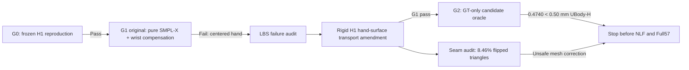

# SignDART-NLF: G0–G2 Research Gate Report

> Date: 2026-09-02
>
> Scope: Engineering12 only (12 signs, 298 frames)
>
> Status: **stopped at G2; NLF selection and Full57 were not run**
>
> Interpretation: development-only geometry/oracle diagnostics, not an inference result and not a paper main-table result.

## Executive conclusion

The finite ray–sphere arm state space produces an effect-size ceiling far larger than the previous H15-v2 rescue increment, but the method specified in `SignRay_X_Deep_Research_Implementation_v4 (1).md` does **not** pass its own gates.

Two distinct failures were established:

1. The original hard centered-hand invariant is incompatible with ordinary SMPL-X linear-blend skinning. Although global wrist rotation and H1 finger locals remain fixed, ancestor weights from the elbow and shoulder deform the centered MANO hand surface by a median 1.1108 mm, far above the specified 0.02 mm limit.
2. A rigid H1 hand-surface transport amendment fixes that preservation failure and passes G1, but its UBody-H oracle ceiling is 0.4740 mm, below the preregistered G2 minimum of 0.50 mm by 0.0260 mm.

The blueprint explicitly requires stopping the entire arm direction when G2 is below 0.50 mm. Moreover, a subsequent seam audit shows that the rigid transport amendment creates unacceptable local mesh distortion. Therefore NLF extraction/selection, selector retuning, and Full57 evaluation were not started. The oracle values below must not be reported as a functioning method result.

## 1. Implemented scope

The isolated implementation is under `/home/haipd/DexAvatar/SignDART-NLF` and does not alter DexAvatar, H1 artifacts, or the official evaluator. It includes:

- positive-depth ray–sphere root enumeration under the exact frozen camera;
- exhaustive elbow-root × wrist-root candidates for both arms;
- proximal-to-distal shoulder/elbow swing IK;
- exact global-wrist rotation compensation;
- unchanged H1 hand-pose arrays, shape, face, camera, and topology;
- H1 forward-reproduction, target-joint, reprojection, bone-length, global-wrist, and centered-hand audits;
- a GT-enabled Engineering12 oracle isolated from inference;
- an experimental rigid H1 hand-surface transport that removes ancestor-skinning leakage.

Six tests pass, covering ray–sphere recovery and failure cases, proper rotations including anti-parallel vectors, H1 forward integration, wrist compensation, and centered-geometry preservation under rigid hand transport.

## 2. G0 — frozen incumbent reproduction

The authoritative H1 result remains:

| Method | All | UBody | UBody-F | UBody-H | LHand | RHand |
|---|---:|---:|---:|---:|---:|---:|
| H1 canonical WiLoR, Full57 | 42.0696 | 25.8053 | 29.1131 | 39.6254 | 12.5219 | 11.9180 |

Within the new decoder path, the maximum vertex difference between an H1 state re-forward and its frozen cached vertices is 0.002041 mm, below the 0.02 mm G0 tolerance. The Engineering12 oracle baseline UBody-H is 38.90894 mm versus 38.90897 mm in the existing audited H1 result, a difference of approximately 0.00003 mm.

## 3. G1 — original formulation

| Check | Required | Observed | Status |
|---|---:|---:|---|
| Incumbent-equivalent root recovery | ≥95% arm sides | 100.00% (596/596) | Pass |
| Valid alternative coverage | ≥60% arm sides | 1.01% | **Fail** |
| H1 forward max vertex error | ≤0.02 mm | 0.002041 mm | Pass |
| Target-joint error | ≤0.10 mm | P95 0.002031 mm | Pass |
| Reprojection error | ≤0.25 px | P95 0.000270 px | Pass |
| Bone-length error | ≤0.05 mm | P95 0.001699 mm | Pass |
| Global-wrist error | ≤0.01° | P95 0.0000057° | Pass |
| Centered-hand RMS | ≤0.02 mm | median 1.1108; P95 1.8202 mm | **Fail** |

All 1,772 rejected alternatives fail only the centered-hand criterion. The other geometric criteria pass for every rejected branch. A twist sweep over the free elbow-axis rotation reduces representative residuals only from 0.682 to 0.582 mm, 1.066 to 1.058 mm, and 1.433 to 1.090 mm; twist does not resolve the failure.

The cause is SMPL-X skinning rather than IK. For the frozen model, mapped MANO hand vertices retain on average about 2.07% total weight on joints before the wrist, while individual elbow weights reach 0.421. Changing elbow depth therefore changes relative hand vertices even when the wrist global rotation and all finger locals are fixed.

## 4. LBS-aware diagnostic and preservation amendment

Removing the centered-hand hard rejection only for diagnosis gives 100% alternative coverage. The resulting UBody-H oracle ceiling is 0.4742 mm, with small LHand/RHand regressions of 0.0037/0.0041 mm.

To test whether the intended distal-preservation claim can be made true by construction, the amendment transports the exact frozen H1 hand surface by the candidate wrist displacement:

\[
V_{H}^{c}=V_{H}^{H1}+(J_{w}^{c}-J_{w}^{H1}).
\]

Because the global wrist rotation is unchanged, this is a rigid translation of the validated H1 hand surface. It preserves topology and vertex order and removes ancestor-weight deformation inside the MANO region. It does, however, introduce a non-parametric vertex correction not present in the original blueprint and breaks state-to-mesh consistency.

With this amendment, G1 obtains 100% alternative coverage. Five individual alternatives exceed 0.02 mm only by floating/centering margins (0.0209–0.0231 mm), but every arm side retains at least one valid alternative.

### 4.1 Seam audit rejects rigid transport

The amendment was subsequently evaluated over all 1,773 non-incumbent side candidates. Cross-boundary edges are those belonging to a triangle that contains both mapped MANO hand vertices and non-hand vertices.

| Seam diagnostic | Result |
|---|---:|
| Cross-seam edge-length change, median | 2.8646 mm |
| Cross-seam edge-length change, P95 | 15.1319 mm |
| Cross-seam edge-length change, maximum | 24.2649 mm |
| Seam triangle area ratio, median | 1.3527× |
| Seam triangle area ratio, P99 | 13.7297× |
| Seam triangle area ratio, maximum | 564.32× |
| Seam triangles with flipped normal | 8.4567% |

These distortions are not a numerical edge case. Rigidly overwriting the MANO vertex region while leaving adjacent forearm vertices under ordinary SMPL-X skinning creates severe transition artifacts. The amendment is therefore rejected despite its favorable hand metric and must not be promoted as a method module.

## 5. G2 — candidate oracle ceiling

The oracle reads GT only on Engineering12 and chooses the candidate minimizing UBody-H per frame. It is not part of inference.

| Metric | H1 baseline | Oracle-selected | Gain ↓ | G2 requirement |
|---|---:|---:|---:|---:|
| All | 41.1465 | 40.9119 | **0.2346** | ≥0.10 |
| UBody | 24.4641 | 24.2352 | **0.2289** | ≥0.20 |
| UBody-F | 27.7016 | 27.4278 | **0.2739** | not separately gated |
| UBody-H | 38.9089 | 38.4350 | **0.4740** | **≥0.50** |
| LHand | 12.0414 | 12.0413 | +0.00002 | regress ≤0.02 |
| RHand | 11.6416 | 11.6416 | +0.00001 | regress ≤0.02 |

The oracle selects a non-incumbent candidate on 39/298 frames (13.1%). Among selected frames, mean UBody-H gain is 3.97 mm; the aggregate gain is not a collection of `0.00xx mm` changes. Nevertheless, G2 is binary under the frozen blueprint and fails because 0.4740 mm is below 0.50 mm.

Independent per-metric oracle values are 40.7789 mm All, 24.0872 mm UBody, 27.3001 mm UBody-F, and 38.4350 mm UBody-H. The independent UBody-H oracle is identical to the target-selected value, so changing the selection objective cannot recover the missing 0.0260 mm.

## 6. Decision

The following actions are prohibited by the v4 kill-gates after this result:

- lowering the 0.50 mm G2 threshold after inspecting the result;
- tuning NLF probability thresholds to force activation;
- running NLF-L, pointmap, or extra experts in an attempt to enlarge a candidate space whose frozen oracle missed the gate;
- presenting the development oracle as an inference method or Full57 result.

The scientifically defensible choices are:

1. **Honor v4 unchanged:** stop SignDART-NLF and retain H1 as paper core.
2. **Preregister a genuinely new v5 method before further GT inspection:** it must use a smooth, state-consistent distal-preservation mechanism rather than the rejected rigid MANO-region overwrite, and it must define a new candidate space or a justified lower oracle threshold. This is a new method, not a silent adjustment of v4.

No conclusion about NLF selector quality can be drawn because G3/G4 were intentionally not run.

## 7. Provenance

| Artifact | SHA-256 |
|---|---|
| Original strict config | `d0c5084f922ea9489308f47d69bb375cc38e4c40eb9a59e4417df172f4fff10e` |
| LBS diagnostic config | `36d2fdb5e690b739583005270e7f1f0e2b83c577571ec15bd964ddc7a66e38fc` |
| Transport amendment config | `99c88e94d8c211a2abe16eaca58f444df3b4c4e46bc53f016dec8bc8c6e072d9` |
| Original G1 report | `37d0ba7a5e36270638e37666164847bfbd8c3b0de581461ff65b7023f30399fd` |
| LBS diagnostic G2 report | `b17ffba30a03f362b484e7a5f05ea8b7008db724a2d9bbcb74deb134059aca18` |
| Transport G1 report | `278dc283508b49f4db4aba77988bf319e8904a26066fadb9ac0759fd475944b4` |
| Transport G2 report | `34021637fffc3a151bea21105642faec7bb10a544ad190620b498ebb37613325` |
| Transport seam audit | `fcd26b87ae1149c1a95344098031a89da79735215e35bf59b0763dca6a35c582` |
| H1 Full57 manifest | `ef54791decc8ff8df44277173c24b834848ffe64c822fe5cf7011b42749eea78` |
| Official evaluator | `2722b5cd30d4baba23599a455cab483b143e6595d292f02de9643af4eebd5300` |

Generated candidate banks occupy approximately 3.7 MB; no new model or training dataset was downloaded. The existing NLF-L checkpoint was not invoked after the G2 stop decision.
