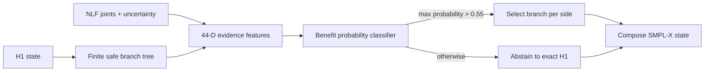

# SignDART-NLF v10: Frozen Uncertainty-Guided Branch Classifier

## Material Passport

- **Artifact type:** method freeze before v10 selection/evaluation on untouched45
- **Created:** 2026-09-02 (Asia/Ho_Chi_Minh)
- **Training/tuning data:** Engineering12 only, 298 frames from 12 signs
- **Confirmation data:** untouched45, 1,195 frames from 45 disjoint signs
- **Development report SHA-256:** `474d9d8abe3264d693febe06c78f2f74a66a3d2c56c9320ba530a95372a7bf18`
- **Frozen ranker SHA-256:** `c569b52c8ed576f1ad3b8ac0bf9e5a1557ccf9c4d3030a26a0127b9498b3462a`
- **Feature code SHA-256:** `33f7dbda453b9cfb69eba91ff60503e25520f59690422bfe9bf85d91abda0187`

## Frozen method

The candidate generator is the v7 distal-risk-constrained finite branch tree. Each side contains exact H1 plus projection- and bone-equivalent collar--shoulder--elbow--wrist depth branches whose centered hand deformation is at most 0.5 mm.

For every valid branch, the classifier receives the frozen 44-dimensional feature vector comprising:

- uncertainty-weighted agreement between candidate and NLF non-parametric bone directions;
- H1--NLF and candidate--H1 directional agreement for the three arm bones;
- candidate relative joint depths and normalized bone directions;
- NLF parametric/non-parametric consistency and per-bone reliability;
- distal deformation risk, side identity, mean arm uncertainty, detector score, and normalized box area.

The classifier is `HistGradientBoostingClassifier(max_iter=250, max_leaf_nodes=15, min_samples_leaf=20, l2_regularization=10, random_state=20260902)`. Its positive label is a side candidate whose Engineering12 UBody-H gain over H1 exceeds 0.5 mm. Model-family, label threshold, and probability threshold were selected using leave-one-sign-out predictions on Engineering12.

At inference, each side selects the valid non-incumbent candidate with maximum predicted benefit probability only if that probability is greater than **0.55**. Otherwise it returns exact H1 for that side. There is no temporal smoothing (`window=1`) and no GT-dependent input.

## Development evidence and claim boundary

Leave-one-sign-out Engineering12 prediction selected 103/298 frames and yielded gains of 0.3195 mm UBody-H, 0.2040 mm UBody, and 0.1451 mm All, with left/right hand regressions of 0.0072/0.0080 mm. These are model-selection results, not confirmation results.

The broader author benchmark has been inspected by earlier, different research lanes. Therefore untouched45 is method-disjoint for v10 but not a pristine never-seen benchmark for the entire project. A successful result supports this method within the locked internal protocol; an external dataset is still required for the strongest novelty/generalization claim.

## Frozen untouched45 gate

V10 passes confirmation only if all conditions hold:

1. mean UBody-H gain over H1 is at least 0.15 mm;
2. paired sign-bootstrap 95% CI lower bound for UBody-H gain is greater than 0;
3. UBody and All do not regress by more than 0.02 mm;
4. left and right hand do not regress by more than 0.02 mm;
5. non-incumbent selection fraction is between 2% and 80%;
6. selection artifact is generated and hashed before the evaluator reads untouched45 GT.

No architecture, feature, label threshold, probability threshold, temporal rule, candidate filter, or metric gate may change after this freeze.

