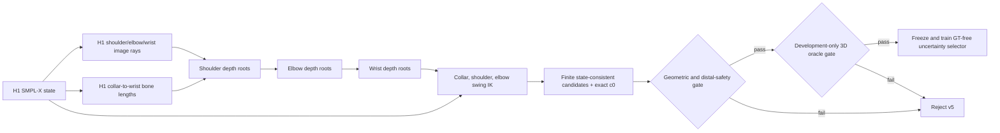

# SignDART-NLF v5: Preregistered Development Protocol

## Material Passport

- **Artifact type:** prospective experiment protocol
- **Created:** 2026-09-02 (Asia/Ho_Chi_Minh)
- **Status:** frozen before evaluating the v5 candidate bank against 3D ground truth
- **Development split:** Engineering12 (298 frames, 12 signs)
- **Incumbent:** frozen SignEFT-X H1 states
- **Primary question:** does a finite, projection-equivalent kinematic branch tree contain a sufficiently better upper-body reconstruction than H1 to justify learning a GT-free selector?
- **Scope warning:** Engineering12 has been inspected for earlier candidate families. Results from this new candidate family are exploratory until confirmed on the frozen full57 protocol without changing the method.

## 1. Hypothesis

Monocular signing frames leave the depths of the shoulder, elbow, and wrist ambiguous even when their image locations and limb lengths are fixed. H1 commits to one depth configuration. We hypothesize that explicitly enumerating the finite solutions of the three-link collar--shoulder--elbow--wrist chain creates a candidate set with a materially better upper-body solution, while preserving the validated hand articulation and the global wrist frame of H1.

The test is deliberately split into two questions:

1. **Candidate sufficiency:** does the finite branch set contain a meaningfully better solution under a development-only oracle?
2. **Inference identifiability:** if it does, can uncertainty-aware 2D/2.5D evidence select that solution without 3D ground truth?

The second question is not tested unless the first passes its kill gate.

## 2. Frozen Method Before Ground-Truth Evaluation

### 2.1 Incumbent state

Each frame starts from the serialized H1 SMPL-X state. Shape, expression, jaw, eyes, fingers, root translation, global orientation, and all body joints outside the active arm chain remain fixed. Candidate `c0` is the byte-level H1 body pose, and is always retained.

### 2.2 Projection-equivalent three-link branch tree

For each arm independently, let the collar joint be the fixed parent point \(p_c\). Let \(r_s,r_e,r_w\) be camera rays through the H1 shoulder, elbow, and wrist pixels. Let \(\ell_{cs},\ell_{se},\ell_{ew}\) be the corresponding H1 bone lengths. Candidate joints are the positive-depth roots of

\[
\|\lambda_s r_s-p_c\|=\ell_{cs},\qquad
\|\lambda_e r_e-p_s\|=\ell_{se},\qquad
\|\lambda_w r_w-p_e\|=\ell_{ew}.
\]

Each quadratic contributes at most two positive roots, so a side has at most \(2^3=8\) geometric branches. Duplicate/tangent roots and the branch numerically equivalent to H1 are removed; exact H1 is supplied separately as `c0`. Left and right candidates are combined only after side-level validation.

### 2.3 State-consistent inverse kinematics

The collar global rotation is swung to align the original collar--shoulder vector with the candidate vector. The shoulder and elbow are updated sequentially in the same way. The wrist local rotation is then compensated so that its candidate global rotation equals the H1 global wrist rotation. Finger local rotations are never changed. All candidates are rendered through the unmodified SMPL-X forward model; no evaluator-only vertex replacement is part of v5.

This choice supersedes the rejected rigid hand-surface transport diagnostic. That diagnostic preserved hand metrics by overwriting MANO vertices but produced severe wrist-seam distortion and is therefore excluded from the method.

### 2.4 Distal-hand safety definition

Exact equality of centered MANO vertices is not a valid state-level invariant under SMPL-X linear blend skinning: hand vertices have non-zero weights on arm ancestors. V5 therefore preregisters two distinct safeguards:

- **state invariant:** global wrist orientation error at most 0.01 degrees and unchanged finger local rotations;
- **surface diagnostic:** centered MANO RMS from H1 at most 5.0 mm for any accepted side candidate;
- **oracle non-regression:** selected-candidate left- and right-hand errors may each regress by at most 0.02 mm on Engineering12.

The 5.0 mm surface ceiling is a corruption detector, not a claim of hand-surface invariance. Any paper must state this distinction explicitly.

## 3. Gate Sequence and Frozen Thresholds

### G0 — Reproduction and code integrity

- H1 forward reproduction maximum vertex error: at most 0.02 mm.
- Record hashes of the manifest, configuration, candidate implementation, and reports.
- No 3D ground truth is read while debugging G0/G1.

### G1 — Candidate validity and coverage

For every accepted non-incumbent branch:

| Quantity | Threshold |
|---|---:|
| shoulder/elbow/wrist target error | <= 0.10 mm |
| maximum shoulder/elbow/wrist reprojection error | <= 0.25 px |
| maximum collar/upper-arm/forearm length error | <= 0.05 mm |
| global wrist orientation error | <= 0.01 deg |
| centered MANO surface displacement from H1 | <= 5.0 mm |

Dataset-level requirements:

- incumbent geometric root recovered on at least 95% of arm sides;
- at least one valid alternative on at least 60% of arm sides.

Failure kills v5 before any new GT oracle is calculated.

### G2 — Development-only candidate oracle

The oracle selects the left/right candidate pair with minimum UBody-H error. V5 passes only if all conditions hold relative to exact H1:

| Metric | Required gain |
|---|---:|
| UBody-H | >= 0.75 mm |
| UBody | >= 0.30 mm |
| All | >= 0.15 mm |
| left-hand regression | <= 0.02 mm |
| right-hand regression | <= 0.02 mm |

The thresholds are stricter than the previous family, whose UBody-H ceiling was 0.474 mm. Passing G2 establishes candidate sufficiency only; oracle choices are not an inference method and cannot be reported as the final method result.

### G3 — Evidence adapter validation

This gate is entered only after G2 passes. NLF-derived joint locations and uncertainties must be mapped to the exact frame crop and camera convention. Required checks include cache completeness, finite values, left/right consistency, crop round trip, and projection agreement. The exact adapter thresholds will be frozen in a separate G3 protocol before fitting a selector.

### G4 — GT-free branch selection

The selector may use image evidence, NLF 2.5D joint predictions/uncertainties, candidate geometry, and H1 confidence, but never 3D ground truth at inference. Training and threshold tuning are confined to the declared development split. The selector must retain c0 as an abstention outcome.

### G5 — Frozen confirmation

After architecture, features, and thresholds are frozen, the method is evaluated once on the full57 protocol, with per-frame paired bootstrap confidence intervals and module ablations. No further tuning on full57 is permitted. If full57 is used during design, it ceases to be confirmatory and an external or newly held-out split becomes mandatory.

## 4. Planned Ablations

If v5 reaches G4/G5, the paper-facing ablation is defined by scientific modules rather than internal experiment labels:

| Variant | Finite depth branches | Shoulder-depth roots | Uncertainty-aware selection | H1 abstention | Wrist-frame compensation |
|---|---:|---:|---:|---:|---:|
| H1 incumbent | no | no | no | n/a | n/a |
| elbow--wrist branches | yes | no | yes | yes | yes |
| full branch tree without uncertainty | yes | yes | no | yes | yes |
| full branch tree without abstention | yes | yes | yes | no | yes |
| full branch tree without wrist compensation | yes | yes | yes | yes | no |
| complete method | yes | yes | yes | yes | yes |

The no-wrist-compensation variant is a safety ablation and is expected to expose hand degradation; it is not eligible as the final method.

## 5. Anti-Leakage and Stop Rules

1. Candidate equations, thresholds, and acceptance rules above are frozen before the first v5 GT oracle run.
2. Mechanical bugs may be fixed after G1, but any change after observing G2 creates a new version and a new preregistration entry.
3. G2 failure rejects this exact candidate family. It cannot be rescued by lowering its frozen gate.
4. Passing an Engineering12 oracle does not establish novelty, inference performance, or paper readiness.
5. “Good enough” requires, at minimum, a GT-free selector that improves the primary upper-body metric with a confidence interval compatible with a real positive effect, preserves hands within the declared margin, and survives the frozen confirmation protocol.

