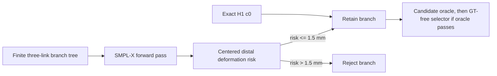

# SignDART-NLF v6: Distal-Risk-Constrained Branch Tree

## Material Passport

- **Artifact type:** prospective amendment after the failed v5 development gate
- **Created:** 2026-09-02 (Asia/Ho_Chi_Minh)
- **Status:** frozen before evaluating the v6 candidate bank against 3D ground truth
- **Development status:** exploratory; Engineering12 has already been used for v4/v5 diagnosis
- **Supersedes:** v5 only for the candidate safety rule; all geometric equations and effect-size gates remain unchanged

## Motivation from the completed v5 gate

V5 demonstrated a large candidate ceiling but failed its preregistered hand margin: the UBody-H oracle gain was 1.923 mm, whereas right-hand error regressed by 0.0243 mm against a maximum allowed regression of 0.02 mm. The v5 result remains a failure. V6 does not lower that margin and does not alter the target metric.

The failure is consistent with an identified mechanism: changing arm ancestors causes non-rigid motion in MANO-region vertices through SMPL-X blend weights even when the global wrist frame and finger local rotations are fixed. Therefore v6 promotes the previously diagnostic centered-hand displacement into a GT-free candidate rejection rule.

## Frozen v6 change

For each side candidate \(c\), define distal deformation risk

\[
D_{\mathrm{hand}}(c)=
\sqrt{\frac{1}{3|\mathcal V_h|}
\sum_{v\in\mathcal V_h}
\left\|
(V_v^c-\bar V_h^c)-(V_v^{H1}-\bar V_h^{H1})
\right\|_2^2}\;.
\]

The candidate is retained only when

\[
D_{\mathrm{hand}}(c) \le 1.5\ \text{mm}.
\]

The filter reads neither 3D ground truth nor evaluator error. It uses the H1 and candidate SMPL-X meshes already available at inference. Exact H1 (`c0`) is always retained. No vertex overwrite, rigid transport, or post-skinning mesh edit is allowed.

## Frozen gates

All v5 thresholds remain unchanged except the centered-hand candidate threshold:

| Gate quantity | v6 threshold |
|---|---:|
| H1 forward reproduction | <= 0.02 mm |
| target joint error | <= 0.10 mm |
| reprojection error | <= 0.25 px |
| bone-length error | <= 0.05 mm |
| global wrist orientation error | <= 0.01 deg |
| centered-hand deformation risk | **<= 1.5 mm** |
| incumbent root recovery | >= 95% of sides |
| valid alternative coverage | >= 60% of sides |
| oracle UBody-H gain | >= 0.75 mm |
| oracle UBody gain | >= 0.30 mm |
| oracle All gain | >= 0.15 mm |
| oracle left/right hand regression | <= 0.02 mm each |

If v6 fails, the 1.5 mm threshold will not be tuned retrospectively. Any further mechanism is a separately declared version. Passing v6 establishes only the existence of a sufficiently good and structurally safer candidate; it does not establish inference performance.

