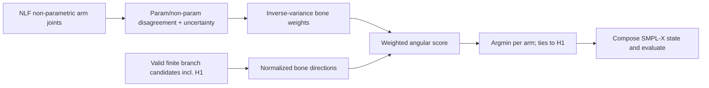

# SignDART-NLF v7: NLF Evidence and Zero-Training Selector Protocol

## Material Passport

- **Artifact type:** prospective G3/G4 protocol
- **Created:** 2026-09-02 (Asia/Ho_Chi_Minh)
- **Frozen before:** aggregate G3 audit and any GT evaluation of the branch selector
- **NLF model:** official v0.3.2 checkpoint, SHA-256 `52bee28edb6ea9148691331df87cfc238d7e3d9134dc60104a5aaed282a9ddad`
- **Candidate bank:** SignDART-NLF v7, distal-risk threshold 0.5 mm

## G3: evidence adapter acceptance

For every declared manifest frame, the NLF archive must contain 55 parametric and 55 non-parametric joints in 3D/2D plus 55 uncertainties. G3 passes only when:

| Check | Required value |
|---|---:|
| cache coverage | 100% |
| finite required values | 100% |
| strictly positive joint uncertainties | 100% |
| median parametric/non-parametric arm-joint disagreement | <=25 mm |
| median parametric/non-parametric arm-joint 2D disagreement | <=10 px |
| non-parametric arm joints within image bounds | >=90% |

The reused cache was produced with one augmentation and detector-based boxes. It is admissible for the zero-training feasibility gate, but a final robustness claim requires reproducing the cache with the paper-frozen crop and augmentation policy.

## G4: uncertainty-weighted branch evidence

The selector compares only limb directions, which removes the incompatible absolute camera translation and depth scale between H1 and NLF. For each arm, define the three directed bones collar→shoulder, shoulder→elbow, and elbow→wrist. Candidate and NLF bone vectors are independently normalized.

For bone \((p,j)\), the effective uncertainty is

\[
\sigma_{pj}=\epsilon+\tfrac12(u_p+u_j)+
\tfrac12(\|q_p-\hat q_p\|_2+\|q_j-\hat q_j\|_2),
\]

where \(u\) is NLF joint uncertainty, and \(q,\hat q\) are its parametric and non-parametric 3D joints in millimetres. Its normalized inverse-variance weight is \(w_{pj}\propto\sigma_{pj}^{-2}\). Candidate score is

\[
S(c)=\sum_{(p,j)}w_{pj}\left(1-\hat b_{pj}^{c\top}\hat b_{pj}^{NLF}\right).
\]

The valid v7 candidate with minimum score is selected independently for each side. Exact H1 is a candidate and wins all exact ties. There is no learned parameter, confidence threshold, oracle label, or temporal post-processing in this first G4 test.

## G4 development success criteria

Relative to exact H1 on Engineering12, the zero-training selector must achieve:

- UBody-H gain at least 0.15 mm;
- UBody and All must not regress by more than 0.02 mm;
- left and right hand must not regress by more than 0.02 mm;
- non-incumbent selection fraction between 2% and 80%.

If this zero-training selector fails, it remains a negative result. Any learned or temporal selector is a new declared variant and may train only on Engineering12 signs; its architecture and hyperparameter selection protocol must be frozen before untouched45 is read.

