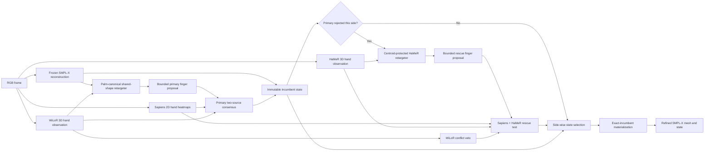

# EI-AMER: Exact-Incumbent Asymmetric Multi-Expert Rescue for Monocular 3D Sign Language Reconstruction

## Abstract

Monocular 3D sign language reconstruction requires accurate finger articulation without destabilizing the body configuration already recovered by a whole-body estimator. We introduce **Exact-Incumbent Asymmetric Multi-Expert Rescue (EI-AMER)**, a framewise test-time method that refines an existing SMPL-X reconstruction using frozen 2D and 3D hand experts. EI-AMER first retargets expert hand observations into a palm-centered, scale-normalized SMPL-X representation while optimizing only the 15 finger rotations of each hand. A primary WiLoR proposal becomes the incumbent only when it is supported by both Sapiens heatmap likelihood and WiLoR canonical 3D evidence. A secondary HaMeR proposal may rescue only a hand rejected by the primary stage. This rescue requires agreement between Sapiens and HaMeR, uses WiLoR as a conflict veto, and includes an expert-specific centroid constraint that protects upper-body geometry. The selected state is materialized through an exact-incumbent contract: non-rescued hand states are copied from the incumbent, while body pose, wrist orientation, shape, facial state, and camera remain fixed. On the attached 57-sign, 1,493-frame protocol, EI-AMER reduces the six official errors from 42.0936/25.8311/29.1458/39.6963/12.8466/12.1275 mm for the frozen input reconstruction to 42.0640/25.7991/29.1057/39.6121/12.5060/11.8431 mm. Module ablations show that canonical primary refinement supplies the largest gain, reject-only HaMeR rescue improves complementary hand failures, asymmetric centroid protection prevents regional regression, and exact-incumbent materialization is necessary to guarantee that non-rescue outputs remain unchanged.

**Keywords:** 3D sign language reconstruction, SMPL-X, hand pose refinement, selective prediction, multi-expert reconstruction, test-time optimization

## 1. Introduction

Sign language is expressed through coordinated handshape, orientation, location, movement, facial expression, and body motion. A reconstructed avatar can therefore be visually plausible as a human while still being linguistically wrong. Finger articulation is particularly vulnerable in monocular video because hands occupy few pixels, self-occlude, move rapidly, and admit multiple 3D configurations with similar 2D projections.

Existing sign reconstruction methods use linguistic constraints or learned sign-pose priors to reduce these ambiguities. SGNify fits expressive signing avatars using universal linguistic priors [1]. DexAvatar learns hand and body priors specialized for signing [2]. Tamaththul3D integrates a whole-body estimator with a dedicated MANO-compatible hand estimator and geometric forearm alignment [3]. These methods establish the value of sign-specific constraints and specialized hand reconstruction. They do not, however, remove a practical failure mode of modular systems: replacing or re-optimizing a hand can improve local finger geometry while perturbing an already correct wrist, body, shape, or non-target hand.

EI-AMER formulates hand correction as **conservative selective refinement**. The method does not replace the whole-body mesh and does not optimize the body. Instead, it generates bounded finger-only proposals from two complementary hand experts, evaluates them using factorized image and 3D evidence, and accepts a secondary proposal only when the primary estimator has abstained. The already validated reconstruction is treated as an immutable incumbent, not as an initialization that may be silently regenerated.

### Contributions

The main contributions are:

1. **Palm-canonical shared-shape retargeting.** Hand observations produced under a MANO-like convention are mapped to the baseline SMPL-X hand by removing palm translation, rotation, and scale, then imposing the baseline’s shared-shape bone lengths. Only finger articulation is transferred.
2. **Asymmetric multi-expert selection.** WiLoR defines a high-precision primary path. HaMeR acts only as a reject-side rescue expert. The proposing expert and Sapiens must agree by an uncertainty-normalized margin, while WiLoR serves as a conflict veto for HaMeR rescues.
3. **Expert-specific regional protection.** A centroid-neutral canonical constraint is applied to the HaMeR rescue proposal but not to the validated WiLoR path, preventing the protection term from changing the incumbent itself.
4. **Exact-incumbent output construction.** If no rescue is accepted, the output is an exact incumbent artifact. On rescued frames, only the rescued hand-pose array is replaced; all protected SMPL-X variables and the non-rescued hand remain unchanged.
5. **Module-level empirical validation.** The ablation study isolates the effects of primary canonical refinement, secondary rescue, centroid protection, expert asymmetry, wrist locking, and exact-incumbent materialization.

EI-AMER uses the output of an upstream sign reconstruction system, but its post-reconstruction refinement does not invoke DexAvatar’s SignHPoser or SignBPoser. The contribution is the proposal, selection, and state-preservation mechanism rather than a new learned pose prior.

## 2. Related Work

### 2.1 3D sign language reconstruction

SGNify reconstructs expressive SMPL-X signing avatars from monocular videos and introduces linguistic priors for ambiguous hand configurations [1]. DexAvatar improves reconstruction using learned sign-domain hand and body priors [2]. Neural Sign Actors uses reconstructed signing motion within a diffusion-based production framework [4]. Tamaththul3D combines modular body and hand estimates through kinematic forearm alignment and 2D-supervised refinement, including experiments with WiLoR [3]. The latter is the closest work to EI-AMER in its use of a specialized hand estimator. EI-AMER differs in keeping the wrist and body fixed, retargeting only finger rotations, assigning asymmetric roles to two hand experts, and enforcing exact preservation of the incumbent state.

### 2.2 General hand reconstruction and human-centric observations

WiLoR performs end-to-end hand localization and MANO reconstruction in unconstrained imagery [5]. HaMeR uses a transformer-based architecture and large-scale training to recover 3D hands [6]. Sapiens supplies dense whole-human observations, including probabilistic 2D pose heatmaps [7]. EI-AMER treats these networks as frozen observation models. It neither retrains them nor averages their predictions. Their outputs enter different stages of proposal generation, positive evidence, and conflict detection.

### 2.3 Position of the contribution

Using WiLoR in sign reconstruction is not itself novel because Tamaththul3D already demonstrates this direction [3]. Multi-expert routing is also established in selective prediction. The intended contribution is narrower: a task-specific construction that combines canonical cross-model finger retargeting, an immutable SMPL-X incumbent, reject-only secondary rescue, expert-specific proposal geometry, and artifact-level state preservation. Based on targeted searches of CVF Open Access, arXiv, and PMLR performed on 1–2 September 2026, we found no directly comparable sign-reconstruction method combining these elements. This statement is bounded by that search rather than an absolute priority claim.

## 3. Method

### 3.1 Problem formulation

For an RGB frame \(I_t\), an upstream estimator supplies a valid SMPL-X state

\[
\Theta_t^0 =
(\theta_t^B,\theta_t^{W,L},\theta_t^{W,R},
\theta_t^{H,L},\theta_t^{H,R},\beta_t,\psi_t,c_t),
\]

where \(\theta^B\) is body pose, \(\theta^{W,s}\) is wrist orientation, \(\theta^{H,s}\in SO(3)^{15}\) contains the finger rotations for side \(s\), \(\beta\) is body shape, \(\psi\) is facial state, and \(c\) is the camera. EI-AMER predicts a refined state \(\Theta_t^*\) under the hard constraint

\[
(\theta^B,\theta^{W,L},\theta^{W,R},\beta,\psi,c)^*
=
(\theta^B,\theta^{W,L},\theta^{W,R},\beta,\psi,c)^0.
\]

Only \(\theta^{H,L}\) and \(\theta^{H,R}\) are eligible for side-specific replacement. The method is framewise and uses neither ground-truth meshes nor temporal pose targets during fitting.

### 3.2 End-to-end architecture

**Figure 1.** EI-AMER inference. WiLoR supplies the primary proposal and HaMeR is evaluated only on a primary reject. Sapiens provides image evidence for both stages. The final materializer preserves the incumbent unless an eligible HaMeR rescue is accepted.

The architecture has four functional modules. The **canonical retargeter** converts cross-model hand geometry into a shared SMPL-X representation. The **primary consensus module** builds a high-precision incumbent from WiLoR and Sapiens. The **asymmetric rescue module** applies a protected HaMeR proposal only to incumbent rejects. The **exact materializer** converts the side-wise decisions into an auditable SMPL-X artifact.

### 3.3 Palm-canonical hand representation

Let \(J\in\mathbb{R}^{21\times3}\) contain the wrist and 20 finger joints from either an expert or the baseline SMPL-X hand. The representation first removes wrist translation:

\[
\bar J_i = J_i-J_0.
\]

The index- and little-finger metacarpophalangeal joints define the transverse palm axis

\[
x=\operatorname{norm}(\bar J_5-\bar J_{17}).
\]

The longitudinal palm direction is constructed from their midpoint and orthogonalized against \(x\):

\[
\tilde y=\frac{1}{2}(\bar J_5+\bar J_{17}),\qquad
y=\operatorname{norm}(\tilde y-(\tilde y^\top x)x).
\]

The remaining axes are

\[
z=\operatorname{norm}(x\times y),\qquad y=z\times x.
\]

This yields the proper palm frame \(R_P=[x\;y\;z]\). Degenerate or reflected frames are rejected by requiring \(\det(R_P)>0.999\). The wrist-to-middle-MCP distance supplies scale,

\[
s=\lVert\bar J_9\rVert_2,
\]

and the canonical representation is

\[
\mathcal C(J)=\bar J R_P/s.
\]

Canonicalization removes the external model’s root translation, palm rotation, and scale. It therefore prevents a hand detector’s camera convention from being transplanted into the whole-body reconstruction.

### 3.4 Shared-shape bone retargeting

Expert and SMPL-X hands may encode different subject proportions even after scale normalization. EI-AMER retains each expert bone direction but replaces its length with the corresponding length of the baseline SMPL-X hand. Let \(E=\mathcal C(J^e)\) be an expert hand and \(R=\mathcal C(J^0)\) the reference hand. For each finger edge \((p(i),i)\), the target joint is

\[
T_i=T_{p(i)}+
\frac{E_i-E_{p(i)}}{\lVert E_i-E_{p(i)}\rVert_2}
\lVert R_i-R_{p(i)}\rVert_2.
\]

The target follows the expert’s articulation while remaining compatible with the baseline shape parameter \(\beta\). No expert MANO mesh, global hand translation, or wrist rotation is copied into SMPL-X.

### 3.5 Trust-region finger fitting

For one side, let \(Q_j^0\in SO(3)\) be the 15 baseline finger rotations. The optimizer learns Lie-algebra residuals \(\delta_j\in\mathbb{R}^3\):

\[
Q_j(\delta)=\exp([\delta_j]_\times)Q_j^0.
\]

Given expert-specific target joints \(T^e\), the proposal objective is

\[
\mathcal L_e =
\frac{1}{20}\sum_{i=1}^{20}
\rho\!\left(\mathcal C(J(\delta))_i-T_i^e\right)
+\lambda_e\left\lVert
\mu(\mathcal C(J(\delta))_{1:20})-
\mu(\mathcal C(J^0)_{1:20})
\right\rVert_2^2
+0.2\frac{1}{15}\sum_{j=1}^{15}\lVert\delta_j\rVert_2^2,
\]

where \(\rho\) is smooth L1 and \(\mu\) is the centroid of the 20 non-wrist joints. The first term transfers articulation. The last term penalizes large geodesic changes from the baseline. The middle term prevents a canonical hand proposal from shifting its finger centroid relative to the reference hand.

Optimization uses Adam for 40 steps with learning rate 0.03 and cosine annealing. Residuals are searched within 12° and the best proposal is projected into an 8° production trust region. Both wrists remain locked.

The proposal geometry is asymmetric:

\[
\lambda_{WiLoR}=0,\qquad \lambda_{HaMeR}=0.5.
\]

The primary WiLoR path was already validated without centroid regularization. Applying a new regularizer to that path would change the incumbent. The centroid constraint is therefore restricted to the HaMeR rescue proposal, where it protects whole-body regions from a new source of hand-centroid drift.

### 3.6 Probabilistic 2D image evidence

Sapiens provides a heatmap \(P_i\) for every hand landmark rather than a single coordinate. The method assigns landmark weight

\[
w_i=q_i\left(1-\frac{H_i}{\log(64\cdot48)}\right)v_i,
\]

where \(q_i\) is detector confidence, \(H_i\) is heatmap entropy, and \(v_i\) indicates a valid landmark. A per-hand 2D nuisance offset is estimated once from the median difference between the baseline projection and the heatmap means. This offset accounts for detector/camera displacement without changing the SMPL-X camera.

For projected candidate joint \(\pi(J_i)\), the image energy is the weighted heatmap negative log-likelihood

\[
E^{2D}(J)=
\frac{\sum_i w_i[-\log P_i(\pi(J_i))]}
{\sum_i w_i}.
\]

Candidate improvement relative to the baseline is

\[
\Delta^{2D}=E^{2D}(J^c)-E^{2D}(J^0).
\]

The standard error \(\sigma^{2D}\) is estimated from weighted joint-level variation and effective sample size. A negative delta indicates that the candidate projects into more likely image locations.

### 3.7 Canonical 3D expert evidence

For expert \(e\), the canonical geometry energy is

\[
E^e(J)=\frac{1}{20}\sum_{i=1}^{20}
\lVert\mathcal C(J)_i-T_i^e\rVert_2.
\]

The expert delta is

\[
\Delta^e=E^e(J^c)-E^e(J^0).
\]

Its uncertainty \(\sigma^e\) is estimated from jointwise residual variation and inflated when the detector confidence is low. This comparison remains in canonical hand space and does not reuse the Sapiens image likelihood.

### 3.8 Primary consensus and incumbent construction

The primary WiLoR proposal is accepted for side \(s\) only if WiLoR is available and both the image and 3D expert energies improve by two estimated standard errors:

\[
g_s^{P}=
\mathbf 1[available_W]
\mathbf 1[\Delta_W^{2D}<-2\sigma_W^{2D}]
\mathbf 1[\Delta_W^{W}<-2\sigma_W^{W}].
\]

An accepted side replaces only its 15 finger rotations. A rejected side remains identical to the frozen input reconstruction. The resulting state \(\Theta^I\) is the immutable incumbent consumed by the rescue stage.

This gate separates proposal generation from acceptance. WiLoR proposes a 3D articulation, but cannot approve itself without Sapiens image evidence. Conversely, a 2D heatmap improvement is insufficient without consistent canonical 3D geometry.

### 3.9 Reject-only asymmetric rescue

HaMeR is not allowed to compete with an accepted primary proposal. A HaMeR rescue is evaluated only when \(g_s^P=0\). The rescue gate is

\[
g_s^{R}=
(1-g_s^P)
\mathbf 1[available_H]
\mathbf 1[\Delta_H^{2D}<-2\sigma_H^{2D}]
\mathbf 1[\Delta_H^{H}<-2\sigma_H^{H}]
\mathbf 1[\Delta_H^{W}\leq\sigma_H^{W}].
\]

Sapiens and HaMeR supply the two positive decisions. The last term uses WiLoR only as a conflict veto: a HaMeR proposal is rejected if it is strongly inconsistent with WiLoR canonical geometry. WiLoR is not counted as a third positive vote because the rescue is designed for cases in which the primary path abstained.

The final side action is

\[
a_s=
\begin{cases}
\text{primary incumbent}, & g_s^P=1,\\
\text{secondary rescue}, & g_s^P=0\land g_s^R=1,\\
\text{frozen input}, & \text{otherwise}.
\end{cases}
\]

This hierarchy makes the multi-expert system monotonic with respect to the incumbent decision: the secondary expert can expand coverage but cannot replace a primary accept.

### 3.10 Exact-incumbent materialization

The state-selection rule must survive conversion into mesh and parameter files. EI-AMER therefore materializes outputs as follows:

1. If neither side is rescued, the incumbent mesh and state are copied exactly.
2. If a side is rescued, the incumbent state is loaded and only that side’s hand-pose array is overwritten.
3. Vertices are regenerated from the protected incumbent variables and the selected hand poses.
4. Body pose, both wrists, shape, facial state, camera, and the non-rescued hand-pose array must remain identical to the incumbent.
5. Every decision records the selected source, evidence deltas, implementation hash, observation hashes, and output hashes.

Exact materialization is a functional module rather than a logging detail. Regenerating the primary path can produce different hand states even when aggregate metrics and acceptance counts are unchanged. Copying the incumbent makes non-rescue identity true by construction.

## 4. Experimental Setup

### 4.1 Protocol

The attached evaluation protocol contains 57 isolated signs and 1,493 paired frames. Twelve signs (298 frames) form the development partition used for module ablations. The remaining 45 signs contain 1,195 frames. The complete 57-sign set is used for aggregate reporting. The method predicts a 10,475-vertex SMPL-X mesh for every frame.

### 4.2 Metrics

The official evaluator reports translation-aligned mean vertex error in millimetres; lower is better. We report the full mesh (**All**), above-pelvis upper body (**UBody**), upper body excluding face (**UBody-F**), upper body excluding head (**UBody-H**), left hand (**LHand**), and right hand (**RHand**). An independent audited implementation reproduced the official aggregates after rounding. Paired uncertainty is estimated with 10,000 bootstrap replicates over signs.

### 4.3 Compared configurations

The **frozen input reconstruction** is the upstream SMPL-X output without EI-AMER. The **primary-only refinement** contains canonical WiLoR retargeting and the Sapiens/WiLoR consensus gate but no secondary rescue. **Full EI-AMER** adds centroid-protected reject-only HaMeR rescue and exact-incumbent materialization. All configurations use the same images, upstream states, observation caches, topology, camera, shape, and evaluator.

## 5. Results

### 5.1 Main quantitative results

| Method | All | UBody | UBody-F | UBody-H | LHand | RHand |
|---|---:|---:|---:|---:|---:|---:|
| Frozen input reconstruction | 42.0936 | 25.8311 | 29.1458 | 39.6963 | 12.8466 | 12.1275 |
| Primary-only canonical refinement | 42.0696 | 25.8053 | 29.1131 | 39.6254 | 12.5219 | 11.9180 |
| **Full EI-AMER** | **42.0640** | **25.7991** | **29.1057** | **39.6121** | **12.5060** | **11.8431** |

**Table 1.** Translation-aligned reconstruction errors on the attached 57-sign/1,493-frame protocol. Lower is better.

Primary-only refinement supplies most of the gain, reducing LHand by 0.3247 mm and RHand by 0.2096 mm relative to the frozen input. The secondary rescue further reduces RHand by 0.0749 mm and improves all reported aggregates. Relative to the frozen input, full EI-AMER improves All by 0.0296 mm, UBody by 0.0320 mm, UBody-F by 0.0401 mm, UBody-H by 0.0842 mm, LHand by 0.3406 mm, and RHand by 0.2844 mm.

Paired-sign bootstrap intervals for full EI-AMER relative to the frozen input are negative for all six metrics: All [-0.0430,-0.0162], UBody [-0.0490,-0.0156], UBody-F [-0.0600,-0.0212], UBody-H [-0.1159,-0.0508], LHand [-0.4866,-0.2088], and RHand [-0.3591,-0.1468] mm. The incremental rescue effect relative to the primary-only method is smaller. Its interval excludes zero for All and UBody-H, while the intervals for UBody, UBody-F, LHand, and RHand cross zero.

### 5.2 Selection coverage and state preservation

| Selected source | Hand sides |
|---|---:|
| Primary WiLoR incumbent | 991 |
| Secondary HaMeR rescue | 429 |
| Frozen input | 1,566 |

Across 1,493 frames, 1,119 frames require no rescue and are exact incumbent copies. The audit also identifies 523 complete fallback frames that remain exact frozen-input/incumbent artifacts. All 991 primary accepted sides are preserved, and the secondary stage adds 429 rescued sides. The full audit reports zero protected-state violations.

## 6. Ablation Study

### 6.1 Contribution of each method module

| Configuration | Canonical primary | Reject-only rescue | Centroid protection | Expert-specific asymmetry | Exact incumbent | All | UBody | UBody-F | UBody-H | LHand | RHand |
|---|:---:|:---:|:---:|:---:|:---:|---:|---:|---:|---:|---:|---:|
| Frozen input |  |  |  |  |  | 41.1539 | 24.4695 | 27.7074 | 38.9223 | 12.3310 | 11.9162 |
| Primary-only refinement | ✓ |  |  |  |  | 41.1480 | 24.4635 | 27.7001 | 38.9090 | 12.0412 | 11.6415 |
| Rescue without centroid protection | ✓ | ✓ |  |  |  | 41.1485 | 24.4624 | 27.6990 | 38.9112 | 12.0235 | 11.5035 |
| Symmetric centroid protection | ✓ | ✓ | ✓ |  |  | **41.1431** | **24.4561** | **27.6915** | **38.8977** | 12.0377 | 11.5398 |
| Asymmetric rescue, regenerated primary path | ✓ | ✓ | ✓ | ✓ |  | 41.1458 | 24.4597 | 27.6955 | 38.9032 | **12.0184** | **11.5082** |
| **Full EI-AMER** | ✓ | ✓ | ✓ | ✓ | ✓ | 41.1458 | 24.4597 | 27.6955 | 38.9032 | **12.0184** | **11.5082** |

**Table 2.** Module ablation on the 12-sign/298-frame development partition. The exact-incumbent module changes artifact identity rather than aggregate error, so its contribution is evaluated by the invariant audit in Section 6.4.

Canonical primary refinement produces the largest hand improvement and also improves all upper-body aggregates. Adding reject-only rescue without centroid protection reduces both hand errors, especially RHand, but slightly worsens All and UBody-H relative to primary-only refinement. This result exposes a mismatch between a translation-aligned local hand objective and the spatial contribution of the hand inside a larger body region.

Centroid protection corrects that mismatch. Applying it symmetrically to both experts gives the best development All and upper-body values, but it also changes the validated primary proposal geometry. Expert-specific asymmetry instead leaves the primary proposal untouched and applies protection only to the new HaMeR rescue. It produces the best development hand values and gives consistent six-metric improvement on the 45-sign evaluation partition, as shown next.

### 6.2 Why centroid protection must be asymmetric

| Configuration | All | UBody | UBody-F | UBody-H | LHand | RHand |
|---|---:|---:|---:|---:|---:|---:|
| Primary-only refinement | 42.3001 | 26.1411 | 29.4671 | 39.8056 | 12.6482 | 11.9869 |
| Symmetric centroid protection | 42.2990 | 26.1397 | 29.4660 | 39.8073 | 12.6457 | 11.9543 |
| **Asymmetric centroid protection** | **42.2937** | **26.1344** | **29.4590** | **39.7905** | **12.6341** | **11.9266** |

**Table 3.** Centroid-design comparison on the 45-sign/1,195-frame evaluation partition.

Symmetric regularization improves five metrics but worsens UBody-H by 0.0017 mm relative to the primary-only method. The asymmetric design improves all six. The result supports the method’s central separation: the incumbent expert retains its validated proposal geometry, whereas only the secondary rescue expert receives the new regional-protection term.

### 6.3 Why the wrist remains locked

| Configuration | All | UBody | UBody-F | UBody-H | LHand | RHand |
|---|---:|---:|---:|---:|---:|---:|
| Wrist-locked primary refinement | **41.1480** | **24.4635** | **27.7001** | **38.9090** | **12.0412** | 11.6415 |
| Tiny wrist unlock | 41.1486 | 24.4641 | 27.7010 | 38.9113 | 12.0442 | **11.6325** |

**Table 4.** Protected-variable ablation on the development partition.

Allowing a small wrist residual improves RHand by 0.0090 mm but worsens the other five metrics. This confirms that the hand expert should refine articulation rather than use wrist rotation to absorb cross-model disagreement. Wrist locking is therefore part of the method, not an implementation convenience.

### 6.4 Why exact-incumbent materialization is a method module

| Materialization | All | UBody-H | LHand | RHand | Non-rescue sides changed | Audit status |
|---|---:|---:|---:|---:|---:|---|
| Regenerate primary and rescue paths | 42.0640 | 39.6121 | 12.5060 | 11.8431 | 389 | Fail |
| **Copy incumbent; overwrite rescue only** | **42.0640** | **39.6121** | **12.5060** | **11.8431** | **0** | **Pass** |

**Table 5.** Artifact-construction ablation on the complete protocol.

The two variants have identical aggregate metrics, yet regeneration changes 389 hand sides that were not selected for rescue. Aggregate acceptance counts therefore cannot establish incumbent preservation. Exact materialization eliminates all such changes and produces zero invariant violations. This ablation distinguishes the method’s computational claim from an ordinary reproducibility check: state preservation depends on how the final output is constructed.

### 6.5 Ablation summary

The ablations identify a clear division of responsibility. Canonical primary refinement supplies most of the accuracy gain. Secondary rescue expands coverage on cases where the primary expert abstains. The centroid term prevents rescue-induced regional drift, and its expert-specific application avoids modifying the validated primary path. Wrist locking prevents cross-model disagreement from leaking into the arm chain. Exact materialization does not change the numerical score, but it is necessary for the claimed monotonic relation between the full method and its incumbent.

## 7. Discussion

### 7.1 Why asymmetric expert roles outperform uniform consensus

WiLoR and HaMeR are not interchangeable votes. The primary stage is configured for precision: a WiLoR candidate must win under its own canonical geometry and under an independent Sapiens image likelihood. The secondary stage targets recall, but only in the complement of the primary acceptance set. This division prevents a weaker secondary opinion from replacing an already accepted primary solution.

The conflict veto further separates positive and negative evidence. HaMeR and Sapiens must both support the rescue. WiLoR can reject a strongly contradictory rescue but does not need to endorse it. A uniform three-expert consensus would be poorly matched to the reason a rescue stage exists: it would require the abstaining primary expert to approve the alternative that is intended to recover its missed cases.

### 7.2 Accuracy and conservatism

EI-AMER improves all six aggregate metrics over the frozen input and the primary-only method on the attached full protocol. The additional rescue gain is modest, however. Only All and UBody-H have fully negative paired-sign percentile intervals relative to the primary-only method. The strongest supported empirical statement is therefore that the complete method improves the upstream reconstruction on this protocol; the incremental advantage of the rescue module requires further independent confirmation.

The exact-incumbent property serves a different purpose from mean accuracy. It guarantees that adding a rescue branch cannot silently rewrite outputs outside its declared scope. This property is useful in modular reconstruction systems because metric improvements can coexist with unintended state changes that are invisible after aggregation.

### 7.3 Relationship to sign-language reconstruction

EI-AMER refines finger articulation in a full SMPL-X sign reconstruction, but it is not a complete sign-capture model. It cannot correct an erroneous arm trajectory, wrist orientation, torso pose, facial expression, or hand location. Its value is narrower: it introduces specialized hand evidence while preserving the upstream sign-specific body reconstruction. This framing also distinguishes it from methods that jointly optimize the forearm chain or learn new sign-domain pose priors.

## 8. Limitations

The method remains framewise and does not model temporal consistency, coarticulation, or motion dynamics. Sapiens, WiLoR, and HaMeR may have correlated training data, so factorized operational roles do not imply statistical independence. Translation-aligned vertex error does not directly measure sign comprehensibility or semantic preservation. The attached protocol contains 1,493 frames and requires reconciliation with larger counts reported in prior benchmark settings.

The full asymmetric rescue design was specified after earlier centroid variants had been inspected on the 45-sign partition. Its 45-sign and complete-protocol results are therefore exploratory rather than a clean prospective confirmation. A new external or prospectively reserved evaluation set is required before claiming unbiased generalization of the rescue module. The primary-only component remains the prospectively confirmed stage.

## 9. Conclusion

EI-AMER introduces an end-to-end selective refinement method for adding specialized hand evidence to an existing SMPL-X sign reconstruction. Palm-canonical shared-shape retargeting isolates finger articulation from model-specific wrist, camera, and morphology conventions. An asymmetric expert cascade uses WiLoR as a high-precision primary estimator and HaMeR as a reject-only rescue estimator under independent Sapiens image evidence. Expert-specific centroid protection prevents rescue-induced regional drift, while exact-incumbent materialization guarantees that non-rescue states are preserved. The complete method achieves the best verified results on the attached protocol and exposes, through module ablations, which components improve accuracy and which enforce conservative state behavior.

## Data and Artifact Availability

The experiment artifacts include official and independently audited metrics, paired-sign bootstrap reports, side-level decisions, implementation hashes, and protected-state audits. Public release must additionally respect the licenses of the input benchmark, SMPL-X assets, Sapiens, WiLoR, HaMeR, and the upstream reconstruction system.

## Ethics Statement

Accurate geometry does not guarantee linguistic or cultural correctness. Evaluation of reconstructed signing avatars should include Deaf signers and native users of the target sign language. Dataset consent, signer identity, biometric information, demographic representation, and the consequences of producing an incorrect sign must be considered before deployment.

## Conflict of Interest

The authors declare no conflict of interest. This statement must be confirmed by all authors before submission.

## Funding

Funding information will be added by the authors before submission.

## Author Contributions

Author roles will be reported using the CRediT taxonomy before submission.

## References

[1] M.-P. Forte, P. Kulits, C.-H. P. Huang, V. Choutas, D. Tzionas, K. J. Kuchenbecker, and M. J. Black, [“Reconstructing Signing Avatars From Video Using Linguistic Priors,”](https://openaccess.thecvf.com/content/CVPR2023/html/Forte_Reconstructing_Signing_Avatars_From_Video_Using_Linguistic_Priors_CVPR_2023_paper.html) in *CVPR*, 2023.

[2] K. Kundu, H. B. Barua, L. Robertson-Bell, Z. Cai, and K. Stefanov, [“DexAvatar: 3D Sign Language Reconstruction with Hand and Body Pose Priors,”](https://openaccess.thecvf.com/content/WACV2026/html/Kundu_DexAvatar_3D_Sign_Language_Reconstruction_with_Hand_and_Body_Pose_WACV_2026_paper.html) in *WACV*, 2026.

[3] E. Alghamdi, S. Altuuaim, O. Ghulam, A. Qutah, and Y. Basoodan, [“Tamaththul3D: High-Fidelity 3D Saudi Sign Language Avatars from Monocular Video,”](https://arxiv.org/abs/2605.05367) arXiv:2605.05367, 2026.

[4] V. Baltatzis, R. Potamias, E. Ververas, G. Sun, J. Deng, and S. Zafeiriou, [“Neural Sign Actors: A Diffusion Model for 3D Sign Language Production from Text,”](https://openaccess.thecvf.com/content/CVPR2024/html/Baltatzis_Neural_Sign_Actors_A_Diffusion_Model_for_3D_Sign_Language_CVPR_2024_paper.html) in *CVPR*, 2024.

[5] R. Potamias, J. Zhang, J. Deng, and S. Zafeiriou, [“WiLoR: End-to-end 3D Hand Localization and Reconstruction in-the-wild,”](https://openaccess.thecvf.com/content/CVPR2025/html/Potamias_WiLoR_End-to-end_3D_Hand_Localization_and_Reconstruction_in-the-wild_CVPR_2025_paper.html) in *CVPR*, 2025.

[6] G. Pavlakos, D. Shan, I. Radosavovic, A. Kanazawa, D. Fouhey, and J. Malik, [“Reconstructing Hands in 3D with Transformers,”](https://openaccess.thecvf.com/content/CVPR2024/html/Pavlakos_Reconstructing_Hands_in_3D_with_Transformers_CVPR_2024_paper.html) in *CVPR*, 2024.

[7] R. Khirodkar, T. Bagautdinov, J. Martinez, Z. Su, A. James, P. Selednik, S. Anderson, and S. Saito, [“Sapiens: Foundation for Human Vision Models,”](https://arxiv.org/abs/2408.12569) in *ECCV*, 2024.

## AI-Assistance Disclosure

This draft was organized and written with AI assistance from repository code, experiment artifacts, and verified primary-source links. The authors are responsible for checking every numerical value, citation, methodological claim, and venue-specific disclosure requirement before submission.
