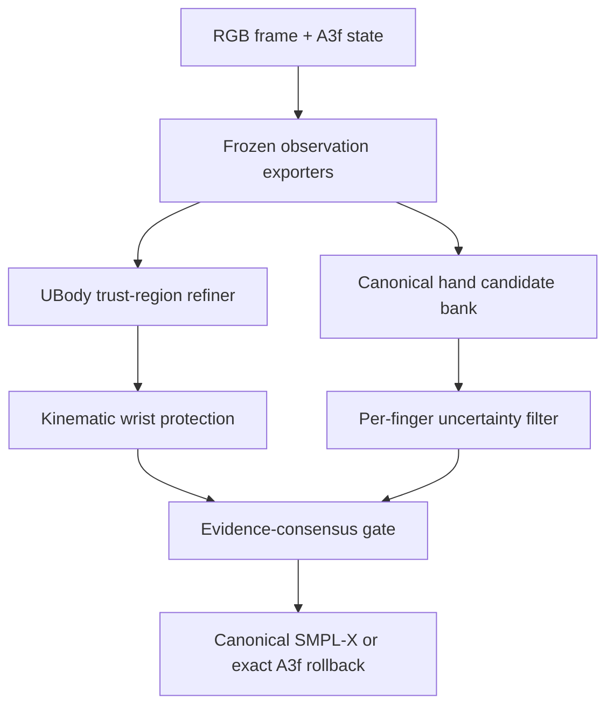

# SignEFT-X: thiết kế và triển khai RGB-only cho 3D Sign Language Reconstruction trên TR-V2V

> Phiên bản: 3.0, ngày 2026-08-31  
> Trạng thái: implementation blueprint + research decision record  
> Baseline an toàn: SignPCC-X A3f, kế thừa từ DexAvatar  
> Giao thức đánh giá: giữ nguyên tuyệt đối code SGNify do tác giả cung cấp

## Execution status audit — 2026-09-01

Tài liệu này là **implementation blueprint và gated ablation plan**, không phải mô tả của một monolithic method đã được chạy nguyên khối. Section 19 ghi rõ “không chạy full method ngay”: module chỉ được đưa vào final khi row trước vượt no-regression gate. Vì vậy cần phân biệt bốn trạng thái sau:

| Nhánh | Trạng thái thực tế | Bằng chứng/quyết định |
|---|---|---|
| C0 | **RAN — parity pass** | Reproduce A3f trên engineering12 và full57. |
| C1 heatmap | **RAN — rejected** | 0/298 candidate được gate nhận; một family `pose2d` không đủ điều kiện hai-family consensus. |
| C2 + NLF | **RAN — rejected** | 0/298 candidate được nhận; `pose2d` và `nlf3d` không tạo consensus đủ mạnh. |
| C3 wrist-protected coupling | **RAN — rejected** | Initial C3 nhận 0/298. C3-lite-v3 nhận 59/298 nhưng làm xấu `All`, `UBody`, `UBody-F`, `UBody-H` và `LHand` so với C0. |
| C4 Sapiens2 segmentation | **RAN — rejected** | Bản triển khai dùng 8-channel Sapiens2 probabilities và differentiable soft point-splat part renderer. Nó nhận 48/298 nhưng làm xấu `All`, `UBody`, `UBody-F`, `UBody-H`; không được promote. Đây không phải triangle-rasterizer implementation đúng từng chi tiết của công thức blueprint. |
| C5 pointmap | **DEPENDENCY-GATED — not run; not wired** | C4 không pass; CLI hiện hard-fail nếu bật `pointmap`. Chưa có kết quả ablation C5. |
| C6 derived normals | **DEPENDENCY-GATED — not run; not implemented** | Phụ thuộc C5 calibration/pass; chưa có kết quả ablation C6. |
| H0 | **RAN — parity pass** | Exact A3f hand control. |
| H1 canonical WiLoR fingers | **RAN — promoted** | Pass engineering12, untouched45 và full57; đây là thành phần duy nhất của frozen Final H1. |
| H2 WiLoR TTA medoid | **RAN — rejected** | Kém H1 trên cả hai hand metrics của engineering12. |
| H3 variance gate | **RAN — rejected** | Activation quá hẹp và kém H1. |
| H4 HaMeR cross-expert veto | **RAN — rejected** | Không vượt H1; HaMeR ở row này là consensus/veto, chưa phải proposal generator. |
| H5 DPoser-X veto | **DEPENDENCY-GATED — not run; not implemented** | Optional và được thiết kế chỉ chạy sau một H4 được promote; prerequisite không tồn tại. |
| H6 tiny wrist unlock | **RAN — rejected negative control** | Làm xấu 5/6 metrics so với H1. |
| Stage C combined UBody + hand | **NOT RUN** | Không có C1–C4 nào được promote để combine với H1. |

Do đó, câu mô tả chính xác là: **đa số ladder C1–C4 và H1–H4/H6 đã được chạy ablation; các nhánh thua đã bị loại. C5, C6, H5 và combined Stage C thực sự chưa chạy. Frozen Final H1 không phải full V3; nó là subset H1 được kiểm chứng của blueprint.** Các số và lý do đầy đủ nằm trong `SignEFT-X/reports/engineering12_core_ablation.*`, `SignEFT-X/reports/engineering12_hand_ablation.*` và `SignEFT-X/reports/final_result_card.*`.

Nghiên cứu sau blueprint (H7–H15) được ghi riêng trong
`SignEFT_X_H1_Beyond_Research_Log.md`. Tính đến 2026-09-01, H15-v2/EI-AMER là
candidate exploratory tốt nhất trên attached full57: nó giữ byte/array-exact
mọi H1 incumbent ngoài đúng side được rescue, pass invariant audit với zero
violation và cải thiện cả sáu aggregate. Đây **không** có nghĩa các nhánh C5,
C6, H5 hoặc combined Stage C của V3 đã được chạy; H15-v2 là một hướng
post-blueprint khác và cần tập xác nhận mới trước claim generalization không
thiên lệch.

## 0. Kết luận trước khi triển khai

Hướng có xác suất cải thiện cao nhất không phải thay DexAvatar/A3f bằng một whole-body regressor mới. Kết quả đã có chứng minh cách đó rất rủi ro: H4W++ full replacement làm `TR All` trên panel tăng từ `41.5498` lên `83.5794` mm. Hướng nên triển khai là:

1. Giữ A3f làm candidate số 0 và làm điểm rollback chính xác.
2. Chỉ mở các bậc tự do còn sai: spine/collar/shoulder/elbow cho UBody; từng finger joint có độ tin cậy cao cho hai tay.
3. Dùng nhiều bằng chứng RGB độc lập: phân bố heatmap 2D, NLF 3D, body-part probability, pointmap tương đối và ensemble WiLoR/HaMeR.
4. Dùng tay như endpoint evidence để sửa chuỗi shoulder–elbow, nhưng bù local wrist bằng forward kinematics để giữ nguyên global hand orientation và hand geometry đã tốt.
5. Candidate chỉ được nhận khi cải thiện có ý nghĩa trên ít nhất hai họ bằng chứng độc lập, trong đó phải có một họ 3D nếu candidate thay đổi chiều sâu. Nếu không, copy nguyên output A3f.
6. Không dùng temporal pose smoothing vì các frame giữa rõ, ít occlusion/blur và ablation hiện tại không chỉ ra lỗi temporal.
7. Không huấn luyện lại bằng InterHand, AMASS hay dataset lớn. Mọi expert đều frozen; phần mới là test-time refinement, uncertainty calibration, kinematic protection và evidence gate.

Tên method đề xuất: **SignEFT-X — Evidence-Factorized Trust-Region Refinement for Expressive Sign Reconstruction**.

Không có phương pháp nào có thể “đảm bảo SOTA” trước khi chạy evaluator. Thiết kế này bảo đảm một điều thực tế hơn: nếu evidence gate không đủ mạnh hoặc một module lỗi, output quay về đúng A3f thay vì bắt buộc nhận một refinement xấu.

## 1. Ràng buộc cứng

### 1.1 Input được phép

- RGB frame thuộc đúng manifest TR-V2V.
- Trạng thái/mesh A3f đã được canonicalize bằng cùng neutral SMPL-X.
- Output của frozen general-purpose models chạy trực tiếp từ RGB: 2D pose, NLF, body-part segmentation, pointmap, WiLoR và HaMeR.
- Camera/crop transform và shared signer shape đã có trong A3f.
- SMPL-X model assets hợp lệ theo license.

### 1.2 Input bị loại

- Không trích xuất hay sử dụng marker, màu marker, vị trí marker, pattern của hệ motion-capture hoặc calibration cue đặc thù phòng quay.
- Không đọc GT, evaluator region indices hay official metric trong fitting/ranking theo frame.
- Không dùng frame trước/sau làm pose target, không copy pose từ frame lân cận.
- Không thay đổi `evaluate_new_fitting.py` hay cách evaluator center/alignment các vùng.

### 1.3 State phải khóa mặc định

- `betas`: shared A3f identity, không tối ưu theo frame.
- `expression`, `jaw_pose`, eye poses: giữ A3f.
- `camera K`: giữ shared calibration; chỉ cho phép nuisance translation dùng trong reprojection.
- Finger pose: khóa trong UBody stages.
- Wrist local rotation: không tối ưu tự do; được tính bằng phép bù kinematic.
- Global/root orientation: khóa ở V1; chỉ ablate residual rất nhỏ sau khi NLF và pointmap cùng đồng thuận.

## 2. Audit evidence hiện có

### 2.1 Output archive

`output4(2).zip` chứa 374 frame duy nhất, bị lặp hai lần trong archive, thuộc 15 signs. Các file là ảnh overlay `2032×678`; không có SMPL-X parameter NPZ, mesh OBJ riêng hay metric per-frame. Vì vậy có thể audit failure mode bằng mắt, nhưng không thể suy ra error theo vertex hoặc xếp hạng sign chính xác từ archive này.

Quan sát nhất quán trên contact sheet:

- Các frame giữa rõ; hai bàn tay thường nhìn thấy được; không thấy motion blur/occlusion là failure chính.
- Sai lệch nổi bật tập trung ở shoulder elevation, clavicle, elbow bend, forearm direction và độ dày/độ nghiêng upper torso.
- Tay không chủ yếu sai vì translation; lỗi còn lại là articulation theo ngón và đôi khi global palm orientation.
- Mesh tổng thể hợp lý, nên full replacement có nhiều nguy cơ phá các vùng đã đúng.

### 2.2 Full protocol hiện tại

| Metric | A0 DexAvatar | A3f | Delta A3f − A0 | Kết luận |
|---|---:|---:|---:|---|
| TR All | 42.5867 | **42.0936** | **−0.4931** | A3f tốt hơn |
| TR UBody | 26.4560 | **25.8311** | **−0.6249** | còn dư địa lớn |
| TR UBody − face | 29.9074 | **29.1458** | **−0.7616** | torso/arms có lợi |
| TR UBody − head | 40.7960 | **39.6963** | **−1.0997** | vùng không-head là bottleneck |
| TR LHand | 13.5735 | **12.8466** | **−0.7269** | tay trái đã khá tốt |
| TR RHand | 12.9271 | **12.1275** | **−0.7996** | tay phải đã khá tốt |

### 2.3 Fixed 12-sign/298-frame panel

| Run | Thay đổi chính | All | UBody | UBody−F | LHand | RHand | Quyết định |
|---|---|---:|---:|---:|---:|---:|---|
| A0 | DexAvatar/HaMeR | 41.5498 | 25.0369 | 28.4327 | 12.7495 | 12.1387 | reference |
| A1 | H4W++ full export | 83.5794 | 32.3897 | 36.3158 | 15.3049 | 16.3241 | reject |
| A2 | H4W++ + shared beta | 83.4253 | 31.9342 | 35.8029 | 15.2843 | 16.3348 | reject |
| A3e | canonical, 50-frame beta | 41.1614 | 24.5185 | 27.7585 | 12.3309 | **11.9140** | keep |
| **A3f** | **canonical, 200-frame beta** | **41.1539** | **24.4695** | **27.7074** | 12.3310 | 11.9162 | promote |
| A4 | wrist hypotheses | 41.5707 | 25.1852 | 28.4581 | 19.6773 | 19.7694 | reject |
| A5 | contact | 41.1548 | 24.4709 | 27.7091 | 12.3413 | 11.9217 | reject |

### 2.4 Chẩn đoán nguyên nhân

#### A1/A2: lỗi replacement, không phải bằng chứng H4W++ vô dụng

Source H4W++ cho thấy hai thao tác khác nhau:

- `HandControlNet` lấy WiLoR features, chạy bilateral cross-attention, sau đó đưa feature tay qua các zero-initialized `1×1` convolutions vào từng depth của body ViT.
- `combine_smplx_mano()` đưa MANO về zero-root, ước lượng rigid `R,t` tới wrist của SMPL-X, rồi scatter MANO vertices vào mesh SMPL-X và smooth boundary.

Hai thao tác đó hữu ích trong domain huấn luyện của H4W++, nhưng full hybrid mesh không phải một canonical SMPL-X state duy nhất. A1 cho thấy convention/camera/shape/domain gap đủ lớn để lấn át lợi ích. SignEFT-X chỉ giữ ý tưởng **hand evidence phải tác động tới arm chain**, không dùng hybrid mesh replacement.

Source: [H4W++ `main/model.py`](https://github.com/mks0601/Hand4Whole-plus-plus_RELEASE/blob/main/main/model.py), [H4W++ `common/nets/module.py`](https://github.com/mks0601/Hand4Whole-plus-plus_RELEASE/blob/main/common/nets/module.py).

#### A4: metric tay không cho phép tùy tiện xoay palm

Official hand metric center translation nhưng không Procrustes-align rotation/scale. Vì vậy một wrist rotation có thể nhìn hợp ảnh hơn nhưng làm mọi hand vertex quay quanh wrist và tăng lỗi mạnh. Kết quả `~12 → ~19.7 mm` là bằng chứng phải khóa wrist, trừ khi có nhiều nguồn 3D độc lập cùng thắng và official dev gate cho phép.

#### A5: proxy contact không đồng nhất với official metric

Contact target error giảm `5.04 → 1.57 mm`, nhưng mọi official primary metric xấu nhẹ. Điều này chứng minh một scalar proxy có thể bị optimizer “game”. Contact không thuộc core V3.

#### A3e → A3f: identity đã gần bão hòa

Tăng calibration từ 50 lên 200 frame chỉ đổi `All −0.0075 mm` trên panel và tay gần như hòa. Không nên tiếp tục tiêu tài nguyên vào beta/camera calibration; cần chuyển sang pose residual có kiểm soát.

## 3. Research question và hypothesis

### 3.1 Research question

Có thể giảm UBody-H và tiếp tục giảm LHand/RHand bằng inference-only RGB evidence, trong khi bảo toàn các vùng A3f đã tốt và không dùng temporal smoothing hay dataset huấn luyện lớn hay không?

### 3.2 Ba hypothesis có thể falsify

**H1 — upper-body depth ambiguity:** 2D reprojection đơn lẻ không đủ sửa elbow/forearm depth. NLF bone vector và pointmap-relative depth phải giúp giảm UBody-H khi bị giới hạn bởi trust region.

**H2 — protected hand-to-body coupling:** hand centroid/palm evidence giúp xác định distal arm endpoint. Nếu bù wrist giữ root-centered hand geometry, có thể giảm shoulder/elbow error mà không làm LHand/RHand xấu.

**H3 — clear-hand consensus:** vì frame rõ, disagreement giữa WiLoR/HaMeR/TTA phản ánh uncertainty. Chỉ transplant finger pose ở joint có variance thấp sẽ tốt hơn việc tối ưu wrist hoặc thay toàn bộ MANO mesh.

Mỗi hypothesis có ablation riêng; không gộp tất cả trước khi từng nhánh vượt gate.

## 4. Literature review và quyết định sử dụng

Chỉ nguồn paper/repository chính thức được dùng trong bảng sau.

| Công trình | Ý tưởng có thể chuyển | Khả năng áp dụng TR-V2V | Quyết định |
|---|---|---|---|
| [DexAvatar](https://github.com/kaustesseract/DexAvatar) | body/hand priors và pipeline sign-specific | baseline trực tiếp | Giữ A0/A3f, không phụ thuộc novelty vào SignHPoser/SignBPoser |
| [Hand4Whole++](https://github.com/mks0601/Hand4Whole-plus-plus_RELEASE) | hand feature điều kiện hóa body; bilateral hand attention | đúng failure shoulder–elbow–wrist, nhưng full output đã fail | Mượn coupling principle; không dùng full replacement |
| [Neural Localizer Fields](https://github.com/isarandi/nlf), [paper](https://arxiv.org/abs/2407.07532) | dự đoán vị trí 3D của arbitrary continuous body points; có PyTorch/TensorFlow models | cung cấp evidence 3D độc lập, cache nhỏ | **Core 3D expert** |
| [HUMR](https://arxiv.org/abs/2411.16289) | dùng toàn bộ distribution của 2D detector để biểu diễn uncertainty | tránh ép argmax sai; rất hợp test-time fitting | **Dùng heatmap NLL + entropy**, không port whole HUMR |
| [Sapiens2](https://github.com/facebookresearch/sapiens2), [paper](https://arxiv.org/abs/2604.21681) | 308 keypoints, 29-part segmentation, normals, pointmap; 1K human-centric backbone | dense RGB evidence mạnh, nhưng mỗi task có checkpoint | **Recommended staged add-on, model 0.4B** |
| [Personalized 3D Human Pose and Shape Refinement](https://arxiv.org/abs/2403.11634) | render initial mesh, học dense displacement và refine visible vertices | xác nhận feedback/correspondence tốt hơn keypoint-only | Mượn fixed-visible-correspondence; không dùng vì không có lightweight released checkpoint |
| [ReFit](https://github.com/yufu-wang/ReFit) | recurrent render/image feedback | hỗ trợ triết lý iterative feedback | Idea only; code SMPL, thêm weights/detector |
| [PyMAF-X](https://github.com/HongwenZhang/PyMAF-X) | mesh-aligned feedback, adaptive body/hand integration | liên quan expressive body/hand | Idea only; stack PyTorch 1.9 cũ và full regressor |
| [BLADE](https://github.com/NVlabs/blade) | depth-aware body/camera estimation | hữu ích nếu perspective/camera là bottleneck | Không core: camera đã calibrated và metric translation-aligned |
| [PEAR](https://arxiv.org/abs/2601.22693) | pixel-aligned expressive whole-body recovery | whole-body candidate mới, fast | Chỉ external candidate sau core; full replacement có rủi ro A1 |
| [DPoser-X](https://github.com/moonbow721/DPoser-X), [paper](https://arxiv.org/abs/2508.00599) | diffusion priors riêng cho body/hand/wholebody; fitting từ 2D | có thể reject anatomically implausible candidate | Optional plausibility veto; không để prior kéo optimizer |
| [WiLoR](https://github.com/rolpotamias/WiLoR) | in-the-wild MANO reconstruction, hand crop features | đã liên quan H4W++; frame rõ | **Core hand expert** |
| [HaMeR](https://github.com/geopavlakos/hamer) | transformer hand reconstruction | baseline đã có; độc lập với WiLoR | **Core cross-expert** |
| [Hamba](https://github.com/humansensinglab/Hamba) | graph-guided bi-scanning hand mesh | expert thứ ba mạnh | Optional sau khi WiLoR+HaMeR bão hòa |
| [Hand Texture Module](https://github.com/gkarv/Hand-Texture-Module), [paper](https://arxiv.org/abs/2508.09629) | texture supervision cho hand mesh | lợi ích chính kỳ vọng ở occlusion/appearance khó | Không ưu tiên vì frame TR-V2V rõ; chỉ thử như một frozen candidate nếu checkpoint đã có |
| [SMPLest-X](https://github.com/MotrixLab/SMPLest-X) | large expressive regressor | checkpoint lớn, full replacement | Không tải mặc định |
| [AiOS](https://github.com/MotrixLab/AiOS) | progressive whole-body reconstruction | architecture tốt nhưng dataset-heavy | Không core |
| [HaWoR](https://github.com/ThunderVVV/HaWoR) | world-space temporal hand reconstruction | giải quyết video/occlusion/ego motion | Loại khỏi V3 vì không khớp failure mode và tốn storage |

### 4.1 Vì sao Sapiens2 đáng thử nhưng không được tải mọi checkpoint cùng lúc

Repository chính thức công bố:

- pose: 308 whole-body keypoints;
- segmentation: 29 classes, gồm left/right hand, lower/upper arm, torso và clothing;
- pointmap: `(x,y,z)` per-pixel trong camera coordinate frame;
- model task nhỏ nhất được release là 0.4B;
- cần Python `>=3.12`, PyTorch `>=2.7`, nên phải chạy sidecar environment.

Sapiens2 paper báo cải thiện so với Sapiens thế hệ trước trên pose, segmentation và normals. Tuy nhiên điểm mạnh benchmark upstream không tự động bảo đảm TR-V2V. Vì giới hạn lưu trữ, thứ tự tải là:

1. segmentation 0.4B;
2. chỉ khi segmentation branch qua gate, tải pointmap 0.4B;
3. pose 0.4B chỉ khi existing Sapiens/DWPose heatmap không đủ chi tiết ở tay;
4. không tải normal checkpoint ở V1; lấy normals bằng finite difference từ pointmap.

Official task details: [Sapiens2 pose](https://github.com/facebookresearch/sapiens2/blob/main/docs/POSE.md), [segmentation](https://github.com/facebookresearch/sapiens2/blob/main/docs/SEG.md), [pointmap](https://github.com/facebookresearch/sapiens2/blob/main/docs/POINTMAP.md), [normals](https://github.com/facebookresearch/sapiens2/blob/main/docs/NORMAL.md).

## 5. Method overview



### 5.1 Bốn họ evidence

| Family | Observation | Dùng cho | Có được tính độc lập trong gate? |
|---|---|---|---|
| `pose2d` | low-resolution full heatmap, entropy, 2D covariance | torso/arm/hand reprojection | Có |
| `nlf3d` | pelvis/neck-relative 3D joints và bone vectors từ TTA | depth và arm articulation | Có |
| `dense_rgb` | Sapiens2 part probabilities + pointmap + derived normals | silhouette, relative depth, visible surface | Một family duy nhất; seg và pointmap không được đếm hai lần |
| `hand_expert` | A3f, WiLoR, HaMeR, optional Hamba; TTA covariance | finger articulation | Có |

### 5.2 Candidate state

Với baseline SMPL-X state

\[
\Theta_0 = (\beta^*, R_{root}^0, R_{body}^0,
R_{lh}^0,R_{rh}^0,\psi^0,t^0,K^*)
\]

SignEFT-X không dự đoán lại toàn bộ `Θ`. Nó tối ưu residual Lie algebra nhỏ:

\[
R_j(\delta_j)=\exp([\delta_j]_\times)R_j^0,
\quad \|\delta_j\|_2 \le r_j.
\]

Các radius ban đầu dùng để smoke-test, sau đó freeze trước official run:

| Joint group | Radius ban đầu |
|---|---:|
| spine1–3, neck | 5° |
| left/right collar | 7° |
| shoulders | 10° |
| elbows | 8° |
| wrists | analytic compensation; không có free radius |
| accepted finger joint | 8° |
| root optional ablation | 3° |

Radius là safety bound, không phải target. Nếu optimum chạm bound ở quá 10% frames, dừng và audit evidence thay vì nới tự động.

## 6. Upper-body objective

### 6.1 Heatmap distribution loss

Không dùng chỉ `argmax keypoint + L2`. Với heatmap normalized `H_j`, projected joint `u_j(Θ)`:

\[
E_{pose2d}(\Theta)=
\frac{\sum_j w_j\,[-\log(H_j(u_j(\Theta))+\epsilon)]}
{\sum_j w_j+\epsilon}.
\]

Entropy confidence:

\[
w_j = q_j\,\mathrm{clip}\left(1-\frac{\mathcal H(H_j)}
{\log(HW)},0,1\right),
\]

trong đó `q_j` là detector visibility score. Sampling phải dùng bilinear `grid_sample`; không round pixel.

### 6.2 NLF bone-vector loss

NLF và SMPL-X có thể khác absolute translation/scale. Không dùng rotation Procrustes vì official protocol cũng không rotation-align. Dùng relative bone vector:

\[
b=(p_{child}-p_{parent}),\quad
\hat b=b/(\|b\|+\epsilon).
\]

\[
E_{nlf-dir}=\sum_b w_b\rho(\hat b_b^{smplx}-\hat b_b^{nlf}).
\]

Thêm log length-ratio với weight nhỏ, sau khi scale signer đã fixed:

\[
E_{nlf-len}=\sum_b w_b\rho\left(
\log\frac{\|b_b^{smplx}\|+\epsilon}
{s_{nlf}\|b_b^{nlf}\|+\epsilon}\right).
\]

`s_nlf` là một scalar robust trên torso bones, estimate một lần mỗi frame rồi detach. Không estimate `R`.

### 6.3 Part probability loss

Renderer xuất soft part masks `M_c(Θ)`. Sapiens2 cung cấp probability `P_c`. Chỉ giữ các classes:

- face/neck;
- torso + upper clothing union;
- left/right upper arm;
- left/right lower arm;
- left/right hand.

Loss gồm soft IoU và signed distance-transform boundary:

\[
E_{seg}=\sum_c \alpha_c
\left(1-\frac{2\langle M_c,P_c\rangle+\epsilon}
{\|M_c\|_1+\|P_c\|_1+\epsilon}\right)
+\lambda_{dt}\sum_c\|M_c\odot D(P_c)\|_1.
\]

Không ép naked SMPL-X surface khớp loose clothing. Torso/clothing chỉ dùng outer silhouette với weight thấp; arm/hand classes có weight cao hơn. Pixels trong `boundary_band=5 px` bị loại khỏi pointmap correspondence vì label/depth không ổn định.

### 6.4 Pointmap relative-surface loss

Sapiens2 pointmap là visible, clothed surface và có scale/focal ambiguity. Vì vậy tuyệt đối không minimize raw `||V-P||` trên toàn thân.

Quy trình an toàn:

1. Render A3f và lấy visible baseline vertices.
2. Chỉ giữ skin/exposed arm/hand pixels có part probability `>0.8`, cách class boundary ít nhất 5 pixels.
3. Sample pointmap tại projection của **baseline** visible vertex; correspondence được freeze trong một trust-region stage.
4. Estimate robust uniform scale `s` và translation `t` từ stable torso/neck anchors; không estimate rotation.
5. Detach `s,t` khỏi optimizer.
6. Dùng Tukey/Huber residual; reject top 20% residual để giảm clothing bias.

\[
E_{point}=\frac1{|\mathcal V|}\sum_{i\in\mathcal V}
w_i\rho\left(V_i(\Theta)-[sP(\pi(V_i^0))+t]\right).
\]

Đối với torso mặc áo, chỉ dùng relative depth median và part principal axis, không dùng full point-to-surface distance.

### 6.5 Pointmap-derived normal loss

Không tải normal checkpoint. Với pointmap `P(u,v)`:

\[
n_P=\mathrm{normalize}\left(
(P_{u+1,v}-P_{u-1,v})\times(P_{u,v+1}-P_{u,v-1})
\right).
\]

So với rendered camera-frame normal `n_R`, chỉ ở eroded high-confidence masks:

\[
E_{normal}=\mathrm{mean}(1-\langle n_P,n_R\rangle).
\]

Weight mặc định thấp vì normal từ pointmap có correlated error.

### 6.6 A3f trust-region prior

Không dùng Euclidean axis-angle loss. Dùng geodesic SO(3):

\[
E_{trust}=\sum_j \gamma_j
\|\log(R_jR_j^{0\top})\|_2^2.
\]

### 6.7 Normalization và tổng objective

Mỗi energy được normalize bởi robust scale trên baseline observations, không normalize bằng GT:

\[
\tilde E_k=(E_k-\mathrm{median}(E_k^0))/(\mathrm{MAD}(E_k^0)+\epsilon).
\]

Stage optimizer dùng:

\[
L_U = 1.0\tilde E_{pose2d}+1.0\tilde E_{nlf3d}
+0.4\tilde E_{seg}+0.6\tilde E_{point}
+0.1\tilde E_{normal}+0.5E_{trust}.
\]

Đây là initialization weights. Chỉ tune từng weight bằng sequential ablation; selection cuối cùng vẫn dùng Pareto evidence gate, không dùng scalar `L_U`.

## 7. Kinematic hand protection khi sửa UBody

### 7.1 Vấn đề

Trong SMPL-X, wrist thuộc `body_pose`; 15 hand joints chỉ điều khiển fingers. Nếu shoulder/elbow đổi, global wrist transform đổi và toàn bộ hand vertices quay theo. Điều này giải thích vì sao sửa UBody có thể làm hand metric xấu dù finger pose không đổi.

### 7.2 Analytic wrist compensation

Lưu baseline global wrist rotation `G_w^0`. Sau khi update parent chain, tính global parent rotation mới `G_p'`. Đặt local wrist rotation:

\[
R_w'=(G_p')^\top G_w^0.
\]

Do đó:

\[
G_w'=G_p'R_w'=G_w^0.
\]

Finger local rotations và beta giữ nguyên. Global wrist position có thể đổi để khớp arm evidence; official hand metric center translation nên không phạt rigid translation của cả bàn tay.

### 7.3 Numerical projection

SMPL-X pose blend shapes/LBS có thể tạo sai số nhỏ dù phép quay global được giữ. Sau analytic step, chạy tối đa 5 bước Gauss-Newton/Adam trên **chỉ local wrist residual** để minimize:

\[
E_{protect}=\left\|
(V_H'-\bar V_H')-(V_H^0-\bar V_H^0)
\right\|_1,
\]

với target duy nhất là baseline root-centered hand geometry, không phải image evidence. Nếu residual sau projection lớn hơn numerical threshold lấy từ unit test, reject UBody candidate.

### 7.4 Hand endpoint coupling

Từ heatmap/segmentation/pointmap lấy wrist và palm-center evidence. Chúng chỉ ràng buộc vị trí distal endpoint của forearm:

\[
E_{endpoint}=\rho(\pi(J_{wrist})-u_{wrist})
+\eta\rho((J_{wrist}-J_{elbow})-	ilde b_{forearm}^{3D}).
\]

Không dùng evidence này để free-rotate wrist. Đây là phiên bản inference-time, differentiable của ý tưởng H4W++ “hand informs body”, nhưng không cần huấn luyện CHAM mới và không nhập H4W++ mesh.

## 8. Hand refinement

### 8.1 Nguyên tắc

- Candidate số 0 luôn là A3f.
- Discard expert `camera`, `translation`, `betas` và global wrist/root orientation.
- Chỉ giữ thông tin finger articulation.
- Mọi expert phải được đưa về cùng SMPL-X layer, shared beta và baseline wrist frame trước khi so sánh.
- Không chạy `−30/0/+30°` palm rotation; A4 đã falsify hướng đó.

### 8.2 Candidate bank tiết kiệm

Cho mỗi hand crop:

1. A3f finger pose.
2. WiLoR với crop chuẩn.
3. WiLoR TTA: scale `0.9`, `1.1`; rotation `−10°`, `+10°` ở scale 1.0.
4. HaMeR crop chuẩn.
5. Optional HaMeR TTA chỉ khi 1–4 chưa qua gate.
6. Optional Hamba chỉ sau khi WiLoR+HaMeR ablation bão hòa.

Không dùng horizontal flip trong production candidate bank; chỉ dùng flip/unflip trong coordinate parity test. Điều này giảm rủi ro handedness.

### 8.3 Palm-local canonicalization

Từ wrist `W`, index MCP `I`, pinky MCP `P`:

\[
x=\mathrm{norm}(I-P),\quad
y_0=\mathrm{norm}((I+P)/2-W),\quad
z=\mathrm{norm}(x\times y_0),\quad
y=z\times x.
\]

Frame `C=[x,y,z]` phải có determinant `+1`; left/right mapping có unit test riêng. Expert joints được root-center và chuyển về palm frame. Sau đó fit 15 finger rotations của SMPL-X, beta fixed, wrist fixed. Loss dùng normalized per-finger joints; không fit expert hand shape.

### 8.4 TTA uncertainty

Với tangent residual `ξ_{e,a,j}=log(R_{e,a,j}R_{med,j}^T)` từ expert `e`, augmentation `a`, joint `j`:

\[
\Sigma_j=\mathrm{Cov}(\{\xi_{e,a,j}\}).
\]

- `trace(Σ_j)` thấp: joint có thể được mở tối đa 8°.
- variance trung bình: chỉ cho discrete medoid candidate.
- variance cao: freeze A3f joint.

Threshold lấy từ bimodal distribution của variance trên development observations, không từ GT per-frame.

### 8.5 Official-like hand distance

Mọi candidate disagreement dùng cùng invariance với evaluator:

\[
d_{TR}(A,B)=\frac1N\sum_i\|
(A_i-\bar A)-(B_i-\bar B)
\|_2.
\]

Không estimate rotation hoặc scale. Geometric medoid là candidate có tổng `d_TR` nhỏ nhất tới các expert khác.

### 8.6 Hand energy

\[
L_H = 1.0E_{hand-heatmap}
+0.5E_{expert-consensus}
+0.3E_{hand-mask}
+0.2E_{local-pointmap}
+0.5E_{finger-trust}.
\]

Pointmap chỉ dùng palm/whole-hand relative depth; resolution whole-body thường không đủ tin cậy cho từng DIP/fingertip. Finger articulation chủ yếu dựa vào 308-keypoint heatmap hoặc hand-crop experts.

### 8.7 DPoser-X nếu dùng

DPoser-X chỉ tính plausibility score. Reject candidate nếu score vượt percentile bất thường đã calibrate trên A3f; không backprop prior vào pose ở core run. Lý do: generic anatomy prior có thể kéo một sign-specific articulation đúng về pose phổ biến nhưng sai metric.

## 9. Evidence-consensus gate

### 9.1 Vì sao không dùng weighted scalar ranker

A5 chứng minh optimizer có thể giảm proxy mạnh trong khi official metrics xấu. Vì vậy scalar objective dùng để tạo candidate, nhưng không đủ quyền chọn candidate.

### 9.2 Noise-calibrated delta

Với family `k`:

\[
\Delta_k(c)=E_k(c)-E_k(A3f).
\]

Ước lượng noise floor `σ_k` từ TTA/bootstrap observation disagreement. Candidate thắng family nếu:

\[
\Delta_k(c)<-2\sigma_k.
\]

Candidate thua family nếu:

\[
\Delta_k(c)>+\sigma_k.
\]

### 9.3 Gate cho UBody

Accept khi đồng thời:

1. finite, topology, coordinate và trust-region checks pass;
2. ít nhất hai family thắng;
3. ít nhất một trong `nlf3d` hoặc pointmap component của `dense_rgb` thắng nếu candidate thay đổi depth;
4. không family nào thua quá tolerance;
5. root-centered LHand/RHand drift sau wrist protection dưới numerical budget;
6. off-target face/lower-body vertex drift dưới budget;
7. candidate không chạm rotation bound hàng loạt.

### 9.4 Gate cho hand

Accept khi:

1. `hand_expert` thắng hoặc ít nhất WiLoR và HaMeR đồng thuận trong noise floor;
2. `pose2d` hoặc `dense_rgb` thắng;
3. wrist/global palm orientation bằng baseline trong core configuration;
4. chỉ các finger joints low-variance thay đổi;
5. opposite hand, face và UBody không đổi ngoài floating-point tolerance.

### 9.5 Exact rollback

Nếu bất kỳ điều kiện nào fail, không re-export A3f qua SMPL-X vì serialization/numerical version có thể đổi. Copy byte-for-byte baseline OBJ và baseline parameter artifact vào run output; decision JSON ghi `accepted=false` và lý do.

## 10. Cấu trúc repository

```text
SignEFT-X/
├── README.md
├── pyproject.toml
├── environment-core.yml
├── environment-sapiens2.yml
├── third_party.lock.yaml
├── configs/
│   ├── trv2v_a3f_nomarker.yaml
│   ├── ablations/
│   │   ├── c0_a3f.yaml
│   │   ├── c1_heatmap.yaml
│   │   ├── c2_nlf.yaml
│   │   ├── c3_wrist_protect.yaml
│   │   ├── c4_seg.yaml
│   │   ├── c5_pointmap.yaml
│   │   ├── h1_wilor.yaml
│   │   ├── h2_wilor_tta.yaml
│   │   └── h3_cross_expert.yaml
│   └── schemas/
│       ├── baseline_state.schema.json
│       ├── observation.schema.json
│       └── decision.schema.json
├── scripts/
│   ├── prepare_manifest.py
│   ├── export_pose_observations.py
│   ├── export_nlf_observations.py
│   ├── export_sapiens2_seg.py
│   ├── export_sapiens2_pointmap.py
│   ├── export_hand_candidates.py
│   ├── run_refinement.py
│   ├── materialize_official.py
│   ├── preflight.py
│   └── run_official_eval.py
├── signeft/
│   ├── data/
│   │   ├── manifest.py
│   │   ├── transforms.py
│   │   └── contracts.py
│   ├── observations/
│   │   ├── heatmaps.py
│   │   ├── nlf.py
│   │   ├── part_masks.py
│   │   ├── pointmaps.py
│   │   └── uncertainty.py
│   ├── model/
│   │   ├── smplx_adapter.py
│   │   ├── joint_map.py
│   │   ├── kinematics.py
│   │   ├── renderer.py
│   │   └── hand_canonicalizer.py
│   ├── losses/
│   │   ├── heatmap_nll.py
│   │   ├── nlf_bones.py
│   │   ├── segmentation.py
│   │   ├── pointmap.py
│   │   ├── normals.py
│   │   └── trust_region.py
│   ├── optim/
│   │   ├── stages.py
│   │   ├── ubody_refiner.py
│   │   └── hand_refiner.py
│   ├── gating/
│   │   ├── evidence_gate.py
│   │   ├── geometry_budget.py
│   │   └── rollback.py
│   ├── io/
│   │   ├── baseline_reader.py
│   │   ├── state_writer.py
│   │   └── obj_writer.py
│   └── cli.py
├── tests/
│   ├── test_manifest.py
│   ├── test_evaluator_lock.py
│   ├── test_crop_roundtrip.py
│   ├── test_joint_mapping.py
│   ├── test_wrist_compensation.py
│   ├── test_hand_centering.py
│   ├── test_pointmap_alignment.py
│   ├── test_gate.py
│   ├── test_rollback_exact.py
│   └── test_topology.py
└── runs/                       # ignored by Git
```

`third_party/`, checkpoints, RGB, SMPL-X assets, GT và runs không commit vào Git. Chỉ commit source, configs, patches, checksums và result summaries.

## 11. Dependency strategy

### 11.1 Không duplicate repo

Trước khi clone, kiểm tra local path từ SignPCC-X audit. Nếu repo đã tồn tại đúng commit, symlink read-only vào `third_party/`. Chỉ clone khi chưa có.

### 11.2 Runtime dependencies

| Dependency | Vai trò | V1 bắt buộc? | Ghi chú storage/environment |
|---|---|---:|---|
| DexAvatar | baseline/protocol reference | Có | reuse local |
| SGNify | official evaluator | Có | evaluator read-only |
| SMPL-X Python package/assets | canonical mesh | Có | assets không phân phối lại |
| PyTorch3D hoặc nvdiffrast | differentiable rasterization | Có một | chọn cái tương thích core env |
| NLF PyTorch release | 3D body evidence | Có cho C2 | model research-use license |
| WiLoR | hand expert | Có | reuse H4W++/local install |
| HaMeR | second hand expert | Có | baseline thường đã có |
| Sapiens2 0.4B segmentation | dense 2D part evidence | C4 | tải sau C1–C3 |
| Sapiens2 0.4B pointmap | dense 3D evidence | C5 | tải chỉ khi C4 pass |
| H4W++ | source reference only | Không runtime | không tải checkpoint mới |
| DPoser-X | plausibility veto | Không | environment riêng |
| Hamba | third hand expert | Không | chỉ ablate muộn |

### 11.3 Clone commands

Thay các path mẫu bằng absolute path thực; không dùng `~`.

```bash
export SIGNEFT_ROOT=/absolute/path/SignEFT-X
export SIGNEFT_THIRD_PARTY=/absolute/path/SignEFT-X/third_party
mkdir -p "$SIGNEFT_THIRD_PARTY"

git clone --filter=blob:none --depth 1 \
  https://github.com/kaustesseract/DexAvatar.git \
  "$SIGNEFT_THIRD_PARTY/DexAvatar"

git clone --filter=blob:none --depth 1 \
  https://github.com/MPForte/SGNify.git \
  "$SIGNEFT_THIRD_PARTY/SGNify"

git clone --filter=blob:none --depth 1 \
  https://github.com/isarandi/nlf.git \
  "$SIGNEFT_THIRD_PARTY/nlf"

git clone --filter=blob:none --depth 1 \
  https://github.com/rolpotamias/WiLoR.git \
  "$SIGNEFT_THIRD_PARTY/WiLoR"

git clone --filter=blob:none --depth 1 \
  https://github.com/geopavlakos/hamer.git \
  "$SIGNEFT_THIRD_PARTY/hamer"

# Chỉ code reference, không phải runtime dependency.
git clone --filter=blob:none --depth 1 \
  https://github.com/mks0601/Hand4Whole-plus-plus_RELEASE.git \
  "$SIGNEFT_THIRD_PARTY/Hand4Whole-plus-plus_RELEASE"
```

Sapiens2 chỉ clone khi C4 bắt đầu:

```bash
git clone --filter=blob:none --depth 1 \
  https://github.com/facebookresearch/sapiens2.git \
  "$SIGNEFT_THIRD_PARTY/sapiens2"
```

Sau clone phải pin commit thực tế:

```bash
for repo in DexAvatar SGNify nlf WiLoR hamer Hand4Whole-plus-plus_RELEASE; do
  git -C "$SIGNEFT_THIRD_PARTY/$repo" rev-parse HEAD
done
```

Ghi output vào `third_party.lock.yaml`; không ghi “latest”.

### 11.4 Core environment

Không cài đè vào DexAvatar env đang tái lập baseline. Tạo environment mới; chốt exact versions sau smoke test trên GPU hiện có.

```yaml
name: signeft-core
channels:
  - pytorch
  - nvidia
  - conda-forge
dependencies:
  - python=3.10
  - pip
  - numpy
  - scipy
  - opencv
  - pyyaml
  - trimesh
  - imageio
  - pytest
  - pip:
      - smplx
      - safetensors
      - einops
      - rich
      - jsonschema
```

Không hard-pin PyTorch/CUDA trong blueprint vì phải match GPU driver và renderer wheel. Sau khi cài một tổ hợp chạy được, export exact lock:

```bash
conda env export --no-builds > environment-core.lock.yml
python -m pip freeze > requirements-core.lock.txt
nvidia-smi > environment-gpu.txt
```

### 11.5 Sapiens2 sidecar environment

Official repo yêu cầu Python `>=3.12` và PyTorch `>=2.7`; giữ tách biệt:

```bash
export SAPIENS2_ROOT=/absolute/path/SignEFT-X/third_party/sapiens2
export SAPIENS2_CHECKPOINT_ROOT=/absolute/path/checkpoints/sapiens2

conda create -n signeft-sapiens2 python=3.12 -y
conda activate signeft-sapiens2
python -m pip install --upgrade pip
python -m pip install -e "$SAPIENS2_ROOT"
```

Kiểm tra dung lượng trước khi tải, rồi tải **một task một lần**. Không dùng lệnh “download all”. Lưu stdout, SHA-256 và license snapshot.

```bash
mkdir -p "$SAPIENS2_CHECKPOINT_ROOT/seg"
hf download facebook/sapiens2-seg-0.4b \
  sapiens2_0.4b_seg.safetensors \
  --local-dir "$SAPIENS2_CHECKPOINT_ROOT/seg"

# Chỉ chạy sau khi C4 segmentation đã qua gate.
mkdir -p "$SAPIENS2_CHECKPOINT_ROOT/pointmap"
hf download facebook/sapiens2-pointmap-0.4b \
  sapiens2_0.4b_pointmap.safetensors \
  --local-dir "$SAPIENS2_CHECKPOINT_ROOT/pointmap"

sha256sum \
  "$SAPIENS2_CHECKPOINT_ROOT/seg/sapiens2_0.4b_seg.safetensors" \
  "$SAPIENS2_CHECKPOINT_ROOT/pointmap/sapiens2_0.4b_pointmap.safetensors"
```

Nếu sau này cần 308-keypoint pose thay existing detector, tải riêng `facebook/sapiens2-pose-0.4b/sapiens2_0.4b_pose.safetensors`. Pose là top-down; dùng signer bounding box đã khóa từ RGB/A3f crop hoặc upstream detector, tuyệt đối không lấy GT box.

### 11.6 Model assets/licensing

- SMPL-X/MANO assets phải do người dùng tải từ nguồn cấp phép; không copy vào repo/public artifact.
- NLF release models được upstream nêu cho non-commercial research; lưu license và release URL.
- Kiểm tra riêng license của WiLoR, HaMeR, Sapiens2 và mỗi checkpoint trước public release.
- Publication phải phân biệt code license và model/data license.

## 12. Data contracts

### 12.1 Manifest JSONL

Mỗi dòng:

```json
{
  "record_id": "sign/frame",
  "sign_id": "...",
  "frame_index": 0,
  "rgb_path": "/absolute/path/frame.png",
  "a3f_state_path": "/absolute/path/state.npz",
  "a3f_obj_path": "/absolute/path/mesh.obj",
  "width": 0,
  "height": 0,
  "sha256_rgb": "...",
  "sha256_a3f_state": "...",
  "sha256_a3f_obj": "..."
}
```

Manifest preparation hard-fail nếu duplicate `record_id`, file thiếu, hash mismatch hoặc số frame khác protocol lock.

### 12.2 Canonical baseline state NPZ

```text
betas              float32 [1,10]
global_orient      float32 [1,3]
body_pose          float32 [1,63]     # 21 joints, use_pca=False
left_hand_pose     float32 [1,45]
right_hand_pose    float32 [1,45]
jaw_pose           float32 [1,3]
leye_pose          float32 [1,3]
reye_pose          float32 [1,3]
expression         float32 [1,E]
transl             float32 [1,3]
K                  float32 [3,3]
vertices           float32 [10475,3]
faces_sha256       UTF-8 scalar
coord_frame        UTF-8 scalar       # evaluator_camera
unit               UTF-8 scalar       # meter
model_sha256       UTF-8 scalar
```

Nếu upstream NPZ dùng PCA hand pose hoặc rotation matrices, adapter chuyển một lần và lưu explicit canonical format. Không suy shape từ array length.

### 12.3 Pose observation NPZ

Để tiết kiệm disk, chỉ lưu selected upper-body + 42 hand joints ở heatmap `64×48`, quantized `uint8` theo channel:

```text
joint_names        unicode [J]
heatmap_q          uint8 [J,64,48]
heatmap_scale      float32 [J]
heatmap_zero       float32 [J]
coords_full        float32 [J,2]
score              float32 [J]
entropy            float32 [J]
cov2d              float32 [J,2,2]
crop_to_full       float32 [3,3]
source_commit      unicode scalar
checkpoint_sha256  unicode scalar
```

Nếu detector chỉ xuất coordinate/score mà không xuất logits, patch exporter ở task head để lấy tensor trước soft-argmax. Không dựng heatmap Gaussian giả rồi gọi đó là uncertainty.

### 12.4 NLF observation NPZ

```text
joint_names        unicode [J]
joints3d           float32 [A,J,3]   # A augmentations
valid              bool [A,J]
cov3d              float32 [J,3,3]
center_joint       unicode scalar    # pelvis or neck
coord_frame        unicode scalar
unit               unicode scalar
tta_transforms     float32 [A,...]
source_commit      unicode scalar
checkpoint_sha256  unicode scalar
```

Không giả định NLF covariance có sẵn. `cov3d` được tính từ augmentation ensemble sau khi undo crop/flip và center cùng joint.

### 12.5 Compressed segmentation NPZ

Không lưu 29-class full-resolution float32. Downsample probability về `256×192`, gộp còn 8 channels và quantize `uint8`:

```text
class_names        unicode [8]
prob_q             uint8 [8,256,192]
prob_scale         float32 [8]
foreground_q       uint8 [256,192]
full_to_lowres     float32 [3,3]
source_commit      unicode scalar
checkpoint_sha256  unicode scalar
```

Tám channels: `face_neck`, `torso_clothing`, `l_upper_arm`, `l_lower_arm`, `l_hand`, `r_upper_arm`, `r_lower_arm`, `r_hand`.

### 12.6 Compressed pointmap NPZ

Không lưu `.ply` và visualization JPEG trong production cache:

```text
xyz                float16 [256,192,3]
confidence_q       uint8 [256,192]
foreground_q       uint8 [256,192]
full_to_lowres     float32 [3,3]
coord_frame        unicode scalar    # source camera frame
unit_or_scale      unicode scalar
source_commit      unicode scalar
checkpoint_sha256  unicode scalar
```

`confidence_q` là confidence **suy ra trong adapter** từ foreground probability, finite/range validity và local pointmap consistency; không được mô tả là confidence head của upstream nếu checkpoint không xuất field đó. Sau export, chạy finite/foreground/range checks rồi xóa raw temporary PLY. `xyz` không được dùng cho absolute metric fitting trước khi robust scale+translation calibration pass.

### 12.7 Decision JSON

```json
{
  "record_id": "...",
  "candidate_id": "...",
  "accepted": false,
  "winning_families": [],
  "losing_families": [],
  "energy_delta": {},
  "noise_sigma": {},
  "trust_max_deg": {},
  "lhand_centered_drift_mm": 0.0,
  "rhand_centered_drift_mm": 0.0,
  "off_target_drift_mm": {},
  "fallback": "exact_a3f",
  "reason": "...",
  "input_hashes": {},
  "output_hashes": {}
}
```

## 13. Core implementation details

### 13.1 Resolve joint indices by name

Không hardcode raw index vì model wrappers có thể khác joint order.

```python
UPPER_BODY_NAMES = (
    "spine1", "spine2", "spine3", "neck",
    "left_collar", "right_collar",
    "left_shoulder", "right_shoulder",
    "left_elbow", "right_elbow",
    "left_wrist", "right_wrist",
)

def resolve_joint_indices(model_joint_names, required):
    index = {name: i for i, name in enumerate(model_joint_names)}
    missing = [name for name in required if name not in index]
    if missing:
        raise KeyError(f"Missing SMPL-X joints: {missing}")
    resolved = {name: index[name] for name in required}
    if len(set(resolved.values())) != len(resolved):
        raise ValueError("Joint-name mapping is not one-to-one")
    return resolved
```

Adapter test phải rotate từng joint `+5°`, xác nhận đúng descendant vertices chuyển động và vùng không liên quan gần như đứng yên.

### 13.2 Heatmap NLL

```python
import torch
import torch.nn.functional as F

def sample_heatmap_nll(heatmaps, xy_px, valid, eps=1e-8):
    """heatmaps: [B,J,H,W], xy_px: [B,J,2] in heatmap pixels."""
    b, j, h, w = heatmaps.shape
    x = 2.0 * xy_px[..., 0] / max(w - 1, 1) - 1.0
    y = 2.0 * xy_px[..., 1] / max(h - 1, 1) - 1.0
    grid = torch.stack((x, y), dim=-1).reshape(b * j, 1, 1, 2)
    prob = heatmaps.reshape(b * j, 1, h, w)
    sampled = F.grid_sample(
        prob, grid, mode="bilinear", padding_mode="zeros",
        align_corners=True,
    ).reshape(b, j)
    nll = -torch.log(sampled.clamp_min(eps))
    weight = valid.to(nll.dtype)
    return (nll * weight).sum() / weight.sum().clamp_min(1.0)
```

Trước loss, dequantize, clamp nonnegative và normalize mỗi heatmap về tổng 1. Nếu mass bằng 0, mark joint invalid; không tạo uniform heatmap âm thầm.

### 13.3 SO(3) residual application

```python
def apply_lie_residual(R0, delta, radius_rad, so3_exp_map):
    norm = delta.norm(dim=-1, keepdim=True).clamp_min(1e-8)
    scale = torch.clamp(radius_rad / norm, max=1.0)
    delta_bounded = delta * scale
    return so3_exp_map(delta_bounded) @ R0, delta_bounded
```

Không clamp bằng `.data` sau optimizer step vì gradient và optimizer state không nhất quán. Bound phải nằm trong parameterization/forward.

### 13.4 Analytic wrist compensation

```python
def compensate_wrist(global_parent_new, global_wrist_base):
    """All tensors [...,3,3], proper rotation matrices."""
    local_new = global_parent_new.transpose(-1, -2) @ global_wrist_base
    det = torch.det(local_new)
    if not torch.allclose(det, torch.ones_like(det), atol=1e-4):
        raise ValueError("Wrist compensation produced an improper rotation")
    return local_new
```

Forward pass order:

1. apply residuals tới torso/shoulder/elbow;
2. FK tới parent của wrist;
3. overwrite local wrist với `compensate_wrist`;
4. run full SMPL-X forward;
5. compute protected hand drift;
6. reject nếu drift không đạt tolerance.

### 13.5 Translation-centered hand geometry

```python
def center_vertices(vertices):
    return vertices - vertices.mean(dim=-2, keepdim=True)

def tr_hand_distance(candidate, baseline):
    delta = center_vertices(candidate) - center_vertices(baseline)
    return torch.linalg.vector_norm(delta, dim=-1).mean(dim=-1)
```

Không gọi Kabsch/Umeyama/Procrustes trong hàm này.

### 13.6 NLF bone directions

```python
def robust_unit_bones(joints, edges, valid, eps=1e-8):
    parent = torch.as_tensor([e[0] for e in edges], device=joints.device)
    child = torch.as_tensor([e[1] for e in edges], device=joints.device)
    bone = joints[..., child, :] - joints[..., parent, :]
    length = bone.norm(dim=-1)
    ok = valid[..., child] & valid[..., parent] & (length > 1e-4)
    unit = bone / length.clamp_min(eps)[..., None]
    return unit, length, ok
```

Edges core: neck–shoulder, shoulder–elbow, elbow–wrist, left–right shoulder, pelvis–spine/neck. Không dùng NLF finger bones trong UBody branch.

### 13.7 Robust pointmap calibration without rotation

Giải `s,t` từ `Q_i ≈ sP_i+t` với IRLS. Rotation được hardcode identity.

```python
def fit_scale_translation_no_rotation(P, Q, weight, iters=5, eps=1e-8):
    """P,Q: [N,3]. Returns detached scalar s and translation t."""
    w = weight.clamp_min(0)
    for _ in range(iters):
        wsum = w.sum().clamp_min(eps)
        pbar = (w[:, None] * P).sum(0) / wsum
        qbar = (w[:, None] * Q).sum(0) / wsum
        Pc, Qc = P - pbar, Q - qbar
        s = (w[:, None] * Pc * Qc).sum() / (
            (w[:, None] * Pc.square()).sum().clamp_min(eps)
        )
        s = s.clamp(0.5, 2.0)
        t = qbar - s * pbar
        residual = torch.linalg.vector_norm(s * P + t - Q, dim=-1)
        median = residual.median()
        scale = (residual - median).abs().median().clamp_min(1e-5)
        u = residual / (4.685 * scale)
        robust = (1 - u.square()).clamp_min(0).square()
        w = weight * robust
    return s.detach(), t.detach()
```

Nếu anchor count thấp, scale ngoài range, IRLS effective weight quá thấp hoặc residual không giảm, pointmap family được mark unavailable; không fallback sang free similarity alignment.

### 13.8 Fixed visible correspondence

```python
@torch.no_grad()
def build_pointmap_correspondence(base_vertices, raster, seg, pointmap, cfg):
    visible_ids, uv = raster.visible_vertex_ids_and_pixels(base_vertices)
    cls_prob = bilinear_sample(seg, uv)
    boundary_dist = sample_distance_transform(seg, uv)
    keep = (
        (cls_prob.max(-1).values >= cfg.min_part_prob)
        & (boundary_dist >= cfg.boundary_band_px)
        & torch.isfinite(pointmap_at(pointmap, uv)).all(-1)
    )
    ids = visible_ids[keep]
    obs_xyz = pointmap_at(pointmap, uv[keep])
    return ids, obs_xyz, cls_prob[keep]
```

Correspondence được xây từ A3f và không update bên trong stage. Nếu cần iteration thứ hai, render candidate đã pass gate, rebuild correspondence và coi đó là ablation riêng; không silently loop.

### 13.9 Palm frame

```python
def make_palm_frame(wrist, index_mcp, pinky_mcp, is_right, eps=1e-8):
    x = F.normalize(index_mcp - pinky_mcp, dim=-1, eps=eps)
    y0 = F.normalize(0.5 * (index_mcp + pinky_mcp) - wrist,
                     dim=-1, eps=eps)
    z = F.normalize(torch.cross(x, y0, dim=-1), dim=-1, eps=eps)
    y = F.normalize(torch.cross(z, x, dim=-1), dim=-1, eps=eps)
    C = torch.stack((x, y, z), dim=-1)
    # Canonical handedness mapping must be defined once and tested.
    if not is_right:
        reflect = C.new_tensor([[-1, 0, 0], [0, 1, 0], [0, 0, -1]])
        C = C @ reflect  # det(reflect)=+1; still a proper rotation
    if (torch.det(C) < 0.99).any():
        raise ValueError("Degenerate/improper palm frame")
    return C
```

Không chấp nhận frame nếu `||I-P||` hoặc palm height gần 0. Candidate đó unavailable.

### 13.10 Per-finger canonical fitting

Mỗi expert được decode trong environment riêng và export 21 joints/vertices. Core process:

1. root-center expert joints;
2. map về canonical palm frame;
3. normalize target bone lengths theo shared-beta SMPL-X hand, không theo expert beta;
4. optimize 15 SMPL-X finger rotations, wrist fixed;
5. store per-joint residual, geodesic distance và image score;
6. không materialize final OBJ ở expert environment.

Pseudo-code:

```python
for expert_candidate in expert_bank:
    target = canonicalize_expert_joints(expert_candidate)
    delta = torch.zeros(15, 3, requires_grad=True, device=device)
    optimizer = torch.optim.Adam([delta], lr=2e-2)
    for _ in range(40):
        optimizer.zero_grad(set_to_none=True)
        hand_pose = apply_finger_residual(base_hand_pose, delta, max_deg=12)
        joints = decode_smplx_hand(shared_beta, base_wrist, hand_pose)
        pred = to_palm_local(joints)
        loss = robust_joint_loss(pred, target) + 0.2 * finger_geodesic_prior(delta)
        loss.backward()
        torch.nn.utils.clip_grad_norm_([delta], 1.0)
        optimizer.step()
    save_canonical_candidate(...)
```

40 steps/12° dùng cho canonicalization candidate; production uncertainty gate sau đó chỉ cho accepted joint đổi tối đa 8° so với A3f.

### 13.11 Evidence gate implementation

```python
from dataclasses import dataclass

@dataclass(frozen=True)
class FamilyDelta:
    name: str
    delta: float
    sigma: float
    available: bool

    @property
    def wins(self):
        return self.available and self.delta < -2.0 * self.sigma

    @property
    def loses(self):
        return self.available and self.delta > 1.0 * self.sigma

def accept_ubody(families, changes_depth, geometry_ok, trust_ok):
    active = [f for f in families if f.available]
    winners = [f.name for f in active if f.wins]
    losers = [f.name for f in active if f.loses]
    if not geometry_ok or not trust_ok or losers:
        return False, winners, losers
    if len(winners) < 2:
        return False, winners, losers
    if changes_depth and not ({"nlf3d", "dense_rgb"} & set(winners)):
        return False, winners, losers
    return True, winners, losers
```

Nếu một family unavailable, nó không được xem là win lẫn lose. Nhưng production config phải quy định tối thiểu family count; không được accept chỉ vì detector fail.

### 13.12 Exact rollback

```python
from pathlib import Path
import shutil

def exact_rollback(base_obj: Path, base_state: Path,
                   out_obj: Path, out_state: Path):
    out_obj.parent.mkdir(parents=True, exist_ok=True)
    shutil.copyfile(base_obj, out_obj)
    shutil.copyfile(base_state, out_state)
```

Sau copy, verify SHA-256 output bằng SHA-256 input. Hard-fail nếu khác.

## 14. Optimization stages

### 14.1 Stage U0 — preflight only

- Load RGB/A3f/observations.
- Verify hashes, crop round-trip, units, coordinate frame, handedness.
- Re-decode A3f bằng canonical SMPL-X và so root-centered regions với cached vertices.
- Không tiếp tục nếu residual vượt tolerance.

### 14.2 Stage U1 — torso/collar

Trainable:

- spine1, spine2, spine3, neck;
- left/right collar;
- nuisance translation `t` cho projection.

Frozen:

- beta, K, root, shoulders/elbows/wrists, hands, face.

Objective:

- pose2d torso/shoulder;
- NLF neck/shoulder/torso bones;
- torso/upper-arm segmentation;
- trust.

Schedule đề xuất: Adam, FP32, `lr=3e-3`, 50 steps, cosine decay, gradient norm 1.0. Early stop nếu relative objective change `<1e-4` trong 8 steps.

### 14.3 Stage U2 — shoulders/elbows with wrist protection

Trainable:

- left/right shoulder;
- left/right elbow;
- collar residual từ U1 với learning rate ×0.25.

Mỗi forward phải overwrite wrist bằng analytic compensation. Objective thêm forearm NLF vectors và hand endpoint evidence.

Schedule: Adam, FP32, `lr=2e-3`, 75 steps. Save best state theo scalar stage objective, nhưng chỉ evidence gate có quyền accept.

### 14.4 Stage U3 — dense relative depth

Chỉ chạy nếu C4/C5 đã promoted và pointmap calibration pass.

- Reuse U2 best state.
- Same trainable joints; learning rate `5e-4`.
- 30 steps.
- Pointmap/normal weights ramp từ 0 lên configured value trong 10 steps.
- Không rebuild correspondence trong core ablation.

### 14.5 Stage H1 — discrete hand candidates

- Generate/canonicalize candidate bank offline.
- Compute TTA covariance.
- Build baseline, medoid, per-finger low-variance transplants.
- Không optimize wrist.
- Rank bằng hand evidence gate, không bằng candidate source reputation.

Giới hạn candidate explosion:

- tối đa 1 full-hand medoid;
- tối đa 5 per-finger transplants;
- tối đa 2 multi-finger combinations được tạo từ non-overlapping trusted fingers;
- tổng tối đa 9 candidate/hand, bao gồm baseline.

### 14.6 Stage C — combined candidate

Chỉ combine UBody và hand candidates đã pass riêng. Sau combine:

- decode full SMPL-X once;
- recompute all family energies;
- rerun topology/off-target/trust checks;
- candidate combined phải pass gate lại; không mặc định union của hai quyết định riêng là an toàn.

## 15. Suggested configuration

```yaml
method:
  name: SignEFT-X
  frame_independent: true
  temporal_pose_loss: false
  use_gt_in_fit: false
  exact_fallback: a3f

baseline:
  name: signpccx_a3f_external_v1_identity200
  freeze_betas: true
  freeze_camera_K: true
  freeze_face: true
  neutral_smplx_only: true

observations:
  pose2d:
    source: existing_sapiens_or_dwpose
    export_full_distribution: true
    heatmap_size: [64, 48]
    quantize_uint8: true
  nlf3d:
    enabled: true
    tta: [identity, scale_0p9, scale_1p1, rot_m10, rot_p10]
  sapiens2:
    model_size: 0.4b
    segmentation: false   # enable only in C4
    pointmap: false       # enable only in C5
    normal_checkpoint: false

ubody:
  stages:
    torso:
      steps: 50
      lr: 0.003
    arms:
      steps: 75
      lr: 0.002
    dense:
      steps: 30
      lr: 0.0005
  max_deg:
    spine: 5
    neck: 5
    collar: 7
    shoulder: 10
    elbow: 8
  analytic_wrist_compensation: true
  numerical_hand_projection_steps: 5

hands:
  experts: [a3f, wilor, hamer]
  tta_scales: [0.9, 1.0, 1.1]
  tta_rotations_deg: [-10, 0, 10]
  production_horizontal_flip: false
  optimize_wrist: false
  max_finger_delta_deg: 8
  max_candidates_per_hand: 9

loss:
  pose2d: 1.0
  nlf3d: 1.0
  segmentation: 0.4
  pointmap: 0.6
  normals: 0.1
  trust: 0.5
  pointmap_boundary_band_px: 5
  pointmap_min_part_prob: 0.8

gate:
  win_sigma: 2.0
  lose_sigma: 1.0
  min_winning_families: 2
  require_3d_for_depth_change: true
  exact_rollback: true
```

Đây là config khởi đầu cho ablation, không được coi là final frozen config trước khi C1–C5/H1–H3 chạy tuần tự.

## 16. End-to-end commands

CLI nên expose các lệnh sau; command name là contract của implementation.

### 16.1 Lock evaluator và protocol

```bash
python -m signeft.cli protocol-lock \
  --signs /absolute/path/signs.txt \
  --segments /absolute/path/segment.json \
  --evaluator /absolute/path/evaluate_new_fitting.py \
  --out runs/protocol_lock.json
```

Output phải chứa evaluator SHA-256, signs/segments hashes, ordered sign IDs, ordered frame IDs và total frame count.

### 16.2 Build manifest

```bash
python -m signeft.cli prepare-manifest \
  --protocol runs/protocol_lock.json \
  --rgb-root /absolute/path/rgb \
  --a3f-root /absolute/path/a3f \
  --out manifests/trv2v.jsonl
```

### 16.3 Export existing pose distributions

```bash
conda run -n dexavatar-sapiens \
python scripts/export_pose_observations.py \
  --manifest manifests/trv2v.jsonl \
  --selected-joints configs/selected_joints.yaml \
  --heatmap-size 64 48 \
  --quantize uint8 \
  --out observations/pose2d
```

Nếu current exporter chỉ có JSON coordinates, dừng C1 và patch đúng model head; không dùng Gaussian giả.

### 16.4 Export NLF

```bash
conda run -n signeft-nlf \
python scripts/export_nlf_observations.py \
  --manifest manifests/trv2v.jsonl \
  --augmentations identity scale_0p9 scale_1p1 rot_m10 rot_p10 \
  --out observations/nlf
```

### 16.5 Export hand candidates

```bash
conda run -n wilor \
python scripts/export_hand_candidates.py \
  --expert wilor \
  --manifest manifests/trv2v.jsonl \
  --tta compact5 \
  --out observations/hands/wilor

conda run -n hamer \
python scripts/export_hand_candidates.py \
  --expert hamer \
  --manifest manifests/trv2v.jsonl \
  --tta identity \
  --out observations/hands/hamer
```

### 16.6 C1–C3 core refinement

```bash
conda run -n signeft-core \
python -m signeft.cli refine \
  --config configs/ablations/c3_wrist_protect.yaml \
  --manifest manifests/dev_or_panel.jsonl \
  --run-root runs/c3_wrist_protect
```

### 16.7 Sapiens2 segmentation

```bash
conda run -n signeft-sapiens2 \
python scripts/export_sapiens2_seg.py \
  --manifest manifests/dev_or_panel.jsonl \
  --model 0.4b \
  --checkpoint /absolute/path/sapiens2_0.4b_seg.safetensors \
  --resolution 256 192 \
  --quantize uint8 \
  --out observations/sapiens2_seg
```

Run official Sapiens2 inference first on one frame and compare adapter output to upstream visualization. Chỉ sau parity mới batch-export.

### 16.8 Sapiens2 pointmap

```bash
conda run -n signeft-sapiens2 \
python scripts/export_sapiens2_pointmap.py \
  --manifest manifests/dev_or_panel.jsonl \
  --model 0.4b \
  --checkpoint /absolute/path/sapiens2_0.4b_pointmap.safetensors \
  --foreground observations/sapiens2_seg \
  --resolution 256 192 \
  --dtype float16 \
  --no-ply \
  --no-visualization \
  --out observations/sapiens2_pointmap
```

### 16.9 Materialize/preflight

```bash
python -m signeft.cli materialize \
  --run-root runs/candidate \
  --manifest manifests/dev_or_panel.jsonl \
  --out runs/candidate/official_meshes

python -m signeft.cli preflight \
  --protocol runs/protocol_lock.json \
  --manifest manifests/dev_or_panel.jsonl \
  --pred-root runs/candidate/official_meshes \
  --out runs/candidate/preflight.json
```

### 16.10 Official evaluation unchanged

Wrapper phải gọi author script bằng subprocess; không import rồi monkey-patch.

```bash
python -m signeft.cli evaluate-official \
  --evaluator /absolute/path/evaluate_new_fitting.py \
  --expected-sha256 SHA256_FROM_PROTOCOL_LOCK \
  --pred-root runs/candidate/official_meshes \
  --gt-root /absolute/path/official_gt \
  --stdout runs/candidate/metrics/official_stdout.txt \
  --result runs/candidate/metrics/official_result.json
```

GT root chỉ xuất hiện trong evaluator subprocess. Fitter process không nhận path này.

## 17. Disk/memory plan

### 17.1 Không tải dataset huấn luyện

Không cần InterHand, AMASS, AGORA, BEDLAM, COCO whole datasets hay retraining corpora. Chỉ cần TR-V2V RGB hiện có, frozen checkpoints và canonical model assets.

### 17.2 Cache budget strategy

| Artifact | Encoding | Lý do |
|---|---|---|
| pose heatmaps | selected joints, `64×48`, uint8/channel | giữ uncertainty, không lưu 308 full maps |
| NLF | joints/TTA/covariance float32 | rất nhỏ |
| segmentation | 8 merged channels, `256×192`, uint8 | đủ part alignment |
| pointmap | `256×192×3`, float16 | đủ relative surface/depth |
| normal | không cache | derive từ pointmap |
| hand experts | 21 joints + poses, không cache renders | nhỏ |
| meshes | chỉ baseline/final/candidate promoted | không lưu mọi optimizer step |

### 17.3 Sequential checkpoint policy

1. Chạy C1–C3 bằng assets đang có.
2. Nếu C3 không cải thiện UBody, không tải Sapiens2 trước khi audit coordinate/loss.
3. Tải segmentation checkpoint; chạy panel; cache compressed outputs.
4. Nếu C4 pass, tải pointmap checkpoint; nếu disk chật có thể archive/delete segmentation checkpoint sau khi cache và hash đã xác thực, nhưng không xóa cache cần cho pointmap.
5. Không tải Sapiens2 normal/5B/1B/0.8B trong V1.

### 17.4 Runtime memory

- Frozen exporters: batch 1, BF16/FP16 nếu upstream hỗ trợ; save CPU arrays ngay sau frame.
- Optimizer: FP32; batch 1; chỉ một SMPL-X instance và một rasterizer.
- Không giữ graph của observation models trong refinement.
- Precompute/cached part labels, face indices, joint maps và baseline visibility.
- Dùng gradient checkpointing cho Sapiens2 only if official code supports it; inference thường không cần.
- Chạy exporters tuần tự, không load Sapiens2 + NLF + WiLoR cùng GPU.

## 18. Automated tests

### 18.1 Protocol tests

- evaluator path tồn tại, read-only trong run, SHA-256 đúng lock;
- signs/segments ordered hash đúng;
- manifest count/ordering exact;
- no frame drop, duplicate hoặc copy-neighbor;
- fitter graph/config không chứa GT/evaluator-region path;
- production config ghi `temporal_pose_loss=false`.

### 18.2 Coordinate tests

- crop → full → crop round-trip `<0.25 px`;
- left/right hand unflip involution;
- camera projection parity với baseline;
- NLF TTA undo transform parity;
- palm frame determinant `+1`;
- pointmap calibration returns identity rotation by construction;
- units explicitly meter/mm and tested với known bone length range.

### 18.3 Kinematic tests

Synthetic random parent residuals trong radius:

- trước compensation: global wrist changes;
- sau compensation: `||G_w'−G_w0||_F < 1e-5`;
- root-centered hand vertex drift nằm trong measured floating-point tolerance;
- wrist position vẫn có gradient tới shoulder/elbow;
- fingers không nhận gradient trong UBody optimizer.

### 18.4 Gate/rollback tests

- một family thắng: reject;
- hai 2D families thắng nhưng depth đổi, không có 3D: reject;
- hai family thắng, một family thua: reject;
- two-family win + 3D + geometry pass: accept;
- unavailable family không tính win;
- NaN/Inf: reject;
- rejected output SHA-256 bằng baseline input SHA-256.

### 18.5 Topology/export tests

- 10,475 vertices, 20,908 faces cho exact neutral SMPL-X version đang khóa;
- face array hash đúng;
- vertices finite;
- OBJ ordering/precision đúng evaluator expectation;
- decode state → vertices parity;
- every frame materialized exactly once.

### 18.6 Observation corruption tests

Inject:

- uniform heatmap;
- swapped left/right heatmaps;
- NLF scale ×1000;
- pointmap NaN stripe;
- segmentation all-background;
- expert hand with improper reflection.

Expected behavior: family unavailable/reject; không crash rồi skip frame; exact A3f fallback.

## 19. Ablation plan

Không chạy “full method” ngay. Mỗi row dùng cùng manifest, same A3f input, same neutral SMPL-X, same evaluator checksum và run root bất biến.

### 19.1 Core UBody ladder

| ID | Module thêm so với row trước | Mục đích | Điều kiện promote |
|---|---|---|---|
| C0 | exact A3f | control/parity | phải reproduce kết quả A3f |
| C1 | heatmap distribution NLL | kiểm tra uncertainty-aware 2D fitting | All/UBody tốt hơn, hands không xấu |
| C2 | + NLF bone vectors | giải quyết 3D arm/depth | UBody/UBody-H tốt hơn C1 |
| C3 | + endpoint coupling + wrist protection | hand informs arms nhưng bảo toàn hand | UBody tốt hơn; hand drift near zero |
| C4 | + Sapiens2 part probabilities | part/silhouette alignment | UBody tốt hơn C3, không overfit clothing |
| C5 | + pointmap relative surface/depth | depth-aware visible arm fit | UBody-H tốt hơn C4 |
| C6 | + pointmap-derived normals | fine surface orientation | chỉ promote nếu gain vượt noise |

Nếu một row fail, row phụ thuộc trực tiếp vào nó không được mặc định chạy. Ví dụ C4 có thể chạy trên C3, nhưng C5 không chạy nếu pointmap preflight/calibration fail.

### 19.2 Hand ladder

| ID | Module | Mục đích | Điều kiện promote |
|---|---|---|---|
| H0 | A3f hands | control | reproduce A3f |
| H1 | canonical WiLoR fingers, wrist locked | test finger-only transfer | ít nhất một hand tốt hơn, hand kia non-worse |
| H2 | + compact WiLoR TTA medoid | robustness/uncertainty | tốt hơn H1 |
| H3 | + per-joint variance gating | tránh sửa joint không chắc | tốt hơn H2, activation không quá rộng |
| H4 | + HaMeR cross-expert | independent consensus | hands tốt hơn H3 |
| H5 | + DPoser-X veto | remove implausible outliers | optional, không được tăng reject sai |
| H6 | tiny wrist unlock | negative-control follow-up | kỳ vọng reject; chỉ giữ nếu official gate thật sự pass |

H6 không thuộc method core. Nó tồn tại để chứng minh quyết định khóa wrist là evidence-based, không phải thiếu implementation.

### 19.3 Mandatory negative controls

| Negative control | Lý do giữ trong paper |
|---|---|
| full H4W++ replacement | A1/A2 đã cho thấy domain/convention mismatch |
| direct wrist rotation hypotheses | A4 cho thấy hand metric tăng mạnh |
| contact-only refinement | A5 giảm proxy nhưng official metrics xấu |
| 2D argmax L2 thay heatmap NLL | xác định giá trị uncertainty distribution |
| pointmap free similarity `R,s,t` | chứng minh rotation alignment có thể che pose error |
| temporal smoothing | xác nhận không phù hợp clear central frames |

### 19.4 Promotion thresholds

Không chọn threshold dựa trên “có số âm là tốt”. Suggested engineering gate:

- panel `All` cải thiện ít nhất `0.30 mm` **hoặc** region target cải thiện ít nhất `0.30 mm`;
- không primary region nào xấu quá `0.20 mm`;
- paired sign/frame bootstrap 95% CI của target delta không cắt qua một regression có ý nghĩa;
- activation rate không quá cao bất thường;
- no-fallback parity đúng;
- qualitative overlay không xuất hiện systematic left/right/camera failure.

Các số `0.30/0.20 mm` là preregistration proposal, không phải chân lý. Freeze trước khi xem full official result; không điều chỉnh sau mỗi full-57 run.

## 20. Evaluation protocol

### 20.1 Bất biến evaluator

`evaluate_new_fitting.py` là executable read-only. Wrapper chỉ:

1. verify SHA-256;
2. chạy subprocess;
3. capture command/stdout/stderr/return code;
4. parse result mà không thay đổi evaluator.

### 20.2 Protocol discrepancy phải giải quyết trước SOTA claim

Artifact hiện tại ghi `57 signs / 1,493 central frames`, trong khi DexAvatar paper/reported setup được audit trước đó ghi `2,872 central frames`. Có thể là khác `segment.json`, khác frame stride, khác selected signs hoặc khác revision dataset. Trước khi viết “SOTA”, tạo bảng audit:

| Field | Current run | Paper/official target | Status |
|---|---|---|---|
| sign count | 57 | verify | pending |
| central frame count | 1,493 | 2,872 reported | mismatch |
| frame selection rule | hash of `segment.json` | verify author release | pending |
| evaluator SHA-256 | recorded | author file | verify |
| GT/model version | recorded hash | author protocol | verify |
| SMPL-X topology | 10,475/20,908 | verify | pending |

Không so trực tiếp con số của paper nếu protocol count chưa parity. Có thể report “same attached 1,493-frame protocol” nhưng không gọi đó là paper-comparable SOTA.

### 20.3 Development versus publication-grade split

Existing experiments dùng 12-sign panel để quyết định module rồi chạy full 57. Nếu panel thuộc cùng official test GT, publication có nguy cơ test tuning. Hai lựa chọn đúng:

1. Author-sanctioned dev/test split: tune C/H ladder trên dev, chạy test một lần.
2. Nếu không có dev split: dùng observation-only thresholds/noise calibration, freeze không dựa GT; hoặc report 12-sign engineering panel và 45-sign untouched holdout riêng.

Mọi paper claim phải nói rõ sign nào dùng để chọn hyperparameter.

### 20.4 Statistical report

Cho mỗi metric:

- frame-weighted mean theo evaluator;
- sign-weighted mean;
- paired delta tới A0 và A3f;
- 10,000-replicate paired bootstrap theo sign;
- median, 90th/95th percentile;
- number/proportion frames accepted bởi từng module;
- fallback count và reason histogram;
- worst 10 regressions và best 10 gains trên dev/holdout audit.

Không chọn candidate theo per-frame GT. Per-frame/per-sign official errors chỉ dùng sau frozen run để phân tích.

### 20.5 Required result table

```text
Method | All | UBody | UBody-F | UBody-H | LHand | RHand |
Accept-U % | Accept-LH % | Accept-RH % | Fallback %
```

Thêm bảng ablation C0–C6 và H0–H6; negative results không bị xóa.

## 21. Failure analysis instrumentation

### 21.1 Per-frame diagnostic record

Mỗi frame lưu:

- baseline/candidate energies theo family;
- sigma/noise floor;
- accepted/rejected reason;
- joint residual degrees;
- whether each bound touched;
- pointmap anchor count/inlier ratio/scale;
- NLF augmentation variance;
- hand per-finger variance/selected source;
- protected hand drift;
- off-target region drift;
- runtime/peak GPU memory.

### 21.2 Failure buckets

```text
OBS_POSE_UNCERTAIN
OBS_NLF_DISAGREE
OBS_SEG_EMPTY
OBS_POINTMAP_CALIBRATION_FAIL
HAND_EXPERT_DISAGREE
HAND_CANONICALIZATION_FAIL
TRUST_BOUND_HIT
HAND_PROTECTION_FAIL
OFF_TARGET_DRIFT
GATE_NOT_ENOUGH_WINS
GATE_FAMILY_REGRESSION
NONFINITE
EXACT_FALLBACK
```

### 21.3 Overlay set

Chỉ render cho debug/dev:

- RGB + A3f mesh;
- RGB + candidate mesh;
- pose heatmap contours;
- NLF vs SMPL-X bone vectors;
- part probability vs rendered part mask;
- selected pointmap correspondences colored by residual;
- hand crop with 2D joint likelihood and candidate fingers.

Production full run không cần lưu mọi overlay; lưu failure cases + deterministic sample để tiết kiệm disk.

## 22. Expected impact and confidence

Không đưa ra “guaranteed mm improvement”. Xếp hạng xác suất dựa trên evidence hiện có:

| Module | Xác suất giúp | Upside chính | Rủi ro | Ưu tiên |
|---|---|---|---|---:|
| C1 heatmap likelihood | cao | 2D alignment, uncertainty | chỉ sửa in-plane | 1 |
| C2 NLF bone vector | cao-trung bình | arm depth/direction | coordinate/scale mismatch | 2 |
| C3 wrist-protected coupling | cao để tránh regression; trung bình để gain | UBody không phá tay | SMPL-X corrective drift | 3 |
| H1–H3 finger-only TTA | trung bình-cao trên clear hands | L/R articulation | expert bias correlated | 4 |
| C4 segmentation | trung bình | silhouette/part alignment | clothing bias | 5 |
| C5 pointmap | trung bình, upside cao | UBody-H/depth | scale/focal/clothing | 6 |
| H4 HaMeR consensus | trung bình | reject WiLoR outlier | both experts share bias | 7 |
| DPoser-X veto | thấp-trung bình | plausibility | sign pose prior bias | 8 |
| new whole-body replacement | thấp | có thể mạnh nếu lucky | A1-like catastrophic mismatch | không core |

Khả năng thực tế nhất là gain tích lũy nhỏ nhưng ổn định từ C1/C2/C3 và H1–H4, không phải một module tạo bước nhảy rất lớn.

## 23. Novelty positioning

Không nên claim novelty là “dùng Sapiens2/NLF/WiLoR”. Các model đó là frozen components. Contribution có thể viết:

1. **Metric-aware kinematic protection:** analytic wrist compensation và numerical root-centered projection cho phép refine proximal arm joints trong khi bảo toàn translation-centered hand geometry.
2. **Evidence-factorized test-time refinement:** kết hợp distributional 2D, continuous 3D localization và dense pointmap/part evidence mà không train trên sign GT hay dataset lớn.
3. **Noise-calibrated consensus gate:** candidate selection dựa trên multi-family significant improvement và exact baseline rollback, thay vì một weighted proxy.
4. **Uncertainty-gated finger transplantation:** canonical palm-local expert ensemble chỉ sửa finger joints có low tangent-space variance, bỏ expert camera/shape/wrist.
5. **Sign-specific empirical finding:** với trimmed clear central frames, kinematic/dense evidence hiệu quả hơn temporal smoothing; full hand/body replacement và contact proxy có thể gây regression.

Tên paper framing có thể là:

> SignEFT-X: Evidence-Factorized and Kinematically Protected Test-Time Refinement for Monocular 3D Sign Reconstruction

## 24. Risks and stop conditions

| Rủi ro | Dấu hiệu | Hành động |
|---|---|---|
| protocol không parity | 1,493 vs 2,872 | không claim paper-comparable SOTA |
| heatmap exporter không có logits | chỉ JSON coordinate | patch head hoặc giữ C1 unavailable; không giả heatmap |
| NLF coordinate mismatch | scale/axis tests fail | chỉ dùng directions; nếu vẫn fail, loại C2 |
| pointmap clothing bias | torso improves proxy, official xấu | restrict skin arms/hands; reject C5 |
| wrist protection residual lớn | centered hand drift vượt tolerance | reject candidate; audit joint tree/model version |
| hand experts disagree | high variance/multimodal | freeze affected fingers |
| too many accepted frames | gate gần như luôn pass | noise floor/independence likely sai; audit |
| too few accepted frames | <1–2% | inspect evidence availability; không hạ gate bằng GT fishing |
| optimizer hits bounds | >10% frames/joints | loss/camera mismatch; không tự tăng radius |
| C1/C2 degrade hands | protection/freeze bug | hard stop trước C4/C5 |
| disk pressure | checkpoint/cache đầy | run panel, quantize, sequential checkpoint policy |

## 25. Execution roadmap

### Sprint 0 — protocol and parity, 1–2 ngày

- Khóa evaluator/signs/segments/model hashes.
- Resolve discrepancy frame count.
- Build exact manifest.
- C0 reproduce A3f metrics và bootstrap.
- Pass topology/crop/coordinate tests.

**Exit:** official C0 matches stored A3f rounded metrics; no frame mismatch.

### Sprint 1 — C1 heatmap distribution, 2–4 ngày

- Patch/export actual selected heatmaps.
- Entropy/covariance/noise-floor implementation.
- U1/U2 optimizer without NLF.
- Run panel/held-out dev.

**Exit:** C1 pass gate hoặc documented reject.

### Sprint 2 — C2/C3 NLF + wrist protection, 3–5 ngày

- NLF sidecar exporter/TTA covariance.
- Bone direction loss.
- FK analytic compensation and numerical projection tests.
- Hand endpoint coupling.

**Exit:** C3 improves UBody target with near-zero hand drift, hoặc falsified.

### Sprint 3 — H1–H4, 3–6 ngày

- WiLoR/HaMeR compact exports.
- Palm-local canonical fitting.
- Per-joint covariance, medoid and candidate gate.
- Separate left/right ablations.

**Exit:** at least one hand branch promoted without opposite-region regression.

### Sprint 4 — C4 segmentation, 2–4 ngày

- Clone/pin Sapiens2.
- One-frame upstream parity.
- Compressed 8-channel exporter.
- Differentiable part renderer/loss.

**Exit:** C4 panel improves or checkpoint branch archived/rejected.

### Sprint 5 — C5/C6 pointmap, 3–6 ngày

- Download only 0.4B pointmap task.
- No-rotation calibration.
- Fixed visible correspondence + robust residual.
- Derived normals.

**Exit:** C5 improves UBody-H; C6 kept only if significant.

### Sprint 6 — frozen final, 2–4 ngày

- Combine only promoted C/H modules.
- Freeze config, commit/tag and hashes.
- Run untouched holdout/full protocol once.
- Official evaluator, bootstrap, per-sign analysis and result card.

## 26. Definition of done

Implementation chưa “done” chỉ vì sinh được mesh. Tất cả phải pass:

- [ ] C0 official parity với A3f.
- [ ] Evaluator SHA-256 locked; code file không thay đổi.
- [ ] Protocol frame count discrepancy được giải thích hoặc claim bị giới hạn rõ.
- [ ] 100% manifest frames có final OBJ; không skip/copy neighbor.
- [ ] Rejected frames exact-byte rollback.
- [ ] Same canonical neutral SMPL-X topology/model hash.
- [ ] Beta/K/face/finger/wrist freeze contracts được test.
- [ ] No GT path trong fitting process.
- [ ] No temporal pose term.
- [ ] Heatmaps là model distributions thật.
- [ ] NLF TTA/coordinates pass tests.
- [ ] Pointmap calibration không có rotation.
- [ ] Wrist compensation preserves global orientation and centered hand geometry.
- [ ] Every accepted candidate có ít nhất hai independent evidence wins.
- [ ] C0–C6/H0–H6 official ablation logs retained.
- [ ] Paired bootstrap và failure cases generated.
- [ ] Environment, source commit, checkpoint and input/output hashes recorded.
- [ ] Publication claim matches exact evaluated protocol.

## 27. Minimal first experiment to run

Nếu chỉ có thời gian/tài nguyên cho một experiment mới, chạy **C3-lite**:

1. A3f baseline;
2. existing actual 2D heatmap distributions;
3. NLF upper-body bone directions;
4. optimize only collars/shoulders/elbows trong small trust region;
5. analytic wrist compensation;
6. accept only on pose2d + NLF consensus; exact A3f fallback.

Lý do: nó đánh thẳng bottleneck UBody/UBody-H, không cần Sapiens2 checkpoint mới, và về cấu trúc gần như không thể làm tay xấu nếu protection/rollback tests đúng. Sau đó mới chạy H1–H4 để tìm gain tay.

## 28. Primary-source references

- Kundu et al., DexAvatar paper supplied by the user; official code: [kaustesseract/DexAvatar](https://github.com/kaustesseract/DexAvatar).
- SGNify official protocol/code: [MPForte/SGNify](https://github.com/MPForte/SGNify).
- [Hand4Whole++ official repository](https://github.com/mks0601/Hand4Whole-plus-plus_RELEASE).
- [Sapiens2 paper](https://arxiv.org/abs/2604.21681) and [official repository](https://github.com/facebookresearch/sapiens2).
- [Neural Localizer Fields paper](https://arxiv.org/abs/2407.07532) and [official repository](https://github.com/isarandi/nlf).
- [HUMR paper](https://arxiv.org/abs/2411.16289).
- [WiLoR official repository](https://github.com/rolpotamias/WiLoR).
- [HaMeR official repository](https://github.com/geopavlakos/hamer).
- [Hamba official repository](https://github.com/humansensinglab/Hamba).
- [Personalized 3D Human Pose and Shape Refinement](https://arxiv.org/abs/2403.11634).
- [ReFit official repository](https://github.com/yufu-wang/ReFit).
- [PyMAF-X official repository](https://github.com/HongwenZhang/PyMAF-X).
- [BLADE official repository](https://github.com/NVlabs/blade).
- [DPoser-X paper](https://arxiv.org/abs/2508.00599) and [official repository](https://github.com/moonbow721/DPoser-X).
- [Hand Texture Module official repository](https://github.com/gkarv/Hand-Texture-Module).
- [PEAR paper/project link](https://arxiv.org/abs/2601.22693).
- [SMPL-X official repository](https://github.com/vchoutas/smplx).

---

### Final decision

Triển khai C3-lite trước, không thay full model. Nếu C3 pass, song song về mặt experiment sequence là H1–H4; sau đó mới đầu tư disk cho Sapiens2 segmentation/pointmap. Full final chỉ gồm các module đã vượt official no-regression gate. Đây là đường ngắn nhất từ evidence hiện tại tới một method có novelty, có khả năng tổng quát và có cơ chế tự bảo vệ trước regression.
