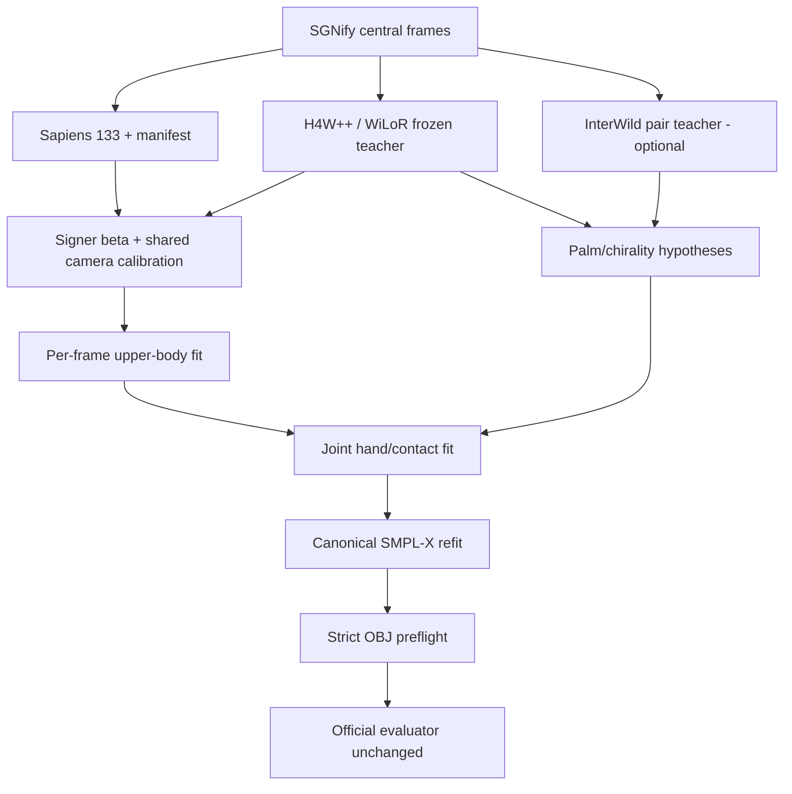

# SignPCC-X: Blueprint triển khai end-to-end cho 3D Sign Language Reconstruction trên SGNify/TR-V2V

> Phiên bản: 1.0 — 2026-08-30  
> Mục tiêu: một đặc tả kỹ thuật đủ chi tiết để triển khai, tái lập, kiểm thử, ablation và viết paper; không yêu cầu tải các tập huấn luyện lớn như InterHand2.6M.  
> Baseline tham chiếu: DexAvatar. Teacher/initializer chính: Hand4Whole++ + WiLoR. Pair-hand teacher tùy chọn: InterWild. Canonicalizer tùy chọn: SMPLFitter.  
> Tên phương pháp làm việc: **SignPCC-X — Signer-Personalized, Chirality- and Contact-aware SMPL-X fitting**.

---

## 1. Kết luận triển khai trước khi đi vào chi tiết

Phương án có xác suất cải thiện đồng thời `UBody`, `LHand` và `RHand` cao nhất, trong điều kiện không có dung lượng để huấn luyện trên dataset lớn, là:

1. Giữ DexAvatar như **baseline tái lập**, không sửa evaluator chính thức và không phụ thuộc SignBPoser/SignHPoser trong method mới.
2. Dùng **Hand4Whole++ ở chế độ frozen teacher/initializer** vì source của nó giải quyết đúng chỗ yếu shoulder–elbow–wrist: CHAM truyền hand feature vào body stream để dự đoán wrist orientation nhất quán với upper body; WiLoR cung cấp finger articulation chi tiết.
3. Không áp pose smoothing theo thời gian. Chỉ dùng các bất biến dùng chung qua frame: một `beta` cho cùng signer, một camera calibration cho cùng camera, và contact-state confidence nếu cần. Đây không phải temporal pose regularization.
4. Tối ưu SMPL-X theo frame bằng **best-of-K chirality/palm hypotheses**, thay vì tin một nghiệm wrist/palm duy nhất.
5. Với hand–hand hoặc hand–face interaction, thêm **intended-contact attraction** và **non-penetration**; collision-only như baseline có thể đẩy hai bề mặt vốn cần chạm ra xa nhau.
6. Mọi kết quả cuối phải được **canonical refit** về đúng một SMPL-X neutral topology 10,475 vertices và đúng face order evaluator. Không nộp trực tiếp hybrid mesh nếu chưa xác minh topology và parametric consistency.
7. Chạy teacher bằng environment/process riêng, trao đổi qua `NPZ + JSON`; không cố gộp DexAvatar, H4W++, WiLoR và legacy pair-hand code vào một Conda environment.

Mốc triển khai nên theo thứ tự:

- `M0`: tái lập DexAvatar + khóa evaluator.
- `M1`: H4W++ teacher export + canonical SMPL-X output.
- `M2`: shared signer shape/camera + upper-body staged fitting.
- `M3`: palm/chirality best-of-K.
- `M4`: contact-aware objective.
- `M5`: optional InterWild relative-hand translation; chỉ giữ nếu ablation có lợi.

Không nên bắt đầu bằng training. Với 57 sign rõ tay và ít blur/occlusion, cơ hội lớn nhất nằm ở **coordinate consistency, wrist/forearm kinematics, signer calibration, multimodal palm orientation và contact geometry**.

---

## 2. Bằng chứng từ output hiện có và hệ quả thiết kế

Archive baseline đã cung cấp chứa 12 sign, 596 PNG nhưng chỉ có 298 frame duy nhất vì mỗi frame xuất hiện hai lần ở thư mục sign và `smplifyx/images`. Không có OBJ, PKL hay optimization log nên không thể tính TR-V2V trực tiếp từ archive này.

| Sign | Số frame duy nhất |
|---|---:|
| Ablehnen | 14 |
| Akzeptieren | 31 |
| Arzt | 21 |
| AufgebenResignieren | 34 |
| AusgebenGeldVerschwenden | 19 |
| Auto | 35 |
| BesuchenEinmischen | 19 |
| Blitz | 24 |
| Blume | 21 |
| Boese | 19 |
| BroetchenAufschneiden | 48 |
| Dort | 13 |
| **Tổng** | **298** |

Quan sát định tính cho thấy input nhìn chung rõ, không có jitter/blur hệ thống. Sai số có tính cấu trúc:

- torso/shoulder width và upper-arm chain chưa khớp signer;
- shoulder–elbow–wrist không luôn nhất quán khi tay ở trước ngực/mặt;
- palm flip, pronation/supination và wrist twist là lỗi quan trọng hơn nhiễu thời gian;
- hand–hand depth/contact và hand–face contact chưa được mô hình hóa như ràng buộc tích cực;
- finger pose nhìn hợp lý ở 2D nhưng có thể sai local 3D vì monocular ambiguity.

Hệ quả: thêm một loss `||pose_t - pose_(t-1)||` có thể làm động tác mượt hơn nhưng không trực tiếp sửa những bias trên, thậm chí kéo một nghiệm palm sai sang các frame khác. Blueprint này vì vậy mặc định:

```yaml
temporal_pose_smoothing:
  enabled: false
shared_identity: true
shared_camera: true
contact_state_persistence:
  enabled: false  # bật như ablation, không làm trơn pose
```

---

## 3. Audit source: pin commit và quyết định tái sử dụng

### 3.1 Commit lock

Các kết luận bên dưới được audit tại những commit sau. Hãy pin đúng commit để line map và behavior không trôi.

| Repository | Commit audit | Vai trò |
|---|---|---|
| [DexAvatar](https://github.com/kaustesseract/DexAvatar) | `a0dfd427f60f5811aadb35c8657b3856d47f56b5` | baseline, preprocessing reference, export convention |
| [Hand4Whole++](https://github.com/mks0601/Hand4Whole-plus-plus_RELEASE) | `f81d35ddd2b74206c40142243eb62b6d64ce0d65` | frozen whole-body/hand-context teacher |
| [WiLoR](https://github.com/rolpotamias/WiLoR) | `fcb911312a38fa8badd30d9656a167485d61b8f9` | frozen MANO hand teacher |
| [SMPLFitter](https://github.com/isarandi/smplfitter) | `69ce219774a54cb1026604d3e4dd44e53b8f5874` | fast correspondence-based canonical refit, optional |
| [InterWild](https://github.com/facebookresearch/interwild) | `7c01e4ad4909652056a68af93b4c16ceabbce8fe` | optional bimanual relative-translation teacher |
| [DIR](https://github.com/PengfeiRen96/DIR) | `e309457d5360e1f50e053d9d5b4fcbe42888ba95` | idea/ablation source, không phải dependency V1 |

### 3.2 DexAvatar: phần dùng làm baseline, phần không tái sử dụng trong method mới

Source flow chính:

```text
Sapiens 133 keypoints
  -> SMPLer-X initialization
  -> mean_shape_smplx.npy
  -> HaMeR hand estimates
  -> SMPLify-X + SignBPoser/SignHPoser
  -> OBJ
```

Các điểm source-level quan trọng:

- [`M3_mean_shape_smplerx.py`](https://github.com/kaustesseract/DexAvatar/blob/a0dfd427f60f5811aadb35c8657b3856d47f56b5/M3_mean_shape_smplerx.py) lấy mean trực tiếp của toàn bộ `betas` SMPLer-X và có path replacement cứng. SignPCC-X thay bằng subject-aware robust calibration.
- [`data_parser.py`](https://github.com/kaustesseract/DexAvatar/blob/a0dfd427f60f5811aadb35c8657b3856d47f56b5/dexavatar_fitting/smplifyx/data_parser.py) tính `selected` nhưng sau đó dùng exact `start_idx/end_idx`; frame thiếu HaMeR/SMPLer-X bị loại; nhánh hai tay giả định có hai detection; nhánh một tay có thể dùng state frame trước. Method mới không được silently drop/copy frame.
- Cũng trong `data_parser.py`, `smplx_param['betas']` bị ghi đè bởi average shape và camera lấy từ initializer. Đây là một nguồn bias UBody có thể sửa bằng shared shape/camera calibration.
- [`fit_single_frame.py`](https://github.com/kaustesseract/DexAvatar/blob/a0dfd427f60f5811aadb35c8657b3856d47f56b5/dexavatar_fitting/smplifyx/fit_single_frame.py) chỉ đưa latent SignB/SignH vào `final_params`; `body_model` parameters, `betas`, camera, global orientation và translation không nằm trong optimizer chính.
- [`fit_smplx_vposer_x.yaml`](https://github.com/kaustesseract/DexAvatar/blob/a0dfd427f60f5811aadb35c8657b3856d47f56b5/dexavatar_fitting/cfg_files/fit_smplx_vposer_x.yaml) đặt `data_3d_weights = [0,0,0]`, các anchor initialization lên tới `1200`, collision tăng `0.5 -> 1.5` và dùng SignB/SignH priors.
- [`fitting.py`](https://github.com/kaustesseract/DexAvatar/blob/a0dfd427f60f5811aadb35c8657b3856d47f56b5/dexavatar_fitting/smplifyx/fitting.py) có pose difference với frame trước nhân `2000`, còn HaMeR 3D term bị vô hiệu bởi weight 0. SignPCC-X không mang temporal term này sang.
- Export cuối dùng faces từ `assets/smplx_uv_new.obj`, sau đó xoay mesh 180° quanh trục X. Convention tương đương `diag(1,-1,-1)` phải được tái lập và unit-test.

Kết luận: giữ pipeline này để báo baseline chính thức, nhưng optimizer mới nên là package độc lập; chỉ tái sử dụng asset/topology/convention sau khi kiểm định.

### 3.3 Hand4Whole++: phần tạo giá trị trực tiếp

Các phần cần tái sử dụng:

- [`HandControlNet`](https://github.com/mks0601/Hand4Whole-plus-plus_RELEASE/blob/f81d35ddd2b74206c40142243eb62b6d64ce0d65/common/nets/module.py) nhận WiLoR feature 1,280 chiều, dùng ba cross-attention block cho hai tay, 24 zero-initialized `1x1` convolution, undo crop rồi max-merge hand features vào body ViT. Đây là lý do H4W++ có thể cải thiện wrist/upper body chứ không chỉ ngón tay.
- [`combine_smplx_mano`](https://github.com/mks0601/Hand4Whole-plus-plus_RELEASE/blob/f81d35ddd2b74206c40142243eb62b6d64ce0d65/main/model.py) bỏ MANO root rotation, rigid-align bằng wrist + bốn MCP, rồi scatter MANO vertices vào SMPL-X hand vertex IDs.
- `smooth_hand_boundary` làm mượt vùng seam sau scatter. Dùng output này làm dense teacher target, không xem nó mặc nhiên là một SMPL-X parametric state hoàn chỉnh.
- Test output đã có `smplx_vert_cam`, `smplx_body_pose`, `smplx_lhand_pose`, `smplx_rhand_pose`, `smplx_shape`, `smplx_trans`, MANO vertices, bboxes và projected keypoints. Cần bổ sung aligned MANO root poses và crop transform vào exporter.

Điểm không được làm: copy thẳng WiLoR wrist orientation vào body. Chính H4W++ cho thấy wrist cần được điều hòa trong body context; finger pose/shape có thể lấy từ WiLoR nhưng wrist/forearm phải qua CHAM hoặc joint optimization.

### 3.4 WiLoR: coordinate và left-hand handling

Ở commit pin, WiLoR:

- crop mọi hand về canonical right-hand view;
- với left hand, lật trục X của vertices/joints sau inference;
- axis-angle left-hand cần đổi dấu thành phần Y/Z;
- `cam_crop_to_full` đổi weak-perspective crop camera sang full-image translation;
- `pred_vertices` là root-relative MANO trước khi cộng `cam_t` trong demo.

Không được trộn `pred_vertices`, `pred_cam_t_full` và H4W camera mà bỏ qua handedness/crop transform. Mọi record phải có `coord_frame`, `unit`, `is_right`, `crop_to_full` rõ ràng.

### 3.5 InterWild và DIR

InterWild có một `TransNet` riêng dự đoán `rel_trans` giữa hai wrist từ heatmap hai bàn tay. Trong demo chính thức, khi hai bbox overlap:

```text
right mesh absolute = right root-relative mesh + right_root_cam
left mesh absolute  = left root-relative mesh  + right_root_cam + rel_trans
```

Vì evaluator center LHand/RHand riêng, `rel_trans` không trực tiếp cải thiện hand-only TR-V2V; nó có thể cải thiện UBody, hand–hand contact và depth consistency. Do đó InterWild chỉ là optional teacher với uncertainty gate, không phải dependency bắt buộc.

DIR có iterative joint/bone interaction và predicted inter-hand offset, nhưng environment cũ, inference path thiên về InterHand2.6M và không có single-image demo sạch như InterWild. V1 chỉ mượn ý tưởng coarse-to-fine/cross-hand refinement; không clone/download checkpoint DIR trên máy dung lượng thấp.

### 3.6 SMPLFitter

SMPLFitter hỗ trợ SMPL-X, weighted vertices/joints, `share_beta=True`, 1–4 vòng alternating orientation/shape và không cần learnable weights. Đây là lựa chọn tốt để:

- refit hybrid H4W++ mesh về canonical SMPL-X;
- ước lượng shared beta nhanh trên nhiều frame;
- cung cấp initialization cho optimizer gradient-based.

Điều kiện bắt buộc: target vertices phải có correspondence với model template. H4W++ hybrid có 10,475 indices nên phù hợp về correspondence, nhưng faces/model version vẫn phải kiểm tra.

### 3.7 Literature/code decision matrix dưới ràng buộc dung lượng

Không nên clone mọi repo có leaderboard tốt. Benchmark của từng paper khác SGNify/TR-V2V và một model mạnh trên body MPJPE chưa chắc sửa palm orientation hoặc canonical topology. Ma trận dưới đây chuyển literature review thành quyết định triển khai cụ thể.

| Method/source public | Tín hiệu có thể dùng | Khả năng áp vào SignPCC-X | Chi phí/rủi ro | Quyết định |
|---|---|---|---|---|
| [Hand4Whole++](https://github.com/mks0601/Hand4Whole-plus-plus_RELEASE) | hand-conditioned body feature, WiLoR fingers, whole-body SMPL-X | Rất cao cho wrist–forearm–upper body; đúng failure mode quan sát được | Cần environment teacher riêng; hybrid mesh cần canonical refit | **Clone mặc định, frozen teacher chính** |
| [WiLoR](https://github.com/rolpotamias/WiLoR) | MANO pose/shape, full-image hand translation | Cao cho articulation và candidate generation | Left/right flip và crop camera dễ sai | **Clone mặc định qua H4W++** |
| [SMPLest-X](https://github.com/MotrixLab/SMPLest-X) | whole-body SMPL-X initializer mạnh hơn thế hệ SMPLer-X | Có thể làm secondary body teacher/consensus | Checkpoint Huge được upstream công bố là khoảng 8.2 GB; không giải quyết contact trực tiếp | **Không tải ở V1; chỉ ablate nếu còn disk** |
| [SMPLer-X](https://github.com/MotrixLab/SMPLer-X) | full SMPL-X pose/shape/camera | Hữu ích để tái lập initializer của DexAvatar | Baseline đã chứa/cần nó; thêm bản khác chỉ tăng disk và confound | **Chỉ dùng trong baseline** |
| [OSX](https://github.com/IDEA-Research/OSX) | component-aware whole-body regression; liên quan trực tiếp UBody | Có giá trị như body-teacher fallback và nguồn ý tưởng cross-part | Stack cũ, checkpoint/assets riêng, trùng vai trò H4W++ | **Đọc/so sánh; không clone mặc định** |
| [PyMAF-X](https://github.com/HongwenZhang/PyMAF-X) | mesh-aligned feedback và part refinement | Ý tưởng iterative feedback phù hợp coarse-to-fine fitting | Cần partial-mesh assets, pretrained model và legacy environment | **Mượn ý tưởng; không thêm dependency V1** |
| [AiOS](https://github.com/MotrixLab/AiOS) | all-in-one multi-person expressive recovery | Ít lợi thế khi mỗi ảnh đã có một signer trung tâm và bbox rõ | Detector/query stack lớn; không nhắm bimanual contact | **Không ưu tiên** |
| [NLF](https://github.com/isarandi/nlf) + [SMPLFitter](https://github.com/isarandi/smplfitter) | dense/localizer observations; fast parametric fitting | SMPLFitter rất hợp canonicalization/shared beta; NLF có thể làm teacher độc lập | NLF weights có điều khoản research và thêm checkpoint; model teacher disagreement cần calibration | **Clone SMPLFitter; NLF chỉ optional** |
| [InterWild](https://github.com/facebookresearch/interwild) | relative translation giữa hai wrist | Hữu ích cho hand–hand depth/contact và UBody | Environment cũ; repo đã archived/read-only từ 2025; hand-only TR-V2V center từng tay nên gain trực tiếp hạn chế | **Optional M5, pin tuyệt đối** |
| [DIR](https://github.com/PengfeiRen96/DIR) | iterative bimanual refinement/bone interaction | Ý tưởng tốt cho candidate reranking | Phụ thuộc InterHand-style pipeline và không có đường single-image nhẹ | **Không clone/checkpoint ở V1** |
| [SAM 3D Body](https://github.com/facebookresearch/sam-3d-body) | promptable modern whole-body/hand recovery | Có thể là external teacher trong nghiên cứu kế tiếp | Output là MHR, không phải canonical SMPL-X; checkpoint lớn và cần mapping/refit chưa được chứng minh | **Không đưa vào claim V1** |

Quy tắc chọn teacher mới: chỉ thêm khi nó cung cấp một observation độc lập mà H4W++ không có, export được về contract ở Chương 11, và vượt `A1` trên fixed dev panel. Không dùng metric trên AGORA/3DPW/FreiHAND để thay cho ablation SGNify.

---

## 4. Protocol evaluator chính thức: những điều không được hiểu sai

File evaluator được cung cấp có SHA-256:

```text
2722b5cd30d4baba23599a455cab483b143e6595d292f02de9643af4eebd5300
```

Không sửa file này. Wrapper chỉ được gọi subprocess và kiểm tra input/output.

Behavior cần khóa:

1. Với mỗi sign, GT lấy `start = segment[0] * 2`, `end = segment[1] * 2`, inclusive, rồi chỉ giữ OBJ thực sự tồn tại.
2. Prediction lấy từ `<evaluate_folder>/<sign>/smplifyx/meshes/*.obj`.
3. Prediction sort theo **run chữ số đầu tiên trong stem**, rồi ghép với GT **bằng vị trí list**, không ghép theo frame ID.
4. Faces prediction phải bằng GT tuyệt đối (`assert_array_equal`).
5. Mỗi region được translation-center độc lập; không Procrustes rotation và không scale alignment.
6. LHand và RHand được center riêng: global wrist location không hiện trong hand TR-V2V, nhưng local orientation/articulation/shape vẫn tính.
7. UBody center một lần cho cả subset: shoulder proportions, relative hand–body placement, contact geometry và shape đều ảnh hưởng.
8. Class `0`: left-hand metric bị bỏ; left-hand vertices cũng bị loại khỏi các region khác. Vẫn phải xuất full valid SMPL-X mesh, không được tạo NaN hay topology thiếu.
9. Frame có NaN prediction bị `continue`, có thể tạo điểm giả tốt hơn do thiếu frame. Preflight phải coi bất kỳ NaN/Inf nào là hard failure.
10. `--central` được parse nhưng không điều khiển branch; central selection luôn đến từ `sign_seg`.
11. Evaluator hard-code asset root `/home/haipd/DexAvatar/data/evaluation_from_author/data/data`. Không sửa code; bind-mount hoặc đặt asset đúng path đó.

Hệ quả xuất file: luôn tạo `000.obj ... (N-1).obj` liên tục theo đúng manifest order, không để file OBJ thừa trong folder. Lưu original frame ID trong sidecar manifest, không dùng filename prediction để hy vọng evaluator tự match.

---

## 5. Kiến trúc hệ thống



Method không phải một ensemble ở output: teacher chỉ tạo observations/hypotheses; output cuối luôn là một canonical SMPL-X mesh.

---

## 6. Cấu trúc repository production

```text
SignPCC-X/
├── README.md
├── pyproject.toml
├── third_party.lock.yaml
├── configs/
│   ├── signpccx_v1.yaml
│   ├── data_sgnify.yaml
│   ├── ablations/
│   └── env/
│       ├── optimizer.yml
│       ├── h4wpp.yml
│       ├── interwild.yml
│       └── evaluator.yml
├── assets/
│   ├── body_models/              # symlink; không commit
│   ├── eval/                     # symlink; không commit
│   ├── indices/
│   └── checksums.sha256
├── patches/
│   └── h4wpp/
│       ├── 0001-teacher-export.patch
│       └── 0002-external-keypoints.patch
├── src/signpccx/
│   ├── cli.py
│   ├── schema.py
│   ├── data/
│   │   ├── manifest.py
│   │   ├── sapiens.py
│   │   └── crops.py
│   ├── teachers/
│   │   ├── h4wpp_bridge.py
│   │   ├── wilor_bridge.py
│   │   ├── interwild_bridge.py
│   │   └── consensus.py
│   ├── geometry/
│   │   ├── camera.py
│   │   ├── rotations.py
│   │   ├── handedness.py
│   │   ├── contact_regions.py
│   │   └── topology.py
│   ├── model/
│   │   ├── smplx_state.py
│   │   └── canonicalizer.py
│   ├── losses/
│   │   ├── robust.py
│   │   ├── keypoints.py
│   │   ├── teacher.py
│   │   ├── palm.py
│   │   ├── contact.py
│   │   └── anatomy.py
│   ├── optimization/
│   │   ├── identity.py
│   │   ├── hypotheses.py
│   │   ├── stages.py
│   │   └── runner.py
│   ├── export/
│   │   ├── obj.py
│   │   └── preflight.py
│   └── evaluation/
│       ├── official.py
│       └── parse_metrics.py
├── scripts/
│   ├── bootstrap_code.sh
│   ├── export_h4wpp.py
│   ├── export_interwild.py
│   ├── run_sign.py
│   ├── run_all.py
│   └── evaluate_official.sh
├── tests/
│   ├── unit/
│   ├── integration/
│   ├── protocol/
│   └── fixtures/                 # synthetic/tiny, không chứa licensed assets
└── runs/
    └── <run_id>/
        ├── config.resolved.yaml
        ├── provenance.json
        ├── manifests/
        ├── teachers/
        ├── fits/
        ├── eval_layout/
        ├── logs/
        └── metrics/
```

`third_party/`, model files, GT và images phải nằm ngoài Git hoặc là symlink. Chỉ commit patch, checksum, config và source của method mới.

---

## 7. Clone source theo kiểu code-only và pin commit

Script clone tái lập, không tải weights/datasets:

```bash
export SIGNPCCX_ROOT="$PWD/SignPCC-X"
mkdir -p "$SIGNPCCX_ROOT/third_party"

fetch_pinned_repo() {
  repo_url="$1"
  commit="$2"
  dst="$3"
  mkdir -p "$dst"
  git -C "$dst" init
  git -C "$dst" remote add origin "$repo_url"
  git -C "$dst" fetch --depth 1 origin "$commit"
  git -C "$dst" checkout --detach FETCH_HEAD
}

fetch_pinned_repo \
  https://github.com/kaustesseract/DexAvatar.git \
  a0dfd427f60f5811aadb35c8657b3856d47f56b5 \
  "$SIGNPCCX_ROOT/third_party/DexAvatar"

fetch_pinned_repo \
  https://github.com/mks0601/Hand4Whole-plus-plus_RELEASE.git \
  f81d35ddd2b74206c40142243eb62b6d64ce0d65 \
  "$SIGNPCCX_ROOT/third_party/Hand4Whole-plus-plus_RELEASE"

fetch_pinned_repo \
  https://github.com/rolpotamias/WiLoR.git \
  fcb911312a38fa8badd30d9656a167485d61b8f9 \
  "$SIGNPCCX_ROOT/third_party/WiLoR"

fetch_pinned_repo \
  https://github.com/isarandi/smplfitter.git \
  69ce219774a54cb1026604d3e4dd44e53b8f5874 \
  "$SIGNPCCX_ROOT/third_party/smplfitter"

# Chỉ clone khi bật pair teacher.
fetch_pinned_repo \
  https://github.com/facebookresearch/interwild.git \
  7c01e4ad4909652056a68af93b4c16ceabbce8fe \
  "$SIGNPCCX_ROOT/third_party/interwild"
```

Cho H4W++ nhìn thấy một bản WiLoR duy nhất:

```bash
test ! -e "$SIGNPCCX_ROOT/third_party/Hand4Whole-plus-plus_RELEASE/common/nets/WiLoR"
ln -s "$SIGNPCCX_ROOT/third_party/WiLoR" \
  "$SIGNPCCX_ROOT/third_party/Hand4Whole-plus-plus_RELEASE/common/nets/WiLoR"
```

Sau clone, tạo lock tự động:

```bash
for repo in \
  DexAvatar Hand4Whole-plus-plus_RELEASE WiLoR smplfitter interwild
do
  git -C "$SIGNPCCX_ROOT/third_party/$repo" rev-parse HEAD
done
```

Không chạy `git pull` trên một experiment đã report. Muốn cập nhật source thì tạo experiment mới và lock mới.

---

## 8. Environment isolation và chiến lược dung lượng thấp

### 8.1 Không dùng một environment duy nhất

| Environment | Nội dung | Giao tiếp ra ngoài |
|---|---|---|
| `dexavatar_ref` | cài theo README DexAvatar, giữ để tái lập baseline | PKL/OBJ/log |
| `h4wpp_teacher` | H4W++ + WiLoR + DWPose hoặc adapter Sapiens | NPZ/JSON float32 CPU |
| `signpccx` | SMPL-X differentiable optimizer, loss, canonicalizer | OBJ/NPZ/log |
| `interwild_teacher` | chỉ tạo khi ablation pair teacher | NPZ/JSON |
| `sgnify_eval` | evaluator official và dependencies tối thiểu | stdout metrics |

Không truyền pickle chứa CUDA tensors giữa environments. Mọi tensor teacher phải `detach().float().cpu().numpy()` trước khi lưu.

### 8.2 Optimizer environment tối thiểu

`configs/env/optimizer.yml`:

```yaml
name: signpccx
channels:
  - pytorch
  - nvidia
  - conda-forge
dependencies:
  - python=3.10
  - pytorch=2.1.1
  - torchvision=0.16.1
  - pytorch-cuda=12.1
  - numpy=1.26.3
  - scipy
  - pyyaml
  - opencv
  - trimesh
  - rich
  - tqdm
  - pip
  - pip:
      - smplx==0.1.28
      - loguru
      - safetensors
      - "smplfitter[pytorch]"
```

PyTorch3D chỉ cần nếu dùng `corresponding_points_alignment`/renderer của H4W++ trong optimizer. Nếu canonicalizer tự viết bằng SMPL-X + losses thì bỏ PyTorch3D khỏi `signpccx` để nhẹ hơn.

### 8.3 H4W++ environment

Không nên tái tạo nguyên `environment.yml` của repo một cách mù quáng: file pin nhiều CUDA 11.6/12.1/12.4 và package không cần cho inference. Quy trình an toàn:

1. Trên máy thử nghiệm, tạo `h4wpp_teacher` Python 3.10.
2. Cài đúng PyTorch/CUDA phù hợp driver hiện có.
3. Cài inference-only packages từ import graph của `demo`, WiLoR và DWPose.
4. Chạy one-frame smoke test.
5. `conda env export --from-history` và `pip freeze` vào provenance.

Nếu cần tái lập chính thức tuyệt đối, dùng environment.yml upstream trong container riêng; không ép nó cùng môi trường optimizer.

### 8.4 Quy tắc tiết kiệm disk

- Dùng `pip --no-cache-dir`.
- Chỉ giữ một bản SMPL-X/MANO assets và tạo symlink vào từng repo.
- Chỉ clone code bằng `fetch --depth 1`; không clone dataset submodule.
- Teacher cache dùng compressed NPZ, một file/frame hoặc shard tối đa 64 frame; xóa render debug sau khi nghiệm thu sign.
- Không lưu đồng thời mesh OBJ ở mọi stage. Chỉ giữ `best.npz`, final OBJ và ảnh overlay chọn lọc.
- InterWild/DIR/NLF không cài cùng lúc. Chạy ablation tuần tự và giữ checkpoint nào thực sự cải thiện metric.
- Trước mỗi download, ghi kích thước/checksum vào `assets/checksums.sha256`; sau download chạy `du -sh assets runs`.

---

## 9. Assets và license

```text
assets/body_models/
├── smplx/
│   ├── SMPLX_NEUTRAL.npz hoặc .pkl
│   ├── MANO_SMPLX_vertex_ids.pkl
│   ├── SMPL-X__FLAME_vertex_ids.npy
│   └── SMPLX_to_J14.pkl
├── mano/
│   ├── MANO_LEFT.pkl
│   └── MANO_RIGHT.pkl
└── flame/
```

Model files SMPL-X/MANO/FLAME không được commit hoặc phân phối lại. DexAvatar top-level và H4W++ code là MIT tại commit audit, nhưng SMPLify-X/SMPL-X assets có research/non-commercial license; WiLoR weights có license riêng; InterWild là CC-BY-NC 4.0. Paper/release phải liệt kê từng dependency và không đóng gói licensed model files.

Nguồn paper/code chính:

- [DexAvatar paper](https://arxiv.org/abs/2512.21054) và [official code](https://github.com/kaustesseract/DexAvatar)
- [Hand4Whole++ paper](https://arxiv.org/abs/2603.14726) và [official code](https://github.com/mks0601/Hand4Whole-plus-plus_RELEASE)
- [WiLoR paper/code](https://github.com/rolpotamias/WiLoR)
- [InterWild paper/code](https://github.com/facebookresearch/interwild)
- [DIR paper/code](https://github.com/PengfeiRen96/DIR)
- [SMPLFitter](https://github.com/isarandi/smplfitter) và [NLF paper](https://arxiv.org/abs/2407.07532)

---


## 10. Data contract: manifest là nguồn sự thật duy nhất

### 10.1 Layout input đề xuất

```text
data/sgnify/
├── images_sgnify/
│   └── <sign>/
│       └── images/
│           └── <frame>.png
├── smplxgt/
│   └── <sign>/
│       └── <frame_id>.obj
├── signs.txt
├── segment.json
└── precomputed/
    ├── sapiens.pkl
    └── smplerx/                  # chỉ cần cho baseline/ablation
```

Không để mỗi teacher tự glob/sort ảnh. Tạo một manifest, sau đó tất cả pipeline đọc cùng manifest.

### 10.2 `src/signpccx/data/manifest.py`

```python
from __future__ import annotations

from dataclasses import asdict, dataclass
from pathlib import Path
import json
import re
from typing import Iterable


_DIGITS = re.compile(r"\d+")


def first_int(path: Path) -> int:
    match = _DIGITS.search(path.stem)
    if match is None:
        raise ValueError(f"Filename has no integer: {path}")
    return int(match.group())


@dataclass(frozen=True)
class FrameRecord:
    sign: str
    sign_class: str
    source_path: str
    source_frame_id: int
    sequence_index: int
    evaluator_index: int
    gt_frame_id: int | None


def read_sign_file(path: Path) -> dict[str, str]:
    result: dict[str, str] = {}
    for raw in path.read_text(encoding="utf-8").splitlines():
        tokens = raw.split()
        if tokens:
            if len(tokens) < 2:
                raise ValueError(f"Expected '<sign> <class>': {raw!r}")
            result[tokens[0]] = tokens[1]
    return dict(sorted(result.items()))


def image_paths(folder: Path) -> list[Path]:
    paths = [p for p in folder.iterdir()
             if p.suffix.lower() in {".png", ".jpg", ".jpeg"}]
    return sorted(paths, key=first_int)


def evaluator_gt_ids(gt_sign_dir: Path, segment: tuple[int, int]) -> list[int]:
    # Sao chép behavior selection, không sửa evaluator.
    available = {int(p.stem) for p in gt_sign_dir.glob("*.obj")}
    start, end = segment[0] * 2, segment[1] * 2
    return [frame for frame in range(start, end + 1) if frame in available]


def build_sign_manifest(
    sign: str,
    sign_class: str,
    image_dir: Path,
    gt_sign_dir: Path | None,
    segment: tuple[int, int],
) -> list[FrameRecord]:
    images = image_paths(image_dir)
    start, end = segment
    selected = [p for p in images if start <= first_int(p) <= end]
    if not selected:
        raise RuntimeError(f"No central images for {sign}: {segment}")

    gt_ids = None
    if gt_sign_dir is not None:
        gt_ids = evaluator_gt_ids(gt_sign_dir, segment)
        if len(gt_ids) != len(selected):
            raise RuntimeError(
                f"{sign}: input central frames={len(selected)}, "
                f"evaluator GT frames={len(gt_ids)}. "
                "Resolve sampling/rate before fitting; never truncate silently."
            )

    records: list[FrameRecord] = []
    for index, path in enumerate(selected):
        records.append(FrameRecord(
            sign=sign,
            sign_class=sign_class,
            source_path=str(path.resolve()),
            source_frame_id=first_int(path),
            sequence_index=index,
            evaluator_index=index,
            gt_frame_id=None if gt_ids is None else gt_ids[index],
        ))
    return records


def write_jsonl(records: Iterable[FrameRecord], path: Path) -> None:
    path.parent.mkdir(parents=True, exist_ok=True)
    text = "\n".join(json.dumps(asdict(x), sort_keys=True) for x in records)
    path.write_text(text + "\n", encoding="utf-8")
```

Nếu không có GT trên development machine, manifest vẫn tạo được nhưng `gt_frame_id=None`. Trên evaluation machine, chạy lại preflight với GT và yêu cầu count bằng tuyệt đối.

### 10.3 Không drop frame

Mỗi frame trong manifest phải kết thúc ở đúng một trong các trạng thái:

```text
OK_H4WPP
OK_H4WPP_SAPIENS_BBOX
OK_WILOR_RETRY
OK_BASELINE_FALLBACK
FAILED_HARD
```

`FAILED_HARD` dừng sign và không cho evaluate. Không có trạng thái “skip”. Retry order:

1. H4W++ official DWPose bbox.
2. Sapiens hand bbox với padding lớn hơn.
3. WiLoR detector bbox.
4. Baseline SMPLer-X/HaMeR initializer, rồi canonical fitting với confidence thấp.

Không copy pose frame trước. Với dữ liệu rõ như SGNify, detection miss thường là lỗi crop/handedness chứ không cần temporal hallucination.

---

## 11. Schema trao đổi giữa environments

### 11.1 Nguyên tắc

- Mọi 3D quantity dùng **meter**.
- Mọi image coordinate dùng **pixel trong ảnh gốc** trừ khi field name có `_crop`.
- Rotation lưu cả axis-angle và/hoặc matrix nhưng field name phải nói rõ.
- Mọi array là C-contiguous `float32`; indices/faces là `int64`.
- JSON sidecar chứa schema version, commit, checkpoint SHA-256, image SHA-256, coordinate convention.
- Không lưu object array trong NPZ; loader dùng `allow_pickle=False`.

### 11.2 Schema tối thiểu

`src/signpccx/schema.py`:

```python
from __future__ import annotations

from dataclasses import dataclass
from pathlib import Path
import json
import numpy as np


SCHEMA_VERSION = "signpccx.teacher.v1"


REQUIRED = {
    "K_full": (3, 3),
    "crop_to_full": (3, 3),
    "smplx_vertices_cam": (10475, 3),
    "smplx_body_pose_aa": (21, 3),
    "smplx_left_hand_pose_aa": (15, 3),
    "smplx_right_hand_pose_aa": (15, 3),
    "smplx_global_orient_aa": (1, 3),
    "smplx_betas": (10,),
    "smplx_transl": (3,),
    "left_mano_vertices_cam": (778, 3),
    "right_mano_vertices_cam": (778, 3),
    "left_mano_joints_cam": (21, 3),
    "right_mano_joints_cam": (21, 3),
    "keypoints_2d_full": (133, 3),
    "left_bbox_full_xyxy": (4,),
    "right_bbox_full_xyxy": (4,),
}


@dataclass(frozen=True)
class TeacherMeta:
    schema_version: str
    sign: str
    frame_id: int
    image_sha256: str
    repo_commit: str
    checkpoint_sha256: str
    coord_frame: str
    unit_3d: str
    image_width: int
    image_height: int


def validate_npz(path: Path) -> None:
    with np.load(path, allow_pickle=False) as data:
        missing = set(REQUIRED).difference(data.files)
        if missing:
            raise ValueError(f"{path}: missing {sorted(missing)}")
        for key, shape in REQUIRED.items():
            arr = data[key]
            if arr.shape != shape:
                raise ValueError(f"{path}:{key} {arr.shape} != {shape}")
            if arr.dtype.kind == "f" and not np.isfinite(arr).all():
                raise ValueError(f"{path}:{key} contains NaN/Inf")


def validate_sidecar(path: Path) -> TeacherMeta:
    obj = json.loads(path.read_text(encoding="utf-8"))
    meta = TeacherMeta(**obj)
    if meta.schema_version != SCHEMA_VERSION:
        raise ValueError(meta.schema_version)
    if meta.coord_frame != "opencv_camera_xright_ydown_zforward":
        raise ValueError(meta.coord_frame)
    if meta.unit_3d != "meter":
        raise ValueError(meta.unit_3d)
    return meta
```

### 11.3 Vì sao cần cả hybrid vertices và SMPL-X parameters

H4W++ test output `smplx_vert_cam` đã scatter aligned MANO vertices và smooth seam; trong khi `smplx_lhand_pose/rhand_pose` là pose dùng trong SMPL-X forward trước/đồng thời với hybrid operation. Hai representation không bảo đảm khớp hoàn toàn. Vì vậy:

- hybrid vertices: dense teacher target tốt cho bàn tay;
- SMPL-X params: initializer tốt cho canonical model;
- canonicalizer: giải quyết khoảng cách giữa hai representation.

---

## 12. Coordinate-system contract

### 12.1 Convention nội bộ

Chọn OpenCV camera frame:

```text
+X: sang phải ảnh
+Y: xuống dưới ảnh
+Z: hướng từ camera vào scene
unit: meter
projection: u = fx * X/Z + cx; v = fy * Y/Z + cy
```

Projection:

```python
import torch


def project_opencv(points_cam: torch.Tensor, K: torch.Tensor) -> torch.Tensor:
    if points_cam.shape[-1] != 3 or K.shape[-2:] != (3, 3):
        raise ValueError((points_cam.shape, K.shape))
    z = points_cam[..., 2].clamp_min(1e-4)
    u = K[..., 0, 0, None] * points_cam[..., 0] / z + K[..., 0, 2, None]
    v = K[..., 1, 1, None] * points_cam[..., 1] / z + K[..., 1, 2, None]
    return torch.stack((u, v), dim=-1)
```

### 12.2 Crop transforms

Mọi crop transform dùng homogeneous `3x3`:

```python
def affine_2x3_to_homogeneous(a):
    import numpy as np
    out = np.eye(3, dtype=np.float32)
    out[:2] = a
    return out


def transform_xy(xy, H):
    import numpy as np
    xy1 = np.concatenate([xy, np.ones((len(xy), 1), np.float32)], axis=1)
    dst = xy1 @ H.T
    return dst[:, :2] / dst[:, 2:3]
```

Store cả `full_to_crop` và `crop_to_full`; test `crop_to_full @ full_to_crop ~= I` với tolerance `1e-5`.

### 12.3 Handedness

Với left hand canonicalized như WiLoR:

```python
LEFT_AA_MIRROR = [1.0, -1.0, -1.0]


def unmirror_left_axis_angle(aa):
    return aa.reshape(-1, 3) * aa.new_tensor(LEFT_AA_MIRROR)
```

Không áp dụng mirror hai lần. Sidecar phải có:

```json
{
  "input_was_flipped": true,
  "vertices_unflipped": true,
  "axis_angles_unflipped": true
}
```

### 12.4 Export convention

DexAvatar export xoay 180° quanh X. Dùng đúng một boundary transform:

```python
T_EXPORT = [[1, 0, 0], [0, -1, 0], [0, 0, -1]]
vertices_obj = vertices_internal @ transpose(T_EXPORT)
```

Không áp transform này trước loss/project; chỉ áp khi xuất OBJ. Unit test phải lấy một baseline frame, forward từ baseline params, thử cả identity và `T_EXPORT`, rồi chọn convention tái tạo đúng baseline OBJ. Sau khi khóa, không có flag tự động đoán convention trong benchmark run.

---

## 13. Export H4W++ teacher

### 13.1 Patch tối thiểu cần duy trì

Upstream demo chỉ xuất OBJ, render và JSON params. Tạo patch riêng, không sửa ngẫu hứng trong vendor tree.

Patch `0001-teacher-export.patch` phải làm ba việc:

1. Trong `main/model.py`, test output thêm:

```python
out['rmano_root_pose_aligned'] = rhand_root_pose
out['lmano_root_pose_aligned'] = lhand_root_pose
```

Ở vị trí này `rhand_root_pose/lhand_root_pose` đã là axis-angle của rigid alignment MANO→SMPL-X wrist space.

2. Export thêm `smplx_trans`, MANO joints/vertices, bboxes, projections và crop transforms.
3. Không thay forward math/checkpoint loading.

Áp patch có kiểm tra:

```bash
H4WPP="$SIGNPCCX_ROOT/third_party/Hand4Whole-plus-plus_RELEASE"
git -C "$H4WPP" status --short
git -C "$H4WPP" apply --check \
  "$SIGNPCCX_ROOT/patches/h4wpp/0001-teacher-export.patch"
git -C "$H4WPP" apply \
  "$SIGNPCCX_ROOT/patches/h4wpp/0001-teacher-export.patch"
```

Provenance phải ghi patch SHA-256 và `git diff --stat`.

### 13.2 Storage-light Sapiens bbox adapter

H4W++ `DWPose` dùng 133 keypoints chủ yếu để tạo hand bbox/existence. Khi đã có Sapiens 133, có thể tránh thêm mmpose/DWPose runtime bằng adapter; nhưng chỉ dùng sau parity test.

COCO WholeBody 133 layout phù hợp cho bbox:

```text
body+feet: 0:23
face:      23:91
left hand: 91:112
right hand:112:133
body L/R wrist: 9/10
```

Reference implementation:

```python
from __future__ import annotations

import numpy as np


def _box(points: np.ndarray, score: np.ndarray, threshold: float = 0.3):
    valid = score > threshold
    if int(valid.sum()) <= 3:
        return np.array([0.0, 0.0, 1.0, 1.0], np.float32), 0.0
    p = points[valid]
    lo, hi = p.min(axis=0), p.max(axis=0)
    center = (lo + hi) * 0.5
    size = np.maximum(hi - lo, 1e-4) * 1.2
    side = float(max(size)) * 2.0  # restore_bbox aspect=1, extension=2
    xyxy = np.array([
        center[0] - side / 2,
        center[1] - side / 2,
        center[0] + side / 2,
        center[1] + side / 2,
    ], np.float32)
    return xyxy, 1.0


def sapiens_hand_boxes_in_h4w_body_space(
    keypoints133_full: np.ndarray,
    full_to_h4w_crop: np.ndarray,
) -> dict[str, np.ndarray]:
    # full -> H4W input crop (384x512), sau đó -> body input (192x256)
    xy_crop = transform_xy(keypoints133_full[:, :2], full_to_h4w_crop)
    xy_body = xy_crop * np.array([192.0 / 384.0, 256.0 / 512.0], np.float32)
    conf = keypoints133_full[:, 2]

    left_idx = np.r_[91:112, 9]
    right_idx = np.r_[112:133, 10]
    lbox, lexist = _box(xy_body[left_idx], conf[left_idx])
    rbox, rexist = _box(xy_body[right_idx], conf[right_idx])
    return {
        "lhand_bbox": lbox,
        "rhand_bbox": rbox,
        "lhand_exist": np.float32(lexist),
        "rhand_exist": np.float32(rexist),
    }
```

Để không import `mmpose` khi adapter bật, patch đúng signature hiện tại của `Model.__init__` theo dependency injection và lazy import. Giữ nguyên các assignment/network wiring khác của upstream constructor; chỉ thêm đối số cuối và thay block khởi tạo pose provider:

```python
def __init__(
    self,
    encoder,
    body_position_net,
    body_rotation_net,
    face_roi_net,
    face_regressor,
    hand_control_net,
    keypoint_provider=None,
):
    super().__init__()
    self.encoder = encoder
    self.body_position_net = body_position_net
    self.body_rotation_net = body_rotation_net
    self.face_roi_net = face_roi_net
    self.face_regressor = face_regressor
    self.hand_control_net = hand_control_net

    if keypoint_provider is None:
        from nets.dwpose import DWPose
        self.dwpose = DWPose()
    else:
        self.dwpose = keypoint_provider
```

Adapter phải có interface `forward(body_img) -> kpt_smplx` và `get_hand_bbox(kpt)`. Một cách sạch hơn là refactor model để nhận bbox/existence trong `meta_info`; không đổi các tensor downstream.

Parity gate trên ít nhất 100 frame đại diện:

- median IoU bbox Sapiens vs DWPose `>= 0.80` mỗi tay;
- 95th percentile center distance `<= 0.08 * hand_box_diagonal`;
- existence mismatch `< 2%`;
- H4W++ output reprojection và candidate score không suy giảm có hệ thống.

Nếu không đạt, dùng DWPose official cho benchmark; adapter chỉ là engineering ablation.

### 13.3 `scripts/export_h4wpp.py`: logic cốt lõi

```python
from pathlib import Path
import hashlib
import json
import numpy as np
import torch


def sha256(path: Path) -> str:
    h = hashlib.sha256()
    with path.open("rb") as f:
        for block in iter(lambda: f.read(1024 * 1024), b""):
            h.update(block)
    return h.hexdigest()


def cpu32(x):
    if torch.is_tensor(x):
        x = x.detach().float().cpu().numpy()
    return np.ascontiguousarray(np.asarray(x, dtype=np.float32))


def export_one(out, frame, transforms, out_npz: Path, meta: dict):
    arrays = {
        "K_full": cpu32(transforms["K_full"]),
        "crop_to_full": cpu32(transforms["crop_to_full"]),
        "smplx_vertices_cam": cpu32(out["smplx_vert_cam"][0]),
        "smplx_body_pose_aa": cpu32(out["smplx_body_pose"][0]).reshape(21, 3),
        "smplx_left_hand_pose_aa": cpu32(out["smplx_lhand_pose"][0]).reshape(15, 3),
        "smplx_right_hand_pose_aa": cpu32(out["smplx_rhand_pose"][0]).reshape(15, 3),
        "smplx_global_orient_aa": cpu32(out["smplx_root_pose"][0]).reshape(1, 3),
        "smplx_betas": cpu32(out["smplx_shape"][0]).reshape(10),
        "smplx_transl": cpu32(out["smplx_trans"][0]).reshape(3),
        "left_mano_vertices_cam": cpu32(out["lmano_vert_cam"][0]),
        "right_mano_vertices_cam": cpu32(out["rmano_vert_cam"][0]),
        "left_mano_joints_cam": cpu32(out["lmano_kpt_cam"][0]),
        "right_mano_joints_cam": cpu32(out["rmano_kpt_cam"][0]),
        "left_mano_root_aligned_aa": cpu32(out["lmano_root_pose_aligned"][0]),
        "right_mano_root_aligned_aa": cpu32(out["rmano_root_pose_aligned"][0]),
        "keypoints_2d_full": cpu32(frame["keypoints133_full"]),
        "left_bbox_full_xyxy": cpu32(transforms["left_bbox_full"]),
        "right_bbox_full_xyxy": cpu32(transforms["right_bbox_full"]),
    }
    for name, value in arrays.items():
        if not np.isfinite(value).all():
            raise FloatingPointError(name)
    out_npz.parent.mkdir(parents=True, exist_ok=True)
    np.savez_compressed(out_npz, **arrays)
    out_npz.with_suffix(".json").write_text(
        json.dumps(meta, indent=2, sort_keys=True), encoding="utf-8")
```

H4W++ `smplx_kpt_cam` trong test output đã root-center theo pelvis, còn `smplx_vert_cam` vẫn ở camera frame. Field names không được làm người dùng tưởng chúng cùng origin; nếu export joints này, đặt tên `smplx_kpt_pelvis_relative`.

### 13.4 Smoke test H4W++

Trên một frame:

```bash
conda run -n h4wpp_teacher python scripts/export_h4wpp.py \
  --manifest runs/smoke/manifests/Akzeptieren.jsonl \
  --limit 1 \
  --checkpoint assets/checkpoints/h4wpp/snapshot_6.pth \
  --out runs/smoke/teachers/h4wpp

conda run -n signpccx python -m signpccx.cli validate-teacher \
  runs/smoke/teachers/h4wpp/Akzeptieren/000.npz
```

Render overlay phải dùng `K_full` và camera-frame vertices. Nếu overlay lệch nhưng crop render upstream đúng, lỗi nằm ở crop/full transform chứ không phải SMPL-X pose.

---

## 14. Optional InterWild pair teacher

Chỉ chạy cho frame có hai tay và interaction confidence cao. Export các field:

```text
rel_trans_right_to_left [3]
right_root_cam [3]
left_root_cam_independent [3]
right/left root-relative MANO vertices [778,3]
right/left root pose [3]
right/left hand pose [45]
right/left shape [10]
right/left bbox confidence [1]
```

Source semantics phải giữ nguyên:

```python
right_abs = right_root_relative + right_root_cam
left_abs_from_pair = left_root_relative + right_root_cam + rel_trans
```

Teacher confidence:

```python
def pair_teacher_weight(iou, bbox_conf_l, bbox_conf_r, reproj_px, image_diag):
    import numpy as np
    conf = min(float(bbox_conf_l), float(bbox_conf_r))
    reproj = np.exp(-4.0 * reproj_px / max(image_diag, 1.0))
    interaction = np.clip(iou / 0.25, 0.0, 1.0)
    return float(conf * reproj * interaction)
```

Không dùng `rel_trans` nếu weight `< 0.35`. Repo InterWild đã archived/read-only; vì vậy bắt buộc pin commit/checkpoint và không kỳ vọng upstream fix. Không cài InterWild nếu M1–M4 đã đạt mục tiêu; nó là ablation có chi phí môi trường/checkpoint riêng.

---

## 15. Biểu diễn SMPL-X tối ưu

### 15.1 Parameters

Một signer/camera group có:

```text
Shared theo signer: beta [10]
Shared theo camera: log_f [1], delta_c [2]
Mỗi frame:
  global_orient [3]
  body_pose [21,3]
  left_hand_pose [15,3]
  right_hand_pose [15,3]
  jaw_pose [3]
  expression [10]
  transl [3]
```

`leye_pose/reye_pose` mặc định zero. Chỉ mở nếu face ablation cho lợi ích UBody/all rõ ràng.

SMPL-X body joint full indices và body-pose slots quan trọng:

| Joint | Full joint index | Slot trong `body_pose` |
|---|---:|---:|
| L/R Collar | 13 / 14 | 12 / 13 |
| L/R Shoulder | 16 / 17 | 15 / 16 |
| L/R Elbow | 18 / 19 | 17 / 18 |
| L/R Wrist | 20 / 21 | 19 / 20 |

Không hard-code rải rác; đặt một lần:

```python
UPPER_BODY_SLOTS = (2, 5, 8, 9, 11, 12, 13, 14, 15, 16, 17, 18, 19, 20)
ARM_SLOTS = {
    "left": (12, 15, 17, 19),
    "right": (13, 16, 18, 20),
}
WRIST_SLOT = {"left": 19, "right": 20}
```

`UPPER_BODY_SLOTS` phải được xác nhận bằng joint names từ model file lúc runtime, không chỉ tin số:

```python
expected = {19: "L_Wrist", 20: "R_Wrist"}
for slot, name in expected.items():
    assert SMPLX_BODY_NAMES[slot + 1] == name
```

### 15.2 `src/signpccx/model/smplx_state.py`

```python
from __future__ import annotations

import torch
from torch import nn


class SharedCamera(nn.Module):
    def __init__(self, f0: float, cx0: float, cy0: float, width: int, height: int):
        super().__init__()
        self.log_f = nn.Parameter(torch.tensor(float(f0)).log())
        self.delta_c = nn.Parameter(torch.zeros(2))
        self.register_buffer("center0", torch.tensor([cx0, cy0], dtype=torch.float32))
        self.register_buffer("max_delta", torch.tensor([0.05 * width, 0.05 * height]))
        self.register_buffer(
            "focal_bounds",
            torch.tensor([0.5 * f0, 2.0 * f0], dtype=torch.float32),
        )

    def matrix(self):
        f = self.log_f.exp().clamp(
            min=self.focal_bounds[0], max=self.focal_bounds[1]
        )
        center = self.center0 + self.max_delta * torch.tanh(self.delta_c)
        K = torch.eye(3, device=f.device, dtype=f.dtype)
        K[0, 0] = f
        K[1, 1] = f
        K[0, 2] = center[0]
        K[1, 2] = center[1]
        return K


class FrameState(nn.Module):
    def __init__(self, init: dict[str, torch.Tensor]):
        super().__init__()
        self.global_orient = nn.Parameter(init["global_orient"].reshape(1, 3).clone())
        self.body_pose = nn.Parameter(init["body_pose"].reshape(1, 21, 3).clone())
        self.left_hand_pose = nn.Parameter(init["left_hand_pose"].reshape(1, 15, 3).clone())
        self.right_hand_pose = nn.Parameter(init["right_hand_pose"].reshape(1, 15, 3).clone())
        self.jaw_pose = nn.Parameter(init.get("jaw_pose", torch.zeros(1, 3)).clone())
        self.expression = nn.Parameter(init.get("expression", torch.zeros(1, 10)).clone())
        self.transl = nn.Parameter(init["transl"].reshape(1, 3).clone())

    def smplx_kwargs(self, beta: torch.Tensor) -> dict[str, torch.Tensor]:
        zero_eye = torch.zeros_like(self.jaw_pose)
        return {
            "global_orient": self.global_orient.reshape(1, 3),
            "body_pose": self.body_pose.reshape(1, 63),
            "left_hand_pose": self.left_hand_pose.reshape(1, 45),
            "right_hand_pose": self.right_hand_pose.reshape(1, 45),
            "jaw_pose": self.jaw_pose.reshape(1, 3),
            "leye_pose": zero_eye,
            "reye_pose": zero_eye,
            "expression": self.expression.reshape(1, 10),
            "betas": beta.reshape(1, 10),
            "transl": self.transl.reshape(1, 3),
            "return_verts": True,
        }


class SignerState(nn.Module):
    def __init__(self, beta0: torch.Tensor, camera: SharedCamera):
        super().__init__()
        self.beta = nn.Parameter(beta0.reshape(1, 10).clone())
        self.camera = camera
```

Default trên dùng `f_min=0.5*f0`, `f_max=2*f0`; đưa hai multiplier này vào config nếu camera hoặc crop của dataset khác. Không hard-code một focal reference toàn cục.

### 15.3 Rotation representation

Axis-angle SMPL-X thuận tiện cho interface nhưng có discontinuity. Hai lựa chọn:

- V1 đơn giản: tối ưu axis-angle với small trust region quanh H4W++; đủ ổn nếu initialization tốt.
- V2: giữ global/shoulder/elbow/wrist ở 6D, convert sang axis-angle trước SMPL-X forward; fingers vẫn axis-angle.

Không đổi representation giữa stages của cùng run. Nếu dùng 6D, unit-test round-trip tại identity và gần π.

---

## 16. Shared signer shape và camera calibration

### 16.1 Chọn calibration frames theo diversity, không theo thời gian

Không cần đưa hàng nghìn frame vào GPU cùng lúc. Với một signer, chọn 12–24 frame có:

- confidence body/hand cao;
- vai và torso nhìn rõ;
- đa dạng arm elevation và hand distance;
- ít hand–body overlap cho shape stage;
- trải đều qua nhiều sign, không lấy các frame liên tiếp gần giống nhau.

Feature chọn frame nhẹ:

```text
[normalized shoulder width,
 left/right elbow angle,
 left/right wrist x,y relative pelvis,
 hand-hand distance,
 body bbox aspect ratio]
```

Chạy farthest-point sampling trên feature đã z-normalize. Đây là pose diversity sampling, không phải temporal modeling.

### 16.2 Robust beta initialization

Không dùng arithmetic mean thuần:

```python
import numpy as np


def huber_location(values, delta=1.5, iterations=10):
    x = np.median(values, axis=0)
    scale = np.median(np.abs(values - x), axis=0) * 1.4826 + 1e-6
    for _ in range(iterations):
        r = (values - x) / scale
        w = np.minimum(1.0, delta / (np.abs(r) + 1e-8))
        x = (w * values).sum(axis=0) / w.sum(axis=0).clip(1e-8)
    return x.astype(np.float32)
```

Lọc teacher frame trước bằng reprojection confidence; beta outlier thường đi cùng crop lỗi.

### 16.3 Calibration objective

Với calibration frames `C`:

\[
E_{cal} = \sum_{t\in C} E_{2D}^{body}(t)
+ \lambda_{sil} E_{sil}(t)
+ \lambda_{bone} E_{bone}(t)
+ \lambda_{teacher} E_{body-teacher}(t)
+ \lambda_{\beta}\|\beta-\beta_0\|_2^2
+ \lambda_K E_K.
\]

Không tối ưu `beta` và focal tự do đồng thời từ iteration đầu vì scale/shape ambiguity. Dùng alternating schedule:

1. Fix beta, optimize per-frame `transl/global/upper-body` + shared camera 60 iterations.
2. Fix camera, optimize beta + per-frame transl/upper-body 80 iterations.
3. Fix beta, refine camera 30 iterations.
4. Joint trust-region refine 20 iterations với strong priors.

Suggested normalized weights ban đầu:

```yaml
identity_calibration:
  frames_per_signer: 20
  weights:
    body_2d: 1.0
    silhouette: 0.30
    body_teacher_centered: 0.20
    bone_ratio: 0.15
    beta_prior: 0.02
    focal_prior: 0.10
    principal_prior: 0.20
```

Silhouette là optional vì cần renderer/segmentation. Nếu không có silhouette sạch, bỏ term chứ không dùng mask nhiễu trọng số lớn.

### 16.4 SMPLFitter fast initialization tùy chọn

```python
from smplfitter.pt import BodyModel, BodyFitter

body_model = BodyModel(
    "smplx", "neutral",
    model_root=str(body_model_root),
    num_betas=10,
).cuda()
fitter = BodyFitter(body_model).cuda()

fit = fitter.fit(
    target_vertices=teacher_vertices,        # [B,10475,3], correspondence-preserving
    target_joints=teacher_joints,            # đúng joint order của BodyModel
    vertex_weights=vertex_weights,
    joint_weights=joint_weights,
    num_iter=3,
    beta_regularizer=1.0,
    beta_regularizer2=0.1,
    share_beta=True,
    final_adjust_rots=True,
    initial_pose_rotvecs=teacher_pose,
    initial_shape_betas=beta0.expand(batch_size, -1),
    requested_keys=["pose_rotvecs", "shape_betas", "trans"],
)
```

Trước khi dùng, assert model file và face hash trùng canonical model của evaluator. Nếu SMPLFitter model version khác, chỉ dùng `fit` làm initialization và forward/export lại bằng canonical `smplx` layer của project.

---

## 17. Loss normalization và uncertainty

### 17.1 Robust primitive

```python
import torch


def geman_mcclure(residual, sigma):
    squared = residual.square()
    return sigma * sigma * squared / (sigma * sigma + squared)


def weighted_mean(value, weight, eps=1e-8):
    return (value * weight).sum() / weight.sum().clamp_min(eps)


def centered(points, indices):
    subset = points[:, indices]
    return subset - subset.mean(dim=1, keepdim=True)
```

Tất cả 2D residual chia image diagonal; 3D residual dùng meter và report loss phụ theo mm. Mọi loss mean theo số phần tử valid để weights không phụ thuộc số vertices.

### 17.2 2D keypoint loss

```python
def keypoint_loss(pred_xy, obs_xyc, image_hw, part_weight):
    h, w = image_hw
    diagonal = (float(h) ** 2 + float(w) ** 2) ** 0.5
    residual = (pred_xy - obs_xyc[..., :2]) / diagonal
    confidence = obs_xyc[..., 2].clamp(0, 1).square()
    robust = geman_mcclure(residual, sigma=0.02).sum(dim=-1)
    return weighted_mean(robust, confidence * part_weight)
```

Đặt hand keypoints weight cao hơn body nhưng không dùng raw `1200`. Default:

```text
torso/shoulder: 1.5
elbow/wrist:    2.0
hand MCP/tips:  2.5
face:           0.3
legs:           0.2
```

### 17.3 Teacher disagreement uncertainty

Teacher 3D không phải GT. Tính uncertainty từ H4W++ vs WiLoR/HaMeR/pair teacher sau khi root-center và scale convention khớp:

```python
def inverse_disagreement_weight(a, b, floor=0.10, tau=0.025):
    # a,b: [...,3] meter; tau 25 mm
    d = (a - b).norm(dim=-1)
    return torch.exp(-d / tau).clamp_min(floor)
```

Không hạ weight vì hai teacher cùng sai theo một hướng. Do đó uncertainty chỉ là gate; 2D reprojection và anatomy/contact vẫn quyết định.

---

## 18. Upper-body objective nhắm đúng weakness UBody

### 18.1 Components

\[
E_{UB}=
\lambda_{2D}E_{2D}^{torso+arms}
+\lambda_JE_{J}^{teacher}
+\lambda_VE_{V}^{upper}
+\lambda_{chain}E_{chain}
+\lambda_{shape}E_{shape}
+\lambda_{anat}E_{anat}.
\]

- `E_J`: pelvis-relative hoặc neck-relative H4W++ joint target.
- `E_V`: centered dense upper-body vertex agreement, uncertainty-weighted.
- `E_chain`: hướng/độ dài shoulder→elbow và elbow→wrist.
- `E_shape`: shared beta prior/calibration.
- `E_anat`: joint-limit/biomechanics soft constraints.

Không dùng official evaluator vertex indices trong training loss. Tạo anatomical upper-body mask từ SMPL-X skinning weights/joint segmentation để method không phụ thuộc benchmark implementation.

### 18.2 Kinematic-chain loss

```python
def unit_vector(x, eps=1e-8):
    return x / x.norm(dim=-1, keepdim=True).clamp_min(eps)


def arm_chain_loss(pred_j, teacher_j, ids, confidence):
    # ids = (shoulder, elbow, wrist)
    s, e, w = ids
    pred_upper = pred_j[:, e] - pred_j[:, s]
    pred_fore = pred_j[:, w] - pred_j[:, e]
    tgt_upper = teacher_j[:, e] - teacher_j[:, s]
    tgt_fore = teacher_j[:, w] - teacher_j[:, e]

    direction = (
        1.0 - (unit_vector(pred_upper) * unit_vector(tgt_upper)).sum(-1)
        + 1.0 - (unit_vector(pred_fore) * unit_vector(tgt_fore)).sum(-1)
    )
    length = (
        (pred_upper.norm(dim=-1) - tgt_upper.norm(dim=-1)).abs()
        + (pred_fore.norm(dim=-1) - tgt_fore.norm(dim=-1)).abs()
    )
    return (confidence * (direction + 5.0 * length)).mean()
```

Vì beta shared, bone-length target không nên kéo từng frame sang shape khác nhau. Sau calibration, chain loss chủ yếu giữ hướng; giảm coefficient length.

---

## 19. Palm/chirality best-of-K

### 19.1 Vì sao cần nhiều hypothesis

Monocular 2D có thể cho các nghiệm ngón tay gần giống nhau nhưng khác wrist twist/palm-facing direction. Một pose prior đơn mode hoặc một teacher duy nhất thường khóa vào local minimum. SignPCC-X tạo một tập nhỏ, có cấu trúc, rồi fit/rank bằng evidence chung.

### 19.2 Candidate sources

Cho mỗi tay:

1. H4W++ CHAM wrist + WiLoR fingers.
2. SMPLer-X wrist + WiLoR fingers.
3. H4W++ wrist twist `-30°`.
4. H4W++ wrist twist `+30°`.
5. H4W++ wrist + HaMeR fingers nếu HaMeR khác đáng kể.
6. InterWild root/fingers khi interaction confidence cao.

Không tạo Cartesian product vô hạn. Fit/rank từng tay nhanh, giữ top-2 mỗi tay, sau đó joint-fit tối đa bốn pair combinations.

### 19.3 Forearm twist generation

Twist axis phải đến từ neutral model wrist→middle-MCP trong wrist-local coordinates, không hard-code camera X/Y/Z.

```python
import math
import torch
from pytorch3d.transforms import (
    axis_angle_to_matrix,
    matrix_to_axis_angle,
)


def twist_wrist(wrist_aa, local_axis, degrees):
    axis = local_axis / local_axis.norm().clamp_min(1e-8)
    delta = axis * (degrees * math.pi / 180.0)
    base_R = axis_angle_to_matrix(wrist_aa.reshape(1, 3))
    delta_R = axis_angle_to_matrix(delta.reshape(1, 3))
    return matrix_to_axis_angle(base_R @ delta_R).reshape_as(wrist_aa)
```

Kiểm tra twist axis bằng render neutral arm: ±30° phải quay palm quanh forearm, không làm elbow direction thay đổi mạnh.

### 19.4 Palm features

Cho wrist `W`, index MCP `I`, pinky MCP `P`:

\[
n = normalize((I-W) \times (P-W)).
\]

Score candidate gồm:

- 2D chirality: dấu cross-product của projected `(I-W)` và `(P-W)` so với observed keypoints;
- local 3D teacher agreement sau wrist-centering;
- finger reprojection;
- wrist/forearm chain agreement;
- optional pair-hand depth ordering;
- optional frozen palm-vs-back appearance classifier, mặc định tắt trong V1.

2D chirality không đủ để luôn phân biệt palm/back; không được tuyên bố nó giải quyết hoàn toàn ambiguity. Nó chỉ loại mirror/twist hypotheses không nhất quán.

```python
def signed_area_2d(wrist, index_mcp, pinky_mcp):
    a = index_mcp - wrist
    b = pinky_mcp - wrist
    return a[..., 0] * b[..., 1] - a[..., 1] * b[..., 0]


def chirality_loss(pred_xy, obs_xy, ids, margin=1e-4):
    w, i, p = ids
    pred_sign = signed_area_2d(pred_xy[:, w], pred_xy[:, i], pred_xy[:, p])
    obs_sign = signed_area_2d(obs_xy[:, w], obs_xy[:, i], obs_xy[:, p]).detach()
    obs_sign = torch.sign(obs_sign)
    valid = (obs_sign != 0).float()
    return (valid * torch.nn.functional.softplus(
        -(obs_sign * pred_sign) / margin)).sum() / valid.sum().clamp_min(1.0)
```

### 19.5 Coarse-to-fine ranking

```text
Phase K0: không optimize, rank 2D + chain + chirality; giữ top 4.
Phase K1: 25 Adam steps wrist/fingers, không contact; giữ top 2.
Phase K2: joint left-right/contact fit 60–100 steps; chọn best finite solution.
```

Tie-break không dùng temporal continuity. Dùng lower penetration, lower teacher disagreement, lower joint-limit violation.

---

## 20. Contact-aware objective

### 20.1 Tách intended contact và penetration

Collision-only objective:

\[
E_{pen}=\sum \max(0,-d(v,S))^2
\]

không thể nói hai surface nên dừng cách nhau 0 mm hay 30 mm. Thêm contact attraction chỉ cho pair được phát hiện:

\[
E_{contact}=\sum_{(A,B)\in \mathcal C}
\rho(\min_{a\in A,b\in B}\|a-b\|-\delta_{AB}).
\]

Trong đó `delta` là khoảng cách surface mục tiêu nhỏ nhưng dương để tránh self-intersection.

### 20.2 Contact proposals không cần training dataset

Tạo proposal từ:

- 2D distance giữa fingertip/hand landmark và landmark/silhouette target;
- overlap/near-overlap hai hand bboxes;
- H4W++/InterWild 3D agreement về cặp gần nhau;
- confidence của keypoints;
- tùy chọn persistence 3 frame chỉ cho event labeling, không smooth pose.

Các loại V1:

```text
left fingertips  <-> right palm/fingers
right fingertips <-> left palm/fingers
fingertips       <-> face/head surface
hand surface     <-> upper torso surface
```

Chỉ bật proposal nếu confidence `>= 0.70`. False-positive attraction nguy hiểm hơn bỏ sót contact.

### 20.3 Regions

Không hard-code fingertip vertex IDs không rõ model version. Tạo region reproducibly:

1. Lấy canonical SMPL-X joint regressor/known fingertip landmarks.
2. Với neutral template, chọn `k=24` hand vertices gần mỗi fingertip landmark, giới hạn trong corresponding hand vertex IDs.
3. Lưu region indices + SHA-256 của model file.
4. Face/torso regions lấy từ licensed segmentation hoặc nearest vertices quanh face/upper-body joints.

### 20.4 Efficient closest distance

Không chạy `torch.cdist` trên toàn bộ 10,475² vertices. Chỉ so sampled contact regions.

```python
def symmetric_contact_distance(a, b):
    # a:[B,Na,3], b:[B,Nb,3], Na/Nb nhỏ
    d = torch.cdist(a, b)
    return 0.5 * (d.min(dim=2).values.mean() + d.min(dim=1).values.mean())


def contact_attraction(a, b, target_distance=0.003):
    distance = symmetric_contact_distance(a, b)
    return torch.nn.functional.smooth_l1_loss(
        distance, distance.new_tensor(target_distance))
```

Suggested target distance:

```text
hand–hand surface: 0.002–0.004 m
finger–face:       0.004–0.008 m
hand–torso:        0.004–0.008 m
```

Tune trên dev signs; không biến các số này thành learnable per test frame.

### 20.5 Penetration

V1 có thể dùng `torch-mesh-isect` từ baseline trong optimizer environment nếu build ổn. Nếu không, dùng sampled signed-distance/point-to-triangle loss trên relevant parts. Bất kể implementation:

- filter adjacent anatomical parts;
- không coi intended contact là pair cần attraction xuyên vào nhau;
- log penetration depth và số collision pairs;
- collision search chạy `no_grad`, distance loss giữ gradient như upstream.

### 20.6 Contact gate code

```python
def gated_contact_loss(vertices, proposals, regions):
    total = vertices.new_zeros(())
    normalizer = 0.0
    for proposal in proposals:
        confidence = float(proposal["confidence"])
        if confidence < 0.70:
            continue
        a = vertices[:, regions[proposal["region_a"]]]
        b = vertices[:, regions[proposal["region_b"]]]
        term = contact_attraction(a, b, proposal["target_distance_m"])
        total = total + confidence * term
        normalizer += confidence
    return total / max(normalizer, 1.0)
```

---

## 21. Tổng objective và default weights

Sau khi từng loss đã normalize:

\[
E =
1.0E_{2D}^{body}
+2.5E_{2D}^{hand}
+0.25E_{teacher}^{body}
+0.50E_{teacher}^{hand}
+0.35E_{chain}
+0.40E_{palm}
+0.50E_{contact}
+0.20E_{penetration}
+0.02E_{anatomy}
+0.01E_{pose-anchor}
+0.02E_{shape-prior}.
\]

Đây là **starting configuration**, không phải số SOTA được bảo đảm. Mọi weight phải tune bằng ablation trên fixed dev signs và đóng băng trước final run.

Không để một loss thay đổi scale theo số keypoints/vertices. Log từng raw loss, weighted loss và gradient norm.

---

## 22. Staged optimizer

### 22.1 Stage table

| Stage | Parameters mở | Steps | LR | Loss chính |
|---|---|---:|---:|---|
| `S0_camera_root` | transl, global, shared camera khi calibration | 50–60 | `1e-2`, camera `5e-4` | body 2D, root anchor |
| `S1_upper_body` | torso/collar/shoulder/elbow/wrist slots | 75–100 | `3e-3` | UBody, chain, body teacher |
| `S2_hand_hypothesis` | một wrist + fingers | 25/candidate | `2e-3` | hand 2D, teacher, chirality |
| `S3_bimanual_contact` | hai wrists/fingers + upper arms nhỏ | 80–120 | `1e-3` | contact, palm, penetration |
| `S4_lbfgs_refine` | cùng params tốt nhất | 15–25 | `0.2` | full objective |
| `S5_canonical_refit` | canonical SMPL-X pose, beta fixed | 20–60 | `1e-3` | hybrid vertex/joint target |

Mỗi stage khởi tạo optimizer mới để Adam momentum từ stage trước không đẩy frozen dimensions.

### 22.2 Gradient mask cho body slots

```python
def mask_body_grad(state, active_slots):
    if state.body_pose.grad is None:
        return
    mask = torch.zeros_like(state.body_pose.grad)
    mask[:, list(active_slots)] = 1
    state.body_pose.grad.mul_(mask)
```

### 22.3 Safe Adam loop

```python
from copy import deepcopy
import math
import torch


def optimize_adam(
    state,
    parameters,
    loss_fn,
    steps,
    lr,
    active_body_slots,
    grad_clip=5.0,
    patience=20,
):
    optimizer = torch.optim.Adam(parameters, lr=lr)
    best = {k: v.detach().cpu().clone() for k, v in state.state_dict().items()}
    best_loss = math.inf
    stale = 0

    for step in range(steps):
        optimizer.zero_grad(set_to_none=True)
        losses = loss_fn()
        total = losses["total"]
        if not torch.isfinite(total):
            raise FloatingPointError(f"non-finite loss at step {step}")
        total.backward()
        mask_body_grad(state, active_body_slots)
        torch.nn.utils.clip_grad_norm_(parameters, grad_clip)
        optimizer.step()

        value = float(total.detach())
        if value + 1e-8 < best_loss:
            best_loss = value
            best = {k: v.detach().cpu().clone()
                    for k, v in state.state_dict().items()}
            stale = 0
        else:
            stale += 1
        if stale >= patience:
            break

    state.load_state_dict(best)
    return best_loss
```

Production runner còn phải lưu per-step JSONL:

```json
{"stage":"S1_upper_body","step":17,"total":0.031,"body_2d":0.009,
 "hand_2d":0.004,"chain":0.003,"grad_norm":0.72,"finite":true}
```

### 22.4 LBFGS

Chỉ chạy sau Adam và chỉ trên best hypothesis. Closure phải deterministic; không sampling random contact vertices trong closure. Nếu loss tăng/non-finite, rollback về best Adam state và ghi `lbfgs_rejected=true`.

### 22.5 Per-frame runner pseudo-code có tính triển khai

```python
def fit_frame(record, teacher, signer_state, model, cfg):
    candidates = build_hand_hypotheses(teacher, cfg.hypotheses)
    ranked = rank_without_optimization(candidates, teacher, model, signer_state, cfg)

    body_state = initialize_frame_state(teacher.h4wpp)
    run_stage_s0(body_state, signer_state, teacher, model, cfg)
    run_stage_s1(body_state, signer_state, teacher, model, cfg)

    hand_solutions = []
    for candidate in ranked[: cfg.hypotheses.coarse_keep]:
        state = clone_with_candidate(body_state, candidate)
        run_stage_s2(state, signer_state, teacher, model, cfg)
        if state_is_finite_and_valid(state, model):
            hand_solutions.append(score_state(state, teacher, model, cfg))
    hand_solutions.sort(key=lambda x: x.score)
    if not hand_solutions:
        raise RuntimeError(f"No valid hypothesis: {record}")

    pair_seeds = build_pair_combinations(hand_solutions, keep_per_hand=2)
    final_solutions = []
    for seed in pair_seeds:
        state = seed.state
        run_stage_s3(state, signer_state, teacher, model, cfg)
        maybe_run_lbfgs(state, signer_state, teacher, model, cfg)
        final_solutions.append(score_state(state, teacher, model, cfg))
    final_solutions.sort(key=lambda x: x.score)

    canonical = canonical_refit(final_solutions[0].state, teacher, signer_state, model, cfg)
    validate_final_state(canonical, record, model, cfg)
    return canonical
```

Tất cả helper trả explicit result/status; không có `except Exception: continue`.

---

## 23. Canonical SMPL-X refit

### 23.1 Vì sao canonicalization là bắt buộc

H4W++ scatter MANO vertices vào SMPL-X index slots và smooth seam. Mesh có thể cùng số vertices/faces nhưng không nhất thiết là output của một bộ SMPL-X parameters duy nhất. Official evaluator yêu cầu topology và vertex correspondence tuyệt đối. Final output phải đến từ canonical neutral SMPL-X layer đã khóa.

### 23.2 Dense target và weights

Target `V*`:

- body/face: H4W++ whole-body vertices;
- hand interiors: H4W++ aligned MANO hybrid vertices;
- seam/boundary: giảm weight vì đã qua smoothing;
- low-confidence hand: giảm theo teacher disagreement;
- joints: H4W++/2D-consistent fitted joints, weight cao ở shoulder/elbow/wrist/MCP.

Suggested canonical weights:

```text
body vertices:         1.0
upper-body vertices:   2.0
hand interior:         3.0
hand seam:             0.5
face:                  0.3
joints:                10.0
```

### 23.3 Gradient canonicalizer

Giữ shared beta fixed trong V1; optimize pose/transl/expression:

```python
def canonical_loss(output, target, weights, indices):
    verts = output.vertices
    joints = output.joints
    vertex_residual = (verts - target["vertices"]).norm(dim=-1)
    vertex_term = weighted_mean(vertex_residual, weights["vertices"])
    joint_residual = (joints[:, indices["joints"]]
                      - target["joints"][:, indices["joints"]]).norm(dim=-1)
    joint_term = weighted_mean(joint_residual, weights["joints"])
    return vertex_term + 10.0 * joint_term
```

Thêm 2D/contact terms với weight thấp để canonical refit không làm mất evidence. Stop khi:

```text
mean hand target residual <= 3 mm hoặc không cải thiện 10 steps
mean upper-body target residual <= 5 mm
no NaN/Inf
no face/topology mismatch
```

Các threshold này là engineering diagnostics, không phải GT benchmark targets.

### 23.4 SMPLFitter canonicalizer

SMPLFitter nhanh và hỗ trợ weights/share beta, nhưng cần map đúng joint order. Quy trình an toàn:

1. Dùng it để tạo `pose_rotvecs/trans` initialization.
2. Tách vector pose theo joint names thực tế của SMPLFitter model.
3. Chuyển sang canonical `smplx` layer của SignPCC-X.
4. Chạy 20–40 Adam steps với exact canonical faces/model file.
5. Export chỉ từ bước 4.

Không export trực tiếp từ một BodyModel khác version dù cùng 10,475 vertices.

---

## 24. OBJ export chính xác và atomic

`src/signpccx/export/obj.py`:

```python
from __future__ import annotations

from pathlib import Path
import os
import numpy as np


T_EXPORT = np.diag([1.0, -1.0, -1.0]).astype(np.float32)


def validate_mesh(vertices: np.ndarray, faces: np.ndarray) -> None:
    if vertices.shape != (10475, 3):
        raise ValueError(f"vertices {vertices.shape}")
    if faces.ndim != 2 or faces.shape[1] != 3:
        raise ValueError(f"faces {faces.shape}")
    if vertices.dtype.kind != "f" or not np.isfinite(vertices).all():
        raise FloatingPointError("vertices contain NaN/Inf or are not float")
    if faces.dtype.kind not in "iu":
        raise TypeError(faces.dtype)
    if faces.min() < 0 or faces.max() >= len(vertices):
        raise IndexError((int(faces.min()), int(faces.max())))


def write_obj_atomic(
    path: Path,
    vertices_internal: np.ndarray,
    canonical_faces: np.ndarray,
) -> None:
    vertices = np.asarray(vertices_internal, dtype=np.float32) @ T_EXPORT.T
    faces = np.asarray(canonical_faces, dtype=np.int64)
    validate_mesh(vertices, faces)

    path.parent.mkdir(parents=True, exist_ok=True)
    tmp = path.with_suffix(path.suffix + ".tmp")
    with tmp.open("w", encoding="utf-8", newline="\n") as f:
        for x, y, z in vertices:
            f.write(f"v {x:.9f} {y:.9f} {z:.9f}\n")
        for i, j, k in faces + 1:
            f.write(f"f {i:d} {j:d} {k:d}\n")
        f.flush()
        os.fsync(f.fileno())
    os.replace(tmp, path)
```

Không ghi vertex color/texture trong submission OBJ. Parser official bỏ phần sau ba tọa độ, nhưng output tối giản dễ kiểm định hơn.

### 24.1 Topology hash

```python
import hashlib
import numpy as np


def array_sha256(array):
    a = np.ascontiguousarray(array)
    return hashlib.sha256(a.view(np.uint8)).hexdigest()
```

Record:

```json
{
  "vertex_count": 10475,
  "face_count": 20908,
  "faces_sha256": "<computed, never hand-type>",
  "model_sha256": "<SMPLX_NEUTRAL file hash>",
  "export_transform": "diag(1,-1,-1)"
}
```

Không hard-code face count nếu canonical file thực tế khác; assert against evaluator GT face array on evaluation machine.

---

## 25. Preflight tương thích evaluator

### 25.1 Folder materialization

```text
runs/<run_id>/eval_layout/
└── <sign>/
    └── smplifyx/
        └── meshes/
            ├── 000.obj
            ├── 001.obj
            └── ...
```

Materialize từ final NPZ theo manifest order. Tạo folder run mới thay vì tái dùng folder cũ có thể còn OBJ thừa.

### 25.2 `src/signpccx/export/preflight.py`

```python
from pathlib import Path
import re
import numpy as np


def load_obj_minimal(path: Path):
    vertices, faces = [], []
    for line in path.read_text(encoding="utf-8").splitlines():
        if line.startswith("v "):
            vertices.append([float(x) for x in line.split()[1:4]])
        elif line.startswith("f "):
            faces.append([int(x.split("/")[0]) - 1 for x in line.split()[1:4]])
    return np.asarray(vertices), np.asarray(faces, dtype=np.int64)


def first_stem_int(path: Path):
    match = re.search(r"\d+", path.stem)
    if match is None:
        raise ValueError(path)
    return int(match.group())


def preflight_sign(mesh_dir, expected_count, canonical_faces):
    paths = sorted(Path(mesh_dir).glob("*.obj"), key=first_stem_int)
    if len(paths) != expected_count:
        raise RuntimeError(f"OBJ count {len(paths)} != {expected_count}")
    expected_names = [f"{i:03d}.obj" for i in range(expected_count)]
    if [p.name for p in paths] != expected_names:
        raise RuntimeError("Prediction names are not contiguous 000.obj..N.obj")
    for path in paths:
        vertices, faces = load_obj_minimal(path)
        validate_mesh(vertices, faces)
        np.testing.assert_array_equal(faces, canonical_faces)
```

### 25.3 Synthetic protocol tests

Viết tests từ behavior evaluator, nhưng không thay evaluator:

- translation toàn mesh không đổi TR-V2V;
- rotation 180° làm metric đổi, xác nhận không có rotational alignment;
- scale 1.01 làm metric đổi;
- translate riêng từng hand không đổi hand-only TR nhưng đổi UBody;
- swap L/R vertices làm cả hand metrics lỗi;
- file thừa làm list length/order sai;
- NaN bị preflight chặn dù official script bỏ frame.

---

## 26. Chạy evaluator official mà không sửa code

### 26.1 Dependency tối thiểu

`configs/env/evaluator.yml`:

```yaml
name: sgnify_eval
channels: [pytorch, conda-forge]
dependencies:
  - python=3.10
  - numpy
  - scipy
  - pytorch
  - matplotlib
  - tqdm
  - loguru
```

### 26.2 Hard-coded asset path

Evaluator đọc:

```text
/home/haipd/DexAvatar/data/evaluation_from_author/data/data/
├── MANO_SMPLX_vertex_ids.pkl
├── SMPLX_NEUTRAL.npz
└── sgnify_part_segm_above_pelvis_joint/
```

Hai lựa chọn không sửa source:

1. Đặt symlink/path đúng trên máy mà người dùng có quyền.
2. Ưu tiên container/Apptainer bind read-only asset vào đúng path.

Ví dụ Apptainer:

```bash
export EVAL_ASSETS="/data/sgnify/evaluation_from_author/data/data"
export EVAL_SCRIPT="$SIGNPCCX_ROOT/vendor_eval/evaluate_new_fitting.py"
export RUN_ROOT="$SIGNPCCX_ROOT/runs/signpccx_v1"

apptainer exec \
  --bind "$EVAL_ASSETS:/home/haipd/DexAvatar/data/evaluation_from_author/data/data:ro" \
  --bind "$RUN_ROOT:$RUN_ROOT" \
  signpccx-eval.sif \
  python "$EVAL_SCRIPT" \
    --method signpccx_v1 \
    --central true \
    --evaluate_folder "$RUN_ROOT/eval_layout" \
    --gt_folder /data/sgnify/smplxgt \
    --sign_file /data/sgnify/signs.txt \
    --sign_seg /data/sgnify/segment.json
```

Nếu GT path ngoài container, bind thêm. Trước chạy:

```bash
sha256sum "$EVAL_SCRIPT"
# Phải là:
# 2722b5cd30d4baba23599a455cab483b143e6595d292f02de9643af4eebd5300
```

Wrapper `official.py` chỉ:

- kiểm checksum;
- chạy subprocess;
- lưu nguyên stdout/stderr/return code;
- parse các dòng `[method]: Tr ... (mm)` vào JSON;
- không import/monkeypatch evaluator.

### 26.3 Expected official CLI

```bash
conda run -n sgnify_eval python vendor_eval/evaluate_new_fitting.py \
  --method signpccx_v1 \
  --central true \
  --evaluate_folder runs/signpccx_v1/eval_layout \
  --gt_folder /data/sgnify/smplxgt \
  --sign_file /data/sgnify/signs.txt \
  --sign_seg /data/sgnify/segment.json
```

Expected key lines:

```text
[signpccx_v1]: Tr Left Hand: ... (mm)
[signpccx_v1]: Tr Right Hand: ... (mm)
[signpccx_v1]: Tr Above Pelvis Upper Body: ... (mm)
```

Lưu cả `TR all`, `upper body minus head`, `upper body minus face` để chẩn đoán improvement đến từ arms/torso hay face.

---

## 27. Full config V1

`configs/signpccx_v1.yaml`:

```yaml
experiment:
  name: signpccx_v1
  seed: 20260830
  deterministic: true
  device: cuda:0
  dtype: float32

paths:
  data_root: /data/sgnify
  body_model_root: /models/body_models
  h4wpp_teacher_root: runs/signpccx_v1/teachers/h4wpp
  interwild_teacher_root: null
  run_root: runs/signpccx_v1

topology:
  vertex_count: 10475
  canonical_gender: neutral
  export_transform: x_180
  require_face_hash_match: true

data:
  sign_file: /data/sgnify/signs.txt
  segment_file: /data/sgnify/segment.json
  image_pattern: images_sgnify/{sign}/images
  gt_pattern: smplxgt/{sign}
  never_drop_frame: true

teachers:
  h4wpp:
    enabled: true
    checkpoint: /models/h4wpp/snapshot_6.pth
    bbox_source: dwpose       # sapiens chỉ sau parity gate
    fp16_wilor: true
  hamer:
    enabled: true
    use_as_hypothesis: true
  interwild:
    enabled: false
    min_pair_weight: 0.35

identity:
  scope: signer
  calibration_frames: 20
  selection: farthest_point_pose_diversity
  robust_beta: huber
  optimize_focal: true
  optimize_principal_point: true
  max_principal_shift_fraction: 0.05
  alternating_steps: [60, 80, 30, 20]

hypotheses:
  wrist_twist_degrees: [-30, 0, 30]
  include_smplerx_wrist: true
  include_hamer_fingers: true
  include_interwild: false
  coarse_keep: 4
  fine_keep_per_hand: 2
  max_pair_combinations: 4

contact:
  enabled: true
  min_confidence: 0.70
  state_persistence: false
  hand_hand_target_m: 0.003
  hand_face_target_m: 0.006
  hand_torso_target_m: 0.006
  vertices_per_tip_region: 24

temporal:
  pose_smoothing: false
  velocity_loss: false
  acceleration_loss: false

loss:
  body_2d: 1.0
  hand_2d: 2.5
  body_teacher: 0.25
  hand_teacher: 0.50
  arm_chain: 0.35
  palm_chirality: 0.40
  contact: 0.50
  penetration: 0.20
  anatomy: 0.02
  pose_anchor: 0.01
  shape_prior: 0.02
  silhouette: 0.0

optimization:
  grad_clip: 5.0
  early_stop_patience: 20
  rollback_nonfinite: true
  stages:
    camera_root: {steps: 60, lr: 0.01}
    upper_body: {steps: 100, lr: 0.003}
    hand_candidate: {steps: 25, lr: 0.002}
    bimanual_contact: {steps: 100, lr: 0.001}
    lbfgs: {enabled: true, steps: 20, lr: 0.2}
    canonical: {steps: 40, lr: 0.001}

preflight:
  reject_nan: true
  reject_inf: true
  require_contiguous_names: true
  require_exact_count: true
  require_exact_faces: true
```

Hydra/OmegaConf overrides có thể dùng, nhưng luôn dump `config.resolved.yaml`; không để defaults ẩn.

---

## 28. CLI end-to-end

### 28.1 Baseline trước

Cài/chạy baseline đúng upstream trong env riêng:

```bash
cd "$SIGNPCCX_ROOT/third_party/DexAvatar"
conda create -n dexavatar_ref -y python=3.10
conda run -n dexavatar_ref bash scripts/env_install.sh
conda run -n dexavatar_ref bash scripts/bug_fix_dexavatar.sh

conda run -n dexavatar_ref python run_dexavatar.py \
  --input_img_folder /data/sgnify/images_sgnify \
  --output_path "$SIGNPCCX_ROOT/runs/dexavatar_ref" \
  --fitting_experiment ./dexavatar_fitting
```

DexAvatar còn cần env Sapiens Lite và SMPLer-X Python 3.8 như README upstream. Giữ exact logs/commit/checkpoint hashes. Không sửa baseline để làm nó giống method mới.

### 28.2 Prepare manifests

```bash
conda run -n signpccx python -m signpccx.cli prepare-manifests \
  --config configs/signpccx_v1.yaml
```

Output:

```text
runs/signpccx_v1/manifests/<sign>.jsonl
runs/signpccx_v1/manifests/summary.json
```

### 28.3 Export teachers

```bash
conda run -n h4wpp_teacher python scripts/export_h4wpp.py \
  --config configs/signpccx_v1.yaml \
  --manifest-root runs/signpccx_v1/manifests \
  --out runs/signpccx_v1/teachers/h4wpp

conda run -n signpccx python -m signpccx.cli validate-teachers \
  --config configs/signpccx_v1.yaml
```

Teacher export nên batch 8–16 frame tùy VRAM; output ghi từng frame ngay sau inference để crash không mất toàn sign.

### 28.4 Calibrate signer

```bash
conda run -n signpccx python -m signpccx.cli calibrate-identity \
  --config configs/signpccx_v1.yaml \
  --signer-id S1
```

Output:

```text
runs/signpccx_v1/identity/S1.npz
runs/signpccx_v1/identity/S1.json
runs/signpccx_v1/identity/S1_overlays/
```

Nếu dataset có nhiều signer/camera, group key là `(signer_id, camera_id)`: beta theo signer, K theo camera.

### 28.5 One-sign smoke fit

```bash
conda run -n signpccx python -m signpccx.cli fit-sign \
  --config configs/signpccx_v1.yaml \
  --sign Akzeptieren \
  --limit 3

conda run -n signpccx python -m signpccx.cli preflight \
  --config configs/signpccx_v1.yaml \
  --sign Akzeptieren
```

Kiểm overlay front/side, contact distances, candidate scores, topology hash trước khi chạy toàn bộ.

### 28.6 Tất cả 57 sign

```bash
conda run -n signpccx python -m signpccx.cli fit-all \
  --config configs/signpccx_v1.yaml \
  --resume

conda run -n signpccx python -m signpccx.cli materialize-eval \
  --config configs/signpccx_v1.yaml

conda run -n signpccx python -m signpccx.cli preflight \
  --config configs/signpccx_v1.yaml \
  --all-signs
```

`--resume` chỉ skip frame khi final NPZ, sidecar, OBJ hash và status đều valid. File partial không được xem là complete.

### 28.7 Official evaluation

```bash
bash scripts/evaluate_official.sh configs/signpccx_v1.yaml
```

Output:

```text
runs/signpccx_v1/metrics/official_stdout.txt
runs/signpccx_v1/metrics/official_stderr.txt
runs/signpccx_v1/metrics/official_metrics.json
runs/signpccx_v1/metrics/per_sign_from_stdout.csv
```

---

## 29. Test plan bắt buộc

### 29.1 Unit tests

| Test | Điều kiện pass |
|---|---|
| `test_crop_roundtrip` | max error full→crop→full `< 1e-4 px` |
| `test_projection` | analytic projection khớp reference `< 1e-5 px` |
| `test_left_hand_unmirror` | mirror hai lần trả input; mesh/joint side đúng |
| `test_axis_angle_roundtrip` | rotation matrix error `< 1e-5`, gồm gần identity/gần π |
| `test_body_slot_names` | slot shoulder/elbow/wrist khớp runtime joint names |
| `test_export_x180` | export convention khớp baseline reference fixture |
| `test_faces_hash` | canonical faces hash khớp lock |
| `test_teacher_schema` | reject thiếu field, wrong shape, object dtype, NaN |
| `test_contact_gradient` | finite, non-zero gradient khi surfaces xa target |
| `test_penetration_gradient` | gradient đẩy ra ngoài, không hút sâu hơn |
| `test_chirality` | mirror hypothesis có loss lớn hơn correct hypothesis |
| `test_no_temporal_loss` | default resolved config không chứa pose-difference term |

### 29.2 Integration tests

1. **H4W++ one frame**: export NPZ, render lại full image, bbox/kpt/mesh aligned.
2. **Canonical round-trip**: tạo synthetic SMPL-X parameters, forward mesh, canonical refit, kiểm V2V `< 1 mm` khi target không nhiễu.
3. **One sign completeness**: input N frame → N teacher records → N fit records → N OBJ.
4. **Resume**: ngắt giữa sign, chạy lại, completed frame không đổi hash, partial frame được làm lại.
5. **Class 0**: vẫn xuất full mesh; active-hand handling không swap side.
6. **Two hands**: pair hypotheses tối đa theo config, contact proposals log rõ.
7. **No teacher fallback**: giả lập H4W failure; fallback tạo finite mesh hoặc hard-fail, không skip.

### 29.3 Protocol tests

Tạo hai synthetic OBJ lists và chạy chính file evaluator trong isolated fixture nếu licensed eval assets hiện diện:

- identical GT/pred → gần 0 mm;
- global translation → gần 0 mm;
- hand-only translation → hand TR gần 0 nhưng UBody tăng;
- global rotation/scale → error tăng;
- face order permutation → assertion fail;
- prediction file extra/missing → preflight fail trước official script.

### 29.4 Commands

```bash
conda run -n signpccx pytest -q tests/unit
conda run -n signpccx pytest -q tests/integration -m "not slow"
conda run -n sgnify_eval pytest -q tests/protocol
```

Trước full benchmark:

```bash
conda run -n signpccx pytest -q
conda run -n signpccx python -m signpccx.cli doctor \
  --config configs/signpccx_v1.yaml
```

`doctor` kiểm CUDA, model hashes, symlink, teacher commits, disk trống, evaluator checksum và topology.

---

## 30. Metrics parser và statistical reporting

`src/signpccx/evaluation/parse_metrics.py`:

```python
from __future__ import annotations

import re


GLOBAL = re.compile(
    r"\[(?P<method>[^\]]+)\]:\s+"
    r"(?P<metric>[^:]+):\s+"
    r"(?P<value>[0-9.+-eE]+)\s+\(mm\)"
)


def parse_global_metrics(text):
    result = {}
    for match in GLOBAL.finditer(text):
        key = " ".join(match.group("metric").lower().split())
        result[key] = float(match.group("value"))
    required = {
        "tr left hand",
        "tr right hand",
        "tr above pelvis upper body",
    }
    missing = required.difference(result)
    if missing:
        raise ValueError(f"Missing metrics: {sorted(missing)}")
    return result
```

Official script in ra per-sign mean cho right/left/UBody. Parse và lưu để:

- paired difference SignPCC-X − DexAvatar theo sign;
- median, mean, 95% bootstrap confidence interval theo sign;
- stratify class `0` vs two-hand signs;
- stratify contact-heavy vs non-contact;
- phân tích `UBody`, `minus head`, `minus face` để biết gain thật sự nằm ở arms/torso hay face.

Không bootstrap theo vertex/frame như các sample độc lập; sign là đơn vị resampling hợp lý hơn cho claim tổng quát.

---

## 31. Ablation matrix

Mỗi ablation dùng cùng manifest, beta grouping, seed, evaluator và topology. Chỉ đổi một component.

| ID | Initializer/teacher | Shared β/K | Hypothesis | Contact | Canonical refit | Pair teacher |
|---|---|---|---|---|---|---|
| `A0` | DexAvatar official | baseline | no | collision only | baseline | no |
| `A1` | H4W++ | no | no | no | yes | no |
| `A2` | H4W++ | β only | no | no | yes | no |
| `A3` | H4W++ | β + K | no | no | yes | no |
| `A4` | H4W++ | β + K | palm best-of-K | no | yes | no |
| `A5` | H4W++ | β + K | palm best-of-K | attraction + penetration | yes | no |
| `A6` | H4W++ | β + K | palm best-of-K | yes | yes | InterWild |
| `A7` | H4W++ | β + K | single best | yes | no hybrid direct | no |
| `A8` | H4W++ | β + K | best-of-K | yes | yes | no; add temporal smoothing |

`A8` kiểm trực tiếp giả thuyết của người dùng: nếu temporal smoothing không cải thiện hoặc làm xấu articulation, giữ nó ngoài final method.

Command pattern:

```bash
conda run -n signpccx python -m signpccx.cli fit-all \
  --config configs/signpccx_v1.yaml \
  experiment.name=A4_palm \
  contact.enabled=false \
  hypotheses.coarse_keep=4
```

Mỗi ablation tạo run root riêng; không overwrite output.

### 31.1 Thứ tự ablation tiết kiệm compute

1. Chạy 12 sign đã quan sát như fixed development panel.
2. Bỏ component không cải thiện target metric hoặc làm metric khác suy giảm đáng kể.
3. Freeze config.
4. Chạy toàn bộ 57 sign đúng một final configuration.
5. Sau final run không tune lại bằng GT; nếu thay config, declare run mới.

### 31.2 Success gates

Không đặt một con số SOTA giả trước khi chạy. Dùng gates:

- `A1` phải cải thiện ít nhất một hand metric và không làm UBody xấu rõ rệt; nếu không, kiểm crop/coordinate/canonicalization trước khi kết luận H4W++ không hợp.
- `A3` phải giảm UBody median trên dev panel; nếu only mean cải thiện do một sign, chưa đủ.
- `A4` phải giảm palm-flip failure count và hand TR, không chỉ 2D reprojection.
- `A5` phải giảm contact distance/penetration diagnostics và không làm hand TR tăng.
- `A6` chỉ được giữ nếu paired dev improvement vượt run-to-run noise.
- Final method cần cải thiện cả aggregate chính và phần lớn per-sign distribution; report failure cases còn lại.

DexAvatar reported reference numbers trong paper là khoảng `UBody 30.13 mm`, `LHand 13.53 mm`, `RHand 13.08 mm`; luôn xác nhận lại từ evaluator/run chính thức trên local assets thay vì dùng chúng như baseline executable mặc định.

---

## 32. Hyperparameter optimization không overfit benchmark

### 32.1 Hai tầng tuning

**Tier 1 — không GT:** tune engineering bằng reprojection, finite rate, contact diagnostics, topology và qualitative overlay.

**Tier 2 — fixed dev panel:** tune một grid nhỏ, không Bayesian search hàng trăm run trên 57 signs.

Grid khởi đầu:

```yaml
hand_teacher: [0.25, 0.50, 0.75]
arm_chain: [0.20, 0.35, 0.50]
palm_chirality: [0.20, 0.40, 0.60]
contact: [0.25, 0.50, 0.75]
penetration: [0.10, 0.20, 0.40]
wrist_twist_degrees:
  - [-20, 0, 20]
  - [-30, 0, 30]
```

Không search mọi tổ hợp. Dùng sequential ablation:

1. cố định teacher/body;
2. tune shared calibration;
3. tune palm;
4. tune contact;
5. optional pair teacher.

### 32.2 Selection objective

Không tối ưu một scalar làm LHand tốt nhưng UBody tệ. Dùng Pareto hoặc normalized composite:

\[
S = \frac{UB}{UB_{base}} +
0.5\frac{LH}{LH_{base}} +
0.5\frac{RH}{RH_{base}}
\]

với hard constraint không metric nào xấu hơn baseline quá ngưỡng đã định trước. Report riêng ba metric; composite chỉ để chọn config.

---

## 33. Logging, provenance và reproducibility

Mỗi run phải có `provenance.json`:

```json
{
  "run_id": "signpccx_v1_20260830_001",
  "seed": 20260830,
  "git_commit": "<SignPCC-X commit>",
  "third_party": {
    "dexavatar": "a0dfd427f60f5811aadb35c8657b3856d47f56b5",
    "h4wpp": "f81d35ddd2b74206c40142243eb62b6d64ce0d65",
    "wilor": "fcb911312a38fa8badd30d9656a167485d61b8f9",
    "smplfitter": "69ce219774a54cb1026604d3e4dd44e53b8f5874",
    "interwild": null
  },
  "evaluator_sha256": "2722b5cd30d4baba23599a455cab483b143e6595d292f02de9643af4eebd5300",
  "model_hashes": {},
  "face_hash": "<computed>",
  "cuda": "<runtime>",
  "gpu": "<runtime>",
  "config_sha256": "<computed>",
  "manifest_sha256": "<computed>"
}
```

Per frame log:

```text
status
teacher confidence
chosen hypothesis and all candidate scores
initial/final 2D error by body/left/right hand
initial/final centered teacher V2V by region
contact pairs, target/current distance
penetration depth/count
optimizer steps, rollback/early-stop
final topology/OBJ hash
peak CUDA memory, wall time
```

Một final table phải có failure/backup path counts; 100% `OK_H4WPP` không nên được giả định.

---

## 34. Chẩn đoán lỗi theo triệu chứng

| Triệu chứng | Nguyên nhân khả dĩ | Kiểm tra đầu tiên | Fix |
|---|---|---|---|
| Mesh overlay crop đúng, full image lệch | sai crop→full/K | round-trip transform | sửa homogeneous transform/K full |
| Left hand mirrored | unflip X hoặc Y/Z AA sai/double | synthetic left-hand test | khóa handedness state trong sidecar |
| Fingers đúng, palm quay ngược | wrist local minimum | candidate chirality scores | mở ±twist/top-K, kiểm twist axis |
| Hands tốt nhưng UBody xấu | wrist/arm/body không coupled | chain/shoulder losses | tăng CHAM/body teacher/chain, không copy wrist |
| Torso quá hẹp/rộng mọi sign | beta/camera bias | shared β, silhouette overlay | recalibrate beta/K alternating |
| Contact bị hở | collision-only | contact proposal/weights | bật gated attraction |
| Contact xuyên nhau | attraction quá mạnh/penetration sai | penetration depth/normal | tăng penetration, target distance dương |
| Canonical output xấu hơn hybrid | seam/hand weights hoặc model mismatch | target residual by region/hash | sửa weights, exact model, final Adam |
| Official metric bất thường thấp với ít frame | NaN/skip/count mismatch | preflight/status count | hard-fail NaN, exact N |
| Metric hand tốt, UBody tăng | hand global placement sai | wrist location/rel_trans | pair/chain/contact; hand TR không thấy translation |
| LBFGS diverges | noisy contact or non-smooth collision | compare best Adam | deterministic closure, rollback/disable LBFGS |
| OOM | too many candidates/render/full cdist | peak memory log | sequential candidates, sampled regions, lower batch |

### 34.1 Kiểm UBody có thật sự do face không

So sánh:

```text
TR above pelvis upper body
TR above pelvis minus head
TR above pelvis minus face
```

Nếu chỉ full UBody cải thiện mà minus-face không đổi, gain có thể đến từ face/expression, không phải shoulder/torso. Paper phải nói đúng nguồn gain.

---

## 35. Tối ưu tốc độ và bộ nhớ

### 35.1 Ưu tiên

1. Teacher inference theo mini-batch; optimizer per-frame/candidate sequential.
2. Cache teacher NPZ; không rerun H4W++ khi tune loss.
3. Calibration chỉ 12–24 diverse frames.
4. Precompute neutral indices, joint regressors, contact regions và face hash một lần.
5. Chỉ render overlay ở `first/middle/last`, high loss và contact frames.
6. Dùng AMP cho frozen teacher; optimizer/collision giữ float32.
7. Không giữ computation graph giữa hypotheses.

WiLoR upstream có chế độ `--fast` dùng half precision/depth pruning. Chỉ bật sau khi full-precision teacher đã pass parity trên dev panel; benchmark chính mặc định dùng full precision. Nếu bật, tạo run ID khác và kiểm tra riêng `LHand`, `RHand`, palm-flip rate—không suy từ MPJPE trung bình upstream rằng TR-V2V sẽ bất biến.

### 35.2 VRAM-safe candidate loop

```python
for candidate in candidates:
    with torch.enable_grad():
        solution = fit_candidate(candidate)
    save_cpu_solution(solution)
    del solution
    torch.cuda.empty_cache()  # chỉ giữa candidates nếu fragmentation thực sự xảy ra
```

Không gọi `empty_cache()` mỗi iteration; nó làm chậm mà không giảm live tensors.

### 35.3 Cache policy

```text
Keep:
  compressed teacher records
  identity calibration
  best frame params
  final OBJ
  logs/metrics/provenance

Optional/delete after acceptance:
  rejected candidate params
  full-resolution renders
  optimizer checkpoints mỗi step
  duplicate input images
```

Không xóa tự động trong fitting command. Cung cấp `cleanup --dry-run` trước, rồi người dùng xác nhận target run cụ thể.

---

## 36. Kế hoạch triển khai theo sprint

### Sprint 0 — protocol lock (1–2 ngày)

- đặt evaluator read-only, ghi checksum;
- tạo manifest và preflight;
- tái lập một DexAvatar sign;
- synthetic metric invariance tests;
- khóa canonical model/faces/export transform.

**Exit:** identical mesh gives ~0; baseline run evaluate được với exact count.

### Sprint 1 — H4W++ bridge (2–4 ngày)

- cài teacher env;
- apply export patch;
- NPZ schema/validator;
- full-image overlay;
- canonical refit one frame/sign;
- `A1` trên dev panel.

**Exit:** zero frame drop, no mirrored hands, topology exact.

### Sprint 2 — identity + upper body (3–5 ngày)

- diverse frame selection;
- robust beta/K calibration;
- upper-body chain loss;
- staged root/body optimizer;
- `A2/A3`.

**Exit:** median UBody improvement; shoulder/torso overlays ổn hơn.

### Sprint 3 — palm hypotheses (3–5 ngày)

- wrist local twist axis;
- chirality score;
- coarse-to-fine candidates;
- candidate logging;
- `A4`.

**Exit:** palm flip count giảm, hand metrics không xấu.

### Sprint 4 — contact geometry (3–5 ngày)

- region generation;
- high-confidence proposal;
- attraction + penetration;
- `A5`, optional persistence ablation.

**Exit:** contact diagnostics tốt hơn và official metrics không regress.

### Sprint 5 — optional pair teacher/final (2–4 ngày)

- chỉ cài InterWild nếu còn lỗi relative hand depth;
- `A6`;
- freeze config;
- run 57 signs;
- bootstrap/per-sign analysis; final figures.

---

## 37. Novelty và cách đóng góp method trong paper

Không nên claim “ghép H4W++ vào DexAvatar” là contribution chính. Một framing có tính phương pháp hoàn chỉnh:

1. **Signer-personalized invariant calibration:** jointly estimate identity shape và camera từ pose-diverse sign frames, không làm trơn pose.
2. **Chirality-aware multimodal wrist–hand fitting:** structured best-of-K hypotheses giải monocular palm/wrist ambiguity bằng 2D chirality, cross-part kinematics và teacher disagreement.
3. **Contact-conditioned cross-part reconstruction:** phân biệt intended contact với interpenetration cho hand–hand/hand–face/hand–torso signs.
4. **Canonical correspondence-preserving projection:** chuyển hybrid detailed hand estimate về một valid SMPL-X state/topology để metric và downstream animation nhất quán.

H4W++/WiLoR là frozen foundation components; novelty nằm ở calibration, hypothesis inference, contact-conditioned optimization và canonical integration cho sign reconstruction.

Claim cần tránh:

- “temporal-free luôn tốt hơn temporal” — chỉ kết luận trên SGNify central frames/ablation.
- “2D chirality giải hoàn toàn palm/back” — không đúng trong mọi viewpoint.
- “contact improves hand TR vì relative translation” — hand TR center riêng; gain phải đến từ local geometry/orientation.
- “SOTA” trước khi exact official protocol, all 57 signs và same topology được xác nhận.

---

## 38. Risk register

| Risk | Mức | Mitigation |
|---|---|---|
| H4W++ checkpoint/dependency khó cài | Cao | container/env riêng; official DWPose first; one-frame smoke |
| Model version/topology mismatch | Cao | hash model/faces; canonical final forward; protocol tests |
| Handedness/crop bug | Cao | explicit sidecar + synthetic tests + overlay |
| Beta–focal ambiguity | Cao | alternating calibration, priors, diverse frames |
| Teacher bias làm optimizer tệ hơn | Trung bình | uncertainty gate, 2D/anatomy evidence, ablation |
| False contact attraction | Cao | confidence ≥0.70, small regions, diagnostics |
| Pair teacher tăng disk/legacy burden | Trung bình | optional, install only after A5 plateau |
| Evaluator silently skips NaN | Cao | preflight hard failure, exact count |
| Hyperparameter overfit 57 signs | Trung bình | fixed dev panel, freeze config, pre-register final |
| License/redistribution | Cao | code-only release, asset download instructions, notices |

---

## 39. Checklist trước khi gọi kết quả final

### Code/source

- [ ] Tất cả repo đúng commit lock.
- [ ] Patch H4W++ hash được ghi.
- [ ] `git diff` vendor chỉ chứa patch đã document.
- [ ] Conda/pip freeze và CUDA/GPU được lưu.

### Data

- [ ] `signs.txt`, `segment.json`, image manifests có hash.
- [ ] Mỗi sign có exact input/GT/pred count.
- [ ] Không frame bị silently dropped hoặc copied from neighbor.
- [ ] Class/handedness mapping được test.

### Geometry

- [ ] Internal unit là meter.
- [ ] Crop transform round-trip pass.
- [ ] Left/right unmirror pass.
- [ ] `T_EXPORT` được khóa bằng baseline fixture.
- [ ] 10,475 vertices, exact faces hash, no NaN/Inf.

### Method

- [ ] Shared beta theo signer, K theo camera.
- [ ] No temporal pose smoothing trong final config trừ khi ablation chứng minh có lợi.
- [ ] Candidate scores và selected hypothesis được log.
- [ ] Contact chỉ bật khi confidence gate pass.
- [ ] Canonical refit residual được kiểm.

### Evaluation

- [ ] Evaluator SHA-256 đúng.
- [ ] Evaluator file read-only/không sửa.
- [ ] Hard-coded assets bind đúng.
- [ ] Official stdout/stderr/return code được lưu.
- [ ] Report UBody/LHand/RHand và secondary regions.
- [ ] Paired per-sign analysis + confidence intervals.
- [ ] DexAvatar baseline được chạy cùng evaluator/assets.

---

## 40. Definition of done

Implementation được xem là hoàn chỉnh khi:

1. Một lệnh tạo manifest, một lệnh export teacher, một lệnh calibrate, một lệnh fit/resume, một lệnh preflight và một lệnh official evaluate chạy được từ clean documented environments.
2. 100% frame trong manifest có finite canonical OBJ, exact face topology và sidecar provenance.
3. DexAvatar baseline được tái lập trên cùng protocol.
4. Ablations `A1–A5` được chạy ít nhất trên fixed dev panel; optional components chỉ tồn tại trong final nếu chứng minh lợi ích.
5. Final all-57 run dùng config đã freeze, không dùng GT trong fitting, không sửa evaluator.
6. Paper claims khớp đúng số liệu official và per-sign analysis, có failure cases.

---

## 41. Ưu tiên hành động ngay

Nếu bắt đầu triển khai hôm nay, làm đúng sáu việc này trước:

1. Tạo `SignPCC-X` repo và commit `third_party.lock.yaml`.
2. Đưa evaluator vào `vendor_eval/`, chmod read-only, ghi checksum.
3. Viết manifest/preflight/protocol tests trước optimizer.
4. Cài H4W++ teacher, export một frame đầy đủ và render lại full-image.
5. Canonical refit frame đó, xuất OBJ đúng faces và chạy synthetic/official smoke evaluation.
6. Chỉ sau khi M1 pass mới viết shared beta/K và staged UBody optimizer.

Điểm quan trọng nhất: nếu `A1` không cải thiện, trước tiên hãy nghi coordinate, handedness, crop và canonical topology. Trong loại pipeline này, một transform sai có thể nuốt toàn bộ gain của model tốt hơn và tạo cảm giác rằng ý tưởng không hiệu quả.
