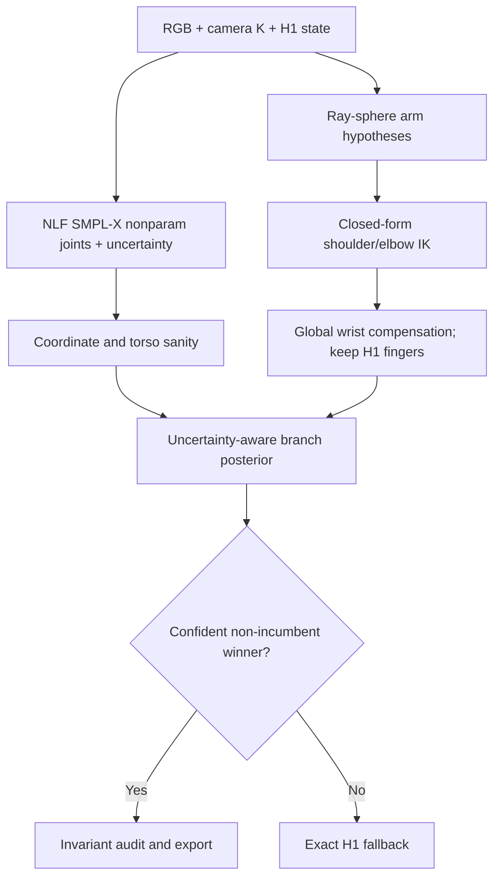

# SignDART-NLF: bản thiết kế nghiên cứu và triển khai end-to-end

> Phiên bản: 5.0 — 2026-09-01  
> Mục tiêu: cải thiện reconstruction 3D sign language trên protocol chính thức bằng một module upper-limb có effect size đủ lớn, trong khi giữ nguyên phần hand refinement đã được chứng minh.  
> Trạng thái: implementation blueprint có kill-gate; các con số của module mới chỉ được gọi là kết quả sau khi chạy evaluator chính thức.  
> Phạm vi: single-frame RGB, SMPL-X topology chuẩn, không dùng mocap marker, không dùng GT trong inference, không thêm temporal loss/model, không tải dataset huấn luyện lớn.

---

## 0. Kết luận nghiên cứu trước khi triển khai

### 0.1 Quyết định cuối cùng

Pipeline paper-core nên được rút gọn thành ba tầng:

1. **A3f/DexAvatar**: reconstruction incumbent.
2. **H1 canonical WiLoR finger refinement**: giữ nguyên vì đây là module đã cải thiện rõ LHand/RHand và cả sáu metric với exact fallback.
3. **SignDART-NLF**: module mới xử lý ambiguity chiều sâu của shoulder–elbow–wrist bằng một bank nghiệm hữu hạn bảo toàn 2D projection và bone length; NLF chỉ cung cấp nonparametric 3D joints cùng uncertainty để xếp hạng các nghiệm. Module không lấy raw NLF pose để thay body, không kéo toàn mesh về NLF, và không thay finger articulation của H1.

Các phần sau **không còn ở paper-core**:

- HaMeR/EI-AMER rescue: chỉ giữ như ablation vì incremental gain so với H1 quá nhỏ.
- Per-finger rescue, prior veto, silhouette/contact, generic part-probability fitting: đã có bằng chứng reject hoặc effect size không đủ.
- Full Hand4Whole++ replacement: không dùng làm initializer/final output; source của nó được dùng để rút ra insight distal-hand-to-proximal-body coupling.
- Sapiens2 pointmap/normal: không tải trong core. Chỉ mở lại như một external scorer nếu NLF vượt toàn bộ gate và một ablation cho thấy còn ceiling chưa được capture.
- Temporal refinement: không phù hợp với nhận định dữ liệu hiện tại là các central frames rõ, ít occlusion và không có blur/jitter đáng kể.

### 0.2 Tại sao hướng này khác C2 NLF cũ

C2 trước đây dùng NLF 3D bone vectors như một evidence trực tiếp trong continuous fitting và có **0 accept**. SignDART-NLF thay đổi cơ chế, không chỉ thay threshold:

| C2 cũ | SignDART-NLF mới |
|---|---|
| Raw NLF vector tham gia continuous correction | NLF không sửa state; chỉ xếp hạng một finite candidate bank |
| So sánh dễ chịu ảnh hưởng crop/camera/scale | Dùng đúng camera intrinsics, coordinate test, normalized bone directions và depth ratios |
| Hard consensus làm 0 activation | NLF uncertainty tạo posterior/vote trên discrete branches; confidence thấp thì abstain |
| Local perturbation có thể không đi qua elbow-depth flip | Ray–sphere solver liệt kê toàn bộ nghiệm depth hợp lệ của hai bones |
| Wrist/hand có thể bị upstream change làm hỏng | Global wrist orientation và H1 finger locals được bù trừ/bảo toàn; hand-shape invariant được kiểm tra trước accept |
| Không có oracle-ceiling gate | Đo ceiling của candidate bank trước khi chạy full NLF/full57 |

Nếu candidate bank không có oracle ceiling lớn, hoặc NLF không capture được ceiling, hướng này bị dừng. Không tiếp tục nới threshold để ép accept.

### 0.3 Điều có thể và không thể cam kết

Không một module mới nào có thể được “đảm bảo cải thiện” trước khi chạy benchmark. Bản thiết kế này đảm bảo ba điều thực tế hơn:

- module yếu bị phát hiện sớm trên candidate-oracle và selector-capture gate;
- reject trả lại đúng H1 incumbent, không tạo silent drift;
- chỉ promote nếu official effect size vượt xa vùng `0.00xx mm` của các rescue module trước.

---

## 1. Contract bất biến của evaluator chính thức

File đính kèm `evaluate_new_fitting(2).py` là evaluator duy nhất dùng để báo cáo kết quả. Không sửa một dòng, không thay cách pairing frame, không đổi centering, không đổi vertex region, không viết lại aggregation.

### 1.1 Identity và hash

```text
SHA-256 = 2722b5cd30d4baba23599a455cab483b143e6595d292f02de9643af4eebd5300
```

Wrapper chỉ được phép:

1. kiểm tra hash trước khi chạy;
2. kiểm tra cấu trúc input/output;
3. gọi evaluator như subprocess;
4. lưu nguyên stdout/stderr và exit code;
5. kiểm tra lại hash sau khi chạy.

```bash
EVAL_PY=/absolute/path/evaluate_new_fitting.py
EXPECTED_SHA=2722b5cd30d4baba23599a455cab483b143e6595d292f02de9643af4eebd5300

test "$(sha256sum "$EVAL_PY" | awk '{print $1}')" = "$EXPECTED_SHA"

python "$EVAL_PY" \
  --method signdart_nlf \
  --central true \
  --evaluate_folder /absolute/path/runs/signdart_nlf_full57 \
  --gt_folder /absolute/path/gt \
  --sign_file /absolute/path/signs.txt \
  --sign_seg /absolute/path/sign_segments.json \
  2>&1 | tee /absolute/path/reports/signdart_nlf_official.log

test "${PIPESTATUS[0]}" -eq 0
test "$(sha256sum "$EVAL_PY" | awk '{print $1}')" = "$EXPECTED_SHA"
```

Không dùng một evaluator khác để tạo main table. Diagnostic/oracle code, nếu có, phải có tên và output riêng, chỉ dùng để quyết định có tiếp tục development hay không.

### 1.2 I/O contract phải tuân thủ

Evaluator đọc candidate theo:

```text
<evaluate_folder>/<sign>/smplifyx/meshes/*.obj
```

Các OBJ được sort theo nhóm chữ số đầu tiên trong filename stem. Candidate được ghép với danh sách GT theo **vị trí**. Do đó:

- một sign không được thiếu candidate ở giữa;
- không được thêm preview OBJ hoặc file phụ có chữ số vào `meshes/`;
- mỗi OBJ phải có đúng 10,475 vertices;
- face array phải giống GT tuyệt đối;
- vertex order phải là canonical SMPL-X order;
- mesh phải finite, đúng unit và đúng coordinate transform đã khóa;
- mọi frame reject vẫn phải materialize một OBJ từ exact H1 state.

Nên đặt sidecar, log, NPZ ở ngoài `meshes/`:

```text
run_root/
├── <sign>/smplifyx/meshes/000000.obj
├── <sign>/smplifyx/meshes/000001.obj
├── sidecars/<sign>/000000.json
├── states/<sign>/000000.npz
└── logs/<sign>.jsonl
```

### 1.3 Sáu output chính thức

Tên rút gọn trong tài liệu ánh xạ đúng với key evaluator:

| Tên trong bảng | Dòng output chính thức |
|---|---|
| All | `TR all` |
| LHand | `TR left hand` |
| RHand | `TR right hand` |
| UBody | `TR above pelvis upper body` |
| UBody-H | `TR above pelvis minus head` |
| UBody-F | `TR above pelvis minus face` |

Evaluator tự loại left-hand vertices khỏi các region liên quan và bỏ LHand cho class-0 theo code của author. Pipeline không can thiệp.

### 1.4 Author data path không được giải quyết bằng sửa code

Evaluator đọc assets từ đúng path:

```text
/home/haipd/DexAvatar/data/evaluation_from_author/data/data
```

Path phải chứa ít nhất:

```text
MANO_SMPLX_vertex_ids.pkl
SMPLX_NEUTRAL.npz
sgnify_part_segm_above_pelvis_joint/upper_body.npy
sgnify_part_segm_above_pelvis_joint/upper_body_minus_head.npy
sgnify_part_segm_above_pelvis_joint/upper_body_minus_face.npy
```

Nếu chạy container, mount read-only vào chính path đó. Ví dụ:

```bash
docker run --rm --gpus all \
  -v /host/author_data:/home/haipd/DexAvatar/data/evaluation_from_author/data/data:ro \
  -v /host/project:/work \
  <image> bash /work/scripts/evaluate_official.sh
```

Không sửa constant `data_base_dir` trong evaluator.

---

## 2. Bằng chứng thực nghiệm hiện có và phần cần loại bỏ

### 2.1 Incumbent đã xác minh

Các số dưới đây lấy từ result cards hiện có; lower is better:

| Method | All | UBody | UBody-F | UBody-H | LHand | RHand |
|---|---:|---:|---:|---:|---:|---:|
| A3f / C0 | 42.0936 | 25.8311 | 29.1458 | 39.6963 | 12.8466 | 12.1275 |
| H1 canonical WiLoR | 42.0696 | 25.8053 | 29.1131 | 39.6254 | 12.5219 | 11.9180 |
| H15-v2 EI-AMER | 42.0640 | 25.7991 | 29.1057 | 39.6121 | 12.5060 | 11.8431 |

H1 so với A3f cải thiện:

```text
All     -0.0240 mm
UBody   -0.0258 mm
UBody-F -0.0327 mm
UBody-H -0.0709 mm
LHand   -0.3247 mm
RHand   -0.2096 mm
```

H1 có paired-sign bootstrap CI âm ở cả sáu metric và exact fallback đã được audit. H1 vì vậy là hand incumbent hợp lý.

H15-v2 so với H1 chỉ cải thiện khoảng:

```text
All     -0.0056 mm
UBody   -0.0062 mm
UBody-F -0.0074 mm
UBody-H -0.0133 mm
LHand   -0.0159 mm
RHand   -0.0749 mm
```

Đây không phải effect size đủ để biện minh cho thêm HaMeR checkpoint, rescue logic, conflict veto và narrative phức tạp. H15-v2 nên xuất hiện ở appendix/ablation, không nằm trong final method.

### 2.2 Negative evidence phải được tôn trọng

| Nhánh đã thử | Kết quả quan trọng | Quyết định |
|---|---|---|
| C1 Sapiens heatmap upper-body | 0 accept | Không dùng lại dưới cùng cơ chế |
| C2 C1 + raw NLF bone vectors | 0 accept | Không dùng NLF như direct fitting target |
| C3-lite-v3 protected coupling | 59 accepts, 5/6 metrics regress | Bỏ continuous protected coupling |
| C4-v3 part probabilities + soft splat | 48 accepts, UBody regress | Bỏ broad segmentation fitting |
| H7 per-finger composition | External LHand regress | Bỏ khỏi core |
| H8 SignHPoser veto | External 6/6 regress | Không dùng prior score như uncertainty |
| H12 global radius 12° | RHand regress 0.0002 mm | Không dùng như contribution |
| H13/H14/H15 expert rescue | Gain nhỏ hoặc invariant/generalization issue | Chỉ giữ negative/ablation evidence |

Insight chính: vấn đề không còn là thiếu expert. Vấn đề là cần một **state space mới** có thể chứa correct arm-depth branch nhưng không làm hỏng hand state đã tốt.

---

## 3. Audit literature và source code

Chỉ các nguồn chính thức có paper/repository công khai được dùng trong thiết kế.

### 3.1 Source locks

| Component | Repository | Commit/tag dùng để audit |
|---|---|---|
| DexAvatar | [kaustesseract/DexAvatar](https://github.com/kaustesseract/DexAvatar) | source-audit snapshot `a0dfd427f60f5811aadb35c8657b3856d47f56b5`; inference phải đọc frozen H1 artifacts, không rerun incumbent từ snapshot này |
| Hand4Whole++ | [mks0601/Hand4Whole-plus-plus_RELEASE](https://github.com/mks0601/Hand4Whole-plus-plus_RELEASE) | `f81d35ddd2b74206c40142243eb62b6d64ce0d65` |
| NLF | [isarandi/nlf](https://github.com/isarandi/nlf) | source tag `v0.3.2`, commit `7331c3105a3f730e22517dfc158702871fc9f8d4` |
| KITRO | [MartaYang/KITRO](https://github.com/MartaYang/KITRO) | `8b038353011727541d27dedef0942fc1662abbcb` |
| SGNify | [MPForte/SGNify](https://github.com/MPForte/SGNify) | local audit `bae2a71d8388df73af56117731f7f454e36e5b2e` |
| Sapiens2, optional only | [facebookresearch/sapiens](https://github.com/facebookresearch/sapiens) | `7e5bae88456ac418ff0e58e74106c9fe192055d4` |

Trong máy reproducibility, ghi lại `git diff --stat`, `git status --porcelain` và submodule hashes. Không chỉ ghi branch name.

Các SHA trong bảng là snapshots dùng để đọc source. Authority cho incumbent vẫn là frozen H1 states, decisions, config và implementation hashes đã tạo ra result card hiện tại; không thay H1 bằng output của một checkout mới.

### 3.2 NLF: phần có thể áp dụng thật

[Neural Localizer Fields, NeurIPS 2024](https://arxiv.org/abs/2407.07532) học một continuous field của 3D point localizers: input là canonical point trong human volume, output là vị trí point tương ứng trong camera 3D. Official TorchScript multi-person model đã expose SMPL/SMPL-X inference.

Source `nlf/pt/multiperson/multiperson_model.py` cho thấy:

- `detect_smpl_batched` tự detect person;
- `estimate_smpl_batched` nhận person boxes do caller cung cấp;
- `model_name='smplx'` trả SMPL-X results;
- output có cả parametric và nonparametric predictions;
- `joints3d_nonparam`, `joints2d_nonparam`, `joint_uncertainties` là output cần dùng;
- nonparametric 3D và uncertainty được trả theo millimetres;
- NLF parametric fitter dùng weights tỷ lệ `uncertainty ** -1.5`;
- nếu không truyền intrinsics, code giả định field of view 55°. Với pipeline này phải truyền đúng `K`, không dùng default trừ smoke test;
- multi-augmentation được aggregate bằng scale alignment và weighted geometric median.

Lý do chọn **nonparametric joints**:

1. đây là image evidence gần localizer head nhất;
2. không bị SMPL fitter 3-iteration của NLF ép về một parametric prior khác;
3. có uncertainty trực tiếp;
4. chỉ cần shoulder, elbow, wrist nên không cần dense vertex bundle.

Không dùng NLF cho fine fingers trong core. Full-person 384×384 features khó cạnh tranh với WiLoR hand crop về finger articulation; dùng nó làm hand veto có rủi ro xóa các H1 gains đã được chứng minh.

### 3.3 NLF release, storage và license

Official release `v0.3.2` có:

```text
nlf_l_multi_0.3.2.torchscript
size = 493,117,974 bytes
```

Release này được author mô tả là NLF-L huấn luyện 1.6M update steps với recipe mới, tốt hơn NLF-L trước. `v0.2.2` đã sửa translation offset và 2D projection; `v0.3.2` là nhánh mới hơn.

Code repository có MIT license. Pretrained models được phát hành cho non-commercial research use; cần kiểm tra lại điều khoản trước commercial deployment.

Không cần tải dataset InterHand, AGORA, 3DPW hoặc training corpus. Không cần tải `nlf_data_files.zip` 939 MB cho core TorchScript path. Repo source khoảng vài MB, checkpoint khoảng 493 MB, derived joint cache nhỏ.

Nếu 493 MB vẫn quá lớn cho pilot, dùng `nlf_s_multi_0.2.2.torchscript` khoảng 298 MB chỉ để chạy feasibility. Main paper row phải dùng một checkpoint duy nhất đã freeze; không trộn S và L theo frame.

### 3.4 Hand4Whole++: áp dụng insight, không ghép mù checkpoint

[Hand4Whole++, CVPR 2026](https://arxiv.org/abs/2603.14726) đưa hand-specific features từ WiLoR vào whole-body encoder thông qua Conditional Hands Modulator (CHAM).

Audit source cho thấy `HandControlNet`:

- tạo positional embedding theo hand boxes;
- cross-attend left/right hand features khi cả hai tồn tại;
- dùng zero-initialized convolutions cho từng ViT depth;
- undo crop/resize để đưa hand feature về body feature grid;
- inject `hand_feat_list` vào body encoder ở nhiều layers.

Đây là **learned feature coupling**. Không thể copy vài dòng CHAM vào DexAvatar post-fitting rồi kỳ vọng hoạt động. Dù whole-body và hand estimator bị freeze, CHAM vẫn phải được huấn luyện; official setup tham chiếu nhiều datasets lớn, trái constraint storage hiện tại. Full pretrained Hand4Whole++ output cũng đã không phù hợp làm direct replacement trong các thử nghiệm trước.

Insight được giữ lại là distal-to-proximal conditioning: hand/wrist evidence phải giúp chọn upper-arm state. SignDART-NLF thực hiện insight này ở **hypothesis space**, không ở feature space:

- H1 hand state là distal invariant;
- NLF wrist/elbow/shoulder evidence chọn proximal depth branch;
- wrist compensation bảo toàn global hand frame;
- không train CHAM và không tải datasets.

Không tuyên bố đây là CHAM hoặc reimplementation Hand4Whole++. Nó là một training-free kinematic analogue được thiết kế cho frozen reconstruction.

### 3.5 KITRO: prior art phải ghi rõ

[KITRO, CVPR 2024](https://arxiv.org/abs/2405.19833) chỉ ra rằng với 2D point, bone length và parent depth, mỗi child bone có tối đa hai nghiệm closed-form; decision tree chọn các binary branches dọc kinematic tree.

Phần được tái sử dụng về mặt toán học:

- ray–sphere quadratic;
- finite depth hypotheses;
- bone-wise kinematic update.

Phần mới của SignDART-NLF không phải “phát minh ra two-root IK”. Novelty phải nằm ở:

- SMPL-X signing-specific arm-only candidate space;
- NLF nonparametric uncertainty likelihood thay vì chọn branch gần original HMR direction;
- exact H1 hand preservation bằng wrist-frame compensation và centered-hand invariant;
- risk-controlled abstention trên một evaluator/frozen incumbent thực tế.

### 3.6 HUMR và uncertainty preservation

[HUMR, WACV 2025](https://arxiv.org/abs/2411.16289) là bằng chứng rằng collapsing uncertain image evidence thành một point estimate làm mất ambiguity. Ta không mang normalizing flow của HUMR vào pipeline; ta áp dụng nguyên tắc tương tự bằng posterior/voting trên finite arm branches, dùng uncertainty NLF thay vì một hard vector target.

### 3.7 Sapiens2 pointmap: tại sao không phải core

Official Sapiens2 pointmap dự đoán per-pixel `(x,y,z)` trong camera frame và có thể cung cấp dense surface depth. Tuy nhiên:

- checkpoint 0.4B trở lên tạo thêm storage/runtime đáng kể;
- C4 predecessor đã cho thấy broad dense evidence có thể activate nhưng làm UBody xấu;
- core hypothesis hiện chỉ cần ba joints mỗi arm, đúng với NLF;
- thêm pointmap trước khi NLF pass sẽ lặp lại lỗi “cộng thêm expert nhưng gain rất nhỏ”.

Chỉ chạy `+Pointmap` sau khi:

1. candidate bank oracle lớn;
2. NLF selector cải thiện chính thức;
3. analysis cho thấy NLF chọn sai có cấu trúc mà dense surface axis có thể sửa;
4. incremental target dự kiến lớn hơn 0.05 mm UBody-H.

---

## 4. Proposed method: SignDART-NLF

### 4.1 Tên và formulation

**SignDART-NLF: Depth-Ambiguity Resolution for 3D Signing Avatars with Uncertainty-Aware Neural Localizers**.

Với frame `t`, incumbent H1 state là:

$$
\Theta_t^0 = (\beta, \gamma_t, \theta_t^B, \theta_t^{L}, \theta_t^{R}, \psi_t, c_t),
$$

trong đó shape `β`, global/root `γ`, body rotations, left/right hand rotations, face/expression và camera đã được freeze.

Ta chỉ cho phép thay local rotations của:

```text
left shoulder 16, left elbow 18, left wrist 20
right shoulder 17, right elbow 19, right wrist 21
```

Wrist local rotation được thay chỉ để **bù upstream rotation**, sao cho global wrist frame bằng incumbent. Finger locals của H1 không đổi.

Với mỗi side, candidate set:

$$
\mathcal C_t^s = \{c_0, c_{++}, c_{+-}, c_{-+}, c_{--}\},
$$

trong đó `c0` là exact H1; các branch còn lại là nghiệm hợp lệ của elbow root × wrist root. Số candidate thực tế có thể ít hơn nếu discriminant âm, depth không dương hoặc invariant fail.

### 4.2 Luồng xử lý



### 4.3 Ray–sphere finite candidates

Cho child image coordinate `u=(u,v)`, camera intrinsic `K` và ray:

$$
r = K^{-1}[u,v,1]^\top.
$$

Parent 3D position là `P`, child `X=λr`, bone length incumbent là `L`. Ràng buộc:

$$
\|\lambda r-P\|_2^2=L^2
$$

tạo quadratic:

$$
(r^\top r)\lambda^2 - 2(r^\top P)\lambda + (P^\top P-L^2)=0.
$$

Giữ roots `λ>0`. Shoulder position của H1 được khóa. Giải elbow roots trước; với mỗi elbow root giải wrist roots. 2D coordinates dùng **projection của chính H1 joints dưới đúng K**, vì mục tiêu là sửa depth mà không làm xấu 2D fit đã tốt.

Minimal implementation:

```python
# signdart/geometry/ray_sphere.py
from __future__ import annotations
import torch


def pixel_ray(K: torch.Tensor, uv: torch.Tensor) -> torch.Tensor:
    """K: [3,3], uv: [...,2], return [...,3] with z=1."""
    one = torch.ones_like(uv[..., :1])
    homog = torch.cat([uv, one], dim=-1)
    ray = torch.linalg.solve(K, homog.unsqueeze(-1)).squeeze(-1)
    return ray / ray[..., 2:].clamp_min(1e-8)


def positive_sphere_ray_roots(
    parent: torch.Tensor,
    ray: torch.Tensor,
    length: torch.Tensor,
    disc_eps: float = 1e-8,
) -> list[torch.Tensor]:
    """Solve ||lambda * ray - parent||^2 = length^2."""
    a = torch.dot(ray, ray)
    b = -2.0 * torch.dot(ray, parent)
    c = torch.dot(parent, parent) - length.square()
    disc = b.square() - 4.0 * a * c
    if float(disc) < -disc_eps:
        return []
    sqrt_disc = torch.sqrt(torch.clamp(disc, min=0.0))
    roots = [(-b - sqrt_disc) / (2.0 * a), (-b + sqrt_disc) / (2.0 * a)]
    out: list[torch.Tensor] = []
    for lam in roots:
        if torch.isfinite(lam) and float(lam) > 1e-6:
            x = lam * ray
            if not out or torch.linalg.norm(x - out[0]) > 1e-6:
                out.append(x)
    return out


def enumerate_arm_branches(
    shoulder: torch.Tensor,
    elbow_uv: torch.Tensor,
    wrist_uv: torch.Tensor,
    upper_len: torch.Tensor,
    fore_len: torch.Tensor,
    K: torch.Tensor,
) -> list[dict[str, torch.Tensor]]:
    e_ray = pixel_ray(K, elbow_uv)
    w_ray = pixel_ray(K, wrist_uv)
    candidates = []
    for e_idx, elbow in enumerate(
        positive_sphere_ray_roots(shoulder, e_ray, upper_len)
    ):
        for w_idx, wrist in enumerate(
            positive_sphere_ray_roots(elbow, w_ray, fore_len)
        ):
            candidates.append({
                "name": f"e{e_idx}_w{w_idx}",
                "shoulder": shoulder,
                "elbow": elbow,
                "wrist": wrist,
            })
    return candidates
```

Không thay rays bằng NLF 2D points. NLF 2D chỉ làm association/sanity. Nếu dùng NLF 2D để tạo candidate, method sẽ trộn 2D correction với depth disambiguation và mất identity của incumbent branch.

### 4.4 Closed-form swing update

Với current unit bone vector `a` và target `b`, minimal swing rotation được tính từ:

$$
v=a\times b,\quad c=a^\top b,\quad s=\|v\|,
$$

và Rodrigues. Cần xử lý anti-parallel case bằng một deterministic orthogonal axis.

```python
# signdart/geometry/rotations.py
import torch


def skew(v: torch.Tensor) -> torch.Tensor:
    x, y, z = v.unbind(-1)
    o = torch.zeros_like(x)
    return torch.stack([
        o, -z, y,
        z, o, -x,
        -y, x, o,
    ], dim=-1).reshape(v.shape[:-1] + (3, 3))


def deterministic_orthogonal_axis(a: torch.Tensor) -> torch.Tensor:
    basis = torch.eye(3, dtype=a.dtype, device=a.device)
    idx = torch.argmin(torch.abs(a))
    axis = torch.linalg.cross(a, basis[idx])
    return axis / torch.linalg.norm(axis).clamp_min(1e-8)


def rotation_between(a: torch.Tensor, b: torch.Tensor) -> torch.Tensor:
    a = a / torch.linalg.norm(a).clamp_min(1e-8)
    b = b / torch.linalg.norm(b).clamp_min(1e-8)
    c = torch.clamp(torch.dot(a, b), -1.0, 1.0)
    eye = torch.eye(3, dtype=a.dtype, device=a.device)
    if float(c) > 1.0 - 1e-7:
        return eye
    if float(c) < -1.0 + 1e-7:
        axis = deterministic_orthogonal_axis(a)
        K = skew(axis)
        return eye + 2.0 * (K @ K)  # pi rotation
    v = torch.linalg.cross(a, b)
    K = skew(v)
    return eye + K + K @ K / (1.0 + c)
```

Update theo thứ tự proximal-to-distal:

1. forward H1 để lấy current global rotations/joints;
2. swing left/right shoulder để align upper-arm vector;
3. forward chain lại;
4. swing elbow để align forearm vector;
5. đặt wrist local rotation bằng compensation formula;
6. convert rotation matrices về axis-angle với stable implementation;
7. forward full SMPL-X và kiểm tra target residual.

### 4.5 Global wrist compensation

Gọi global wrist rotation incumbent là `G_w^0`, global elbow rotation candidate là `G_e^c`. Wrist local candidate:

$$
L_w^c=(G_e^c)^\top G_w^0.
$$

Khi đó:

$$
G_w^c=G_e^cL_w^c=G_w^0.
$$

Do đó palm/global hand orientation không đổi dù shoulder/elbow branch đổi. Các local finger rotations từ H1 được copy bitwise.

```python
def compensate_wrist_local(
    incumbent_wrist_global: torch.Tensor,
    candidate_elbow_global: torch.Tensor,
) -> torch.Tensor:
    return candidate_elbow_global.transpose(-1, -2) @ incumbent_wrist_global
```

Không cho optimizer tự do tìm wrist rotation. Thử nghiệm trước cho thấy ngay cả tiny wrist residual cũng có thể cải thiện một local hand metric nhưng làm các region khác xấu.

### 4.6 NLF evidence vector

NLF dùng SMPL-X joint ordering chuẩn:

```python
SMPLX_ARM = {
    "left":  {"shoulder": 16, "elbow": 18, "wrist": 20},
    "right": {"shoulder": 17, "elbow": 19, "wrist": 21},
}
TORSO_QA = [0, 1, 2, 3, 6, 9, 12, 13, 14, 15]
```

Với mỗi side, lấy:

```text
mu_S, mu_E, mu_W       = joints3d_nonparam
sigma_S, sigma_E, sigma_W = joint_uncertainties
uv_S, uv_E, uv_W       = joints2d_nonparam
```

Sau exact coordinate conversion, tạo normalized evidence:

$$
u_1^N=\frac{\mu_E-\mu_S}{\|\mu_E-\mu_S\|},\qquad
u_2^N=\frac{\mu_W-\mu_E}{\|\mu_W-\mu_E\|}.
$$

Depth ratios:

$$
z_1^N=\frac{\mu_{E,z}-\mu_{S,z}}{\|\mu_E-\mu_S\|},\qquad
z_2^N=\frac{\mu_{W,z}-\mu_{E,z}}{\|\mu_W-\mu_E\|}.
$$

Translation và absolute subject scale bị loại. Không fit một free 3D rotation từ NLF sang H1; rotation convention phải được giải bằng coordinate contract, không được “học” từ GT.

### 4.7 Candidate energy

Cho candidate `c` với unit directions `u1c,u2c`, depth ratios `z1c,z2c`:

$$
E_N(c)=w_1\,\arccos^2(u_1^c\cdot u_1^N)
+w_2\,\arccos^2(u_2^c\cdot u_2^N)
+w_z[(z_1^c-z_1^N)^2+(z_2^c-z_2^N)^2]
+w_b E_{bend}(c).
$$

Weights dùng uncertainty propagation:

$$
\sigma_1=\sqrt{\sigma_S^2+\sigma_E^2},\qquad
\sigma_2=\sqrt{\sigma_E^2+\sigma_W^2},
$$

$$
w_i=\frac{\sigma_i^{-1.5}}{\sum_j\sigma_j^{-1.5}},
$$

giữ exponent `-1.5` nhất quán với official NLF parametric fitter.

Incumbent regularizer chỉ phá tie:

$$
E(c)=E_N(c)+\lambda_{inc}\,[\angle(u_1^c,u_1^0)^2+\angle(u_2^c,u_2^0)^2],
$$

với `λ_inc` nhỏ. Nếu incumbent prior chi phối NLF likelihood, module sẽ quay lại C2 no-activation.

### 4.8 Uncertainty-aware branch posterior

Không coi NLF mean vector là ground truth. Từ scalar uncertainty, deterministic Monte Carlo tạo `M` observations:

$$
J_q^{(m)}=\mu_q+\alpha\sigma_q\epsilon_q^{(m)},\quad
\epsilon\sim\mathcal N(0,I).
$$

Mỗi sample vote cho branch có energy nhỏ nhất. Posterior empirical:

$$
p(c)=\frac{1}{M}\sum_m\mathbf 1[c=\arg\min_{c'}E^{(m)}(c')].
$$

Default development config:

```yaml
selector:
  mc_samples: 128
  seed: 20260901
  accept_probability: 0.80
  incumbent_max_probability: 0.20
  min_probability_margin: 0.45
  uncertainty_power: -1.5
  max_joint_uncertainty_mm: 250.0
  max_torso_direction_median_deg: 25.0
  incumbent_tie_weight: 0.03
```

Các constants này phải freeze sau Engineering12. Không retune theo individual sign hoặc full57 result.

Accept một non-incumbent branch chỉ khi:

1. NLF output tồn tại và finite;
2. camera/coordinate QA pass;
3. shoulder/elbow/wrist uncertainty pass;
4. candidate posterior ≥ 0.80;
5. incumbent posterior ≤ 0.20;
6. winner margin ≥ 0.45;
7. same winner trên original NLF observation và MC posterior mode;
8. joint reprojection, bone length, joint-limit, global-wrist và centered-hand invariants pass.

Nếu một điều kiện fail: exact H1 fallback. Không chọn “second-best” branch.

### 4.9 Tại sao hand metrics được bảo vệ

SignDART không cố dùng NLF để cải thiện fingers. Nó bảo vệ H1 bằng bốn invariants:

- `left_hand_pose` và `right_hand_pose` locals không đổi;
- shape `β` không đổi;
- global wrist rotation không đổi;
- centered hand geometry candidate phải gần incumbent.

Với hand vertex set `H`:

$$
d_H=\operatorname{RMS}\left[
(V_H^c-\bar V_H^c)-(V_H^0-\bar V_H^0)
\right].
$$

Reject nếu `dH > 0.02 mm` trong development default. Đây là GT-free invariant. Nó không đảm bảo H1 hand là đúng; nó đảm bảo arm module không phá relative hand shape đã được H1 cải thiện.

---

## 5. NLF implementation chi tiết

### 5.1 Minimal install, không tải training data

Ưu tiên reuse PyTorch/CUDA environment hiện có. Tạo một sidecar env chỉ khi TorchScript không tương thích.

```bash
PROJECT_ROOT=/absolute/path/SignDART-NLF
THIRD_PARTY_ROOT="$PROJECT_ROOT/third_party"
MODEL_ROOT="$PROJECT_ROOT/models/nlf"

mkdir -p "$THIRD_PARTY_ROOT" "$MODEL_ROOT"
git clone https://github.com/isarandi/nlf.git "$THIRD_PARTY_ROOT/nlf"
git -C "$THIRD_PARTY_ROOT/nlf" checkout v0.3.2
test "$(git -C "$THIRD_PARTY_ROOT/nlf" rev-parse HEAD)" = \
  7331c3105a3f730e22517dfc158702871fc9f8d4

python -m venv "$PROJECT_ROOT/.venv_nlf"
source "$PROJECT_ROOT/.venv_nlf/bin/activate"
python -m pip install --upgrade pip
python -m pip install torch torchvision numpy pillow
```

Không chạy `install_dependencies.sh` của training repo cho inference-only path; script đó cài nhiều package/datasets-related dependencies không cần thiết.

Download official model:

```bash
curl -L --fail --retry 5 \
  https://github.com/isarandi/nlf/releases/download/v0.3.2/nlf_l_multi_0.3.2.torchscript \
  -o "$MODEL_ROOT/nlf_l_multi_0.3.2.torchscript"

test "$(stat -c '%s' "$MODEL_ROOT/nlf_l_multi_0.3.2.torchscript")" = 493117974
sha256sum "$MODEL_ROOT/nlf_l_multi_0.3.2.torchscript" \
  | tee "$MODEL_ROOT/nlf_l_multi_0.3.2.sha256"
```

Commit checksum file vào experiment manifest. Không hard-code một checksum chưa tự tính trên artifact đã download.

### 5.2 Camera và person box

Không dùng NLF detector trong core vì benchmark có một signer và DexAvatar đã có person crop. Dùng `estimate_smpl_batched` với bbox đã dùng bởi baseline preprocessing. Điều này tránh:

- chọn nhầm detection;
- crop khác giữa methods;
- detector NMS thay đổi theo version.

Bbox format NLF là `[x, y, width, height]` trong original image pixels. Intrinsic `K` là `[3,3]`, cùng original image coordinate.

Nếu baseline chỉ lưu crop transform, invert transform một lần để phục hồi original-frame bbox và `K`. Test round-trip:

```text
original pixel -> baseline crop -> original pixel
maximum absolute residual <= 0.25 px
```

### 5.3 Extractor skeleton

```python
# scripts/extract_nlf.py
from __future__ import annotations
import argparse
import hashlib
import json
from pathlib import Path

import numpy as np
import torch
import torchvision  # required before loading scripted torchvision ops


ARM_IDS = {
    "left":  {"shoulder": 16, "elbow": 18, "wrist": 20},
    "right": {"shoulder": 17, "elbow": 19, "wrist": 21},
}
TORSO_IDS = np.asarray([0, 1, 2, 3, 6, 9, 12, 13, 14, 15], np.int64)


def sha256(path: Path) -> str:
    h = hashlib.sha256()
    with path.open("rb") as f:
        for chunk in iter(lambda: f.read(8 << 20), b""):
            h.update(chunk)
    return h.hexdigest()


def load_uint8_chw(path: Path, device: torch.device) -> torch.Tensor:
    image = torchvision.io.read_image(str(path))
    if image.dtype != torch.uint8 or image.shape[0] != 3:
        raise ValueError(f"Expected RGB uint8 CHW: {path}, got {image.shape}/{image.dtype}")
    return image.to(device)


def run_one(model, image, box_xywh, K, num_aug: int = 5):
    images = image.unsqueeze(0)
    boxes = [torch.as_tensor(box_xywh, dtype=torch.float32,
                             device=image.device).reshape(1, 4)]
    intrinsics = torch.as_tensor(K, dtype=torch.float32,
                                 device=image.device).reshape(1, 3, 3)
    with torch.inference_mode():
        pred = model.estimate_smpl_batched(
            images,
            boxes,
            intrinsic_matrix=intrinsics,
            distortion_coeffs=None,
            extrinsic_matrix=None,
            world_up_vector=None,
            default_fov_degrees=55.0,  # unused because K is supplied
            internal_batch_size=max(num_aug, 5),
            antialias_factor=1,
            num_aug=num_aug,
            rot_aug_max_degrees=25.0,
            beta_regularizer=10.0,
            beta_regularizer2=0.0,
            model_name="smplx",
        )

    # One requested box -> one person result for image index 0.
    j3d = pred["joints3d_nonparam"][0][0].float().cpu().numpy()
    j2d = pred["joints2d_nonparam"][0][0].float().cpu().numpy()
    unc = pred["joint_uncertainties"][0][0].float().cpu().numpy()
    if j3d.shape[0] < 55 or j2d.shape[0] < 55 or unc.shape[0] < 55:
        raise RuntimeError((j3d.shape, j2d.shape, unc.shape))
    if not (np.isfinite(j3d).all() and np.isfinite(j2d).all()
            and np.isfinite(unc).all()):
        raise RuntimeError("Non-finite NLF output")
    return j3d, j2d, unc


def main():
    ap = argparse.ArgumentParser()
    ap.add_argument("--checkpoint", type=Path, required=True)
    ap.add_argument("--records", type=Path, required=True)
    ap.add_argument("--output-root", type=Path, required=True)
    ap.add_argument("--device", default="cuda:0")
    ap.add_argument("--num-aug", type=int, default=5)
    args = ap.parse_args()

    device = torch.device(args.device)
    model = torch.jit.load(str(args.checkpoint), map_location=device).eval()
    ckpt_sha = sha256(args.checkpoint)
    args.output_root.mkdir(parents=True, exist_ok=True)

    with args.records.open() as f:
        records = [json.loads(line) for line in f if line.strip()]

    for rec in records:
        image = load_uint8_chw(Path(rec["image_path"]), device)
        K = np.asarray(rec["K"], np.float32).reshape(3, 3)
        box = np.asarray(rec["body_box_xywh"], np.float32)
        j3d, j2d, unc = run_one(model, image, box, K, args.num_aug)
        out = args.output_root / rec["sign"] / f'{int(rec["ordinal"]):06d}.npz'
        out.parent.mkdir(parents=True, exist_ok=True)
        np.savez_compressed(
            out,
            joints3d_nonparam_mm=j3d,
            joints2d_nonparam_px=j2d,
            joint_uncertainties_mm=unc,
            K=K,
            body_box_xywh=box,
            image_sha256=rec["image_sha256"],
            checkpoint_sha256=ckpt_sha,
            num_aug=np.int32(args.num_aug),
        )


if __name__ == "__main__":
    main()
```

TorchScript keyword support có thể khác theo Torch version. Trước full extraction, chạy `model.estimate_smpl_batched.schema` hoặc `print(model.estimate_smpl_batched.schema)` và chỉnh call syntax nhưng không chỉnh model. Smoke test phải dùng một frame và kiểm tra shapes/units/overlay.

### 5.4 Coordinate contract

NLF camera convention phải được đưa về **cùng pre-export frame** với H1. Không suy đoán transform bằng nhìn mesh.

Tạo `tests/test_coordinate_contract.py`:

1. lấy NLF `joints3d_nonparam`;
2. project bằng exact `K`;
3. so với `joints2d_nonparam`, median residual ≤ 2 px và P95 ≤ 5 px;
4. apply candidate coordinate transform `R_nlf_to_h1`;
5. project trong H1 camera frame;
6. check left/right wrist association;
7. verify chỉ có đúng transform đã khóa, không apply x180 hai lần.

Config:

```yaml
coordinates:
  nlf_units: mm
  h1_internal_units: m
  nlf_to_h1_rotation:
    - [1.0, 0.0, 0.0]
    - [0.0, -1.0, 0.0]
    - [0.0, 0.0, -1.0]
  apply_at: nlf_adapter_only
  export_rotation_already_applied: true
```

Ma trận trên chỉ là default tương ứng x180 boundary đã được ghi nhận trong artifact audit. Test overlay/projection mới là authority. Nếu H1 cache đang ở camera frame khác, config phải phản ánh đúng một transform; không sửa evaluator và không apply trial-and-error per frame.

### 5.5 NLF QA record

Mỗi frame lưu:

```json
{
  "sign": "...",
  "ordinal": 0,
  "checkpoint_sha256": "...",
  "camera_projection_median_px": 0.0,
  "camera_projection_p95_px": 0.0,
  "left_arm_uncertainty_mm": [0.0, 0.0, 0.0],
  "right_arm_uncertainty_mm": [0.0, 0.0, 0.0],
  "torso_direction_median_deg": 0.0,
  "left_right_association_ok": true,
  "usable_left": true,
  "usable_right": true
}
```

Không cache full images hoặc dense point clouds. Sau khi NPZ completeness/hash pass, checkpoint có thể chuyển sang external disk; derived cache đủ để chạy candidate selection.

---

## 6. Project structure và code boundaries

```text
SignDART-NLF/
├── README.md
├── configs/
│   ├── base_h1.yaml
│   ├── signdart_nlf_engineering12.yaml
│   └── signdart_nlf_frozen_full57.yaml
├── manifests/
│   ├── engineering12.jsonl
│   └── full57.jsonl
├── models/nlf/
│   ├── nlf_l_multi_0.3.2.torchscript
│   └── nlf_l_multi_0.3.2.sha256
├── signdart/
│   ├── io/
│   │   ├── h1_state.py
│   │   ├── camera.py
│   │   ├── nlf_cache.py
│   │   └── obj_export.py
│   ├── geometry/
│   │   ├── ray_sphere.py
│   │   ├── rotations.py
│   │   ├── arm_ik.py
│   │   └── projection.py
│   ├── evidence/
│   │   ├── nlf_quality.py
│   │   ├── arm_features.py
│   │   └── branch_posterior.py
│   ├── pipeline/
│   │   ├── generate_candidates.py
│   │   ├── select_candidate.py
│   │   ├── materialize.py
│   │   └── preflight.py
│   └── audit/
│       ├── invariants.py
│       ├── oracle_ceiling.py
│       └── summarize.py
├── scripts/
│   ├── extract_nlf.py
│   ├── run_engineering12.sh
│   ├── freeze_config.sh
│   ├── run_full57.sh
│   └── evaluate_official.sh
├── tests/
│   ├── test_ray_sphere.py
│   ├── test_coordinate_contract.py
│   ├── test_wrist_compensation.py
│   ├── test_hand_invariant.py
│   ├── test_fallback_identity.py
│   └── test_obj_topology.py
├── caches/nlf/
├── runs/
└── reports/
```

Không sửa DexAvatar, H1 hoặc evaluator source in-place. SignDART đọc frozen state và ghi run root mới.

---

## 7. Frozen config đầy đủ

```yaml
experiment:
  name: signdart_nlf_v1
  seed: 20260901
  deterministic: true
  inference_uses_gt: false
  use_temporal: false
  use_markers: false

incumbent:
  name: h1_canonical_wilor
  state_root: /absolute/path/h1/states
  decision_root: /absolute/path/h1/decisions
  obj_root: /absolute/path/h1/official_objs
  immutable: true

camera:
  source: dexavatar_frozen
  require_intrinsics: true
  default_fov_for_smoke_test_only: 55.0
  projection_roundtrip_max_px: 0.25

nlf:
  repo_tag: v0.3.2
  repo_commit: 7331c3105a3f730e22517dfc158702871fc9f8d4
  checkpoint: /absolute/path/models/nlf/nlf_l_multi_0.3.2.torchscript
  checkpoint_size_bytes: 493117974
  model_name: smplx
  use_external_detector: false
  num_aug: 5
  rot_aug_max_degrees: 25.0
  antialias_factor: 1
  max_joint_uncertainty_mm: 250.0

candidates:
  include_exact_incumbent: true
  lock_shoulder_position: true
  preserve_bone_lengths: true
  positive_depth_only: true
  max_per_side_including_incumbent: 5
  modify_joints:
    left: [16, 18, 20]
    right: [17, 19, 21]

selector:
  mc_samples: 128
  uncertainty_power: -1.5
  accept_probability: 0.80
  incumbent_max_probability: 0.20
  min_probability_margin: 0.45
  incumbent_tie_weight: 0.03
  max_torso_direction_median_deg: 25.0

invariants:
  reprojection_max_px: 0.25
  bone_length_abs_mm: 0.05
  target_joint_abs_mm: 0.10
  global_wrist_angle_deg: 0.01
  centered_hand_rms_mm: 0.02
  finger_local_abs: 0.0
  beta_abs: 0.0
  face_abs: 0.0
  camera_abs: 0.0
  faces_exact: true
  vertices: 10475

output:
  run_root: /absolute/path/runs/signdart_nlf_v1
  write_state_npz: true
  write_sidecar_json: true
  write_obj: true
  resume: true
  overwrite_existing: false

official_evaluator:
  path: /absolute/path/evaluate_new_fitting.py
  sha256: 2722b5cd30d4baba23599a455cab483b143e6595d292f02de9643af4eebd5300
```

`finger_local_abs: 0.0` nghĩa là compare serialized source arrays trước axis-angle round-trip. Nếu regenerate full SMPL-X state cần floating conversion, lưu H1 hand arrays nguyên bản và inject trực tiếp.

---

## 8. Candidate materialization algorithm

```text
Algorithm 1: SignDART-NLF per-frame inference
Input : RGB I, exact K, frozen H1 state Theta0, NLF cache O
Output: candidate state Theta*, OBJ V*

1. Verify H1 state hash and all required arrays.
2. Forward exact H1 SMPL-X once -> J0, V0, global rotations G0.
3. Verify NLF cache image hash, checkpoint hash, K and frame identity.
4. For side in {left, right}:
   4.1 Run NLF QA; if fail, decision[side] = fallback.
   4.2 Project H1 elbow/wrist through exact K.
   4.3 Read upper/forearm bone lengths from J0.
   4.4 Enumerate ray-sphere elbow x wrist roots.
   4.5 Add exact incumbent c0 explicitly.
   4.6 For each non-incumbent branch:
       a. solve shoulder/elbow minimal swing;
       b. compensate wrist local so Gw_candidate = Gw_H1;
       c. copy H1 finger locals;
       d. forward SMPL-X;
       e. discard if any invariant fails.
   4.7 Build NLF uncertainty posterior over surviving candidates.
   4.8 Accept only a confident non-incumbent winner; otherwise fallback.
5. Compose accepted left/right states from the same H1 base.
6. Forward composed SMPL-X once and rerun all global invariants.
7. If composed audit fails, revert failing sides; if still fails, exact full-frame fallback.
8. Write NPZ atomically, then sidecar JSON, then canonical OBJ.
9. Never select based on GT or official error.
```

### 8.1 Atomic, resume-safe writing

Per frame:

1. write `state.tmp.npz`;
2. fsync;
3. validate finite/shapes/hash;
4. rename to final NPZ;
5. write JSON sidecar;
6. export OBJ to temporary path;
7. validate topology;
8. rename OBJ.

Resume chỉ skip khi NPZ + JSON + OBJ đều có matching record hash. Không skip chỉ vì OBJ tồn tại.

### 8.2 Sidecar schema

```json
{
  "schema": 1,
  "sign": "...",
  "ordinal": 0,
  "image_sha256": "...",
  "h1_state_sha256": "...",
  "nlf_cache_sha256": "...",
  "config_sha256": "...",
  "decision": {
    "left": "fallback",
    "right": "e1_w0"
  },
  "posterior": {
    "left": {"c0": 1.0},
    "right": {"c0": 0.08, "e1_w0": 0.88, "e0_w1": 0.04}
  },
  "invariants": {
    "max_reprojection_px": 0.0,
    "max_bone_length_error_mm": 0.0,
    "left_global_wrist_angle_deg": 0.0,
    "right_global_wrist_angle_deg": 0.0,
    "left_centered_hand_rms_mm": 0.0,
    "right_centered_hand_rms_mm": 0.0
  },
  "uses_gt": false
}
```

---

## 9. Tests bắt buộc trước một run thật

### 9.1 Ray–sphere unit tests

- synthetic parent/child tạo từ known `K`; solver phải recover child depth;
- tangent sphere trả một unique root;
- negative discriminant trả empty;
- negative depth bị loại;
- incumbent elbow/wrist phải xuất hiện trong root set với residual ≤ `1e-5 m`;
- projected candidate residual ≤ `0.25 px`.

### 9.2 Rotation/IK tests

- parallel, anti-parallel và near-zero cross product;
- rotation determinant gần 1;
- orthogonality `R^T R≈I`;
- shoulder target residual ≤ 0.1 mm;
- elbow/wrist target residual ≤ 0.1 mm;
- no NaN khi arm gần thẳng.

### 9.3 Wrist compensation test

```python
assert geodesic_deg(G_wrist_candidate, G_wrist_h1) <= 0.01
assert np.array_equal(candidate.left_hand_pose, h1.left_hand_pose)
assert np.array_equal(candidate.right_hand_pose, h1.right_hand_pose)
```

### 9.4 Exact fallback test

Force NLF unavailable/uncertainty high. Output state arrays và OBJ phải hash-identical với H1 artifact. Nếu exporter không deterministic bytewise, state phải bitwise identical và parsed vertices/faces phải array-identical.

### 9.5 Topology test

Mọi OBJ:

```text
vertices = 10,475
faces = 20,908
faces hash = frozen canonical face hash
all vertices finite
no extra OBJ in meshes directory
```

### 9.6 No-GT/no-marker test

Inference process chạy trong container/namespace không mount GT root. Static scan không cho phép import evaluator hoặc đọc path chứa GT/SOMA/Vicon. Run log ghi `uses_gt=false`.

---

## 10. Research loop có kill-gate

Đây là phần quan trọng nhất để không lặp lại chuỗi module reject.

### Gate G0 — incumbent reproducibility

Trước module mới:

- materialize H1 từ frozen states;
- official evaluator phải reproduce sáu numbers trong tolerance rounding;
- evaluator hash và OBJ topology pass;
- không tiếp tục nếu H1 không reproduce.

### Gate G1 — geometric candidate coverage, không cần NLF

Trên Engineering12:

- ≥95% arm sides tạo được incumbent-equivalent root;
- ≥60% arm sides có ít nhất một valid alternative branch;
- projection P95 ≤0.25 px;
- bone length P95 ≤0.05 mm;
- wrist/hand invariants 100% pass cho surviving branches.

Fail G1 nghĩa là bug camera/solver/IK, không phải NLF failure.

### Gate G2 — candidate oracle ceiling

Sau khi candidate bank freeze, một diagnostic process có quyền đọc GT **chỉ trên Engineering12** để đo per-frame best possible branch. Nó không được chạy trong inference và không tạo final row.

Minimum ceiling để tiếp tục:

```text
oracle UBody-H gain >= 0.50 mm
oracle UBody   gain >= 0.20 mm
oracle All     gain >= 0.10 mm
hand regress   <= 0.02 mm
```

Nếu ceiling nhỏ hơn, dừng entire arm direction. Không tải NLF checkpoint lớn hơn, pointmap hoặc thêm expert vì state space không chứa đủ improvement.

### Gate G3 — NLF adapter validity

Trên một fixed 30-frame stratified set:

- correct person/left-right association 100%;
- finite outputs 100%;
- NLF self-projection median ≤2 px, P95 ≤5 px;
- ≥80% arm sides có mean uncertainty <250 mm;
- coordinate transform cố định cho mọi sign/frame;
- no per-frame axis flip/correction.

Nếu G3 fail, sửa adapter/camera. Không nới selector.

### Gate G4 — selector captures oracle

Trên Engineering12, freeze candidate bank trước rồi chạy selector:

- nonzero accepts;
- precision: ≥70% accepted side/frame decisions tốt hơn H1 trên target development diagnostic;
- capture ≥25% oracle UBody-H gain;
- official Engineering12: không metric nào regress;
- UBody-H cải thiện ≥0.15 mm;
- UBody cải thiện ≥0.05 mm;
- All cải thiện ≥0.02 mm;
- centered LHand/RHand thay đổi ≤0.02 mm.

Nếu selector có 0 accept, không giảm probability threshold trong cùng run. Audit coordinate, NLF uncertainty distribution và branch labels trước.

### Gate G5 — freeze và confirm

Trước full run:

```bash
sha256sum configs/signdart_nlf_engineering12.yaml \
  > reports/frozen_config.sha256
git rev-parse HEAD > reports/code_commit.txt
git diff --binary > reports/frozen_code.patch
```

Sau freeze:

- đổi run root;
- không đổi thresholds;
- không inspect per-frame GT để sửa decisions;
- chạy toàn bộ official input;
- report tất cả sáu metrics và paired-sign uncertainty analysis;
- promote paper-core chỉ nếu UBody/UBody-H effect size vẫn rõ và no hand regression.

### Stop rule cuối

Không viết contribution claim cho module mới nếu full official improvement so với H1 chỉ ở vùng `0.00xx mm`, CI/sign-level evidence không ổn định, hoặc gain đến từ rất ít signs.

---

## 11. Commands end-to-end

### 11.1 Preflight

```bash
source /absolute/path/SignDART-NLF/.venv_nlf/bin/activate
cd /absolute/path/SignDART-NLF

python -m pytest -q tests
python -m signdart.pipeline.preflight \
  --config configs/signdart_nlf_engineering12.yaml \
  --check-incumbent \
  --check-camera \
  --check-topology \
  --check-no-gt
```

### 11.2 Extract NLF once

```bash
python scripts/extract_nlf.py \
  --checkpoint models/nlf/nlf_l_multi_0.3.2.torchscript \
  --records manifests/full57.jsonl \
  --output-root caches/nlf/v0.3.2_aug5 \
  --device cuda:0 \
  --num-aug 5

python -m signdart.io.nlf_cache verify \
  --manifest manifests/full57.jsonl \
  --cache-root caches/nlf/v0.3.2_aug5 \
  --require-complete
```

### 11.3 Engineering candidate bank

```bash
python -m signdart.pipeline.generate_candidates \
  --config configs/signdart_nlf_engineering12.yaml \
  --manifest manifests/engineering12.jsonl \
  --candidate-root runs/engineering12_candidates

python -m signdart.audit.invariants \
  --candidate-root runs/engineering12_candidates \
  --report reports/g1_candidate_invariants.json
```

### 11.4 Development-only oracle ceiling

```bash
python -m signdart.audit.oracle_ceiling \
  --candidate-root runs/engineering12_candidates \
  --gt-root /absolute/path/gt \
  --author-data /home/haipd/DexAvatar/data/evaluation_from_author/data/data \
  --output reports/g2_oracle_ceiling.json
```

Output phải có banner `DEVELOPMENT_DIAGNOSTIC_ONLY` và không được nhập vào final official table.

### 11.5 Select và materialize Engineering12

```bash
python -m signdart.pipeline.select_candidate \
  --config configs/signdart_nlf_engineering12.yaml \
  --candidate-root runs/engineering12_candidates \
  --nlf-cache caches/nlf/v0.3.2_aug5 \
  --output-state-root runs/signdart_nlf_engineering12/states

python -m signdart.pipeline.materialize \
  --config configs/signdart_nlf_engineering12.yaml \
  --state-root runs/signdart_nlf_engineering12/states \
  --run-root runs/signdart_nlf_engineering12

python -m signdart.pipeline.preflight \
  --config configs/signdart_nlf_engineering12.yaml \
  --run-root runs/signdart_nlf_engineering12 \
  --strict
```

### 11.6 Freeze full config

Copy config bằng version-control/apply patch, chỉ thay manifest/run roots; selector constants giữ nguyên. Verify semantic diff:

```bash
python -m signdart.audit.config_diff \
  --dev configs/signdart_nlf_engineering12.yaml \
  --full configs/signdart_nlf_frozen_full57.yaml \
  --allow-only manifest output.run_root
```

### 11.7 Full run

```bash
python -m signdart.pipeline.run \
  --config configs/signdart_nlf_frozen_full57.yaml \
  --manifest manifests/full57.jsonl \
  --nlf-cache caches/nlf/v0.3.2_aug5 \
  --resume

python -m signdart.pipeline.preflight \
  --config configs/signdart_nlf_frozen_full57.yaml \
  --run-root runs/signdart_nlf_full57 \
  --strict
```

### 11.8 Official evaluation unchanged

```bash
bash scripts/evaluate_official.sh \
  /absolute/path/evaluate_new_fitting.py \
  runs/signdart_nlf_full57 \
  /absolute/path/gt \
  /absolute/path/signs.txt \
  /absolute/path/sign_segments.json
```

Lưu cùng report bundle:

```text
evaluator SHA before/after
exact command
stdout/stderr
exit code
config SHA
code commit/patch SHA
checkpoint SHA
manifest SHA
topology hash
accept/fallback counts
per-sign aggregate diagnostics
```

---

## 12. Ablation matrix tối thiểu

Không chạy hàng chục micro-variants. Chỉ cần các rows trả lời một câu hỏi khoa học rõ ràng:

| Row | H1 fingers | Ray–sphere bank | Raw NLF mean | NLF uncertainty posterior | Wrist compensation |
|---|---:|---:|---:|---:|---:|
| A3f |  |  |  |  |  |
| H1 | ✓ |  |  |  |  |
| Candidate prior only | ✓ | ✓ |  |  | ✓ |
| Raw-NLF selector | ✓ | ✓ | ✓ |  | ✓ |
| SignDART-NLF | ✓ | ✓ | ✓ | ✓ | ✓ |
| No wrist compensation | ✓ | ✓ | ✓ | ✓ |  |

Thêm hai model-size rows chỉ khi storage cho phép:

```text
NLF-S v0.2.2, num_aug=5
NLF-L v0.3.2, num_aug=5
```

Không frame-wise ensemble S/L. Một checkpoint cho một row.

Các ablations cần báo:

- official six metrics;
- accepted side/frame count;
- candidate coverage;
- oracle capture ratio;
- NLF uncertainty distribution accepted vs rejected;
- branch distribution `c0/e0w0/...`;
- per-sign delta và paired-sign bootstrap;
- centered-hand invariant distribution.

---

## 13. Storage và compute plan

### 13.1 Disk budget

| Artifact | Approximate size | Giữ lâu dài? |
|---|---:|---|
| NLF source | vài MB | Có, hoặc giữ commit lock |
| NLF-L TorchScript | 493 MB | Có thể chuyển external disk sau extraction |
| NLF-S TorchScript | 298 MB | Pilot only; xóa nếu không dùng |
| NLF joint cache | thường dưới vài chục MB | Có |
| Candidate states | tùy serialization; NPZ compressed | Chỉ Engineering + selected full |
| Candidate OBJs cho mọi branches | rất lớn | Không materialize; chỉ selected OBJ |
| Training datasets | 0 | Không tải |
| Sapiens2 pointmap | 0 trong core | Không tải |

Candidate generation chỉ lưu compact joint/rotation states. OBJ chỉ export cho chosen state và H1 control. Oracle có thể forward candidates on the fly để tránh lưu `N_candidates × full mesh`.

### 13.2 GPU memory

- NLF extraction chạy batch 1 nếu full-frame resolutions khác nhau.
- `num_aug=5` làm internal crop batch 5; `internal_batch_size=5` là safe start.
- dùng uint8 input; NLF tự linearize image;
- inference under `torch.inference_mode()`;
- unload NLF trước SMPL-X candidate generation nếu GPU nhỏ; hai stages dùng cache nên không cần cùng process.

### 13.3 Khi cần giải phóng checkpoint

Chỉ sau khi cache verify complete và checksum/provenance đã lưu, chuyển đúng file checkpoint sang external disk. Không xóa source data hoặc run root bằng wildcard.

---

## 14. Failure modes và cách xử lý

| Failure | Dấu hiệu | Nguyên nhân có khả năng | Hành động |
|---|---|---|---|
| NLF self-projection sai lớn | 2D residual cao mọi frame | K/crop/coordinate mismatch | Dừng; sửa adapter, không nới gate |
| Left/right đảo | wrist association fail | flip convention | Dừng; unit-test mapping cố định |
| Candidate không chứa incumbent | G1 fail | ray uses khác K/joint | Dừng; sửa solver/projection |
| 0 alternative branches | discriminant/positive depth fail | unit mismatch hoặc root frame sai | Audit metres/mm và camera translation |
| NLF selector 0 accept | posterior luôn c0/uncertain | C2-like failure hoặc NLF không có signal | Kiểm tra G2 ceiling và G3; nếu đều pass mới xem energy normalization |
| Accept nhưng UBody regress | selector chọn sai branch | NLF systematic depth bias | Reject method hoặc thêm a single calibrated evidence source only after error structure is proven |
| Hand metric thay đổi | centered-hand invariant tăng | wrist compensation/LBS leak | Reject candidate; không relax invariant |
| Full result gain 0.00xx | effect too small | NLF captures little oracle | Không đưa module vào contribution |
| Face/topology drift | preflight fail | wrong state merge/exporter | Hard error, no evaluation |
| Evaluator hash mismatch | pre/post SHA fail | wrong file or mutation | Hard stop |

---

## 15. Paper contributions nếu method vượt gates

Chỉ claim sau khi official result và statistical analysis support.

### 15.1 Contribution 1 — finite signing-arm depth layer

Một SMPL-X arm refinement layer liệt kê projection-equivalent shoulder–elbow–wrist depth branches với exact avatar bone lengths, thay vì continuous 2D reprojection optimization. Claim phải ghi rõ KITRO là prior art cho two-root kinematics; contribution là specialization và composition trong sign reconstruction.

### 15.2 Contribution 2 — uncertainty-aware NLF branch likelihood

Một cách dùng NLF mới cho refinement: nonparametric joint localizers và uncertainty không trực tiếp kéo mesh mà tạo posterior trên discrete kinematic hypotheses. Cơ chế này giải quyết đúng failure của raw NLF vector fitting và cho phép abstention.

### 15.3 Contribution 3 — wrist-compensated preservation of a validated hand state

Một composition rule distal-preserving: thay upstream arm depth trong khi giữ global wrist frame, local finger articulation, subject shape và centered hand geometry của H1. Điều này biến hand–body coupling thành constrained state composition thay vì full-body re-estimation.

### 15.4 Contribution 4 — evidence-backed risk-controlled reconstruction

Candidate-oracle ceiling, selector-capture và exact fallback tạo một protocol phát triển ngăn low-value modules lọt vào final system. Đây là system/methodology contribution phụ, không thay thế contribution thuật toán.

### 15.5 Claim không được viết

- “First two-root IK for human mesh refinement.”
- “NLF guarantees correct depth.”
- “Exact fallback guarantees no aggregate regression.”
- “Hand4Whole++ was integrated” nếu chỉ dùng insight từ source.
- “State of the art” trước khi cùng official protocol và table xác nhận.
- “Improves fingers using NLF” nếu NLF chỉ dùng shoulder/elbow/wrist.

### 15.6 Ngưỡng paper-worthiness đề xuất

Một main-track contribution trở nên thuyết phục hơn nếu, so với H1:

```text
UBody-H <= H1 - 0.15 mm
UBody   <= H1 - 0.05 mm
All     <= H1 - 0.02 mm
LHand/RHand non-worse within strict tolerance
paired-sign interval or sign-level evidence supports direction
gain is distributed across multiple signs, not one outlier
```

Nếu chỉ đạt vài phần nghìn millimetre, giữ H1 paper hoặc chuyển SignDART thành future work.

---

## 16. Experimental report template

### Main table

| Method | All ↓ | UBody ↓ | UBody-F ↓ | UBody-H ↓ | LHand ↓ | RHand ↓ |
|---|---:|---:|---:|---:|---:|---:|
| DexAvatar/A3f |  |  |  |  |  |  |
| A3f + H1 |  |  |  |  |  |  |
| A3f + H1 + SignDART-NLF |  |  |  |  |  |  |

### Mechanism table

| Variant | Alt-candidate coverage | Accepted sides | Oracle capture | UBody-H delta | Hand invariant P95 |
|---|---:|---:|---:|---:|---:|
| Prior-only |  |  |  |  |  |
| Raw NLF |  |  |  |  |  |
| Uncertainty posterior |  |  |  |  |  |

### Required qualitative panels

Chọn panels bằng fixed rule, không cherry-pick:

- top-3 per-sign UBody-H improvements;
- top-3 regressions;
- high-confidence accept;
- high-uncertainty fallback;
- alternative elbow-depth branch có gần-identical 2D projection;
- overlay H1 vs candidate với global wrist axes.

Không hiển thị mocap marker trong method figure hoặc inference visualization.

---

## 17. Thứ tự triển khai thực tế

### Milestone M0 — 0.5 ngày

- khóa evaluator hash/path;
- reproduce H1;
- tạo immutable manifests và topology hash.

### Milestone M1 — 1 ngày

- ray–sphere solver;
- synthetic tests;
- incumbent-root recovery;
- candidate coverage report.

### Milestone M2 — 1–2 ngày

- shoulder/elbow swing IK;
- wrist compensation;
- H1 hand invariant tests;
- Engineering12 candidate bank.

### Milestone M3 — 0.5 ngày

- run development oracle ceiling;
- quyết định go/no-go trước NLF full extraction.

### Milestone M4 — 1 ngày

- download pinned NLF model;
- camera/crop adapter;
- 30-frame QA;
- extract compact cache.

### Milestone M5 — 1–2 ngày

- uncertainty branch posterior;
- Engineering12 official run;
- selector capture và failure audit.

### Milestone M6 — 1 ngày

- freeze config/code;
- full run;
- official evaluator;
- bootstrap/per-sign report và paper decision.

Nếu G2 hoặc G4 fail, dừng ở milestone tương ứng. Không mở pointmap/normal/extra experts trong cùng experiment cycle.

---

## 18. Final recommendation

Method nên được triển khai tiếp là:

```text
A3f
  + H1 canonical WiLoR finger-only refinement
  + SignDART-NLF arm-depth disambiguation
      - exact incumbent rays
      - finite ray–sphere branches
      - NLF nonparametric shoulder/elbow/wrist evidence
      - uncertainty posterior
      - global wrist compensation
      - centered-hand invariant
      - exact H1 fallback
```

Đây là hướng có khả năng tạo contribution rõ hơn việc tiếp tục cộng hand experts: nó đánh vào error axis khác — monocular upper-limb depth — và được thiết kế để không phá hand gains hiện có. NLF có thể cải thiện nếu đóng vai trò **uncertainty-aware branch selector**; không có cơ sở để kỳ vọng direct NLF mesh replacement hoặc raw bone-vector fitting sẽ tốt.

Quyết định cuối cùng phải dựa vào hai số trước khi full run:

1. candidate-bank oracle UBody-H ceiling;
2. phần trăm ceiling được NLF selector capture.

Nếu hai số này không đủ lớn, hướng đúng là dừng, không phải thêm module.

---

## 19. Primary references

1. Kundu et al., [DexAvatar: 3D Sign Language Reconstruction with Hand and Body Pose Priors](https://arxiv.org/abs/2512.21054), WACV 2026; [official code](https://github.com/kaustesseract/DexAvatar).
2. Forte et al., [Reconstructing Signing Avatars From Video Using Linguistic Priors](https://openaccess.thecvf.com/content/CVPR2023/html/Forte_Reconstructing_Signing_Avatars_From_Video_Using_Linguistic_Priors_CVPR_2023_paper.html), CVPR 2023.
3. Sárándi and Pons-Moll, [Neural Localizer Fields for Continuous 3D Human Pose and Shape Estimation](https://arxiv.org/abs/2407.07532), NeurIPS 2024; [official code/releases](https://github.com/isarandi/nlf).
4. Yang, Gu, and Yao, [KITRO: Refining Human Mesh by 2D Clues and Kinematic-tree Rotation](https://arxiv.org/abs/2405.19833), CVPR 2024; [official code](https://github.com/MartaYang/KITRO).
5. Moon, [Enhancing Hands in 3D Whole-Body Pose Estimation with Conditional Hands Modulator](https://arxiv.org/abs/2603.14726), CVPR 2026; [official code](https://github.com/mks0601/Hand4Whole-plus-plus_RELEASE).
6. Wehrbein et al., [Utilizing Uncertainty in 2D Pose Detectors for Probabilistic 3D Human Mesh Recovery](https://arxiv.org/abs/2411.16289), WACV 2025; [official code](https://github.com/twehrbein/humr).
7. Potamias et al., [WiLoR: End-to-end 3D Hand Localization and Reconstruction in-the-wild](https://arxiv.org/abs/2409.12259), CVPR 2025; [official code](https://github.com/rolpotamias/WiLoR).
8. Pavlakos et al., [Reconstructing Hands in 3D with Transformers](https://openaccess.thecvf.com/content/CVPR2024/html/Pavlakos_Reconstructing_Hands_in_3D_with_Transformers_CVPR_2024_paper.html), CVPR 2024; [official code](https://github.com/geopavlakos/hamer).
9. Facebook Research, [Sapiens2 official repository](https://github.com/facebookresearch/sapiens), pointmap/normal source and model documentation; optional only in this design.
