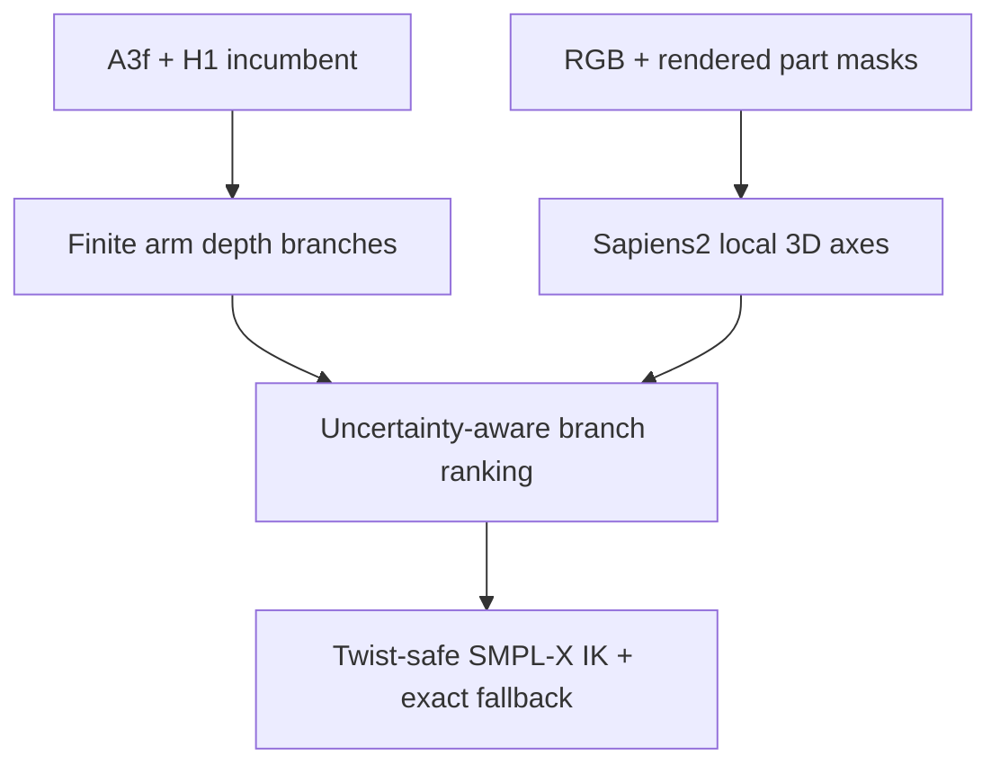

# SignRay-X: Deep-research decision and end-to-end implementation plan

**Ngày khóa thiết kế:** 2026-09-01  
**Trạng thái:** phương án nghiên cứu mới; chưa được phép gọi là SOTA trước khi vượt các kill-gate trong tài liệu này  
**Ràng buộc:** không marker, không trích xuất marker, không sửa evaluator chính thức, không huấn luyện bằng dataset lớn, không dùng temporal làm core

---

## 0. Kết luận điều hành

### Quyết định chính

Không tiếp tục cộng thêm HaMeR, TTA, SignHPoser veto, per-finger routing, silhouette fitting hay các expert tương tự. Dữ liệu thực nghiệm hiện tại cho thấy chiến lược đó đã đi vào vùng **diminishing returns**: pipeline phức tạp hơn nhiều nhưng mức cải thiện sau H1 chỉ còn khoảng $10^{-3}$–$10^{-2}$ mm ở phần lớn metric.

Pipeline nên được rút về:

1. **A3f/DexAvatar output** làm reconstruction incumbent.
2. **H1 canonical WiLoR finger refinement** làm hand incumbent vì đây là module duy nhất có hiệu ứng đủ rõ, ổn định ở cả sáu metric và có bootstrap CI âm.
3. Một hướng mới duy nhất, tạm gọi là **SignRay-X**, đánh trực tiếp vào ambiguity chiều sâu của upper limbs:
   - giữ nguyên pixel ray do chính incumbent tạo ra;
   - giữ nguyên bone length và shape;
   - sinh hữu hạn các nghiệm elbow/wrist theo hình học phối cảnh;
   - dùng **dense human pointmap** để chọn nghiệm 3D, không dùng thêm 2D keypoint detector;
   - chuyển nghiệm vào SMPL-X bằng analytic IK, bảo toàn twist và global wrist;
   - nếu bằng chứng không đủ mạnh thì trả về **exact incumbent**.
4. Một nhánh hand có upside cao nhưng phải qua oracle gate riêng: **palm/wrist orientation reconciliation** từ WiLoR + pointmap, phân bổ twist qua forearm/wrist mà không đổi vị trí wrist. Nhánh này không được ghép vào core trước khi chứng minh gain hand đáng kể.

### Phát hiện P0 phải sửa trước mọi claim

Kết quả hiện tại đang được tính trên **1,493 frames**, trong khi SGNify/DexAvatar công bố **2,872 central frames**. `DexAvatar/data/segment.json` có 57 đoạn:

- `sum(end - start + 1) = 2,929`;
- `sum(end - start) = 2,872`;
- `sum(len(range(start, end + 1, 2))) = 1,493` — đúng bằng protocol hiện tại;
- `sum(len(range(start, end, 2))) = 1,436`;
- parity còn lại cũng có 1,436 frames.

Như vậy 1,493-frame run tương ứng với half-rate sampling cộng thêm một endpoint trên mỗi sign; nó **không phải** protocol 2,872-frame được paper dùng. Không được so trực tiếp các số 1,493-frame với Table của DexAvatar. Việc đầu tiên là dựng manifest `range(start, end)` và assert đúng 2,872, không thay evaluator.

### Điều có thể và không thể bảo đảm

Không có phương pháp nghiên cứu hợp lệ nào có thể bảo đảm trước rằng sẽ tăng SOTA. Tài liệu này thay “lời hứa” bằng ba bảo đảm kỹ thuật:

- incumbent luôn có trong candidate set;
- mọi frame không đủ bằng chứng là exact fallback;
- một **diagnostic oracle ceiling** giá rẻ sẽ giết hypothesis trước khi tải checkpoint hoặc chạy full 2,872 frames nếu không có upside đủ lớn.

Đây là cách thực tế nhất để tránh lặp lại chuỗi module bị reject.

---

## 1. Audit thực nghiệm hiện tại

### 1.1 Kết quả đã được xác minh trên protocol 1,493 frames

| Method | All | UBody | UBody-F | UBody-H | LHand | RHand |
|---|---:|---:|---:|---:|---:|---:|
| A3f / C0 | 42.0936 | 25.8311 | 29.1458 | 39.6963 | 12.8466 | 12.1275 |
| H1 canonical WiLoR | 42.0696 | 25.8053 | 29.1131 | 39.6254 | 12.5219 | 11.9180 |
| H15-v2 EI-AMER | 42.0640 | 25.7991 | 29.1057 | 39.6121 | 12.5060 | 11.8431 |

H1 so với A3f:

- All: −0.0241 mm;
- UBody: −0.0258 mm;
- UBody-F: −0.0327 mm;
- UBody-H: −0.0709 mm;
- LHand: −0.3247 mm;
- RHand: −0.2096 mm.

Paired-sign bootstrap CI của H1 so với A3f âm ở cả sáu metric. Đây là module nên giữ.

H15-v2 so với H1:

- All: −0.0056 mm;
- UBody: −0.0062 mm;
- UBody-F: −0.0074 mm;
- UBody-H: −0.0133 mm;
- LHand: −0.0159 mm;
- RHand: −0.0749 mm.

Chỉ All và UBody-H có incremental CI loại trừ zero. Vì H15 được hình thành sau khi đã mở exploratory 45-sign set, gain nhỏ này không đủ để biện minh cho HaMeR expert, rescue logic và chi phí paper narrative. H15 nên giữ như một ablation/external comparison, không phải core.

### 1.2 Coverage H1 giải thích vì sao thêm expert không còn hiệu quả

Trên 1,493 frames:

- 756 frames có ít nhất một H1 accept;
- 991 hand-sides được accept;
- 737 frame fallbacks;
- 27 unavailable-expert và 710 no-consensus fallbacks.

Các lỗi còn lại có tính sign/side-coherent, không giống nhiễu frame ngẫu nhiên. Do đó thêm một expert gần giống WiLoR/HaMeR chỉ tăng coverage rất ít hoặc đổi một loại bias lấy một loại bias khác.

### 1.3 Những module phải bỏ khỏi method chính

| Module | Bằng chứng hiện tại | Quyết định |
|---|---|---|
| H1 canonical WiLoR finger-only | Gain hand rõ; sáu CI âm; exact fallback | **Giữ** |
| H15-v2 / EI-AMER / HaMeR rescue | Incremental gain rất nhỏ; 4/6 CI qua zero; exploratory | Bỏ khỏi core, giữ ablation |
| H2 TTA | Hand metrics xấu hơn | Bỏ |
| H3 per-joint/per-finger router | Tín hiệu yếu, không generalize | Bỏ |
| H4 HaMeR veto | Dùng expert sai vai trò, regress | Bỏ |
| H6 wrist unlock 3° | Chỉ RHand −0.009 mm, 5/6 metric xấu hơn | Bỏ; không suy diễn rằng full geometric wrist fusion cũng thất bại |
| H7/H7b compositional fingers | Dev gain nhỏ, untouched LHand regress | Bỏ |
| H8 SignHPoser veto | Untouched regress cả sáu metric | Bỏ |
| H12 radius 12° | RHand regress 0.0002 mm | Bỏ khỏi contribution |
| H13/H14 symmetric rescue | Hand gain nhưng All/UBody-H regress | Bỏ |
| C1 Sapiens heatmap | 0 accepts | Bỏ |
| C2 NLF 3D vectors | 0 accepts | Bỏ |
| C3 broad body refinement | Relax gate vẫn regress 5/6 | Bỏ |
| C4 segmentation/surface fit | Regress UBody và UBody-H | Bỏ |
| Hand4Whole++ full replacement | A1 catastrophic; khác distribution | Không dùng làm estimator thay thế |
| Temporal smoothing/prior | Clip sạch, ít blur/occlusion; không đánh đúng depth ambiguity | Không dùng làm core |

Mục tiêu không còn là “cứu thêm reject”. Mục tiêu mới là tìm một **error axis khác với H1**: upper-limb depth configuration dưới cùng một 2D projection.

### 1.4 Visual/file audit của output4 baseline

Sample output4 chứa 14 signs đã được kiểm tra theo frame và contact sheet. Ba kết luận trực tiếp:

- hình là frontal studio capture, signer/arms/hands đủ rõ ở phần lớn frames;
- không thấy motion blur, jitter hoặc self-occlusion nghiêm trọng là failure mode chi phối;
- frame IDs đúng kiểu stride-2 inclusive: ví dụ Ablehnen có 149,151,…,175; Akzeptieren có 124,126,…,184; Arzt có 166,168,…,206.

Điều này ủng hộ nhận định của người thực nghiệm rằng temporal smoothing khó tạo gain lớn. Tuy nhiên “ảnh rõ” chỉ làm 2D localization dễ hơn; nó không loại bỏ monocular bend-depth ambiguity. Hai elbow/wrist configurations có thể chiếu gần như cùng pixel nhưng khác TR-V2V đáng kể. Vì vậy SignRay-X dùng single-frame dense 3D evidence, không dùng temporal model.

---

## 2. Protocol SGNify: audit bắt buộc

### 2.1 Những gì nguồn sơ cấp nói

[SGNify](https://arxiv.org/abs/2304.10482) thu một native right-handed DGS signer bằng hệ 54-camera Vicon, đồng bộ frontal RGB 4112×3008 ở 60 fps; ảnh đánh giá được hạ xuống 514×300 ở 30 fps. Benchmark gồm 57 signs và 2,872 central frames. TR-V2V là translation-aligned vertex-to-vertex error trên các vùng mesh.

[DexAvatar](https://arxiv.org/abs/2512.21054) cũng báo cáo trên 57 signs / 2,872 frames. Vì vậy mọi main table phải dùng đúng count này.

### 2.2 Script manifest không được tùy biến

Tạo `scripts/00_build_manifest.py`:

```python
from __future__ import annotations

import argparse
import csv
import json
from pathlib import Path


def main() -> None:
    ap = argparse.ArgumentParser()
    ap.add_argument("--segments", type=Path, required=True)
    ap.add_argument("--images-root", type=Path, required=True)
    ap.add_argument("--out", type=Path, required=True)
    args = ap.parse_args()

    segments = json.loads(args.segments.read_text())
    assert len(segments) == 57, len(segments)

    rows = []
    for sign, bounds in segments.items():
        start, end = map(int, bounds)
        assert start < end, (sign, bounds)
        # SGNify/DexAvatar count is end-exclusive.
        for frame_id in range(start, end):
            path = args.images_root / sign / f"{frame_id:06d}.png"
            rows.append((sign, frame_id, str(path)))

    assert len(rows) == 2872, len(rows)
    assert len(set((s, f) for s, f, _ in rows)) == 2872

    args.out.parent.mkdir(parents=True, exist_ok=True)
    with args.out.open("w", newline="") as fp:
        writer = csv.writer(fp)
        writer.writerow(["sign", "frame_id", "image_path"])
        writer.writerows(rows)


if __name__ == "__main__":
    main()
```

Test bắt buộc:

```python
def test_protocol_counts(segments):
    assert sum(e - s for s, e in segments.values()) == 2872
    assert sum(len(range(s, e + 1, 2)) for s, e in segments.values()) == 1493
    assert sum(len(range(s, e, 2)) for s, e in segments.values()) == 1436
    assert sum(len(range(s + 1, e, 2)) for s, e in segments.values()) == 1436
```

### 2.3 Quy tắc split sau audit

- **Engineering12 hiện tại:** chỉ dùng để phát hiện cơ chế và oracle ceiling; đã bị mở nhiều lần nên không còn confirmatory.
- **Official parity-A:** `range(start, end, 2)`, 1,436 frames. Phần lớn đã gần với dữ liệu từng thấy; chỉ dùng development.
- **Missing parity-B:** `range(start + 1, end, 2)`, 1,436 frames. Chỉ mở một lần sau khi code/config/hash đã freeze.
- Parity-B vẫn là adjacent frames của cùng signer và cùng signs, nên không phải external generalization set. Bootstrap phải cluster theo sign và paper phải nêu limitation này.
- Main result cuối cùng: toàn bộ `range(start, end)`, đúng 2,872 frames.

---

## 3. Source-code diagnosis: tại sao hướng depth có cơ sở

### 3.1 DexAvatar chưa dùng effective 3D body evidence trong config release

Repo được audit tại commit:

```text
kaustesseract/DexAvatar @ a0dfd427f60f5811aadb35c8657b3856d47f56b5
```

Trong `dexavatar_fitting/cfg_files/fit_smplx_vposer_x.yaml`:

```yaml
data_weights: [1., 1., 1.]
data_3d_weights: [0., 0., 0.]
data_init_core_weights: [1200., 1200., 1200.]
data_init_noncore_weights: [1200., 1200., 1200.]
data_init_lhand_weights: [1200., 1200., 1200.]
data_init_rhand_weights: [1200., 1200., 1200.]
```

Trong `dexavatar_fitting/smplifyx/fitting.py`, code có xây dựng normalized HaMeR depth-difference term, nhưng nó được nhân với `data_3d_weight`; release config đặt weight bằng zero. HPoser path còn có body-pose temporal penalty với hệ số 2,000 và các initialization anchors rất lớn.

Kết luận đúng phạm vi: release fitting chủ yếu được giữ bởi 2D reprojection, initialization và learned priors; nó không có dense per-frame 3D upper-arm/forearm observation đang hoạt động. Clip sạch không giải quyết được front/back hoặc bend-depth ambiguity của monocular projection.

### 3.2 Tại sao C3/C4 thất bại nhưng SignRay-X có thể khác

C3/C4 đưa signal mới vào một continuous optimizer rộng:

- thay 2D target hoặc fit silhouette/surface;
- nhiều DOF có thể cùng giảm loss proxy;
- proxy loss không rank-equivalent với TR-V2V;
- optimization drift làm hỏng vùng vốn đã tốt.

SignRay-X không tối ưu toàn mesh. Nó chỉ xét một tập hữu hạn nghiệm có cùng incumbent rays và bone lengths. Pointmap không kéo mesh; pointmap chỉ **xếp hạng discrete depth branches**. Đây là khác biệt cơ chế, không chỉ là đổi threshold.

---

## 4. Literature review và quyết định transfer

### 4.1 Bảng nguồn sơ cấp

| Work | Insight có thể dùng | Điều không được claim | Quyết định |
|---|---|---|---|
| [SGNify, CVPR 2023](https://arxiv.org/abs/2304.10482) | Protocol, TR-V2V, sign-specific ambiguity | Không dùng mocap marker ở inference | Giữ evaluator bất biến |
| [DexAvatar, WACV 2026](https://arxiv.org/abs/2512.21054) | Strong sign prior baseline | Không coi release config là đã giải dense arm depth | Dùng A3f incumbent |
| [KITRO, CVPR 2024](https://arxiv.org/abs/2405.19833) / [code](https://github.com/MartaYang/KITRO) | Hai nghiệm bone direction từ 2D ray, parent depth và bone length; decision tree; closed-form rotation | Ray–sphere/two-root lifting **không mới** | Reuse/port MIT geometry with attribution; novelty phải nằm ở pointmap selection + invariants |
| [HybrIK, CVPR 2021](https://arxiv.org/abs/2011.14672), [HybrIK-X](https://arxiv.org/abs/2304.05690) / [code](https://github.com/jeffffffli/HybrIK) | Analytic swing + visual twist; SMPL-X support | Swing–twist decomposition **không mới** | Port minimal MIT SO(3) utility, không tải training data/checkpoint |
| [Ray3D, CVPR 2022](https://arxiv.org/abs/2203.11471) | Calibrated normalized rays giảm dependence vào intrinsics | Không claim ray representation | Dùng (K^{-1}[u,v,1]^T) |
| [KITRO source](https://github.com/MartaYang/KITRO/blob/master/lib/models/kitro.py) | Baseline source chọn branch gần original HMR | Không đủ để sửa incumbent sai-depth | Thay selector bằng dense pointmap evidence |
| [ScoreHypo, CVPR 2024](https://openaccess.thecvf.com/content/CVPR2024/html/Xu_ScoreHypo_Probabilistic_Human_Mesh_Estimation_with_Hypothesis_Scoring_CVPR_2024_paper.html) | Multiple hypotheses cần một scoring signal độc lập | Diffusion hypothesis network cần training/data lớn | Chỉ mượn nguyên lý hypothesis scoring |
| [Sapiens2, 2026](https://arxiv.org/abs/2604.21681) / [code](https://github.com/facebookresearch/sapiens2) | Human-centric per-pixel XYZ pointmap, 1K resolution | Không coi pointmap tuyệt đối luôn metric-perfect | Dùng local 3D directions, invariant với uniform scale/translation |
| [WiLoR, CVPR 2025](https://arxiv.org/abs/2409.12259) / [code](https://github.com/rolpotamias/WiLoR) | MANO articulation và camera-frame hand geometry mạnh | “Dùng WiLoR” không phải novelty | Giữ H1; chỉ dùng palm frame trong optional W branch |
| [Hand4Whole++, CVPR 2026](https://openaccess.thecvf.com/content/CVPR2026/html/Moon_Enhancing_Hands_in_3D_Whole-Body_Pose_Estimation_with_Conditional_Hands_CVPR_2026_paper.html) / [code](https://github.com/mks0601/Hand4Whole-plus-plus_RELEASE) | Hand features có thể condition body representation | Không thể transplant ControlNet post-hoc mà không train | Không đưa vào core |
| [Tamaththul3D, preprint 2026](https://arxiv.org/abs/2605.05367) | Geometric forearm alignment + WiLoR wrist orientation có potential hand gain lớn | Chưa tìm thấy public code; metric naming/protocol cần verify | Reproduce như external challenger; không coi là contribution |

### 4.2 Audit Hand4Whole++ ở mức source

Repo được đọc tại commit:

```text
mks0601/Hand4Whole-plus-plus_RELEASE @ f81d35ddd2b74206c40142243eb62b6d64ce0d65
```

`main/model.py` cho thấy:

- WiLoR hand features đi vào `HandControlNet`;
- left/right hand features cross-attend;
- zero-initialized convolutions inject hand features vào nhiều body ViT blocks;
- `self.trainable_modules = [self.hand_control_net]` trong training mode;
- training config dùng các tập như InterHand2.6M, ReInterHand, ARCTIC và AGORA.

Đây là learned feature coupling, không phải một fitting loss có thể gắn vào A3f. Dùng pretrained Hand4Whole++ làm full replacement cũng đã catastrophic trong A1. Vì ràng buộc storage/training, không nên clone để chạy core; chỉ cite trong related work và giải thích vì sao ta chọn training-free geometric coupling.

### 4.3 Audit Sapiens2 pointmap

Repo được đọc tại commit:

```text
facebookresearch/sapiens2 @ 7e5bae88456ac418ff0e58e74106c9fe192055d4
```

Source xác nhận:

- pointmap là $H\times W\times 3$ XYZ trong camera coordinates;
- checkpoint 0.4B có file khoảng 2.11 GB;
- input chính thức 1024×768;
- `PointmapGenerateTarget` nhân X/Y/Z cùng một scalar `canonical_focal_length / fx`;
- do đó local direction không đổi dưới canonical scaling;
- repo yêu cầu Python ≥3.12, PyTorch ≥2.7;
- license là Sapiens2 custom/proprietary license, phải kiểm tra điều khoản trước release.

Không cần checkpoint segmentation. Semantic ROI được render từ chính A3f SMPL-X part labels. Không lưu PLY/depth full-frame; chỉ cache vài axis/quality statistics mỗi frame.

### 4.4 Audit Tamaththul3D

Tamaththul3D báo cáo large hand gains khi ghép SMPLer-X, WiLoR, geometric forearm IK và 2D shoulder refinement. Tuy nhiên tại thời điểm khóa tài liệu:

- chưa tìm thấy public implementation để audit;
- paper gọi metric là PA-MPVPE trong khi các baseline values được trình bày giống các số TR-V2V đã công bố; cần author clarification;
- mô tả rotation conversion không đủ để xác minh toàn bộ SO(3) composition;
- exact 2,872-frame manifest/evaluator path chưa được thể hiện đủ để tái lập.

Vì upside báo cáo lớn, phải triển khai một reproduction quarantine. Nhưng nó là strongest external baseline, không phải novelty của SignRay-X.

---

## 5. Proposed method: SignRay-X

### 5.1 Problem formulation

Với frame $I_t$, camera intrinsic $K_t$, incumbent SMPL-X state

\[
\Theta_t^0 = (\beta,\theta_t^B,\theta_t^{W,L},\theta_t^{W,R},
\theta_t^{H,L},\theta_t^{H,R},\psi_t,c_t),
\]

H1 tạo incumbent hand state $\Theta_t^H$ bằng cách chỉ thay finger rotations đã được accept. SignRay-X tìm $\Theta_t^*$ trong một finite set $\mathcal C_t$ sao cho:

- shoulder/elbow/wrist projections giữ nguyên incumbent rays;
- upper-arm và forearm lengths giữ nguyên;
- shape, root, torso, face, camera giữ nguyên;
- finger local rotations giữ nguyên H1;
- core UBody branch giữ nguyên global wrist orientation;
- nếu không có candidate thắng với uncertainty margin thì $\Theta_t^*=\Theta_t^H$.

### 5.2 Architecture



Không có temporal edge, không có marker input, không có evaluator/GT path trong production inference.

### 5.3 Incumbent-ray branch generation

Cho pixel incumbent (x=[u,v,1]^T), unit camera ray:

\[
r = \frac{K^{-1}x}{\lVert K^{-1}x\rVert_2}.
\]

Biết parent point $P\in\mathbb R^3$ và bone length $L$, child nằm trên $C=dr$ và thỏa:

\[
\lVert dr-P\rVert_2^2=L^2.
\]

Nghiệm depth:

\[
d=r^TP\pm\sqrt{(r^TP)^2-(\lVert P\rVert_2^2-L^2)}.
\]

Mỗi elbow có tối đa hai nghiệm. Với từng elbow, wrist lại có tối đa hai nghiệm, nên mỗi arm có tối đa bốn configurations. Candidate baseline được thêm trực tiếp, không phụ thuộc numerical root matching.

```python
from __future__ import annotations

from dataclasses import dataclass
import numpy as np


@dataclass(frozen=True)
class RootResult:
    depths: tuple[float, ...]
    discriminant: float
    clamped: bool


def pixel_to_unit_ray(uv: np.ndarray, K: np.ndarray) -> np.ndarray:
    x = np.array([float(uv[0]), float(uv[1]), 1.0], dtype=np.float64)
    r = np.linalg.solve(K.astype(np.float64), x)
    n = np.linalg.norm(r)
    if not np.isfinite(n) or n < 1e-12:
        raise ValueError("degenerate camera ray")
    return r / n


def ray_sphere_roots(
    ray: np.ndarray,
    parent_cam: np.ndarray,
    bone_len: float,
    *,
    disc_eps: float = 1e-9,
    min_depth: float = 1e-4,
) -> RootResult:
    r = ray / np.linalg.norm(ray)
    P = np.asarray(parent_cam, dtype=np.float64)
    rp = float(r @ P)
    disc = rp * rp - (float(P @ P) - float(bone_len) ** 2)
    if disc < -disc_eps:
        return RootResult((), disc, False)
    clamped = disc < 0.0
    s = np.sqrt(max(disc, 0.0))
    roots = sorted({d for d in (rp - s, rp + s) if d > min_depth})
    return RootResult(tuple(float(d) for d in roots), disc, clamped)
```

Candidate enumeration:

```python
def enumerate_arm_branches(shoulder, elbow0, wrist0, uv_elbow, uv_wrist, K):
    L_upper = np.linalg.norm(elbow0 - shoulder)
    L_fore = np.linalg.norm(wrist0 - elbow0)
    r_e = pixel_to_unit_ray(uv_elbow, K)
    r_w = pixel_to_unit_ray(uv_wrist, K)

    candidates = [{
        "id": "incumbent",
        "elbow": elbow0.copy(),
        "wrist": wrist0.copy(),
        "is_incumbent": True,
    }]

    e_roots = ray_sphere_roots(r_e, shoulder, L_upper).depths
    for ei, de in enumerate(e_roots):
        elbow = de * r_e
        w_roots = ray_sphere_roots(r_w, elbow, L_fore).depths
        for wi, dw in enumerate(w_roots):
            wrist = dw * r_w
            if np.linalg.norm(elbow - elbow0) < 1e-5 and np.linalg.norm(wrist - wrist0) < 1e-5:
                continue
            candidates.append({
                "id": f"e{ei}_w{wi}",
                "elbow": elbow,
                "wrist": wrist,
                "is_incumbent": False,
            })
    return candidates
```

Hard filters trước pointmap scoring:

- positive camera depth;
- discriminant hợp lệ, chỉ clamp numerical negatives rất nhỏ;
- joint angles nằm trong frozen biomechanical ranges;
- elbow/wrist distance khỏi incumbent không vượt một physically plausible bound được đặt trước khi xem GT;
- không self-intersection nghiêm trọng với torso;
- branch phải decode lại được bằng SMPL-X với joint target error dưới tolerance.

### 5.4 Dense pointmap evidence, không full-surface fitting

#### Part masks

Render mesh incumbent bằng cùng camera để tạo bốn semantic masks mỗi frame:

- left/right upper arm;
- left/right forearm;
- optional left/right palm core.

Masks đến từ fixed SMPL-X vertex/face part mapping, không phải marker. Erode 2–3 pixels để tránh boundary/background. Bỏ hand pixels khỏi forearm ROI và bỏ clothing/background outliers bằng robust fit.

#### Robust local axis

Với pointmap points $p_i$ trong ROI, fit line bằng IRLS weighted TLS/PCA:

1. median center;
2. PCA axis $a$ theo largest eigenvector;
3. residual $r_i=\lVert(p_i-\mu)\times a\rVert$;
4. Tukey weights từ MAD;
5. lặp 3–5 lần;
6. orient sign của $a$ bằng correlation giữa PCA coordinate và 2D progress từ parent đến child.

```python
def robust_axis(points_xyz, pixels_uv, uv_parent, uv_child, iters=5):
    P = np.asarray(points_xyz, np.float64)
    U = np.asarray(pixels_uv, np.float64)
    if len(P) < 64:
        raise ValueError("too few pointmap pixels")

    w = np.ones(len(P), np.float64)
    axis = None
    center = None
    eigvals = None
    for _ in range(iters):
        w = w / max(w.sum(), 1e-12)
        center = (w[:, None] * P).sum(0)
        X = P - center
        cov = (w[:, None] * X).T @ X
        eigvals, eigvecs = np.linalg.eigh(cov)
        axis = eigvecs[:, -1]
        residual = np.linalg.norm(np.cross(X, axis[None]), axis=1)
        med = np.median(residual)
        mad = 1.4826 * np.median(np.abs(residual - med)) + 1e-9
        z = residual / (4.685 * mad)
        w = np.square(1.0 - np.square(z))
        w[z >= 1.0] = 0.0

    d2 = np.asarray(uv_child) - np.asarray(uv_parent)
    d2n = float(d2 @ d2)
    if d2n < 1e-8:
        raise ValueError("degenerate 2D bone")
    progress = ((U - np.asarray(uv_parent)) @ d2) / d2n
    coord3 = (P - center) @ axis
    if np.corrcoef(progress, coord3)[0, 1] < 0:
        axis = -axis

    lam1, lam2 = float(eigvals[-1]), float(eigvals[-2])
    gap = (lam1 - lam2) / max(lam1, 1e-12)
    return axis, {
        "n": int(len(P)),
        "eigen_gap": gap,
        "residual_mad": float(mad),
    }
```

Reliability $q_b\in[0,1]$ của bone $b$ được tạo từ:

- valid pixel count;
- eigenvalue gap;
- residual MAD;
- 4×4 block-bootstrap angular CI;
- consistency khi inference original và horizontal-flip-mapped-back hoặc hai resize policies.

Không calibrate $q_b$ bằng official GT. Threshold được khóa từ self-consistency/noise statistics.

### 5.5 Branch scoring và abstention

Với predicted pointmap axis $\hat a_b$ và candidate bone direction $\hat v_b(c)$:

\[
E_{pm}(c)=\sum_{b\in\{upper,forearm\}}q_b\,
\rho\!\left(\arccos(\operatorname{clip}(\hat a_b^T\hat v_b(c),-1,1))\right),
\]

trong đó $\rho$ là Huber-on-angle. Incumbent có score riêng $E_{pm}(c_0)$.

Accept non-incumbent candidate chỉ khi:

1. candidate có score tốt nhất;
2. bootstrap upper confidence bound của $E(c)-E(c_0)$ nhỏ hơn zero;
3. pointmap quality của cả upper arm và forearm đạt gate;
4. mọi structural invariant pass;
5. không có left/right identity ambiguity;
6. decoded mesh không làm thay đổi protected states.

Nếu bất kỳ điều kiện nào fail: exact H1 copy.

Không dùng một learned selector trên 57 signs. Với một signer và ít signs, selector học từ official labels sẽ overfit và không còn contribution sạch.

### 5.6 Twist-preserving analytic SMPL-X update

KITRO/HybrIK đã chứng minh cách dùng closed-form swing. Ta port minimal utility với attribution, nhưng thêm các invariants cho sign reconstruction.

Cho current global bone direction $v$ và target $v^*$, minimal swing $S(v\rightarrow v^*)\in SO(3)$. Nếu $G_p'$ là global rotation mới của parent và $R_j^0$ là local incumbent joint rotation:

\[
R_j'=(G_p')^T S G_p' R_j^0.
\]

Update shoulder trước, forward kinematics, rồi update elbow. Phép left-multiply bằng minimal swing giữ phần twist của incumbent thay vì tái ước lượng toàn rotation.

Core branch bảo toàn global wrist:

\[
R_w'=(G_{parent(w)}')^T G_w^0.
\]

Do đó finger local rotations H1 và global hand orientation không đổi dù upstream arm depth đổi.

Pseudo-code:

```python
def apply_arm_candidate(state_h1, side, target_elbow, target_wrist, smplx):
    out0 = smplx.forward_state(state_h1)
    G_wrist_0 = out0.global_rot[f"{side}_wrist"].clone()

    state = state_h1.clone()
    state = swing_joint_to_child_target(
        state, joint=f"{side}_shoulder", child=f"{side}_elbow",
        child_target_cam=target_elbow, smplx=smplx,
    )
    state = swing_joint_to_child_target(
        state, joint=f"{side}_elbow", child=f"{side}_wrist",
        child_target_cam=target_wrist, smplx=smplx,
    )

    fk = smplx.forward_state(state)
    G_parent = fk.global_rot[f"{side}_elbow"]
    state.local_rot[f"{side}_wrist"] = G_parent.T @ G_wrist_0
    return state
```

Phải dùng đúng SMPL-X hierarchy/index map của code hiện tại; không hard-code assumption rằng MANO và SMPL-X axis-angle conventions giống nhau.

### 5.7 Structural invariants

Mỗi candidate sau decode phải pass:

| Invariant | Suggested initial tolerance | Hành động nếu fail |
|---|---:|---|
| Shoulder unchanged | $10^{-5}$ m | Reject |
| Elbow/wrist target error | $5\times10^{-5}$ m | Reject |
| Incumbent elbow/wrist reprojection | 0.05 px | Reject |
| Upper/forearm length drift | $10^{-5}$ relative | Reject |
| Global wrist geodesic drift, core | 0.02° | Reject |
| Root-centered hand vertex RMS, core | 0.02 mm | Reject |
| Shape/camera/root/torso/face bytes | exact | Reject |
| Opposite arm/hand parameters | exact | Reject |
| Fallback artifact | hash-identical to H1 | Hard error |

Tolerance phải dựa trên float precision/unit tests, không tune bằng GT score.

---

## 6. Optional high-upside hand module: wrist/palm reconciliation

Phần này chỉ trở thành contribution nếu vượt Gate W0–W3. Nếu fail, paper vẫn có thể là upper-limb depth paper với H1 làm hand baseline.

### 6.1 Tại sao H6 không kết luận được nhánh này

H6 chỉ mở một residual wrist trust-region 3°. Nó không:

- xây target global palm frame đúng trong SO(3);
- thay đổi/redistribute forearm twist;
- dùng dense palm-plane evidence;
- giữ wrist position trên incumbent ray;
- so sánh một finite exact-incumbent candidate bank.

Do đó H6 reject không falsify geometric wrist integration kiểu Tamaththul3D.

### 6.2 Xây global wrist candidate đúng SO(3)

Từ WiLoR 3D joints, tạo right-handed palm frame $P_t^e=[x,y,z]$ trong camera coordinates. Từ neutral shared-beta SMPL-X hand, tạo palm frame $P^{x,0}$ trong wrist-local coordinates. Target global wrist rotation:

\[
G_w^e=P_t^e(P^{x,0})^T.
\]

Không trừ MANO mean trong axis-angle space. Mọi conversion phải là matrix composition trên $SO(3)$, sau cùng mới convert về axis-angle nếu state format yêu cầu.

### 6.3 Twist redistribution không đổi wrist position

Với forearm unit axis $a_f$ và desired delta $\Delta=G_w^e(G_w^0)^T$:

1. swing–twist decompose $\Delta=S\,T(a_f,\phi)$;
2. phân bổ một phần anatomically valid của twist $\phi$ vào elbow/forearm rotation quanh chính $a_f$; twist này không đổi wrist position;
3. đặt local wrist rotation để global wrist đạt chính xác $G_w^e$;
4. giữ H1 finger rotations;
5. reject nếu joint limits, pointmap palm plane hoặc hand invariants fail.

Candidate bank chỉ gồm:

- `W0`: exact H1 wrist;
- `W1`: WiLoR global palm target + forearm twist compensation.

Không thêm HaMeR. Không average rotations.

### 6.4 Pointmap palm score

Từ eroded palm-core ROI:

- robust plane normal (n_{pm}) bằng smallest-eigenvector PCA;
- in-plane distal axis từ wrist đến middle-MCP region;
- normal được dùng theo sign-invariant (|n_{pm}^Tn(c)|), vì visible surface có thể là palm hoặc dorsum;
- distal axis có sign từ 2D wrist→middle direction.

W1 chỉ accept khi plane + distal evidence đều thắng W0 với bootstrap margin. Chỉ chạy trước trên H1 accepted sides để tránh đưa một WiLoR orientation vào các side mà chính H1 consensus đã từ chối.

### 6.5 Reproduction Tamaththul3D phải tách biệt

Tạo bốn rows, cùng full protocol và evaluator:

1. H1;
2. published-equation-literal Tamaththul reproduction;
3. mathematically corrected SO(3) reproduction;
4. SignRay-X optional wrist module.

Nếu literal và corrected rows khác đáng kể, paper phải báo cả hai. Không được gọi Tamaththul result reproduced nếu không match exact published protocol.

---

## 7. Oracle-first experiment funnel

Đây là phần quan trọng nhất để không tốn nhiều tuần cho một module không có ceiling.

### 7.1 D0 — protocol and state integrity

Trước mọi experiment:

- manifest full count = 2,872;
- A3f/H1 can generate mọi frame;
- evaluator SHA-256 được ghi trước/sau và không đổi;
- production package không import evaluator hoặc mở GT paths;
- unit tests của ray roots, SO(3), fallback, wrist invariant pass.

Fail bất kỳ mục nào: dừng.

### 7.2 A0 — arm branch diagnostic oracle ceiling

Trên Engineering12:

1. generate finite arm candidates mà chưa chạy Sapiens2;
2. decode và invariant-filter;
3. dùng official GT/evaluator **chỉ để đo upper bound**, không để chọn production branch;
4. tính per-frame best candidate UBody-H/UBody-F;
5. aggregate và bootstrap theo sign.

Đây không phải marker extraction và không phải inference method. Oracle IDs/results phải nằm trong `diagnostics_gt_only/`; production CLI từ chối path này.

**Kill A0 nếu một trong các điều sau xảy ra:**

- oracle UBody-H gain < 0.30 mm;
- oracle UBody-F gain < 0.15 mm;
- < 65% signs có mean oracle improvement dương;
- phần lớn frames chỉ có incumbent branch hợp lệ;
- hand invariant thường xuyên fail.

Threshold cố ý lớn hơn nhiều so với H15 incremental gain để bù optimistic per-frame oracle.

Nếu A0 fail, không tải 2.11-GB pointmap checkpoint; kết luận depth branch space không phải bottleneck đủ lớn.

### 7.3 A1 — pointmap selector capture

Chỉ khi A0 pass:

- chạy Sapiens2 0.4B trên Engineering12;
- cache axes/quality;
- select branch hoàn toàn GT-free;
- so selector với diagnostic oracle sau khi selection đã hoàn tất.

Promote A1 nếu:

- selector capture ≥ 40% oracle gain;
- UBody-H actual gain ≥ 0.15 mm trên Engineering12;
- UBody-F actual gain ≥ 0.08 mm;
- không official metric nào regress > 0.02 mm;
- fallback/invariant violations = 0;
- gain không chỉ đến từ 1–2 signs.

Nếu A1 fail vì quality thấp: cho phép đúng một repair về ROI/robust statistics, không retune bằng per-frame GT. Nếu fail lần hai: bỏ module.

### 7.4 W0 — wrist candidate oracle ceiling

Trên H1 accepted sides của Engineering12:

- build W0/W1 states;
- official evaluator chỉ đo diagnostic best-of-two ceiling;
- báo LHand và RHand riêng.

Kill nếu:

- average of L/R oracle gain < 0.50 mm;
- một side regress ở sign majority;
- global wrist target thường vi phạm anatomy;
- gain chủ yếu do state conversion bug.

### 7.5 W1 — GT-free palm selector

Promote nếu:

- capture ≥ 40% wrist oracle gain;
- mean of L/R gain ≥ 0.25 mm trên Engineering12;
- mỗi hand không regress;
- All/UBody-H không regress > 0.02 mm;
- exact fallback audit pass.

### 7.6 Freeze và prospective parity-B

Sau A1/W1:

- khóa Git commit;
- khóa YAML + SHA-256;
- khóa checkpoint SHA;
- khóa masks/part map;
- khóa thresholds;
- tạo result-card template trước khi chạy;
- chỉ lúc đó mở 1,436 parity-B frames.

Reject module nếu parity-B:

- bất kỳ main metric nào regress với paired-sign CI có mass dương đáng kể;
- target gain nhỏ hơn 25% Engineering12 gain;
- failure tập trung có hệ thống theo sign/side.

Cuối cùng mới chạy full 2,872.

### 7.7 Paper-level promotion gate

Để tránh một paper có novelty nhưng effect size quá nhỏ, đề xuất yêu cầu tối thiểu trên full 2,872:

- new arm module: UBody-H ≤ H1 − 0.20 mm và UBody-F ≤ H1 − 0.10 mm;
- optional wrist module: mean(LHand,RHand) ≤ arm-only − 0.30 mm, không hand nào regress;
- All improvement ≥ 0.05 mm;
- six-metric paired-sign CIs không cho thấy regression;
- zero protected-state/fallback violations.

Nếu không đạt, module có thể là negative result/ablation nhưng không nên làm main contribution.

---

## 8. Repository layout

```text
signray_x/
├── configs/
│   ├── sgnify_full2872.yaml
│   ├── sgnify_engineering12.yaml
│   └── thresholds_frozen.yaml
├── scripts/
│   ├── 00_build_manifest.py
│   ├── 01_validate_incumbent.py
│   ├── 02_render_part_masks.py
│   ├── 03_generate_arm_bank.py
│   ├── 04_oracle_ceiling_diagnostic.py
│   ├── 05_export_pointmap_axes.py
│   ├── 06_select_and_fit.py
│   ├── 07_audit_states.py
│   ├── 08_run_official_eval.py
│   └── 09_bootstrap_by_sign.py
├── signray/
│   ├── io/
│   │   ├── manifest.py
│   │   ├── state.py
│   │   └── provenance.py
│   ├── geometry/
│   │   ├── camera.py
│   │   ├── ray_lift.py
│   │   └── so3.py
│   ├── pointmap/
│   │   ├── inference.py
│   │   ├── robust_axis.py
│   │   └── quality.py
│   ├── candidates/
│   │   ├── arm_bank.py
│   │   └── wrist_bank.py
│   ├── smplx/
│   │   ├── indices.py
│   │   ├── analytic_ik.py
│   │   └── part_renderer.py
│   ├── selectors/
│   │   └── pointmap_selector.py
│   └── audit/
│       ├── invariants.py
│       └── exact_fallback.py
├── tests/
│   ├── test_manifest.py
│   ├── test_ray_lift.py
│   ├── test_so3.py
│   ├── test_ik_targets.py
│   ├── test_wrist_invariant.py
│   ├── test_fallback_hash.py
│   └── test_no_gt_import.py
└── results/
    ├── diagnostics_gt_only/
    ├── development/
    └── frozen_full2872/
```

---

## 9. Environments, repos và storage-efficient setup

### 9.1 Pinned sources

```bash
mkdir -p research

git clone https://github.com/kaustesseract/DexAvatar.git research/DexAvatar
git -C research/DexAvatar checkout a0dfd427f60f5811aadb35c8657b3856d47f56b5

git clone https://github.com/MPForte/SGNify.git research/SGNify
git -C research/SGNify checkout bae2a71d8388df73af56117731f7f454e36e5b2e

git clone https://github.com/rolpotamias/WiLoR.git research/WiLoR
git -C research/WiLoR checkout fcb911312a38fa8badd30d9656a167485d61b8f9

git clone https://github.com/MartaYang/KITRO.git research/KITRO
git -C research/KITRO checkout 8b038353011727541d27dedef0942fc1662abbcb

git clone https://github.com/jeffffffli/HybrIK.git research/HybrIK
git -C research/HybrIK checkout c281eeeb3c0689a4d619a06ed0c4488e791eda76

git clone https://github.com/facebookresearch/sapiens2.git research/sapiens2
git -C research/sapiens2 checkout 7e5bae88456ac418ff0e58e74106c9fe192055d4
```

Hand4Whole++ chỉ cần nếu muốn reproduce A1/source audit; không cần trong core:

```bash
git clone https://github.com/mks0601/Hand4Whole-plus-plus_RELEASE.git research/Hand4Whole-plus-plus_RELEASE
git -C research/Hand4Whole-plus-plus_RELEASE checkout f81d35ddd2b74206c40142243eb62b6d64ce0d65
```

### 9.2 Hai môi trường tách biệt

Giữ nguyên DexAvatar/H1 environment để decode SMPL-X và evaluation. Tạo sidecar chỉ cho Sapiens2:

```bash
conda create -n signray-sapiens2 python=3.12 -y
conda activate signray-sapiens2
pip install "torch>=2.7" torchvision --index-url https://download.pytorch.org/whl/cu128
pip install -e research/sapiens2
```

Không cài `open3d`; custom exporter không ghi PLY.

### 9.3 Chỉ tải một checkpoint, không dataset

```bash
mkdir -p weights/sapiens2-pointmap-0.4b
hf download facebook/sapiens2-pointmap-0.4b \
  sapiens2_0.4b_pointmap.safetensors \
  --local-dir weights/sapiens2-pointmap-0.4b

sha256sum weights/sapiens2-pointmap-0.4b/sapiens2_0.4b_pointmap.safetensors \
  > weights/sapiens2-pointmap-0.4b/SHA256SUMS
```

Checkpoint khoảng 2.11 GB. Không tải InterHand, Human3.6M, 3DPW, AGORA, ARCTIC hay RenderPeople. Sau khi full axes cache đã được validate và hash, có thể xóa checkpoint rồi redownload theo hash khi cần reproducibility.

### 9.4 Cache tối thiểu

Mỗi frame chỉ lưu:

```json
{
  "frame_key": "Ablehnen/000149",
  "model_sha256": "...",
  "left_upper": {"axis": [0, 0, 0], "q": 0.0, "ci_deg": 0.0},
  "left_fore":  {"axis": [0, 0, 0], "q": 0.0, "ci_deg": 0.0},
  "right_upper": {"axis": [0, 0, 0], "q": 0.0, "ci_deg": 0.0},
  "right_fore":  {"axis": [0, 0, 0], "q": 0.0, "ci_deg": 0.0},
  "padding": [0, 0, 0, 0],
  "valid": true
}
```

Không cache full $H\times W\times3$ pointmap trừ 20-frame debug panel. Full 2,872 cache chỉ vài MB thay vì hàng chục GB.

---

## 10. Custom Sapiens2 axes exporter

Source inference chính thức làm:

```python
data = model.pipeline(dict(img=image))
data = model.data_preprocessor(data)
inputs, samples = data["inputs"], data["data_samples"]
with torch.no_grad():
    pointmap, scale = model(inputs)
    pointmap = pointmap / scale
```

Exporter của ta crop padding, resize pointmap về image resolution, trích points trong part masks, fit axes, rồi giải phóng full tensor.

```python
@torch.inference_mode()
def infer_axes(model, image_bgr, part_masks, device="cuda:0"):
    data = model.pipeline(dict(img=image_bgr))
    data = model.data_preprocessor(data)
    inputs = data["inputs"]
    samples = data["data_samples"]

    with torch.autocast(device_type="cuda", dtype=torch.bfloat16):
        pointmap, scale = model(inputs)
        pointmap = (pointmap / scale).float()

    pl, pr, pt, pb = samples["meta"]["padding_size"]
    pointmap = pointmap[:, :, pt:inputs.shape[2]-pb, pl:inputs.shape[3]-pr]
    pointmap = torch.nn.functional.interpolate(
        pointmap,
        size=image_bgr.shape[:2],
        mode="bilinear",
        align_corners=False,
    )[0].permute(1, 2, 0).cpu().numpy()

    out = {}
    for name, roi in part_masks.items():
        yy, xx = np.nonzero(roi)
        xyz = pointmap[yy, xx]
        valid = np.isfinite(xyz).all(1) & (xyz[:, 2] > 0)
        out[name] = fit_axis_with_block_bootstrap(
            xyz[valid], np.stack([xx[valid], yy[valid]], 1), name=name
        )
    del pointmap, inputs, data
    return out
```

Run batch size 1 trước. Nếu GPU không hỗ trợ bfloat16, dùng fp16 sau khi unit-test angular difference so với fp32 trên 20 frames. Không giảm 1024×768 trước khi đo ảnh hưởng, vì arm ROI của SGNify khá nhỏ trong frame 514×300.

---

## 11. Configuration schema

`configs/sgnify_full2872.yaml`:

```yaml
protocol:
  segments: research/DexAvatar/data/segment.json
  manifest: manifests/sgnify_full2872.csv
  expected_frames: 2872
  evaluator: path/to/evaluate_new_fitting.py
  evaluator_sha256: TO_FILL_AND_FREEZE

incumbent:
  body: A3f
  hands: H1
  exact_fallback: true

pointmap:
  repo_commit: 7e5bae88456ac418ff0e58e74106c9fe192055d4
  model: sapiens2_0.4b_pointmap
  checkpoint_sha256: TO_FILL_AND_FREEZE
  input_hw: [1024, 768]
  batch_size: 1
  dtype: bfloat16
  save_full_pointmap: false

roi:
  erode_px: 3
  min_pixels: 64
  bootstrap_blocks: [4, 4]
  bootstrap_reps: 256

branches:
  include_incumbent: true
  max_per_arm: 4
  discriminant_eps: 1.0e-9
  min_camera_depth_m: 1.0e-4

selector:
  loss: huber_angle
  confidence: 0.95
  require_upper_and_forearm: true
  no_gt_calibration: true

invariants:
  reprojection_px: 0.05
  joint_target_m: 5.0e-5
  bone_relative: 1.0e-5
  wrist_global_deg: 0.02
  centered_hand_rms_mm: 0.02
  protected_arrays_exact: true

optional_wrist:
  enabled: false
  h1_accepted_only: true
  candidates: [incumbent, wilor_palm_so3]
```

Mọi result card phải embed toàn bộ resolved config và hashes.

---

## 12. Commands theo đúng thứ tự

### 12.1 Protocol and incumbent

```bash
python scripts/00_build_manifest.py \
  --segments research/DexAvatar/data/segment.json \
  --images-root data/sgnify/images \
  --out manifests/sgnify_full2872.csv

python scripts/01_validate_incumbent.py \
  --manifest manifests/sgnify_full2872.csv \
  --a3f outputs/a3f \
  --h1 outputs/h1 \
  --require 2872
```

Nếu chưa có H1 trên full 2,872, chạy chính H1 frozen config trước; không chạy H15.

### 12.2 Render masks and arm bank

```bash
python scripts/02_render_part_masks.py \
  --manifest manifests/engineering12.csv \
  --states outputs/h1 \
  --out cache/part_masks_engineering12 \
  --parts upper_arm forearm palm_core

python scripts/03_generate_arm_bank.py \
  --manifest manifests/engineering12.csv \
  --states outputs/h1 \
  --out candidates/arm_engineering12 \
  --audit-invariants
```

### 12.3 Oracle ceiling — diagnostic only

```bash
python scripts/04_oracle_ceiling_diagnostic.py \
  --candidate-bank candidates/arm_engineering12 \
  --official-evaluator path/to/evaluate_new_fitting.py \
  --out results/diagnostics_gt_only/arm_A0
```

Đọc `gate.json`. Nếu `promote=false`, dừng project branch này.

### 12.4 Pointmap axes

```bash
conda run -n signray-sapiens2 python scripts/05_export_pointmap_axes.py \
  --manifest manifests/engineering12.csv \
  --masks cache/part_masks_engineering12 \
  --checkpoint weights/sapiens2-pointmap-0.4b/sapiens2_0.4b_pointmap.safetensors \
  --out cache/pointmap_axes_engineering12
```

### 12.5 Select, fit, audit, evaluate

```bash
python scripts/06_select_and_fit.py \
  --config configs/sgnify_engineering12.yaml \
  --candidate-bank candidates/arm_engineering12 \
  --pointmap-axes cache/pointmap_axes_engineering12 \
  --out outputs/signray_arm_engineering12

python scripts/07_audit_states.py \
  --incumbent outputs/h1 \
  --candidate outputs/signray_arm_engineering12 \
  --decisions outputs/signray_arm_engineering12/decisions.jsonl \
  --fail-on-first-violation

python scripts/08_run_official_eval.py \
  --evaluator path/to/evaluate_new_fitting.py \
  --pred outputs/signray_arm_engineering12 \
  --out results/development/signray_arm_engineering12

python scripts/09_bootstrap_by_sign.py \
  --baseline results/development/h1/per_frame.csv \
  --candidate results/development/signray_arm_engineering12/per_frame.csv \
  --cluster sign \
  --reps 10000
```

Không có command nào trong production nhận `--gt`, `--marker`, `--mocap` hay per-frame official error.

---

## 13. Unit and integration tests

### 13.1 Geometry tests

- random synthetic parent/ray/length: mọi returned child thỏa sphere và ray;
- known tangent: một unique root;
- negative discriminant lớn: no candidate;
- tiny negative discriminant: clamp và flag;
- positive depth only;
- project incumbent joints rồi lift: incumbent root match trong tolerance.

### 13.2 SO(3) tests

- `R.T @ R = I`, `det(R)=1`;
- parallel vectors → identity swing;
- anti-parallel vectors dùng deterministic orthogonal axis;
- random swing maps source unit vector đến target;
- matrix→axis-angle→matrix round trip;
- không subtract/average axis-angle trực tiếp.

### 13.3 SMPL-X integration tests

- shoulder update đạt elbow target;
- elbow update đạt wrist target;
- global wrist compensation drift < 0.02°;
- H1 finger locals exact;
- beta/camera/root/torso/face exact;
- opposite side exact;
- rejected frame output hash bằng H1.

### 13.4 Leakage test

`test_no_gt_import.py` quét production package:

```python
FORBIDDEN = ("evaluate_new_fitting", "ground_truth", "mocap", "marker")

def test_production_has_no_evaluator_or_gt_imports():
    text = "\n".join(p.read_text(errors="ignore") for p in PROD_PY_FILES)
    for token in FORBIDDEN:
        assert token not in text
```

Diagnostic scripts nằm ngoài import graph production và được đánh dấu `GT_ONLY_DO_NOT_SHIP`.

---

## 14. Evaluation and statistics

### 14.1 Evaluator contract

- Không sửa `evaluate_new_fitting.py`.
- Ghi SHA-256 trước và sau.
- Candidate outputs dùng cùng topology, vertex order, unit và naming với A3f/H1.
- Mọi aggregate phải tái tạo được từ per-frame CSV.
- Chạy một audited independent aggregator chỉ để verify rounding; main number vẫn từ official evaluator.

### 14.2 Report đủ sáu metric

Luôn báo:

- All;
- UBody;
- UBody-F;
- UBody-H;
- LHand;
- RHand.

Không chỉ chọn metric được cải thiện. Với arm module, UBody-H và UBody-F là primary; All và hands là protected outcomes.

### 14.3 Statistical unit

Frames trong cùng sign không độc lập. Dùng paired cluster bootstrap trên 57 signs, 10,000 replicates. Báo:

- mean delta;
- 95% percentile CI;
- sign win/tie/loss count;
- accepted frames/sides;
- fallback rate;
- selector-to-oracle capture chỉ ở diagnostic appendix;
- per-sign forest plot.

Không chạy frame-wise t-test.

### 14.4 Ablation tối thiểu, không tạo module zoo

| Row | H1 | Incumbent rays | Pointmap branch rank | Wrist invariant | Optional palm |
|---|---:|---:|---:|---:|---:|
| A3f |  |  |  |  |  |
| H1 | ✓ |  |  |  |  |
| KITRO-style closest-incumbent selector | ✓ | ✓ |  |  |  |
| SignRay-X arm | ✓ | ✓ | ✓ | ✓ |  |
| SignRay-X full, only if W gates pass | ✓ | ✓ | ✓ | variant | ✓ |

Thêm Tamaththul reproduction trong external-comparison table, không trộn vào ablation như module của ta.

---

## 15. Failure analysis cần log ngay từ đầu

Mỗi reject ghi đúng một primary reason:

```text
NO_ALTERNATE_ROOT
NEGATIVE_DISCRIMINANT
ANATOMY_FAIL
POINTMAP_TOO_FEW_PIXELS
POINTMAP_LOW_EIGENGAP
POINTMAP_WIDE_CI
INCUMBENT_NOT_BEATEN
IK_TARGET_FAIL
WRIST_INVARIANT_FAIL
HAND_SHAPE_DRIFT
PROTECTED_STATE_DRIFT
```

Các plot bắt buộc:

- oracle gain vs number of valid branches;
- selector energy margin vs official delta, diagnostic only;
- pointmap eigen-gap/CI vs selector correctness;
- accepted/rejected by sign and side;
- arm depth displacement histogram;
- global wrist drift histogram;
- centered hand RMS audit;
- qualitative front/back branch cases.

Nếu accepted errors có sign coherence, sửa signal/model; không chỉ siết threshold đến khi aggregate đẹp.

---

## 16. Paper feasibility và contributions có thể bảo vệ

### 16.1 Working title

**SignRay-X: Dense Pointmap-Guided Depth Disambiguation for Reprojection-Preserving 3D Sign Reconstruction**

Tên chỉ là working title; cần kiểm tra collision lần cuối trước submission.

### 16.2 Contributions — chỉ claim nếu experiment tương ứng pass

1. **Dense pointmap-guided selection of projection-equivalent upper-limb hypotheses.** Ta không claim ray–sphere lifting. Contribution là dùng human-centric per-pixel 3D geometry để phân giải các discrete depth branches của một strong sign incumbent mà không đổi 2D evidence.
2. **Reprojection-, twist-, and wrist-preserving SMPL-X transfer.** Một analytic state update sửa shoulder/elbow depth trong khi giữ bone length, incumbent twist, global wrist orientation và canonical hand articulation, kèm exact structural fallback.
3. **Training-free selective reconstruction under limited data/storage.** Method không train trên InterHand/AMASS/3DPW; chỉ cần frozen 0.4B pointmap checkpoint, cache nhỏ và uncertainty-derived abstention.
4. **Optional palm-orientation reconciliation**, chỉ nếu W0–W3 pass: proper SO(3) WiLoR→SMPL-X palm transfer và forearm/wrist twist redistribution được chọn bởi dense palm geometry.
5. **Protocol audit**, là reproducibility contribution phụ: chỉ ra và sửa khác biệt 1,493 vs 2,872 frames, công bố manifests/hashes/result cards. Không nên bán nó như primary algorithmic novelty.

H1 canonical hand fitting có thể được mô tả như system component đã được chứng minh, nhưng không nên nói “dùng WiLoR” là novelty vì Tamaththul3D/Hand4Whole++ đã dùng WiLoR.

### 16.3 Khác biệt với closest prior art

#### So với KITRO

KITRO dùng external 2D keypoints để xây two-root kinematic tree và chọn hypothesis gần original HMR direction, rồi blend/update toàn body. SignRay-X:

- dùng chính incumbent projections, nên giữ 2D rays thay vì fit một detector mới;
- chỉ sửa upper limbs;
- chọn branch bằng dense 3D pointmap evidence, không bằng proximity về prediction cũ;
- giữ global wrist và H1 hand articulation;
- có exact incumbent abstention và artifact-level invariants.

#### So với Tamaththul3D

Tamaththul3D hướng tới align forearm với WiLoR wrist và 2D-refine shoulder. SignRay-X arm core giữ global wrist bất biến, enumerate projection-equivalent depth configurations, và dùng dense pointmap axes để chọn. Optional wrist module dùng proper palm-frame SO(3) + pointmap palm evidence, không phải direct 2D shoulder optimization.

#### So với Hand4Whole++

Hand4Whole++ học conditional hand-to-body feature injection bằng large training data. SignRay-X là post-reconstruction, analytic, no-training, có thể áp dụng lên frozen A3f/H1 states.

### 16.4 Claim không được viết

- “We introduce the first ray-based kinematic refinement.” — sai vì KITRO/Ray3D và prior geometry.
- “We introduce swing–twist IK.” — sai vì HybrIK.
- “We are the first to use WiLoR for sign reconstruction.” — không an toàn vì Tamaththul3D.
- “Guaranteed SOTA.” — không khoa học.
- “Full SGNify result” nếu vẫn chỉ chạy 1,493 frames.
- “No temporal information” như một contribution; đây chỉ là design choice phù hợp data.
- “Marker-free” nếu diagnostic oracle bị đưa vào production selection.

### 16.5 Có đủ viết paper không?

**Có điều kiện.** Paper có thể đủ mạnh nếu:

- protocol 2,872 được sửa;
- arm oracle cho thấy ceiling lớn;
- GT-free pointmap selector thu được một phần đáng kể ceiling;
- new arm gain vượt rõ H1/H15, không còn mức 0.00xx mm;
- invariants và prospective parity-B đều pass;
- nếu optional wrist pass, paper có cả UBody và hand contributions, mạnh hơn đáng kể.

Nếu chỉ H1 + pointmap module đạt <0.1 mm UBody-H, contribution vẫn hợp lý về cơ chế nhưng effect size khó thuyết phục main-track. Khi đó nên dừng thay vì tiếp tục thêm modules.

---

## 17. Recommended execution schedule

| Phase | Work | Compute/storage | Stop condition |
|---|---|---|---|
| P0 | Full-2872 manifest + rerun A3f/H1 | Không dataset mới | Count/hash mismatch |
| A0 | Finite arm bank + diagnostic oracle | Chỉ SMPL-X/evaluator | Oracle below gate |
| A1 | Sapiens2 on Engineering12 | 2.11-GB checkpoint | Selector capture below gate |
| W0/W1 | Wrist bank + palm selector | Reuse same pointmap | Hand ceiling/selector below gate |
| Freeze | Config/code/hash/result template | Nhỏ | Any unresolved invariant |
| P-B | One-shot missing parity | 1,436 frames | Regression/gain collapse |
| Full | 2,872 final evaluation | Existing caches | Protocol/audit fail |
| Paper | Main table/ablation/limitations | — | Effect size below paper gate |

Không bắt đầu bằng full Sapiens2 inference. A0 là experiment đầu tiên vì rẻ và falsifiable.

---

## 18. Final recommendation

Hướng có xác suất tạo contribution thực sự cao nhất không phải thêm expert hand thứ ba. Đó là:

1. sửa protocol về đúng 2,872 frames;
2. giữ A3f + H1;
3. kiểm tra finite upper-limb depth oracle;
4. nếu ceiling đủ lớn, dùng Sapiens2 pointmap để chọn projection-equivalent branch;
5. bảo toàn global wrist để không làm hỏng hand gains;
6. chỉ sau đó thử proper SO(3) wrist/palm reconciliation như một module hand riêng;
7. loại H15/HaMeR và toàn bộ low-gain modules khỏi paper core.

Điểm mạnh của kế hoạch này là mỗi module có một causal target khác nhau và một ceiling test riêng. Nếu nó thất bại, ta biết sớm liệu lỗi nằm ở candidate space hay selector; nếu nó thành công, contribution không còn là một tổ hợp expert với gain 0.00xx mm mà là một phương pháp giải depth ambiguity có giới hạn hình học rõ ràng, có independent dense 3D evidence và có safety contract ở mức SMPL-X state.

---

## References and audited source snapshots

1. Forte et al., [Reconstructing Signing Avatars From Video Using Linguistic Priors](https://arxiv.org/abs/2304.10482), CVPR 2023.
2. Kundu et al., [DexAvatar: 3D Sign Language Reconstruction with Hand and Body Pose Priors](https://arxiv.org/abs/2512.21054), WACV 2026; [official code](https://github.com/kaustesseract/DexAvatar).
3. Yang et al., [KITRO: Refining Human Mesh by 2D Clues and Kinematic-tree Rotation](https://arxiv.org/abs/2405.19833), CVPR 2024; [official code](https://github.com/MartaYang/KITRO).
4. Li et al., [HybrIK](https://arxiv.org/abs/2011.14672), CVPR 2021; [HybrIK-X](https://arxiv.org/abs/2304.05690); [official code](https://github.com/jeffffffli/HybrIK).
5. Zhan et al., [Ray3D](https://arxiv.org/abs/2203.11471), CVPR 2022.
6. Xu et al., [ScoreHypo](https://openaccess.thecvf.com/content/CVPR2024/html/Xu_ScoreHypo_Probabilistic_Human_Mesh_Estimation_with_Hypothesis_Scoring_CVPR_2024_paper.html), CVPR 2024.
7. Khirodkar et al., [Sapiens2](https://arxiv.org/abs/2604.21681), 2026; [official code](https://github.com/facebookresearch/sapiens2); [0.4B pointmap model](https://huggingface.co/facebook/sapiens2-pointmap-0.4b).
8. Potamias et al., [WiLoR](https://arxiv.org/abs/2409.12259), CVPR 2025; [official code](https://github.com/rolpotamias/WiLoR).
9. Moon et al., [Enhancing Hands in 3D Whole-Body Pose Estimation with Conditional Hands Modulator](https://openaccess.thecvf.com/content/CVPR2026/html/Moon_Enhancing_Hands_in_3D_Whole-Body_Pose_Estimation_with_Conditional_Hands_CVPR_2026_paper.html), CVPR 2026; [official code](https://github.com/mks0601/Hand4Whole-plus-plus_RELEASE).
10. Alghamdi et al., [Tamaththul3D](https://arxiv.org/abs/2605.05367), preprint 2026.
