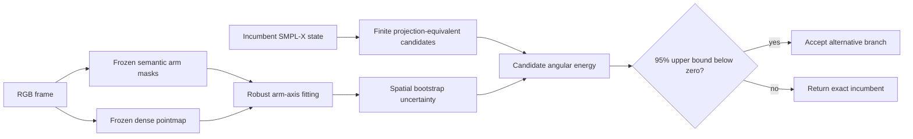

# Zero-SGNify-Training Audit of Finite-Branch Arm Refinement

## Status

This document records a leakage-controlled, descriptive evaluation on the requested 1,493-frame SGNify subset. It supersedes all claims based on a benefit classifier trained on 12 SGNify signs.

The conclusion is negative: neither the frozen NLF consensus selector nor the Sapiens2 pointmap selector passes the frozen primary criterion. NLF makes no accepted intervention. Pointmap accepts 63 arm-side changes, improves several aggregate surface metrics slightly, but worsens the primary UBody-H metric and has a sign-bootstrap confidence interval spanning zero. Neither component should be presented as the main paper contribution in its current form.

Because SGNify results had already been inspected earlier in the project, this run is descriptive rather than a pristine confirmatory test. No further method choice or threshold tuning may use these 1,493 targets. A new sealed dataset is required for confirmatory development.

## Leakage boundary

The inference path starts from raw framewise A3F SMPL-X states and uses frozen pretrained estimators only. It does not use SignHPoser, SignBPoser, SGNify meshes, SGNify metrics, sign identity, official region indices, or any SGNify-derived labels to train or tune the selector.

Inference and evaluation are process-separated:

1. The inference configurations expose no ground-truth or evaluator paths.
2. Both inference executables reject configurations containing `gt_root`, `protocol_lock`, or `author_assets`.
3. Predictions are written and hash-locked before the evaluator is launched.
4. Ground truth is first read by the separate evaluator after the lock.

The selector has zero fitted parameters. Fixed confidence constants are mathematical 95% reference values, not quantities estimated from SGNify.

## Tested method

### Projection-equivalent finite hypotheses

For each arm, the method keeps the incumbent SMPL-X state as an explicit fallback and analytically enumerates alternative shoulder, elbow, and wrist depths that preserve the incumbent image rays and bone lengths. Each accepted geometric branch is converted back to valid SMPL-X joint rotations. The global wrist frame is preserved, and a branch is rejected if centered hand-surface displacement caused by SMPL-X linear-blend-skinning exceeds the pre-evaluation 0.5 mm safety bound.

The stricter 0.02 mm initial hand-surface tolerance proposed in the implementation blueprint was not viable: although IK, reprojection, bone-length, and wrist-frame invariants passed, only 19 of 2,986 arm sides retained an alternative. The 0.5 mm bound was selected from this model-internal feasibility audit without reading SGNify ground truth. Under that bound, 31.58% of arm sides retained at least one alternative.

### Frozen NLF consensus

The first selector compares every candidate with the parametric and non-parametric outputs of a frozen NLF checkpoint. A non-incumbent branch is accepted only when the two outputs independently prefer the same branch, every changed bone improves, their directions agree within propagated 95% angular uncertainty, the branch lies inside both uncertainty intervals, and the uncertainty-normalized residual reduction exceeds the relevant 95% chi-square threshold. Failure of any test returns the incumbent exactly.

### Frozen Sapiens2 pointmap evidence

The second selector implements the core observation path proposed in `SignRay_X_Deep_Research_Implementation_v4.md`:

- a frozen Sapiens2 semantic model extracts image-aligned left/right upper-arm and forearm masks;
- a frozen Sapiens2 pointmap predicts a 3D point for each image pixel;
- robust IRLS line fitting estimates a directed 3D axis for each visible arm segment;
- a spatial 4-by-4 block bootstrap with 256 replicates estimates axis uncertainty;
- candidate arm axes are ranked with reliability-weighted Huber angular loss; and
- a non-incumbent is accepted only if the 95th percentile of its bootstrap energy difference relative to the incumbent is below zero.

The semantic masks replace incumbent-mesh rendering because an eight-frame visual audit showed that the stored A3F camera/state did not align rendered masks with the RGB image. This repair is inference-only and does not use SGNify ground truth.

## Coverage and locked decisions

| Item | Result |
|---|---:|
| Requested inference frames | 1,493 / 1,493 |
| Semantic observation files | 1,493 / 1,493 |
| Pointmap arm parts valid | 5,937 / 5,972 (99.414%) |
| Pointmap-selected non-incumbent frames | 61 / 1,493 (4.086%) |
| Pointmap-selected non-incumbent arm sides | 63 / 2,986 |
| Incumbent preferred directly | 2,822 sides |
| Abstained: alternative not better at 95% confidence | 78 sides |
| Abstained: pointmap evidence invalid | 23 sides |
| Trained selector parameters | 0 |

The NLF consensus selector selected zero non-incumbent frames and therefore reproduced the raw A3F incumbent exactly, apart from negligible serialization-level floating-point noise.

## Evaluation on 1,493 frames

All values are centered vertex errors in millimetres. Gain is baseline minus selected, so positive is better.

| Metric | Raw A3F | Pointmap selection | Gain |
|---|---:|---:|---:|
| All | 42.0938 | 42.0516 | +0.0422 |
| UBody | 25.8313 | 25.7779 | +0.0533 |
| UBody-F | 29.1467 | 29.0978 | +0.0489 |
| UBody-H | 39.6963 | 39.7283 | **−0.0320** |
| LHand | 12.8467 | 12.8468 | −0.0002 |
| RHand | 12.1276 | 12.1295 | −0.0019 |

For UBody-H, the mean sign-macro gain is −0.0167 mm. The paired bootstrap over 57 signs, with 100,000 replicates and seed 20260902, gives a 95% gain interval of [−0.3303, +0.2558] mm. The frozen success criterion required a UBody-H gain of at least 0.15 mm and a confidence interval strictly above zero. The result therefore fails.

The mixed metric direction is also scientifically important. The selected branches reduce average surface error over All, UBody, and UBody-F, but not over the primary upper-body-minus-head region. This indicates that pointmap arm-axis agreement is not a reliable surrogate for the desired reconstruction metric on this benchmark.

## Decision

1. Drop NLF from the proposed main method: its clean conservative selector is a complete no-op.
2. Do not claim the current pointmap selector as an effective reconstruction contribution: it fails the frozen primary endpoint.
3. Do not tune pointmap thresholds, losses, candidate rules, or semantic masks against this 1,493-frame result.
4. Preserve finite projection-equivalent hypothesis generation only as a validated geometric mechanism, not as a demonstrated accuracy contribution.
5. Any next selector must be designed and fixed using non-SGNify data, synthetic perturbations with known latent geometry, or a newly sealed development dataset, followed by one evaluation on a separate untouched test set.

## Reproducibility artifacts

| Artifact | SHA-256 |
|---|---|
| 1,493-frame manifest | `ef54791decc8ff8df44277173c24b834848ffe64c822fe5cf7011b42749eea78` |
| Pointmap inference configuration | `204c7cf55760359946b2edd38f7c68344d7cd05a5f41974879c23b16485abaa2` |
| Semantic export summary | `b81efb901ffca67a57f3c0f7e4ab0abfbd12b3228cd47f3751b211dbebc74999` |
| Sapiens2 segmentation checkpoint | `b85fdb50b7d6123a967d5ee4a505e222baff8d2f7ad6bbf353578c1a61dfbac9` |
| Sapiens2 pointmap checkpoint | `0f512898e1fcadc8c4343caa6a491f6b45664871f71546c13f2fc9fd2acf21c9` |
| Pointmap evidence run | `3d505c005b6668dbd4410c9de1cd43e09bfd47b3b08caf0805ec20a3d4b46a38` |
| Locked selector run | `884bf1b4da87680c3f89207d1f8624a1e15d27cda5de1aece527d44a14ed1c9d` |
| Aggregate hash of 1,493 prediction files | `0040664d9a81d3f9f9fc045dc9e166f34ce4ff759271c03d3f34d0bd59774ec3` |
| Evaluation report | `b8b1dbc0985f18cfc1e2f76c3ad12cd5474a1dca535927a0301e490cf9983420` |

Primary artifacts:

- `SignDART-NLF/runs/signray_pointmap_axes_seg_full1493/run.json`
- `SignDART-NLF/runs/signray_pointmap_selection_seg_full1493/run.json`
- `SignDART-NLF/reports/signray_pointmap_full1493/evaluation.json`
- `SignDART-NLF/configs/signray_pointmap_inference_full1493_lbs_safe.yaml`
- `SignDART-NLF/configs/signray_pointmap_evaluation_full1493.yaml`
