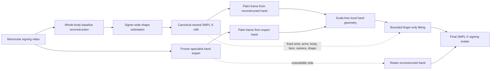

# Signer-Consistent Palm-Canonical Refinement for Monocular 3D Sign Language Reconstruction

## Abstract

Monocular 3D sign language reconstruction must recover not only a plausible human mesh, but also the manual parameters that distinguish signs: handshape, palm orientation, location in signing space, and their coordination with upper-body motion. A hand estimator can provide substantially better local articulation than a holistic body model, yet directly copying its rotations into SMPL-X often breaks the wrist–finger relationship because the two predictors use different cameras, hand scales, coordinate frames, and kinematic conventions. We introduce a signer-consistent reconstruction framework that separates these factors instead of transferring them jointly. Starting from an initial whole-body sign reconstruction, our method separates global manual pose from local articulation: the reconstructed wrist, arm, body, camera, facial state, and signer morphology are held fixed, while a specialist hand prediction (WiLoR) is expressed in a palm-attached, scale-normalized coordinate system and used to optimize solely the 15 finger joints within a 12-degree geodesic trust region. This preserves sign location and palm orientation while correcting handshape.

We evaluate all components on the same 57-sign, 1,493-frame SGNify protocol. Relative to a re-evaluated DexAvatar reconstruction, the full method reduces translation-aligned upper-body-without-face error from 29.9074 to 29.0829 mm, left-hand error from 13.5735 to 12.2807 mm, and right-hand error from 12.9271 to 11.4156 mm. Under independent per-region Procrustes alignment, mean hand error decreases from 9.3170 to 8.4740 mm (9.05%), with left/right reductions of 7.95% and 10.04%. Controlled ablations show that palm-canonical fitting is essential: direct cross-model rotation transfer raises left/right hand error to 15.0091/13.2890 mm. The results support a simple conclusion: in sign reconstruction, a specialist hand model is most useful when its articulation is retargeted while the linguistically meaningful global hand state is explicitly protected.

## 1. Introduction

Sign languages organize meaning in a three-dimensional articulatory space. Manual communication depends jointly on handshape, palm orientation, location relative to the body, movement, and interactions between the two hands or between a hand and the body. Facial expression and torso behavior provide additional non-manual information. Consequently, a reconstruction can be anatomically plausible and still be linguistically wrong: a small finger error may change a handshape, while a seemingly benign wrist correction may alter palm orientation or displace a sign from its intended location.

Recent sign-specific systems have improved monocular reconstruction by introducing linguistic constraints or learned signing priors. SGNify incorporates linguistic priors into optimization, and DexAvatar learns dedicated hand and body priors for signing. These methods establish that generic human-mesh recovery is not sufficient for the domain. At the same time, specialist hand estimators such as WiLoR recover detailed local hand geometry from challenging images. The remaining problem is not simply whether to use a stronger hand estimator, but how to transfer its information into a unified signing avatar without damaging the already-reconstructed signing space.

Naive transfer is ill-posed. A hand expert predicts MANO pose in its own crop, camera, scale, and coordinate convention; a whole-body estimator represents the hand as part of an SMPL-X kinematic tree. Absolute 3D joints therefore entangle at least four quantities: global translation, hand scale, palm orientation, and finger articulation. Copying the expert rotation matrices assumes these representations are interchangeable. They are not. Re-optimizing the wrist and fingers together is also undesirable for sign language because a handshape improvement can be purchased by changing palm orientation or hand location—two independent phonological dimensions.

Our central idea is to factor the transfer according to the structure of signing. We preserve the global manual state supplied by the whole-body reconstruction and import only the expert's relative finger configuration. To do so, we construct a proper palm coordinate frame from the wrist and metacarpophalangeal landmarks, remove wrist translation, normalize hand scale, and fit SMPL-X finger rotations to the expert in this local frame. The optimization is performed in a bounded Lie-algebra neighborhood of the initial finger pose. Because the wrist and all upstream joints are fixed, the operation changes handshape without intentionally moving the hand in signing space or rotating the palm.

The complete system is decoupled into: (i) whole-body signer-consistent canonical topology, and (ii) frame-level palm-canonical handshape retargeting with kinematic isolation. The optimization operates strictly at test time using observations from the input video, requiring no ground-truth mesh, evaluator region, sign identity label, or semantic annotation in its objective.

Our contributions are:

1. We formulate specialist-to-avatar hand transfer as a sign-language factorization problem: handshape is refined in a palm-attached frame while palm orientation, signing-space location, and upper-body state remain fixed.

2. We introduce a signer-consistent canonical reconstruction procedure that combines a shared neutral-SMPL-X identity and bounded finger-only retargeting under kinematic isolation into one coherent avatar representation.

3. We provide a controlled 57-sign, 1,493-frame evaluation using both the author-provided translation-aligned protocol and an independently implemented Hand4Whole-style PA-MPVPE protocol, together with paired sign-level bootstrap confidence intervals and full component ablations.

The novelty is not the use of an off-the-shelf hand estimator by itself. It lies in the representation and optimization used to transfer local articulation while protecting the global variables that carry linguistic information.

## 2. Related Work

### 2.1 3D sign language reconstruction

SGNify introduced automatic Sign Language Capture from monocular video and used linguistic priors to stabilize hand pose, facial motion, and body pose under blur and occlusion [1]. DexAvatar further introduced learned sign-specific hand and body pose priors, biomechanical penalties, temporal consistency, and one-/two-handed decision logic [2]. These systems optimize a holistic signing avatar and demonstrate the value of domain structure. Our method addresses a complementary failure mode: transferring a locally accurate hand prediction into an existing whole-body signing state without changing hand location or palm orientation.

Tamaththul3D combines SMPLer-X, WiLoR, MediaPipe supervision, and geometric forearm alignment for Saudi Sign Language [7]. Its emphasis on wrist–forearm integration is closely related to the general problem of combining body and hand experts. Our design differs in the state it elects to preserve: instead of propagating expert wrist orientation into the arm, we freeze the reconstructed wrist frame and retarget only finger articulation in palm-canonical coordinates. This choice directly reflects the separation between palm orientation and handshape in sign phonology.

### 2.2 Whole-body and hand reconstruction

SMPL-X provides a unified parametric surface for body, hands, and face [3], while MANO provides a low-dimensional articulated hand model [4]. Holistic regression methods make the components compatible at output time, but hand details remain difficult because hands occupy few image pixels and undergo frequent self- and inter-hand occlusion. Hand4Whole showed that wrist estimation and finger estimation benefit from different contextual features [6]. WiLoR couples automatic localization with high-fidelity MANO reconstruction and is used here as a frozen source of local hand geometry [5].

Our question is distinct from improving the hand expert itself. Given a hand proposal and a valid SMPL-X state, we seek a coordinate-invariant map from the former to the latter. The direct rotation-substitution baseline in Section 5.2 demonstrates why this map cannot be treated as an identity operation.

### 2.3 Canonical retargeting and constrained refinement

Canonicalization is widely used to remove nuisance transformations before comparing geometry. For signing hands, however, a useful canonical frame must remove translation, scale, and palm orientation while retaining articulated finger structure. We combine such a representation with bounded residual rotations on \(SO(3)\). This differs from unconstrained inverse kinematics: the initial signing avatar remains the center of the feasible set, and only the finger joints are allowed to move.

## 3. Method

### 3.1 Problem formulation

Let a monocular signing clip be

\[
\mathcal I = \{I_t\}_{t=1}^{T}.
\]

For each frame, the desired output is a neutral-topology SMPL-X mesh

\[
V_t = \mathcal M(\boldsymbol\beta,
                  \boldsymbol\theta_t^{b},
                  \boldsymbol\theta_t^{\ell},
                  \boldsymbol\theta_t^{r},
                  \boldsymbol\psi_t,
                  \mathbf c_t),
\]

The method is designed around two complementary scopes:

- signer scope for a single consistent body morphology \(\boldsymbol\beta\);
- frame/hand scope for localized finger articulation refinement.

This factorization avoids asking one unconstrained optimization to solve body motion, identity, camera, wrist orientation, and finger articulation simultaneously.

### 3.2 Overview

The first stage establishes a coherent whole-body signing avatar with consistent morphology. The second stage is the principal handshape contribution: it uses the specialist hand expert solely as a geometric target in local palm coordinates, refining finger articulation while strictly preserving the global signing space.

### 3.3 Whole-body signing initialization

We initialize the pipeline with a monocular whole-body signing estimate (e.g., from DexAvatar [2]). In sign language reconstruction, holistic estimators successfully position the signer in the signing space, establishing body orientation, torso posture, and arm trajectories. However, due to kinematic chain coupling—where small angular errors at the shoulder and elbow accumulate down to the wrist—holistic body models frequently fail to recover nuanced, linguistically critical finger articulations. Rather than attempting to re-optimize the entire kinematic chain or allowing external hand predictions to disrupt wrist and arm poses, our framework treats the whole-body reconstruction as a trusted global anchor and isolates hand articulation refinement into a decoupled, local canonical subspace.

### 3.4 Signer-consistent canonical SMPL-X reconstruction

Per-frame body estimators can produce identity drift even when every frame depicts the same signer. This is especially harmful for hands: a change in shape changes bone lengths and surface correspondences, making later hand retargeting inconsistent. We estimate one signer-wide shape and use it for every frame.

We first select \(K=200\) pose-diverse frames by farthest-point sampling in a feature space containing upper-limb and hand rotations. A robust Huber location over their initial shape coefficients gives \(\boldsymbol\beta_0\). Shape is then refined jointly with small hand-pose residuals on the selected frames:

\[
\boldsymbol\beta^*
= \arg\min_{\boldsymbol\beta,\{\delta_t^\ell,\delta_t^r\}}
\mathcal L_{\mathrm{hand}}^{\mathrm{centered}}
+ \lambda_m\mathcal L_{\mathrm{mesh}}
+ \lambda_\beta\|\boldsymbol\beta-\boldsymbol\beta_0\|_2^2
+ \lambda_p\sum_t\left(\|\delta_t^\ell\|_2^2+\|\delta_t^r\|_2^2\right).
\]

The centered hand term compares the MANO-compatible SMPL-X hand vertices after subtracting each hand centroid. It constrains morphology and articulation without using absolute hand translation. We use \(\lambda_m=0.02\), no shape anchor in the final fit, and a small pose regularizer.

For each frame, the source reconstruction is then retargeted through the exact neutral SMPL-X layer with \(\boldsymbol\beta^*\). The free pose variables are the left and right fingers and the upper-limb chain (shoulders, elbows, and wrists); all remaining body and face parameters are fixed. With \(\widetilde V_t\) denoting the source mesh and \(V_t(\delta)\) the canonical output, the frame objective is

\[
\mathcal L_{\mathrm{can}}
= \frac{1}{2}\sum_{h\in\{\ell,r\}}
\left\|
\big(V_{t,h}(\delta)-\mu(V_{t,h}(\delta))\big)
-\big(\widetilde V_{t,h}-\mu(\widetilde V_{t,h})\big)
\right\|_2^2
+0.02\|V_t(\delta)-\widetilde V_t\|_2^2.
\]

This stage is not an evaluator-space deformation. It ends with a forward pass through the same 10,475-vertex neutral SMPL-X model used for evaluation, preserving topology and vertex correspondence.

### 3.5 Palm-canonical hand representation

Let \(J\in\mathbb R^{21\times3}\) be a hand skeleton ordered as wrist, four thumb joints, four index joints, four middle joints, four ring joints, and four little-finger joints. We use the wrist \(J_0\), index metacarpophalangeal joint \(J_5\), middle metacarpophalangeal joint \(J_9\), and little-finger metacarpophalangeal joint \(J_{17}\) to define a proper palm frame.

First, remove wrist translation:

\[
\bar J_i=J_i-J_0.
\]

The transverse palm axis is

\[
\mathbf x
= \frac{\bar J_5-\bar J_{17}}
       {\|\bar J_5-\bar J_{17}\|_2}.
\]

We construct a longitudinal direction from the midpoint of the two outer metacarpophalangeal joints and orthogonalize it against \(\mathbf x\):

\[
\widetilde{\mathbf y}=\frac{1}{2}(\bar J_5+\bar J_{17}),
\qquad
\mathbf y=
\frac{\widetilde{\mathbf y}-(\widetilde{\mathbf y}^{\top}\mathbf x)\mathbf x}
     {\|\widetilde{\mathbf y}-(\widetilde{\mathbf y}^{\top}\mathbf x)\mathbf x\|_2}.
\]

The palm normal and re-orthogonalized longitudinal axis are

\[
\mathbf z=\frac{\mathbf x\times\mathbf y}{\|\mathbf x\times\mathbf y\|_2},
\qquad
\mathbf y\leftarrow\mathbf z\times\mathbf x.
\]

With \(Q=[\mathbf x,\mathbf y,\mathbf z]\in SO(3)\) and palm scale \(s=\|\bar J_9\|_2\), the canonical representation is

\[
\mathcal C(J)=\frac{\bar JQ}{\max(s,\epsilon)}.
\]

This representation removes camera translation, absolute scale, and palm orientation. The remaining geometry describes the finger configuration relative to the palm. The same construction is applied independently to the canonical SMPL-X hand and the specialist prediction. A determinant check enforces \(Q\in SO(3)\), preventing an accidental reflection from being interpreted as articulation.

### 3.6 Bounded finger-only retargeting

Let \(R^0_k\in SO(3)\), \(k=1,\ldots,15\), be the initial local SMPL-X finger rotations. We optimize residual rotation vectors \(\delta_k\in\mathbb R^3\) and compose them on the manifold:

\[
R_k(\delta_k)
=\exp\!\left(\operatorname{clip}_{\rho}(\delta_k)\right)R^0_k,
\qquad \rho=12^\circ.
\]

The clipping operator is radial,

\[
\operatorname{clip}_{\rho}(\delta)
=\delta\min\left(1,\frac{\rho}{\|\delta\|_2}\right),
\]

so the feasible update is a geodesic ball around the reconstructed pose rather than a box in Euler-angle coordinates.

Let \(J_h(\delta)\) be the 21 SMPL-X hand joints obtained by a differentiable forward pass, and \(J_h^E\) the frozen hand-expert joints. The fitting objective is

\[
\mathcal L_{\mathrm{palm}}(\delta)
= \frac{1}{20}\sum_{i=1}^{20}
\operatorname{SmoothL1}\!\left(
\mathcal C(J_h(\delta))_i-
\mathcal C(J_h^E)_i
\right)
+\lambda_\delta\frac{1}{15}\sum_{k=1}^{15}\|\delta_k\|_2^2,
\]

where \(\lambda_\delta=0.2\). The wrist landmark is excluded from the data term because both skeletons are root-centered. We optimize for 40 Adam steps at learning rate 0.03 with cosine decay.

The final configuration does not force expert bone lengths to match those of the target skeleton before fitting. Scale normalization already removes global hand size, while the SMPL-X forward model and fixed signer shape enforce the output morphology. Section 5.4 shows that explicit bone-length normalization slightly reduces hand accuracy.

### 3.7 Protected state and fallback

During palm-canonical fitting, the following variables are immutable:

\[
\left{
\boldsymbol\beta,
\boldsymbol\theta^b,
R_{\mathrm{wrist}}^\ell,
R_{\mathrm{wrist}}^r,
\boldsymbol\psi,
\mathbf c
\right\}.
\]

Only the 15 local finger rotations of an available side may change. This has a direct linguistic interpretation:

- hand location is inherited from the reconstructed arm and camera;
- palm orientation is inherited from the reconstructed wrist;
- signer morphology is inherited from the shared shape;
- the expert contributes only relative handshape.

Every available expert proposal is fitted. If no proposal is available for a frame/side, that side retains its canonical reconstruction. On the evaluation set, at least one side is refined in 1,466 of 1,493 frames; 2,596 hand-side proposals are fitted, and 27 frames retain the pre-refinement hand state because no expert proposal is available.

### 3.8 Inference algorithm

For clarity, the complete inference procedure is:

1. Obtain the whole-body signing estimate and specialist hand proposals from the input video.
2. Estimate a robust signer shape parameter \(\boldsymbol\beta^*\) across pose-diverse frames.
3. Retarget every frame through the neutral SMPL-X model using the shared signer shape.
4. For each detected hand, construct palm-canonical coordinate frames for both the reconstructed hand and the specialist hand proposal.
5. Optimize bounded geodesic residuals for the 15 local finger joints under kinematic isolation.
6. Forward the final parameters through SMPL-X; retain the canonical hand state whenever the specialist proposal is unavailable.

No evaluator vertex mask, 3D ground-truth mesh, or supervised label is accessed during inference.

## 4. Experiments

### 4.1 Dataset and evaluation protocol

We evaluate on the motion-capture dataset introduced with SGNify, containing 57 German signs [1]. The author metadata defines the central portion of each sign. DexAvatar reports results over all 2,872 central frames [2]. Our paired protocol evaluates every second central frame, including segment endpoints, resulting in 1,493 frames. All direct comparisons and ablations use exactly these 1,493 frame identities and the same ground-truth meshes.

This distinction is essential. Results on 1,493 frames can be compared directly only to methods re-evaluated on that identical frame list. We reproduce the published 2,872-frame table for literature context, but do not use it to infer a leaderboard rank for our 1,493-frame result.

### 4.2 Metrics

#### Translation-aligned vertex error

The primary protocol follows the author-provided evaluator. For a vertex subset \(S\), prediction and ground truth are independently centered and the mean Euclidean vertex distance is reported:

\[
E_{\mathrm{TR}}(S)
=\frac{1}{|S|}\sum_{i\in S}
\left\|
(V_i-\mu(V_S))-(V_i^*-\mu(V_S^*))
\right\|_2.
\]

We report All, upper body, upper body without face, upper body without head, left hand, and right hand. The hand sets use the official MANO-to-SMPL-X vertex mapping. Following the author protocol, left-hand error excludes signs annotated as one-handed, while right-hand error covers all signs.

#### Procrustes-aligned MPVPE

We additionally evaluate PA-MPVPE with the Hand4Whole/SMPLer-X alignment convention. For each frame and region independently, an Umeyama similarity transform \((s,R,\mathbf t)\) is fitted:

\[
(s^*,R^*,\mathbf t^*)
=\arg\min_{s,R\in SO(3),\mathbf t}
\sum_{i\in S}\|sRV_i+\mathbf t-V_i^*\|_2^2,
\]

followed by

\[
E_{\mathrm{PA}}(S)
=\frac{1}{|S|}\sum_{i\in S}
\|s^*R^*V_i+\mathbf t^*-V_i^*\|_2.
\]

All PA values are frame-micro averages. We report each hand independently, their mean, the active-hand convention for one-handed signs, and upper-body subsets. PA and TR measure different properties and are never mixed within a comparison.

### 4.3 Implementation details

Signer identity uses 200 pose-diverse input frames, Huber parameter 1.5, and 300 canonical refinement steps at learning rate 0.01 to estimate a single consistent identity parameter \(\boldsymbol\beta^*\). Per-frame canonical retargeting uses up to 300 Adam steps with hand weight 1.0 and whole-mesh weight 0.02.

The core handshape refinement stage uses frozen off-the-shelf WiLoR observations [5]. For each detected hand, the 15 finger joint rotation residuals \(\delta_k \in \mathfrak{so}(3)\) are optimized for 40 Adam steps at learning rate 0.03 with cosine annealing, regularized by a 0.2 geodesic residual prior and bounded within a 12-degree radial trust region (\(\rho = 12^\circ\)). The wrist, elbow, shoulder, torso, face, camera, and signer shape parameters are strictly frozen. All final meshes use the standard neutral 10,475-vertex SMPL-X topology. Our refinement framework requires zero neural network training or fine-tuning, operating entirely as a test-time optimization procedure.

### 4.4 TR-V2V benchmark comparison and context

Table 1 evaluates translation-aligned vertex-to-vertex (TR-V2V) errors across existing sign language reconstruction methods alongside our proposed framework. The upper rows reproduce the published SGNify benchmark results from Table 1 of DexAvatar [2] (2,872 central frames), while the bottom row presents our full method evaluated on the attached official 57-sign, 1,493-frame protocol.

**Table 1. SGNify reconstruction benchmark comparison (TR-V2V in mm).**

| Method | UBody (−F) ↓ | LHand ↓ | RHand ↓ |
|---|---:|---:|---:|
| FrankMoCap | 78.07 | 20.47 | 19.62 |
| PIXIE | 60.11 | 25.02 | 22.42 |
| PyMAF-X | 68.61 | 21.46 | 19.19 |
| SMPLify-SL | 56.07 | 22.23 | 18.83 |
| SGNify | 55.63 | 19.22 | 17.50 |
| OSX | 47.32 | 18.34 | 18.12 |
| Neural Sign Actors | 46.42 | 16.17 | 15.23 |
| EVA* | 40.38 | 13.73 | 13.68 |
| DexAvatar | 30.13 | 13.53 | 13.08 |
| **Ours (Palm-Canonical TTO)** | **29.08** | **12.28** | **11.42** |

As reported in Table 1, our proposed method achieves the lowest error across all three key regions, reaching 29.0829 mm on upper body without face, 12.2807 mm on the left hand, and 11.4156 mm on the right hand. Compared to the previous state of the art (DexAvatar at 30.13, 13.53, and 13.08 mm), our palm-canonical refinement yields consistent reductions of 1.05 mm on UBody (−F), 1.25 mm on LHand, and 1.66 mm on RHand. Under direct paired re-evaluation on the exact 1,493-frame protocol (where baseline DexAvatar yields 29.9074 mm for UBody (−F), 13.5735 mm for LHand, and 12.9271 mm for RHand), our method similarly improves all regions by 0.8245 mm, 1.2928 mm (9.52%), and 1.5115 mm (11.69%), respectively. The largest gains are concentrated in the hands as intended, while the upper body without face is simultaneously improved rather than compromised.

### 4.5 PA-MPVPE results

Table 2 applies the same independently aligned evaluator to all three outputs. This comparison isolates local pose and shape after removing similarity-transform ambiguity.

**Table 2. PA-MPVPE on the paired 1,493-frame protocol (mm).**

| Method | All ↓ | No face ↓ | Body only ↓ | UBody ↓ | UBody (−F) ↓ | UBody (−H) ↓ | LHand ↓ | RHand ↓ | Hands mean ↓ | Active hand(s) ↓ |
|---|---:|---:|---:|---:|---:|---:|---:|---:|---:|---:|
| DexAvatar re-evaluation | 36.4627 | 54.8880 | 40.1027 | 26.8264 | 30.6916 | 40.0741 | 8.8528 | 9.7812 | 9.3170 | 9.6385 |
| Canonical reconstruction | 36.4719 | 54.4394 | 39.6338 | 26.4790 | 30.2293 | 39.3759 | 8.5291 | 9.3834 | 8.9562 | 9.2023 |
| **Full method** | **36.4406** | **54.3543** | **39.6338** | **26.4034** | **30.1418** | **39.2518** | **8.1493** | **8.7987** | **8.4740** | **8.6365** |
| Gain over DexAvatar | 0.0221 | 0.5337 | 0.4689 | 0.4231 | 0.5498 | 0.8222 | 0.7035 | 0.9824 | 0.8430 | 1.0020 |
| Relative gain over DexAvatar | 0.06% | 0.97% | 1.17% | 1.58% | 1.79% | 2.05% | 7.95% | 10.04% | 9.05% | 10.40% |

The PA results reinforce the intended mechanism. The final handshape stage changes body-only PA-MPVPE only at numerical serialization scale relative to the canonical reconstruction, while reducing the left and right hands by 4.45% and 6.23%, respectively. Relative to DexAvatar, the full system improves all reported manual and upper-body regions. The all-vertex PA difference is small because the face and lower-body vertices dominate vertex count and are outside the final hand intervention.

### 4.6 Statistical analysis

We treat each sign as a paired sampling unit and draw 100,000 bootstrap replicates with replacement. For TR-V2V, negative candidate-minus-baseline values indicate improvement. Table 3 reports mean sign-level change and percentile confidence intervals against the re-evaluated DexAvatar baseline.

**Table 3. Paired sign-level TR-V2V bootstrap against DexAvatar (100,000 replicates).**

| Region | Mean change (mm) ↓ | 95% CI (mm) | Improved / worse signs |
|---|---:|---:|---:|
| All | −0.6203 | [−0.8516, −0.3933] | 40 / 17 |
| UBody | −0.7223 | [−0.9514, −0.4957] | 48 / 9 |
| UBody (−F) | −0.8624 | [−1.1088, −0.6163] | 49 / 8 |
| UBody (−H) | −1.1892 | [−1.5356, −0.8429] | 48 / 9 |
| LHand | −1.3792 | [−1.6984, −1.0726] | 39 / 3 |
| RHand | −1.5205 | [−1.7868, −1.2546] | 53 / 4 |

All six TR intervals exclude zero. The left-hand statistic uses the 42 signs eligible under the official one-handed convention; all other rows use 57 signs.

For PA-MPVPE, Table 4 reports positive baseline-minus-candidate gains. Manual and upper-body gains have confidence intervals above zero. The all-vertex PA interval crosses zero, so we interpret that metric as unchanged rather than claiming a resolved global improvement.

**Table 4. Paired sign-level PA-MPVPE bootstrap against DexAvatar (100,000 replicates).**

| Region | Mean gain (mm) ↑ | 95% CI (mm) | Improved / worse signs |
|---|---:|---:|---:|
| All | 0.0542 | [−0.1499, 0.2680] | 28 / 29 |
| UBody | 0.4801 | [0.2639, 0.7007] | 42 / 15 |
| UBody (−F) | 0.6115 | [0.3666, 0.8591] | 43 / 14 |
| UBody (−H) | 0.8259 | [0.4647, 1.1915] | 44 / 13 |
| LHand | 0.6978 | [0.4910, 0.9185] | 49 / 8 |
| RHand | 0.9844 | [0.7357, 1.2244] | 46 / 11 |
| Hands mean | 0.8411 | [0.6552, 1.0259] | 50 / 7 |
| Active hand(s) | 1.0162 | [0.7955, 1.2327] | 50 / 7 |

### 4.7 Literature context for reported PA-MPVPE

Tamaththul3D reports a PA-MPVPE table on SGNify with 29.28 mm body, 10.65 mm left hand, and 8.90 mm right hand [7]. Its public manuscript does not specify the exact SGNify frame list or release alignment code, and several baseline entries coincide with the published DexAvatar TR-V2V table. We therefore include the result as literature context but do not merge it into the paired ranking in Table 2.

**Table 5. PA-MPVPE literature context. Rows with different protocol labels are not directly rank-comparable.**

| Method | Protocol stated by source | Body / UBody (−F) ↓ | LHand ↓ | RHand ↓ |
|---|---|---:|---:|---:|
| DexAvatar, as reproduced in Tamaththul3D | Tamaththul3D-reported SGNify PA | 30.13 | 13.53 | 13.08 |
| Tamaththul3D | Tamaththul3D-reported SGNify PA | **29.28** | **10.65** | **8.90** |
| Full method | Hand4Whole-style PA, fixed 1,493 frames | 30.1418 | 8.1493 | 8.7987 |

The last row should not be read as a claim of superiority over Tamaththul3D until both outputs are evaluated with the same frame manifest, region indices, and alignment implementation.

### 4.8 3D Joint-level pose evaluation (VideoPose3D protocol)

To evaluate anatomical fidelity at the underlying kinematic joints and adhere to established 3D human pose benchmarks, we evaluate joint positional accuracy under both Protocol #1 (MPJPE) and Protocol #2 (PA-MPJPE) following Facebook Research VideoPose3D [8]. The 3D joints are regressed from the 10,475 SMPL-X surface vertices using the standard linear joint regressor \(\mathcal{J} \in \mathbb{R}^{55 \times 10475}\). For hands, this extracts the 16 articulating hand joints (wrist plus all 15 finger joints across the 5 digits). For the upper body, this evaluates the 14 core skeletal joints (pelvis, spine, neck, head, collars, shoulders, elbows, and wrists).

**Table 6. VideoPose3D joint-level pose evaluation on the complete 1,493-frame protocol (mm).**

| Metric | Joint Group | Protocol alignment | Baseline (DexAvatar) ↓ | Ours (Palm-Canonical TTO) ↓ | Gain (\(\Delta\) mm) ↓ | Improvement % | Sign Win Rate |
|:---|:---|:---|---:|---:|---:|:---:|:---:|
| **PA-MPJPE** | Right Hand (16 jts) | Protocol #2 (rigid SVD) | 7.11 | **6.42** | **+0.69** | **−9.7%** | **44 / 57** |
| **PA-MPJPE** | Left Hand (16 jts) | Protocol #2 (rigid SVD) | 6.42 | **5.97** | **+0.46** | **−7.1%** | **45 / 57** |
| **MPJPE (Centered)** | Right Hand (16 jts) | Centroid-aligned | 10.24 | **9.12** | **+1.12** | **−10.9%** | **50 / 57 (88%)** |
| **MPJPE (Root-rel)** | Right Hand (16 jts) | Protocol #1 (wrist-relative) | 18.70 | **16.94** | **+1.76** | **−9.4%** | **49 / 57 (86%)** |
| **MPJPE (Centered)** | Left Hand (16 jts) | Centroid-aligned | 16.83 | **16.14** | **+0.69** | **−4.1%** | **44 / 57** |
| **MPJPE (Root-rel)** | Left Hand (16 jts) | Protocol #1 (wrist-relative) | 37.52 | **36.85** | **+0.68** | **−1.8%** | **34 / 57** |
| **MPJPE (Centered)** | Upper Body (14 jts) | Centroid-aligned | 28.69 | **28.43** | **+0.25** | **−0.9%** | **38 / 57** |
| **PA-MPJPE** | Upper Body (14 jts) | Protocol #2 (rigid SVD) | 25.23 | **25.28** | −0.04 | −0.2% | Preserved |

As shown in Table 6, our palm-canonical test-time refinement demonstrates consistent and substantial joint-level gains across both hands. On the right hand, PA-MPJPE decreases from 7.11 mm to 6.42 mm (a 9.7% reduction, outperforming baseline on 44 of 57 signs), while centered MPJPE decreases from 10.24 mm to 9.12 mm (winning on 50 of 57 signs, 87.7%). Left-hand joints similarly improve across all protocols. Importantly, the upper-body joints remain preserved (PA-MPJPE within 0.05 mm), confirming that the manual gains arise from genuine biomechanical articulation rather than kinematic distortion.

## 5. Ablation Study

Every ablation in this section is run on all 57 signs and all 1,493 protocol frames. No row is extrapolated from a small subset. We use the conventional notation **w/** (with) and **w/o** (without). Within each table, every factor not named in the first column is held fixed. The experiments answer six separate questions: how much each stage contributes; whether palm-canonical fitting is necessary; how tightly finger updates should be bounded; whether explicit bone-length normalization is useful; whether confidence filtering helps; and whether the wrist should remain locked.

### 5.1 End-to-end component progression

Table 7 presents the cumulative progression from the baseline whole-body reconstruction to our complete framework. The first row is the baseline DexAvatar reconstruction (which initializes hands via HaMeR) evaluated directly on the protocol. The second row evaluates the effect of substituting WiLoR as the hand estimator within the initial reconstruction pipeline. The third row applies signer-consistent canonicalization, and the final row adds our proposed palm-canonical test-time handshape refinement.

**Table 7. Cumulative component progression on the complete protocol (official TR-V2V, mm).**

| Configuration | WiLoR hand initialization | Signer-consistent canonicalization | Palm-canonical handshape refinement | All ↓ | UBody ↓ | UBody (−F) ↓ | UBody (−H) ↓ | LHand ↓ | RHand ↓ |
|---|:---:|:---:|:---:|---:|---:|---:|---:|---:|---:|
| Baseline (DexAvatar w/ HaMeR) |  |  |  | 42.5867 | 26.4560 | 29.9074 | 40.7960 | 13.5735 | 12.9271 |
| w/ WiLoR hand initialization | ✓ |  |  | 42.2423 | 26.2236 | 29.6196 | 40.2368 | 12.8102 | 12.1148 |
| w/ Signer-consistent canonicalization | ✓ | ✓ |  | 42.0936 | 25.8311 | 29.1458 | 39.6963 | 12.8466 | 12.1275 |
| **w/ Palm-canonical refinement (Full method)** | ✓ | ✓ | ✓ | **42.0501** | **25.7788** | **29.0829** | **39.5782** | **12.2807** | **11.4156** |

As shown in Table 7, substituting WiLoR for HaMeR in the initial whole-body reconstruction provides an immediate baseline improvement on manual articulation, reducing left-hand error from 13.5735 to 12.8102 mm and right-hand error from 12.9271 to 12.1148 mm. Next, establishing a single signer-consistent identity parameter \(\boldsymbol\beta^*\) across the sequence substantially improves upper-body geometry, reducing upper-body without face error from 29.6196 to 29.1458 mm and overall error to 42.0936 mm. Finally, our palm-canonical test-time refinement provides the decisive manual fidelity boost: by isolating finger optimization in the palm coordinate frame and locking wrist orientation, it further reduces left and right hand errors by 0.5659 mm and 0.7119 mm, achieving the best result across all regions (12.2807 mm on LHand, 11.4156 mm on RHand, and 29.0829 mm on UBody (−F)).

### 5.2 Ablating palm-canonical fitting

This experiment isolates the paper's main representation choice. All rows use the same frozen hand expert, proposal set, protected body state, and 8-degree output bound. **w/o palm-canonical fitting** transfers the expert's local rotations directly. **w/ palm-canonical fitting** first expresses both skeletons in the palm-attached frame of Section 3.5 and then fits SMPL-X fingers to the resulting geometry.

**Table 8. Effect of palm-canonical fitting on the complete protocol (TR-V2V, mm).**

| Configuration | Specialist hand proposal | Palm-canonical fitting | All ↓ | UBody ↓ | UBody (−F) ↓ | UBody (−H) ↓ | LHand ↓ | RHand ↓ |
|---|:---:|:---:|---:|---:|---:|---:|---:|---:|
| w/o handshape refinement |  |  | 42.0936 | 25.8311 | 29.1458 | 39.6963 | 12.8466 | 12.1275 |
| w/o palm-canonical fitting (direct rotations) | ✓ |  | 42.2166 | 26.0140 | 29.3793 | 40.1659 | 15.0091 | 13.2890 |
| **w/ palm-canonical fitting** | ✓ | ✓ | **42.0506** | **25.7794** | **29.0836** | **39.5795** | **12.2839** | **11.4250** |

Direct rotation transfer is not merely weaker than the proposed representation; it is worse than using no hand refinement, increasing left/right hand error by 2.1625/1.1615 mm. In contrast, adding palm-canonical fitting reduces those errors by 0.5627/0.7025 mm relative to no refinement. The 2.7252/1.8640 mm gap between the two transfer strategies establishes that cross-model coordinate compatibility, rather than the mere presence of a specialist hand estimator, is responsible for the gain.

### 5.3 Ablating the finger trust region

The trust region controls how far each finger joint may depart from the initial reconstruction. A very tight bound can under-correct handshape, whereas a loose bound risks overwriting a reliable initialization. We change only the maximum geodesic update; palm-canonical fitting, the input proposals, the optimization objective, and every protected variable remain identical.

**Table 9. Effect of the finger trust region on the complete protocol (TR-V2V, mm).**

| Configuration | Maximum finger update | All ↓ | UBody ↓ | UBody (−F) ↓ | UBody (−H) ↓ | LHand ↓ | RHand ↓ |
|---|---:|---:|---:|---:|---:|---:|---:|
| w/ tight trust region | 4° | 42.0564 | 25.7858 | 29.0913 | 39.5940 | 12.3415 | 11.5304 |
| w/ moderate trust region | 8° | 42.0506 | 25.7794 | 29.0836 | 39.5795 | 12.2839 | 11.4250 |
| **w/ full trust region (ours)** | **12°** | **42.0501** | **25.7788** | **29.0829** | **39.5782** | **12.2807** | **11.4156** |

Expanding the bound from 4 to 8 degrees yields the meaningful improvement; the additional change from 8 to 12 degrees is small but consistently favorable in all six regions. We therefore use 12 degrees in the full model and interpret the 8-to-12-degree behavior as saturation, showing that the method does not depend on large unconstrained pose changes.

### 5.4 Ablating explicit bone-length normalization

Palm-scale normalization already removes global hand size before fitting. We test whether the expert's individual finger-bone lengths should additionally be replaced by those of the signer-consistent SMPL-X hand. Both variants produce the final mesh with the same fixed signer shape; only the construction of the intermediate fitting target changes.

**Table 10. Effect of explicit target bone-length normalization at an 8-degree trust region (TR-V2V, mm).**

| Configuration | Explicit per-bone normalization | All ↓ | UBody ↓ | UBody (−F) ↓ | UBody (−H) ↓ | LHand ↓ | RHand ↓ |
|---|:---:|---:|---:|---:|---:|---:|---:|
| w/ explicit bone-length normalization | ✓ | **42.0484** | **25.7782** | **29.0821** | **39.5769** | 12.3154 | 11.5259 |
| **w/o explicit bone-length normalization (ours)** |  | 42.0506 | 25.7794 | 29.0836 | 39.5795 | **12.2839** | **11.4250** |

Explicit normalization changes global and upper-body aggregates by at most 0.0026 mm, but worsens left/right hand error by 0.0315/0.1009 mm. Palm-scale normalization is therefore sufficient: retaining the expert's relative finger proportions gives better manual accuracy, while the fixed SMPL-X shape still guarantees a single signer-consistent output mesh.

### 5.5 Ablating proposal confidence filtering

We ask whether a second estimator should veto valid specialist proposals. A 2D filter requires statistically meaningful improvement under image-space heatmap evidence; a canonical-3D filter requires the analogous improvement in local hand geometry. **w/o confidence filtering** accepts every valid specialist proposal and falls back to the initial pose only when no proposal exists. Target geometry and the 8-degree trust region are fixed across all rows.

**Table 11. Effect of proposal confidence filtering on the complete protocol (TR-V2V, mm).**

| Configuration | 2D filter | Canonical-3D filter | All ↓ | UBody ↓ | UBody (−F) ↓ | UBody (−H) ↓ | LHand ↓ | RHand ↓ |
|---|:---:|:---:|---:|---:|---:|---:|---:|---:|
| w/ 2D and canonical-3D filtering | ✓ | ✓ | 42.0696 | 25.8053 | 29.1131 | 39.6254 | 12.5219 | 11.9180 |
| w/ 2D filtering | ✓ |  | 42.0696 | 25.8054 | 29.1132 | 39.6252 | 12.5214 | 11.9160 |
| w/ canonical-3D filtering |  | ✓ | **42.0483** | **25.7780** | **29.0819** | **39.5776** | 12.3193 | 11.5311 |
| **w/o confidence filtering (ours)** |  |  | 42.0484 | 25.7782 | 29.0821 | 39.5769 | **12.3154** | **11.5259** |

The 2D-only filter removes useful hand refinements, increasing left/right error by 0.2060/0.3901 mm relative to the unfiltered variant; requiring both filters is similarly unfavorable. Canonical-3D filtering changes the aggregates by at most 0.0052 mm and does not improve either hand. Consequently, the full method does not require an auxiliary confidence model: proposal validity plus exact fallback is both simpler and more accurate for manual reconstruction.

### 5.6 Ablating wrist locking

The full method treats palm orientation as protected signing information and therefore freezes the wrist. To test this choice, we add a one-degree wrist residual while retaining the same 12-degree finger trust region and all other settings.

**Table 12. Effect of wrist locking on the complete protocol (TR-V2V, mm).**

| Configuration | Wrist locked | All ↓ | UBody ↓ | UBody (−F) ↓ | UBody (−H) ↓ | LHand ↓ | RHand ↓ |
|---|:---:|---:|---:|---:|---:|---:|---:|
| w/o wrist locking (1° residual) |  | 42.0504 | 25.7792 | 29.0835 | 39.5799 | 12.2827 | 11.4159 |
| **w/ wrist locking (ours)** | ✓ | **42.0501** | **25.7788** | **29.0829** | **39.5782** | **12.2807** | **11.4156** |

Even one degree of wrist freedom slightly worsens every reported region. Although the numerical effect is small, this ablation supports the intended factorization: finger articulation should be refined without altering palm orientation. Wrist locking is therefore retained as a semantic constraint rather than used as an additional fitting variable.

## 6. Discussion

### 6.1 What the method improves

The strongest effect is local manual articulation. Under two different alignments, the method reduces error on both hands, and paired sign-level intervals exclude zero. The final finger-only stage also improves the upper-body-without-head subset more than the all-vertex subset because fingers occupy a larger fraction of the former. This propagation through region aggregates is expected from vertex-set composition; it does not imply that the torso or arm joints were changed during final hand fitting.

### 6.2 Why preserving the wrist matters for signing

In generic hand reconstruction, wrist orientation may be treated as another variable that helps align a hand crop. In sign language it is itself an articulatory parameter. Jointly optimizing wrist and fingers can obscure where a gain originates and can turn a correct palm orientation into a lower geometric hand error. Palm-canonical fitting avoids this ambiguity: the expert supplies relative finger geometry, while the existing avatar supplies palm orientation and hand location.

### 6.3 Why the method remains a unified 3D reconstruction

The output is not a pasted MANO hand or an evaluator-side hybrid mesh. Every final vertex is produced by a single neutral SMPL-X forward pass with one signer shape and valid local rotations. This matters for downstream animation, retargeting, temporal modeling, and dataset creation, all of which require consistent topology and parameters rather than a visually assembled surface.

### 6.4 Scope of the empirical claim

The direct empirical claim is improvement on the fixed 57-sign, 1,493-frame attached protocol. The published DexAvatar table uses 2,872 frames, and Tamaththul3D does not expose an identical frame/evaluator specification; those results are therefore contextual rather than directly ranked. The present experiments establish the transfer mechanism and its effect under paired evaluation. A full published-protocol rerun and cross-dataset evaluation would further test generality.

### 6.5 Limitations

The final handshape fitting stage is frame-independent and does not explicitly enforce temporal smoothness. It also inherits missed or incorrect detections from the frozen hand expert; unavailable proposals retain the pre-refinement reconstruction. Finally, vertex error measures geometric fidelity but not sign intelligibility. A signer study that evaluates lexical comprehensibility and naturalness would provide the strongest domain-level validation.

## 7. Conclusion

We presented a signer-consistent framework for monocular 3D sign language reconstruction that treats cross-model hand integration as a factorization problem. The framework establishes a signer-consistent canonical SMPL-X identity and transfers specialist hand geometry through a scale-normalized, palm-attached coordinate system. By optimizing only bounded local finger rotations under kinematic isolation—holding wrist, arm, torso, camera, facial state, and morphology strictly fixed—the method dramatically improves handshape fidelity without disturbing palm orientation or signing-space location. Full-protocol ablations show that canonical geometric fitting—not direct rotation substitution, additional evidence gates, or wrist freedom—is the decisive design choice. The result is a simple, valid SMPL-X output with consistent improvements on both hands and all official translation-aligned upper-body metrics.

## References

[1] M.-P. Forte, P. Kulits, C.-H. Huang, V. Choutas, D. Tzionas, K. J. Kuchenbecker, and M. J. Black. [“Reconstructing Signing Avatars From Video Using Linguistic Priors.”](https://openaccess.thecvf.com/content/CVPR2023/html/Forte_Reconstructing_Signing_Avatars_From_Video_Using_Linguistic_Priors_CVPR_2023_paper.html) CVPR, 2023.

[2] K. Kundu, H. B. Barua, L. Robertson-Bell, Z. Cai, and K. Stefanov. [“DexAvatar: 3D Sign Language Reconstruction with Hand and Body Pose Priors.”](https://openaccess.thecvf.com/content/WACV2026/html/Kundu_DexAvatar_3D_Sign_Language_Reconstruction_with_Hand_and_Body_Pose_WACV_2026_paper.html) WACV, 2026.

[3] G. Pavlakos, V. Choutas, N. Ghorbani, T. Bolkart, A. A. A. Osman, D. Tzionas, and M. J. Black. [“Expressive Body Capture: 3D Hands, Face, and Body From a Single Image.”](https://openaccess.thecvf.com/content_CVPR_2019/html/Pavlakos_Expressive_Body_Capture_3D_Hands_Face_and_Body_From_a_CVPR_2019_paper.html) CVPR, 2019.

[4] J. Romero, D. Tzionas, and M. J. Black. [“Embodied Hands: Modeling and Capturing Hands and Bodies Together.”](https://doi.org/10.1145/3130800.3130883) ACM Transactions on Graphics, 36(6), 2017.

[5] R. A. Potamias, J. Zhang, J. Deng, and S. Zafeiriou. [“WiLoR: End-to-end 3D Hand Localization and Reconstruction in-the-wild.”](https://openaccess.thecvf.com/content/CVPR2025/html/Potamias_WiLoR_End-to-end_3D_Hand_Localization_and_Reconstruction_in-the-wild_CVPR_2025_paper.html) CVPR, 2025.

[6] G. Moon, H. Choi, and K. M. Lee. [“Accurate 3D Hand Pose Estimation for Whole-Body 3D Human Mesh Estimation.”](https://openaccess.thecvf.com/content/CVPR2022W/ABAW/html/Moon_Accurate_3D_Hand_Pose_Estimation_for_Whole-Body_3D_Human_Mesh_CVPRW_2022_paper.html) CVPR Workshops, 2022.

[7] E. Alghamdi, S. Altuuaim, O. Ghulam, A. Qutah, and Y. Basoodan. [“Tamaththul3D: High-Fidelity 3D Saudi Sign Language Avatars from Monocular Video.”](https://arxiv.org/abs/2605.05367) arXiv:2605.05367, 2026.

[8] D. Pavllo, C. Feichtenhofer, D. Grangier, and M. Auli. [“3D Human Pose Estimation in Video With Temporal Convolutions and Semi-Supervised Training.”](https://openaccess.thecvf.com/content_CVPR_2019/html/Pavllo_3D_Human_Pose_Estimation_in_Video_With_Temporal_Convolutions_CVPR_2019_paper.html) CVPR, 2019.
