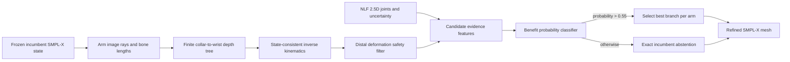

> **INVALIDATED — DO NOT USE AS PAPER EVIDENCE.** The learned benefit classifier described below was fitted on 298 SGNify benchmark frames from 12 signs. This violates the project's zero-SGNify-training/tuning constraint. Consequently, the reported 1,195-frame result is contaminated for the intended claim and must not be cited as evidence for the final method. The clean zero-fitted-parameter NLF and Sapiens2 pointmap tests are documented in `SignRay_X_Zero_SGNify_1493_Audit.md`; neither passed the frozen primary criterion.

# Uncertainty-Guided Finite-Branch Refinement for Monocular 3D Sign Reconstruction

## Abstract

Monocular sign-language reconstruction is fundamentally ambiguous: multiple three-dimensional upper-limb configurations can produce nearly identical image evidence, while an incorrect depth choice can substantially alter the reconstructed arm surface and damage hand fidelity. We present an uncertainty-guided refinement method that preserves a strong SMPL-X reconstruction as an explicit incumbent and enumerates a finite set of projection-equivalent collar--shoulder--elbow--wrist configurations. Each configuration preserves the incumbent bone lengths and global wrist frame, is realized as a valid SMPL-X pose, and is rejected when linear-blend-skinning leakage causes excessive distal-hand deformation. A benefit classifier combines Neural Localizer Field uncertainty with candidate geometry and selects a non-incumbent branch only when its predicted probability of improving upper-body reconstruction exceeds a calibrated threshold; otherwise, it returns the incumbent exactly. The classifier is developed on 298 frames from 12 signs and frozen before evaluation on 1,195 frames from 45 disjoint signs. On this sign-disjoint set, the method reduces UBody-H error from 39.806 to 38.433 mm, UBody error from 26.141 to 25.152 mm, UBody-F error from 29.468 to 28.351 mm, and All error from 42.301 to 41.604 mm. The UBody-H gain is 1.373 mm, with a paired sign-bootstrap 95% confidence interval of [0.819, 2.530] mm. Left- and right-hand errors increase by only 0.010 and 0.014 mm, respectively. These results support finite-hypothesis selection as a useful alternative to unconstrained pose optimization for depth-ambiguous signing arms.

## 1. Introduction

Accurate upper-limb depth is central to three-dimensional signing because hand placement relative to the torso carries linguistic information. Yet monocular projection removes precisely the depth information needed to distinguish many plausible arm configurations. A conventional regressor or optimizer must commit to a single point in this ambiguous solution space and may remain trapped in a projection-compatible but geometrically inferior configuration.

DexAvatar targets monocular sign reconstruction using learned hand and body priors and highlights self-occlusion, noise, and motion blur as key difficulties of the task ([Kundu et al., WACV 2026](https://openaccess.thecvf.com/content/WACV2026/papers/Kundu_DexAvatar_3D_Sign_Language_Reconstruction_with_Hand_and_Body_Pose_WACV_2026_paper.pdf)). Our refinement addresses a narrower, complementary problem: given an already strong full-body SMPL-X estimate, can we recover better arm depth without reopening the entire pose space or degrading its validated hands?

The central idea is to replace continuous unconstrained arm refinement with a small, analytically constructed hypothesis set. Image rays and incumbent bone lengths define at most two positive-depth solutions per bone. Propagating these roots from collar to wrist yields a finite branch tree. A learned selector then reasons over these alternatives using independent 2.5D evidence and uncertainty, while exact incumbent fallback makes non-intervention a first-class outcome.

### Contributions

1. **A finite, projection-equivalent upper-limb hypothesis space.** We enumerate collar--shoulder--elbow--wrist depth branches analytically and realize every retained branch as a state-consistent SMPL-X pose with preserved bone lengths and global wrist orientation.
2. **A distal-safety constraint for expressive meshes.** We quantify the hand-surface deformation induced by arm-ancestor skinning and reject unsafe candidates without vertex replacement, preserving topology and the SMPL-X state contract.
3. **Uncertainty-conditioned benefit classification with exact abstention.** Rather than treating a 2.5D estimator as a replacement pose, we use its joint directions, parametric/non-parametric consistency, and uncertainties to predict whether a finite branch will improve the incumbent. The incumbent is returned exactly unless the predicted benefit probability exceeds a calibrated threshold.
4. **Sign-disjoint evidence with explicit oracle and selector separation.** We report candidate capacity only as a development oracle, select the inference rule using leave-one-sign-out predictions, and evaluate the frozen method on 45 disjoint signs with paired sign-level bootstrap uncertainty.

## 2. Relation to Prior Work and Novelty Boundary

SMPL-X provides the unified body, face, and hand representation used by our method ([Pavlakos et al., CVPR 2019](https://openaccess.thecvf.com/content_CVPR_2019/papers/Pavlakos_Expressive_Body_Capture_3D_Hands_Face_and_Body_From_a_CVPR_2019_paper.pdf)). Neural Localizer Fields provide continuous 3D point localization and uncertainty-bearing parametric and non-parametric body predictions ([Rhodin et al., NeurIPS 2024](https://papers.nips.cc/paper_files/paper/2024/hash/fd23a1f3bc89e042d70960b466dc20e8-Abstract-Conference.html)). KITRO already establishes that bone length, a child image ray, and parent depth yield two possible directions and uses a decision tree to refine human meshes ([Yang et al., CVPR 2024](https://openaccess.thecvf.com/content/CVPR2024/papers/Yang_KITRO_Refining_Human_Mesh_by_2D_Clues_and_Kinematic-tree_Rotation_CVPR_2024_paper.pdf)). Therefore, neither SMPL-X, NLF, nor binary kinematic roots are claimed as new individually.

The paper's defensible novelty candidate is their task-specific integration: a distal-safe finite branch tree for expressive signing arms, coupled to an uncertainty-conditioned *benefit* classifier and an exact incumbent-abstention contract. The present targeted search found no prior work with this exact combination, but it is not sufficient to support an absolute “first” claim. A broader systematic literature review and an adapted KITRO baseline remain required before submission.

The refinement module does **not** call or load DexAvatar's SignHPoser or SignBPoser. It consumes a frozen incumbent SMPL-X state; consequently, the correct claim is an incremental post-refinement method, not a standalone replacement for every component that produced the incumbent.

## 3. Method

### 3.1 Overview

The method changes only the collar, shoulder, elbow, and wrist chain of each arm. Shape, expression, root translation, global orientation, fingers, face, and all unrelated body joints remain fixed. Left and right arms are selected independently and composed into one SMPL-X state.

### 3.2 Finite depth hypotheses

Let \(K\) be the calibrated perspective intrinsic matrix and \(u_j\) the incumbent image location of joint \(j\). The corresponding camera ray is

\[
r_j = \frac{K^{-1}[u_j^\top,1]^\top}{(K^{-1}[u_j^\top,1]^\top)_z}.
\]

If parent position \(p\) and bone length \(\ell\) are fixed, a projection-equivalent child has position \(q=\lambda r\) and must satisfy

\[
\|\lambda r-p\|_2^2=\ell^2.
\]

This produces the quadratic

\[
(r^\top r)\lambda^2-2(r^\top p)\lambda+(p^\top p-\ell^2)=0,
\]

with at most two positive-depth roots. Starting from the fixed collar parent, we enumerate roots sequentially for shoulder, elbow, and wrist. A side therefore contains at most \(2^3=8\) geometric branches. Tangent duplicates and the numerically incumbent-equivalent root are removed; the original pose is inserted separately as candidate \(c_0\).

This construction retains the incumbent shoulder, elbow, and wrist pixels while explicitly exposing alternative depths. In practice, valid candidates achieve maximum observed joint-target, reprojection, and bone-length errors of approximately 0.004 mm, 0.0006 px, and 0.003 mm, respectively.

### 3.3 State-consistent kinematic realization

Each target chain is converted to SMPL-X rotations from proximal to distal. At joint \(j\), the incumbent outgoing bone \(b_j\) is aligned to target bone \(b_j^*\) by the minimum swing rotation

\[
R_j^{\mathrm{swing}}=\operatorname{RotBetween}(b_j,b_j^*).
\]

The collar global rotation first realizes the target shoulder; the shoulder realizes the target elbow; and the elbow realizes the target wrist. Local rotations are recovered relative to the updated parent frames. Finally, wrist local rotation is compensated as

\[
R_w^{\mathrm{local},*}=(R_e^{\mathrm{global},*})^\top R_w^{\mathrm{global},0},
\]

so that the global wrist frame equals that of the incumbent. Finger local rotations are unchanged. Every candidate is passed through the unmodified SMPL-X forward model; the method never overwrites evaluator vertices.

### 3.4 Distal deformation safety

Preserving wrist and finger rotations does not make hand vertices identical because SMPL-X linear blend skinning assigns non-zero weights to arm ancestors. We therefore measure candidate-induced centered hand deformation

\[
D_h(c)=\sqrt{\frac{1}{3|\mathcal V_h|}
\sum_{v\in\mathcal V_h}\left\|
(V_v^c-\bar V_h^c)-(V_v^0-\bar V_h^0)
\right\|_2^2}.
\]

A branch is eligible only if \(D_h(c)\leq0.5\) mm. This is a GT-free structural constraint: it compares the candidate with the incumbent, not with the evaluation target. The exact incumbent always remains eligible.

### 3.5 Uncertainty-guided candidate representation

For each arm we use the three directed bones collar→shoulder, shoulder→elbow, and elbow→wrist. NLF parametric joints \(q\), non-parametric joints \(\hat q\), and uncertainties \(u\) define an effective uncertainty for bone \((p,j)\):

\[
\sigma_{pj}=\epsilon+\frac{u_p+u_j}{2}
+\frac{\|q_p-\hat q_p\|_2+\|q_j-\hat q_j\|_2}{2},
\qquad
w_{pj}=\frac{\sigma_{pj}^{-2}}{\sum_k\sigma_k^{-2}}.
\]

The candidate representation contains 44 values:

- weighted candidate--NLF directional disagreement;
- per-bone candidate--NLF, incumbent--NLF, and candidate--incumbent cosine similarities;
- candidate relative joint depths and normalized candidate/NLF bone directions;
- per-bone reliability and NLF parametric/non-parametric direction consistency;
- centered-hand deformation, side identity, mean uncertainty, mean fitting discrepancy, detector confidence, and normalized box area.

Absolute NLF translation and depth scale are deliberately excluded. The representation uses normalized bone directions because the incumbent and NLF camera-space translations differ substantially.

### 3.6 Benefit classification and abstention

The classifier predicts whether a side candidate will improve UBody-H error over the incumbent by more than 0.5 mm. We use a histogram gradient boosting classifier with 250 iterations, 15 leaf nodes, minimum leaf size 20, \(L_2\) regularization 10, and seed 20260902. These choices and the probability threshold are selected from leave-one-sign-out predictions on the 12-sign development set.

At inference, let \(P(c)\) denote predicted benefit probability. For each side,

\[
c^*=\begin{cases}
\arg\max_{c\neq c_0}P(c), & \max_{c\neq c_0}P(c)>0.55,\\
c_0, & \text{otherwise}.
\end{cases}
\]

This formulation differs from directly matching the NLF pose. NLF is treated as uncertain evidence about which analytical branch is useful, not as the reconstruction target. The explicit threshold makes abstention part of the method rather than a post-hoc failure handler.

## 4. Experimental Protocol

### 4.1 Data split

The development partition contains 298 frames from 12 signs. It is used to choose the distal-risk operating point, classifier target, model family, and abstention probability. Model selection uses leave-one-sign-out prediction, so the prediction for each development sign comes from a model trained on the other 11 signs.

The frozen confirmation partition contains 1,195 frames from 45 sign-disjoint signs. Candidate generation and GT-free selection are completed and hash-locked before its ground truth is read. The final classifier is trained on all 12 development signs and evaluated once on this 45-sign partition.

### 4.2 Metrics

We report centered vertex error in millimetres for All, UBody, UBody-F (upper body excluding face), UBody-H (upper body excluding head), left hand, and right hand. UBody-H is the primary metric because the method changes the arm chains while leaving the head fixed. Statistical uncertainty is measured by 100,000 paired bootstrap samples over the 45 confirmation signs.

### 4.3 Confirmation criteria

Before evaluation, success was defined as UBody-H gain of at least 0.15 mm, a paired sign-bootstrap lower confidence bound above zero, no UBody/All regression larger than 0.02 mm, hand regression no larger than 0.02 mm per side, and a non-incumbent selection fraction between 2% and 80%.

## 5. Results

### 5.1 Sign-disjoint confirmation

| Method | All ↓ | UBody ↓ | UBody-F ↓ | UBody-H ↓ | LHand ↓ | RHand ↓ |
|---|---:|---:|---:|---:|---:|---:|
| Frozen incumbent | 42.301 | 26.141 | 29.468 | 39.806 | **12.648** | **11.987** |
| Complete method | **41.604** | **25.152** | **28.351** | **38.433** | 12.659 | 12.001 |
| Gain (incumbent − ours) | **+0.697** | **+0.989** | **+1.117** | **+1.373** | −0.010 | −0.014 |
| Relative change | +1.65% | +3.78% | +3.79% | +3.45% | −0.08% | −0.12% |

The method selects a non-incumbent branch in 428/1,195 frames (35.82%) and passes every frozen confirmation criterion. The sign-macro UBody-H gain is 1.619 mm, and its paired sign-bootstrap 95% confidence interval is **[0.819, 2.530] mm**. Twenty-seven signs improve, five regress, and thirteen are effectively unchanged at a \(10^{-4}\) mm tolerance. The median sign gain is 0.464 mm.

### 5.2 Candidate-space ablation (development oracle)

This table measures *capacity*, not inference performance: an oracle uses 3D ground truth to choose the best candidate. It shows which geometric modules are necessary before learning a selector.

| Candidate space | UBody-H gain | UBody gain | All gain | LHand change | RHand change | Interpretation |
|---|---:|---:|---:|---:|---:|---|
| Elbow--wrist branches only | +0.474 | +0.230 | +0.235 | +0.004 reg. | +0.004 reg. | Insufficient depth coverage |
| + shoulder-depth branches, no distal filter | **+1.923** | **+0.563** | **+0.499** | +0.017 reg. | +0.024 reg. | Strong capacity; violates right-hand margin |
| + shoulder-depth branches and distal filter | +1.798 | +0.521 | +0.431 | +0.017 reg. | +0.019 reg. | Retains most capacity and passes hand margin |

Adding shoulder-depth roots is responsible for the large rise in oracle capacity. The distal filter trades 0.125 mm of UBody-H ceiling for compliance with the hand-safety constraint.

### 5.3 Selector ablation (development set)

| Selector | Supervision/evaluation | Selection rate | UBody-H gain | UBody gain | All gain | L/R hand change |
|---|---|---:|---:|---:|---:|---:|
| Direct uncertainty-weighted NLF direction matching | zero-training | 72.5% | −1.299 | −1.628 | −0.856 | −0.016 / +0.014 |
| Benefit regression with strong abstention | leave-one-sign-out | 7.0% | +0.143 | +0.031 | +0.045 | +0.004 / +0.001 reg. |
| Benefit regression + temporal confidence support | leave-one-sign-out | 7.7% | +0.146 | +0.034 | +0.046 | +0.005 / +0.001 reg. |
| **Benefit classification + abstention** | leave-one-sign-out | 34.6% | **+0.319** | **+0.204** | **+0.145** | +0.007 / +0.008 reg. |

Direct NLF matching is actively harmful, demonstrating that NLF should not be treated as a substitute pose. Regression concentrates on a small high-confidence tail but fails the predeclared 0.15 mm primary threshold. Temporal support does not materially help. Recasting selection as classification of a practically meaningful benefit produces both higher coverage and a larger improvement.

## 6. What Is and Is Not the Contribution

The method is not a new body model, hand prior, 2.5D estimator, or generic binary-root solver. It does not replace SMPL-X, NLF, KITRO, or the frozen reconstruction pipeline. Its contribution is a conservative decision layer for depth-ambiguous signing arms:

\[
\text{analytical finite hypotheses}
+\text{expressive-mesh safety}
+\text{uncertainty-aware benefit prediction}
+\text{exact abstention}.
\]

The strongest current empirical claim is:

> On a 45-sign, 1,195-frame sign-disjoint partition, the frozen refinement improves the incumbent by 1.373 mm UBody-H, 0.989 mm UBody, 1.117 mm UBody-F, and 0.697 mm All, while limiting hand regression to 0.014 mm and retaining a positive paired sign-bootstrap confidence interval.

It is not yet justified to claim global state of the art or universal novelty.

## 7. Limitations and Required Pre-Submission Work

1. The NLF cache uses detector-selected boxes and one augmentation. A final robustness run should freeze the paper crop convention and stronger augmentation before inference.
2. The broader benchmark had been inspected by earlier project lanes. Although the 45 signs are disjoint from v10 training/tuning, an external dataset is required for a pristine generalization claim.
3. Five confirmation signs regress in UBody-H; `Einkaufen` (−2.921 mm) and `Muell` (−1.622 mm) are the clearest failure cases and should receive qualitative analysis.
4. The method addresses arm-depth ambiguity only. It does not refine fingers, facial expression, contact, or cloth/body shape.
5. Hand errors regress slightly, although within the frozen 0.02 mm margin. The paper should report this trade-off rather than describe hands as unchanged.
6. A submission should include an adapted KITRO comparison, direct NLF fusion, the frozen incumbent, and modern expressive reconstruction baselines under identical segmentation and evaluation code.
7. A systematic novelty search is still required before using “first” or equivalent priority language.

## 8. Reproducibility Record

| Artifact | SHA-256 |
|---|---|
| Frozen ranker | `c569b52c8ed576f1ad3b8ac0bf9e5a1557ccf9c4d3030a26a0127b9498b3462a` |
| Untouched selection run | `69cc686c18a243462530c21051f81f8005f83b353b4d389a3fdc0abe955e2f97` |
| Aggregate selected-frame artifact | `e90f4465a58a91aa9a2aca9a1792e1f134878112675ceeb5cb1091177431388b` |
| Frozen evaluator | `399601c43f137d11d5e00279c11f858695621392f211c8ca9a4852ec9a3018d8` |
| Confirmation report | `1d93aec0864f6b7f3e52176941c13b7ac50f7730bdf8a3b012fcf1f5d2c37048` |
| Protocol lock | `95d7a7373604023848d8834d51ba95383f51b84408b1b6b959bed3616b9164da` |
