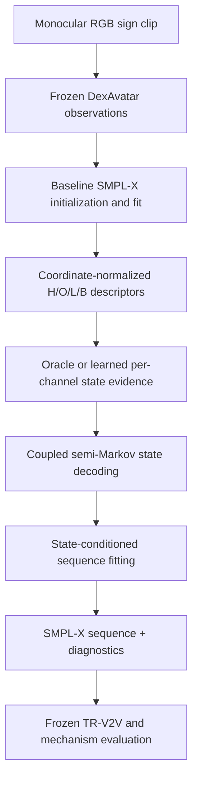

# MAPS-Sign: Research-to-Implementation Plan

**Multi-Articulator Phase-State Sign Reconstruction for monocular RGB video → SMPL-X**

**Document type:** implementation-planning and falsification specification; no implementation is included.  
**Primary target:** SGNify translation-registered vertex-to-vertex error (TR-V2V) on UBody(-F), left hand, and right hand.  
**Baseline:** the official DexAvatar repository at commit `a0dfd427f60f5811aadb35c8657b3856d47f56b5` (remote HEAD verified 10 August 2026).  
**Scientific status:** MAPS-Sign is a hypothesis under test, not an established method or SOTA result.

---

## 0. How to read this document

The following labels are used deliberately:

- **FACT:** directly supported by the audited paper, supplementary material, released code, or a primary source.
- **EVIDENCE:** an observation or result that bears on a claim but does not prove it.
- **INFERENCE:** a reasoned consequence of facts/evidence that has not itself been directly measured.
- **HYPOTHESIS:** a falsifiable prediction to be tested.
- **SPECULATION:** a possibility with insufficient evidence; it cannot motivate a paper claim without new validation.

The plan is ordered around kill gates. The learned parser and coupled decoder are intentionally postponed until an oracle-state experiment proves that the representation has geometric headroom. A negative oracle result ends the project in its current form.

---

## 1. Executive summary

### 1.1 Core hypothesis

**HYPOTHESIS:** the handshape, palm orientation, signing-space location, and bimanual relation of a sign do not always change synchronously. A reconstruction system that infers separate stable/transition/unknown states for these articulators and activates descriptor-specific SMPL-X factors at the correct times will recover hidden or degraded geometry more accurately than a global phase model, ordinary smoothing, or a capacity-matched unstructured sign-motion prior.

MAPS-Sign defines seven channels:

\[
\mathcal A=\{H_L,H_R,O_L,O_R,L_L,L_R,B\},
\qquad
z_{t,a}\in\{\text{STABLE},\text{TRANSITION},\text{UNKNOWN}\}.
\]

- \(H_L,H_R\): left/right handshape.
- \(O_L,O_R\): left/right palm orientation relative to the torso.
- \(L_L,L_R\): left/right wrist location in body-normalized signing space.
- \(B\): bimanual relative transform.

The proposal is not “use a Transformer,” “use bidirectional context,” or “use a motion prior.” Those are established techniques and are treated only as interchangeable components or controls. The narrow candidate contribution is:

> Separate asynchronous articulatory states for handshape, palm orientation, location, and bimanual relation, inferred without gloss at test time and used to switch descriptor-specific SMPL-X reconstruction factors.

### 1.2 End-to-end plan

### 1.3 Implementation phases

1. **Baseline reproduction:** reproduce the released DexAvatar pipeline, serialize its effective outputs correctly, and lock its behavior.
2. **Protocol reconstruction:** obtain or reconstruct the SGNify evaluator, frame manifest, vertex subsets, centering rule, and coverage policy.
3. **Descriptor proof:** implement only the coordinate and descriptor mathematics conceptually specified here; validate invariance and separability on synthetic motions.
4. **Oracle state pilot:** derive/audit states from accurate 3D motion and ask whether correct asynchronous states beat global state, smoothing, unstructured sign priors, and shuffled controls.
5. **Learned state parser:** train a lightweight, gloss-free parser only if oracle headroom exists.
6. **Structured decoder:** add duration and cross-channel factors only if independent states are useful and noisy enough to need structured inference.
7. **Full validation:** run unified baselines, ablations, robustness subsets, safety tests, statistical analysis, and reviewer-facing qualitative evaluation.

### 1.4 Non-negotiable kill rule

If oracle asynchronous states do not reduce the correct descriptor errors and TR-V2V on targeted hidden/degraded spans without attenuating genuine motion, MAPS-Sign is rejected. A more complex parser cannot rescue a representation that fails with oracle states.

---

## 2. Research question and sub-questions

### Primary question

Can asynchronous, articulator-specific stable/transition/unknown states improve monocular RGB-video SMPL-X reconstruction of sign language beyond DexAvatar and stronger generic/sign-specific temporal controls under a locked SGNify TR-V2V protocol?

### RQ1 — Representation

Do separate \(H/O/L/B\) states explain residual reconstruction error better than one global sign phase?

**Falsifier:** a global state matches asynchronous states on channel-disagreement frames and on descriptor-specific errors.

### RQ2 — Geometry

Can each articulator be represented by a differentiable descriptor that is invariant to irrelevant camera/global motion but sensitive to the intended phonetic change?

**Falsifier:** descriptor changes are dominated by coordinate artifacts, or a “stable” factor unintentionally freezes a different articulator.

### RQ3 — Causality

Are improvements caused by correct state timing rather than extra regularization, future context, data scale, optimizer iterations, or a stronger observation backbone?

**Falsifier:** shuffled, time-shifted, all-stable, or capacity-matched controls improve equally.

### RQ4 — Observability

Can states be inferred from RGB-derived evidence without gloss, sign identity, test ground truth, or evaluator leakage?

**Falsifier:** only oracle states work, learned states do not generalize to unseen signers, or training labels encode test geometry.

### RQ5 — Robustness

Are gains concentrated where the causal theory predicts—motion blur, hand-hand/hand-body occlusion, long gaps, and reappearance—while clean and fast-transition frames remain non-inferior?

**Falsifier:** gains occur only on clean frames, or lower jitter is accompanied by worse acceleration error, lag, or peak retention.

### RQ6 — Benchmark validity

Does the conclusion survive a unified evaluator, complete prediction coverage, multiple seeds, sign-clustered uncertainty, and modern external baselines?

**Falsifier:** ranking depends on PA rather than translation-only alignment, dropped frames, an unverified vertex subset, or a detector upgrade.

---

## 3. Claim boundaries

### 3.1 Allowed claims, conditional on evidence

- MAPS-Sign introduces a **specific asynchronous multi-articulator state representation** for sign reconstruction if the oracle/global/shuffle/learned experiments support it.
- State-conditioned descriptor factors improve one or more reconstruction metrics **only for the regions and conditions that pass corrected statistical tests**.
- Offline future evidence improves reappearance **only if it beats causal and interpolation controls without anticipation or lag**.
- A practical learned system exists **only if the learned parser retains a pre-registered fraction of oracle geometry gain on unseen signers**.
- Overall SGNify SOTA may be claimed **only if all three co-primary TR-V2V regions beat every unified-rerun comparator with complete coverage and corrected confidence intervals**.
- Hand SOTA may be claimed if both hands pass and UBody(-F) is non-inferior; this is not overall SOTA.

### 3.2 Forbidden claims

- “First temporal sign reconstruction method.”
- “First bidirectional,” “first Transformer,” “first diffusion,” or “first generative prior” for pose/motion recovery.
- “First visibility-aware,” “first uncertainty-aware,” or “first phase-conditioned” reconstruction method.
- “First phonology-aware sign fitting” without qualifying the established SGNify linguistic constraints and phase literature.
- “Explicit contact reasoning” or “contact-aware reconstruction” unless a dedicated contact mechanism and independently audited contact labels are added and validated. MAPS-Sign as specified here does not make that contribution.
- “Biomechanically accurate” merely because range-of-motion or penetration penalties are present.
- “Ground-truth reconstruction” for pseudo-SMPL-X annotations from How2Sign/SignAvatars.
- “Official TR-V2V” unless the evaluator, frames, vertex subsets, centering rule, and published rows are exactly reproduced.
- “Generalizes across signers/languages” from the one-signer SGNify test set.
- “Improved temporal fidelity” from jitter alone.
- “Novel because DexAvatar does not do it.”

### 3.3 Closest-work threat

The strongest novelty threat is the combination of SGNify's linguistic fitting, sign-phase extraction/annotation work, and generic phase/state-conditioned optimization such as PhaseMP. Generic temporal full-SMPL-X methods such as DanceHMR and reliability-aware hand methods such as StableHand further narrow the claim. The contribution survives only if the exact \(H/O/L/B\) asynchronous state-to-descriptor mechanism is new and causally necessary. Novelty must be re-searched at paper freeze.

---

## 4. System overview: what remains baseline and what is new

| Layer | Baseline or new | Responsibility | Test-time inputs | Trainable? |
|---|---|---|---|---|
| RGB ingestion and clip segmentation | DexAvatar baseline for reproduction; generic segmentation for later deployment | Read isolated sign clips and frame order | RGB, clip/frame IDs | No |
| Sapiens | Baseline | 133 whole-body 2D keypoints and confidences | RGB | Frozen |
| SMPLer-X | Baseline | Per-frame SMPL-X/camera initialization | RGB | Frozen |
| HaMeR | Baseline | Hand 2D/3D observations and MANO pose initialization | RGB hand crops | Frozen |
| SignBPoser | Baseline | Sign-domain body pose manifold | Body latent | Frozen |
| SignHPoser | Baseline | Sign-domain finger articulation manifold | Left/right hand latent | Frozen |
| SMPL-X + existing priors/losses | Baseline | Differentiable mesh and frame fitting | Observations, initial parameters | Pose latents optimized; networks frozen |
| Baseline adapter | New engineering, not a paper contribution | Canonicalize inputs/outputs and serialize the effective optimized parameters | Baseline files | No learned parameters |
| Coordinate/descriptor layer | New mechanism support | Compute \(H/O/L/B\) in invariant frames | SMPL-X sequence | Differentiable |
| State label/oracle generator | New experimental tool | Derive weak/oracle state sequences from accurate 3D descriptors | 3D motion, audit labels | No |
| Per-channel state parser | Candidate new method | Predict unary state evidence and boundary confidence | Frozen visual/pose features; no gloss | Yes |
| Coupled semi-Markov decoder | Candidate new method | Enforce durations and soft cross-channel coordination without synchronizing all channels | Unary evidence | Small learned or validation-fit potentials |
| State-conditioned factors | Candidate core contribution | Switch descriptor-specific invariance/transition/unknown factors | State posterior, reliability, SMPL-X | Weights selected on validation |
| Reappearance factor | Enabling component | Use future visual anchors across missing spans | Offline RGB-derived evidence | Optional/trainable; not claimed novel alone |
| Evaluator/audit suite | New engineering/scientific infrastructure | Exact TR-V2V, mechanism metrics, coverage, subsets, statistics | Predictions and locked references | No |

### Phase separation

- **Phase A — baseline reproduction:** no MAPS factors or learned temporal model.
- **Phase B — oracle-state fitting:** true/audited states are supplied, but no learned parser is used.
- **Phase C — learned state inference:** parser replaces oracle labels; optimizer and observations remain fixed.
- **Phase D — coupled decoder:** duration/cross-channel structure is added only after independent learned states have value.
- **Phase E — final benchmark:** external baselines, robust subsets, safety, generalization, and release audit.

---

## 5. Exact DexAvatar baseline strategy

### 5.1 Audited repository contract

**FACT:** the current official remote HEAD is `a0dfd427f60f5811aadb35c8657b3856d47f56b5` (3 May 2026). The repository is a shallow top-level Git clone containing vendored SMPLer-X, HaMeR, SMPLify-X-derived fitting, mesh-intersection, and neural-renderer code.

The released execution order is:

1. Sapiens Lite pose extraction in a `sapiens_lite` environment.
2. SMPLer-X inference in a separate `smpler_x` environment.
3. Mean-shape computation and HaMeR inference in the `dexavatar` environment.
4. DexAvatar fitting through the active `fit_smplx_vposer_x.yaml` configuration.

The top-level runner iterates clip subfolders and assumes each clip contains an `images/` directory. The fitting code additionally requires `data/segment.json` and `data/signs.txt`, so the released path is specialized to isolated SGNify-style clips rather than arbitrary continuous videos.

### 5.2 Effective preprocessing and observations

| Component | Effective output consumed by the fitter | Important behavior |
|---|---|---|
| Sapiens | `sapiens.pkl`: whole-body/face/hand keypoints and confidence | Used as the main 133-point observation array; HaMeR hand points overwrite hand slots |
| SMPLer-X | Per-frame pickles with global orientation, 63-D body pose, 45-D hands, jaw/eyes/expression, 10 betas, translation, focal length, principal point | Supplies initialization and fixed camera matrix; frames without a file are removed |
| Mean-shape script | Clip-average 10-D betas | Replaces per-frame shape to maintain clip identity |
| HaMeR | `hamer.pkl`: 2D hand keypoints, MANO rotations, 3D hand joints, crop centers/scales, handedness and camera translation | Frames with no HaMeR entry/detection are removed before fitting; one-hand branches may reuse previous observations |
| Sign metadata | `signs.txt` (`0` for one-handed, `~0` for two-handed) and `segment.json` | Required at test time by the released SGNify path; one-hand active side is inferred from Sapiens wrist motion |

### 5.3 Effective optimization variables

The released optimizer does not optimize every SMPL-X parameter. For each frame it initializes all parameters, then optimizes:

- a 33-D SignBPoser latent, decoded to 21 body-joint axis-angle rotations;
- a 23-D SignHPoser latent for each active hand, decoded to 15 hand-joint rotations.

Camera intrinsics, root orientation, translation, shape, expression, jaw, and eyes are initialized from SMPLer-X and are not in the actual optimizer parameter list. The inactive hand in one-handed signs is not optimized through SignHPoser. The body latent still changes both arms.

### 5.4 Effective released objective

For frame \(t\), the released objective is best represented as:

\[
\begin{aligned}
E_t ={}& E_{2D}^{\mathrm{GMoF}}(J(x_t),K_t,y_t,c_t)
+ E_{\text{body-latent}}(e_t^B)
+ E_{\text{hand-latent}}(e_{t,L}^H,e_{t,R}^H)\\
&+E_{\text{init-body}}(D_B(e_t^B),\theta^{0,B}_t)
+E_{\text{init-hand}}(D_H(e_t^H),\theta^{0,H}_t)\\
&+E_{\text{angle}}+E_{\text{body-ROM}}+E_{\text{shape}}+E_{\text{face}}
+E_{\text{penetration}}+2000\,\rho(\theta^B_t-\theta^B_{t-1}).
\end{aligned}
\]

Key facts from the active configuration and code:

- Three LBFGS-with-strong-Wolfe stages, learning rate 0.5, at most 30 iterations per stage.
- Body latent prior weight 4.78 at all stages.
- Hand latent prior weights 0, 4.78, 4.78.
- Body/hand/face 2D weights: 0.5/0.5/1.0, then 1.0/1.5/1.0, then 1.5/2.5/2.0.
- Initialization L1 weights are 1200 for body and hands in all three stages.
- Collision weights are 0.5, 1.0, 1.5.
- Body range-of-motion weight is 100.
- The HaMeR relative-depth term is implemented but its configured weight is zero.
- The previous-frame temporal term is body-pose only, one-step, forward, and fixed at 2000; there is no hand temporal term, window model, future evidence, velocity/acceleration target, or uncertainty model.

### 5.5 Paper/code discrepancies that must remain visible

- The paper describes hand biomechanical constraints, but the effective released objective contains a body ROM term and no corresponding hand ROM term.
- The paper motivates contact handling, but the code contains generic mesh self-penetration repulsion, not a semantic hand-hand/hand-body contact model.
- The mathematical optimization-variable set in the paper is broader than the actual `final_params` list.
- Camera estimation objects remain in the inherited code, but the released fitting path uses the SMPLer-X intrinsic matrix and does not optimize it.
- “Occlusion robustness” is indirect through priors/confidence; there is no visibility latent, occlusion order, or uncertainty posterior.

The exact released code is the reproduction baseline. A separate “paper-intended” variant may be diagnostic only and must never silently replace the release.

### 5.6 Baseline outputs and adapter requirements

The fitter creates:

- per-frame parameter pickles under `results/`;
- per-frame SMPL-X OBJ meshes under `meshes/`;
- rendered overlays under `images/`;
- a dumped configuration.

**Blocking engineering issue:** the result pickle is built from named SMPL-X module parameters and explicitly overwrites decoded body pose, but it does not explicitly overwrite left/right hand pose with the optimized SignHPoser decodes or save the hand/body latents. The rendered/exported mesh does use decoded optimized hands. Therefore the future baseline adapter must:

1. serialize optimized body and active-hand latents;
2. serialize their decoded axis-angle poses;
3. save the exact root, translation, betas, expression, camera, topology and units;
4. regenerate vertices from the serialized parameters;
5. require vertex equality to the exported mesh within a numerical tolerance;
6. mark inactive/missing hands explicitly rather than filling silently;
7. preserve original files for historical reproduction.

No descriptor, oracle label, or metric may be computed from ambiguous parameter files until this round-trip test passes.

### 5.7 Frozen modules for all core ablations

Unless an experiment explicitly tests a modern observation stack, freeze:

- Sapiens checkpoint and preprocessing;
- SMPLer-X checkpoint, person selection, crop and camera outputs;
- HaMeR checkpoint, hand routing and crop transformation;
- SignBPoser and SignHPoser weights;
- SMPL-X model/topology, vertex/joint regressors and part segmentation;
- all observation files and validity masks;
- clip-average shape;
- non-temporal losses, stage weights, optimizer type, iterations and stopping tolerances.

This ensures that MAPS is tested as a temporal/state mechanism rather than a detector or optimizer-budget upgrade.

### 5.8 Baseline reproducibility blockers

- SignBPoser/SignHPoser checkpoints and SMPL-X assets are external downloads and absent from the repository.
- Sapiens, SMPLer-X and DexAvatar require different environments and older CUDA/PyTorch combinations.
- The dependency specification is split across top-level and optional requirement files and multiple environment-install scripts; the effective environment must be resolved from a locked working export rather than inferred from a single file.
- The code disables cuDNN and relies on a CUDA mesh-intersection extension.
- Frame filtering can silently change coverage when HaMeR/SMPLer-X outputs are missing.
- Two-handed code assumes two HaMeR detections; one-handed fallback may propagate previous observations.
- The released repository contains no canonical SGNify evaluator or exact 2,872-frame manifest.

---

## 6. Coordinate-system design

### 6.1 Design principles

1. A descriptor must remove only nuisance transformations, not the articulatory signal it is intended to measure.
2. State and descriptor labels are computed in a single versioned coordinate convention.
3. Camera/image coordinates are never mixed with SMPL-X metric coordinates without an explicit transform.
4. Left and right hands retain anatomical identity; mirroring is used only in explicitly named canonicalized features.
5. Every frame transform has a validity mask and degeneracy test.

### 6.2 Frames and notation

| Frame | Symbol | Origin | Axes / definition | Intended use |
|---|---|---|---|---|
| Image pixel | \(\mathcal F_I\) | top-left pixel | +x right, +y down | 2D observations and reprojection only |
| Camera | \(\mathcal F_C\) | optical center | convention inherited and audited from SMPLer-X; +z projection direction must be verified | raw 3D projection and camera diagnostics |
| SMPL-X global/model | \(\mathcal F_G\) | model/root translation origin | model convention from the exact SMPL-X asset | mesh generation and raw output |
| Pelvis-centered | \(\mathcal F_P\) | pelvis joint | global axes after subtracting pelvis | translation removal diagnostics |
| Torso | \(\mathcal F_T\) | midpoint of left/right shoulders | anatomical lateral/superior/anterior axes | palm orientation and signing-space location |
| Shoulder-normalized signing space | \(\mathcal F_S\) | shoulder midpoint | torso axes, coordinates divided by shoulder width | scale-invariant wrist location |
| Wrist kinematic | \(\mathcal F_{W,h}\) | SMPL-X wrist joint | wrist transform from the kinematic chain | handshape rotations |
| Palm geometry | \(\mathcal F_{M,h}\) | palm center/wrist | axes constructed from MCP landmarks and projected to SO(3) | palm orientation and bimanual relation |
| Canonical hand local | \(\mathcal F_{H,h}\) | wrist | palm axes; optional left-hand reflection explicitly recorded | geometry-based handshape diagnostics |

### 6.3 Torso frame

Let \(p_{LS},p_{RS}\) be shoulder joints, \(p_{pel}\) the pelvis, and \(p_{N}\) a neck/upper-spine joint. Define:

\[
o_T=\tfrac12(p_{LS}+p_{RS}),\quad
e_L=\frac{p_{LS}-p_{RS}}{\|p_{LS}-p_{RS}\|},\quad
\tilde e_U=\frac{p_N-p_{pel}}{\|p_N-p_{pel}\|}.
\]

Orthogonalize superior against lateral, then construct anterior:

\[
e_U=\operatorname{norm}(\tilde e_U-(\tilde e_U^\top e_L)e_L),\qquad
e_A=\operatorname{norm}(e_L\times e_U).
\]

The sign of \(e_A\) is chosen to agree with the SMPL-X root's known anterior axis; it must not be chosen from camera view because that would fail under viewpoint change. Recompute \(e_U=e_A\times e_L\) and define \(R_T=[e_L,e_U,e_A]\in SO(3)\). A torso frame is invalid if shoulder width or the orthogonalized superior norm falls below a validation-frozen threshold.

### 6.4 Shoulder-normalized location

Let \(s=\|p_{LS}-p_{RS}\|\), clipped only for numerical safety. For hand \(h\):

\[
D_{L_h}(x_t)=\frac{R_{T,t}^{\top}(p_{W_h,t}-o_{T,t})}{s_t}\in\mathbb R^3.
\]

This removes global translation, global body rotation and signer scale while retaining movement in the signer's own signing space. Palm-center location is retained as a diagnostic but not in the MVP factor because it entangles location with palm orientation and handshape.

### 6.5 Wrist and palm frames

- \(R_{W,h}\) comes from the SMPL-X kinematic transform at the wrist. It is used to express finger-joint local rotations/positions without absorbing global wrist orientation into handshape.
- The palm center is the robust mean of wrist, index-MCP, middle-MCP, ring-MCP and pinky-MCP landmarks.
- A palm lateral axis is built from pinky-MCP to index-MCP with a hand-specific sign convention.
- A palm longitudinal axis is the palm-center-to-middle-MCP direction orthogonalized against the lateral axis.
- The palm normal is their cross product. Its sign is fixed by the model's dorsal/palmar vertex convention, not frame-to-frame continuity alone.
- The resulting matrix is projected to the nearest \(SO(3)\) matrix by polar decomposition. Degenerate or flipped frames are masked and logged.

### 6.6 Coordinate verification checklist

Before descriptors are accepted:

- apply known root translation and rotation to a synthetic SMPL-X sequence and verify \(H/O/L/B\) invariance where intended;
- rotate the virtual camera with fixed body motion and verify descriptors are unchanged;
- scale the body shape and verify shoulder-normalized \(L\) and \(B\) translation remain stable within tolerance;
- move the wrist with fixed finger pose and verify \(H\) is unchanged while \(L\) changes;
- rotate the palm/forearm with fixed finger articulation and verify \(O\) changes while \(H\) remains stable;
- articulate fingers with fixed wrist/palm and verify \(H\) changes while \(O,L\) remain stable;
- move both hands rigidly together and verify individual \(L\) changes while \(B\) stays stable;
- mirror a synthetic pose and verify explicit left/right canonicalization, with no accidental handedness swap;
- cross the \(\pi\) axis-angle boundary and verify geodesic distances remain continuous;
- regenerate baseline meshes from saved parameters and verify coordinate/unit consistency.

### 6.7 Unresolved coordinate questions

- The exact SMPL-X anterior-axis convention in the bundled/rewrite model must be confirmed with a rendered calibration pose.
- The released neutral rewrite model and external gendered SMPL-X models may not expose identical joint indexing/flat-hand conventions; the project should use one locked neutral model for all primary experiments.
- SGNify camera/world transforms and GT mesh centering are not yet available in a canonical manifest.
- Palm landmark vertices/joints must be selected once and versioned; changing them after seeing test results is prohibited.

---

## 7. Articulatory descriptor design

### 7.1 Shared requirements

Every descriptor must be:

- differentiable with respect to the SMPL-X parameters used in sequence fitting;
- temporally continuous under equivalent physical motion;
- accompanied by a mask for undefined/degenerate cases;
- computable from prediction and accurate 3D reference using the same topology/convention;
- evaluated separately from its state label;
- insensitive to nuisance transforms but not to intended articulatory changes.

For each channel, state evidence is based on a robust descriptor velocity \(v_{t,a}\), not raw axis-angle subtraction:

\[
v_{t,a}=\frac{d_a(D_a(x_t),D_a(x_{t-1}))}{\Delta t},
\]

where \(d_a\) is Euclidean for normalized translations and geodesic for rotations.

### 7.2 Handshape \(H_L,H_R\)

#### Problem definition

Handshape should describe finger/thumb articulation independent of wrist location and palm orientation. A stable-handshape factor must not freeze the arm or prevent the palm from translating/rotating.

#### Candidate representations

| Candidate | Mathematics | Invariance | Advantages | Failure modes / cost |
|---|---|---|---|---|
| Raw 45-D hand axis-angle | Concatenate 15 local rotations | Translation/global orientation invariant | Directly available | Euclidean discontinuity near \(\pi\); representation-dependent |
| Local rotation matrices | \(\{R_{h,j}\}_{j=1}^{15}\), compare with \(\|\log(R_{t-1,j}^TR_{t,j})\|\) | Translation, root and wrist rigid motion invariant | Exact articulation, differentiable geodesic | Depends on joint convention; twist may be weakly observable |
| 6D rotation features | First two columns of each \(R_{h,j}\) for parser input | Same as matrices | Continuous neural input | Needs projection to SO(3); 90-D |
| Wrist/palm-local joints | \(R_{W,h}^T(p_j-p_W)/s_{palm}\) | Rigid hand motion and scale invariant | Observable geometry; easy audit | Palm/wrist-frame noise; bone-shape dependence |
| Flexion/abduction angles | Anatomical angles per finger | Strong semantic compactness | Interpretable | Convention and axis design are difficult; ignores some twist |
| SignHPoser latent | 23-D optimized latent | Depends on learned decoder | Compact and prior-aligned | Non-identifiable latent metric; checkpoint/domain dependence |

#### MVP decision

Use local joint rotations as the optimization descriptor and wrist-local joint geometry as a diagnostic:

\[
d_{H_h}^2(t,t')=\sum_{j=1}^{15}w_j
\left\|\log\left(R_{h,j,t}^{\top}R_{h,j,t'}\right)\right\|_2^2.
\]

Parser features use the continuous 6D form plus normalized wrist-local joint positions. The SignHPoser latent is an auxiliary feature/ablation, never the sole state definition.

#### Supervision and expected failure modes

- Accurate SMPL-X/MANO local rotations can create deterministic weak labels.
- Glove/mocap joint conventions from 3D-LEX/SignHPoser require a documented retargeting map before use.
- Thumb CMC and axial twist may be poorly constrained by monocular images.
- Different poses can yield similar visible joint geometry; state uncertainty should rise, not be forced stable.
- If handshape factors reduce wrist-relative MPJPE but distort orientation/location, the descriptor or factor ownership is wrong.

### 7.3 Palm orientation \(O_L,O_R\)

#### Problem definition

Orientation is the rotation of the palm relative to the signer's torso, not camera orientation and not finger articulation.

#### Candidate representations

| Candidate | Mathematics | Advantages | Failure modes |
|---|---|---|---|
| Wrist kinematic rotation in torso frame | \(R_T^TR_W\) | Stable, directly differentiable | Includes forearm/wrist convention; may not equal visible palm |
| Geometry palm frame in torso frame | \(R_T^TR_M\) | Tied to visible palm surface | Can change slightly with MCP articulation; degeneracy |
| Palm normal only | \(R_T^Tn_M\in S^2\) | Compact and robust | Loses in-plane orientation |
| Normal + longitudinal direction | two unit vectors / 6D rotation | Captures full palm frame | Requires stable axes and handedness convention |
| Quaternion | unit quaternion | Compact | sign ambiguity; needs canonicalization |

#### MVP decision

Use the geometry palm frame in the torso frame:

\[
D_{O_h}(x_t)=R_{T,t}^{\top}R_{M,h,t},\qquad
d_{O_h}(t,t')=\left\|\log(D_{O_h,t}^{\top}D_{O_h,t'})\right\|_2.
\]

Use its 6D rotation representation as a parser feature and SO(3) geodesic distance for labels, losses and metrics. Wrist-frame orientation is a replacement ablation.

#### Invariance and failure modes

- Invariant to global translation, camera pose and rigid root rotation when the torso frame is valid.
- Sensitive to true palm rotation relative to torso.
- Torso motion errors can contaminate orientation; report root/torso frame stability.
- Closed fists and crossed hands can make geometry landmarks unreliable from predictions even though the GT frame is defined.
- A stable orientation factor must not constrain finger-joint rotations directly.

### 7.4 Signing-space location \(L_L,L_R\)

#### Problem definition

Location is the hand's position relative to the signer, not raw camera depth or full-body translation.

#### Candidate representations

| Candidate | Definition | Advantages | Failure modes |
|---|---|---|---|
| Raw camera wrist | \(p_W^C\) | Direct | Entangled with camera/root/scale |
| Pelvis-relative wrist | \(p_W-p_{pel}\) | Translation invariant | Still root-rotation and scale dependent |
| Torso-frame wrist | \(R_T^T(p_W-o_T)\) | Root/view invariant | Signer scale dependent |
| Shoulder-normalized torso wrist | \(R_T^T(p_W-o_T)/s\) | Root/view/scale invariant | Shoulder estimate noise; may normalize meaningful morphology |
| Palm center or hand centroid | same normalization | Semantically close to hand location | Entangles handshape/orientation |

#### MVP decision

Use the 3-D shoulder-normalized torso-frame wrist coordinate from Section 6.4. Report palm-center and torso-relative unscaled wrist as sensitivity diagnostics.

#### Expected behavior and failures

- Stable \(L\) with changing \(H\) should retain wrist position while fingers articulate.
- Stable \(H\) with changing \(L\) should permit arm/wrist trajectory without finger drift.
- Shoulder occlusion or bad body initialization can move the coordinate frame; a robust sequence torso frame may be needed, but any smoothing of that frame must be fixed before evaluation.
- Signer body proportions not captured by shoulder width may leave domain shift; upper-arm-length normalization is a replacement ablation.

### 7.5 Bimanual relation \(B\)

#### Problem definition

\(B\) captures relative two-hand geometry that can remain stable while both hands move. It is not a contact label and is undefined when a meaningful second active hand is absent.

#### Candidate representations

| Candidate | Definition | Captures | Limitation |
|---|---|---|---|
| Inter-wrist distance | \(\|p_{W_R}-p_{W_L}\|/s\) | separation | Loses direction and orientation |
| Torso-frame inter-wrist vector | \(R_T^T(p_{W_R}-p_{W_L})/s\) | relative translation | No relative palm rotation |
| Relative palm rotation | \(R_{M,L}^TR_{M,R}\) | orientation relation | No placement |
| Relative palm SE(3) transform | \(T_{M,L}^{-1}T_{M,R}\), translation normalized | full relative pose | Can overlap with \(L/O\); undefined/unstable on degenerate palm frames |
| Symmetry descriptor | compare a mirrored left hand with right hand | handshape symmetry | Not all two-handed signs are symmetric; risks false coupling |
| Surface distance/contact | minimum mesh distance and closest pairs | proximity/contact | No semantic contact truth; discontinuous nearest pairs |

#### MVP decision

Use a relative palm transform with torso-normalized translation and geodesic rotation:

\[
D_B(x_t)=\left(
\frac{R_{T,t}^{\top}(p_{M,R,t}-p_{M,L,t})}{s_t},
R_{M,L,t}^{\top}R_{M,R,t}
\right),
\]

\[
d_B^2(t,t')=
\|\Delta r_{LR}\|_2^2+\eta_B
\left\|\log(R_{LR,t}^{\top}R_{LR,t'})\right\|_2^2.
\]

\(\eta_B\) converts orientation radians to a validation-selected comparable scale; sensitivity must be reported. Handshape symmetry and mesh proximity remain diagnostic/replacement descriptors, not part of the MVP.

#### Activity, symmetry and failure policy

- \(B=\text{UNKNOWN}\) when either hand is inactive, the palm transform is invalid, or two-hand activity cannot be determined reliably.
- Bimanual “symmetric” and “asymmetric” are evaluation strata, not states forced by MAPS.
- Stable \(B\) allows both hands to translate/rotate together while preserving their relative transform.
- A false stable \(B\) can couple unrelated hands and is a major safety risk; negative controls and one-handed non-inferiority are mandatory.
- Contact distance may be measured, but MAPS must not claim contact improvement unless separately supported.

### 7.6 Descriptor ownership and anti-entanglement tests

| Controlled synthetic motion | Expected changing descriptor | Expected stable descriptors |
|---|---|---|
| Finger flexion only | \(H_h\) | \(O_h,L_h\); \(B\) if both palms fixed |
| Forearm/palm rotation only | \(O_h\) | \(H_h,L_h\) |
| Wrist translation in torso space | \(L_h\) | \(H_h,O_h\) |
| Rigid two-hand movement | \(L_L,L_R,O_L,O_R\) as applicable | \(B\) |
| One hand moves relative to the other | its \(L/O\), \(B\) | other hand's \(H\) if fixed |
| Root/camera rigid transform | none | all \(H/O/L/B\) |

An implementation is not allowed past M4 if these tests fail beyond locked numerical tolerances.

---

## 8. State definition and weak labeling

### 8.1 State semantics

| State | Operational meaning | What it is not |
|---|---|---|
| STABLE | The intended channel descriptor remains within a small, duration-qualified neighborhood | “Visible,” “high detector confidence,” or “the whole sign holds” |
| TRANSITION | The descriptor undergoes a purposeful change with sufficient cumulative displacement/rotation | “Noisy,” “blurred,” or “low confidence” |
| UNKNOWN | The channel is undefined, evidence/annotation is ambiguous, or neither duration-qualified state can be assigned safely | A guessed stable state; a synonym for occlusion |

**Critical separation:** observation reliability \(q_{t,a}\) measures whether the visual evidence is trustworthy. Articulatory state \(z_{t,a}\) measures whether the underlying articulator is changing. A hand can be stably configured and fully occluded, or rapidly transitioning and clearly visible.

### 8.2 Deterministic weak-label pipeline

1. **Input validation:** require timestamps, frame rate, channel-validity masks, coordinate version and topology.
2. **Temporal normalization:** resample descriptors to a locked reference rate for label generation, using SO(3)-aware interpolation for rotations and linear interpolation only for translations. Retain original timestamps for evaluation.
3. **Robust denoising for labels only:** apply a short zero-phase robust filter selected on training data; never filter prediction/GT trajectories used for metrics.
4. **Velocity:** compute central differences of channel-appropriate geodesic/Euclidean distances in physical time.
5. **Cumulative change:** compute displacement/rotation over a short window so slow purposeful transitions are not mislabeled stable.
6. **Hysteresis:** use a low entry threshold \(\tau_{enter}\) and higher exit threshold \(\tau_{exit}\), calibrated per descriptor family on training motion. Stability begins only after consecutive low-motion frames; transition begins after high motion or sufficient cumulative change.
7. **Minimum duration:** initial engineering defaults are at least 100 ms for STABLE and at least two frames for TRANSITION at 30 fps; final values are selected before test and represented in seconds.
8. **Unknown assignment:** mark invalid descriptor frames, one-handed \(B\), mid-band ambiguous runs, unresolved boundary neighborhoods and annotator disagreement as UNKNOWN.
9. **Temporal morphology:** remove runs shorter than minimum duration, close single-frame holes only when neighboring states agree, and never bridge through invalid/UNKNOWN intervals automatically.
10. **Boundary confidence:** store distance to thresholds, local signal-to-noise ratio and audit status separately from the discrete label.
11. **Manual audit:** two annotators inspect descriptor plots, synchronized video/multiview render and 3D motion; disagreements are adjudicated without access to reconstruction-method outputs.

### 8.3 Threshold calibration

Thresholds are not fixed from SGNify test ground truth. For each descriptor family:

- estimate the clean-motion noise floor from held-out training/validation motion;
- choose \(\tau_{enter}\) above repeat-fit/measurement jitter;
- choose \(\tau_{exit}>\tau_{enter}\) to create hysteresis;
- require a minimum cumulative descriptor change to call a transition;
- evaluate a pre-registered sensitivity grid around the selected values;
- freeze thresholds, filters and duration settings before final test.

Separate left/right threshold values are forbidden unless a training-only analysis shows a measurement-convention asymmetry. Signer-specific thresholds are allowed only as an adaptation ablation, never on test GT.

### 8.4 Unknown-state policy

- In oracle labels derived from accurate 3D, visual occlusion alone does not force UNKNOWN; the underlying state may remain known.
- In pseudo-labels derived from noisy fits, low reliability can force UNKNOWN because the state itself cannot be trusted. The reliability value is still stored separately.
- \(B\) is UNKNOWN for one-handed activity, missing/invalid palm frames, or ambiguous active-hand identity.
- Boundary tolerance zones can be UNKNOWN during annotation training but must be scored explicitly in boundary metrics.
- The optimizer receives no hard invariance factor for UNKNOWN. It uses observations where available and a broad, non-semantic prior otherwise.

### 8.5 State quality metrics

- per-channel macro-F1 for STABLE/TRANSITION/UNKNOWN;
- boundary F1 within a pre-registered temporal tolerance;
- duration absolute error and run-length distribution;
- expected calibration error and Brier score for state posteriors;
- annotator Cohen/Fleiss kappa plus boundary agreement;
- confusion stratified by visibility, blur, speed, signer, hand side and channel;
- downstream geometry conditioned jointly on state and observation reliability.

---

## 9. Oracle-state strategy

### 9.1 Purpose

The oracle experiment tests the representation and factors without conflating them with parser error. It is the highest-priority scientific gate.

### 9.2 What the oracle may provide

- Per-frame \(z_{t,a}\) labels derived from accurate 3D descriptors and manually audited boundaries.
- Channel-validity/activity masks.
- State confidence from annotation agreement.

### 9.3 What the oracle must not provide

- GT descriptor values as reconstruction targets.
- GT meshes, joints, camera, visibility or future ground-truth positions to the optimizer.
- Gloss, sign identity, phonological transcription, signer ID or test-set tuned duration parameters.
- An observation-confidence value computed from prediction error against GT.

The main oracle run uses GT only to choose **when** a predicted descriptor should be stable/transition/unknown. The factor compares predicted descriptors to other predicted frames or RGB-derived anchors.

### 9.4 Required oracle controls

| Control | Construction | What it tests |
|---|---|---|
| Oracle asynchronous | Correct \(z_{t,a}\) for all seven channels | Maximum headroom of the proposed representation |
| Oracle global | One state derived from aggregate motion and applied to all channels | Whether asynchrony is necessary |
| Independent oracle | Correct per-channel states without semi-Markov/cross-channel coupling | Value of representation without structured decoder |
| Shuffled | Shuffle state runs within the same clip, preserving class/duration histogram | Whether state timing is causal |
| Time shifted | Shift each channel by validation-frozen offsets larger than boundary tolerance | Sensitivity to boundary timing |
| All stable | Force every defined channel stable | Generic regularization/oversmoothing control |
| All transition | Disable stable invariance everywhere | Whether gains simply come from other added factors |
| Left/right swapped | Swap hand-channel state tracks; invert/redefine \(B\) consistently | Hand identity and routing sanity |
| Duration-matched random | Sample state runs from the empirical duration model | Semi-Markov prior without visual semantics |
| Oracle descriptor-value upper bound | Optional diagnostic that supplies GT descriptor targets | Not a practical or novelty result; estimates observation ceiling only |

### 9.5 Oracle success criterion

Oracle asynchronous states must beat global state, the strongest classical/unstructured temporal replacement, and shuffled/time-shifted controls by more than the validation reproducibility floor on targeted hard spans. Improvement must appear in the predicted descriptor: e.g., stable \(H\) reduces wrist-relative finger error without reducing wrist displacement. Normal visible frames and genuine transitions must remain within pre-registered non-inferiority margins.

---

## 10. Scientific gates 0–4

| Gate | Question | Required experiment | Pass condition | Failure action |
|---|---|---|---|---|
| Gate 0 — baseline | Can the released predecessor and evaluator be reproduced? | Full DexAvatar pipeline, output round trip, frame coverage, at least two historical evaluator rows | Locked code/assets/configs; mesh-equivalent serialization; evaluator/frame manifest either exact or explicitly independent | Stop all SOTA language; repair baseline/protocol before MAPS |
| Gate 1 — oracle headroom | Do correct articulator states improve geometry at all? | Oracle async vs no temporal, first/second-order smoothing, generic prior, sign-specific unstructured prior | Correct descriptor and targeted TR-V2V improve beyond reproducibility floor; no motion attenuation | Kill MAPS representation; redirect to observations/evaluation |
| Gate 2 — asynchrony | Are separate channel states needed? | Oracle/learned async vs single global/synchronized state, especially channel-disagreement frames | Async has a significant interaction with disagreement and improves the intended descriptors | Remove asynchrony claim; simplify to global phase or stop |
| Gate 3 — causality | Does correct state timing cause the gain? | Correct vs shuffled, shifted, all-stable, all-transition, left/right swap, duration-random | Wrong states erase/reverse gains; correct timing matters | Reclassify as generic regularization; novelty claim fails |
| Gate 4 — learned practicality | Can states be inferred without privileged test information? | Learned vs heuristic vs oracle on unseen signers and hard subsets | Learned parser is calibrated, beats heuristics and retains a pre-registered useful fraction of oracle geometry gain | Oracle analysis only; reject practical method/paper claim |

Gate 4 is reached only after Gates 0–3 pass. Coupled decoding is retained only if it improves state quality and downstream geometry over independent learned channels.

---

## 11. State-conditioned reconstruction objective

### 11.1 Variables

For a clip of \(T\) frames, optimize the same body/hand latent variables as the locked DexAvatar base unless an explicitly named ablation changes them:

\[
X=\{e^B_t,e^{H_L}_t,e^{H_R}_t\}_{t=1}^T.
\]

All other SMPL-X quantities remain fixed to the baseline initialization in the MVP. Joint camera-pose optimization is outside the primary claim and belongs to a later diagnostic experiment because it could dominate the result.

The state parser/decoder produces \(p_{t,a}^{S},p_{t,a}^{T},p_{t,a}^{U}\) and a separate state confidence \(c^z_{t,a}\). The observation stack produces reliability \(q_{t,a}\in[0,1]\). These are not interchangeable.

### 11.2 Objective

\[
\begin{aligned}
E(X)={}&\sum_{t=1}^{T}
\left[E_{\text{obs}}(x_t;q_t)+E_{\text{Dex-priors}}(x_t)+E_{\text{ROM}}(x_t)+E_{\text{pen}}(x_t)\right]\\
&+\sum_{a\in\mathcal A}\sum_{t=2}^{T}
\lambda_a^S c^z_{t,a}p^S_{t,a}\,
\rho_a\!\left(d_a(D_a(x_t),D_a(x_{t-1}))\right)\\
&+\sum_{a\in\mathcal A}\sum_{t=2}^{T-1}
\lambda_a^T c^z_{t,a}p^T_{t,a}\,
\psi_a^{T}(D_a(x_{t-1:t+1});q_{t,a})\\
&+\sum_{a\in\mathcal A}\sum_{g\in\mathcal G_a}
\lambda_a^R E_{\text{reappear}}(X_g,z_g,q_g).
\end{aligned}
\]

Interpretation:

- \(E_{\text{obs}}\) is the frozen DexAvatar 2D/initialization evidence with reliability-aware weighting evaluated as an ablation.
- \(E_{\text{Dex-priors}}\), ROM and penetration retain the baseline's feasible-pose support.
- Stable factors penalize only changes in the matching descriptor.
- Transition factors do not impose invariance. The MVP is a robust constant-velocity/second-difference factor in descriptor space; a generic learned or sign-specific prior is a replacement, not a novelty claim.
- UNKNOWN activates no semantic equality factor. It receives available observations and broad priors.
- Reappearance factors span explicitly detected low-reliability gaps and use RGB-derived anchors before/after the gap.

### 11.3 State and reliability interaction

The default rule is:

- reliability \(q\) scales observation evidence;
- state posterior/confidence scales descriptor dynamics;
- low reliability may increase the need for a stable or transition prior, but it does not redefine the state;
- any learned interaction is capped, calibrated and compared with detector confidence, no-quality gating and oracle visibility.

The implementation must log \(q\), state posterior, effective observation weight and effective temporal-factor weight independently. If a reviewer cannot tell whether a frame is “stable” or merely “not trusted,” the design has failed.

### 11.4 Robust loss and normalization

- Rotation factors use SO(3) geodesic residuals.
- Translation factors use shoulder-normalized Euclidean residuals.
- \(B\) translation/rotation scaling is selected on validation and sensitivity-tested.
- Residuals are normalized by descriptor dimensionality so \(H\) cannot dominate merely because it has 15 joints.
- Robustifier type and scale are fixed from training/validation noise, not SGNify test.
- Factor weights are selected under an equal validation budget for all replacement methods.

---

## 12. State × descriptor factor table

| Channel | STABLE factor | TRANSITION behavior | UNKNOWN behavior | Primary geometric effect | Primary mechanism metric |
|---|---|---|---|---|---|
| \(H_L,H_R\) | Geodesic equality of 15 local finger/thumb rotations across adjacent frames and, when safe, across a hidden run | Permit rotation change; weak robust acceleration/sign-motion prior without holding fingers | No handshape equality; frozen SignHPoser/broad prior and available observations | Prevent finger collapse/drift while wrist moves or hand is hidden | Wrist-relative hand MPJPE/MPVPE; handshape geodesic error |
| \(O_L,O_R\) | SO(3) consistency of torso-relative palm frames | Permit palm rotation; penalize only implausible acceleration | No orientation equality; broad wrist/pose prior | Prevent palm flips and forearm-twist drift | Palm orientation geodesic error; hand TR-V2V |
| \(L_L,L_R\) | Consistency of shoulder-normalized torso-frame wrist coordinate | Permit signing-space trajectory; preserve velocity/peak displacement | No location equality; observations and weak trajectory prior | Stabilize depth/location without freezing fingers or palm rotation | Torso-relative wrist MPJPE; trajectory/lag/peak metrics |
| \(B\) | Consistency of normalized inter-palm translation and relative palm rotation | Permit relative hand reconfiguration; no forced symmetry/contact | Disabled if inactive/undefined; independent-hand priors | Preserve coordinated two-hand geometry under mutual occlusion | Relative transform error; both-hand TR-V2V |

The “stable” factor must be channel-local by construction. For example, \(H\) must not use wrist translation, and \(L\) must not compare finger joints.

---

## 13. Reappearance and occlusion behavior

### 13.1 Gap definition

A candidate gap for channel \(a\) is a contiguous run where observation reliability is below a frozen threshold or the corresponding observation is missing, bounded by reliable RGB-derived anchors when available. Gap identity comes from observations, not GT visibility at test time.

### 13.2 Behavior by state

| State during gap | MAPS behavior | Prohibited behavior |
|---|---|---|
| STABLE | Maintain the matching descriptor relative to the nearest confident state-consistent anchor; use both anchors offline if they agree; allow all other descriptors to change | Freezing the whole pose or linearly interpolating every joint |
| TRANSITION | Infer a trajectory consistent with pre/post RGB anchors and a weak motion prior; preserve displacement, velocity peaks and direction; allow channel-specific boundary timing | Treating low reliability as stable; enforcing zero velocity |
| UNKNOWN | Maintain multiple state probabilities internally; use broad feasible-pose priors and available body context; recover quickly at the first reliable frame | Guessing a phonological hold or imposing a long-range equality |

### 13.3 Required baselines

- DexAvatar previous-frame body smoothing.
- Previous-frame hand/body smoothing with the same factor budget.
- Linear interpolation through observation gaps.
- Cubic/constant-velocity classical interpolation.
- Forward-only causal model.
- Generic bidirectional temporal model with equal capacity.
- Sign-specific unstructured bidirectional prior trained on the same motion data.
- MAPS with future/reappearance factor removed.

### 13.4 Reappearance metrics

- hidden-span descriptor and TR-V2V error versus gap duration;
- first-visible-frame error;
- area under recovery-error curve over a validation-frozen window;
- anticipation/lag before and after the gap;
- peak-amplitude and velocity retention;
- normal visible-frame non-inferiority.

Future evidence is an offline setting choice, not a novelty claim. A causal MAPS variant is required for scope clarity.

---

## 14. Parser stages 0–4

### Stage 0 — deterministic labels and heuristic parser

- Implement the versioned descriptor-to-state weak-label procedure.
- Establish motion-energy/change-point heuristics with no trainable parameters.
- Produce oracle/audited state tracks, activity masks and boundary confidence.
- This is the only parser used for Gate 1–3.

### Stage 1 — independent channel encoders

- Inputs: frozen per-frame visual features, SMPLer-X/HaMeR pose features, 2D observations, descriptor estimates from the baseline fit, masks and reliability.
- Use one shared temporal backbone with channel-specific input/output projections, or capacity-matched independent heads; select by validation.
- No gloss, sign identity or ground-truth mesh features at test time.
- Output per-channel frame embeddings and unary state logits.

### Stage 2 — boundary, duration and confidence heads

- Predict STABLE/TRANSITION/UNKNOWN unary scores.
- Predict boundary start/end likelihoods and state confidence.
- Predict or parameterize duration likelihoods by channel and state.
- Calibrate probabilities on unseen-signer validation clips.

### Stage 3 — coupled semi-Markov decoding

- Decode run-level states with minimum/maximum duration support.
- Add soft, learned cross-channel potentials that can model common coordination but never force synchrony.
- Preserve an independent-channel fallback and report posterior entropy.
- Use exact dynamic programming when the state/potential structure permits; otherwise use a documented approximate decoder with optimality tests on short sequences.

### Stage 4 — reconstruction-aware calibration

- Calibrate state confidence and reliability interaction on validation geometry without using test GT.
- Fine-tune only if it improves state metrics and geometry over a frozen parser; otherwise retain modular training.
- Run state-shuffle and label-leakage tests after any reconstruction-aware training.
- Export uncertainty, boundaries and effective factor weights for audit.

---

## 15. Coupled temporal decoder stages A–D

### Decoder A — unary-only independent decoding

Per-channel argmax or Viterbi with no duration/cross-channel factors. This is the learned-state floor and a required ablation.

### Decoder B — channel-specific duration model

Semi-Markov segments use validation-fit duration distributions for each state/channel. Durations are expressed in seconds and converted by timestamps. The decoder must allow short genuine transitions and long holds rather than imposing one universal duration.

### Decoder C — soft cross-channel coupling

Pairwise/run-level potentials encode learned co-occurrence tendencies, for example a stable handshape while location transitions. They must be soft and sparse. A fully synchronized constraint is prohibited. Compare:

- no coupling;
- hand-internal coupling \((H_h,O_h,L_h)\);
- bimanual coupling through \(B\);
- full learned coupling;
- shuffled coupling matrix.

### Decoder D — offline bidirectional/reappearance evidence

Use observations from both sides of a low-reliability interval to refine state boundaries and trajectory factors. Compare against a causal decoder and capacity-matched generic offline model. Do not use future ground truth.

### Decoder acceptance criteria

Each stage must improve at least one pre-specified state metric and the corresponding downstream geometry without worsening calibration or motion fidelity. A decoder component that improves state F1 but not geometry is optional analysis, not part of the final method.

---

## 16. Data inventory

### 16.1 Dataset ledger

| Dataset | Role | Verified scale/signers | 3D/representation | Required fields | Known limitations / license action |
|---|---|---|---|---|---|
| SGNify mocap benchmark | Final quantitative test; small validation only if a disjoint author-sanctioned split exists | 57 isolated DGS signs; one signer; 2,872 reported central frames | Personalized SMPL-X fitted to synchronized mocap plus frontal RGB | RGB, timestamps/frame IDs, exact central manifest, GT parameters/vertices, camera, UBody(-F)/hand indices, sign activity metadata | One signer; fitted GT has documented hand failures; download/SMPL-X research terms; exact evaluator/centering unresolved; do not tune on test |
| SignAvatars | Main large-scale sign-motion/parser source | 70K sequences, 8.34M frames, 153 signers | Pseudo-SMPL-X and MANO; 2D/3D keypoints; isolated and continuous signs | sequence/signer IDs, frame rate, SMPL-X/MANO parameters, source confidence/fit quality, prompts only for analysis, not test input | Pseudo-GT bias and hand quality; redistribution/license and per-source provenance audit required |
| How2Sign | RGB/state-parser and domain-generalization source; possible pseudo-3D refit | >80 h ASL, >35K sentences, 11 signers; ~3 h Panoptic subset | Multiview RGB/depth; 2D keypoints; detailed 3D pose in Panoptic subset; pseudo-SMPL-X variants exist from other works | synchronized views, signer/clip/timestamps, camera, 2D/3D observations, gloss only for stratification | Research-only; mostly no accurate SMPL-X hands; continuous coarticulation; gloss leakage must be blocked |
| 3D-LEX v1.0 | High-quality descriptor/state validation and retargeting source | 1,000 ASL + 1,000 NGT isolated signs; signer count/performer allocation must be confirmed from release | Vicon body, StretchSense glove handshape, Live Link facial capture; not native SMPL-X | timestamps, body skeleton, glove channels/hand pose, sign/performer IDs, calibration, any RGB/camera, retargeting metadata | Cross-device coordinate/retargeting risk; data availability/license and exact signer split must be verified before dependency |
| SignHPoser mocap corpus | Existing hand-prior asset and potential handshape dynamics source | Eight signers, 93 fingerspelling words reported; exact sequence/repetition count unverified | Vicon/Manus-derived hand motion retargeted to hand rotations; pretrained prior released separately | raw/retargeted rotations, signer/word/sequence IDs, frame rate, calibration | Full training corpus and training recipe may not be public; fingerspelling domain is narrow; asset use/license audit required |
| ARCTIC | Auxiliary bimanual relative-geometry/contact pretraining or sanity tests | 2.1M images; 10 subjects, 11 objects; 8 third-person + 1 egocentric views | Accurate SMPL-X, MANO, objects and dense dynamic contact | synchronized RGB/camera, SMPL-X/MANO, contact, subject/sequence IDs | Not sign language; object-conditioned motion can create harmful priors; research agreement and SMPL-X/MANO terms |

### 16.2 Minimum required record schema

Every internal clip record must contain or explicitly mark absent:

- dataset, split, signer, clip/sign ID and provenance;
- original frame index, timestamp, frame rate and resampling map;
- RGB path/checksum and camera intrinsics/extrinsics/convention;
- SMPL-X model version, gender/shape policy, parameters, units and topology;
- MANO/hand parameters and exact retargeting convention if used;
- 2D/3D observations, detector confidences and validity masks;
- optimized baseline latents/decoded poses and round-trip status;
- descriptor version and \(H/O/L/B\) values/masks;
- state source (weak, audited, oracle, learned), labels/posteriors/confidence;
- observation reliability, visibility/occluder/blur/speed labels where available;
- sign activity, one/two-handed and symmetry strata;
- license/access and redistribution status.

### 16.3 Split policy

- Split by signer before clips or frames.
- Keep near-duplicate source videos/sign prompts in one split.
- SGNify central benchmark frames are final test only.
- Parser thresholds, duration priors, factor weights and stopping criteria are chosen on non-SGNify or strictly disjoint validation data.
- Report unseen-sign, unseen-signer and, if possible, unseen-language/domain evaluations separately.
- Never mix pseudo-label fit versions across splits without storing version/provenance.

### 16.4 Data go/no-go checks

- Verify access and legal use before making a dataset a dependency.
- Confirm exact frame rates/timestamps and coordinate conventions.
- Quantify missing hands, impossible rotations, penetrations and fit residuals.
- Manually audit a stratified descriptor sample.
- Estimate channel-disagreement and hard-span counts before committing to parser architecture.
- If fewer than 30 audited hard spans or inadequate signer diversity are available, the oracle result is descriptive only.

---

## 17. Annotation strategy

### 17.1 Annotation unit and schema

Annotate temporal segments, not seven independent labels frame by frame. For each clip/channel record:

- state run start/end timestamps and discrete state;
- boundary confidence and annotator confidence;
- channel validity/activity;
- observation visibility/occluder and blur as separate attributes;
- optional note on repeated oscillation, ambiguous palm frame or retargeting failure;
- source descriptor plot/version;
- annotator ID, pass, adjudication and timestamp.

### 17.2 Annotator instructions

- \(H_h\): mark transition only when finger/thumb configuration changes; ignore whole-hand rigid motion.
- \(O_h\): mark transition when palm frame rotates relative to torso; ignore finger-only change and torso/global camera movement.
- \(L_h\): mark transition when wrist moves through body-normalized signing space; ignore palm/finger articulation at a fixed wrist.
- \(B\): mark transition when relative hand placement/orientation changes; mark UNKNOWN if one hand is inactive or relation is undefined.
- STABLE requires duration-qualified consistency, not a visually motionless whole frame.
- UNKNOWN is used for ambiguity/undefined state, not automatically for visual occlusion when multiview/3D motion reveals the articulator.
- Annotators do not view MAPS or comparator reconstruction outputs.

### 17.3 Weak + manual workflow

1. Generate descriptor velocities and initial state runs deterministically.
2. Present synchronized RGB/multiview, front/side 3D render and per-channel descriptor plots.
3. Two annotators independently adjust boundaries/state/UNKNOWN.
4. Compute run overlap, boundary F1 and kappa.
5. Adjudicate disagreements with a sign-language/3D-motion expert.
6. Version the guideline and re-audit a fixed calibration set after changes.
7. Freeze annotation version before geometry experiments.

### 17.4 Label budget

- **Pilot:** 12–20 clips, at least three signers and at least 30 hard spans, fully double-annotated.
- **Parser prototype:** expand only after oracle success to a signer-balanced set with enough transitions and disagreement examples in every channel.
- **Full parser:** prioritize uncertainty sampling and rare channel/state combinations; do not spend budget uniformly on redundant stable frames.
- Estimate effort during the calibration set and report actual person-hours. Do not assert a fixed annotation cost before timing the workflow.

### 17.5 Agreement gate

A provisional engineering gate is kappa around 0.70 plus acceptable boundary F1, but the final criterion must be pre-registered after the calibration round. Failure triggers descriptor/guideline redesign, not merely majority-vote labels.

---

## 18. Evaluation strategy

### 18.1 Primary benchmark protocol

The intended protocol is:

- 57 isolated German signs;
- 2,872 reported central frames;
- corresponding SMPL-X vertices, same topology;
- translation registration only, no rotation/scale/full Procrustes;
- millimetres;
- UBody(-F), LHand and RHand regions with official indices;
- complete prediction coverage.

For region \(R\):

\[
\operatorname{TR\text{-}V2V}_{R}=
\frac{1}{T|R|}\sum_{t,i\in R}
\left\|
(v_{t,i}-c(V_t))-(v^*_{t,i}-c(V_t^*))
\right\|_2.
\]

The exact centering function \(c\), endpoint rule and official indices are currently unresolved. `segment.json` sums to 2,872 under `end-start` but 2,929 under inclusive endpoints, while the released loader uses inclusive slicing and then removes failed frames. Gate 0 must resolve this by author artifacts or exact published-row reproduction. Otherwise label results “independent SGNify TR-V2V implementation.”

### 18.2 Main comparators

- exact DexAvatar release;
- SGNify;
- OSX;
- original EVA and DexAvatar's modified EVA* only if the patch/config is obtained;
- Neural Sign Actors author predictions if available;
- SOKE fitter predictions/evaluator if available;
- Tamaththul3D predictions re-evaluated with translation-only alignment;
- DanceHMR if code/predictions become available before freeze;
- modern framewise whole-body controls such as SMPLest-X/PEAR;
- frozen modern hand observations such as WiLoR-class estimates in a separate observation-stack experiment.

Published values with unknown/incompatible alignment belong in a context table, not the unified ranking.

### 18.3 Primary and secondary metrics

| Group | Metrics |
|---|---|
| Co-primary | TR-V2V UBody(-F), LHand, RHand; micro and per-sign macro means, median, 90th percentile, coverage |
| Joint/surface | TR-MPJPE, wrist-relative hand MPJPE/MPVPE, torso-relative wrist MPJPE, raw MPVPE where calibrated, PA-MPVPE diagnostic only |
| Descriptor | handshape rotation/geometry error, palm SO(3) error, signing-space wrist error, bimanual translation/rotation error |
| Temporal | jerk/jitter, velocity error, acceleration error, peak displacement/speed retention, lag, recovery AUC |
| Interaction/safety | hand-hand and hand-body penetration frame/vertex rates/depth, ROM violation rate/magnitude, contact agreement or audited contact precision/recall/F1 |
| State/mechanism | per-channel macro-F1, boundary F1, duration error, calibration, error by state × reliability, channel-disagreement interaction |
| Systems | valid-frame coverage, detector/fitting failures, convergence, iterations, runtime and peak memory |

### 18.4 Controlled subsets

- normal frames;
- native and controlled motion blur;
- hand-hand occlusion;
- hand-body occlusion;
- severe and long-duration occlusion;
- one-handed signs;
- two-handed symmetric/asymmetric signs;
- fast wrist and fast finger motion;
- channel-agreement vs channel-disagreement frames;
- reappearance windows by gap duration;
- low/high observation reliability crossed with STABLE/TRANSITION/UNKNOWN.

Subset labels must be frozen before viewing MAPS errors. Publish overlap counts and use continuous visibility/blur/speed curves when bins are sparse.

### 18.5 Statistical analysis

- Use sign sequence as the primary resampling unit; frames/vertices are correlated.
- 10,000-sample paired cluster bootstrap over signs for 95% intervals.
- Paired sign-level permutation test as confirmation.
- At least three training seeds for learned methods; never select the best test seed.
- Holm correction for the three co-primary regions and a pre-registered mechanism family.
- Estimate a reproducibility floor and smallest practically important difference before final test.
- Report all prediction failures and complete-coverage eligibility.

### 18.6 Smoothing safeguard

Lower jitter is accepted only if acceleration/velocity error, temporal lag and peak retention do not worsen. A frozen hand has low jitter and is a failed reconstruction.

---

## 19. Ablation matrix A0–A8 and replacement controls

### 19.1 Main A0–A8 ladder

| ID | Configuration | Question |
|---|---|---|
| A0 | Exact released DexAvatar | Historical predecessor |
| A1 | Common fitter with temporal term removed | Cost/benefit of any temporal constraint |
| A2 | Capacity/iteration-matched first- and second-order smoothing | Can classical smoothing explain the gain? |
| A3 | Sign-specific unstructured temporal prior | Does sign-domain motion data suffice without states? |
| A4 | One global STABLE/TRANSITION/UNKNOWN state with generic descriptor/pose factors | Does global sign phase suffice? |
| A5 | Oracle independent asynchronous \(H/O/L/B\) states + descriptor-specific factors | Is the core representation useful under perfect states? |
| A6 | A5 + semi-Markov duration/cross-channel decoder | Does structured coupling add value beyond independent states? |
| A7 | Learned independent states + calibrated observation reliability | Is the mechanism practical and distinct from confidence gating? |
| A8 | Full learned MAPS-Sign: asynchronous parser + semi-Markov decoder + reliability + offline reappearance | Full candidate method |

### 19.2 Component dependencies

- Descriptor-specific factors require articulator states; “decoder without states” is not a valid ablation.
- Semi-Markov/cross-channel inference is evaluated over both oracle-noisy and learned unary evidence.
- Reappearance is tested with independent/global states as well as full MAPS to isolate future evidence.
- Every A-row shares frozen observations, model/topology, shape, optimizer budget and non-temporal losses.

### 19.3 Causal negative controls

- correct states;
- within-clip shuffled state runs;
- time-shifted states;
- all-stable;
- all-transition;
- left/right-swapped states;
- duration-matched random states;
- descriptor-to-factor mismatch (e.g., \(H\) state gates \(L\) factor) as a strong sanity test;
- state posterior detached versus end-to-end tuned;
- equal weights active at every frame.

### 19.4 Replacement ablations

| Claimed element | Replacements |
|---|---|
| State parser | threshold/change-point heuristic; sign-boundary model; oracle states |
| Asynchrony | one global state; synchronized channel states |
| Duration/coupling | independent Viterbi; fixed minimum duration; learned semi-Markov |
| Observation reliability | no gate; raw detector confidence; learned quality; oracle GT visibility diagnostic |
| Temporal factor | first-order; second-order; generic learned; sign-specific unstructured; state-conditioned |
| Reappearance | forward-only; linear/cubic interpolation; generic bidirectional; MAPS bidirectional |
| H descriptor | local rotations; local joint geometry; SignHPoser latent |
| O descriptor | wrist kinematic frame; geometry palm frame; normal-only |
| L descriptor | pelvis-relative; torso-relative; shoulder/arm-length normalized |
| B descriptor | distance; inter-wrist vector; relative orientation; full relative transform |
| Observation stack | Dex stack; frozen modern whole-body + hand stack |
| Optimization budget | equal iteration; wall-clock matched; convergence matched |

---

## 20. Falsifiable hypothesis matrix

| ID | Hypothesis | Control | Expected if TRUE | Expected if FALSE |
|---|---|---|---|---|
| H1 | Oracle articulator states contain geometric headroom | A5 vs A2/A3 | Targeted hard-span descriptor/TR-V2V improvement above reproducibility floor | No meaningful gain; kill MAPS |
| H2 | Asynchrony matters | A5/A6 vs A4 | Larger gains on channel-disagreement frames; async×disagreement interaction | Global state matches; remove asynchrony claim |
| H3 | Correct state timing is causal | correct vs shuffled/shifted/random | Wrong timing erases or reverses gain | Controls help equally; generic regularization only |
| H4 | Stable handshape can coexist with moving location | \(H=stable,L=transition\) stratum | Finger drift falls; wrist displacement/peak retained | Whole hand freezes or no selective effect |
| H5 | Stable orientation prevents palm flips | O-stable low-reliability spans | Palm geodesic and hand TR-V2V improve without freezing H/L | Only jitter changes; palm error does not |
| H6 | Stable bimanual relation helps two-handed motion | A5/A8 with/without B | Relative transform/both-hand errors improve on two-hand occlusion; one-hand non-inferior | Similar gain everywhere or false coupling harms asymmetry |
| H7 | Semi-Markov structure denoises states usefully | A6 vs A5 with noisy/learned evidence | Better boundaries/calibration and downstream geometry, especially blur/occlusion | Added complexity does not change geometry |
| H8 | State and observation reliability are complementary | state-only, quality-only, both | Both beats either; effects remain separable in state×quality strata | Quality subsumes state or vice versa |
| H9 | Future evidence improves reappearance | full vs causal/interpolation | Gap-duration-dependent hidden/recovery gain without lag/anticipation | No duration interaction or motion timing worsens |
| H10 | Learned states are practical | learned vs heuristic/oracle | Learned beats heuristics and retains useful oracle gain on unseen signers | Oracle-only result; practical claim fails |
| H11 | Gains are not a backbone artifact | Dex and modern frozen stacks | Positive within-stack MAPS effect in both | Only observation upgrade helps |
| H12 | Reconstruction improves, not only smoothness | temporal metric panel | TR-V2V and acceleration/velocity improve; peaks/lag preserved | Jitter-only win; reject reconstruction claim |
| H13 | Geometry remains safe | penetration/ROM/contact agreement | Non-inferior safety while primary metrics improve | Gain relies on interpenetration/violations |
| H14 | Benchmark claim is valid | unified evaluator/coverage/statistics | Complete coverage and corrected intervals support stated regions | Protocol-sensitive or incomplete; no SOTA claim |
| H15 | State mechanism generalizes | unseen signer/domain/language | State accuracy and paired geometry gains persist | Dataset-specific timing prior; restrict claim |

---

## 21. Minimum experiment before large compute

### 21.1 Data

- 12–20 short clips;
- at least three signers;
- at least 30 audited hard spans spanning hand-hand occlusion, hand-body occlusion, blur, long gaps, reappearance and fast motion;
- accurate 3D SMPL-X or multiview/mocap reference;
- audited \(H/O/L/B\) states and descriptor validity;
- disjoint from SGNify final test.

### 21.2 Runs

1. frozen common fitter with no temporal factor;
2. first-order smoothing;
3. second-order/constant-velocity smoothing;
4. capacity-matched generic or sign-specific unstructured temporal prior;
5. oracle global state;
6. oracle asynchronous descriptor factors;
7. shuffled/time-shifted/all-stable controls.

Apply real hard spans plus controlled 5/10/20-frame hand-observation dropout. Measure descriptor errors, hand/upper-body TR-V2V, acceleration error, lag, peak retention and recovery AUC.

### 21.3 Go/no-go

Proceed only if all are true:

- oracle async beats global and strongest replacement beyond the reproducibility floor;
- correct states beat shuffled/shifted/all-stable;
- gains appear in the correct descriptor;
- acceleration error and lag do not worsen;
- normal visible and genuine fast-transition frames are non-inferior;
- state labels are reproducible enough for learning.

Expected budget: profile-dependent but intentionally constrained to hours through roughly one GPU-day by caching all observations and using a small clip set. The actual measured baseline cost replaces this estimate at M2.

---

## 22. Future repository architecture

The future project should be a separate research repository or a clearly isolated top-level package that treats DexAvatar as a pinned dependency/submodule. No repository files are created by this plan except this README.

### Proposed ownership tree

- `README.md` — this scientific/implementation contract.
- `third_party/` — pinned DexAvatar and external evaluators with untouched licenses.
- `configs/` — versioned baseline, data, descriptor, state, factor, experiment and evaluator configurations.
- `maps_sign/baseline/` — DexAvatar adapters, asset checks, canonical serializers and coverage logs.
- `maps_sign/coordinates/` — frame construction, SO(3)/SE(3) utilities and convention registry.
- `maps_sign/descriptors/` — H/O/L/B computation, masks, distances and alternative descriptors.
- `maps_sign/state/labels/` — weak labeling, morphology, annotation import and audit.
- `maps_sign/state/parser/` — unary temporal features, heads and calibration.
- `maps_sign/state/decoder/` — independent and semi-Markov/coupled decoders.
- `maps_sign/factors/` — descriptor-specific stable, transition, unknown and reappearance factors.
- `maps_sign/reconstruction/` — sequence objective assembly and optimization orchestration.
- `maps_sign/data/` — schema, manifests, split validation, retargeting and license metadata.
- `maps_sign/eval/` — TR-V2V protocol, descriptors, temporal/safety metrics, subsets and statistics.
- `maps_sign/experiments/` — gate runners, ablation registry and result aggregation.
- `tests/` — unit, synthetic, integration, protocol and regression tests.
- `scripts/` — thin command-line entry points; no scientific logic.
- `manifests/` — immutable frame lists, hashes, vertex sets, model/evaluator versions.
- `docs/` — annotation guideline, coordinate diagrams, protocol audit and release checklist.

### Dependency boundaries

- `coordinates` cannot import parser or evaluator logic.
- `descriptors` depends only on coordinate/SMPL-X interfaces, not dataset names.
- `state` consumes descriptor/visual records but cannot access test GT in learned inference.
- `factors` consumes descriptor functions and state/reliability records; it does not own observations.
- `eval` is read-only and cannot be imported into training/optimization selection code.
- third-party code remains unmodified where possible; patches are explicit and checksummed.

---

## 23. Conceptual interface contracts

The names below specify semantics and shapes, not implementation syntax.

### 23.1 Sequence input

| Field | Conceptual shape | Semantics |
|---|---|---|
| RGB | \([B,T,3,H,W]\) | normalized frames plus original checksum/path |
| timestamps | \([B,T]\) | seconds, strictly increasing for valid frames |
| frame mask | \([B,T]\) | padding/validity; never detector confidence |
| camera intrinsics | \([B,T,3,3]\) | pixel projection convention and source recorded |
| camera extrinsics | optional \([B,T,4,4]\) | world↔camera direction explicitly named |
| metadata | structured | dataset/clip/signer/split/frame IDs, units, topology, licenses |

### 23.2 Observation bundle

| Field | Shape | Owner / invariant |
|---|---|---|
| whole-body 2D keypoints | \([B,T,133,3]\) | observation adapter; x/y/confidence in pixels |
| hand observation features | side-indexed tensors + masks | HaMeR/modern hand adapter; handedness explicit |
| SMPL-X initialization | parameter sequence | baseline adapter; exact source/model version |
| camera source | per-frame enum + matrix | baseline adapter |
| observation reliability | \([B,T,7]\) or richer joint-level map | quality module; separate from state |
| availability masks | matching observations | no silent previous-frame fill |

### 23.3 Canonical SMPL-X sequence

| Field | Shape | Semantics |
|---|---|---|
| global orientation | \([B,T,3]\) axis-angle plus optional rotation matrix | model-global root |
| body pose | \([B,T,63]\) | 21 local joint rotations |
| left/right hand pose | each \([B,T,45]\) | 15 local joint rotations |
| jaw/eyes/expression | model-defined | retained baseline values unless experiment states otherwise |
| betas | \([B,10]\) primary | clip-constant identity shape |
| translation | \([B,T,3]\) | model/camera convention versioned |
| vertices | \([B,T,10475,3]\) | exact corresponding SMPL-X topology and units |
| joints/transforms | \([B,T,J,3]\), \([B,T,J,4,4]\) | one frozen regressor/kinematic convention |
| optimized latents | body \([B,T,33]\), hands \([B,T,2,23]\) | serialized with active masks |

### 23.4 Descriptor batch

| Field | Conceptual shape | Meaning |
|---|---|---|
| \(H\) rotations | \([B,T,2,15,3,3]\) plus 6D features | local hand articulation |
| \(H\) geometry | \([B,T,2,J_H,3]\) | wrist-local, scale-normalized diagnostic |
| \(O\) | \([B,T,2,3,3]\) | torso-relative palm rotation |
| \(L\) | \([B,T,2,3]\) | shoulder-normalized wrist position |
| \(B\) | translation \([B,T,3]\), rotation \([B,T,3,3]\) | relative hand transform |
| masks | same channel/time axes | defined/active/frame-valid distinctions |
| convention | immutable ID | coordinate/landmark/topology version |

### 23.5 State bundle

| Field | Shape | Meaning |
|---|---|---|
| labels | \([B,T,7]\) | STABLE/TRANSITION/UNKNOWN indices |
| posterior | \([B,T,7,3]\) | calibrated probabilities |
| state confidence | \([B,T,7]\) | confidence in dynamics state |
| boundaries | \([B,T,7,2]\) | start/end evidence or event probabilities |
| activity/definition mask | \([B,T,7]\) | e.g. one-handed \(B\) undefined |
| source | structured enum | oracle, weak, heuristic, learned, shuffled, shifted |

### 23.6 Reconstruction output

The output contract includes canonical SMPL-X parameters/latents/vertices, state posteriors, observation reliability, per-factor residual/weight traces, convergence/failure status, coverage, runtime, configuration and model/evaluator hashes. A prediction is invalid if vertices cannot be regenerated from saved parameters or if active-hand outputs are missing without an explicit failure record.

---

## 24. Testing strategy

### 24.1 Unit and invariant tests

| Test | Construction | Required result |
|---|---|---|
| Global translation | Add arbitrary translation to all joints/vertices | \(H/O/L/B\) unchanged |
| Root rotation | Apply arbitrary rigid root rotation to body and hands | torso-normalized \(O/L/B\), local \(H\) unchanged |
| Camera change | Reproject identical 3D motion from different calibrated cameras | 3D descriptors unchanged; only image observations change |
| Body scale | Scale an anatomically identical sequence | normalized \(L\) and \(B\) translation unchanged within tolerance |
| SO(3) wrap | Cross axis-angle \(\pi\) boundary with small physical rotation | geodesic velocity stays small/continuous |
| Palm degeneracy | Collapse/noise MCP landmarks synthetically | descriptor mask becomes invalid; no NaN or silent flip |
| Left/right identity | Mirror and swap a calibration pose | explicit canonical features match; anatomical channels remain correctly routed |
| Irregular time | Sample the same motion at irregular timestamps | velocity/duration computed in seconds; state runs consistent after resampling |
| Mask propagation | Remove observations/descriptors in known intervals | masks and UNKNOWN policy propagate without previous-frame fabrication |

### 24.2 Descriptor-separability synthetic cases

Create SMPL-X sequences in which exactly one factor changes:

1. constant handshape, changing wrist location;
2. changing handshape, constant wrist/palm;
3. constant handshape/location, rotating palm;
4. both hands moving rigidly with constant relative transform;
5. one hand moving while the other remains fixed;
6. one-handed activity with a passive/undefined second hand;
7. short true transition embedded in long stable runs;
8. slow transition whose per-frame speed is near the noise floor but cumulative change is large;
9. observation noise during a true stable state;
10. clear observation during a fast transition.

Each case has expected descriptor/state outcomes and must pass before real labels are generated.

### 24.3 State-label and decoder tests

- hysteresis prevents threshold chatter;
- run-length morphology removes only pre-specified islands;
- UNKNOWN is retained across invalid gaps and not closed automatically;
- duration constraints are expressed in physical time;
- semi-Markov dynamic programming matches exhaustive enumeration on short sequences;
- independent and zero-coupling decoders are numerically equivalent;
- shuffled/time-shifted generators preserve intended histograms and never leak the original timing;
- posterior probabilities sum to one and calibration bins are reproducible;
- one-handed \(B\) is always undefined/UNKNOWN;
- online/causal decoder does not access future frames.

### 24.4 Factor and optimization tests

- zero residual when a matching descriptor is unchanged;
- nonzero residual only for the channel that changes in separability cases;
- finite gradients under SO(3) residuals and near small angles;
- no gradient through GT oracle descriptors—only state gates;
- UNKNOWN removes the semantic equality factor;
- effective factor weights log state confidence and observation reliability separately;
- adding an all-zero MAPS configuration reproduces the common baseline numerically;
- sequence window stitching does not introduce boundary discontinuities;
- optimization never mutates frozen observation/model tensors;
- collision/ROM losses remain identical in matched ablations.

### 24.5 Baseline round-trip tests

- serialize optimized body/hand latents and decoded rotations;
- regenerate vertices and compare with exported OBJ before its visualization-only 180° transform;
- confirm units and vertex order;
- verify inactive-hand policy;
- confirm all 2,872 locked benchmark frames or report explicit failure coverage;
- regression-test one- and two-handed branches, including missing-detection fallback;
- hash all observation caches and ensure all ablations consume identical hashes.

### 24.6 Evaluator tests

Use toy meshes with known perturbations:

- pure translation must yield zero after translation registration;
- pure rotation and scale must remain nonzero;
- PA evaluator must differ intentionally and be named separately;
- changing region centering/full-mesh centering must be detectable;
- vertex permutation must fail correspondence checks;
- millimetre/metre conversion must be explicit;
- endpoint/frame-manifest changes must alter a manifest hash;
- missing predictions must make the method ineligible rather than silently shrink the denominator.

### 24.7 Integration and scientific regression tests

- fixed tiny clips for A0–A8 expected output schema and coverage;
- oracle-correct versus shuffled control should have a known direction on synthetic occlusion cases;
- descriptor-specific gain must persist after reloading outputs;
- state parser cannot load GT/test-evaluator paths in inference mode;
- seed/config changes appear in artifact identity;
- result aggregation rejects mixed evaluators, topologies or manifests.

---

## 25. Milestones M0–M14

The complexity labels are engineering estimates: **S** ≤ roughly one person-week, **M** roughly 1–3 person-weeks, **L** roughly 1–2 person-months, **XL** multi-month/research-dependent. Measured effort replaces estimates as work progresses.

| Milestone | Goal | Dependencies | Major tasks | Required artifacts | Success criterion | Failure criterion / action | Main risks | Complexity |
|---|---|---|---|---|---|---|---|---|
| M0 — scope freeze | Turn the scientific claim into a versioned contract | Phase 1–7 reports and this README | Freeze claim/forbidden claims, baseline commit, primary setting, channels/states, gate order | Signed decision table; source/evidence ledger; claim checklist | Team can state one narrow contribution and its falsifiers consistently | Competing definitions/claims remain; pause implementation | Scope creep; “architecture-first” pressure | S |
| M1 — asset/environment audit | Make DexAvatar runnable without changing behavior | M0; access to checkpoints/models/data | Resolve three environments, CUDA extensions, licenses, checksums, malformed requirements, exact commands | Environment locks, asset manifest, license matrix, smoke log | One clip completes from RGB to mesh with recorded hashes | Missing/non-licensable assets or irreconcilable stack; request authors or choose documented independent base | Old dependencies; external links; GPU compatibility | M |
| M2 — baseline/output contract | Reproduce and serialize the effective released fit | M1 | Run representative one/two-hand clips; profile; add conceptual adapter plan; verify optimized latent/pose/mesh round trip; log dropped frames | Baseline prediction bundle, round-trip report, coverage/failure schema, runtime profile | Reloaded parameters reproduce mesh; no ambiguous active hand; fixed cache hashes | Parameter/mesh mismatch or silent coverage remains; block all descriptors | Current pickle omits decoded hands/latents; fallback propagation | M |
| M3 — evaluator freeze | Establish a defensible SGNify protocol | M1–M2; author artifacts if available | Obtain evaluator/predictions/indices/frame list; test endpoint/centering candidates; reproduce ≥2 rows; lock topology/units | Evaluator tests, frame manifest, vertex sets, protocol audit | Exact historical reproduction or explicit independent-protocol label | Cannot identify protocol; no official SOTA claim, continue mechanism study only | Public evaluator absent; GT fit anomalies | L |
| M4 — coordinate/descriptor proof | Validate H/O/L/B mathematics before learning | M2; frozen SMPL-X convention | Implement future modules per spec; synthetic invariance/separability; choose palm landmarks; compare candidate descriptors | Descriptor spec/version, test report, sensitivity plots | All anti-entanglement/invariance tests pass; stable numerical behavior | Descriptor leakage/instability; redesign or drop channel | SO(3) conventions; palm degeneracy; torso-frame noise | M |
| M5 — data/license inventory | Secure suitable non-test motion and legal use | M0; dataset access | Audit SGNify, SignAvatars, How2Sign, 3D-LEX, SignHPoser, ARCTIC; inspect fields/quality/splits; quantify hard spans | Data cards, license/access matrix, split/manifests, quality report | At least three-signer accurate-3D pilot and scalable parser source available | No accurate diverse 3D or restrictive access; limit study or collect data | Pseudo-GT bias; retargeting; redistribution | M |
| M6 — weak/oracle label generator | Produce deterministic auditable state candidates | M4–M5 | Temporal normalization, robust velocities, hysteresis, durations, UNKNOWN/morphology, plots/export | Versioned label config, weak labels, synthetic tests, threshold sensitivity | Correct synthetic outcomes and plausible real runs without test tuning | Excessive UNKNOWN/chatter or descriptor mismatch; return M4 | Threshold sensitivity; slow transitions | M |
| M7 — annotation pilot | Demonstrate label reproducibility | M6; annotation interface/guideline | Double-label 12–20 clips/≥30 hard spans; adjudicate; measure time/agreement; revise once then freeze pilot | Guideline, audited labels, agreement/boundary report, actual person-hours | Pre-registered agreement and every channel/state sufficiently represented | Poor agreement; redefine descriptor/state or kill affected channel | Linguistic ambiguity; annotator burden | M |
| M8 — Gate 1 oracle headroom | Test whether the representation can improve reconstruction | M2–M7 | No temporal, smoothing, unstructured priors, global oracle, async oracle, dropout/hard spans; equal budgets | Pilot results, paired intervals, motion-fidelity plots, failure cases | Async oracle meets every go/no-go condition | No headroom or smoothing-only result; kill MAPS and stop parser work | Optimizer cannot exploit descriptor; GT noise | L |
| M9 — Gates 2–3 asynchrony/causality | Prove why oracle improvement occurs | M8 | Channel-disagreement strata; shuffled/shifted/all-state/swap/random/mismatched controls; descriptor ablations | Causal ablation table and interaction analysis | Correct per-channel timing uniquely improves predicted strata | Global/wrong states equal; simplify or reject novelty | Small sample; correlated conditions | M–L |
| M10 — learned unary parser | Replace privileged states with visual inference | M7–M9; signer-diverse training data | Frozen feature extraction; heuristic and learned independent heads; boundary/confidence/calibration; unseen-signer validation | Parser checkpoint/config, state metrics, leakage audit | Beats heuristics and retains useful oracle geometry gain | Oracle–learned gap too large; oracle study only or redesign inputs | Pseudo-label bias; overfit signer/gloss | L |
| M11 — coupled semi-Markov decoder | Add duration and coordination only if useful | M10 | A–C decoder stages; exact/approx tests; coupling sparsity; duration sensitivity; independent fallback | Decoder config/model, inference tests, state/geometry ablations | Better calibrated states and downstream geometry than independent unary | No geometry gain; remove decoder from final method | Complexity; forced synchrony | M–L |
| M12 — reliability/reappearance integration | Improve hidden spans without confusing state and visibility | M10–M11 | Calibrated quality, gap detection, offline factor; causal/interpolation/generic controls; duration curves | Full A7/A8 outputs, recovery/lag plots, weight traces | Gap-duration gain; first-frame recovery; no lag/clean regression | Reliability subsumes state or offline model oversmooths; remove unsupported part | Future leakage; quality miscalibration | L |
| M13 — full ablations/generalization | Validate practical mechanism beyond pilot | M3, M10–M12 | A0–A8, replacements, two stacks, three seeds, controlled subsets, safety, unseen signer/domain | Frozen experiment registry, complete per-frame results, statistical report | Hypotheses survive corrected tests; supported components only retained | Mechanism/backbone/safety/generalization failure; restrict claim | Compute grid; unavailable external baselines | XL |
| M14 — final benchmark/release/reviewer validation | Decide paper claim and produce reproducible evidence | M13; protocol freeze | Final SGNify run, unified baselines, blind qualitative/human study, novelty refresh, artifact/package audit | Paper tables/figures, manifests, predictions, evaluator/tests, failure cases, claim matrix | Allowed claim matches evidence; artifacts reproduce results | Protocol/novelty/result not strong enough; publish narrower analysis or stop | Benchmark noise; late new work; licensing | XL |

### Milestone discipline

- A milestone is not complete because code exists; its artifact and success criterion must pass.
- Failed milestones trigger their documented action rather than automatic architecture expansion.
- No SGNify test rerun is used for hyperparameter selection.
- M10 cannot start before M8 and M9 pass.

---

## 26. Priority matrix

| Priority | Work | Rationale | Explicitly deferred |
|---|---|---|---|
| P0 — blocking truth | M0–M4, baseline round trip, evaluator audit, descriptor invariance, data access, oracle pilot design | Without these, neither result nor mechanism is interpretable | Learned parser, diffusion, end-to-end training |
| P1 — core evidence | M5–M10: audited labels, oracle Gates 1–3, lightweight learned unary parser | Directly tests novelty and practicality | Complex cross-channel architecture, contact module |
| P2 — conditional performance | M11–M13: semi-Markov coupling, reliability, reappearance, robustness/generalization, modern-stack controls | Add only if independent learned states work | Joint camera optimization, signer adaptation |
| P3 — future/high risk | explicit contact, joint camera-pose optimization, multi-hypothesis diffusion, pseudo-GT correction, linguistic/gloss supervision, continuous-sign segmentation | Potentially valuable but would blur the narrow causal paper | Not part of the MVP or primary contribution |

The first large-compute job is prohibited until P0 and the oracle headroom portion of P1 pass.

---

## 27. Risk register R1–R10

Probability/impact are current qualitative assessments and must be updated after M2/M7/M8.

| ID | Risk | Probability | Impact | Early detection | Mitigation | Kill criterion |
|---|---|---:|---:|---|---|---|
| R1 | No oracle state headroom | High | Critical | M8 async oracle does not beat replacements | Test cheapest oracle pilot first; analyze descriptor ownership and observation ceiling once | No correct-descriptor/geometry gain beyond reproducibility floor → kill MAPS |
| R2 | Descriptor entanglement or coordinate artifact | Medium | Critical | Synthetic one-factor motions change multiple descriptors; viewpoint/root tests fail | Versioned torso/palm frames; replacement descriptors; masks and sensitivity | Cannot isolate H/O/L/B without freezing unintended motion → drop channel or project |
| R3 | State labels are ambiguous/non-reproducible | Medium–high | High | Low kappa/boundary F1, high UNKNOWN, annotator inconsistency | Descriptor plots, segment-level UI, double annotation, clearer operational rules | Agreement remains below pre-registered gate after one redesign → no learned state claim |
| R4 | Oracle/test label leakage | Medium | Critical | Inference records reference GT/evaluator/gloss paths or abnormal oracle–learned behavior | Strict schemas, access separation, provenance tests, no GT descriptor targets | Any test GT used to set practical state/factor/weight → invalidate run and rerun |
| R5 | Learned parser erases oracle gain | High | High | State calibration/F1 or downstream geometry weak on unseen signers | Frozen features, uncertainty/UNKNOWN, signer-balanced data, heuristic baseline, active sampling | Learned does not beat heuristic/retain pre-registered oracle fraction → oracle-only analysis |
| R6 | SGNify protocol is unrecoverable or noisy | High | Critical for SOTA | Historical rows cannot be reproduced; centering/endpoints alter ranking; GT anomalies | Author requests, candidate audit, publish independent evaluator, per-sign/qualitative checks | No exact protocol → forbid official SOTA; mechanism paper only |
| R7 | Pseudo-GT/domain bias corrupts states | High | High | Disagreement with mocap/audited subset; signer/language collapse | Quality filtering, accurate-3D calibration, dataset-balanced sampling, confidence/UNKNOWN | Gain exists only on source pseudo-fit or one signer → restrict/stop generalization claim |
| R8 | Optimization instability/compute explosion | Medium | High | Non-convergence, NaNs, wall time/memory beyond profile, weight sensitivity | Cache observations/descriptors, short windows, continuation, staged grid, wall-clock controls | Cannot run complete-coverage A0–A8/three seeds within resources → simplify method |
| R9 | Baseline/assets/licensing not reproducible | Medium | High | Missing checkpoints, incompatible CUDA, non-redistributable evaluator/predictions | Asset checksums, containers/locks, author contact, release scripts that fetch licensed assets | Baseline cannot be independently run or compared fairly → no reproduction/SOTA claim |
| R10 | Novelty collapses to engineering combination or smoothing | High | Critical | Closest-work refresh finds same mechanism; shuffled/global controls match; jitter-only win | Narrow claims, exact causal controls, novelty re-search before submission | No substantive async descriptor-state difference or motion-fidelity failure → reject paper claim |

---

## 28. Reproducibility strategy

### 28.1 Immutable identities

Every run identity includes:

- Git commits for MAPS and every third party;
- baseline patch hash, if any;
- environment lock/container digest, CUDA/driver/GPU model;
- checkpoint and SMPL-X/MANO asset checksums;
- dataset manifest/split/frame hashes;
- observation-cache hash;
- coordinate/descriptor/state/evaluator versions;
- full configuration, seed and command;
- topology, vertex/joint sets, units and registration rule.

### 28.2 Determinism and seeds

- Fix Python/NumPy/PyTorch and data-loader seeds.
- Record deterministic-algorithm settings and known nondeterministic CUDA operations.
- Run at least three training seeds for learned finalists.
- Baseline optimizer repeatability is measured explicitly; it is not assumed because LBFGS appears deterministic.
- Report seed mean/range and sign×seed sensitivity, not best seed.

### 28.3 Data and prediction integrity

- Preserve original frame IDs and timestamps through every cache.
- Never overwrite source pseudo-GT; corrected/retargeted versions receive new IDs.
- Validate one prediction per locked frame and explicit failures.
- Store per-frame/per-sign metrics, not only aggregate tables.
- Result aggregation refuses mixed manifests/evaluators/topologies.
- Release predictions and state/subset labels where licenses permit; otherwise release checksums, schema and acquisition instructions.

### 28.4 Configuration and selection

- All factor weights, thresholds, duration priors, subset thresholds and non-inferiority margins are chosen on validation.
- Record every attempted configuration to expose selection budget.
- Freeze a final registry before SGNify test.
- No manual qualitative selection informs final test hyperparameters.

### 28.5 Reproduction levels

1. **Smoke reproduction:** RGB → output mesh on a licensed sample.
2. **Baseline reproduction:** exact DexAvatar config and frame coverage.
3. **Mechanism reproduction:** oracle/global/shuffle pilot from frozen caches.
4. **Paper reproduction:** full unified evaluator, A0–A8, three seeds and statistical tables.

---

## 29. Compute and resource strategy

### 29.1 Cost centers

- Sapiens, SMPLer-X and HaMeR preprocessing in separate environments.
- Per-frame three-stage LBFGS with mesh BVH collision checks.
- Sequence-level MAPS fitting and replacement temporal priors.
- Large pseudo-SMPL-X descriptor/state preprocessing.
- A0–A8 × replacements × subsets × two observation stacks × seeds.

### 29.2 Cost-control decisions

- Precompute and checksum frozen observations once.
- Cache SMPL-X parameters/joints/transforms and compact descriptors; do not cache full vertices for all large training corpora.
- A float32 full SMPL-X vertex frame is about \(10{,}475\times3\times4\approx126\) kB before metadata: roughly 0.36 GB for 2,872 frames but about 1 TB for 8.34M frames. Large-scale training should store parameters/descriptors and generate vertices only when needed.
- Profile the exact baseline on 10–20 representative frames and a full clip at M2; use measured runtime/memory for scheduling.
- Use the 12–20 clip oracle pilot before any full parser training.
- Train unary parser on frozen features first; no end-to-end image backbone training in the MVP.
- Run one seed for debugging, then three seeds only for frozen finalists.
- Use successive halving on validation configurations but equalize search budgets across compared method families.
- Separate correctness runs from wall-clock-matched ablations.

### 29.3 Provisional resource envelope

- **M1–M4:** one modern CUDA GPU plus CPU storage/QA; dependency compatibility may require an older CUDA container.
- **M6–M9:** one GPU for fitting; CPU for labels/statistics; target hours to one GPU-day for the decisive pilot.
- **M10–M12:** a lightweight parser should fit on one GPU; if it requires multi-node training, simplify before scaling.
- **M13–M14:** multi-GPU parallelism is useful for independent clips/seeds, but the exact budget is set only after baseline profiling and availability of external comparators.

Compute availability is not a reason to skip oracle/negative controls. If resources force a choice, reduce architectural breadth before reducing falsification.

---

## 30. Strict implementation order

1. Freeze scope, claim boundaries and baseline commit.
2. Secure legal access to checkpoints/models/data and lock environments.
3. Reproduce one DexAvatar clip end to end.
4. Fix/adapter-plan the output contract and pass mesh round trip.
5. Reproduce full baseline coverage and profile cost.
6. Reconstruct/freeze the evaluator or explicitly downgrade protocol claims.
7. Implement/test coordinate transforms conceptually specified here.
8. Implement/test candidate H/O/L/B descriptors on synthetic motion.
9. Audit non-test accurate-3D data and choose splits.
10. Generate deterministic weak states and conduct the annotation pilot.
11. Run Gate 1 oracle headroom.
12. Run Gates 2–3 asynchrony and causal negative controls.
13. Stop if any gate fails; do not build a learned parser to compensate.
14. Train independent unary parser and compare with heuristics/oracle.
15. Run Gate 4 learned practicality.
16. Add semi-Markov duration/coupling only if unary noise and geometry justify it.
17. Add reliability/reappearance with causal/interpolation/generic controls.
18. Freeze A0–A8 and replacement configurations.
19. Run generalization, robustness, safety and two-backbone experiments.
20. Freeze code/configs; run final SGNify test once per registered seed/config.
21. Refresh novelty search and align claims with evidence.
22. Release evaluator/manifests/predictions/tests where licenses permit.

Forbidden ordering: parser architecture → full training → later search for an oracle mechanism. The representation must earn implementation complexity first.

---

## 31. Definition of Done — Oracle MVP

Oracle MVP is complete only when:

- DexAvatar baseline and common fitter are reproducible with mesh-equivalent parameter serialization;
- an exact or explicitly independent evaluator and fixed validation protocol exist;
- H/O/L/B coordinate/descriptor tests pass;
- at least 12–20 clips, ≥3 signers and ≥30 hard spans are audited;
- state guidelines meet pre-registered agreement;
- no-temporal, first/second-order, unstructured sign prior, global oracle, async oracle and wrong-state controls are budget-matched;
- async oracle improves the intended descriptors and targeted geometry beyond the reproducibility floor;
- normal/visible and fast-transition non-inferiority passes;
- acceleration, lag and peak metrics reject an oversmoothing explanation;
- all outputs, configs, masks and failure cases are archived.

If these conditions fail, Oracle MVP is **not done** even if qualitative videos look better.

---

## 32. Definition of Done — Learned MVP

Learned MVP is complete only when:

- practical inference uses RGB-derived frozen observations/features only—no gloss/sign identity/test GT;
- parser state/boundary probabilities are calibrated on unseen signers;
- learned states beat deterministic heuristics;
- learned geometry retains a pre-registered useful fraction of oracle gain;
- global/synchronized and shuffled/time-shifted controls still lose;
- state and observation reliability contributions are separable;
- one-handed \(B\) routing and UNKNOWN behavior are safe;
- the model runs with full prediction coverage and a measured resource envelope;
- parser checkpoint, feature provenance, labels/splits and configs are reproducible.

Semi-Markov coupling and reappearance are not required for Learned MVP unless the claim includes them.

---

## 33. Definition of Done — Paper-ready

Paper-ready requires:

- A0–A8 and all claim-matched replacement/negative controls;
- unified obtainable direct/newer baselines under one evaluator;
- all three co-primary TR-V2V regions, coverage and corrected sign-clustered intervals;
- descriptor, temporal-fidelity, state, reliability, safety and compute metrics;
- controlled normal/blur/occlusion/one-two/fast/disagreement subsets;
- at least three seeds and frozen selection budget;
- unseen-signer and at least one held-out domain/language analysis, or an explicit limitation if accurate GT is unavailable;
- blinded, pre-stratified qualitative comparisons and failure cases;
- contact/biomechanics claims restricted to what audited metrics support;
- a current closest-work/novelty refresh;
- evaluator, manifests, tests, configs, predictions/checksums and annotation guideline released where legal;
- the abstract/conclusion claims match the final claim matrix exactly.

SOTA is optional. A strong mechanism paper may be paper-ready without SOTA if the causal evidence is compelling and the claim is appropriately narrow. A mean-only improvement without causal validation is not paper-ready.

---

## 34. Reviewer-validation checklist

### Likely objection: “This is just smoothing.”

Required answer: correct states beat shuffled/all-stable and capacity-matched smoothing; acceleration/lag/peak metrics improve or remain non-inferior; gains are descriptor-specific.

### Likely objection: “This is just SGNify/global phase with more labels.”

Required answer: global state loses specifically on channel-disagreement frames; per-channel states have measurable predictive/geometry value; no gloss at test.

### Likely objection: “The oracle result is not deployable.”

Required answer: learned parser state calibration and retained oracle geometry fraction on unseen signers. Otherwise accept the objection and restrict the work to oracle analysis.

### Likely objection: “A modern detector explains everything.”

Required answer: paired MAPS-versus-base effect within both Dex and modern frozen observation stacks.

### Likely objection: “The benchmark is too small/noisy.”

Required answer: protocol audit, complete coverage, sign-clustered intervals, per-sign distributions, audited GT failure cases and external unseen-signer/domain evidence.

### Likely objection: “Bimanual relation is contact reasoning in disguise.”

Required answer: it is a relative SE(3) coordination factor, not a contact label; contact is reported only as safety/agreement unless a separate contact mechanism is added.

### Likely objection: “Novelty is an engineering combination.”

Required answer: closest-work table and experiments showing that the exact asynchronous channel-state→descriptor-factor mapping is necessary. If that evidence is absent, concede combination novelty.

### Likely objection: “Pseudo-GT trained the model to reproduce fitting bias.”

Required answer: accurate-3D calibration, pseudo-GT quality stratification, unseen-domain tests and parser uncertainty. If unavailable, narrow the claim.

---

## 35. Open questions

| ID | Question | Why it matters | Resolution route | Blocking? |
|---|---|---|---|---|
| Q1 | What exact SGNify frame manifest yields 2,872 frames? | Main denominator and paired statistics | Obtain author manifest/predictions; test endpoint/filter candidates | **Yes for official SOTA** |
| Q2 | Does TR-V2V center by full mesh or evaluated region, and which indices are official? | Millimetre scores/ranking can change | Reproduce ≥2 rows; author evaluator; publish audit | **Yes for official SOTA** |
| Q3 | Can official DexAvatar/SGNify/SOKE/NSA predictions be obtained? | Unified comparison and protocol certification | Contact authors; record unavailable methods separately | Partial blocker |
| Q4 | What optimized hand parameters produced each DexAvatar mesh? | Descriptors/evaluation cannot rely on ambiguous pickles | Instrument canonical serializer; mesh round-trip test | **Yes for all MAPS work** |
| Q5 | Which SMPL-X joints/vertices define a stable palm frame? | O/B correctness and handedness | Synthetic/calibration renders; compare wrist/palm candidates; freeze version | **Yes before M4** |
| Q6 | Are body/global/camera coordinates identical across DexAvatar and SGNify GT? | Raw/torso descriptors and evaluator correctness | Calibration pose, camera projection, unit/axis tests | **Yes before geometry evaluation** |
| Q7 | What descriptor noise floor and hysteresis/duration values are defensible? | State labels and oracle conclusions | Repeat-fit/accurate-3D validation; threshold sensitivity | Yes before M6 freeze |
| Q8 | How many channel-disagreement and hard spans exist in non-test accurate 3D data? | Statistical power for asynchrony | Inventory and deterministic label pass before architecture | Yes before M8 |
| Q9 | Is 3D-LEX raw synchronized motion/RGB accessible, and how many performers per split? | Could supply high-quality state supervision | Inspect release/license/data card; retargeting pilot | No; alternative sources exist |
| Q10 | Is the SignHPoser mocap corpus accessible beyond pretrained weights? | Potential H-state data and reproducibility | Author/release inquiry; do not assume availability | No |
| Q11 | How reliable are SignAvatars hand/palm orientations and timestamps? | Large parser source may teach pseudo-GT artifacts | Stratified audit vs accurate data; quality filters/UNKNOWN | Yes before full parser |
| Q12 | Should the primary practical setting be offline or causal? | Future evidence affects scope and comparators | Primary remains offline monocular video; report causal variant and latency | Provisional, not blocking MVP |
| Q13 | Can active one/two-hand status be inferred without sign-class metadata? | Released DexAvatar uses privileged coarse sign class | Train/test an RGB-derived activity mask; one-hand B UNKNOWN | Yes for deployment claim |
| Q14 | Should \(B\) use relative wrists, palms or a symmetric midpoint frame? | Coupling strength and descriptor overlap | Oracle replacement ablation; synthetic tests | Yes before final B claim |
| Q15 | Does torso normalization erase meaningful body/location variation? | Invariance may hide signer/phonetic information | Compare pelvis/torso/shoulder/arm-length definitions on accurate 3D | Yes before M4 freeze |
| Q16 | Is semi-Markov coupling needed after calibrated unary states? | It adds complexity and novelty risk | A5/A6 and learned independent/coupled geometry comparison | No; remove if unsupported |
| Q17 | Does joint camera-pose optimization dominate residual error? | Could cap upper-body TR-V2V independently of MAPS | Diagnostic validation-only experiment after core gates | No for MVP; future direction |
| Q18 | What is the strongest reproducible post-DexAvatar baseline at experiment freeze? | SOTA claim is time-dependent | Current primary-source/code search at M13/M14 | Yes for final claim |
| Q19 | Are contact labels accurate enough for contact “accuracy”? | Fitted mesh proximity is not ground truth contact | Multi-view/manual audited subset; otherwise call contact agreement | Yes only for contact claim |
| Q20 | What oracle-to-learned gain fraction is practically meaningful? | Avoid post-hoc success threshold | Set from validation reproducibility and pilot effect size before M10 | Yes before Gate 4 |

---

## 36. Final decision table

| Decision item | Current decision | Status | Evidence needed to change/finalize |
|---|---|---|---|
| Primary proposal after novelty policing | MAPS-Sign, not BiVis-Sign | RESOLVED | New closest work with exact same mechanism could reopen |
| Bidirectional/generative motion prior | Enabling/replacement component, not novelty | RESOLVED | None |
| Primary setting | Offline monocular RGB clip → SMPL-X; causal variant reported | PROVISIONAL | Application/latency requirement and reappearance results |
| Baseline code | Official DexAvatar HEAD `a0dfd...` | RESOLVED | Remote update before freeze requires explicit version comparison |
| Effective baseline truth | Released code behavior, with paper/code differences disclosed | RESOLVED | None |
| Optimized MVP variables | 33-D body + active 23-D hand latents; other parameters fixed | PROVISIONAL | Camera diagnostic may motivate a separate ablation |
| Output source for descriptors | Canonical serialized optimized params only after mesh round trip | RESOLVED | M2 pass |
| Channels | \(H_L,H_R,O_L,O_R,L_L,L_R,B\) | PROVISIONAL | M4/M8 may drop an inseparable/unhelpful channel |
| States | STABLE/TRANSITION/UNKNOWN | RESOLVED | Only annotation evidence could justify additional state |
| State vs reliability | Separate variables and metrics | RESOLVED | None |
| H MVP descriptor | Local hand-joint rotations; local geometry diagnostic | PROVISIONAL | M4 replacement tests |
| O MVP descriptor | Torso-relative geometry palm frame | PROVISIONAL | Wrist-frame replacement and palm stability tests |
| L MVP descriptor | Shoulder-normalized torso-frame wrist | PROVISIONAL | Normalization sensitivity tests |
| B MVP descriptor | Normalized relative palm SE(3) transform | PROVISIONAL | Oracle distance/vector/rotation replacements |
| B on one-handed signs | Undefined/UNKNOWN | RESOLVED | None |
| Oracle uses GT descriptor values | Forbidden in main oracle; optional labelled upper-bound diagnostic | RESOLVED | None |
| Parser test-time semantics | No gloss/sign identity/phonological labels | RESOLVED | A separate semantics paper would be a different scope |
| Parser architecture | Lightweight independent unary first | RESOLVED | M10 results decide exact backbone |
| Semi-Markov decoder | Add only if independent state noise and geometry justify it | PROVISIONAL | M11 ablation |
| Cross-channel coupling | Soft, sparse, never forced synchrony | RESOLVED | None |
| Reappearance | Offline RGB-derived anchors, state-specific behavior | PROVISIONAL | M12 controls |
| Contact contribution | None in primary method; safety metric only | RESOLVED | Requires separate explicit mechanism/labels/novelty search |
| Camera optimization | Deferred diagnostic/future direction | RESOLVED for MVP | Residual-error study may elevate later |
| Primary evaluator | Exact official SGNify TR-V2V if reproducible | BLOCKED | Official artifacts or exact row reproduction |
| Current SOTA identity | No single protocol-secure winner across all regions | RESOLVED as of audit cutoff | Unified reruns/new releases at M14 |
| Main training data | SignAvatars/How2Sign-derived visual-motion sources plus accurate-3D calibration | PROVISIONAL | Access/quality/license audit |
| 3D-LEX dependency | Valuable auxiliary, not required | UNRESOLVED | Access, signer count, RGB and retargeting audit |
| Oracle go/no-go | Must pass before learned parser | RESOLVED | M8 result |
| Learned practicality threshold | Beat heuristic and retain pre-registered oracle fraction | UNRESOLVED | Set after validation reproducibility/effect-size estimate |
| Overall SOTA claim | Allowed only if all three co-primary regions pass under unified evaluator/coverage | RESOLVED | M14 results |
| Conference submission | Mechanism-first; complexity is not selection criterion | RESOLVED | Final novelty/evidence strength |

---

## 37. Evidence and primary-source ledger

### Seed and direct lineage

- [DexAvatar WACV 2026 paper](https://openaccess.thecvf.com/content/WACV2026/papers/Kundu_DexAvatar_3D_Sign_Language_Reconstruction_with_Hand_and_Body_Pose_WACV_2026_paper.pdf) and [official repository](https://github.com/kaustesseract/DexAvatar).
- [SGNify paper](https://arxiv.org/abs/2304.10482), [project](https://sgnify.is.tue.mpg.de/) and [official repository](https://github.com/MPForte/SGNify).
- [Neural Sign Actors](https://arxiv.org/abs/2312.02702).
- [SOKE / Signs as Tokens](https://arxiv.org/abs/2411.17799) and [official repository](https://github.com/2000ZRL/SOKE).
- [EVA](https://arxiv.org/abs/2407.03204) and [official repository](https://github.com/evahuman/EVA_Official).
- [OSX](https://openaccess.thecvf.com/content/CVPR2023/papers/Lin_One-Stage_3D_Whole-Body_Mesh_Recovery_With_Component_Aware_Transformer_CVPR_2023_paper.pdf) and [official repository](https://github.com/IDEA-Research/OSX).
- [SMPLify-X](https://arxiv.org/abs/1904.05866).

### Data and transferable methods

- [SignAvatars](https://arxiv.org/abs/2310.20436), [project](https://signavatars.github.io/) and [official repository](https://github.com/ZhengdiYu/SignAvatars).
- [How2Sign](https://arxiv.org/abs/2008.08143) and [official dataset page](https://how2sign.github.io/).
- [3D-LEX v1.0](https://arxiv.org/abs/2409.01901) and [LREC-COLING paper](https://aclanthology.org/2024.signlang-1.33.pdf).
- [ARCTIC](https://arxiv.org/abs/2204.13662), [project](https://arctic.is.tue.mpg.de/) and [official repository](https://github.com/zc-alexfan/arctic).
- [HaMeR](https://arxiv.org/abs/2312.05251) and [official repository](https://github.com/geopavlakos/hamer).
- [SMPLer-X](https://proceedings.neurips.cc/paper_files/paper/2023/hash/2614947a25d7c435bcd56c51958ddcb1-Abstract-Datasets_and_Benchmarks.html).
- [SMPLest-X](https://arxiv.org/abs/2501.09782) and [official repository](https://github.com/MotrixLab/SMPLest-X).
- [PEAR](https://arxiv.org/abs/2601.22693) and [official repository](https://github.com/Pixel-Talk/PEAR).
- [Hand4Whole++](https://arxiv.org/abs/2603.14726) and [official repository](https://github.com/mks0601/Hand4Whole-plus-plus_RELEASE).
- [DanceHMR](https://arxiv.org/abs/2605.18102) and [project page](https://shenwenhao01.github.io/dancehmr/).
- [On Self-Contact and Human Pose](https://arxiv.org/abs/2104.03176) and [official repository](https://github.com/muelea/selfcontact).

### Source-use rule

The ledger anchors implementation decisions but does not freeze novelty. At M14, repeat backward/forward/recency searches and verify any newly included method from its paper, official project or repository. Report unverified fields as unknown; never fill them from memory or copied leaderboard rows.

---

## Final project rule

The project succeeds only if the complete causal chain survives:

\[
\text{auditable states}
\rightarrow
\text{correct descriptor-specific factor timing}
\rightarrow
\text{lower hidden-span geometric error}
\rightarrow
\text{lower locked TR-V2V}
\rightarrow
\text{no motion-fidelity or geometric-safety cost}.
\]

Any broken link removes the corresponding claim. Truthful rejection of MAPS-Sign is a valid research outcome; architectural complexity is not.
