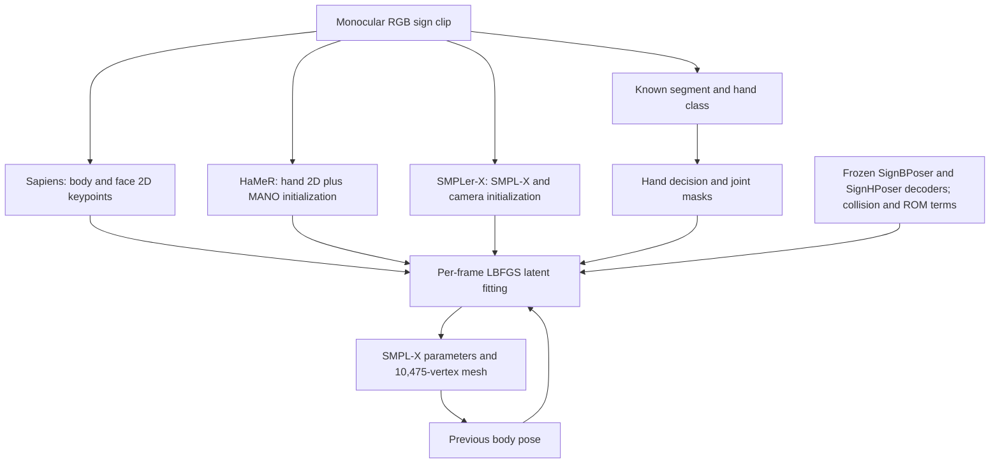

# Phase 1 - Technical deconstruction of DexAvatar

**Seed paper:** *DexAvatar: 3D Sign Language Reconstruction with Hand and Body Pose Priors* (Kundu et al., WACV 2026)

**Phạm vi:** chỉ giải phẫu seed paper, supplementary và implementation chính thức. Báo cáo này **không** kiểm tra novelty, không tìm SOTA sau DexAvatar, không đưa research gap, hypothesis hay method proposal.

## 0. Nguồn và quy ước bằng chứng

### Nguồn chính đã kiểm tra

1. PDF 21 trang do người dùng cung cấp: main paper, supplementary, references.
2. [Bản WACV 2026 chính thức](https://openaccess.thecvf.com/content/WACV2026/html/Kundu_DexAvatar_3D_Sign_Language_Reconstruction_with_Hand_and_Body_Pose_WACV_2026_paper.html).
3. Supplementary chính thức: PDF và bốn video `blur`, `occlusion`, `gaussian_noise`, `sgnify_baseline` trong gói supplementary của CVF.
4. [Repository DexAvatar chính thức](https://github.com/kaustesseract/DexAvatar), kiểm tra tại commit `a0dfd427f60f5811aadb35c8657b3856d47f56b5` (2026-05-03).
5. [Paper SGNify](https://openaccess.thecvf.com/content/CVPR2023/html/Forte_Reconstructing_Signing_Avatars_From_Video_Using_Linguistic_Priors_CVPR_2023_paper.html) và [repository SGNify](https://github.com/MPForte/SGNify), chỉ dùng để xác định chính xác định nghĩa TR-V2V mà DexAvatar kế thừa.

### Nhãn sử dụng trong báo cáo

- **FACT:** thông tin được paper, supplementary hoặc code chính thức phát biểu trực tiếp.
- **EVIDENCE:** vị trí/công thức/bảng/source code hỗ trợ FACT.
- **INFERENCE:** hệ quả kỹ thuật suy ra từ FACT; không phải tuyên bố trực tiếp của tác giả.
- **UNKNOWN / NOT REPORTED:** bằng chứng hiện có không đủ để kết luận.
- **HYPOTHESIS / SPECULATION:** không được đưa vào Phase 1.

Khi paper và code khác nhau, báo cáo tách rõ **paper-level method** và **released-code behavior**. Code hiện tại có thể đã được cập nhật sau thời điểm submission; vì vậy khác biệt được ghi nhận là khác biệt giữa hai nguồn, không mặc định nguồn nào phản ánh chính xác mọi thí nghiệm trong paper.

## 1. Kết luận kỹ thuật ngắn

1. **FACT:** DexAvatar là một pipeline fitting dựa trên SMPL-X. Nó không phải một video-to-mesh regressor end-to-end và không có temporal neural network.
2. **FACT:** cơ chế trung tâm là tối ưu latent của hai VAE pose prior chuyên biệt cho signing: SignBPoser cho 21 body joints và SignHPoser cho 15 joints của từng tay.
3. **FACT:** Sapiens cung cấp 2D body/face keypoints; HaMeR cung cấp 2D hand keypoints và MANO hand initialization; SMPLer-X cung cấp SMPL-X/camera initialization.
4. **FACT:** temporal model trong paper chỉ là regularizer giữa body pose hiện tại và body pose frame trước. Code dùng Geman-McClure trên body pose với hệ số cố định 2000; không có hand velocity/acceleration model hoặc sequence-window optimization.
5. **FACT:** paper nêu objective có body và hand biomechanical losses. Released fitting code chỉ triển khai body biomechanical loss; không tìm thấy hand biomechanical loss trong optimization.
6. **FACT:** paper gọi pipeline có “contact-aware terms”, nhưng objective và code không có contact-attraction/contact-label loss. `L_pen` chỉ phạt self-interpenetration.
7. **FACT:** released optimizer chỉ nhận body latent 33-D và một hoặc hai hand latents 23-D. Camera, global orientation, translation, shape, expression, jaw và eyes được khởi tạo nhưng không nằm trong danh sách biến tối ưu.
8. **FACT:** primary benchmark là 57 isolated German signs của SGNify. TR-V2V thực hiện translation alignment cho từng frame trước khi tính mean corresponding-vertex distance.
9. **FACT:** DexAvatar đạt `30.13 / 13.53 / 13.08 mm` cho Upper Body excluding face / Left Hand / Right Hand. So với baseline mạnh nhất trong chính Table 1 là EVA*, cải thiện tương ứng `25.38% / 1.46% / 4.39%`, không phải 35.11% cho cả ba vùng.
10. **FACT:** temporal consistency, contact accuracy, biomechanical violation rate, occlusion robustness và motion-blur robustness không được đánh giá định lượng. Blur/occlusion/noise chỉ có qualitative examples và supplementary videos.
11. **UNKNOWN:** DexAvatar có còn là current SOTA hay không. Câu hỏi này cố ý chưa được khảo sát trong Phase 1.

## 2. Research problem, input và output

### 2.1 Research problem

**FACT:** bài toán là khôi phục avatar SMPL-X 3D từ monocular RGB sign-language video, tập trung vào upper-body và fine-grained finger articulation trong điều kiện:

- depth ambiguity;
- rapid motion và motion blur;
- hand-hand/hand-body self-occlusion;
- noisy hoặc missing 2D keypoints;
- domain shift giữa general human pose data và signing motion.

**EVIDENCE:** Abstract, Introduction, Sec. 2-3 của main paper.

### 2.2 Input

**Paper-level FACT:** một sequence monocular RGB frames.

**Released-code FACT:** input thực tế còn cần:

- cấu trúc folder theo từng isolated sign;
- central-frame interval đã biết trong `data/segment.json`;
- class một tay/hai tay đã biết trong `data/signs.txt`;
- model/checkpoint và SMPL-X assets ngoài repository;
- kết quả preprocessing từ Sapiens, SMPLer-X và HaMeR.

**INFERENCE:** released pipeline không phải một hệ thống trực tiếp nhận arbitrary unsegmented continuous video rồi tự phát hiện sign boundaries.

### 2.3 Output

**FACT:** mỗi frame cho ra SMPL-X mesh topology cố định 10,475 vertices cùng parameterization gồm:

- body pose;
- left/right hand pose;
- global orientation và translation;
- body shape;
- facial expression, jaw và eyes.

**Released-code FACT:** phần được refinement trực tiếp là body pose latent và active hand pose latent(s). Các parameter còn lại chủ yếu được giữ từ initialization.

## 3. SMPL-X representation

### 3.1 Paper formulation

Supplementary S1 định nghĩa:

\[
\mathcal{M}(\beta,\theta,\psi)=W(T_P(\beta,\theta,\psi),J(\beta),\theta,\mathcal{W}),
\]

với:

\[
T_P(\beta,\theta,\psi)=\bar T+B_S(\beta;S)+B_E(\psi;E)+B_P(\theta;P).
\]

- \(N=10{,}475\) vertices.
- \(K=54\) articulated joints, cộng global rotation trong ký hiệu \(\theta\in\mathbb{R}^{3(K+1)}\).
- \(\beta\): shape coefficients.
- \(\psi\): facial-expression coefficients.
- \(B_S,B_E,B_P\): shape/expression/pose corrective blend shapes.
- \(W\): linear blend skinning.

### 3.2 Parameter state trong released code

| Parameter | Initialization | Có được optimizer update? | Ghi chú |
| --- | --- | --- | --- |
| Body pose, 21 x 3 axis-angle | SMPLer-X supervision; latent bắt đầu từ zero | **Có**, qua SignBPoser latent \(\bar\zeta\in\mathbb{R}^{33}\) | Decoder output 63-D axis-angle |
| Left hand, 15 x 3 | HaMeR MANO pose | Có nếu two-handed hoặc left active | SignHPoser latent 23-D |
| Right hand, 15 x 3 | HaMeR MANO pose | Có nếu two-handed hoặc right active | SignHPoser latent 23-D |
| Global orientation | SMPLer-X | Không | Reset rồi giữ cố định |
| Translation | SMPLer-X | Không | Không nằm trong `final_params` |
| Camera intrinsics \(K\) | SMPLer-X focal/principal point | Không | Projection dùng ma trận 3 x 3 cố định |
| Shape \(\beta\) | Mean SMPLer-X shape trên clip | Không | Code vẫn cộng shape prior, nhưng term này hằng theo latent |
| Expression \(\psi\) | SMPLer-X | Không | Có face joint/prior terms nhưng expression không được optimize |
| Jaw/eyes | SMPLer-X | Không | Không nằm trong optimizer |

**EVIDENCE:** `M3_mean_shape_smplerx.py`, `data_parser.py`, `fit_single_frame.py`, `fitting.py` trong [official code](https://github.com/kaustesseract/DexAvatar/tree/a0dfd427f60f5811aadb35c8657b3856d47f56b5).

## 4. Complete pipeline

### 4.1 RGB video -> observations

1. Sapiens 1B whole-body pose model được chạy trên từng frame.
2. HaMeR phát hiện tay, ước lượng 2D hand keypoints, MANO pose và 3D hand joints.
3. SMPLer-X tạo per-frame SMPL-X initialization và camera intrinsics.
4. Precomputed sign interval chọn central frames.
5. Precomputed sign class quyết định one-handed hoặc two-handed handling.

### 4.2 Observations -> initialization

- Body/face/shape/global pose/translation/camera bắt đầu từ SMPLer-X.
- Hand pose initialization được thay bằng HaMeR MANO rotation.
- Shape được lấy trung bình qua các frame SMPLer-X trong clip.
- Với one-handed sign, active side được suy ra bằng mean inter-frame Sapiens wrist displacement; side còn lại bị giảm/zero observation weights và không có SignHPoser latent trong optimizer.

### 4.3 Initialization -> latent fitting

- SignBPoser decode body latent thành body pose.
- SignHPoser decode independent left/right latents thành hand poses.
- LBFGS line-search tối ưu theo ba stages.
- Loss gồm 2D reprojection, latent priors, strong initialization matching, temporal body term, body ROM term, angle prior và collision penalty.

### 4.4 Latent fitting -> output

- Decoded poses được đưa vào SMPL-X layer.
- Mesh `.obj`, parameter `.pkl` và rendered overlay được lưu cho từng frame.
- Body pose của frame hiện tại được chuyển thành target temporal cho frame kế tiếp.

## 5. Data preprocessing để huấn luyện priors

### 5.1 SignBPoser body data

**FACT:** source là một subset của 3D data do SignAvatars công bố, được reconstruct từ How2Sign. Đây là pseudo-ground truth.

**FACT:** authors lọc bỏ frame nếu shoulder, elbow/forearm hoặc wrist rotations vượt:

- clinical range of motion;
- torso-anchored signer-space envelope;
- shoulder horizontal ad/abduction constraints.

**FACT:** body preprocessing là **filter/rejection**, không phải correction: frame không hợp lệ bị loại.

**UNKNOWN / NOT REPORTED:** số clips/frames trước và sau filtering, signer split, DEV/TEST construction, signer overlap và tỷ lệ loại bỏ.

### 5.2 SignHPoser hand data acquisition

**FACT:** authors thu mocap mới bằng:

- 9 Vicon high-resolution cameras;
- Manus gloves;
- 8 signers: 6 proficient Auslan và 2 fluent ASL;
- 93 curated fingerspelling words, đánh vần từng ký tự.

**FACT:** data được retarget sang SMPL-X rig trong Blender bằng Rokoko plugin. IK cho phép arms theo wrist trajectories của gloves.

**FACT:** supplementary nói wrist rotations không thể transfer chính xác vì khác biệt giữa SMPL-X T-pose và MANUS bone roll; cuối cùng animation được bake thành per-frame rotations.

**INFERENCE:** SignHPoser học 15 local finger joints, không trực tiếp học global wrist orientation; wrist thuộc body pose pathway.

### 5.3 Hand data correction

**FACT:** raw hand pose được sửa bằng per-joint bounds trên ba Euler components:

- bending;
- splaying;
- twisting.

Axes MANO được align với anatomical axes theo prior work. Không giống body filter, hand preprocessing **rectifies** invalid geometry thay vì loại toàn bộ frame.

**UNKNOWN / NOT REPORTED:** correction algorithm chi tiết, tie-breaking khi nhiều constraints đồng thời vi phạm, dataset size sau correction, inter-rater/anatomical validation và code preprocessing.

## 6. SignBPoser và SignHPoser

### 6.1 Architecture

**FACT:** cả hai là encoder-decoder VAEs:

- 3 linear layers;
- hidden/embedding width 512;
- Adam, learning rate \(10^{-3}\);
- best released fitting dimensions: 33-D body latent và 23-D per-hand latent.

Input được mô tả là per-joint rotation matrices \(R\in\mathbb{R}^{3\times3}\); reconstruction target được mô tả là axis-angle \(\alpha\). Decoder output được code sử dụng ở dạng axis-angle.

### 6.2 Prior training objective

\[
\mathcal{L}_{\text{VAE}} = c_1\mathcal{L}_{KL}+c_2\mathcal{L}_{recon}+c_3\mathcal{L}_{mesh}+c_4\mathcal{L}_{orth}+c_5\mathcal{L}_{reg}+c_6\mathcal{L}_{biomech}.
\]

| Term | Paper definition | Chức năng |
| --- | --- | --- |
| \(L_{KL}\) | \(KL(q(Z\mid R)\|\mathcal{N}(0,I))\) | Gaussian latent manifold |
| \(L_{recon}\) | \(\|\alpha-\hat\alpha\|_2^2\) | Rotation reconstruction |
| \(L_{mesh}\) | \(\|M-\hat M\|_2^2\) | Vertex fidelity qua SMPL-X |
| \(L_{orth}\) | \(\|\hat R\hat R^\top-I\|_2^2\) | Rotation orthogonality |
| \(L_{reg}\) | \(\|\phi\|_2^2\) | Weight decay |
| \(L_{biomech}\) | squared hinge ngoài per-joint bounds | Anatomical plausibility |

Training weights:

| Prior | \(c_1\) KL | \(c_2\) recon | \(c_3\) mesh | \(c_4\) orth | \(c_5\) reg | \(c_6\) biomech |
| --- | ---: | ---: | ---: | ---: | ---: | ---: |
| SignBPoser | 0.001 | 0.999 | 0.999 | 0.01 | 0.0001 | 1.5 |
| SignHPoser | 0.0001 | 0.999 | 0.999 | 0.01 | 0.0001 | 1.5 |

**Technical caveat:** Eq. (9) chỉ enforce orthogonality; bản thân \(\|RR^T-I\|\) không enforce determinant \(+1\), dù prose nói cả unit determinant. Paper không nêu thêm determinant term.

### 6.3 Variants trong ablation

- `BPu`: unfiltered body data.
- `BPf`: biomechanically filtered body data.
- `BPf+bio`: filtered data + biomechanical training loss.
- `HPu`: uncorrected hand data.
- `HPf`: biomechanically corrected hand data.
- `HPf+bio`: corrected data + biomechanical training loss.

Final pipeline dùng `BPf` cộng body biomechanical optimization loss; hand result tốt nhất dùng `HPf+bio` theo Table 3, mặc dù right-hand error tăng rất nhẹ so với `HPf`.

### 6.4 Priors dùng và bỏ qua thông tin gì?

**Dùng:** pose rotations, SMPL-X mesh geometry, Gaussian latent regularization, anatomical bounds, signing-domain pose samples.

**Không dùng trực tiếp:** RGB appearance, image uncertainty, occlusion masks, signer identity, sign gloss, phonological labels, hand-hand contact labels, velocity/acceleration, facial semantics.

**INFERENCE:** câu “preserve phonologically meaningful variations” chưa được một label-supervised phonology loss hoặc phonological evaluation chứng minh trong paper; evidence trực tiếp là domain-specific pose reconstruction, không phải phonological decoding.

## 7. Mathematical objective

### 7.1 SMPLify-X background objective

Paper trình bày baseline:

\[
\mathcal{L}=\mathcal{L}_{joint}+\lambda_\zeta\mathcal{L}_\zeta+\lambda_{pen}\mathcal{L}_{pen}.
\]

2D joint reprojection:

\[
\mathcal{L}_{joint}=\frac{1}{|J|}\sum_{i\in J}\gamma_i\omega_i\rho\left(\Pi(D_i)-K_i\right),
\]

trong đó \(\rho\) là Geman-McClure robustifier, \(\omega_i\) là detection confidence và \(\gamma_i\) là predefined joint weight.

Gaussian latent prior:

\[
\mathcal{L}_{\zeta}=\sum_{i=1}^{d}\frac{\zeta_i^2}{\sigma_i^2},\quad \sigma_i^2=1.
\]

`L_pen` dùng BVH collision pairs và bidirectional conic signed-distance penetration penalty.

### 7.2 DexAvatar objective trong paper

\[
\begin{aligned}
\mathcal{L}={}&\mathcal{L}_{joint}
+\lambda_1\mathcal{L}_{bprior}
+\lambda_2\mathcal{L}_{hprior}
+\lambda_3\mathcal{L}_{pen}\\
&+\lambda_4\mathcal{L}_{temp}
+\lambda_5\mathcal{L}_{bbiomech}
+\lambda_6\mathcal{L}_{hbiomech}.
\end{aligned}
\]

Body prior:

\[
\mathcal{L}_{bprior}=\rho(\theta_b-\hat\theta_b)+\lambda_{\bar\zeta}\mathcal{L}_{\bar\zeta},\quad \theta_b=D_B(\bar\zeta).
\]

Hand prior:

\[
\mathcal{L}_{hprior}=\rho(\theta_h-\hat\theta_h)+\lambda_{\epsilon_l}\mathcal{L}_{\epsilon_l}+\lambda_{\epsilon_r}\mathcal{L}_{\epsilon_r},
\]

với independent per-hand latents.

Temporal body term:

\[
\mathcal{L}_{temp}=\rho(\theta_{b,t}-\theta_{b,t-1}).
\]

Biomechanical hinge:

\[
\mathcal{L}_{biomech}=\sum_{j=1}^{J}\left\|\max(\theta_j-\theta_{j,max},\theta_{j,min}-\theta_j,0)\right\|_2^2.
\]

Paper áp dụng \(J=6\) body joints và \(J=15\) hand joints.

### 7.3 Effective objective trong released code

Với \(\theta_{b,t}=D_B(z_t)\), \(\theta^l_{h,t}=D_H(\epsilon^l_t)\), \(\theta^r_{h,t}=D_H(\epsilon^r_t)\), released code thực tế cộng:

1. confidence-weighted robust 2D reprojection;
2. latent L2 penalty cho body và active hand(s);
3. L1 matching từ decoded body/hand pose tới SMPLer-X/HaMeR initialization;
4. thêm robust matching tới HaMeR hand rotations;
5. first-order body-pose temporal Geman-McClure term, fixed weight 2000;
6. body angle-ROM hinge, weight 100 trong cả ba stages;
7. SMPLify angle prior;
8. mesh self-penetration penalty;
9. shape/expression/jaw prior terms, dù corresponding variables không nằm trong optimizer.

Code còn tính một normalized wrist-relative HaMeR 3D hand-depth term, nhưng released config đặt `data_3d_weights = [0,0,0]`; vì vậy term này không ảnh hưởng fitting trong config chính thức.

### 7.4 Ba optimization stages trong released config

| Weight | Stage 1 | Stage 2 | Stage 3 |
| --- | ---: | ---: | ---: |
| Body latent prior | 4.78 | 4.78 | 4.78 |
| Hand latent prior | 0 | 4.78 | 4.78 |
| Body 2D joints | 0.5 | 1.0 | 1.5 |
| Hand 2D joints | 0.5 | 1.5 | 2.5 |
| Face 2D joints | 1.0 | 1.0 | 2.0 |
| Collision | 0.5 | 1.0 | 1.5 |
| Body biomechanics | 100 | 100 | 100 |
| Body init matching | 1200 | 1200 | 1200 |
| Left/right hand init matching | 1200 | 1200 | 1200 |
| Explicit HaMeR 3D depth | 0 | 0 | 0 |

Optimizer: LBFGS with strong-Wolfe line search, learning rate 0.5, `maxiters=30`, `ftol=gtol=1e-9` theo YAML. `maxiters` được truyền cả vào fitting monitor lẫn custom LBFGS optimizer; vì một `optimizer.step(closure)` có thể có nhiều internal evaluations, không nên diễn giải đơn giản là đúng 30 closure evaluations mỗi stage.

### 7.5 Paper-code mismatches có ý nghĩa

| Topic | Paper | Released code |
| --- | --- | --- |
| Optimization variables | Preliminaries nói optimize \(\beta,\psi,\theta\); DexAvatar section không liệt kê đầy đủ | Chỉ body latent và active hand latent(s) trong `final_params` |
| Camera optimization | Nói sử dụng initial camera parameters | Camera matrix cố định; camera-init loss được tạo nhưng không được chạy |
| Hand biomechanics khi fitting | Có \(\lambda_6L_{hbiomech}\) | Không tìm thấy hand biomechanical fitting term |
| Body biomechanics | Squared L2 hinge theo Eq. (11) | Mean unsquared hinge sau axis-angle-to-Euler conversion |
| Contact-aware term | Contribution text dùng cụm “contact-aware terms” | Chỉ có repulsive penetration loss; không có contact attraction/label loss |
| 3D hand observation | Text nêu 3D hand parameters/estimates | 3D hand-depth residual tồn tại nhưng weight bằng 0 trong released config |
| Non-dominant arm disabled | Paper nói shoulder/elbow/wrist bị disable qua \(\omega_i=0\) | 2D weights bị zero, nhưng shared body latent vẫn decode cả hai arms và vẫn chịu strong SMPLer-X initialization loss |

## 8. Temporal modeling

### 8.1 Cơ chế được dùng

**FACT:** frames được xử lý tuần tự. Sau frame \(t\), decoded 21-joint body pose được lưu làm `joints_temp` cho frame \(t+1\).

**FACT:** frame đầu dùng SMPLer-X body pose làm temporal reference.

**FACT:** released loss là:

\[
2000\sum \operatorname{GMoF}(\theta_{b,t}-\theta_{b,t-1};\rho=100).
\]

### 8.2 Không được mô hình hóa

- không optimize toàn sequence/window đồng thời;
- không có bidirectional context;
- không có velocity/acceleration/jerk loss;
- không có hand temporal term trong final objective;
- không có learned dynamics hoặc motion prior;
- không có timestamp/frame-rate normalization;
- không có explicit uncertainty propagation.

**INFERENCE:** cơ chế này khuyến khích smoothness nhưng có thể tạo lag hoặc over-smoothing khi motion thật thay đổi nhanh. Paper không đo temporal lag hoặc high-frequency attenuation.

## 9. Biomechanical constraints

### 9.1 Ba nơi biomechanics được dùng theo paper

1. body-data filtering;
2. hand-data correction;
3. prior training và final fitting regularization.

### 9.2 Released body ROM bounds

Code áp dụng XYZ Euler bounds cho sáu joints cuối của 21-body-joint pose:

| Joint | Min degrees (XYZ) | Max degrees (XYZ) |
| --- | --- | --- |
| Left shoulder | (-120, -130, -80) | (90, 0, 80) |
| Right shoulder | (-120, 0, -80) | (90, 130, 80) |
| Left elbow | (-120, -160, -140) | (90, 0, 140) |
| Right elbow | (-120, 0, -140) | (90, 160, 140) |
| Left wrist | (-120, -50, -90) | (90, 50, 90) |
| Right wrist | (-120, -50, -90) | (90, 50, 90) |

**UNKNOWN:** mapping đầy đủ giữa từng XYZ component và clinical flexion/extension, ab/adduction, pronation/supination không được serialized thành một protocol dễ tái lập trong paper.

### 9.3 Evidence strength

**FACT:** filtered body data và corrected hand data thường cải thiện TR-V2V so với unfiltered/uncorrected variants.

**FACT:** thêm biomechanical loss trong prior training không luôn tốt hơn. `BPf+bio` kém `BPf` trên cả bốn body subsets; authors gọi đây là mild over-regularization.

**NOT MEASURED:** percentage of violated joints, maximum ROM violation, collision/contact correctness hoặc clinical validity.

## 10. Hand-body contact, self-occlusion và handedness

### 10.1 Contact handling

**FACT:** `L_pen` phát hiện colliding triangle pairs bằng BVH và phạt penetration depth.

**FACT:** không có term kéo hai surfaces về contact, không có intended-contact label, không có contact persistence hoặc normal-alignment term trong DexAvatar code.

**INFERENCE:** plausible contact trong figures/videos là kết quả gián tiếp của 2D evidence, initialization, priors, temporal smoothness và collision avoidance; không phải explicit contact reconstruction.

### 10.2 Occlusion handling

**FACT:** không có visibility mask, differentiable occlusion reasoning, per-keypoint uncertainty distribution hoặc occlusion state.

Robustness đến từ:

- detector confidence trong 2D loss;
- Geman-McClure robustifier;
- sign-domain latent priors;
- previous-frame body regularization;
- one-handed previous-detection fallback trong data parser;
- collision penalty.

**Released-code FACT:** frames thiếu mọi HaMeR detection hoặc thiếu SMPLer-X file bị loại trước fitting. Với two-handed class, code giả định hai HaMeR detections khi lặp `range(2)`; partial one-hand detection trong một two-handed frame không được xử lý rõ ràng.

### 10.3 One-hand/two-hand handling

**Paper FACT:** một classifier kế thừa từ SGNify phân biệt one-handed và two-handed sign.

**Code FACT:** repository dùng precomputed mapping theo tên folder. `0` là one-handed; mọi label khác `0` được xử lý như two-handed. Pipeline không chạy classifier trong fitting script.

**Code FACT:** active hand trong one-handed clip được suy ra từ average wrist-motion score của Sapiens. Nếu hai scores gần nhau trong ratio 1.2, state là ambiguous; downstream boolean làm trường hợp này đi theo left-hand branch.

### 10.4 Sign-language semantics

**Có:** binary one/two-handed class và signing-domain training data.

**Không có:** gloss, sign identity, HamNoSys features trong fitting objective, phonological feature labels, lexical context, non-manual grammatical semantics hoặc language model.

## 11. Module-by-module decomposition

### 11.1 Chức năng, input, assumption và failure mode

| Module | Vấn đề giải quyết | Thông tin dùng | Assumption | Thông tin bỏ qua | Likely failure mode | Frame/sequence |
| --- | --- | --- | --- | --- | --- | --- |
| Sign segmentation/class files | Chọn central sign interval và handedness | Folder/sign name, precomputed interval/class | Sign đã biết và isolated | Unknown boundaries, continuous co-articulation | Sai crop thời gian hoặc class làm sai joint masking | Sequence metadata |
| Sapiens | 2D body/face observations | RGB frame | Keypoints/confidence đáng tin | Depth, mesh, contact | Blur/crop/occlusion làm sai/missing joints | Frame |
| SMPLer-X | Body/shape/camera/global initialization | RGB frame | General model transfer được sang SL | Sign-specific hand detail | Domain shift, cropped lower body, depth ambiguity | Frame; shape được average theo clip |
| HaMeR | Hand detection, 2D keypoints, MANO init | RGB hand crops | Tay được detect và side đúng | Hand-hand identity continuity, semantic contact | Merged hands, blur, wrong left/right ordering | Frame; fallback previous detection cho one-hand |
| Hand decision maker | Loại evidence non-dominant | Precomputed class + Sapiens wrist motion | One-hand motion score phân tách rõ | Passive-hand semantic roles | Ambiguous side, passive hand vẫn quan trọng | Sequence class + frame weights |
| SignBPoser | Constrain upper-body signing pose | 33-D latent, body pose training data | Training manifold phủ target motion | Appearance, contact, dynamics | Out-of-distribution signer/style/pose | Frame latent |
| SignHPoser | Constrain finger articulation | 23-D latent per hand, fingerspelling mocap | Fingerspelling manifold phủ target handshapes | Wrist/global hand pose, contact, language semantics | Non-fingerspelling or interacting handshape OOD | Frame latent |
| 2D reprojection | Image alignment | Sapiens/HaMeR joints + confidence | Correct correspondence/calibration | Depth ambiguity | 3D pose sai nhưng projection đúng | Frame |
| Initialization matching | Giữ fit gần off-the-shelf pose | SMPLer-X/HaMeR axis-angle | Initialization gần optimum | Detector bias | Strong weight khóa fit vào biased init | Frame |
| Temporal loss | Giảm body jitter | Previous body pose | Consecutive frames và motion smooth | Hand dynamics, acceleration | Oversmoothing/lag | One-step sequence |
| Body biomechanics | Tránh ROM violation | Euler bounds | Axis convention đúng, bounds generalize | Coupled-joint biomechanics | Gimbal/axis mismatch, over-regularization | Frame |
| Penetration loss | Tránh self-intersection | SMPL-X triangles | Collision detector và part filtering đúng | Intended contact | Repel valid near-contact hoặc bỏ sót contact topology | Frame |
| SMPL-X layer | Joint body/hand/face mesh | Pose, shape, expression | Parametric topology đủ biểu đạt signer | Clothing/hair/non-rigid surface | Shape/appearance mismatch | Frame |

### 11.2 Explicit modeling matrix

| Module | Uncertainty | Occlusion | Interaction/contact | SL semantics |
| --- | --- | --- | --- | --- |
| Sapiens/HaMeR observations | Confidence scalar only | Indirect via detector | No | No |
| SMPLer-X initialization | No distribution | Indirect | No | No |
| Hand decision | No | No | No | Binary handedness only |
| SignBPoser | Gaussian latent prior, not observation uncertainty | No | No | Domain data only |
| SignHPoser | Gaussian latent prior, not observation uncertainty | No | No | Domain data only |
| Temporal term | No | Indirect stabilization | No | No |
| Penetration term | No | No | Repulsion only | No |
| Biomechanics | No | No | No | Signer-space constraint for body |

## 12. Training data và evaluation data

### 12.1 Training data summary

| Component | Data | Supervision | Scale reported? | Main risk |
| --- | --- | --- | --- | --- |
| SignBPoser | SignAvatars subset derived from How2Sign | Pseudo-GT SMPL-X | **Không** | Pseudo-label noise/bias |
| SignHPoser | New Vicon + Manus fingerspelling capture | Retargeted SMPL-X/MANO rotations | 8 signers, 93 words; frame count **không** | Small signer pool, fingerspelling bias, retargeting error |

Repository phát hành links tải pretrained priors nhưng không chứa training pipeline/data preprocessing đầy đủ trong tree chính. Vì vậy paper-level prior training chưa reproducible end-to-end chỉ từ repository.

### 12.2 Evaluation data

**FACT:** SGNify mocap benchmark:

- 57 isolated DGS signs;
- one native German signer trong original SGNify capture;
- synchronized frontal RGB và 54-camera Vicon setup;
- personalized SMPL-X ground truth từ body scans + MoSh++;
- central expressive portions được đánh giá;
- paper báo cáo 2,872 RGB frames.

**Code discrepancy:** tổng `end-start` trong released `segment.json` bằng 2,872, nhưng code chọn cả hai endpoints (`start <= frame <= end`), tạo 2,929 candidate frames trước khi bỏ frames thiếu HaMeR/SMPLer-X. Exact evaluated-frame list không được repository công bố thành manifest.

**Qualitative robustness data:** MM-WLAuslan được dùng cho ba ví dụ mỗi nhóm blur, self-occlusion và added Gaussian noise; không có ground-truth TR-V2V cho các ví dụ này.

## 13. Evaluation protocol và metrics

### 13.1 TR-V2V

SGNify định nghĩa prefix `TR` là **translational alignment per frame**: predicted và ground-truth meshes được center trước khi tính corresponding vertex distances.

Với region vertex set \(\mathcal{R}\):

\[
\operatorname{TR\mbox{-}V2V}_{\mathcal R}=
\frac{1}{|\mathcal R|}\sum_{i\in\mathcal R}
\left\|
(v_i-c(V))-(v_i^{gt}-c(V^{gt}))
\right\|_2.
\]

Ở đây \(c(\cdot)\) là centering operation; paper nói “center the meshes” nhưng không chỉ rõ center lấy trên full mesh hay region subset.

Regions:

- **Upper Body excluding face, UBody(-F):** vertices above pelvis, gồm head nhưng bỏ face;
- **Left Hand**;
- **Right Hand**.

Đơn vị: millimeters. Vì topology SMPL-X tương ứng, metric dùng vertex correspondence trực tiếp, không nearest-neighbor matching.

### 13.2 MPJPE và MPVPE

**FACT:** dùng để đánh giá reconstruction của SignBPoser/SignHPoser trên DEV/TEST trong Tables S1-S2.

**NOT REPORTED:** units, alignment, exact joint/vertex subsets, split sizes và whether results are averaged per frame, per signer hay per clip. Giá trị này không thể được xem là directly comparable với final TR-V2V table.

### 13.3 Coverage của các metric người dùng quan tâm

| Metric/criterion | Có trong paper? | Mức bằng chứng |
| --- | --- | --- |
| TR-V2V UBody(-F) | Có | Quantitative primary |
| TR-V2V Left/Right Hand | Có | Quantitative primary |
| MPJPE | Có | Prior reconstruction only; protocol thiếu |
| MPVPE | Có | Prior reconstruction only; protocol thiếu |
| Temporal consistency | Không có metric | Chỉ loss + visual claim |
| Contact accuracy | Không | Qualitative hand-contact examples only |
| Biomechanical plausibility | Không có violation metric | Data/prior ablation + qualitative |
| Occlusion robustness | Không định lượng | 3 qualitative examples/video |
| Motion-blur robustness | Không định lượng | 3 qualitative examples/video |
| Gaussian-noise robustness | Không định lượng | 3 examples; noise magnitude không báo cáo |

## 14. Baselines và quantitative results

### 14.1 Table 1

| Method | UBody(-F) mm | LHand mm | RHand mm |
| --- | ---: | ---: | ---: |
| FrankMoCap | 78.07 | 20.47 | 19.62 |
| PIXIE | 60.11 | 25.02 | 22.42 |
| PyMAF-X | 68.61 | 21.46 | 19.19 |
| SMPLify-SL | 56.07 | 22.23 | 18.83 |
| SGNify | 55.63 | 19.22 | 17.50 |
| OSX | 47.32 | 18.34 | 18.12 |
| Neural Sign Actors | 46.42 | 16.17 | 15.23 |
| EVA* | 40.38 | 13.73 | 13.68 |
| **DexAvatar** | **30.13** | **13.53** | **13.08** |

`EVA*` là modification do authors thực hiện để hỗ trợ one-handed signs; implementation/protocol chi tiết của modification không được mô tả đầy đủ.

### 14.2 Relative improvement

So với Neural Sign Actors, paper báo cáo khoảng:

- UBody(-F): 35.09% (paper ghi 35.11%);
- LHand: 16.33%;
- RHand: 14.12%.

So với baseline mạnh nhất theo từng cột trong chính bảng là EVA*:

- UBody(-F): **25.38%**;
- LHand: **1.46%**;
- RHand: **4.39%**.

**INFERENCE:** headline 35.11% phản ánh comparison với Neural Sign Actors ở upper body, không phải margin trên strongest table baseline cho cả body và hands.

### 14.3 Statistical evidence missing

- không confidence interval;
- không per-sign variance;
- không significance test;
- không multiple seeds;
- không runtime/latency comparison;
- không exact frame manifest để kiểm tra paired evaluation.

## 15. Ablation studies

### 15.1 SignBPoser in full fitting

| Variant | FBody | UBody | UBody(-H) | UBody(-F) |
| --- | ---: | ---: | ---: | ---: |
| BPu | 43.18 | 29.95 | 44.72 | 34.06 |
| BPf | **42.32** | **26.78** | **41.35** | **30.28** |
| BPf+bio | 42.38 | 26.93 | 41.88 | 30.44 |

**FACT:** filtering giúp đáng kể; biomechanical loss trong prior training gây nhẹ over-regularization. Authors nói giữ BPf và thêm body biomechanical loss trong fitting cho best result, nhưng row này không có trong Table 2.

### 15.2 SignHPoser in full fitting

| Variant | UBody(-F) | LHand | RHand |
| --- | ---: | ---: | ---: |
| HPu | 31.34 | 14.19 | 13.92 |
| HPf | 30.17 | 13.55 | **13.06** |
| HPf+bio | **30.13** | **13.53** | 13.08 |

Correction data mang gain rõ; training biomechanical regularizer chỉ thay đổi rất nhỏ và không thắng trên right hand.

### 15.3 SignHPoser with generic VPoser body prior

| Variant | UBody(-F) | LHand | RHand |
| --- | ---: | ---: | ---: |
| HPu | 37.25 | 13.56 | 14.53 |
| HPf | 36.79 | 13.39 | 14.06 |
| HPf+bio | 36.77 | 13.37 | 13.82 |

**INFERENCE:** SignBPoser chủ yếu tạo gain ở upper-body, còn SignHPoser correction tạo hand gain tương đối nhỏ nhưng nhất quán trong configuration này.

### 15.4 Hyperparameter evidence

Tables S1-S2 sweep:

- body latents 31/32/33;
- hand latents 22/23/24;
- biomechanical weights 0.5/1.5/2.5.

**Concern:** supplementary nói “select the best hyperparameter ... on the DEV and TEST sets”. Nếu hiểu literal là lựa chọn configuration riêng theo TEST thì TEST không còn held-out. Wording không đủ rõ để kết luận chắc chắn có leakage, nhưng protocol cần làm rõ.

### 15.5 Missing ablations

Không có controlled ablation cho:

- temporal loss;
- collision/interpenetration loss;
- Hand Decision Maker;
- Sapiens vs other 2D detectors;
- HaMeR pose initialization hoặc hand keypoints;
- SMPLer-X initialization;
- fixed mean shape;
- face/lower-body masking;
- explicit 3D HaMeR term;
- one-handed fallback;
- contact handling;
- compute/iteration count.

Vì vậy paper chưa tách được contribution định lượng của nhiều thành phần optimization ngoài pose-prior/data-cleaning variants.

## 16. Qualitative results, failure cases và limitations

### 16.1 Qualitative evidence shown

Main Fig. 5 so sánh `Sonne`, `BesuchenEinmischen`, `Muell` với PIXIE, PyMAF-X, SGNify, OSX, EVA*.

Supplementary:

- Fig. S7 so sánh DexAvatar với một số SGNify GT hands mà authors cho là implausible;
- Fig. S8: motion blur;
- Fig. S9: self-occlusion;
- Fig. S10: added Gaussian noise;
- videos cho từng scenario và SGNify baseline.

**FACT:** các robustness results là selected qualitative examples, không phải benchmark accuracy.

### 16.2 Explicit limitations của authors

1. SGNify ground truth có occasional collapsed fingers và irregular knuckle spacing.
2. TR-V2V có thể phạt một anatomically plausible prediction nếu GT implausible.
3. Future work: scale training data và cover nhiều signer/signing styles hơn.

### 16.3 Failure cases không được báo cáo trực tiếp

Paper không trình bày một gallery nơi DexAvatar thất bại rõ ràng, không có failure frequency và không có taxonomy lỗi trên toàn 57 signs.

### 16.4 Evidence-based likely failure modes

Các mục sau là **INFERENCE** từ dependency/assumption, không phải reported failure rate:

1. **Detector failure:** nếu HaMeR không detect tay hoặc merge hai tay, fitting thiếu/nhầm evidence; một số frames bị drop.
2. **Strong-init bias:** body/hand init matching weight 1200 có thể giữ kết quả gần sai số SMPLer-X/HaMeR.
3. **Temporal lag:** first-order previous-pose regularizer có thể làm chậm fast articulation.
4. **Hand OOD:** SignHPoser học từ 8 signers và fingerspelling words; complex lexical/contact handshapes có thể nằm ngoài manifold.
5. **Body OOD:** SignBPoser học từ pseudo-GT How2Sign/SignAvatars; unusual torso/arm configuration hoặc language/style khác có thể bị regularize sai.
6. **Handedness error:** precomputed class hoặc wrist-motion side decision sai sẽ zero đúng tay và optimize sai tay.
7. **Contact ambiguity:** collision-only term không xác định intended touch, overlap order hoặc contact persistence.
8. **Face limitation:** face excluded khỏi TR-V2V, và released optimizer không refine expression/jaw variables.
9. **Shape/camera limitation:** fixed per-clip mean shape và fixed camera không sửa được initialization bias.
10. **Metric mismatch:** plausible hand có thể có TR-V2V xấu hơn implausible GT.

## 17. Strengths

1. Domain-specific hand và body pose manifolds thay cho một generic VPoser-only assumption.
2. Tách body prior và independent hand priors, phù hợp khác biệt DOF và data availability.
3. Hand prior dựa trên dedicated glove/Vicon capture thay vì hoàn toàn pseudo-labels.
4. Biomechanical cleaning được đánh giá qua multiple variants; filtering/correction có gain nhất quán.
5. Tích hợp được với SMPL-X fitting và off-the-shelf detectors hiện có.
6. Đánh giá trên mocap-synchronized DGS benchmark với identical SMPL-X topology.
7. Cung cấp official code, pretrained-prior links, segment/class files và qualitative supplementary videos.
8. Cross-language evidence sơ bộ: ASL/Auslan training sources, DGS quantitative evaluation, MM-WLAuslan qualitative evaluation.

## 18. Weaknesses

1. Prior training data scale/splits và preprocessing code chưa đủ để tái lập.
2. Released fitting behavior khác paper objective ở hand biomechanics, variables optimized và contact wording.
3. Không explicit uncertainty/visibility/contact model.
4. Temporal model rất ngắn hạn và chỉ áp dụng body pose.
5. Primary evidence là một signer, isolated-sign benchmark.
6. Hand SOTA margin so với EVA* nhỏ: 1.46% left và 4.39% right.
7. Không statistical uncertainty hoặc per-sign distribution.
8. MPJPE/MPVPE protocol thiếu units/alignment/splits.
9. Robustness/contact/biomechanics không được lượng hóa.
10. Ablations không isolate phần lớn pipeline components.
11. One-handed logic dựa trên external/precomputed class và heuristic active-side motion.
12. Evaluation frame count có mismatch giữa paper và inclusive code intervals.
13. Face được mô hình hóa trong SMPL-X nhưng không phải trọng tâm evaluation và không được released optimizer refine.

## 19. Potential bottlenecks - chưa đề xuất giải pháp

### Bottleneck 1: observation quality

**Chain:** RGB blur/occlusion -> Sapiens/HaMeR error -> wrong reprojection/init targets -> latent fitting bị kéo sai.

### Bottleneck 2: strong dependence on initialization

**Chain:** SMPLer-X/HaMeR bias -> L1 init weight 1200 -> limited departure from initialization -> residual body/hand error.

### Bottleneck 3: prior coverage

**Chain:** small/biased body-hand training sets -> target pose outside manifold -> latent prior favors anatomically common nhưng semantically wrong articulation.

### Bottleneck 4: monocular depth ambiguity

**Chain:** identical 2D projections -> weak depth evidence; released 3D HaMeR depth weight bằng 0 -> depth/orientation phụ thuộc initialization và priors.

### Bottleneck 5: temporal under-modeling

**Chain:** one-step body smoothness only -> hand jitter/occlusion không được sequence context giải quyết -> per-frame hand inconsistency có thể tồn tại.

### Bottleneck 6: contact under-modeling

**Chain:** penetration repulsion without intended contact -> correct surface proximity/overlap order không được xác định -> contact geometry có thể plausible nhưng không accurate.

### Bottleneck 7: evaluation ceiling/noise

**Chain:** occasional implausible GT + per-frame TR-V2V -> anatomical improvement không luôn giảm metric -> metric có thể không phản ánh đúng signing quality.

### Bottleneck 8: benchmark generalization

**Chain:** one-signer isolated DGS test -> limited evidence về unseen signers, continuous co-articulation, clothing, camera motion và real-world domain shift.

## 20. Answers to the 25 requested items

| # | Requested item | Deconstruction result |
| ---: | --- | --- |
| 1 | Research problem | Monocular RGB sign clip -> SMPL-X body/hand reconstruction under ambiguity, blur, occlusion |
| 2 | Input/output | RGB frames + external segment/class metadata -> per-frame SMPL-X parameters/mesh |
| 3 | SMPL-X representation | 10,475 vertices, 54 joints plus global rotation; pose/shape/expression blend shapes + LBS |
| 4 | Preprocessing | Training: body filtering, hand rectification; inference: Sapiens/SMPLer-X/HaMeR extraction, segmentation, frame filtering |
| 5 | Initialization | SMPLer-X body/camera/face/shape; HaMeR hand pose; mean clip shape |
| 6 | Off-the-shelf models | Sapiens, SMPLer-X, HaMeR; SGNify-derived sign class/segment metadata |
| 7 | SignBPoser | 3-layer VAE, width 512, 33-D latent, trained on filtered SignAvatars/How2Sign pseudo-GT |
| 8 | SignHPoser | 3-layer VAE, width 512, 23-D latent/hand, trained on rectified 8-signer fingerspelling mocap |
| 9 | Optimization variables | Paper ambiguous; released code optimizes only body and active hand latent(s) |
| 10 | Every loss | VAE: KL/recon/mesh/orth/reg/biomech; fitting: 2D joint, latent/init priors, penetration, temporal, body biomechanics, angle/shape/face priors |
| 11 | Temporal modeling | One-frame body pose GMoF regularization; no learned/windowed hand dynamics |
| 12 | Biomechanics | Body filter, hand rectifier, VAE training constraint, body fitting ROM; no released hand fitting term |
| 13 | Hand/body contact | No explicit contact accuracy/attraction; collision repulsion only |
| 14 | Occlusion | No explicit occlusion model; indirect priors/confidence/temporal/fallback |
| 15 | One/two hand | Precomputed sign class; active-side heuristic; inactive 2D weights zero and inactive hand latent omitted |
| 16 | Training data | Body pseudo-GT subset size unreported; hand mocap 8 signers x 93 words, frame count unreported |
| 17 | Evaluation data | SGNify: 57 isolated DGS signs, central 2,872 frames reported; one signer |
| 18 | TR-V2V | Per-frame translation-aligned corresponding vertex error in three regions |
| 19 | MPJPE/MPVPE | Used for prior reconstructions; protocol/units incomplete |
| 20 | Baselines | FrankMoCap, PIXIE, PyMAF-X, SMPLify-SL, SGNify, OSX, Neural Sign Actors, EVA* |
| 21 | Quantitative results | DexAvatar 30.13/13.53/13.08 mm; strongest-baseline gains 25.38/1.46/4.39% |
| 22 | Ablations | Data filtering/correction + biomech training variants; many pipeline components not ablated |
| 23 | Failure cases | No systematic reported failure set; likely failures derived from dependencies listed in Sec. 16.4 |
| 24 | Limitations | GT noise, small/biased prior data, one-signer benchmark, missing uncertainty/contact/temporal metrics, reproducibility gaps |
| 25 | Future work | Authors: scale training data and cover more signers/signing styles |

## 21. Phase-1 verdict

### A. Architecture decomposition

DexAvatar = fixed pretrained observations + sign-domain VAE decoders + per-frame latent optimization + one-step body smoothness + body ROM + collision penalty + SMPL-X rendering.

### B. Mathematical objective

Paper objective được tái dựng ở Sec. 7.2; effective released-code objective và stage weights ở Sec. 7.3-7.4. Hai phiên bản không hoàn toàn tương đương.

### C. Strengths

Mạnh nhất ở domain-specific priors, biomechanical data cleaning, integration với SMPL-X và quantitative mocap evaluation.

### D. Weaknesses

Mạnh nhất ở incomplete reproducibility, weak temporal/contact/uncertainty modeling, limited benchmark diversity, incomplete metric coverage và paper-code mismatch.

### E. Potential bottlenecks

Observation quality, initialization bias, prior coverage, depth ambiguity, temporal/contact under-modeling và benchmark/metric noise là các bottleneck có bằng chứng rõ nhất.

**Stop condition:** Phase 1 hoàn tất. Chưa có research-gap claim, novelty claim, hypothesis, falsification plan hoặc method proposal. Current-SOTA status sau WACV 2026 vẫn chưa được kiểm tra.
