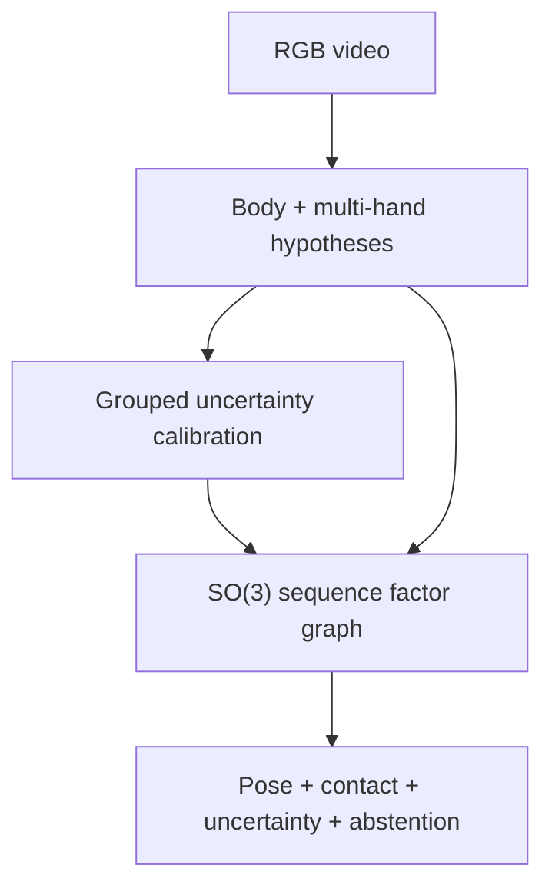

# DexAvatar: audit khoa học, audit mã nguồn và lộ trình nghiên cứu để vượt baseline

**Phiên bản:** 1.0 — 2026-08-15  
**Phạm vi:** paper DexAvatar đính kèm (21 trang, gồm supplementary), repository công khai tại commit `a0dfd427f60f5811aadb35c8657b3856d47f56b5`, literature liên quan đến hết ngày 2026-08-15, và quy trình 9 pha trong file Markdown đính kèm.  
**Ngôn ngữ:** tiếng Việt; thuật ngữ kỹ thuật giữ tiếng Anh khi cần độ chính xác.

## Tóm tắt quyết định

**Giai đoạn hiện tại:** hoàn tất desk research và red-team audit; chưa chạy benchmark end-to-end vì dữ liệu SGNify, SMPL-X và các checkpoint có giấy phép/đăng ký riêng chưa nằm trong workspace.

**Đã xác minh:**

- DexAvatar báo cáo `30.13 / 13.53 / 13.08 mm` cho upper body / left hand / right hand trên 2.872 frame SGNify bằng **TR-V2V**. Đây là point estimate trên một benchmark, không có confidence interval hay significance test.
- Mức “35.11%” là so với Neural Sign Actors ở upper body. So với baseline mạnh nhất trong chính bảng là EVA*, chênh lệch tương ứng chỉ khoảng **25.38% body, 1.46% left hand và 4.39% right hand**.
- Supplementary nói rõ hyperparameter được chọn trên cả **DEV và TEST**; nếu TEST đó là tập báo cáo cuối, đây là model-selection leakage và làm mất tính unbiased của kết quả test.
- Mã phát hành không có script đánh giá tái tạo Table 1, không có training pipeline cho SignBPoser/SignHPoser, không có seed/manifest/checksum hoàn chỉnh, và có bất nhất 2.872 so với 2.929 frame giữa paper và code.
- Sau DexAvatar đã có Tamaththul3D tuyên bố số hand thấp hơn và nhanh hơn, nhưng paper này đổi nhãn metric từ TR-V2V sang PA-MPVPE trong khi lặp lại đúng các số baseline của DexAvatar. Hai metric không tương đương; vì vậy tuyên bố “đã vượt” chưa đủ điều kiện để chấp nhận nếu chưa recompute cùng metric/protocol.
- Một phép thay HaMeR bằng WiLoR hoặc thêm temporal transformer/smoothing đơn thuần không còn đủ novelty: Tamaththul3D và DanceHMR đã chiếm không gian này.

**Chưa xác minh:**

- Không xác minh được các số Table 1 bằng thực thi độc lập do thiếu dữ liệu/checkpoint có kiểm soát truy cập; audit hiện tại là paper+code static audit.
- Chưa biết chính xác “DEV/TEST” trong supplementary có trùng hoàn toàn với test benchmark cuối hay là một protocol nội bộ khác không được mô tả. Văn bản hiện có nghiêng mạnh về rủi ro leakage nhưng chưa đủ để kết luận hành vi sai phạm.
- Chưa xác minh code/release của Tamaththul3D và DanceHMR, cũng như khả năng tái tạo số liệu của họ.
- Chưa có ground-truth contact, semantic labels và metadata signer đủ chi tiết để chốt split confirmatory.

**Quyết định cần đưa ra:**

1. **Không** dùng mục tiêu “beat 30.13/13.53/13.08 bằng bất kỳ metric nào”. Mục tiêu đúng là thắng baseline mạnh nhất được **recompute dưới cùng manifest, cùng alignment, cùng missing-frame policy**, đồng thời không làm giảm semantic fidelity.
2. Chọn hướng chính **SIGNAL-4D: uncertainty-gated, contact-aware, change-point-preserving 4D sign reconstruction**; chọn hướng dự phòng **ProtocolFix-3DSL**, một benchmark/audit paper tái lập và sửa protocol.
3. Gate rẻ nhất trước khi xây mô hình mới: tái tạo evaluator và chạy `SMPLer-X + WiLoR coordinate substitution`. Nếu baseline đơn giản này ngang full method trong confidence interval, dừng claim algorithmic novelty và pivot sang benchmark/audit.

---

## Quy ước bằng chứng

- **[Đã xác minh]**: có bằng chứng trực tiếp trong paper, code, nguồn sơ cấp hoặc phép tính tái lập được.
- **[Suy luận]**: kết luận hợp lý từ bằng chứng nhưng không được tác giả phát biểu trực tiếp.
- **[Giả thuyết]**: đề xuất cần thực nghiệm bác bỏ/xác nhận.
- **[Chưa xác minh]**: thiếu dữ liệu, artifact hoặc mô tả để kết luận.

Không xem arXiv-only work là bằng chứng peer-reviewed. Không so sánh số giữa hai metric/alignment khác nhau.

---

# Pha 1 — Reconstruction paper và claim–evidence map

## 1.1 Hồ sơ paper

- **Tên:** *DexAvatar: 3D Sign Language Reconstruction with Hand and Body Pose Priors*.
- **Tác giả:** Kaustubh Kundu, Hrishav Bakul Barua, Lucy Robertson-Bell, Zhixi Cai, Kalin Stefanov.
- **Trạng thái:** preprint ngày 2025-12-24; WACV 2026, trang 5842–5852.
- **Định danh:** arXiv:2512.21054; [CVF Open Access](https://openaccess.thecvf.com/content/WACV2026/html/Kundu_DexAvatar_3D_Sign_Language_Reconstruction_with_Hand_and_Body_Pose_WACV_2026_paper.html); [arXiv](https://arxiv.org/abs/2512.21054).
- **Artifact:** [repository chính thức](https://github.com/kaustesseract/DexAvatar), audit tại commit cố định `a0dfd427f60f5811aadb35c8657b3856d47f56b5` (2026-05-03).

## 1.2 Contribution chính xác trong một câu

**[Đã xác minh]** DexAvatar học hai manifold VAE đặc thù cho signing—SignBPoser từ pseudo-3D body đã lọc và SignHPoser từ một tập finger-spelling glove/mocap nhỏ—rồi dùng chúng làm regularizer trong SMPL-X fitting khởi tạo bởi SMPLer-X/HaMeR, đạt point estimate TR-V2V thấp hơn các baseline được báo cáo trên một tập SGNify.

Đây là mô tả hẹp hơn và chính xác hơn câu “reconstruct bio-mechanically accurate avatars”: paper không đo trực tiếp mọi khía cạnh của biomechanical accuracy, semantic correctness hay generalization.

## 1.3 Problem, assumptions và pipeline

**Problem.** Từ video monocular của sign language, ước lượng chuỗi SMPL-X gồm body, hai tay và face. Các khó khăn được paper nêu đúng: hand crop nhỏ, motion blur, self/inter-hand occlusion, hand–body proximity, depth ambiguity, upper-body framing.

**Dữ liệu prior.**

- SignBPoser dùng 3D/pseudo-3D signing motion đã lọc từ SignAvatars/How2Sign.
- SignHPoser dùng capture riêng: 8 người ký (6 Auslan proficient, 2 ASL fluent), 93 từ finger-spelling, Vicon 9 camera + Manus gloves, retarget sang SMPL-X.
- **[Suy luận]** domain coverage của hand prior hẹp: số signer nhỏ, ngôn ngữ trộn, và nhiệm vụ finger-spelling không đại diện đầy đủ cho continuous signing, contact-rich signs hoặc non-manual markers.

**Inference.**

1. SMPLer-X sinh body/shape/camera/face initialization.
2. Sapiens sinh 2D whole-body keypoints.
3. HaMeR sinh 2D/3D hand evidence và hand rotations.
4. SignBPoser/SignHPoser regularize pose latents.
5. Fitting tối ưu loss gồm reprojection/depth evidence, prior, interpenetration, temporal consistency và biomechanical constraints.
6. Với sign một tay, precomputed class tắt phần lớn non-dominant side/lower body; active hand được suy ra từ wrist motion trong code.

**Các assumption ẩn quan trọng.**

- SMPLer-X và HaMeR initialization đủ gần optimum; learned prior chủ yếu refine chứ không rescue failure lớn.
- Độ tin cậy detector phản ánh lỗi observation; code thực tế đặt hand confidence thành 1 trong nhiều nhánh.
- Previous-frame axis-angle difference là proxy hợp lệ cho motion smoothness.
- Sign class/segment được biết trước và đúng.
- SGNify ground truth đủ chính xác để xếp hạng phương pháp, dù supplementary thừa nhận collapsed fingers/irregular knuckle spacing.

## 1.4 Claim–evidence matrix

| ID | Claim | Bằng chứng được cung cấp | Kết luận audit |
|---|---|---|---|
| C1 | DexAvatar tốt nhất trên SGNify | Table 1: 30.13 / 13.53 / 13.08 mm TR-V2V | **[Đã xác minh trong paper]** point estimate thấp nhất trong bảng; **chưa tái lập độc lập**. |
| C2 | Cải thiện 35.11% | So với Neural Sign Actors: 46.42 → 30.13 body | **Đúng nhưng chọn comparator yếu hơn EVA***. So EVA*: body 25.38%; hands chỉ 1.46%/4.39%. |
| C3 | Filtering prior data có ích | BPu → BPf cải thiện rõ trong Table 2/3 | **Được hỗ trợ**; đây là bằng chứng mạnh nhất của ablation. |
| C4 | Biomechanical training regularizer có ích | BPf+bio và HPf+bio | **Mixed**: body BPf+bio tệ hơn BPf ở cả bốn vùng; right hand 13.06 → 13.08 cũng tệ nhẹ. |
| C5 | Pipeline robust với blur/noise/occlusion | Hình/video qualitative | **Chưa được định lượng**; không có corruption curve, CI hay failure rate. |
| C6 | Priors là nguyên nhân chính của gain | Ablation prior variants | **Chưa cô lập đầy đủ**: không có matched initialization/source-supervision ablation so với SMPLer-X/HaMeR mạnh. |
| C7 | Temporal consistency được cải thiện | Có `L_temp` và qualitative video | **Chưa chứng minh**: không có derivative-to-GT metric; code dùng axis-angle coordinate difference. |
| C8 | Contact-aware/physically plausible | Interpenetration + biomech loss; qualitative | **Bằng chứng yếu**: collision avoidance không đồng nghĩa đúng hand–hand/hand–body contact; không có contact labels/F1. |
| C9 | Generalizes in the wild | MM-WLAuslan qualitative | **Chưa chứng minh định lượng**, không có cross-language 3D ground truth. |
| C10 | Reproducible official implementation | Repo và hướng dẫn cài đặt | **Partial**: inference core có, evaluator/training/checksums/manifest còn thiếu; fresh clone có broken gitlink. |

## 1.5 Kết quả chính và ý nghĩa thật sự

| Method | Upper body (-face) | Left hand | Right hand | Metric theo DexAvatar |
|---|---:|---:|---:|---|
| Neural Sign Actors | 46.42 | 16.17 | 15.23 | TR-V2V (mm) |
| EVA* | 40.38 | 13.73 | 13.68 | TR-V2V (mm) |
| DexAvatar | **30.13** | **13.53** | **13.08** | TR-V2V (mm) |

**[Đã xác minh]** Gain body là lớn. **[Đã xác minh]** Gain hand so với EVA* là nhỏ, đặc biệt left hand chỉ 0.20 mm. Không có uncertainty estimate nên không biết 0.20 mm có vượt noise của benchmark/ground truth hay không.

**Ablation đáng chú ý.**

- Body: BPf (`42.32/26.78/41.35/30.28`) tốt hơn BPu; BPf+bio (`42.38/26.93/41.88/30.44`) lại tệ hơn BPf trên cả bốn subset.
- Hand: HPf (`30.17/13.55/13.06`) tốt hơn HPu; HPf+bio (`30.13/13.53/13.08`) chỉ tốt nhẹ ở body/left và tệ nhẹ ở right.
- Main paper nói right-hand giảm chất lượng khoảng 0.2%; supplementary section S5 lại mô tả là cải thiện 1.7%. **[Đã xác minh]** đây là bất nhất nội bộ giữa prose và Table 3.

## 1.6 Paper đã chứng minh gì / chưa chứng minh gì

**Đã chứng minh ở mức paper report:**

- Một fitting configuration có learned sign priors đạt point estimates tốt trong Table 1 trên SGNify.
- Filtering/correcting training poses có lợi rõ ràng hơn so với raw prior data.
- Learned latents có thể được tích hợp vào SMPLify-X-style optimization.

**Chưa chứng minh:**

- Statistical significance, variance theo sign/signer hoặc robustness tới seed/hyperparameter.
- Unbiased test performance nếu thật sự đã chọn hyperparameter trên TEST.
- Semantic equivalence/intelligibility của output so với source.
- Cross-language, cross-signer và cultural-clothing generalization định lượng.
- Real-time hoặc cost advantage.
- Correct hand contact/contact timing.
- Đóng góp riêng của learned priors khi giữ initialization, detector, crop và optimization budget giống nhau.

### Kết luận Pha 1

- **Kết luận:** DexAvatar là một sign-specific fitting system có gain body đáng kể, nhưng headline gộp body/hand làm người đọc dễ đánh giá quá cao gain hand; bằng chứng hiện tại là single-benchmark point estimates.
- **Confidence:** cao (0.92) cho reconstruction paper; trung bình (0.65) cho causal attribution.
- **Go/No-Go:** **GO** sang red-team; **NO-GO** dùng trực tiếp các con số như ground truth bất khả nghi vấn.
- **Ba hành động tiếp:** (1) khóa evaluator/alignment; (2) kiểm tra leakage và manifest; (3) tách gain từ initialization khỏi gain từ prior.

---

# Pha 2 — Red-team methodology và source-code audit

## 2.1 Audit snapshot

Repository được đọc tại commit cố định [`a0dfd427...`](https://github.com/kaustesseract/DexAvatar/tree/a0dfd427f60f5811aadb35c8657b3856d47f56b5). Snapshot có 2.076 tracked files; phần `dexavatar_fitting` có 33 tracked files và khoảng 7.646 dòng Python, còn phần lớn repository là vendored SMPLer-X, HaMeR, ViTPose, neural renderer và mesh-intersection code.

`python -m compileall` qua được cho `dexavatar_fitting`; đây chỉ là syntax smoke test, không phải end-to-end reproduction.

## 2.2 Weakness register

| Mức | Vấn đề | Bằng chứng trực tiếp | Ảnh hưởng | Sửa tối thiểu |
|---|---|---|---|---|
| **Critical** | Model selection trên TEST | PDF p.12: chọn “best hyperparameter” trên DEV và TEST | Test estimate có thể optimistic; invalid confirmatory claim | Tạo calibration/dev riêng; freeze trước test; giữ test blind |
| **Critical** | Metric/protocol không phát hành | Không có project-specific evaluator tái tạo Table 1 | Không kiểm tra alignment, subset, denominator, baseline fairness | Release evaluator + synthetic alignment unit tests + exact manifest |
| **High** | Frame manifest bất nhất | Paper: 2.872; `segment.json`: tổng `end-start=2.872`, nhưng code chọn inclusive `start <= n <= end` và slice `end+1`, tổng 2.929 ([code](https://github.com/kaustesseract/DexAvatar/blob/a0dfd427f60f5811aadb35c8657b3856d47f56b5/dexavatar_fitting/smplifyx/data_parser.py#L147-L168)) | Chênh 57 frame—đúng một frame/sign—có thể đổi denominator/result | Công bố SHA256 manifest từng frame; test count = 2.872 hoặc giải thích inclusive protocol |
| **High** | Dropped-frame policy ẩn | Frame thiếu HaMeR/SMPLer-X bị bỏ ([code](https://github.com/kaustesseract/DexAvatar/blob/a0dfd427f60f5811aadb35c8657b3856d47f56b5/dexavatar_fitting/smplifyx/data_parser.py#L182-L199)) | Conditional-on-success metric; method fail nhiều có thể trông tốt hơn | Report coverage/success; all-frame manifest; selective-risk curve |
| **High** | Không có matched-init ablation | Loss kéo latent về SMPLer-X/HaMeR rotation với weight lớn ([loss](https://github.com/kaustesseract/DexAvatar/blob/a0dfd427f60f5811aadb35c8657b3856d47f56b5/dexavatar_fitting/smplifyx/fitting.py#L527-L556)) | Gain có thể đến từ stronger upstream estimators hơn prior | Common-init baseline; prior-only incremental ablation |
| **High** | Temporal result phụ thuộc order/resume/chunk | `joints_temp` truyền tuần tự, nhưng frame có output bị skip mà state không load; chunk khác 0 bắt đầu từ zero ([main](https://github.com/kaustesseract/DexAvatar/blob/a0dfd427f60f5811aadb35c8657b3856d47f56b5/dexavatar_fitting/smplifyx/main.py#L226-L247), [skip](https://github.com/kaustesseract/DexAvatar/blob/a0dfd427f60f5811aadb35c8657b3856d47f56b5/dexavatar_fitting/smplifyx/main.py#L301-L330)) | Cùng data nhưng resume/parallelism có thể cho output khác | Load previous result state; overlap chunks; deterministic sequence tests |
| **High** | Two-hand branch giả định 2 detection | Loop cố định `range(2)` sau filter chỉ yêu cầu ≥1 detection ([code](https://github.com/kaustesseract/DexAvatar/blob/a0dfd427f60f5811aadb35c8657b3856d47f56b5/dexavatar_fitting/smplifyx/data_parser.py#L186-L190), [branch](https://github.com/kaustesseract/DexAvatar/blob/a0dfd427f60f5811aadb35c8657b3856d47f56b5/dexavatar_fitting/smplifyx/data_parser.py#L397-L421)) | Có thể crash hoặc misassign detection order | Route bằng handedness; explicit missing-hand state; unit test 0/1/2 detections |
| **High** | Imputation mang confidence 1.0 | Khi active hand mất, reuse previous 2D/3D/rotation và đặt confidence 1 ([right](https://github.com/kaustesseract/DexAvatar/blob/a0dfd427f60f5811aadb35c8657b3856d47f56b5/dexavatar_fitting/smplifyx/data_parser.py#L528-L540), [left](https://github.com/kaustesseract/DexAvatar/blob/a0dfd427f60f5811aadb35c8657b3856d47f56b5/dexavatar_fitting/smplifyx/data_parser.py#L635-L648)) | Che giấu uncertainty; error propagation; first-frame missing có thể fail | Confidence decay + missing mask + multi-hypothesis/abstention |
| **High** | Không có statistics | Không seed/CI/test; frame autocorrelation không được xử lý | Không biết gain 0.20 mm có thật | Paired hierarchical bootstrap theo sign/signer; effect size + CI |
| **Medium** | Temporal loss hard-coded, sai geometry rotation | `robustifier(axis_angle_t-axis_angle_t-1)*2000` ([code](https://github.com/kaustesseract/DexAvatar/blob/a0dfd427f60f5811aadb35c8657b3856d47f56b5/dexavatar_fitting/smplifyx/fitting.py#L441-L504)) | Wrap discontinuity; không tune/audit được; over-smoothing | SO(3) geodesic + config + change-point-aware weight |
| **Medium** | Lower body luôn zero-weight | `joint_weights[:, 11:23] = 0` ([code](https://github.com/kaustesseract/DexAvatar/blob/a0dfd427f60f5811aadb35c8657b3856d47f56b5/dexavatar_fitting/smplifyx/fitting.py#L499-L509)) | Claim “whole-body” cần thu hẹp thành upper-body signing | Scope claim; report explicit vertex/joint subset |
| **Medium** | Init consistency weights 1.200 ở cả 3 stages | YAML ([config](https://github.com/kaustesseract/DexAvatar/blob/a0dfd427f60f5811aadb35c8657b3856d47f56b5/dexavatar_fitting/cfg_files/fit_smplx_vposer_x.yaml#L50-L77)); comment trong loss nói chỉ stage đầu | Code/prose mismatch; source estimate được giữ rất mạnh | Stage-specific documented schedule + ablation |
| **Medium** | Chỉ optimize learned latents | `final_params` chỉ gồm body/hand embeddings ([code](https://github.com/kaustesseract/DexAvatar/blob/a0dfd427f60f5811aadb35c8657b3856d47f56b5/dexavatar_fitting/smplifyx/fit_single_frame.py#L476-L503)) | Shape/camera/global/face gần như cố định từ initializer | Nói rõ scope; controlled joint optimization ablation |
| **Medium** | Fresh clone không hoàn chỉnh | `sapiens` là gitlink SHA nhưng không có `.gitmodules`; README yêu cầu cài ngoài | Reproduction dễ hỏng/version drift | Proper submodule hoặc pinned package/commit |
| **Medium** | Dependency drift | Ba env, nhiều package unpinned; Detectron2 từ Git HEAD; NumPy 1.23.5 rồi 1.26.3 ([installer](https://github.com/kaustesseract/DexAvatar/blob/a0dfd427f60f5811aadb35c8657b3856d47f56b5/scripts/env_install.sh)) | Build hôm nay khác build tác giả | Lockfiles/container/SBOM; CUDA matrix; hashes |
| **Medium** | Shell orchestration không fail-fast/quote-safe | `os.system` ghép user paths ([runner](https://github.com/kaustesseract/DexAvatar/blob/a0dfd427f60f5811aadb35c8657b3856d47f56b5/run_dexavatar.py#L17-L30)); shell không `set -e` | Silent partial output; command injection nếu path không tin cậy | `subprocess.run([...], check=True)`; quote; structured logs |
| **Medium** | Downloaded model code được dynamic execute | `importlib.exec_module` + `torch.load` ([SignB](https://github.com/kaustesseract/DexAvatar/blob/a0dfd427f60f5811aadb35c8657b3856d47f56b5/dexavatar_fitting/smplifyx/test_bposer.py#L21-L40)) | Supply-chain/code execution risk | Signed weights, SHA256, safetensors, inspect code trước run |
| **Medium** | License composite không chỉ là MIT | Root MIT nhưng fitting subtree nêu non-commercial SMPLify-X license ([subtree README](https://github.com/kaustesseract/DexAvatar/blob/a0dfd427f60f5811aadb35c8657b3856d47f56b5/dexavatar_fitting/README.md#L21-L31)); SMPL-X model có license riêng | Commercial/release claim có ràng buộc | SPDX manifest; legal review; không tái phân phối model/data trái phép |

## 2.3 Điểm yếu experimental design

1. **Single benchmark, small effective N.** 2.872 frame không phải 2.872 independent observations; đơn vị độc lập gần hơn là 57 signs và signer/clip. Frame-wise statistics sẽ pseudo-replicate.
2. **Selection leakage.** PDF p.12 mô tả chọn best hyperparameter trên DEV và TEST hai lần. Không có protocol giải thích TEST khác gì final test.
3. **Unfair causal attribution.** DexAvatar dùng Sapiens + SMPLer-X + HaMeR; nhiều baseline cũ hơn không có cùng observation stack. Native-system comparison hợp lệ cho system utility, nhưng không đủ để nói SignB/HPoser gây ra toàn bộ gain.
4. **Metric validity.** TR-V2V là translation-aligned, giữ lại scale/rotation error và nghiêm ngặt hơn PA. Nó đo geometry, không trực tiếp đo comprehensibility. Ground truth tự thân có hand artifact.
5. **Robustness chỉ qualitative.** Không corruption severity, failure coverage, seed hay human rating.
6. **Ablation asymmetry.** Filtering có gain rõ; biomechanical training term mixed. Claim phải phân biệt “data correction” với “regularizer lúc fitting/training”.
7. **No cost curve.** Không runtime/VRAM/energy trong paper gốc; optimization LBFGS per-frame/sequence khó scale.

## 2.4 Reproducibility scorecard

| Thành phần | Trạng thái | Điểm / 2 |
|---|---|---:|
| Paper method/loss | Có, nhưng một số weight hard-coded chỉ thấy trong code | 1.2 |
| Inference code | Có core code và orchestration | 1.4 |
| Exact environment | Không lock/container; gitlink lỗi | 0.4 |
| Checkpoints | Link Drive, không hash/provenance đầy đủ | 0.5 |
| Training prior | Không có end-to-end training/reproduce tables | 0.2 |
| Evaluation | Không evaluator/manifest/table script | 0.0 |
| Tests/CI | Không project-specific regression tests | 0.1 |
| **Tổng** | **4.0 / 14 ≈ 29%** | |

Điểm này là rubric audit, không phải chuẩn cộng đồng chính thức.

## 2.5 Ethics, bias và deployment

- Sign languages là các ngôn ngữ riêng, không phải một “universal gesture domain”. Prior từ Auslan/ASL/How2Sign không tự động chuyển sang DGS, ArSL, CSL hay ISL.
- Hand shape, facial markers, gaze và body posture mang nghĩa; tối ưu geometry mà bỏ face/non-manual markers có thể đổi nghĩa.
- Traditional clothing, skin tone, camera quality và signer mobility có thể tạo performance gap. Tamaththul3D cũng ghi nhận clothing bias trong SMPLer-X.
- Video signer là biometric/personal data. Cần consent, data minimization, retention policy, IRB/ethics review nếu thu mới, và Deaf stakeholder involvement.
- Không deploy output như bản dịch tin cậy nếu hệ thống không có uncertainty/abstention và human validation.

### Kết luận Pha 2

- **Kết luận:** repository đủ để hiểu inference idea nhưng chưa đủ để tái lập headline table một cách độc lập; rủi ro lớn nhất là test tuning, evaluator vắng mặt và manifest mismatch.
- **Confidence:** cao (0.95) cho static code findings; thấp–trung bình (0.55) cho ảnh hưởng định lượng vì chưa chạy data.
- **Go/No-Go:** **NO-GO** dùng published leaderboard làm confirmatory endpoint; **GO** xây evaluator sạch và baseline reproduction.
- **Ba hành động tiếp:** (1) tạo frozen manifest; (2) viết evaluator TR/PA có unit tests; (3) containerize và hash mọi checkpoint.

---

# Pha 3 — Systematic-ish literature audit và research gap

## 3.1 Search protocol và audit trail

**Ngày chốt:** 2026-08-15. Đây là systematic-ish audit, không phải PRISMA review hoàn chỉnh.

**Backward search:** references của DexAvatar về SGNify, Neural Sign Actors, SignAvatars, SMPLer-X, HaMeR, PIXIE.  
**Forward search:** exact-title/arXiv searches cho các paper trích DexAvatar sau 2025.  
**Lateral search:** “monocular video whole-body hand mesh recovery”, “4D interacting hands”, “temporal hand reconstruction”, “uncertainty human mesh recovery”, “contact metric”.  
**Cross-domain search:** conformal prediction, factor graphs/switchable constraints, hand–object contact datasets, sign-language semantic evaluation.  
**Loại trừ:** blog/secondary summaries không dùng làm bằng chứng kỹ thuật; arXiv-only được gắn nhãn chưa peer-reviewed.

## 3.2 Evidence ledger của các công trình được dùng

| Work | Metadata / định danh | Trạng thái | Hỗ trợ lập luận nào |
|---|---|---|---|
| **DexAvatar** — Kundu, Barua, Robertson-Bell, Cai, Stefanov | WACV 2026; arXiv:2512.21054; [CVF](https://openaccess.thecvf.com/content/WACV2026/html/Kundu_DexAvatar_3D_Sign_Language_Reconstruction_with_Hand_and_Body_Pose_WACV_2026_paper.html) | Peer-reviewed | Target method, loss, SGNify results, ablations |
| **Reconstructing Signing Avatars from Video Using Linguistic Priors** — Forte et al. | CVPR 2023, 12791–12801; arXiv:2304.10482; [project/paper](https://sgnify.is.tue.mpg.de/) | Peer-reviewed | SGNify benchmark, linguistic priors, perceptual evaluation |
| **Neural Sign Actors** — Baltatzis, Potamias, Ververas, Sun, Deng, Zafeiriou | CVPR 2024; arXiv:2312.02702; [arXiv](https://arxiv.org/abs/2312.02702) | Peer-reviewed | Strong 4D annotation/SLP predecessor and Dex comparator |
| **SignAvatars** — Yu, Huang, Cheng, Birdal | ECCV 2024; DOI 10.1007/978-3-031-72652-1_1; arXiv:2310.20436; [ECVA PDF](https://www.ecva.net/papers/eccv_2024/papers_ECCV/papers/00653.pdf) | Peer-reviewed | 70K sequences/153 signers/8.34M pseudo-3D frames; prior-data scale |
| **SMPLer-X** — Cai et al. | NeurIPS 2023; arXiv:2309.17448; [arXiv](https://arxiv.org/abs/2309.17448) | Peer-reviewed | Dex body/shape/camera initializer; common-init baseline |
| **HaMeR** — Pavlakos, Shan, Radosavovic, Kanazawa, Fouhey, Malik | CVPR 2024; arXiv:2312.05251; [arXiv](https://arxiv.org/abs/2312.05251) | Peer-reviewed | Dex hand observation source |
| **WiLoR** — Potamias, Zhang, Deng, Zafeiriou | CVPR 2025; arXiv:2409.12259; [CVF](https://openaccess.thecvf.com/content/CVPR2025/html/Potamias_WiLoR_End-to-end_3D_Hand_Localization_and_Reconstruction_in-the-wild_CVPR_2025_paper.html) | Peer-reviewed | Stronger multi-hand estimator; minimum modern baseline |
| **Dyn-HaMR** — Yu, Zafeiriou, Birdal | CVPR 2025 Highlight; arXiv:2412.12861; [project](https://dyn-hamr.github.io/) | Peer-reviewed | 4D interacting-hand optimization, dynamic-camera/occlusion priors |
| **CUPS** — Zhang, Carlone | ICML 2025, PMLR 267:74583–74601; [PMLR](https://proceedings.mlr.press/v267/zhang25g.html) | Peer-reviewed | Multi-hypothesis HMR, deep uncertainty, conformal coverage under nonexchangeability |
| **Meaningful Pose-Based Sign Language Evaluation** — Jiang et al. | WMT 2025, 64–80; DOI 10.18653/v1/2025.wmt-1.4; [ACL Anthology](https://aclanthology.org/2025.wmt-1.4/) | Peer-reviewed | Geometry metric không đủ; trade-off distance/embedding/back-translation và human correlation |
| **ARCTIC** — Fan, Taheri, Tzionas, Kocabas, Kaufmann, Black, Hilliges | CVPR 2023; arXiv:2204.13662; [arXiv](https://arxiv.org/abs/2204.13662) | Peer-reviewed | Dynamic contact annotations/metrics và consistent motion reconstruction |
| **HandX** — Zhang et al. | CVPR 2026; arXiv:2603.28766; [arXiv](https://arxiv.org/abs/2603.28766) | Peer-reviewed | Bimanual contact timing, finger articulation, hand-focused metrics |
| **Tamaththul3D** — Alghamdi, Altuuaim, Ghulam, Qutah, Basoodan | arXiv:2605.05367v2; [arXiv HTML](https://arxiv.org/html/2605.05367v2) | **Preprint** | Post-Dex numeric claim, WiLoR geometric integration, runtime/clothing/OOD limitations |
| **DanceHMR** — Shen, Zhou, Zhang, Bian, Xu, Zhang | arXiv:2605.18102v3; [arXiv HTML](https://arxiv.org/html/2605.18102v3) | **Preprint** | Generic joint temporal body–hand SMPL-X, close-up augmentation, visibility masking |
| **UST-Hand** — Han et al. | arXiv:2605.17742; [arXiv](https://arxiv.org/abs/2605.17742) | **Preprint; venue chưa xác minh** | Uncertainty + spatiotemporal multi-hypothesis hand estimation; novelty pressure |
| **PIXIE** — Feng, Choutas, Bolkart, Tzionas, Black | 3DV 2021; arXiv:2105.05301; [paper](https://download.is.tue.mpg.de/pixie/PIXIE_3DV_CR.pdf) | Peer-reviewed | Định nghĩa alignment: PA loại scale/rotation/translation, TR chỉ translation |

## 3.3 Landscape: known, conflicting, untested

### Đã biết khá chắc

- General-purpose whole-body estimators thường yếu ở hand articulation nhỏ/occluded; part-specific hand observations có lợi.
- Temporal context giúp giảm jitter và infill occlusion, nhưng smoothness không đồng nghĩa correctness.
- Sign-specific priors/data filtering có thể cải thiện in-domain fitting.
- Metric hình học có tương quan hữu ích nhưng không thay thế semantic/human evaluation.
- Contact timing và bimanual coordination là signal quan trọng, đã được nghiên cứu sâu ở HOI/motion generation hơn trong sign reconstruction.

### Bằng chứng xung đột hoặc dễ hiểu sai

1. **Tamaththul3D “đã vượt DexAvatar”?** Paper báo `29.28 / 10.65 / 8.90` và 0.67 s/frame so DexAvatar `30.13 / 13.53 / 13.08`, 21.60 s/frame. Nhưng Tamaththul gọi bảng là **PA-MPVPE**, còn DexAvatar gọi đúng các số baseline đó là **TR-V2V**. PIXIE định nghĩa PA là Procrustes (scale+rotation+translation), TR chỉ translation. **[Suy luận mạnh]** không thể coi bảng này là apples-to-apples nếu thiếu recomputation/evaluator.
2. **Jitter thấp có nghĩa tốt hơn?** Không. Constant pose cho jitter gần 0 nhưng sai hoàn toàn. Tamaththul báo raw jitter/RTE, trong khi DanceHMR báo derivative **error to ground truth**; protocol sau hợp lệ hơn cho fidelity.
3. **Biomechanical loss của DexAvatar luôn tốt?** Không. Filtering tốt; thêm training regularizer có kết quả mixed và một prose/table contradiction.
4. **Pseudo-3D annotations là ground truth?** Không. SignAvatars/Ishara automatic SMPL-X annotations hữu ích cho scale, nhưng không phải independent mocap truth.

### Khoảng trống đã bị lấp hoặc “fake gap”

- “Dùng WiLoR thay HaMeR” — Tamaththul3D đã làm.
- “Thêm video transformer để body+hand mượt” — DanceHMR đã làm.
- “Thêm uncertainty cho HMR/hand” — CUPS và UST-Hand đã làm ở domain lân cận.
- “Thêm hand–hand prior trong video” — Dyn-HaMR đã có interacting-hand prior.
- “Đề xuất hand contact metric” — ARCTIC/HandX đã cung cấp nhiều nguyên tắc chuyển giao.

### Credible gaps còn lại

1. **Uncertainty được dùng để điều khiển constraint, không chỉ báo cáo:** chưa thấy hệ thống sign reconstruction dùng calibrated uncertainty để bật/tắt observation, contact và temporal factors, đồng thời cho phép abstention.
2. **Contact correctness + semantic fidelity cùng một protocol:** DexAvatar chủ yếu collision/geometry; Tamaththul/DanceHMR chưa có sign-specific contact event và comprehension validation.
3. **Change-point-preserving temporal inference:** smoothing cần giảm jitter khi occluded nhưng không xóa onset/hold/release và fast finger transitions có nghĩa.
4. **Clean, reproducible leaderboard:** exact frame manifest, TR-vs-PA tests, failure coverage, common-init baselines, hierarchical CI và no-test-tuning vẫn thiếu.
5. **Quantitative cross-language/cultural OOD:** hiện phần lớn là qualitative hoặc pseudo-label evaluation.

## 3.4 Cross-domain transfer ideas

1. **Conformal/selective prediction → failure-aware avatar reconstruction.** Chuyển CUPS từ coverage interval chung sang group-calibrated residual radius theo signer/clip/occlusion, rồi xuất abstain flag và risk–coverage curve.
2. **Switchable factor graphs từ SLAM/robust estimation → contact/temporal gating.** Contact là latent state có hysteresis; factor xấu tự giảm trọng số thay vì ép mọi hand proximity thành contact.
3. **HOI contact metrics → sign hand–hand/hand–body events.** Chuyển event F1, onset/offset error, penetration depth/volume và contact distance từ ARCTIC/HandX; không chuyển object semantics một cách máy móc.
4. **Sign production evaluation → reconstruction semantics.** Dùng retrieval/embedding metric và Deaf-signer comprehension study từ hướng Jiang et al./SGNify để kiểm tra geometry gain có giữ nghĩa.
5. **Rotation averaging/manifold optimization → temporal SMPL-X.** Thay L1/robust loss trên axis-angle coordinates bằng geodesic residual trên SO(3), đặc biệt quanh wrap boundaries.

### Kết luận Pha 3

- **Kết luận:** “vượt DexAvatar” về số đơn lẻ đã bị một preprint claim trước, nhưng comparison hiện chưa metric-clean. Research gap đáng làm là uncertainty-gated contact/temporal inference + semantic/physical evaluation + protocol sạch.
- **Confidence:** cao (0.88) rằng WiLoR-only/temporal-only không mới; trung bình (0.72) rằng gap SIGNAL-4D chưa bị lấp hoàn toàn vì search không thể bảo đảm exhaustive.
- **Go/No-Go:** **GO có điều kiện** cho gap mới; **NO-GO** cho naive module swap hoặc generic transformer.
- **Ba hành động tiếp:** (1) novelty search lặp lại trước submission; (2) tái tạo Tamaththul dưới TR-V2V; (3) định nghĩa contact/semantic endpoints trước code.

---

# Pha 4 — Candidate directions, scoring và chọn hướng

## 4.1 Rubric

Mỗi tiêu chí 0–5; `R` là **low execution risk** (5 = rủi ro thấp). Tổng tối đa 50. Điểm là judgment có căn cứ, không phải measurement.

| ID | Hướng | Novelty | Impact | Feas. | Data | Compute | Eval. | Baseline | R | Ethics | Venue | Tổng |
|---|---|---:|---:|---:|---:|---:|---:|---:|---:|---:|---:|---:|
| A | **SIGNAL-4D:** uncertainty-gated contact graph + change-point temporal factors | 4 | 5 | 4 | 3 | 4 | 5 | 4 | 3 | 4 | 5 | **41** |
| B | **ProtocolFix-3DSL:** clean evaluator/manifest/recomputed leaderboard/semantic audit | 4 | 5 | 5 | 4 | 5 | 5 | 4 | 4 | 5 | 4 | **45** |
| C | SMPLer-X + WiLoR + geometric IK | 1 | 4 | 5 | 4 | 5 | 5 | 3 | 2 | 4 | 2 | 35 |
| D | Generic body–hand temporal transformer | 1 | 4 | 2 | 2 | 2 | 4 | 3 | 2 | 4 | 2 | 26 |
| E | Language/signer-adaptive learned priors | 4 | 5 | 2 | 1 | 2 | 3 | 3 | 2 | 3 | 4 | 29 |
| F | Multi-view/self-supervised pseudo-label refinement | 3 | 4 | 2 | 2 | 2 | 3 | 3 | 2 | 3 | 3 | 27 |
| G | New uncertainty-guided sign mocap benchmark | 5 | 5 | 1 | 1 | 3 | 5 | 4 | 1 | 2 | 5 | 32 |
| H | Non-manual/facial semantic reconstruction | 4 | 5 | 2 | 2 | 2 | 3 | 3 | 2 | 3 | 4 | 30 |

## 4.2 Quyết định primary/backup

**Primary A — SIGNAL-4D.** Dù tổng điểm thấp hơn B, A trực tiếp đáp ứng yêu cầu user là vượt reconstruction baseline. Nó có upside algorithmic cao nếu thắng strongest valid baseline và chứng minh không over-smooth semantics.

**Backup B — ProtocolFix-3DSL.** B có tổng điểm cao nhất vì rủi ro thấp và vấn đề protocol là thật. Nếu A không hơn `SMPLer-X + WiLoR + simple smoother` trong CI, kết quả negative vẫn có giá trị dưới dạng benchmark/audit paper: chỉ ra leaderboard/metric leakage và cung cấp evaluator tái lập.

**Reject C/D như paper độc lập.** C là minimum baseline, không phải contribution. D bị DanceHMR novelty-block.

## 4.3 Novelty stress test cho A

| Nearest work | Họ đã có | SIGNAL-4D phải khác ở đâu | Falsifier |
|---|---|---|---|
| DexAvatar | sign priors + frame-sequential fitting | calibrated uncertainty, latent contact states, SO(3), clean protocol, semantic endpoints | Nếu chỉ thay loss nhưng gain đến hoàn toàn từ WiLoR, novelty fail |
| Tamaththul3D | WiLoR integration + IK + derivative smoothing | metric-clean comparison; uncertainty-adaptive smoothing; contact/semantic preservation | Nếu simple coordinate substitution/smoothing ngang full method, fail |
| DanceHMR | joint temporal body-hand transformer, visibility masking | sign-specific contact/change points/selective prediction; no need large retraining in MPU | Nếu DanceHMR zero-shot thắng mọi axis và calibration không thêm value, fail/pivot |
| CUPS | multi-hypothesis + conformal HMR | structured sign contact/temporal factor gating và group/selective evaluation | Nếu chỉ gắn conformal head lên HMR, novelty fail |
| Dyn-HaMR | interacting-hand 4D optimization | full SMPL-X signing space, hand–body contact, semantic evaluation, calibrated abstention | Nếu contribution chỉ là transplant prior, weak novelty |
| ARCTIC/HandX | contact-rich data/metrics | transfer sang sign-specific hand–hand/body events với đúng annotation semantics | Nếu contact proxy không tương quan human judgment, bỏ claim |

**Novelty statement ở thời điểm audit:** **[Giả thuyết]** chưa có công trình đã xác minh kết hợp (i) calibrated uncertainty để gate observation/contact/temporal factors, (ii) change-point-preserving SO(3) sequence optimization, và (iii) contact + semantic evaluation cho monocular 3D sign reconstruction. Câu này phải search lại ngay trước submission.

### Kết luận Pha 4

- **Kết luận:** A là hướng method; B là đường lui khoa học, không phải thất bại. C và D chỉ là baselines.
- **Confidence:** 0.80 cho ranking; 0.68 cho novelty tuyệt đối.
- **Go/No-Go:** **GO A**, nhưng chỉ sau khi C được chạy như cheapest falsifier; **GO B** nếu A fail.
- **Ba hành động tiếp:** (1) implement C; (2) khóa metric suite; (3) viết preregistration của A trước tuning.

---

# Pha 5 — Proposal hoàn chỉnh

## 5.1 Working title và thesis

**SIGNAL-4D: Uncertainty-Gated Contact Graphs for Semantically Faithful 3D Sign Reconstruction**

**Thesis.** **[Giả thuyết]** Trong signing video, cùng một temporal/contact strength cho mọi frame gây hai lỗi đối nghịch: quá yếu khi occluded và quá mạnh ở phonological transition. Dùng calibrated observation uncertainty cùng latent contact/change-point states để điều khiển factor strength sẽ giảm geometry/motion error mà không xóa semantic events.

## 5.2 Research questions và hypotheses

**RQ1.** Uncertainty-gated sequence inference có giảm hand TR-V2V so với strongest valid baseline không?  
**H1 (confirmatory).** Full method giảm ≥5% mean hand TR-V2V so với strongest recomputed baseline; upper-body không kém quá 1.0 mm.

**RQ2.** Adaptive temporal factors có giảm motion error mà không oversmooth onset/hold/release không?  
**H2 (confirmatory).** Giảm ≥15% acceleration/jerk **error-to-GT**, đồng thời semantic retrieval không giảm quá non-inferiority margin được khóa từ pilot.

**RQ3.** Contact factors có cải thiện đúng event, không chỉ giảm penetration?  
**H3 (confirmatory).** Tăng contact-event macro-F1 ≥10 percentage points và giảm penetration, không tăng TR-V2V ngoài CI.

**RQ4.** Calibration/selective prediction có nhận diện failure hữu ích không?  
**H4 (confirmatory).** Nominal 90% grouped conformal coverage đạt khoảng chấp nhận preregistered và selective risk giảm đơn điệu khi giảm coverage; interval width tốt hơn constant/global calibration.

**RQ5.** Có thể cải thiện quality/cost Pareto so DexAvatar không?  
**H5 (secondary).** MPU chạy <3 s/frame trên hardware cố định và nhanh hơn DexAvatar reproduction ít nhất 5×; không tuyên bố real-time.

Các threshold trên là **design targets**, chưa phải fact. Pilot chỉ dùng để chốt variance/non-inferiority margin, không được xem test.

## 5.3 Framework

### State và observations

Mỗi frame có state

\[
x_t = \{R^{body}_t, R^{lh}_t, R^{rh}_t, \beta, c_t, z^{contact}_t\},
\]

với rotations trên \(SO(3)\), shared shape \(\beta\), camera \(c_t\), và discrete/relaxed contact states \(z_t\) cho hand–hand và hand–body candidate pairs.

Observations gồm:

- SMPLer-X/SMPLest-X body initialization;
- WiLoR và HaMeR hand hypotheses từ crop/flip/scale perturbations;
- Sapiens/RTMW/MediaPipe 2D cues chỉ khi benchmark fairness cho phép;
- detector confidence, crop visibility, multi-hypothesis dispersion và reprojection residual history.

### Calibrated uncertainty

Raw score \(s_{t,j}\) kết hợp multi-hypothesis dispersion, 2D confidence và crop visibility. Grouped split-conformal calibration trên calibration set tạo residual radius \(q_{\alpha,g}\). Không nói “guaranteed” ngoài assumptions; temporal/nonexchangeable gap phải được báo cáo theo tinh thần CUPS.

Weight observation được bounded:

\[
w_{t,j}=\mathrm{clip}\left((q_{\alpha,g}^2+\epsilon)^{-1}, w_{min}, w_{max}\right).
\]

### Robust factor graph

Objective tối thiểu:

\[
\mathcal L = \mathcal L_{obs}^{UQ}+\mathcal L_{SO(3)}^{motion}+\mathcal L_{contact}^{switch}
+\mathcal L_{collision}+\mathcal L_{bio}+\mathcal L_{prior}.
\]

- `obs`: reprojection/depth/initializer residual, weighted bởi calibrated uncertainty và robust kernel.
- `motion`: geodesic rotation velocity/acceleration; weight giảm tại high-confidence change points và tăng khi observation tạm mất.
- `contact`: switchable constraints + hysteresis; chỉ hút surfaces khi evidence contact đủ mạnh, tránh biến proximity thành false contact.
- `collision`: penetration barrier tách biệt khỏi contact attraction.
- `prior`: generic/sign prior với matched ablation; không để prior che source evidence.

Optimize theo overlapping chunks và carry state; chunk overlap được blend trên manifold. Resume phải load boundary state và cho bitwise/tolerance-equivalent output.

### Output

- SMPL-X sequence;
- per-joint/region uncertainty interval hoặc calibrated residual radius;
- contact events và confidence;
- abstention/failure flags;
- provenance: versions/checkpoint hashes/config/manifest.

## 5.4 Ba contributions được phép claim

1. **Method:** uncertainty-gated switchable contact/temporal factor graph trên SO(3) cho body+hands signing sequence.
2. **Protocol:** metric-clean, failure-aware evaluation với exact manifest, TR/PA separation, hierarchical statistics và calibration/selective risk.
3. **Validation:** joint geometric–temporal–contact–semantic evaluation, kiểm tra trực tiếp oversmoothing và intelligibility.

Không claim “first” hoặc “state of the art” trước final novelty search và confirmatory results.

## 5.5 Minimum Publishable Unit (MPU) và stretch

**MPU:**

- SGNify only; body SMPLer-X, hands WiLoR+HaMeR hypotheses;
- training-free factor graph, grouped calibration, hand–hand/body contact proxy;
- exact evaluator + common-init and native-system baselines;
- no face/non-manual improvement claim;
- automated semantic retrieval plus small expert annotation only nếu ethics/consent hoàn tất.

**Stretch:**

- DanceHMR feature/model integration;
- learned residual/gating network;
- cross-language OOD với một mocap set thứ hai;
- face/gaze/non-manual markers;
- Deaf-signer comprehension study đủ power;
- new contact-annotated sign subset.

## 5.6 Claim scope

Nếu chỉ SGNify: “improves reconstruction under the SGNify isolated-sign protocol,” không viết “generalizes across sign languages”. Nếu chỉ automated semantic metric: không viết “more comprehensible”. Nếu interval calibration chỉ marginal: không viết “per-frame guarantee”. Nếu runtime hardware khác: không dùng speedup headline.

## 5.7 Go/No-Go gates của proposal

- **G0 Environment:** exact evaluator pass synthetic tests; manifest count giải quyết.
- **G1 Reproduction:** DexAvatar within ±0.5 mm mỗi vùng hoặc discrepancy được giải thích.
- **G2 Cheap baseline:** full method phải hơn WiLoR substitution + simple smoother ngoài 95% paired CI.
- **G3 Validity:** H1 đạt và body non-inferiority đạt.
- **G4 Semantics:** không giảm semantic endpoint; nếu fail, method paper **NO-GO** dù geometry tốt.
- **G5 Calibration:** risk–coverage có utility; nếu không, bỏ uncertainty headline.

### Kết luận Pha 5

- **Kết luận:** proposal khác DexAvatar ở việc xử lý reliability/contact/change points như latent structured inference, không chỉ thêm prior/model lớn.
- **Confidence:** 0.74 cho feasibility MPU; 0.55 cho đạt H1 trước khi chạy WiLoR baseline.
- **Go/No-Go:** **GO có điều kiện theo G0–G5**.
- **Ba hành động tiếp:** (1) viết evaluator; (2) benchmark C; (3) implement SO(3) smoother trước contact/UQ.

---

# Pha 6 — Full validation protocol và preregistration skeleton

## 6.1 Hai track đánh giá, không trộn

### Track L — Legacy continuity

- Exact 57-sign SGNify central-frame manifest.
- Không dùng bất kỳ SGNify ground truth nào để tune; mọi hyperparameter freeze từ external development data hoặc pilot subset không đi vào final estimate.
- Primary metric: TR-V2V, exact same vertex subsets/alignment.
- Mục đích: continuity với DexAvatar, không dùng để calibrate conformal interval nếu không có external calibration truth.

### Track C — Clean confirmatory

- Split group-wise thành development/calibration/test; ưu tiên signer-disjoint nếu metadata cho phép, nếu không sign/clip-disjoint và ghi limitation.
- Recompute **mọi** baseline trên test split, không copy số paper.
- Uncertainty calibration chỉ xem calibration split.
- Split, code commit, checkpoint SHA256 và hypotheses được timestamp/freeze trước test.

Nếu SGNify không có đủ independent groups, dùng nested/group cross-validation cho exploratory analysis và thu/định danh external held-out set trước confirmatory claim.

## 6.2 Dataset and manifest policy

1. Manifest mỗi row: `dataset, signer, sign, clip, frame, source_sha256, central_flag, expected_hands`.
2. Khóa inclusive/exclusive endpoints bằng unit test; giải quyết 2.872 vs 2.929 trước bất kỳ metric nào.
3. Không silently drop missing detections. Báo `coverage`, `hard failure`, `abstention`, và error conditional on coverage cùng risk–coverage/AURC.
4. Pseudo-label datasets chỉ dùng development/weak supervision, không gọi là independent 3D truth.
5. OOD qualitative sets không được dùng tạo numeric “generalization” claim nếu thiếu ground truth.

## 6.3 Baselines bắt buộc

**Native-system track:** DexAvatar pinned commit; SGNify; SMPLer-X; Tamaththul3D nếu code/reimplementation hợp lệ; DanceHMR nếu artifact có sẵn; strongest published whole-body estimator tại ngày freeze.

**Controlled common-input track:**

1. SMPLer-X only.
2. SMPLer-X + HaMeR coordinate copy.
3. SMPLer-X + WiLoR coordinate copy.
4. (3) + Savitzky–Golay/derivative smoother.
5. (3) + SO(3) deterministic factor graph.
6. (5) + uncertainty gating.
7. (6) + switchable contact = full SIGNAL-4D.

Mỗi baseline có native crop/detector result và common-observation result nếu khả thi. Không đánh đồng system comparison với component attribution.

## 6.4 Metrics

| Axis | Primary/secondary metric | Anti-gaming rule |
|---|---|---|
| Geometry | **TR-V2V** body/L/R hand primary; PA-MPVPE secondary | Cùng alignment implementation; synthetic scale/rotation/translation tests |
| Joint/mesh | MPJPE/MPVPE, per-finger distal errors | Report all regions; không chỉ best hand |
| Motion | velocity/acceleration/jerk **error to GT**; onset/hold/release boundary error | Constant-pose and time-shuffle negative controls |
| Contact | event macro-F1, onset/offset error, penetration depth/volume, false-contact rate | Contact attraction và collision riêng; manual audit subset |
| Semantics | sign retrieval/embedding metric; comprehension/naturalness nếu human study | Geometry claim không thay semantic claim; report language-specific validity |
| Calibration | coverage, interval width, ECE/NLL nếu probabilistic, group coverage gap | Report marginal + signer/sign/occlusion groups |
| Selective failure | risk@coverage, AURC, failure rate | Missing output tính là abstention, không bị xóa khỏi denominator |
| Efficiency | s/frame, end-to-end latency, peak VRAM/RAM, preprocessing, energy nếu có | Same hardware/software; warmup; mean+distribution theo clip |

**Metric firewall.** Không đặt số TR-V2V cạnh PA-MPVPE như cùng leaderboard. Không dùng raw jitter thấp như evidence fidelity nếu không so với GT/reference motion.

## 6.5 Claim–experiment matrix

| Claim | Confirmatory experiment | Baseline | Endpoint | Pass rule |
|---|---|---|---|---|
| Better hand geometry | Track C paired test | Strongest valid recomputed baseline | Mean L/R hand TR-V2V | ≥5% mean reduction; 95% paired CI không cắt 0 |
| Preserve body | Same outputs | Same baseline | Upper-body TR-V2V | Upper CI của degradation <1.0 mm |
| Better temporal fidelity | GT derivative comparison | WiLoR+smoother, Dex, DanceHMR | Accel/jerk error | ≥15% reduction và semantic non-inferiority |
| Better contact | Contact-labeled subset | no-contact/full; oracle contact | Macro-F1, penetration | +10 pp F1; penetration giảm; no geometry harm |
| Useful uncertainty | Held-out calibration/test | raw confidence/global scale | Coverage/width, AURC | Coverage trong preregistered band; lower AURC |
| Faster than Dex | Same machine/container | Dex pinned | end-to-end s/frame | ≥5× speedup; quality gates vẫn đạt |

## 6.6 Ablations

- Observation source: HaMeR vs WiLoR vs both; same crop and budget.
- Raw confidence vs multi-hypothesis dispersion vs calibrated uncertainty.
- Euclidean axis-angle vs SO(3) geodesic.
- Fixed temporal weight vs uncertainty-adaptive vs change-point-aware.
- Collision only vs contact only vs both.
- Generic prior vs SignB/H prior vs no prior, matched initialization.
- Known one/two-hand label vs predicted label vs deliberately wrong label.
- Framewise, non-overlap chunks, overlap chunks, resume run.
- Common-init vs native-system.
- Calibration grouped by random frame (negative methodological control) vs clip/signer group.

## 6.7 Negative controls và stress tests

1. Constant pose: phải có jitter đẹp nhưng geometry/semantic tệ.
2. Time-shuffled predictions: per-frame geometry giữ nguyên, motion/contact event phải tệ.
3. Artificial axis-angle wrap: Euclidean temporal loss phải fail, SO(3) không.
4. Wrong active-hand class: uncertainty/failure detector phải tăng.
5. Hand detector dropout blocks 1/3/5/10 frames.
6. Blur/noise/occlusion severity curves, không chỉ cherry-picked frames.
7. Oracle visibility/contact upper bound.
8. Random contact attraction: false-contact metric phải phát hiện.

## 6.8 Statistics

- **Unit phân tích:** clip/sign; signer là higher-level cluster nếu có. Không dùng frame như independent sample.
- **Estimator:** paired hierarchical bootstrap (10.000 resamples) theo signer→clip hoặc clip nếu signer thiếu; report 95% CI và full distribution.
- **Tests:** paired permutation hoặc Wilcoxon signed-rank trên clip summaries; Holm correction cho family của confirmatory endpoints.
- **Seeds:** 5 seeds cho learned/gating components; deterministic optimizer vẫn chạy multiple initializations cho sensitivity.
- **Effect sizes:** absolute mm, relative %, median/mean, win-rate theo clip; không chỉ p-value.
- **Missingness:** report failure/abstention by condition; investigate MNAR (missing not at random).
- **Power:** power analysis dùng pilot variance trên development only; không tự đặt N human study trước pilot/IRB.

## 6.9 Human/semantic validation

Nếu claim comprehensibility/naturalness:

- recruited participants phải fluent/native signers của đúng language; Deaf stakeholders tham gia thiết kế;
- IRB/ethics approval, informed consent, accessibility và compensation;
- randomized/blinded within-subject study, balanced order; comprehension forced-choice/free response tách khỏi naturalness Likert;
- preregister exclusion, primary endpoint, sample-size calculation và mixed-effects model;
- không cho researcher biết method label khi chấm;
- nếu không đủ approval/participants, bỏ human-facing claim thay vì dùng hearing non-signers.

## 6.10 Reproducibility artifact

- OCI container + GPU/CUDA matrix; lockfile; SBOM.
- `manifest.csv` + hashes; legal download instructions, không redistribute restricted assets.
- `evaluate.py` với tests cho TR/PA alignment và region masks.
- config schema; one-command smoke subset; full-run script với fail-fast.
- checkpoint hashes và provenance; safetensors nếu có thể.
- logs: commit, dirty state, hardware, seed, runtime, skipped/abstained frames.
- table generation từ raw result files; không nhập số thủ công.

## 6.11 Exploratory vs confirmatory firewall

**Exploratory:** chọn robust kernel, contact threshold, hypothesis count, chunk length, corruption severity, visualization.  
**Confirmatory:** H1–H5, split, endpoint, margins, baseline versions, statistical tests.  
Sau freeze, mọi thay đổi tạo version mới và test cũ không còn được gọi confirmatory.

### Kết luận Pha 6

- **Kết luận:** protocol đặt semantic/contact/calibration ngang hàng geometry và loại bỏ ba đường gaming lớn: metric mixing, dropped frames, raw smoothness.
- **Confidence:** 0.90 về internal validity nếu tuân thủ; 0.60 về data sufficiency.
- **Go/No-Go:** **GO** implementation sau khi manifest/evaluator pass; **NO-GO** test run nếu hyperparameter chưa freeze.
- **Ba hành động tiếp:** (1) preregister Track C; (2) viết synthetic metric tests; (3) xin data/IRB/license sớm.

---

# Pha 7 — Conference strategy (trạng thái chính thức ngày 2026-08-15)

## 7.1 Venue matrix

| Venue | Fit | Deadline đã xác minh | Format/policy đã xác minh | Quyết định |
|---|---|---|---|---|
| **WACV 2027** | Algorithm, Application, hoặc Evaluation & Datasets đều phù hợp | Round 2 enrollment **2026-08-21 AoE**; paper **2026-08-28 AoE**; supp **2026-08-30 AoE** | 8 pages + refs; double blind; OpenReview nhưng reviews không public; supp PDF/ZIP ≤200MB; code/repro encouraged; LLM tools được dùng nhưng tác giả chịu trách nhiệm và phải mô tả nếu là phần quan trọng của methodology ([CFP](https://wacv.thecvf.com/Conferences/2027/CallForPapers), [guidelines](https://wacv.thecvf.com/Conferences/2027/AuthorGuides)) | **NO-GO** cho nghiên cứu mới: còn 13 ngày tới paper deadline; chỉ dùng nếu results đã sẵn—hiện không |
| **3DV 2027** | Rất phù hợp 4D body/hand, geometry, dataset/benchmark | Abstract + paper **2026-08-28 11:00 PDT**; supp **2026-09-02** | 8 pages + refs; double blind; OpenReview private; optional response chỉ khi invited; code encouraged; AI factual accuracy/prompt-injection policy rõ; in-person presentation ([CFP](https://3dvconf.github.io/2027/call-for-papers/), [guidelines](https://3dvconf.github.io/2027/author-guidelines/)) | **NO-GO** cho full SIGNAL-4D vì timeline; không rush science để kịp |
| **FG 2027** | Trực tiếp với gesture/body/3D-4D, occlusion, benchmark, ethics | Abstract **2026-10-02**; full paper **2026-10-09**; notification **2026-12-20** | Topics và dates đã xác minh; page limit, blind/supp/artifact/LLM/open-review **chưa xác minh từ trang official truy cập được** ([official CFP](https://ieee-biometrics.org/fg-2027-call-for-papers/)) | **Backup khả thi có điều kiện** nếu G2 pass trước 2026-09-05 và G3 pass trước 2026-09-19 |
| **CVPR 2027** | High-upside cho method + strong validation | **[Chưa xác minh]** CFP/deadline 2027 chưa có trên nguồn official truy cập tại ngày audit | Không được áp chính sách CVPR 2026 sang 2027; phải recheck page limit, double blind, supp, ethics, GenAI, artifact khi CFP mở | **Strategic target có điều kiện**, chưa phải administrative commitment |
| **ICCV 2027** | Phù hợp nếu cần thêm thời gian/stronger cross-dataset validation | **[Chưa xác minh]** official CFP/deadline | Tất cả policy TBD | **Long-horizon backup** nếu bỏ chu kỳ 2026 deadlines |

## 7.2 Target decision

**Scientific target:** CVPR 2027 **chỉ nếu** official timeline cho phép và G0–G4 hoàn tất trước submission freeze.  
**Near-term backup:** FG 2027 cho MPU hoặc ProtocolFix-3DSL; không nộp nếu chỉ có module swap.  
**Long-horizon backup:** ICCV 2027 để có external dataset/human study đúng chuẩn.  
**Explicit no-go:** WACV 2027 Round 2 và 3DV 2027 từ trạng thái hiện tại.

## 7.3 Submission compliance checklist

- Recheck official CFP weekly sau khi venue target công bố; lưu PDF/snapshot và timezone.
- Double-blind scrub: metadata, code paths, license headers, demo video, cloud links.
- Không để supplement chứa test mới/improved method sau deadline nếu venue cấm.
- Disclosure chính xác việc dùng LLM trong data processing/code/method nếu material; tác giả kiểm tra từng citation/fact.
- Human-subject/personal-data statement, consent/IRB, dataset licenses và Deaf-community involvement.
- Reproducibility checklist, compute report, artifact hashes.
- Preprint/media rules kiểm tra riêng cho đúng năm; không suy từ năm trước.

### Kết luận Pha 7

- **Kết luận:** deadline August 2026 không phù hợp với một nghiên cứu nghiêm túc chưa chạy benchmark; FG là checkpoint gần nhất, CVPR/ICCV là target chất lượng hơn nhưng policy 2027 còn phải xác minh.
- **Confidence:** 0.98 cho WACV/3DV dates; 0.95 cho FG dates; 0.20 cho CVPR/ICCV schedule vì official CFP chưa có.
- **Go/No-Go:** **NO-GO WACV/3DV**; **conditional GO FG/CVPR**.
- **Ba hành động tiếp:** (1) calendar official recheck; (2) đặt internal gates sớm hơn deadline 3–4 tuần; (3) không quyết venue trước G2.

---

# Pha 8 — Simulated peer review, area-chair synthesis và revision

Đây là mô phỏng adversarial dựa trên proposal, không phải review thật.

## Reviewer A — Technical correctness

**Strengths:** bài toán quan trọng; SO(3) và switchable factors sửa lỗi rõ trong DexAvatar; output uncertainty/abstention hữu ích.

**Major concerns:**

1. Uncertainty score có thể circular: residual lớn vì model sai, rồi factor bị down-weight và model “trốn” evidence.
2. Contact latent thiếu ground truth; distance threshold dễ biến proximity thành contact.
3. Joint optimization có local minima; chưa có convergence/sensitivity analysis.
4. Calibration dưới temporal dependence không có guarantee mạnh như iid split-conformal.
5. Full system có nhiều component; chưa biết phần nào tạo gain.

**Yêu cầu:** oracle/error-controlled experiments; bounded weights; synthetic recovery tests; contact annotation subset; multiple initializations; ablation đầy đủ.  
**Điểm mô phỏng trước kết quả:** 4/10, weak reject.

## Reviewer B — Methodology and evidence

**Strengths:** protocol xử lý test leakage, metric mixing, missing frames và clustered statistics tốt hơn prior work.

**Major concerns:**

1. Effective N của SGNify nhỏ; 57 signs không đủ cho quá nhiều confirmatory endpoints.
2. Human study có thể underpowered hoặc không cùng sign language.
3. Contact labels suy từ mesh ground truth lỗi có thể không valid.
4. Cross-language claims dễ dựa trên qualitative/pseudo labels.
5. Multiple baselines có unavailable code; reimplementation bias.

**Yêu cầu:** giảm family hypotheses; primary endpoint duy nhất/composite được preregister; sensitivity to GT defects; blinded manual audit; narrow claim.  
**Điểm mô phỏng:** 4/10, weak reject.

## Reviewer C — Novelty and positioning

**Strengths:** liên kết sign semantics với selective structured inference có tiềm năng.

**Major concerns:**

1. CUPS đã có conformal HMR; DanceHMR đã có temporal whole body+hand; Dyn-HaMR có interacting-hand prior; Tamaththul có WiLoR+IK. Có phải chỉ ghép bốn paper?
2. Protocol contribution có thể mạnh hơn algorithm contribution.
3. “First” claim dễ sai vì literature 2026 phát triển nhanh.

**Yêu cầu:** một algorithmic object rõ—uncertainty-gated switchable factor—not danh sách module; matched baselines; complexity/convergence; định vị benchmark paper nếu algorithm gain nhỏ.  
**Điểm mô phỏng:** 3/10, reject.

## Area Chair synthesis

**Decision ở trạng thái proposal:** **Weak Reject**. Lý do không phải problem kém mà vì chưa có evidence rằng integrated method hơn simple modern baseline và chưa có clean contact truth.

**Điều kiện để đổi sang Weak Accept:**

- G1 reproduction pass hoặc discrepancy audit đủ thuyết phục.
- Full method thắng WiLoR+simple smoother và DanceHMR/Tamaththul valid reproduction bằng paired CI.
- Contact F1 và semantic non-inferiority pass.
- Uncertainty có calibrated/selective utility, không chỉ đẹp visualization.
- Code/evaluator/manifest sẵn cho reviewers.

## Revision sau simulated review

1. **Thu hẹp core novelty:** tên method là `uncertainty-gated switchable sign factor graph`; WiLoR/SMPLer-X chỉ là observation providers.
2. **Primary claim duy nhất:** mean hand TR-V2V improvement với body non-inferiority. Temporal/contact/calibration là key secondary claims có correction.
3. **Bổ sung contact audit set:** two fluent signers/annotators của đúng language gán contact state/onset/offset trên stratified subset; inter-rater agreement báo cáo. Nếu không xin được ethics/consent, không claim semantic contact correctness.
4. **Anti-circular gating:** lower/upper bound weights, held-out calibration, never gate GT metric; report ungated residuals.
5. **Negative controls bắt buộc:** constant pose, time shuffle, random contact, wrong active hand, axis-angle wrap.
6. **Protocol paper pivot được định nghĩa trước:** nếu H1 fail nhưng audit phát hiện metric/protocol changes làm xếp hạng đổi đáng kể, chuyển B; không HARKing algorithm claim.

**Expected reviewer posture nếu mọi gate pass:** 6/10 weak accept là hợp lý; chưa có cơ sở dự báo accept cao hơn trước data.

### Kết luận Pha 8

- **Kết luận:** reviewer mạnh nhất sẽ tấn công “system integration masquerading as novelty” và data validity. Revision phải làm core factor-graph contribution falsifiable và để protocol paper là pivot hợp lệ.
- **Confidence:** 0.85 rằng đây là các objection chính.
- **Go/No-Go:** **GO revision**, **NO-GO submission ở trạng thái hiện tại**.
- **Ba hành động tiếp:** (1) viết one-page method delta vs five nearest works; (2) chuẩn bị contact audit; (3) chạy simple-baseline falsifier.

---

# Pha 9 — Execution plan, milestones và paper outline

## 9.1 Cheapest falsification first

### 72 giờ đầu

1. Viết metric unit tests: pure translation, rotation, scale, identity; chứng minh TR và PA cho kết quả khác.
2. Generate exact manifest từ `segment.json`, quyết định endpoint convention; không chạy full fit trước khi count đúng.
3. Implement/read-only evaluator trên published output format; table tự sinh từ raw files.

### Tuần 1–2

1. Reproduce SMPLer-X and DexAvatar smoke subset; hash environment/checkpoints.
2. Chạy `SMPLer-X + WiLoR coordinate substitution` và simple temporal smoother.
3. Nếu hand error đã ≤ full proposed target hoặc Tamaththul claims không tái lập dưới TR, cập nhật hypothesis trước test freeze.

**Stop rule sớm:** nếu evaluator không thể tái tạo DexAvatar trong ±0.5 mm và nguyên nhân không giải thích được, dừng method comparison; xuất reproducibility report trước.

## 9.2 16-week scientific plan

| Tuần | Milestone | Deliverable | Gate |
|---|---|---|---|
| 1 | Data rights, environment, manifest | locked container + manifest + hashes | G0a |
| 2 | Evaluator + synthetic tests | TR/PA/contact/motion test suite | G0b |
| 3 | Dex/SMPLer/WiLoR baselines | reproduction report + failure coverage | G1 |
| 4 | Simple smoother and Tamaththul-style IK | cheapest-falsifier table | G2-pre |
| 5 | SO(3) overlapping factor graph | deterministic dev results + resume/chunk tests | — |
| 6 | Multi-hypothesis uncertainty + calibration | dev coverage/width/risk curves | — |
| 7 | Switchable contact/collision | synthetic + annotated-subset dev results | — |
| 8 | Full ablation on development | select MPU; freeze configs/hypotheses | **Preregister** |
| 9–10 | Confirmatory Track C | blind test outputs; raw immutable logs | G2/G3 |
| 11 | Legacy Track L + OOD stress | exact legacy table + severity curves | — |
| 12 | Hierarchical stats/sensitivity | CIs, effect sizes, GT-defect sensitivity | G4/G5 |
| 13 | Semantic/human evaluation nếu approved | blinded study results; otherwise no claim | Ethics gate |
| 14 | Runtime/scalability | same-hardware Pareto plot | — |
| 15 | Artifact + manuscript | anonymous code/supp/table scripts | Repro gate |
| 16 | Internal red team | mock reviews, claim audit, final venue decision | Submission gate |

Timeline human study/IRB có thể dài hơn; không ép vào tuần 13 nếu approval chưa có.

## 9.3 Resource envelope

**MPU design estimate [Giả thuyết]:** một GPU 24 GB, CPU RAM 64 GB, storage 1–2 TB; khoảng 100–300 GPU-hours cho repeated inference/optimization/ablations, chưa gồm training large temporal model. Estimate phải cập nhật sau smoke benchmark, không đưa vào paper như fact.

**Cost controls:** cache detector outputs với hash; run 5–10 clip dev subset trước full data; successive-halving exploratory configs; chỉ full seeds cho frozen contenders; early-stop direction khi CI không thể đạt minimum effect.

## 9.4 Risk register

| Risk | Probability | Impact | Trigger | Mitigation / pivot |
|---|---:|---:|---|---|
| SGNify license/data access chậm | M | H | Không tải được tuần 1 | Xin quyền ngay; dùng synthetic smoke only; không claim benchmark |
| Dex numbers không reproduce | H | H | >0.5 mm discrepancy | ProtocolFix-3DSL pivot; contact authors; publish manifest audit |
| WiLoR simple baseline đã thắng | H | M | G2-pre | Dùng nó làm baseline; method phải thêm semantic/UQ value hoặc pivot B |
| Contact labels không reliable | M | H | low inter-rater agreement | Narrow to collision/geometry; bỏ contact correctness claim |
| UQ coverage fail under shift | M | H | group undercoverage | weighted/group calibration; abstain more; drop guarantee language |
| Over-smoothing semantic events | M | H | retrieval/comprehension degradation | change-point factors; lower temporal cap; NO-GO method |
| DanceHMR/Tam code unavailable | H | M | no artifact | Reimplement transparently; report native numbers riêng; không overclaim |
| Human study approval unavailable | M | M | no IRB/participants | Automated metric only, claim scope hẹp |
| Composite licenses block release | M | H | redistribution restriction | scripts-only release; download instructions; SPDX/legal review |

## 9.5 Research Ledger

| ID | Ngày | Entry | Evidence status | Quyết định |
|---|---|---|---|---|
| RL-01 | 2026-08-15 | Dex Table 1 = 30.13/13.53/13.08 TR-V2V | Đã xác minh từ PDF/CVF | Dùng làm legacy reference, không là immutable truth |
| RL-02 | 2026-08-15 | Supplement chọn hyperparameter trên DEV+TEST | Đã xác minh PDF p.12 | Bắt buộc clean split/no test tuning |
| RL-03 | 2026-08-15 | Paper 2.872 vs code inclusive 2.929 | Đã xác minh bằng code/data calculation | Manifest gate trước reproduction |
| RL-04 | 2026-08-15 | No released Table-1 evaluator/prior training pipeline | Đã xác minh static repo audit | Rebuild evaluator; reproducibility claim partial |
| RL-05 | 2026-08-15 | Tamaththul repeats Dex values but labels PA-MPVPE | Đã xác minh từ hai papers | Không chấp nhận cross-metric SOTA claim |
| RL-06 | 2026-08-15 | DanceHMR covers generic temporal body+hand | Đã xác minh preprint v3 | Reject generic temporal-transformer direction |
| RL-07 | 2026-08-15 | CUPS covers conformal HMR | Đã xác minh ICML/PMLR | UQ alone không mới; phải structured/sign-specific |
| RL-08 | 2026-08-15 | Primary A, backup B | Suy luận từ score/stress test | Run C cheap baseline trước A |
| RL-09 | 2026-08-15 | WACV/3DV Aug-28 deadline | Đã xác minh official | No-go current cycle |

Ledger phải được append, không overwrite, trong quá trình thực nghiệm.

## 9.6 Quality gates 1–7

| Gate | Hiện trạng | Pass condition |
|---|---|---|
| 1. Evidence traceability | **PASS desk audit** | Mọi số/câu claim link raw result/source |
| 2. Novelty | **CONDITIONAL** | Fresh search + method delta survives CUPS/Dance/Tam/Dyn |
| 3. Methodological validity | **PLANNED** | Clean split, preregistration, clustered stats, metric firewall |
| 4. Reproducibility | **Dex FAIL/PARTIAL; proposal pending** | One-command evaluator, manifest, hashes, tables from raw logs |
| 5. Ethics/community | **PENDING** | License/IRB/consent/Deaf stakeholder requirements met |
| 6. Feasibility | **PENDING G2** | Simple baseline run and resource estimate updated |
| 7. Submission readiness | **FAIL now** | G0–G5 pass, artifact complete, venue policies reverified |

## 9.7 Paper outline

1. **Introduction:** problem, why published leaderboard is insufficient, one falsifiable thesis.
2. **Related work:** sign reconstruction; temporal whole-body/hand; uncertainty; contact/semantic evaluation.
3. **Method:** state/observations, grouped calibration, SO(3) factors, switchable contact, solver/complexity.
4. **Protocol:** split/manifest, TR vs PA, missingness, metrics/statistics.
5. **Experiments:** reproduction; modern baselines; main confirmatory table; ablations; calibration/contact/semantic; runtime.
6. **Failure analysis:** clothing, occlusion, wrong contact, language shift, GT defects.
7. **Ethics/limitations:** sign-language specificity, privacy, licenses, non-manual markers, no deployment claim.
8. **Conclusion:** claims đúng với gates, không dùng “universal”/“guaranteed” quá scope.

### Kết luận Pha 9

- **Kết luận:** chương trình 16 tuần bắt đầu bằng evaluator và baseline rẻ; method chỉ tiếp tục khi G2 chứng minh còn headroom ngoài WiLoR/simple smoothing.
- **Confidence:** 0.83 cho kế hoạch thực thi; 0.50 cho khả năng beat strongest valid hand baseline trước dữ liệu.
- **Go/No-Go:** **GO tuần 1–4**; quyết định tiếp tục A tại G2, pivot B nếu fail.
- **Ba hành động tiếp:** (1) secure SGNify/SMPL-X/checkpoints; (2) implement evaluator+manifest; (3) chạy WiLoR cheap baseline.

---

# Kết luận cuối và decision memo

**Giai đoạn hiện tại:** research design hoàn tất, implementation/empirical validation chưa bắt đầu.  
**Đã xác minh:** DexAvatar có contribution thực nhưng test-selection/reproducibility/metric/statistics còn lỗ hổng; naive “beat” directions đã bị literature 2026 chiếm.  
**Chưa xác minh:** published rankings khi recompute cleanly, headroom sau WiLoR, contact/semantic gain và UQ calibration.  
**Quyết định cần đưa ra:** phê duyệt **4-week falsification sprint** trước, không phê duyệt full model/training ngay.

**Final recommendation:**

- Chấp thuận primary **SIGNAL-4D** ở mức conditional research hypothesis.
- Chấp thuận **ProtocolFix-3DSL** như preregistered pivot.
- Không chấp thuận claims “SOTA”, “generalizes”, “semantically faithful”, “real-time” trước khi các gate tương ứng pass.
- Không nộp WACV/3DV 2027 từ trạng thái hiện tại; re-evaluate FG/CVPR/ICCV khi có G2/G3 và official policy.

## Ba việc nên làm ngay

1. Xin/cấu hình đúng quyền truy cập SGNify, SMPL-X, SignB/HPoser và lưu checksum/provenance.
2. Viết `manifest + evaluator + alignment unit tests`; giải quyết 2.872/2.929 và TR/PA trước mọi run.
3. Chạy `SMPLer-X + WiLoR + simple smoother` trên frozen dev protocol; dùng kết quả này làm go/no-go cho toàn bộ SIGNAL-4D.

