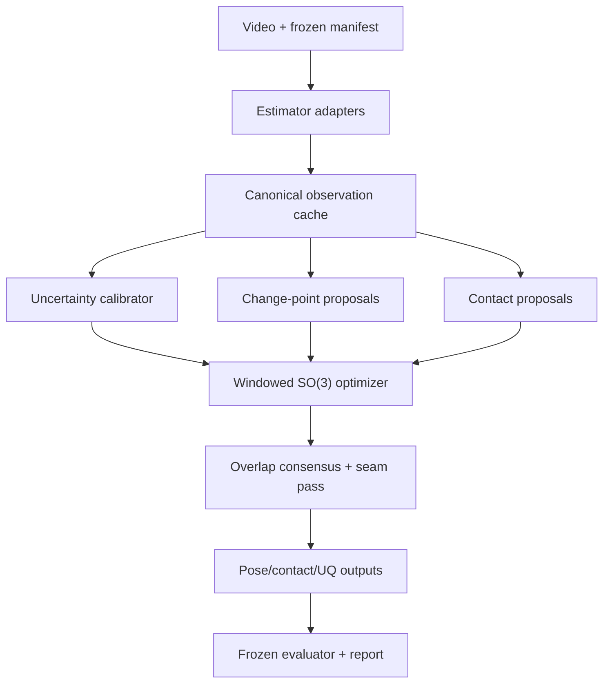

# SIGNAL-4D — đặc tả kỹ thuật end-to-end để triển khai

**Tên phương pháp:** SIGNAL-4D — *Uncertainty-Gated Contact Graphs for Semantically Faithful 3D Sign Reconstruction*  
**Loại tài liệu:** implementation specification + experimental contract  
**Phiên bản:** 0.1.0  
**Ngày:** 2026-08-15  
**Trạng thái:** thiết kế kỹ thuật; chưa phải kết quả thực nghiệm  
**Mốc DexAvatar được đối chiếu:** commit `a0dfd427f60f5811aadb35c8657b3856d47f56b5`

---

## 0. Decision header

**Giai đoạn hiện tại:** đặc tả phương pháp và protocol đã đủ chi tiết để bắt đầu implementation; chưa có code SIGNAL-4D hay kết quả benchmark.

**Đã xác minh:** pipeline DexAvatar hiện tại chạy theo frame, lấy SMPLer-X làm initialization, HaMeR/Sapiens làm evidence, tối ưu chủ yếu latent pose prior, dùng previous-frame state làm temporal reference, và chưa có evaluator phát hành để tái tạo Table 1.

**Chưa xác minh:** dữ liệu/checkpoint đầy đủ, exact evaluation manifest, khả năng tái tạo số DexAvatar, chất lượng WiLoR trên SGNify, chất lượng contact labels và mức headroom còn lại sau baseline đơn giản.

**Quyết định cần đưa ra:** chỉ triển khai theo thứ tự `M0 → M1 → M2`; không xây full contact/UQ stack nếu M1 không vượt M0 dưới protocol đã freeze.

---

## 1. Mục tiêu và non-goals

### 1.1 Mục tiêu kỹ thuật

Từ một clip video monocular của người ký, hệ thống phải xuất:

1. Chuỗi tham số SMPL-X hoàn chỉnh, nhất quán theo thời gian.
2. Mesh/joints cho upper body, left hand và right hand ở mọi frame trong manifest.
3. Contact graph theo frame và contact events theo thời gian.
4. Uncertainty theo joint/region/frame, đã được calibration trên calibration split.
5. Abstention/risk score để downstream system biết frame hoặc vùng nào không đáng tin.
6. Provenance đủ để tái tạo: config, manifest, code commit, checkpoint hash và raw factor diagnostics.

### 1.2 Mục tiêu khoa học

Phương pháp chỉ được coi là thành công nếu đồng thời:

- Giảm reconstruction error dưới cùng alignment/protocol.
- Không đổi accuracy lấy over-smoothing.
- Cải thiện contact correctness hoặc semantic fidelity.
- Uncertainty có ích cho error detection/abstention.
- Gain không chỉ đến từ việc dùng initializer mới hơn.

### 1.3 Non-goals của phiên bản đầu

- Không huấn luyện một foundation model video-to-SMPL-X từ đầu.
- Không giải quyết multi-person hoặc camera chuyển động mạnh trong MVP.
- Không tuyên bố real-time; pipeline ban đầu là offline optimization.
- Không thay face/non-manual reconstruction trừ khi có ground truth tương ứng.
- Không dùng test set để chọn loss weight, threshold, checkpoint hoặc stopping rule.
- Không sửa pipeline legacy trước khi baseline reproduction được khóa.

---

## 2. Phạm vi các phiên bản

| Phiên bản | Thành phần | Mục đích | Điều kiện lên phiên bản tiếp theo |
|---|---|---|---|
| **M0 — Modernized baseline** | SMPLer-X body + WiLoR hands + geodesic smoother + frozen evaluator | Cheapest falsifier; đo gain do estimator mới | Evaluator pass; coverage 100%; baseline ổn định |
| **M1 — SIGNAL-4D Lite** | Multi-hypothesis + calibrated observation uncertainty + adaptive temporal factors | Kiểm tra core UQ–temporal contribution | Vượt M0 trên confirmatory dev criteria |
| **M2 — Full SIGNAL-4D** | M1 + switchable contact graph + collision separation + abstention | Kiểm tra contact/semantic contribution | Contact labels đủ tin cậy; M1 có headroom |
| **M3 — Optional learned extensions** | Learned change-point/contact proposal network; richer video features | Chỉ dùng nếu rule-based M2 chứng minh bottleneck | Ablation cho thấy module học là cần thiết |

Quy tắc: mọi phiên bản phải dùng cùng manifest, initializer contract, evaluator và missing-frame policy khi so sánh.

---

## 3. Kiến trúc tổng thể



### 3.1 Nguyên tắc kiến trúc

1. **Legacy isolation:** giữ nguyên DexAvatar để tái tạo baseline; SIGNAL-4D là package độc lập.
2. **Adapter boundary:** mọi estimator phải chuyển output về canonical schema trước optimization.
3. **No silent dropping:** thiếu output của một estimator được biểu diễn bằng mask; frame không bị loại khỏi manifest.
4. **Metric firewall:** evaluator không import training/tuning code và không cho đọc test labels trong quá trình fit/calibrate.
5. **Deterministic artifacts:** mọi intermediate cache có schema version và checksum.
6. **Factor observability:** mỗi factor trả cả scalar loss lẫn diagnostics theo frame/joint.
7. **Fail closed:** mismatch coordinate, joint mapping hoặc checkpoint hash phải làm pipeline dừng.

---

## 4. Cấu trúc repository đề xuất

Không viết trực tiếp vào `dexavatar_fitting/smplifyx/` trong M0–M2. Tạo một project sibling:

```text
signal4d/
├── pyproject.toml
├── README.md
├── LICENSE
├── CITATION.cff
├── configs/
│   ├── data/
│   │   ├── sgnify_legacy.yaml
│   │   └── synthetic_smoke.yaml
│   ├── estimator/
│   │   ├── smplerx.yaml
│   │   ├── hamer.yaml
│   │   ├── wilor.yaml
│   │   └── sapiens.yaml
│   ├── method/
│   │   ├── m0.yaml
│   │   ├── m1.yaml
│   │   └── m2.yaml
│   ├── protocol/
│   │   ├── legacy_track.yaml
│   │   └── clean_track.yaml
│   └── runtime/
│       ├── cpu_smoke.yaml
│       └── gpu.yaml
├── schemas/
│   ├── clip_manifest.schema.json
│   ├── observation_meta.schema.json
│   └── prediction_meta.schema.json
├── src/signal4d/
│   ├── cli/
│   │   ├── build_manifest.py
│   │   ├── preprocess.py
│   │   ├── calibrate.py
│   │   ├── fit.py
│   │   ├── evaluate.py
│   │   └── run_pipeline.py
│   ├── config.py
│   ├── protocol.py
│   ├── data/
│   │   ├── manifest.py
│   │   ├── cache.py
│   │   ├── dataset.py
│   │   ├── provenance.py
│   │   └── validation.py
│   ├── adapters/
│   │   ├── base.py
│   │   ├── smplerx.py
│   │   ├── hamer.py
│   │   ├── wilor.py
│   │   ├── sapiens.py
│   │   └── legacy_dexavatar.py
│   ├── geometry/
│   │   ├── so3.py
│   │   ├── projection.py
│   │   ├── alignment.py
│   │   ├── handedness.py
│   │   └── mesh_regions.py
│   ├── models/
│   │   ├── smplx_wrapper.py
│   │   ├── pose_prior.py
│   │   ├── uncertainty.py
│   │   ├── change_point.py
│   │   └── contact_proposer.py
│   ├── factors/
│   │   ├── base.py
│   │   ├── observation_2d.py
│   │   ├── observation_3d.py
│   │   ├── rotation_observation.py
│   │   ├── pose_prior.py
│   │   ├── temporal.py
│   │   ├── contact.py
│   │   ├── collision.py
│   │   └── shape_camera.py
│   ├── optimization/
│   │   ├── state.py
│   │   ├── schedules.py
│   │   ├── window.py
│   │   ├── solver.py
│   │   ├── consensus.py
│   │   └── recovery.py
│   ├── evaluation/
│   │   ├── evaluator.py
│   │   ├── geometric.py
│   │   ├── dynamics.py
│   │   ├── contact.py
│   │   ├── uncertainty.py
│   │   ├── semantic.py
│   │   ├── bootstrap.py
│   │   └── tables.py
│   ├── io/
│   │   ├── predictions.py
│   │   ├── rendering.py
│   │   └── safe_load.py
│   └── utils/
│       ├── hashing.py
│       ├── logging.py
│       ├── seed.py
│       └── distributed.py
├── tests/
│   ├── unit/
│   ├── integration/
│   ├── regression/
│   └── fixtures/
├── scripts/
│   ├── convert_dexavatar_cache.py
│   ├── make_synthetic_clip.py
│   └── verify_environment.py
└── docs/
    ├── coordinate_conventions.md
    ├── data_access.md
    └── experiment_protocol.md
```

---

## 5. Runtime và dependency policy

### 5.1 Stack tối thiểu

- Python 3.10 hoặc 3.11; chọn một phiên bản và khóa trong CI/container.
- PyTorch + CUDA phiên bản đã kiểm tra trên hardware thực tế.
- `smplx` hoặc implementation SMPL-X đã được kiểm chứng với checkpoint hợp lệ.
- NumPy, SciPy, OpenCV, einops.
- Pydantic cho schema/runtime validation.
- Hydra/OmegaConf hoặc một config system tương đương.
- safetensors cho tensor artifacts; JSON/JSONL cho metadata.
- pytest, coverage, ruff và mypy/pyright.
- pandas/pyarrow chỉ cho reporting; không nằm trong optimization hot path.

Không khóa version theo phỏng đoán trong tài liệu này. Sau environment smoke test, sinh lock file và ghi lại:

- CUDA driver/runtime.
- GPU model.
- PyTorch build.
- Compiler ABI cho CUDA extensions.
- SMPL-X package/model version.

### 5.2 Security và artifact loading

- Không `exec()` code tải từ checkpoint.
- Không tải model code động từ Internet trong benchmark run.
- Ưu tiên safetensors; nếu buộc đọc `.pt/.pkl`, chỉ đọc artifact tin cậy và dùng `weights_only=True` khi khả dụng.
- Mọi checkpoint phải có SHA-256 trong registry.
- Không redistribute SMPL-X/SMPLer-X/WiLoR/HaMeR weights nếu license không cho phép.
- `preprocess` phải offline-capable sau khi người dùng đặt checkpoint đúng chỗ.

---

## 6. Coordinate, unit và joint conventions

Đây là phần bắt buộc phải hoàn tất trước model work. Phần lớn lỗi hand reconstruction đến từ coordinate/handedness mismatch.

### 6.1 Canonical spaces

Định nghĩa ba không gian tách biệt:

1. **Image space:** pixel coordinates `(u, v)`, origin trên-trái, `u` sang phải, `v` xuống dưới.
2. **Camera space:** OpenCV convention, `+x` sang phải, `+y` xuống, `+z` hướng từ camera vào scene; đơn vị mét.
3. **SMPL-X local space:** local joint rotations theo kinematic tree của model; không giả định axis convention bằng camera space.

Mọi adapter phải trả một transform có tên rõ ràng, ví dụ:

```text
T_camera_from_estimator
T_camera_from_smplx_root
R_smplx_local_from_estimator_local[joint]
```

Không dùng tên mơ hồ như `trans`, `cam`, `world_rot` nếu chưa định nghĩa hướng transform.

### 6.2 Rotation representation

- Storage/interchange: rotation matrix `[3,3]` hoặc quaternion canonicalized.
- Optimization MVP: 6D continuous rotation representation chuyển sang matrix.
- Full solver: local tangent increments và retraction trên `SO(3)`.
- Axis-angle chỉ dùng khi gọi SMPL-X API hoặc đọc legacy output.

Geodesic distance:

\[
d_{SO(3)}(R_1,R_2)=\|\operatorname{Log}(R_1^\top R_2)\|_2.
\]

Yêu cầu numerical:

- Clamp trace trước `acos`.
- Series expansion gần zero.
- Stable branch gần \(\pi\).
- Unit tests float64; production có thể float32 sau khi pass.

### 6.3 SMPL-X state shape

Canonical state cho clip dài `T`:

| Field | Shape | Đơn vị/representation |
|---|---:|---|
| `global_orient` | `[T, 3, 3]` | rotation matrix |
| `body_pose` | `[T, 21, 3, 3]` | SMPL-X local joint rotations |
| `left_hand_pose` | `[T, 15, 3, 3]` | SMPL-X/MANO joint order đã map |
| `right_hand_pose` | `[T, 15, 3, 3]` | như trên |
| `jaw_pose` | `[T, 1, 3, 3]` | optional/frozen trong MVP |
| `expression` | `[T, E]` | optional/frozen trong MVP |
| `betas` | `[1, B]` | shared trong clip |
| `translation` | `[T, 3]` | camera space, mét |
| `contact_logits` | `[T, C]` | chỉ M2 |

`B` và `E` lấy từ model metadata, không hard-code trong downstream code.

### 6.4 Joint/vertex regions

Tạo `MeshRegionRegistry` có version và hash, bao gồm:

- Upper-body evaluation vertices.
- Left/right hand vertices.
- 21 hand landmarks mỗi bên.
- Contact regions: palm, five fingertips, phalanges nếu cần, wrist.
- Body contact regions: chin/lips/cheeks, chest, shoulders, upper/lower arms.
- Collision exclusion pairs: adjacent kinematic parts không được tính là collision.

Registry phải sinh từ model version cụ thể và fail nếu vertex count không khớp.

---

## 7. Frozen manifest và data protocol

### 7.1 Manifest là nguồn sự thật duy nhất

Mỗi dòng JSONL mô tả một clip:

```json
{
  "schema_version": "1.0",
  "dataset": "sgnify",
  "clip_id": "clip_0001",
  "signer_id": "signer_XX",
  "split": "development",
  "fps": 25.0,
  "frame_start": 164,
  "frame_end_exclusive": 215,
  "frame_ids": [164, 165, 166],
  "image_relpaths": ["clip_0001/images/low_164.png"],
  "gt_relpath": "gt/clip_0001.safetensors",
  "sign_type": "unknown",
  "language": "unknown",
  "allowed_for_calibration": true,
  "allowed_for_hparam_selection": true,
  "allowed_for_final_reporting": false
}
```

Danh sách thực phải chứa toàn bộ `frame_ids` và `image_relpaths`; ví dụ trên được rút gọn.

### 7.2 Endpoint convention

Chỉ dùng `[start, end_exclusive)`. Không dùng cặp inclusive mà không ghi rõ. Validator bắt buộc:

```python
assert len(frame_ids) == frame_end_exclusive - frame_start
assert frame_ids == list(range(frame_start, frame_end_exclusive))
```

Nếu clip có missing raw frames, không dùng range assertion; phải liệt kê explicit IDs và đặt `is_contiguous=false`.

### 7.3 Split roles

| Split | Có GT trong fitter? | Calibration | Chọn hyperparameter | Báo cáo cuối |
|---|---:|---:|---:|---:|
| Train/prior | Có | Không | Không | Không |
| Calibration | Có | Có | Không | Không |
| Development | Có | Không | Có | Exploratory only |
| Test | Không trong fitter | Không | Không | Có |

`ProtocolGuard` phải từ chối chạy `calibrate` hoặc `tune` nếu manifest chứa `split=test`.

### 7.4 Missingness policy

- Frame trong manifest luôn tồn tại trong output.
- Estimator missing → `valid=false`, uncertainty lớn, không xóa frame.
- Image missing/corrupt → toàn clip fail preprocessing; không silently skip.
- Prediction missing → evaluator fail completeness check.
- GT missing cho một region → metric region đó đánh dấu unavailable; không đưa frame ra khỏi metric khác.

### 7.5 Provenance record

Mỗi run ghi:

```json
{
  "run_id": "uuid",
  "git_commit": "...",
  "dirty_worktree": false,
  "manifest_sha256": "...",
  "config_sha256": "...",
  "checkpoint_sha256": {},
  "environment_lock_sha256": "...",
  "seed": 12345,
  "hostname_class": "gpu-a100-80gb",
  "started_at_utc": "...",
  "completed_at_utc": "..."
}
```

Không ghi hostname/user path thật vào artifact public.

---

## 8. Canonical observation cache

### 8.1 Lý do

DexAvatar hiện đọc các pickle có cấu trúc phụ thuộc trực tiếp vào từng estimator. SIGNAL-4D phải chuyển một lần sang schema an toàn, có mask và coordinate metadata.

Mỗi clip cache:

```text
cache/<dataset>/<clip_id>/
├── observations.safetensors
├── metadata.json
├── source_hashes.json
└── preprocess_diagnostics.json
```

### 8.2 Tensor schema

Ký hiệu:

- `T`: số frame.
- `S`: số estimator/source.
- `J`: canonical joint count.
- `K`: số 2D keypoint.
- `F`: số uncertainty features.

| Tensor | Shape | Ý nghĩa |
|---|---:|---|
| `frame_ids` | `[T]` | ID đúng theo manifest |
| `image_size` | `[T,2]` | height, width |
| `keypoints_2d` | `[T,S,K,2]` | canonical pixel coordinates |
| `keypoints_2d_conf` | `[T,S,K]` | raw confidence, chưa calibration |
| `joints_3d` | `[T,S,J,3]` | camera space, mét |
| `rotations` | `[T,S,J,3,3]` | local/global theo joint metadata |
| `valid_2d` | `[T,S,K]` | boolean |
| `valid_3d` | `[T,S,J]` | boolean |
| `valid_rot` | `[T,S,J]` | boolean |
| `features` | `[T,S,J,F]` | features cho uncertainty |
| `bbox_xyxy` | `[T,S,3,4]` | body, left hand, right hand |
| `camera_K` | `[T,3,3]` | intrinsics |
| `init_smplx_*` | theo state | initialization từ SMPLer-X |

Mọi invalid value có thể là zero trong tensor nhưng bắt buộc có mask. Không dùng `NaN` làm control flow trong optimizer.

### 8.3 Source registry

`metadata.json` chứa thứ tự source:

```json
{
  "schema_version": "1.0",
  "clip_id": "clip_0001",
  "sources": [
    {"source_id": 0, "name": "smplerx", "version": "pinned"},
    {"source_id": 1, "name": "hamer", "version": "pinned"},
    {"source_id": 2, "name": "wilor", "version": "pinned"},
    {"source_id": 3, "name": "sapiens", "version": "pinned"}
  ],
  "camera_convention": "opencv_x_right_y_down_z_forward",
  "length_unit": "meter",
  "rotation_convention": "matrix_local_parent_to_child",
  "joint_registry_sha256": "...",
  "mesh_region_registry_sha256": "..."
}
```

### 8.4 Adapter interface

```python
from dataclasses import dataclass
from pathlib import Path
from typing import Protocol

@dataclass(frozen=True)
class ClipContext:
    clip_id: str
    frame_ids: tuple[int, ...]
    image_paths: tuple[Path, ...]
    fps: float
    camera_K: "Tensor"           # [T, 3, 3]

@dataclass
class AdapterOutput:
    source_name: str
    tensors: dict[str, "Tensor"]
    masks: dict[str, "Tensor"]
    metadata: dict[str, object]
    diagnostics: dict[str, object]

class EstimatorAdapter(Protocol):
    def validate_assets(self) -> None: ...
    def infer(self, clip: ClipContext) -> AdapterOutput: ...
    def canonicalize(self, raw: AdapterOutput) -> AdapterOutput: ...
```

Adapter không được tự loại frame. `infer()` phải trả `T` phần tử hoặc raise lỗi.

---

## 9. Estimator adapters

### 9.1 SMPLer-X adapter

Trách nhiệm:

- Đọc hoặc chạy SMPLer-X trên toàn bộ frame manifest.
- Chuẩn hóa body/hand rotations về joint registry.
- Convert weak-perspective camera hoặc translation sang canonical camera model khi có đủ thông tin.
- Trả shape proposal và full SMPL-X initialization.
- Trả masks riêng cho body, left hand, right hand, face.

Validation:

- Re-render mesh từ params và so projected joints với output 2D.
- Median reprojection discrepancy phải dưới threshold dev đã định.
- Betas không được thay đổi bất thường theo frame; lưu variance để audit.

### 9.2 HaMeR/WiLoR adapters

Hai adapter phải có cùng output contract để fusion công bằng.

Các bước bắt buộc:

1. Route detection bằng handedness flag, không bằng detection index.
2. Giữ mọi detection candidate trước NMS giới hạn, ví dụ top-2 mỗi bên.
3. Uncrop 2D joints về full-image pixel coordinates.
4. Convert MANO local rotations sang SMPL-X hand order.
5. Align hand root tại wrist của body initialization; không dịch độc lập sau evaluator alignment.
6. Lưu raw confidence, bbox size, crop truncation và handedness probability.
7. Nếu không có hand detection, set masks false; không reuse previous observation với confidence 1.

Handedness synthetic test:

- Tạo một asymmetric hand pose.
- Project trái/phải qua adapter.
- Verify thumb nằm đúng phía và joint order không đảo.
- Mirror hai lần phải thu lại pose ban đầu trong tolerance.

### 9.3 Sapiens/2D adapter

- Map keypoints bằng explicit lookup table có version.
- Confidence giữ nguyên raw và thêm `valid = confidence >= adapter_floor`; threshold này chỉ bỏ giá trị rõ ràng invalid, không phải hparam mô hình.
- Normalize residual trong factor bằng image diagonal, không normalize raw cache.
- Với keypoint ngoài frame hoặc non-finite, set invalid.

### 9.4 Optical-flow adapter — optional M1

Không dùng flow để trực tiếp đặt 3D pose. Chỉ dùng để:

- Theo dõi 2D landmarks giữa frame.
- Tạo motion-consistency feature.
- Hỗ trợ change-point proposal.

Flow confidence phải giảm ở occlusion/forward-backward inconsistency.

### 9.5 Legacy DexAvatar adapter

Mục đích duy nhất là đọc output cũ vào canonical prediction schema để evaluator so sánh.

- Không reinterpret loss hay sửa kết quả.
- Ghi chính xác frame nào có/mất output.
- Chuyển `.pkl` tin cậy sang safetensors/JSON một lần.
- Tách `legacy_raw` và `canonicalized` để có thể audit transformation.

---

## 10. State và output contracts

### 10.1 SequenceState

```python
@dataclass
class SequenceState:
    global_rot6d: Tensor       # [T, 6]
    body_rot6d: Tensor         # [T, 21, 6]
    left_hand_rot6d: Tensor    # [T, 15, 6]
    right_hand_rot6d: Tensor   # [T, 15, 6]
    translation: Tensor        # [T, 3]
    betas: Tensor              # [1, B]
    expression: Tensor | None  # [T, E]
    contact_logits: Tensor | None  # [T, C]

    def rotations(self) -> dict[str, Tensor]: ...
    def validate(self) -> None: ...
```

`SequenceState` không chứa observation. Không cho factor mutate state.

### 10.2 Prediction artifact

```text
predictions/<run_id>/<clip_id>/
├── smplx.safetensors
├── contacts.safetensors
├── uncertainty.safetensors
├── metadata.json
├── factor_diagnostics.jsonl
└── preview.mp4               # optional, không dùng cho metrics
```

`smplx.safetensors` bắt buộc có tất cả frame manifest. `metadata.json` ghi:

- State schema/version.
- SMPL-X model identifier/hash, không chứa model bytes.
- Coordinate convention.
- Window boundaries và merge weights.
- Optimizer convergence/fallback status.
- Output validity mask và lý do abstention.

### 10.3 Abstention output

Không xóa pose khi abstain. Trả cả pose estimate và:

- `risk_score[T,R]` cho body/left/right/contact.
- `abstain[T,R]` boolean theo threshold đã freeze.
- `prediction_set_radius[T,R]` nếu dùng conformal sets.

Downstream quyết định có sử dụng pose hay không.

---

## 11. Uncertainty subsystem

### 11.1 Vai trò

Uncertainty được dùng ở bốn nơi:

1. Whiten observation residuals.
2. Điều chỉnh temporal reliance ở frame khó.
3. Giảm contact prior khi evidence yếu.
4. Sinh risk/abstention output.

Không dùng một scalar confidence chung cho toàn frame.

### 11.2 Feature vector

Mỗi source–joint–frame có thể dùng:

- Raw detector confidence/logit.
- Bbox area / image area.
- Crop truncation fraction.
- Blur score trong crop.
- Occlusion proxy.
- Distance tới image border.
- 2D reprojection residual của initializer.
- Pairwise disagreement giữa estimators.
- Temporal forward/backward inconsistency.
- Handedness entropy.
- Source ID, joint group và side embedding.
- Missingness run length trước/sau frame.

Không dùng test GT-derived feature.

### 11.3 Calibrator API

```python
class UncertaintyCalibrator(nn.Module):
    def forward(
        self,
        features: Tensor,       # [T,S,J,F]
        valid: Tensor           # [T,S,J]
    ) -> dict[str, Tensor]:
        """Return sigma_xyz, sigma_rot and risk logits."""
```

Output:

- `sigma_xyz[T,S,J,3]`.
- `sigma_rot[T,S,J,3]` trong tangent space.
- `risk_logit[T,S,J]`.

Clamp:

\[
\sigma=\sigma_{min}+\operatorname{softplus}(a), \qquad
\sigma\leftarrow\min(\sigma,\sigma_{max}).
\]

`sigma_min/max` được chọn trên calibration/development, không test.

### 11.4 Training objective

Với residual target \(e\), dùng heteroscedastic Gaussian NLL hoặc Student-t NLL:

\[
\mathcal L_{NLL}
=\frac{1}{2}\left(\frac{e^2}{\sigma^2}+2\log\sigma\right).
\]

Student-t phù hợp hơn nếu lỗi estimator có heavy tail.

Train theo group-balanced batches để hand joints không bị body joints áp đảo. Groups tối thiểu:

- Body core.
- Wrist.
- Left/right fingers.
- Visible/occluded.
- Small/large hand crops.

### 11.5 Calibration stage

Sau model fit, dùng calibration split để tìm group scale \(q_g\):

\[
\tilde\sigma_{i}=q_{g(i)}\sigma_i.
\]

Có thể chọn `q_g` bằng empirical quantile hoặc conformal nonconformity score. Freeze artifact:

```text
calibration/<calibrator_id>/
├── weights.safetensors
├── group_scales.json
├── feature_normalization.json
├── calibration_manifest_sha256.txt
└── metrics.json
```

### 11.6 Fallback nếu thiếu calibration labels

M1 được phép dùng heuristic uncertainty:

\[
u = a(1-c)+b\,d_{ensemble}+c\,r_{reproj}+d\,o_{border}.
\]

Nhưng phải gọi là *uncertainty proxy*, không tuyên bố calibrated uncertainty. M2/full claims bị chặn cho đến khi có calibration split hợp lệ.

---

## 12. Change-point subsystem

### 12.1 Định nghĩa

Change point là thời điểm không nên áp constant-velocity smoothing mạnh vì có thay đổi có thể mang nghĩa:

- Handshape transition.
- Wrist orientation change.
- Contact onset/offset.
- Direction reversal.
- Movement hold bắt đầu/kết thúc.

### 12.2 Rule-based M1

Tính các features đã reliability-weighted:

\[
f_t = [v^{wrist}_t,a^{wrist}_t,
d_{SO(3)}^{hand}_t,
d^{handshape}_t,
d^{contact}_t,
d^{flow}_t].
\]

Chuẩn hóa bằng robust median/MAD trên development clips. Sau đó:

\[
p_t^{cp}=\sigma(w^\top f_t+b).
\]

`w,b` có thể là fixed monotonic weights ở MVP hoặc logistic regression trên calibration/development labels. Không cho disagreement đơn lẻ tạo change point; yêu cầu ít nhất hai cue đáng tin hoặc một cue vượt high threshold.

### 12.3 Learned M3

Nếu cần, dùng temporal convolution/transformer nhỏ nhận observation features, không nhận test GT. Output:

- `p_change[T]`.
- Optional type: handshape, direction, contact, hold.

Loss:

- Focal BCE cho sparse boundaries.
- Temporal tolerance loss quanh annotated boundary.
- Calibration loss cho change probability.

Learned model chỉ là contribution phụ; rule-based variant luôn được giữ làm ablation.

---

## 13. Contact subsystem

### 13.1 Contact region graph

Graph chỉ gồm anatomically/linguistically plausible edges, ví dụ:

- Left fingertips ↔ right fingertips/palm.
- Left palm ↔ right palm/back-of-hand.
- Hand/fingertips ↔ chin, lips, cheek, chest, shoulder, forearm.

Không tạo all-to-all vertex graph.

Mỗi edge `c` lưu:

```python
@dataclass(frozen=True)
class ContactEdgeSpec:
    edge_id: str
    region_a: str
    region_b: str
    target_distance_m: float
    enter_threshold_m: float
    exit_threshold_m: float
    allow_tangential_slide: bool
    collision_exempt_when_active: bool
```

Yêu cầu `enter_threshold < exit_threshold` để tạo hysteresis.

### 13.2 Candidate proposal

Broad-phase mỗi frame:

1. Forward SMPL-X initialization để lấy region vertices.
2. Tính region AABB/kNN distance.
3. Giữ edge nếu khoảng cách 3D dưới `proposal_radius_m` hoặc 2D proximity rất cao.
4. Bổ sung evidence từ image overlap, visibility và estimator agreement.
5. Expand candidate ±`contact_context_frames` quanh proposal để bắt onset/offset.

Contact proposal probability:

\[
\pi_{t,c}=P(c_{t,c}=1\mid d_{3D},d_{2D},visibility,flow,history).
\]

MVP dùng calibrated logistic/rule; learned network chỉ ở M3.

### 13.3 Soft switch

State:

\[
s_{t,c}=\sigma(z_{t,c})\in(0,1).
\]

Distance factor:

\[
E_{contact}=
\sum_{t,c}s_{t,c}\,
\rho\!\left(\frac{d(M^a_{t,c},M^b_{t,c})-\delta_c}{\sigma^d_{t,c}}\right).
\]

Switch evidence factor:

\[
E_{evidence}=\sum_{t,c}
\operatorname{BCE}(s_{t,c},\pi_{t,c}).
\]

Persistence factor:

\[
E_{persist}=\sum_{t,c}w^{contact}_{t,c}|s_{t,c}-s_{t-1,c}|,
\]

trong đó weight giảm gần contact change proposal.

### 13.4 Contact kinematics

Khi contact active:

- Penalize normal separation/interpenetration.
- Không mặc định penalize toàn bộ tangential velocity vì nhiều sign có sliding contact.
- Với edge `allow_tangential_slide=false`, thêm relative-velocity factor.

Normal relative velocity:

\[
r_{normal}=mathbf n^\top(\mathbf v_a-\mathbf v_b).
\]

### 13.5 Collision tách biệt

Collision factor chỉ phạt signed penetration:

\[
E_{collision}=\sum \rho(\max(0,-\operatorname{SDF}(v,M)))^2.
\]

Quy tắc:

- Exclude adjacent body parts.
- Contact edge active không có nghĩa cho phép deep penetration.
- Dùng coarse collision mesh trong optimization, full mesh cho final audit.
- Collision computation phải chunk theo vertices để tránh OOM.

### 13.6 Contact hard decoding

Sau optimization, dùng hysteresis:

```python
active = False
for t in range(T):
    if not active and s[t] >= enter_prob and distance[t] <= enter_distance:
        active = True
    elif active and (s[t] < exit_prob or distance[t] > exit_distance):
        active = False
    contact[t] = active
```

Threshold freeze trước test.

---

## 14. Factor graph và hàm mục tiêu

### 14.1 Tổng quan

Cho state \(X\), contact switches \(C\), observations \(O\):

\[
\begin{aligned}
E(X,C;O)=&
\lambda_{2D}E_{2D}
+\lambda_{3D}E_{3D}
+\lambda_{rot}E_{rot}\\
&+\lambda_{prior}E_{prior}
+\lambda_{temp}E_{temp}
+\lambda_{contact}E_{contact}\\
&+\lambda_{switch}E_{switch}
+\lambda_{collision}E_{collision}
+\lambda_{shape}E_{shape}
+\lambda_{camera}E_{camera}.
\end{aligned}
\]

Mỗi factor phải trả loss đã normalize theo số residual hợp lệ; không dùng raw sum khiến clip dài tự động có loss lớn hơn.

### 14.2 Robust kernel

Default dùng pseudo-Huber:

\[
\rho(r;\delta)=\delta^2(\sqrt{1+(r/\delta)^2}-1).
\]

`delta` theo loại residual và được freeze trên development. Báo cáo ablation L2 vs robust.

### 14.3 2D reprojection factor

\[
r^{2D}_{t,s,j}=
\frac{\Pi(K_t,J_t(X)_j)-u_{t,s,j}}
{\sqrt{H_t^2+W_t^2}}.
\]

Weight:

\[
w^{2D}_{t,s,j}=m_{t,s,j}/(\sigma^{2D}_{t,s,j})^2.
\]

Loss:

\[
E_{2D}=\operatorname{mean}_{valid}\rho(\sqrt{w}\,r^{2D}).
\]

Không đặt confidence hand thành 1 khi observation là copied/missing.

### 14.4 3D observation factor

Với estimator trả root-relative 3D hand:

1. Align root với SMPL-X wrist trong state.
2. Không fit scale per frame nếu muốn giữ scale information.
3. Nếu source scale không calibrated, thêm source-level scale nuisance được regularize và shared theo clip, không per-frame.

\[
r^{3D}_{t,s,j}=J_t(X)_j-\hat J^{s}_{t,j}.
\]

### 14.5 Rotation observation factor

\[
r^{rot}_{t,s,j}
=\operatorname{Log}\left((\hat R^s_{t,j})^\top R_{t,j}(X)\right).
\]

Whiten trong tangent space bằng diagonal/full covariance nếu có.

### 14.6 Pose prior factor

Hai mode:

1. **Legacy-compatible:** frozen SignBPoser/SignHPoser latent priors nếu assets hợp lệ.
2. **Residual prior:** optimize cả prior latent `z` và residual tangent rotation:

\[
R_j=\operatorname{Exp}(\Delta\theta_j)R^{prior}_j(z).
\]

Energy:

\[
E_{prior}=\|z\|^2_{\Sigma_z^{-1}}
+\lambda_{res}\sum_j\|\Delta\theta_j\|^2.
\]

Residual mode tránh việc optimizer chỉ có thể di chuyển trong manifold quá hẹp của prior.

### 14.7 Temporal factor trên SO(3)

Angular velocity:

\[
\omega_{t,j}=\operatorname{Log}(R_{t-1,j}^\top R_{t,j})/\Delta t.
\]

Constant-velocity residual:

\[
r^{acc}_{t,j}=\omega_{t,j}-\omega_{t-1,j}.
\]

Adaptive weight:

\[
w^{temp}_{t,j}=\operatorname{clip}\left[
\lambda_j(1-p^{cp}_t)^\gamma(1+\alpha\bar u_{t,j}),
w_{min},w_{max}
\right].
\]

Giải thích:

- `p_cp` cao → giảm smoothing để bảo toàn transition.
- Observation uncertainty vừa phải → tăng reliance vào temporal context.
- `w_max` ngăn occlusion dài làm pose đóng băng.
- Với occlusion dài, prior/contact/multi-window context phải cùng tham gia.

Translation dùng constant-velocity residual tương tự, theo mét/giây.

### 14.8 Shape/camera factors

- `betas` shared theo clip; regularize về initialization/zero prior.
- Camera intrinsics freeze nếu có calibration đáng tin.
- Nếu focal length optimize, chỉ một biến shared theo clip và có prior mạnh.
- Không cho per-frame focal length tự hấp thụ pose error.

### 14.9 Total factor normalization

Mỗi factor trả:

```python
@dataclass
class FactorResult:
    loss: Tensor                 # scalar mean over valid residuals
    valid_count: int
    per_frame: Tensor            # [T]
    residual_quantiles: dict[str, float]
    diagnostics: dict[str, Tensor | float]
```

Nếu `valid_count == 0`, factor trả zero loss và warning code; không chia zero.

---

## 15. Factor API

```python
class Factor(nn.Module):
    name: str

    def forward(
        self,
        state: SequenceState,
        model_output: "SMPLXOutput",
        observations: "ObservationBatch",
        context: "FactorContext",
    ) -> FactorResult:
        ...

@dataclass(frozen=True)
class FactorContext:
    frame_slice: slice
    fps: float
    stage: str
    uncertainty: dict[str, Tensor]
    change_probability: Tensor
    contact_candidates: "ContactCandidates | None"
```

Yêu cầu:

- Pure function đối với state/observations.
- Không update global counters bên trong `forward`.
- Có thể bật/tắt bằng config.
- Diagnostics không giữ computation graph trừ khi debug mode.
- Mỗi factor có unit test bằng synthetic input.

---

## 16. Solver và optimization schedule

### 16.1 Lựa chọn implementation

MVP dùng differentiable optimization bằng PyTorch để giảm dependency. Không cần GTSAM/Theseus ở giai đoạn đầu.

Hai parameterization:

- **M0/M1:** optimize rotation-6D, convert sang matrix trong forward.
- **M2/full:** có thể chuyển sang tangent-increment retraction nếu 6D gây conditioning kém.

Không tối ưu raw rotation matrix không constraint.

### 16.2 Windowing

Default ban đầu, phải tune trên dev:

- Window length: 64 frame.
- Stride: 32 frame.
- Overlap: 32 frame.
- Context padding estimator features: 8 frame mỗi bên.

Không tách clip tại frame bất kỳ nếu có known sign boundary/contact event gần đó; window planner có thể dịch boundary trong phạm vi nhỏ.

### 16.3 Stage schedule

| Stage | Variables trainable | Factors | Mục tiêu |
|---|---|---|---|
| A | root, translation, body core | 2D/3D body, camera, shape | ổn định camera/body |
| B | wrists, hands, residual pose | hand obs, rotation obs, prior | sửa articulation |
| C | toàn pose trừ shape optional | + adaptive temporal | sequence consistency |
| D | contact logits + related joints | + contact/collision/switch | contact refinement |
| E | toàn state với LR nhỏ | tất cả | joint refinement |

M0 chạy A–C không uncertainty learning/contact. M1 chạy A–C với uncertainty. M2 chạy A–E.

### 16.4 Optimizer schedule ban đầu

Các giá trị sau là engineering defaults, không phải giá trị paper:

1. AdamW/Adam, 100–300 step mỗi stage.
2. Gradient clipping theo norm.
3. Reduce LR khi normalized energy plateau.
4. Optional LBFGS 20–50 iteration để polish sau Adam.
5. Early stop nếu relative energy improvement nhỏ hơn tolerance trong `patience` steps.

Không dùng weight decay cho rotations/contact logits trừ khi có lý do rõ ràng; priors đã đóng vai trò regularization.

### 16.5 Stability rules

- Save best state theo total normalized energy, không chỉ last state.
- Nếu non-finite: halve LR, restore best state và retry tối đa N lần.
- Nếu rotation determinant lệch tolerance: fail stage.
- Nếu translation hoặc betas vượt physical guardrail: restore/fail.
- Log gradient norm theo variable group.
- Contact stage không được di chuyển wrist quá trust-region limit trong một iteration.

### 16.6 Window pseudocode

```python
def fit_window(obs, init_state, config):
    state = init_state.clone_trainable()
    best = snapshot(state)

    uncertainty = calibrator(obs.features, obs.valid)
    p_change = change_point_model(obs, uncertainty)
    candidates = contact_proposer(obs, state, uncertainty)

    for stage in config.schedule:
        set_trainable_groups(state, stage.trainable)
        optimizer = build_optimizer(state.parameters(), stage.optimizer)

        for step in range(stage.max_steps):
            optimizer.zero_grad(set_to_none=True)
            smpl = smplx_model(state)
            results = factor_graph(
                state=state,
                model_output=smpl,
                observations=obs,
                uncertainty=uncertainty,
                p_change=p_change,
                contacts=candidates,
                enabled=stage.factors,
            )
            loss = weighted_total(results, stage.weights)

            if not torch.isfinite(loss):
                state, optimizer = recover(best, optimizer)
                continue

            loss.backward()
            clip_grad_norm_(trainable_parameters(state), stage.grad_clip)
            optimizer.step()
            project_or_retract_state_(state)

            if is_better(loss, best):
                best = snapshot(state, loss, results)
            if converged(loss, results, stage):
                break

    return best.state, best.diagnostics
```

### 16.7 Alternating contact optimization

M2 có thể ổn định hơn nếu alternating:

1. Fix contact logits, optimize pose 20–50 steps.
2. Fix pose, optimize contact logits 5–10 steps.
3. Joint refine LR thấp.

Không cập nhật hard contact labels giữa mỗi gradient step; chỉ decode hard events sau convergence.

---

## 17. Overlap consensus và seam removal

### 17.1 Window merge

Mỗi window trả pose và uncertainty. Trong overlap:

- Translation: inverse-variance weighted average.
- Betas: robust average/shared clip variable.
- Rotations: weighted Karcher mean trên `SO(3)`.
- Contact logits: weighted average trước hysteresis decoding.

Window weights dùng Hann/triangular ramp, kết hợp inverse uncertainty:

\[
w_{k,t}=w^{window}_{k,t}/(\epsilon+u_{k,t}).
\]

### 17.2 Karcher mean

Khởi tạo rotation tốt nhất, lặp:

\[
\Delta=\frac{\sum_k w_k\operatorname{Log}(R^{-1}R_k)}{\sum_k w_k},
\quad R\leftarrow R\operatorname{Exp}(\Delta).
\]

Dừng khi `||Delta|| < tolerance`.

### 17.3 Seam pass

Sau merge, chạy một global/local seam optimization chỉ trên ±4 frame quanh boundary:

- Observation factors.
- Temporal factors.
- Contact persistence.
- Anchor frame ngoài seam.

Không rerun toàn clip trừ khi global diagnostic phát hiện drift.

---

## 18. End-to-end pipeline

### 18.1 CLI contract

```bash
signal4d build-manifest \
  --config configs/data/sgnify_legacy.yaml \
  --output manifests/sgnify_v1.jsonl

signal4d preprocess \
  --manifest manifests/sgnify_v1.jsonl \
  --config configs/method/m0.yaml \
  --output-root artifacts/cache

signal4d calibrate \
  --manifest manifests/calibration_v1.jsonl \
  --cache-root artifacts/cache \
  --config configs/method/m1.yaml \
  --output artifacts/calibration/uql_v1

signal4d fit \
  --manifest manifests/development_v1.jsonl \
  --cache-root artifacts/cache \
  --config configs/method/m1.yaml \
  --run-dir runs/m1_dev_seed12345

signal4d evaluate \
  --protocol configs/protocol/clean_track.yaml \
  --manifest manifests/development_v1.jsonl \
  --predictions runs/m1_dev_seed12345/predictions \
  --output runs/m1_dev_seed12345/evaluation
```

Final test command phải dùng config hash đã preregister và `--read-only-test-labels` evaluator mode.

### 18.2 Orchestrator pseudocode

```python
def run_pipeline(cfg):
    protocol = ProtocolGuard.from_config(cfg.protocol)
    manifest = load_and_validate_manifest(cfg.manifest)
    protocol.validate_action("fit", manifest)

    provenance = start_run(cfg, manifest)
    for clip in manifest:
        cache = load_or_preprocess(clip, cfg.estimators)
        validate_cache(cache, clip)
        init = initialize_state(cache, cfg.initializer)
        prediction = fit_sequence(cache, init, cfg.method)
        validate_prediction(prediction, clip)
        save_prediction_atomic(prediction, provenance.run_dir)

    finalize_run(provenance)
```

Atomic write: ghi vào temp file cùng filesystem, fsync nếu cần, rename khi hoàn tất. Interrupted run không được tạo artifact trông như thành công.

---

## 19. Initialization

### 19.1 M0 initializer

- Body/root/shape/camera từ SMPLer-X.
- Left/right hand rotation từ WiLoR nếu valid và mapping pass.
- Nếu WiLoR invalid, dùng SMPLer-X hand hoặc HaMeR theo priority đã freeze.
- Không dùng GT để chọn per-frame hypothesis.

### 19.2 M1/M2 hypothesis initialization

Chọn source bằng expected calibrated risk:

\[
s^*_{t,j}=\arg\min_s \hat u_{t,s,j}.
\]

Để tránh joint-wise pose rời rạc, selection nên theo group:

- Whole body core.
- Left wrist+hand.
- Right wrist+hand.

Sau selection, optimizer vẫn thấy tất cả valid hypotheses qua factors.

### 19.3 Missing spans

- 1–2 frame: interpolate rotation bằng SLERP chỉ để initialization.
- Dài hơn: propagate constant velocity có decay và prior projection.
- Đánh uncertainty cao.
- Không dùng interpolation làm pseudo-GT.

---

## 20. Configuration contract

Ví dụ `configs/method/m1.yaml`:

```yaml
schema_version: "1.0"
method_name: signal4d_m1
seed: 12345

initializer:
  body_source: smplerx
  hand_sources: [wilor, hamer, smplerx]
  selection: calibrated_group_risk

window:
  length: 64
  stride: 32
  context: 8
  merge: inverse_uncertainty_karcher

uncertainty:
  artifact: artifacts/calibration/uql_v1
  sigma_min_xyz_m: 0.002
  sigma_max_xyz_m: 0.200
  sigma_min_rot_rad: 0.01
  sigma_max_rot_rad: 1.50

change_point:
  mode: rule_based
  gamma: 2.0
  min_sources_agree: 2

factors:
  observation_2d: true
  observation_3d: true
  rotation_observation: true
  pose_prior: true
  temporal: true
  contact: false
  collision: false

weights:
  observation_2d: 1.0
  observation_3d: 1.0
  rotation_observation: 0.5
  pose_prior: 0.1
  temporal: 0.5
  shape: 0.05
  camera: 0.1

solver:
  dtype: float32
  optimizer: adam
  learning_rate: 0.01
  max_steps_per_stage: 200
  grad_clip_norm: 10.0
  relative_tolerance: 1.0e-5
  patience: 20
  retries_on_nonfinite: 2
```

Các số trên là bootstrap defaults. Chúng phải được đánh dấu `exploratory` cho đến khi freeze; không sao chép thẳng vào final paper như hyperparameter tối ưu.

Config validator kiểm tra:

- M2 contact=true phải có contact registry và proposer artifact.
- Calibrated uncertainty claim phải có calibration artifact + manifest hash.
- Test run không được override weights/thresholds bằng CLI.
- Window stride phải nhỏ hơn/equal length.
- Mọi output path nằm ngoài input/cache read-only roots.

---

## 21. Integration map với DexAvatar

| DexAvatar hiện tại | Vai trò | SIGNAL-4D replacement/adapter |
|---|---|---|
| `run_dexavatar.py` + shell orchestration | chạy từng clip qua shell | typed CLI + run orchestrator |
| `dexavatar_fitting/smplifyx/data_parser.py` | đọc image, Sapiens, HaMeR, SMPLer-X; lọc frame | canonical cache adapters; không drop frame |
| `fit_single_frame.py` | stage/optimizer cho từng frame | windowed sequence solver |
| `fitting.py` | tổng loss frame-wise + previous-frame temporal | modular factors + diagnostics |
| SignB/HPoser loading | frozen pose prior | optional `PosePriorAdapter` + residual rotations |
| per-frame `.pkl/.obj` | prediction artifacts | safetensors + metadata; optional renderer |

### 21.1 Quy trình chuyển đổi an toàn

1. Tag/record legacy commit; không sửa.
2. Chạy legacy output trên smoke clip nếu assets có sẵn.
3. Viết converter legacy output → canonical prediction schema.
4. Verify evaluator trên legacy output.
5. Viết estimator adapters vào canonical observation cache.
6. Implement M0 ngoài legacy tree.
7. Chỉ sau G0/G1 mới dùng SignB/H prior adapter trong SIGNAL-4D.

---

## 22. Evaluation implementation

### 22.1 Completeness gate

Trước metric:

```python
assert prediction.frame_ids == manifest.frame_ids
assert prediction.smplx_model_hash == evaluator.expected_model_hash
assert all_finite_required_tensors(prediction)
assert prediction.coordinate_convention == protocol.coordinate_convention
```

Thiếu một frame trong confirmatory test → run invalid. Không đánh giá chỉ trên intersection của frames.

### 22.2 Translation-only V2V

Cho predicted vertices `P` và GT `G` của region đã định:

\[
t^*=\operatorname{mean}_i(G_i-P_i),
\qquad
TR\text{-}V2V=\operatorname{mean}_i\|P_i+t^*-G_i\|_2.
\]

Protocol phải khóa:

- Translation fit per frame hay per sequence.
- Translation tính trên toàn evaluation mesh hay từng region.
- Vertex partition.
- Đơn vị mm.

Legacy track sao chép đúng định nghĩa DexAvatar khi xác minh được. Clean track dùng một định nghĩa explicit và unit-tested. Không trộn hai track.

### 22.3 PA-MPVPE

Procrustes alignment gồm rotation, translation và scale. Báo cáo ở cột riêng. Không dùng PA để tuyên bố thắng TR-V2V.

Synthetic tests:

- Pure translation: TR và PA về zero.
- Pure rotation: TR > 0, PA về zero.
- Pure scale: TR > 0, PA về zero.
- Local articulation error: cả hai > 0.

### 22.4 Dynamics metrics

Từ GT/predicted joints trong cùng coordinate/alignment convention:

\[
E_v=\operatorname{mean}\|\hat v_t-v_t\|,
\qquad
E_a=\operatorname{mean}\|\hat a_t-a_t\|.
\]

Không báo cáo raw acceleration magnitude như accuracy. Bổ sung:

- Geodesic angular-velocity error.
- Change-point recall/precision với tolerance frame.
- Error quanh fast-motion/contact boundaries.

### 22.5 Contact metrics

Nếu có GT contact:

- Frame-level precision/recall/F1.
- Event-level F1 sau temporal grouping.
- Onset/offset absolute error theo frame/ms.
- Region-pair accuracy.
- False sticky-contact duration.
- Penetration depth/volume, báo cáo riêng contact correctness.

Nếu GT contact chỉ là annotation từ RGB, báo inter-rater agreement và uncertainty label; không coi label yếu là tuyệt đối.

### 22.6 Uncertainty metrics

- Coverage tại nominal levels 50/80/90/95%.
- Coverage gap theo body/hand/visibility groups.
- Negative log-likelihood nếu distributional assumptions hợp lệ.
- Spearman giữa risk và actual error.
- Risk–coverage curve và AURC.
- Selective error ở fixed coverage.

Không chỉ báo correlation tổng thể vì có thể che undercoverage ở hand/occlusion group.

### 22.7 Semantic metrics

Thứ tự ưu tiên:

1. Frozen sign retrieval/recognition model nhận pose sequences.
2. Pairwise semantic preservation trên minimal pairs nếu labels cho phép.
3. Blinded human evaluation với Deaf/qualified signers nếu ethics/IRB và consent hoàn tất.

Không train semantic evaluator trên test reconstructions. Báo cả performance trên GT pose để biết evaluator ceiling.

### 22.8 Runtime metrics

- Seconds/frame và seconds/clip.
- Preprocessing và optimization tách riêng.
- Peak GPU memory.
- Hardware/software exact.
- Cache hit/miss.
- Throughput theo clip length.

Không so runtime với paper khác nếu hardware/protocol không tương đương; có thể báo native numbers riêng.

---

## 23. Statistical protocol

### 23.1 Unit of analysis

Frame không độc lập. Primary inference dùng clip-level hoặc signer-level clustering.

### 23.2 Paired hierarchical bootstrap

1. Sample signer với replacement.
2. Trong signer, sample clip với replacement.
3. Giữ paired predictions của mọi method trên cùng clip.
4. Tính metric delta mỗi bootstrap replicate.
5. Báo median/mean delta và percentile/BCa 95% CI.

Không bootstrap frame độc lập làm primary CI.

### 23.3 Minimum practical effect

Freeze trước test, ví dụ:

- Body/hand TR-V2V minimum effect theo mm hoặc relative %.
- Contact F1 minimum increase.
- AURC minimum decrease.
- Semantic non-inferiority margin.

Giá trị cụ thể cần pilot variance trên development; không chốt bằng phỏng đoán.

### 23.4 Multiple endpoints

Primary endpoints giới hạn:

1. Clean-track hand TR-V2V hoặc composite geometric endpoint đã preregister.
2. Contact event F1.
3. Semantic non-inferiority.

Các metric khác là secondary/exploratory. Dùng Holm correction hoặc hierarchical testing nếu có nhiều confirmatory hypotheses.

---

## 24. Experiment matrix

### 24.1 Baselines

| ID | Method | Same initializer? | Mục đích |
|---|---|---:|---|
| B0 | SMPLer-X raw | N/A | whole-body initializer floor |
| B1 | DexAvatar legacy | legacy | published-method reproduction |
| B2 | SMPLer-X + HaMeR substitution | Có | isolate fitting/prior gain |
| B3 | SMPLer-X + WiLoR substitution | Có | modern hand estimator baseline |
| B4 | B3 + One-Euro/Savitzky/simple smoother | Có | cheap temporal baseline |
| B5 | Generic sequence smoother/temporal baseline | Có | novelty control |
| M1 | SIGNAL-4D Lite | Có | UQ + adaptive temporal |
| M2 | SIGNAL-4D full | Có | contact + calibration/abstention |

Nếu tái triển khai external method, ghi rõ `reimplementation`, không gắn native number vào same-protocol table.

### 24.2 Core ablations

| Ablation | Câu hỏi |
|---|---|
| Single source vs multi-hypothesis | Gain có đến từ fusion? |
| Raw confidence vs calibrated uncertainty | Calibration có thực sự hữu ích? |
| Fixed temporal vs change-point temporal | Có bảo toàn fast semantic transitions? |
| Euclidean axis-angle vs SO(3) | Geometry đúng có tạo gain/stability? |
| Contact off vs proximity-only vs switchable | Switch có ngăn false contact? |
| Collision-only vs contact+collision | Contact có hơn physical plausibility đơn thuần? |
| Prior latent-only vs residual rotations | Prior có khóa nghiệm quá chặt? |
| Non-overlap vs overlap windows | Boundary artifact có giảm? |
| No abstention vs calibrated abstention | Risk output có useful? |

### 24.3 Stress slices

- Small hand bbox.
- Motion blur.
- Self/inter-hand occlusion.
- Hand near face/body.
- One-hand vs two-hand signs.
- Long missing-estimator spans.
- Fast articulation.
- Contact-rich vs no-contact.
- Seen vs unseen signer/language/domain nếu metadata cho phép.

Slice definitions freeze trước test và không dựa vào method error.

---

## 25. Test strategy

### 25.1 Unit tests — geometry

- `Exp(Log(R)) ≈ R` trên random rotations.
- `Log(Exp(v)) ≈ v` với `||v|| < pi-margin`.
- Geodesic distance invariant dưới common left/right multiplication.
- 6D rotation output orthonormal, determinant +1.
- Projection matches analytical toy camera.
- Translation/PA alignment synthetic cases.
- SLERP endpoints và midpoint.
- Karcher mean identical rotations trả chính rotation đó.

### 25.2 Unit tests — adapters/data

- Manifest endpoint exclusive.
- Explicit missing frame behavior.
- No adapter may change `T` or reorder frame IDs.
- Left/right hand mapping synthetic asymmetry.
- Crop-to-full-image transformation round-trip.
- Meter/mm conversion.
- Safe loader rejects wrong hash/schema.
- Cache masks invalid values correctly.

### 25.3 Unit tests — factors

- Zero residual → near-zero loss.
- Increasing residual increases robust loss monotonically.
- Invalid observations contribute zero and not NaN.
- Larger sigma lowers whitened observation force but NLL retains log-sigma penalty trong training.
- Temporal factor zero cho constant angular velocity.
- Change probability cao giảm temporal weight.
- Contact switch off suppresses contact force.
- Collision remains active dù contact switch on.

### 25.4 Optimization synthetic tests

Tạo clip SMPL-X synthetic, render 2D/3D observations, thêm controlled noise/missingness:

1. Recovery từ perturbed initialization.
2. Một estimator biased; fusion phải downweight sau calibration.
3. Một fast hand transition; adaptive method ít bias hơn fixed smoother.
4. Hand-hand contact; contact factor giảm distance mà không penetration.
5. Long occlusion; uncertainty tăng và output không diverge.
6. Window boundary nằm giữa transition; overlap merge không tạo discontinuity.

Pass bằng quantitative tolerances, không chỉ ảnh preview.

### 25.5 Integration tests

- Một clip 8–16 frame CPU/dummy SMPL model.
- Một clip GPU thật với estimator caches.
- Full CLI `manifest → preprocess → fit → evaluate`.
- Interrupted run resume không corrupt output.
- Same seed/config/cache cho result hash giống hoặc numerically equivalent tolerance.

### 25.6 Regression tests

- Frozen tiny fixture với expected metric JSON.
- Factor breakdown snapshot.
- Legacy converter output schema.
- Frame count 2.872/2.929 regression: manifest test phải phát hiện inclusive/exclusive mismatch.

### 25.7 CI tiers

| Tier | Khi chạy | Nội dung |
|---|---|---|
| CPU-fast | sau mỗi work package | lint, type, unit geometry/data/factors |
| CPU-integration | sau mỗi milestone | synthetic end-to-end |
| GPU-smoke | nightly/manual | SMPL-X forward + optimizer clip nhỏ |
| Benchmark-regression | release candidate | frozen dev subset, metric tolerance |

Không đưa proprietary model/data vào public CI.

---

## 26. Logging và diagnostics

Mỗi optimization stage ghi JSONL:

```json
{
  "clip_id": "clip_0001",
  "window": [0, 64],
  "stage": "C_temporal",
  "step": 120,
  "total_loss": 1.234,
  "factor_loss": {
    "obs_2d": 0.42,
    "obs_3d": 0.31,
    "temporal": 0.18,
    "prior": 0.11
  },
  "valid_residuals": {},
  "grad_norm": {},
  "nonfinite_count": 0,
  "elapsed_s": 0.18
}
```

Final diagnostics:

- Factor loss distribution theo frame.
- Source weights theo joint/frame.
- Uncertainty histograms.
- Change-point probabilities.
- Contact switch trajectories/distances.
- Window overlap disagreement trước/sau merge.
- Convergence/fallback codes.

Preview video chỉ là debugging; không thay quantitative validation.

---

## 27. Failure recovery

Mỗi clip có status:

- `success`.
- `success_with_recovery`.
- `abstained_high_risk`.
- `failed_preprocess`.
- `failed_optimization`.
- `invalid_output`.

Recovery order:

1. Restore best finite state, giảm LR.
2. Tắt LBFGS polish nếu gây non-finite.
3. Tắt contact refinement nhưng giữ M1 state; ghi fallback.
4. Fallback M0 state; đánh high-risk.
5. Nếu state vẫn invalid, fail clip và làm confirmatory run invalid.

Không silently thay method trong một subset mà vẫn gọi toàn bộ output là M2. Báo fallback rate như metric.

---

## 28. Implementation milestones và Definition of Done

### Milestone 0 — Protocol/evaluator foundation

Deliverables:

- Manifest schema + validator.
- Coordinate/joint/region registries.
- TR-V2V/PA/dynamics evaluator với synthetic tests.
- Legacy prediction converter.

Definition of Done:

- Tất cả metric unit tests pass.
- Frame-count mismatch bị bắt.
- Evaluator không import method package.
- Một legacy/synthetic artifact được đánh giá end-to-end.

### Milestone 1 — M0

Deliverables:

- SMPLer-X/WiLoR/HaMeR/Sapiens adapters.
- Canonical cache.
- Sequence state + SMPL-X wrapper.
- Basic 2D/3D/prior/geodesic temporal factors.
- Window solver và merge.

Definition of Done:

- 100% manifest coverage trên development smoke subset.
- Synthetic recovery pass.
- M0 vs raw estimator table được sinh tự động.
- Runtime/memory recorded.

### Milestone 2 — M1

Deliverables:

- Uncertainty feature pipeline/model/calibration artifact.
- Multi-hypothesis factor.
- Rule-based change-point detector.
- Adaptive temporal factor.
- Risk output.

Definition of Done:

- Calibration coverage report theo groups.
- M1 ablation table.
- Không giảm semantic/dynamics metric vượt margin.
- G2 decision được ghi trước M2.

### Milestone 3 — M2

Deliverables:

- Contact region registry/candidate generator.
- Switchable contact/persistence factors.
- Collision module.
- Hard event decoder và contact evaluator.

Definition of Done:

- Contact synthetic tests pass.
- Annotated subset agreement đủ điều kiện.
- Contact F1/onset/penetration table.
- Fallback/sticky-contact diagnostics.

### Milestone 4 — Confirmatory run/artifact

Deliverables:

- Frozen configs/hashes.
- Preregistered hypotheses/endpoints.
- Test predictions bất biến.
- Hierarchical bootstrap results.
- Table/figure scripts chạy từ raw logs.
- Anonymous artifact với license-compliant download instructions.

Definition of Done:

- Không có test-driven code/config commit sau test reveal, trừ bug fix được ghi audit trail và rerun toàn bộ.
- Mọi claim map tới experiment/table/CI.

---

## 29. Go/No-Go gates

| Gate | Pass condition | Nếu fail |
|---|---|---|
| **G0 Protocol** | Manifest/evaluator/coordinates pass tests | Dừng toàn bộ model work |
| **G1 Reproduction** | Legacy/M0 outputs đủ coverage; metric discrepancy hiểu được | Pivot ProtocolFix-3DSL nếu không tái tạo |
| **G2 Cheap baseline** | Xác định headroom sau WiLoR + simple smoother | Nếu cheap baseline ngang target, thu hẹp algorithm claim |
| **G3 M1 core** | M1 vượt M0 với CI/effect và không phá dynamics/semantic | Không triển khai M2; pivot benchmark |
| **G4 Contact data** | Contact annotation/reliability đủ | Bỏ contact correctness claim hoặc thu hẹp collision-only |
| **G5 M2 full** | Contact/UQ tạo value ngoài M1 | Nếu không, submit M1/protocol paper nếu đủ mạnh |
| **G6 Reproducibility** | One-command evaluation, hashes, artifact pass | Không submit claim SOTA |

---

## 30. Work breakdown trực tiếp trên nhánh triển khai

### WP-001 — Project skeleton

- Packaging, config, logging, seed.
- CI CPU-fast.
- Không có model code.

### WP-002 — Manifest/protocol guard

- JSON schema.
- Endpoint/split/missingness validation.
- Hashing/provenance.

### WP-003 — Geometry core

- SO(3), projection, alignment, handedness.
- Full unit tests.

### WP-004 — Evaluator first

- TR/PA/dynamics/completeness.
- Synthetic fixtures và table writer.

### WP-005 — Canonical cache/adapters

- Legacy converter.
- SMPLer-X/Sapiens adapters trước; HaMeR/WiLoR sau.

### WP-006 — State/SMPL-X wrapper/factors

- Pure factor API.
- Observation/prior factors.

### WP-007 — Window solver M0

- Stage schedule, recovery, consensus.
- M0 development smoke.

### WP-008 — UQ calibration

- Features, calibrator, calibration CLI/metrics.

### WP-009 — Change-point adaptive temporal

- Rule-based detector, temporal factors, ablations.

### WP-010 — Contact/collision

- Registry, proposer, switches, persistence, evaluator.

### WP-011 — Full experiment runner

- Baseline matrix, bootstrap, reporting.

Mỗi work package được code trực tiếp trên nhánh hiện tại, phải nhỏ, có test và không trộn protocol change với method improvement. Không có bước review/merge riêng.

---

## 31. Acceptance checklist trước khi code M0

- [ ] Có quyền dùng SGNify/SMPL-X/checkpoints theo license.
- [ ] Đã khóa commit legacy và lưu submodule/checkpoint hashes.
- [ ] Exact frame manifest được xác nhận; 2.872/2.929 đã giải thích.
- [ ] Joint/vertex region mapping có visual + numerical tests.
- [ ] Camera/unit conventions được tài liệu hóa.
- [ ] Evaluator synthetic alignment tests pass.
- [ ] Missing-frame policy được freeze.
- [ ] Test set bị chặn khỏi tuning/calibration.
- [ ] M0 success criteria được preregister nội bộ.

---

## 32. Acceptance checklist trước final test

- [ ] M0/M1/M2 configs có immutable hash.
- [ ] Calibration chỉ dùng calibration split.
- [ ] Development tuning kết thúc và code freeze.
- [ ] Primary/secondary metrics và minimum effects được ghi trước.
- [ ] Mọi baseline dùng same manifest và fair initializer control.
- [ ] Runtime environment được containerize/lock.
- [ ] Evaluator chạy độc lập với method package.
- [ ] Human/contact annotation protocol và ethics pass nếu dùng.
- [ ] Table scripts đọc raw logs, không copy số thủ công.
- [ ] Failure/fallback/coverage được báo cáo.

---

## 33. Các claim được phép theo kết quả

| Bằng chứng thu được | Claim tối đa được phép |
|---|---|
| Chỉ geometry cải thiện trên dev | “improves development-set geometric error” |
| Geometry + CI trên frozen test | “improves same-protocol reconstruction on this benchmark” |
| Contact F1 tăng với reliable GT | thêm “improves contact reconstruction” |
| Semantic non-inferiority/improvement | thêm “preserves/improves measured semantic fidelity” |
| Group coverage đạt nominal | “provides calibrated uncertainty under evaluated groups” |
| Chưa có OOD/multi-language | Không dùng “generalizes broadly” |
| Chưa có same-hardware realtime | Không dùng “real-time” |

Không dùng “biomechanically accurate” nếu chỉ có collision/pose prior mà không có biomechanical ground truth.

---

## 34. Tối thiểu một implementation sprint khả thi

### Tuần 1

- WP-001 đến WP-003.
- Manifest và exact endpoint audit.
- Synthetic SO(3)/projection/alignment tests.

### Tuần 2

- WP-004 evaluator.
- Legacy converter.
- Reproduce ít nhất một clip/trích xuất legacy prediction.

### Tuần 3

- Adapter cache cho SMPLer-X/WiLoR/Sapiens.
- M0 state/factors.
- Synthetic optimization.

### Tuần 4

- Window solver/merge.
- M0 frozen development run.
- G2 decision: còn headroom cho M1/M2 hay pivot ProtocolFix.

Chỉ sau G2 mới estimate lại thời gian cho UQ/contact.

---

## 35. Pseudocode tổng hợp của SIGNAL-4D full

```python
def signal4d_fit_clip(clip, cfg):
    # Contract and data integrity
    manifest_item = validate_clip_manifest(clip)
    protocol_guard.assert_allowed("fit", manifest_item.split)
    obs = canonical_cache.load(manifest_item.clip_id)
    obs.validate_against(manifest_item)

    # Frozen auxiliary outputs
    uq = uncertainty_calibrator.predict(obs.features, obs.valid_masks)
    cp = change_point_detector.predict(obs, uq)

    # Initialization preserves every manifest frame
    initial = initialize_from_group_risk(obs, uq, cfg.initializer)
    windows = plan_overlapping_windows(
        length=cfg.window.length,
        stride=cfg.window.stride,
        transitions=cp,
    )

    fitted = []
    for window in windows:
        w_obs = obs.slice_with_context(window)
        w_state = initial.slice(window)

        contact_candidates = contact_proposer.propose(
            observations=w_obs,
            initial_state=w_state,
            uncertainty=uq.slice(window),
        )

        solution = solver.fit_window(
            state=w_state,
            observations=w_obs,
            uncertainty=uq.slice(window),
            change_probability=cp.slice(window),
            contacts=contact_candidates,
            schedule=cfg.solver.stages,
        )
        fitted.append(solution)

    merged = consensus.merge(fitted, uq, method="karcher")
    refined = seam_refiner.run(merged, obs, uq, cp)
    contacts = contact_decoder.decode(refined, cfg.contact.hysteresis)
    risk = risk_head.aggregate(uq, refined.factor_residuals)

    prediction = PredictionArtifact(
        frame_ids=manifest_item.frame_ids,
        smplx_state=refined.state,
        contacts=contacts,
        uncertainty=uq,
        risk=risk,
        abstain=risk > cfg.abstention.thresholds,
        diagnostics=refined.diagnostics,
        provenance=current_run_provenance(),
    )
    prediction.validate_complete()
    return prediction
```

---

## 36. Những quyết định kỹ thuật còn mở

Các quyết định sau không được đoán trong code; cần spike/pilot:

1. Exact SMPL-X vertex partitions tương thích SGNify evaluator.
2. Camera/translation convention của từng cached estimator output.
3. WiLoR → SMPL-X hand mapping/version chính xác.
4. Có đủ labeled calibration/contact data hay chỉ dùng proxy.
5. Window length/stride theo FPS và clip length thực.
6. Rule-based change-point có đủ tốt trước learned model không.
7. Collision backend nào ổn định/license-compatible trên hardware mục tiêu.
8. SignB/HPoser checkpoints có được phép và có thực sự cải thiện same-init baseline không.
9. Contact regions nào có inter-rater reliability đủ cao.
10. Semantic evaluator nào không tạo circular evaluation và có legal/data access hợp lệ.

Mỗi quyết định phải được ghi trong Research Ledger với evidence, config change và ngày freeze.

---

## 37. Definition of research success

SIGNAL-4D không thành công chỉ vì total loss giảm. Thành công yêu cầu:

1. **Protocol validity:** evaluator/manifest sạch và cùng protocol.
2. **Geometric gain:** paired improvement với CI/effect đủ lớn.
3. **Motion safety:** không over-smooth change points.
4. **Contact value:** contact đúng hơn, không chỉ penetration thấp hơn.
5. **Semantic safety:** non-inferior hoặc tốt hơn trên semantic endpoint.
6. **Reliability:** uncertainty/risk phân biệt failure và đạt group calibration mục tiêu.
7. **Attribution:** ablation chứng minh gain không chỉ do WiLoR/initializer.
8. **Reproducibility:** một command sinh predictions/metrics từ frozen caches/configs.

Nếu (1) hoặc (8) fail, không có claim benchmark. Nếu (2) fail nhưng audit protocol mạnh, pivot sang ProtocolFix-3DSL. Nếu (3)/(5) fail, không dùng “semantically faithful”. Nếu (4) fail, bỏ contact contribution. Nếu (6) fail, gọi output là confidence proxy thay vì calibrated uncertainty.

---

## 38. Ba hành động đầu tiên

1. Implement `Manifest + ProtocolGuard + evaluator` trước mọi model change.
2. Implement adapter/canonical cache và chạy M0 `SMPLer-X + WiLoR + geodesic smoother`.
3. Chỉ sau khi G2 cho thấy còn headroom, implement M1 uncertainty/change-point; contact M2 đứng sau G3/G4.

---

## 39. Kết luận

Đặc tả này biến SIGNAL-4D từ một proposal khái niệm thành một chương trình triển khai có interface, schema, objective, solver, test và decision gates rõ ràng. Thiết kế quan trọng nhất là **evaluator-first**, **không drop frame**, **multi-hypothesis có uncertainty**, **temporal trên SO(3) có change-point gating**, và **contact switch tách biệt collision**. Kiến trúc phải giữ DexAvatar legacy bất biến cho đến khi reproduction hoàn tất; mọi improvement chỉ được ghi nhận sau phép so sánh cùng manifest, cùng alignment và cùng baseline controls.
