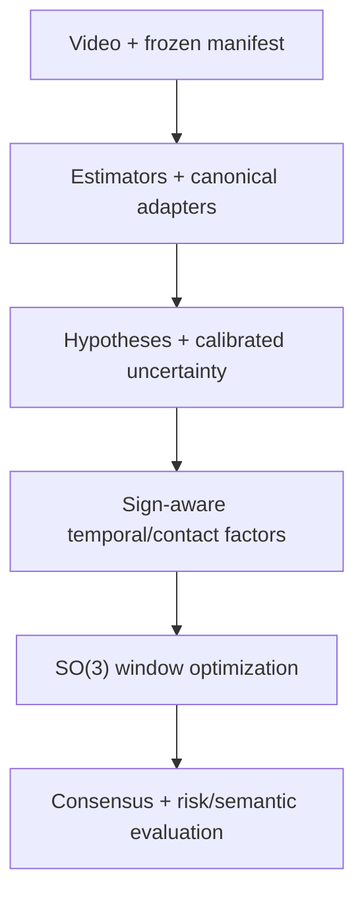

# SIGNAL-4D — bản đồ paper → module → implementation

**Mục tiêu:** xác định những công trình uy tín có thể kế thừa trực tiếp, dùng làm baseline, hoặc chuyển giao ý tưởng cho từng module của SIGNAL-4D.
**Ngày tìm kiếm gần nhất:** 2026-08-16 (UTC).
**Trạng thái:** rapid structured literature audit; chưa phải systematic review/PRISMA chính thức và chưa phải bằng chứng rằng SIGNAL-4D vượt DexAvatar.
**Tài liệu kỹ thuật đi kèm:** `SIGNAL-4D_end_to_end_implementation_spec_vi.md`.

---

## 0. Decision header

**Giai đoạn hiện tại:** Pha 3 — khảo sát tài liệu theo module và chuyển hóa thành quyết định implementation.

**Đã xác minh:** có precedent mạnh cho từng thành phần riêng lẻ: multi-hypothesis scoring, uncertainty calibration, uncertainty-aware temporal modeling, contact-based refinement, collision handling, switchable factors, tối ưu trên nhóm quay và semantic sign evaluation.

**Chưa xác minh:** chưa hoàn tất forward-citation search cho toàn bộ paper 2025–2026; chưa chạy code của các repository; chưa xác minh khả năng chuyển miền của checkpoint từ human pose/hand-object sang signing; chưa có kết quả thực nghiệm SIGNAL-4D.

**Quyết định cần đưa ra:** triển khai theo thứ tự `M0 → M1 → M2`; chỉ đưa một paper/model vào dependency chính sau khi qua kiểm thử coordinate, license, reproducibility và domain-shift.

### Kết luận điều hành

1. **Không nên phát minh lại estimator.** Dùng SMPLer-X cho whole body, WiLoR hoặc HaMeR cho tay, Sapiens cho 2D evidence; đóng góp nên bắt đầu sau adapter boundary.
2. **Không nên average pose của nhiều model trong Euclidean space.** Học từ ScoreHypo, MHEntropy, HuManiFlow và JUMP-Hand: duy trì nhiều giả thuyết, ước lượng độ tin cậy theo phần cơ thể, rồi chọn/gate hoặc đưa tất cả vào objective với trọng số được calibration.
3. **Không dùng smoothness cố định.** Học từ sign change-point, PELT, SmoothNet và temporal hand-pose literature: giảm temporal coupling tại chuyển động mang nghĩa, contact transition và occlusion; tăng coupling khi evidence yếu nhưng chuyển động thực sự ổn định.
4. **Tách contact khỏi collision.** Học từ PROX/POSA/CONTHO và switchable constraints: contact là một quan hệ có thể đúng/sai cần latent switch; collision là bất khả thi hình học cần barrier riêng.
5. **Tối ưu quay trên manifold.** Dùng residual qua `Log(R_i^T R_j)` hoặc rotation-6D có projection; overlap phải merge bằng weighted geodesic/Karcher mean, không average axis-angle.
6. **Đánh giá sign semantics độc lập với mesh error.** Kế thừa Meaningful Pose-Based Evaluation, P3D và recognition/retrieval probes; reconstruction metric tốt hơn không tự động đồng nghĩa sign dễ hiểu hơn.
7. **Novelty còn khả tín chỉ là interaction giữa các module trong miền sign.** Cụ thể: calibrated per-part observation uncertainty điều khiển multi-source fusion và temporal factors; sign-aware change point bảo vệ chuyển động có nghĩa; switchable contact phân biệt contact thật với accidental proximity; cuối cùng được đánh giá bằng risk–coverage và semantic fidelity. Đây vẫn là **giả thuyết novelty**, chưa phải claim đã xác minh.

---

## 1. Quy ước bằng chứng

| Nhãn | Ý nghĩa | Được phép dùng để làm gì |
|---|---|---|
| **[V-FULL]** | Đã kiểm tra paper/PDF chính thức ở mức đủ để xác nhận phương pháp liên quan; code/project được kiểm tra khi có | Cơ sở thiết kế, baseline hoặc implementation reference |
| **[V-ABS/CODE]** | Đã kiểm tra abstract/trang conference/project/README chính thức; chưa audit toàn bộ thí nghiệm | Định hướng, shortlist; không dùng cho claim chi tiết ngoài nội dung đã đọc |
| **[U]** | Chỉ mới thấy supplementary/snippet hoặc chưa kiểm tra full text/code | Không đưa vào critical path; phải đọc lại trước khi triển khai/claim |
| **[Suy luận]** | Thiết kế SIGNAL-4D tổng hợp từ nhiều nguồn; không phải thuật toán được một paper duy nhất đề xuất | Phải ablate và ghi rõ là thiết kế mới/engineering hypothesis |
| **[Giả thuyết]** | Cơ chế có thể cải thiện kết quả nhưng chưa có thực nghiệm | Không được viết như kết quả |

Các URL bên dưới ưu tiên proceedings, project page, arXiv của tác giả và repository chính thức. License code/model/data được coi là một artifact độc lập; license của repository không tự động bao phủ checkpoint, SMPL-X/MANO asset hay dataset.

---

## 2. Search protocol và audit trail

### 2.1 Nguồn đã tìm

- CVF Open Access: CVPR, ICCV, WACV và workshop.
- ECVA: ECCV.
- PMLR: ICML.
- NeurIPS Proceedings.
- ACL Anthology.
- arXiv và project page của tác giả khi proceedings chưa index đầy đủ.
- GitHub repository chính thức để kiểm tra entry point, dependency, checkpoint note và license.
- PDF DexAvatar do người dùng cung cấp và repository `kaustesseract/DexAvatar`.

### 2.2 Nhóm truy vấn

- `monocular 3D sign language reconstruction SMPL-X hand prior`
- `probabilistic human mesh recovery multiple hypotheses uncertainty`
- `conformal uncertainty human pose shape video`
- `joint-wise uncertainty hand reconstruction fusion`
- `sign language change point segmentation hand motion boundary`
- `temporal 3D hand pose occlusion refinement`
- `human contact prediction contact-based refinement collision penetration`
- `switchable constraints robust factor graph outlier rejection`
- `SO(3) differentiable optimization rotation averaging uncertainty`
- `overlapping window human motion reconstruction seam`
- `pose-based sign language evaluation semantic metric`
- forward/lateral queries cho DexAvatar, SGNify, SignAvatars, HaMeR, WiLoR, Dyn-HaMR và các paper CVPR 2026 liên quan.

### 2.3 Tiêu chí chọn

Giữ paper nếu thỏa ít nhất một điều kiện:

1. Giải quyết trực tiếp sign reconstruction/pose/sign evaluation.
2. Giải quyết cùng cấu trúc khó: multi-modal hypotheses, calibrated uncertainty, nonstationary temporal dynamics, latent relational constraints, collision hoặc manifold optimization.
3. Có thuật toán/code đủ cụ thể để chuyển thành module và acceptance test.
4. Là công trình nền tảng cần để tránh sai convention hoặc metric.
5. Là công trình mới tạo nguy cơ trùng novelty.

Loại khỏi critical path nếu chỉ có marketing claim, không truy cập được nguồn sơ cấp, không có mô tả đủ để xác minh, hoặc bài toán quá xa mà không chỉ ra được cơ chế chuyển giao.

### 2.4 Giới hạn

- Đây là **rapid structured audit**, chưa có dual screening, database export đầy đủ, deduplication log hay formal risk-of-bias scoring.
- Citation count không được dùng làm tiêu chí chất lượng; ưu tiên venue, nguồn sơ cấp và mức khớp kỹ thuật.
- Với paper CVPR 2026, indexing và code có thể còn thay đổi; phải freeze URL/commit/checkpoint hash tại thời điểm implementation.
- Chưa chạy benchmark hoặc tái tạo kết quả nào từ các paper bên dưới.

---

## 3. Bản đồ tổng thể



| Module SIGNAL-4D | Paper nên đọc trước | Mức kế thừa | Artifact cần implement | Không nên kế thừa mù quáng |
|---|---|---|---|---|
| Protocol/evaluator | DexAvatar; AGORA; VIBE; Meaningful Pose Evaluation | Trực tiếp về protocol/metric | manifest, coverage gate, pose/dynamics/semantic metrics | alignment hoặc dropping policy không công bố rõ |
| Pretrained estimators | SMPLer-X; WiLoR; HaMeR; Sapiens | Dùng checkpoint qua adapter | frozen inference + raw outputs | coi output model là ground truth |
| Canonicalization | SMPL-X/MANO; FrankMocap; InterHand2.6M; PIXIE | Trực tiếp về mapping/integration | unit/coordinate/joint/handedness contracts | trộn camera hoặc left/right convention ngầm |
| Multi-hypothesis | ScoreHypo; MHEntropy; HuManiFlow; diffusion MHA | Chuyển thuật toán | group-wise hypothesis bank/scorer | Euclidean average hoặc per-joint Frankenstein pose |
| Uncertainty/calibration | CUPS; Kendall–Gal; CQR; JUMP-Hand; Ovadia | Chuyển thuật toán | error predictor + conformal calibration | gọi softmax confidence là calibrated uncertainty |
| Change point/temporal | Renz et al.; PELT; SmoothNet; TCMR; Ren et al. | Baseline + chuyển miền | cue vector, `p_change`, adaptive temporal factor | smoothness cố định; checkpoint body áp thẳng vào fingerspelling |
| Contact proposal | PROX; POSA; BSTRO; CONTHO; VisTracker | Chuyển thuật toán | region pairs, proposal probability, persistence | distance-only contact label |
| Switchable contact | Switchable Constraints; GNC | Chuyển cross-domain | latent switch + prior + robust schedule | cho optimizer tắt mọi contact mà không có prior |
| Collision | SMPLify-X; COAP; Han et al. 2026 | Trực tiếp/transfer | separate penetration barrier | đồng nhất contact attraction với collision repulsion |
| SO(3) factor graph | Zhou et al.; LieTorch; Factor Graphs; PyPose/Theseus | Trực tiếp về toán/code | geodesic residual, retraction, robust factors | average axis-angle hoặc optimize raw matrices |
| Window/consensus | Dyn-HaMR; SLAHMR; DeciWatch; rotation averaging | Synthesis | overlap windows + weighted Karcher mean | hard stitch ở midpoint |
| Risk/abstention | SelectiveNet; CUPS; Ovadia | Trực tiếp về đánh giá | risk–coverage, per-part abstention | chỉ báo mean confidence |
| Sign semantics | Meaningful Pose; P3D; SignBERT+; SGNify | Trực tiếp về evaluation/prior | frozen semantic probe/retrieval | train và test cùng encoder gây circularity |

---

## 4. Module 0 — protocol, manifest và evaluator

### Paper nền

1. **[V-FULL] DexAvatar: 3D Sign Language Reconstruction with Hand and Body Pose Priors — Kundu et al., 2026, WACV.**
   [Paper](https://openaccess.thecvf.com/content/WACV2026/papers/Kundu_DexAvatar_3D_Sign_Language_Reconstruction_with_Hand_and_Body_Pose_WACV_2026_paper.pdf) · [Code](https://github.com/kaustesseract/DexAvatar)
   Hỗ trợ: baseline đích, estimator/prior stack và protocol cần tái tạo trước khi claim improvement.

2. **[V-FULL] AGORA: Avatars in Geography Optimized for Regression Analysis — Patel et al., 2021, CVPR.**
   [Paper/project](https://agora.is.tue.mpg.de/) · [arXiv](https://arxiv.org/abs/2104.14643)
   Hỗ trợ: detection-aware/completeness-aware evaluation; nhắc rằng bỏ các sample khó có thể làm metric đẹp giả tạo.

3. **[V-FULL] VIBE: Video Inference for Human Body Pose and Shape Estimation — Kocabas et al., 2020, CVPR.**
   [Paper](https://openaccess.thecvf.com/content_CVPR_2020/papers/Kocabas_VIBE_Video_Inference_for_Human_Body_Pose_and_Shape_Estimation_CVPR_2020_paper.pdf)
   Hỗ trợ: định nghĩa acceleration error dựa trên chênh lệch gia tốc prediction–GT, không phải raw acceleration của prediction.

4. **[V-FULL] Meaningful Pose-Based Sign Language Evaluation — Jiang et al., 2025, WMT.**
   [Paper/metadata](https://aclanthology.org/2025.wmt-1.4/) · [Code](https://github.com/sign-language-processing/pose-evaluation)
   Hỗ trợ: keypoint-, embedding- và back-translation-based metrics có trade-off khác nhau; semantic evaluation cần meta-evaluation/human correlation.

### Cách kế thừa

- Freeze `clip_manifest.jsonl` trước khi tune; mỗi frame có trạng thái success/failure/missing, không silent drop.
- Báo cáo đồng thời: coverage, translation-only V2V, PA-MPVPE, joint/part errors, acceleration error, contact metrics, semantic metrics và runtime.
- Tách `legacy_track` dùng đúng convention DexAvatar khỏi `clean_track` dùng protocol công khai hơn.
- Mọi metric phải nhận explicit mask và alignment enum; evaluator không tự đoán.

### Acceptance tests

- Synthetic rigid translation chỉ làm thay đổi metric không alignment; PA metric giữ nguyên.
- Predicted constant acceleration và GT constant acceleration giống nhau phải cho acceleration error gần 0.
- Xóa 10% frame khó phải làm coverage giảm, không được cải thiện score aggregate một cách âm thầm.
- Evaluator chạy độc lập từ prediction artifact, không import training code.

---

## 5. Module 1 — pretrained estimators và canonical adapters

### Paper/model nên kế thừa

1. **[V-FULL] Expressive Body Capture: 3D Hands, Face, and Body from a Single Image — Pavlakos et al., 2019, CVPR (SMPL-X/SMPLify-X).**
   [Project](https://smpl-x.is.tue.mpg.de/) · [arXiv](https://arxiv.org/abs/1904.05866) · [Code](https://github.com/vchoutas/smplify-x)
   Hỗ trợ: unified body model, reprojection fitting, learned pose prior và self-penetration term.

2. **[V-FULL] Embodied Hands: Modeling and Capturing Hands and Bodies Together — Romero, Tzionas, Black, 2017, ACM TOG/SIGGRAPH Asia (MANO).**
   [Project](https://mano.is.tue.mpg.de/)
   Hỗ trợ: MANO hand parameterization, pose/shape blend shapes và ràng buộc license/model asset.

3. **[V-ABS/CODE] SMPLer-X: Scaling Up Expressive Human Pose and Shape Estimation — Cai et al., 2023, NeurIPS Datasets and Benchmarks.**
   [Paper](https://proceedings.neurips.cc/paper_files/paper/2023/hash/2614947a25d7c435bcd56c51958ddcb1-Abstract-Datasets_and_Benchmarks.html) · [Project](https://caizhongang.com/projects/SMPLer-X/) · [Code](https://github.com/MotrixLab/SMPLer-X)
   Hỗ trợ: whole-body SMPL-X initialization; repository có corrected H32 checkpoint liên quan camera estimation nên phải pin đúng artifact.

4. **[V-FULL] Reconstructing Hands in 3D with Transformers — Pavlakos et al., 2024, CVPR (HaMeR).**
   [Paper](https://openaccess.thecvf.com/content/CVPR2024/html/Pavlakos_Reconstructing_Hands_in_3D_with_Transformers_CVPR_2024_paper.html)
   Hỗ trợ: strong monocular MANO hand hypothesis và learned hand prior.

5. **[V-ABS/CODE] WiLoR: End-to-end 3D Hand Localization and Reconstruction in-the-wild — Potamias et al., 2025, CVPR.**
   [Paper](https://openaccess.thecvf.com/content/CVPR2025/html/Potamias_WiLoR_End-to-end_3D_Hand_Localization_and_Reconstruction_in-the-wild_CVPR_2025_paper.html) · [Code](https://github.com/rolpotamias/WiLoR)
   Hỗ trợ: detector + multi-hand reconstruction; hữu ích cho crop, handedness và hand hypothesis khi tay gần nhau/che khuất.

6. **[V-ABS/CODE] Sapiens: Foundation for Human Vision Models — Khirodkar et al., 2024, ECCV.**
   [arXiv](https://arxiv.org/abs/2408.12569) · [Code](https://github.com/facebookresearch/sapiens)
   Hỗ trợ: high-resolution 2D human keypoints/segmentation/depth/normal evidence.

7. **[V-FULL/CODE] FrankMocap: A Monocular 3D Whole-Body Pose Estimation System via Regression and Integration — Rong et al., 2021, ICCV Workshops.**
   [Paper](https://openaccess.thecvf.com/content/ICCV2021W/ACVR/html/Rong_FrankMocap_A_Monocular_3D_Whole-Body_Pose_Estimation_System_via_Regression_ICCVW_2021_paper.html) · [Code](https://github.com/facebookresearch/frankmocap)
   Hỗ trợ: pattern tích hợp modular body/hand estimators; phù hợp để học adapter architecture hơn là dùng estimator cũ làm final model.

### Quyết định implementation

| Nguồn | Vai trò mặc định | Output giữ lại | Không làm |
|---|---|---|---|
| SMPLer-X H32* | whole-body/root/shape/camera hypothesis | raw SMPL-X params, camera, features nếu được phép, detection score | overwrite trực tiếp bằng tay từ model khác |
| WiLoR | left/right MANO hypothesis + detection | MANO pose/shape, handedness, crop, score | coi detector confidence là 3D uncertainty |
| HaMeR | hand hypothesis bổ sung | MANO pose/shape, camera/crop metadata | chạy như dependency bắt buộc nếu WiLoR đủ tốt |
| Sapiens | 2D evidence | keypoints, confidence, segmentation; optional depth/normal | chuyển 2D confidence thành metric covariance không calibration |

Mỗi adapter trả `ObservationBatch` trong canonical schema; giữ cả raw source output và transformation trace. MANO→SMPL-X hand pose, camera, axis convention, units, crop-to-image transform và handedness phải có unit test riêng.

### Paper cho canonicalization

- **[V-FULL] InterHand2.6M — Moon et al., 2020, ECCV.** [Project/code](https://mks0601.github.io/InterHand2.6M/) hỗ trợ convention của interacting hands và kiểm thử handedness/units.
- **[V-FULL] PIXIE: Collaborative Regression of Expressive Bodies — Feng et al., 2021, 3DV.** [Project](https://pixie.is.tue.mpg.de/) · [Code](https://github.com/yfeng95/PIXIE) hỗ trợ ý tưởng moderator giữa part experts; dùng như conceptual reference cho group-wise fusion.

### Acceptance tests

- MANO rest pose map sang SMPL-X phải khớp vertex/joint landmark trong tolerance đã định.
- Left/right mirror test không được hoán nhãn ngầm.
- Crop→image→crop round trip < 0.5 px trên synthetic points.
- Camera translation và mesh units phải qua scale sanity check.
- Tắt từng estimator không làm schema đổi; chỉ mask/source list thay đổi.

---

## 6. Module 2 — multi-hypothesis initialization và fusion

### Paper cốt lõi

1. **[V-FULL] ScoreHypo: Probabilistic Human Mesh Estimation with Hypothesis Scoring — Xu et al., 2024, CVPR.**
   [Paper](https://openaccess.thecvf.com/content/CVPR2024/html/Xu_ScoreHypo_Probabilistic_Human_Mesh_Estimation_with_Hypothesis_Scoring_CVPR_2024_paper.html) · [Code](https://github.com/xy02-05/ScoreHypo)
   Hỗ trợ: tách bước sinh nhiều hypothesis và scoring; gần với nhu cầu chọn source/hypothesis thay vì average.

2. **[V-FULL] MHEntropy: Entropy Meets Multiple Hypotheses for Pose and Shape Recovery — Chen et al., 2023, ICCV.**
   [Paper](https://openaccess.thecvf.com/content/ICCV2023/html/Chen_MHEntropy_Entropy_Meets_Multiple_Hypotheses_for_Pose_and_Shape_Recovery_ICCV_2023_paper.html)
   Hỗ trợ: diversity/entropy regularization để tránh hypothesis collapse.

3. **[V-FULL] HuManiFlow: Ancestor-Conditioned Normalising Flows on SO(3) Manifolds for Human Pose and Shape Distribution Estimation — Sengupta et al., 2023, CVPR.**
   [Paper](https://openaccess.thecvf.com/content/CVPR2023/html/Sengupta_HuManiFlow_Ancestor-Conditioned_Normalising_Flows_on_SO3_Manifolds_for_Human_Pose_CVPR_2023_paper.html) · [Code](https://github.com/akashsengupta1997/HuManiFlow)
   Hỗ trợ: pose distribution trên (SO(3)) và factorization theo kinematic ancestry.

4. **[V-FULL] Diffusion-Based 3D Human Pose Estimation with Multi-Hypothesis Aggregation — Shan et al., 2023, ICCV.**
   [Paper](https://openaccess.thecvf.com/content/ICCV2023/html/Shan_Diffusion-Based_3D_Human_Pose_Estimation_with_Multi-Hypothesis_Aggregation_ICCV_2023_paper.html)
   Hỗ trợ: reproject/aggregate nhiều hypothesis; cảnh báo rằng joint-wise selection cần giữ tính nhất quán kinematic.

5. **[V-FULL] From 2D Alignment to 3D Plausibility: Unifying Heterogeneous 2D Priors and Penetration-Free Diffusion for Occlusion-Robust Two-Hand Reconstruction — Han et al., 2026, CVPR.**
   [Paper](https://openaccess.thecvf.com/content/CVPR2026/papers/Han_From_2D_Alignment_to_3D_Plausibility_Unifying_Heterogeneous_2D_Priors_CVPR_2026_paper.pdf) · [arXiv](https://arxiv.org/abs/2503.17788)
   Hỗ trợ và novelty threat: heterogeneous keypoint/segmentation/depth priors có thể được hợp nhất trước một refinement có collision guidance. SIGNAL-4D phải khác ở video/sign, calibrated UQ, change-point và switchable contact—not chỉ ở việc dùng nhiều prior.

### Cách implement được khuyến nghị

Không huấn luyện diffusion/flow ở M1. Tạo một **finite hypothesis bank** từ các estimator hiện có:

```text
H[t] = {
  body: [SMPLer-X variants],
  left_hand: [WiLoR, HaMeR, SMPLer-X-hand],
  right_hand: [WiLoR, HaMeR, SMPLer-X-hand]
}
```

- Chọn initial hypothesis theo **group**: body core, left wrist+hand, right wrist+hand.
- Score feature gồm reprojection residual, mask/depth consistency, anatomical prior, temporal innovation, inter-source disagreement và detector metadata.
- Initial selection:
  \[
  h^*_{t,g}=\arg\min_h \widehat{\mathbb{E}}[e_{t,g}\mid x_{t,g,h}].
  \]
- Trong optimizer, không bỏ các hypothesis còn lại; mỗi hypothesis đóng góp observation factor với covariance/trọng số riêng.
- Chỉ thêm learned generator (flow/diffusion) ở M3 nếu finite bank không đủ diversity trên occlusion spans.

### Không nên làm

- Average MANO/SMPL-X axis-angle trực tiếp.
- Chọn từng joint độc lập rồi ghép thành bàn tay không tồn tại trong training manifold.
- Dùng GT để chọn hypothesis tại test.
- Tuyên bố “multi-hypothesis” nếu chỉ chạy một estimator với dropout mà không đo diversity/coverage.

### Acceptance tests

- Oracle-over-bank phải tốt hơn best-single-source trên dev; nếu không, bank không tạo headroom và module nên **No-Go**.
- Selection learned phải vượt fixed-priority selector mà không dùng test labels.
- Hypothesis diversity được đo bằng geodesic dispersion theo joint group, không chỉ parameter L2.
- Ablation `group-wise select` vs `joint-wise select` phải kiểm tra kinematic breakage/contact error.

---

## 7. Module 3 — uncertainty estimation và calibration

### Paper cốt lõi

1. **[V-FULL] What Uncertainties Do We Need in Bayesian Deep Learning for Computer Vision? — Kendall & Gal, 2017, NeurIPS.**
   [Paper](https://proceedings.neurips.cc/paper/2017/hash/2650d6089a6d640c5e85b2b88265dc2b-Abstract.html)
   Hỗ trợ: phân biệt aleatoric và epistemic uncertainty; heteroscedastic likelihood là baseline hợp lý.

2. **[V-FULL] Simple and Scalable Predictive Uncertainty Estimation using Deep Ensembles — Lakshminarayanan, Pritzel, Blundell, 2017, NeurIPS.**
   [Paper](https://proceedings.neurips.cc/paper/2017/hash/9ef2ed4b7fd2c810847ffa5fa85bce38-Abstract.html)
   Hỗ trợ: ensemble là baseline uncertainty mạnh và đơn giản hơn Bayesian approximation phức tạp.

3. **[V-FULL] CUPS: Improving Human Pose-Shape Estimators with Conformalized Deep Uncertainty — Harry Zhang & Luca Carlone, 2025, ICML.**
   [Paper/metadata](https://proceedings.mlr.press/v267/zhang25g.html)
   Hỗ trợ: sequence-to-sequence human pose/shape, multi-hypothesis scoring, deep uncertainty dùng làm conformity score và phân tích coverage gap khi dữ liệu không hoàn toàn exchangeable.

4. **[V-FULL] Conformalized Quantile Regression — Romano, Patterson, Candès, 2019, NeurIPS.**
   [Paper](https://proceedings.neurips.cc/paper/2019/hash/5103c3584b063c431bd1268e9b5e76fb-Abstract.html)
   Hỗ trợ: interval thích nghi với heteroscedasticity và finite-sample marginal coverage dưới giả định phù hợp.

5. **[V-FULL] Can You Trust Your Model's Uncertainty? Evaluating Predictive Uncertainty Under Dataset Shift — Ovadia et al., 2019, NeurIPS.**
   [Paper](https://proceedings.neurips.cc/paper_files/paper/2019/hash/8558cb408c1d76621371888657d2eb1d-Abstract.html)
   Hỗ trợ: calibration có thể suy giảm dưới distribution shift; cần signer/dataset/occlusion stress test.

6. **[V-FULL] Utilizing Uncertainty in 2D Pose Detectors for Probabilistic 3D Human Mesh Recovery — Wehrbein et al., 2025, WACV.**
   [Paper](https://openaccess.thecvf.com/content/WACV2025/papers/Wehrbein_Utilizing_Uncertainty_in_2D_Pose_Detectors_for_Probabilistic_3D_Human_WACV_2025_paper.pdf)
   Hỗ trợ: chuyển detector uncertainty thành observation uncertainty cho probabilistic mesh recovery.

7. **[V-ABS/CODE] JUMP-Hand: Learning Joint-wise Uncertainty to Gate Mixture of View Experts for Multi-View 3D Hand Reconstruction — Kuang et al., 2026, CVPR.**
   [Official paper page](https://openaccess.thecvf.com/content/CVPR2026/html/Kuang_JUMP-Hand_Learning_Joint-wise_Uncertainty_to_Gate_Mixture_of_View_Experts_CVPR_2026_paper.html) · [Code](https://github.com/HaohongKuang/JUMP-Hand)
   Hỗ trợ và novelty threat: explicit joint-wise uncertainty có thể gate expert fusion. Đây là multi-view; SIGNAL-4D chỉ được chuyển cơ chế reliability gating sang **source experts trong monocular video**, không được claim ý tưởng gating chung là mới.

8. **[V-FULL] UNSPAT: Uncertainty-Guided SpatioTemporal Transformer for 3D Human Pose and Shape Estimation — Lee et al., 2024, WACV.**
   [Paper](https://openaccess.thecvf.com/content/WACV2024/papers/Lee_UNSPAT_Uncertainty-Guided_SpatioTemporal_Transformer_for_3D_Human_Pose_and_Shape_WACV_2024_paper.pdf)
   Hỗ trợ và novelty threat: “uncertainty + temporal modeling” đã có precedent; novelty của SIGNAL-4D phải cụ thể hơn.

### Thiết kế M1 nên học gì

#### 7.1 Target của uncertainty

Không dự đoán một scalar confidence chung. Dự đoán expected error hoặc scale theo:

\[
\hat u_{t,s,g}=f_\phi(\text{source metadata},\ \text{2D residual},\ \text{disagreement},\ \text{visibility},\ \text{temporal innovation})
\]

với `s` là source, `g ∈ {body, left_hand, right_hand}`. M3 mới cân nhắc per-joint nếu labels đủ.

#### 7.2 Training target

- Nếu có 3D GT: geodesic joint rotation error, joint position error hoặc V2V theo group.
- Nếu chỉ pseudo-GT: dùng held-out multiview/annotated subset để calibration; không calibration bằng chính estimator consensus.
- Dùng heteroscedastic NLL hoặc quantile loss cho raw predictor; sau đó conformal calibration trên **calibration split tách biệt**.

#### 7.3 Correlation structure

Frame trong cùng clip không exchangeable. Nên split/conformalize theo clip hoặc signer block; báo cáo marginal coverage và conditional coverage slices. CUPS là reference gần nhất cho vấn đề nonexchangeability, nhưng không nên sao chép guarantee vượt ngoài assumptions của paper.

#### 7.4 UQ dùng ở ba nơi

1. Source/group selection cho initialization.
2. Observation covariance và temporal factor strength trong optimizer.
3. Risk score/abstention sau inference.

### Acceptance tests

- Spearman correlation giữa uncertainty và realized error > fixed confidence baselines.
- Calibration curve/coverage được báo theo overall, signer-unseen, severe occlusion, fast fingerspelling và left/right hand.
- Risk–coverage curve phải giảm risk khi coverage giảm; nếu không, abstention module vô nghĩa.
- So sánh `detector score`, `inter-source disagreement`, `learned UQ`, `learned+conformal`.
- Chạy ablation ngăn UQ đi vào temporal/contact factor để phân biệt gain do selection và gain do optimization.

---

## 8. Module 4 — sign-aware change point và temporal refinement

### Paper cốt lõi

1. **[V-FULL/CODE] Sign Segmentation with Changepoint-Modulated Pseudo-Labelling — Renz, Stache, Fox, Varol, Albanie, 2021, CVPR Workshops.**
   [Paper](https://openaccess.thecvf.com/content/CVPR2021W/ChaLearn/papers/Renz_Sign_Segmentation_With_Changepoint-Modulated_Pseudo-Labelling_CVPRW_2021_paper.pdf) · [Code](https://github.com/RenzKa/sign-segmentation)
   Hỗ trợ trực tiếp: motion change points có ích cho sign boundary modeling. Cảnh báo: sign boundary không đồng nhất với mọi articulation/contact transition của reconstruction.

2. **[V-FULL] Optimal Detection of Changepoints with a Linear Computational Cost — Killick, Fearnhead, Eckley, 2012, JASA (PELT).**
   [arXiv](https://arxiv.org/abs/1101.1438)
   Hỗ trợ: exact offline change-point baseline có chi phí thường tuyến tính dưới điều kiện của paper; phù hợp cho cue vector M1.

3. **[V-FULL/CODE] SmoothNet: A Plug-and-Play Network for Refining Human Poses in Videos — Zeng et al., 2022, ECCV.**
   [arXiv](https://arxiv.org/abs/2112.13715) · [Code](https://github.com/cure-lab/SmoothNet)
   Hỗ trợ: temporal-only post-processing baseline rẻ. Checkpoint body trên non-sign data chỉ là baseline, không phải giải pháp final cho bàn tay ký.

4. **[V-FULL] Beyond Static Features for Temporally Consistent 3D Human Pose and Shape from a Video — Choi et al., 2021, CVPR (TCMR).**
   [Paper](https://openaccess.thecvf.com/content/CVPR2021/html/Choi_Beyond_Static_Features_for_Temporally_Consistent_3D_Human_Pose_and_CVPR_2021_paper.html)
   Hỗ trợ: learned temporal context baseline và trade-off giữa accuracy/temporal consistency.

5. **[V-FULL] Prior-aware Dynamic Temporal Modeling Framework for Sequential 3D Hand Pose Estimation — Ren et al., 2025, ICCV.**
   [Paper](https://openaccess.thecvf.com/content/ICCV2025/papers/Ren_Prior-aware_Dynamic_Temporal_Modeling_Framework_for_Sequential_3D_Hand_Pose_ICCV_2025_paper.pdf)
   Hỗ trợ: hand-specific dynamic temporal modeling; body-centric smoother có thể không đủ cho articulation nhanh.

6. **[V-FULL/CODE] DeciWatch: A Simple Baseline for 10x Efficient 2D and 3D Pose Estimation — Zeng et al., 2022, ECCV.**
   [Paper](https://www.ecva.net/papers/eccv_2022/papers_ECCV/papers/136650597.pdf) · [Code](https://github.com/cure-lab/DeciWatch)
   Hỗ trợ: sample–denoise–recover và long-window temporal processing; sparse sampling có nguy cơ bỏ lỡ fingerspelling nhanh.

7. **[V-FULL] Fast and Unsupervised Action Boundary Detection for Action Segmentation — Du et al., 2022, CVPR.**
   [Paper](https://openaccess.thecvf.com/content/CVPR2022/papers/Du_Fast_and_Unsupervised_Action_Boundary_Detection_for_Action_Segmentation_CVPR_2022_paper.pdf)
   Hỗ trợ: learned/unsupervised boundary cue nếu M3 thiếu dense boundary labels.

### M1: rule-based change probability trước learned model

Tạo cue vector theo frame:

```text
q_t = [
  wrist angular velocity,
  finger angular velocity,
  hand acceleration/jerk,
  inter-hand distance derivative,
  hand-to-face/body region distance derivative,
  source disagreement jump,
  occlusion/visibility transition
]
```

Chuẩn hóa robust theo clip, chạy PELT hoặc logistic rule để nhận `p_change[t]`. Temporal factor:

\[
E_{temp}^{t,j}=w_{t,j}\,\rho\!\left(\left\|\log(R_{t,j}^{\top}R_{t+1,j})-\hat\omega_{t,j}\right\|^2\right),
\]

\[
w_{t,j}=w_0\,(1-p_{change,t})\,c_{t,j},
\]

trong đó `c` là confidence sau calibration. Có thể thêm lower bound nhỏ để tránh frame độc lập hoàn toàn.

### Tại sao cơ chế này hợp với sign

- Khi evidence tốt và motion đổi nhanh có chủ đích: `p_change` cao → tránh over-smoothing.
- Khi occlusion cao nhưng cue chuyển động không cho thấy boundary: confidence observation thấp, temporal prior tương đối quan trọng hơn.
- Khi source disagreement tăng vì tracker failure: uncertainty tăng; không tự động coi đó là semantic boundary. Cần tách `change evidence` khỏi `observation failure evidence`.

### Acceptance tests

- Baselines bắt buộc: no temporal, fixed geodesic, SmoothNet, PELT-gated, learned-gated nếu có.
- Report error và acceleration trên fast/slow motion slices; không chỉ mean.
- Đo preservation của high-frequency finger motion bằng spectral/velocity error có GT.
- Boundary window ±k frame phải không tăng semantic/retrieval error so với fixed smoother.
- Nếu PELT-gated không vượt fixed geodesic trên confirmatory dev, learned M3 change-point là **No-Go** trừ khi error analysis chỉ rõ cue thiếu.

---

## 9. Module 5 — contact proposal

### Paper cốt lõi

1. **[V-FULL/CODE] PROX: Resolving 3D Human Pose Ambiguities with 3D Scene Constraints — Hassan et al., 2019, ICCV.**
   [arXiv](https://arxiv.org/abs/1908.06963) · [Project](https://prox.is.tue.mpg.de/) · [Code](https://github.com/mohamedhassanmus/prox)
   Hỗ trợ: contact attraction và penetration penalty là hai objective khác nhau; contact dùng khoảng cách và normal consistency.

2. **[V-FULL/CODE] POSA: Populating 3D Scenes by Learning Human-Scene Interaction — Hassan et al., 2021, CVPR.**
   [Project](https://posa.is.tue.mpg.de/) · [Paper](https://openaccess.thecvf.com/content/CVPR2021/papers/Hassan_Populating_3D_Scenes_by_Learning_Human-Scene_Interaction_CVPR_2021_paper.pdf) · [Code](https://github.com/mohamedhassanmus/POSA)
   Hỗ trợ: per-SMPL-X-vertex contact probability/semantic labels; có thể chuyển thành region-level contact proposer.

3. **[V-FULL] BSTRO: Capturing and Inferring Dense Full-Body Human-Scene Contact — Huang et al., 2022, CVPR.**
   [Paper](https://openaccess.thecvf.com/content/CVPR2022/papers/Huang_Capturing_and_Inferring_Dense_Full-Body_Human-Scene_Contact_CVPR_2022_paper.pdf)
   Hỗ trợ: dense contact inference dưới occlusion; hữu ích cho label representation và evaluation.

4. **[V-FULL] Joint Reconstruction of 3D Human and Object via Contact-Based Refinement — Nam et al., 2024, CVPR (CONTHO).**
   [Paper](https://openaccess.thecvf.com/content/CVPR2024/html/Nam_Joint_Reconstruction_of_3D_Human_and_Object_via_Contact-Based_Refinement_CVPR_2024_paper.html)
   Hỗ trợ: infer contact từ initial meshes rồi dùng contact để refine; kiến trúc gần nhất với proposal→optimization.

5. **[V-FULL] Visibility Aware Human-Object Interaction Tracking from Single RGB Camera — Xie et al., 2023, CVPR (VisTracker).**
   [Paper](https://openaccess.thecvf.com/content/CVPR2023/html/Xie_Visibility_Aware_Human-Object_Interaction_Tracking_From_Single_RGB_Camera_CVPR_2023_paper.html)
   Hỗ trợ: visibility-aware temporal interaction tracking; chuyển được sang occluded hand–body/hand–hand relations.

6. **[V-FULL/CODE] Dyn-HaMR: Recovering 4D Interacting Hand Motion from a Dynamic Camera — Yu et al., 2025, CVPR.**
   [Paper](https://openaccess.thecvf.com/content/CVPR2025/papers/Yu_Dyn-HaMR_Recovering_4D_Interacting_Hand_Motion_from_a_Dynamic_Camera_CVPR_2025_paper.pdf) · [Project](https://dyn-hamr.github.io/) · [Code](https://github.com/ZhengdiYu/Dyn-HaMR)
   Hỗ trợ: multi-stage initialization/refinement, interacting-hand prior, temporal chunks và missing/occluded hands. Với static sign camera, học schedule/tracker integration; không cần mang SLAM vào M1/M2.

### Thiết kế contact regions

Contact node không nên là mọi vertex. Dùng region vocabulary nhỏ:

- left/right palm;
- từng finger pad hoặc finger group;
- face/chin/forehead/cheek;
- chest/shoulder/upper arm;
- opposite hand/palm/fingers.

Candidate edge `(a,b,t)` được đề xuất khi có tổ hợp:

- 3D surface/region distance nhỏ;
- 2D overlap hoặc projected proximity;
- relative velocity nhỏ trong khoảng dwell;
- surface normals tương thích khi xác định được;
- visibility và source uncertainty đủ;
- persistence/hysteresis qua thời gian.

`distance-only` không đủ vì hai phần cơ thể có thể đi ngang rất gần nhưng không contact.

### Acceptance tests

- Synthetic near-pass: khoảng cách nhỏ nhưng relative velocity lớn → không hard-contact.
- Synthetic held-contact: khoảng cách nhỏ + relative velocity thấp + persistence → proposal cao.
- Calibrate precision/recall theo region pair; ưu tiên precision trước khi factor refinement vì false contact có thể phá pose.
- Ablate 2D overlap, velocity, normal, persistence và uncertainty.
- Nếu không có contact GT đủ tin cậy, M2 chỉ được gọi là geometric plausibility experiment, không claim contact accuracy.

---

## 10. Module 6 — switchable contact graph

### Paper chuyển giao quan trọng

1. **[V-FULL] Switchable Constraints for Robust Pose Graph SLAM — Sünderhauf & Protzel, 2012, IROS.**
   [Paper](https://nikosuenderhauf.github.io/assets/papers/IROS12-switchableConstraints.pdf) · [Project](https://nikosuenderhauf.github.io/projects/switchableConstraints/)
   Hỗ trợ cross-domain: thêm latent switch được tối ưu cùng state để downweight loop-closure factor sai. Paper báo cáo bounded linear switch hội tụ tốt hơn sigmoid trong thiết lập của họ; đây là implementation clue, không phải guarantee cho contact.

2. **[V-FULL] Graduated Non-Convexity for Robust Spatial Perception: From Non-Minimal Solvers to Global Outlier Rejection — Yang et al., 2020, IEEE RA-L.**
   [arXiv](https://arxiv.org/abs/1909.08605)
   Hỗ trợ: continuation schedule cho robust nonconvex objective/outlier rejection.

### Chuyển từ loop closure sang sign contact

Với candidate edge `e=(a,b,t)`:

\[
E_e=s_e^2\,E_{contact}(x_t;a,b)+\lambda_s\,E_{prior}(s_e,p_e)+\lambda_p(s_e-s_{e,t-1})^2.
\]

- `p_e` đến từ contact proposer.
- `s_e∈[0,1]` là switch mềm.
- `E_prior` ngăn optimizer tắt mọi edge chỉ để giảm energy.
- Persistence term chống flicker nhưng phải được giảm tại contact change point.
- Có thể tối ưu luân phiên pose và switch; bắt đầu từ bounded parameterization ổn định.

### Điểm mới có thể bảo vệ

Switchable constraints không mới. Candidate contribution là **sign-conditioned, uncertainty-aware switchable contact graph** trong đó:

- proposal lấy evidence từ hand/body regions và temporal dwell;
- switch prior phụ thuộc calibrated observation uncertainty;
- persistence bị gate bởi contact change probability;
- contact và collision có factor riêng;
- được đánh giá bằng contact correctness và sign semantics.

Đây là **[Giả thuyết]**, phải qua ablation `no switch`, `robust loss only`, `switch no uncertainty`, `switch no change-point`, `full`.

### Acceptance tests

- Inject 10–50% false contact edges vào synthetic sequence: switch phải reject edge sai mà không dịch pose khỏi observation quá trust region.
- True-contact recall không được sụp khi tăng robustification.
- Switch posterior phải ổn định dưới small perturbation; báo flicker rate.
- Optimizer không được có trivial solution `s≈0` cho toàn bộ graph.

---

## 11. Module 7 — collision và anatomical plausibility

### Paper cốt lõi

1. **[V-FULL] SMPLify-X / Expressive Body Capture — Pavlakos et al., 2019, CVPR.**
   [Code](https://github.com/vchoutas/smplify-x)
   Hỗ trợ: self-penetration term trong expressive body fitting.

2. **[V-FULL/CODE] COAP: Compositional Articulated Occupancy of People — Mihajlovic et al., 2022, CVPR.**
   [Paper](https://openaccess.thecvf.com/content/CVPR2022/html/Mihajlovic_COAP_Compositional_Articulated_Occupancy_of_People_CVPR_2022_paper.html) · [Code](https://github.com/markomih/COAP)
   Hỗ trợ: articulated occupancy query có thể dùng cho efficient collision/inside tests.

3. **[V-FULL] PROX — Hassan et al., 2019, ICCV.**
   Hỗ trợ: separation giữa contact attraction và penetration penalty.

4. **[V-FULL] Han et al., 2026, CVPR — heterogeneous priors + penetration-free diffusion.**
   [Paper](https://openaccess.thecvf.com/content/CVPR2026/papers/Han_From_2D_Alignment_to_3D_Plausibility_Unifying_Heterogeneous_2D_Priors_CVPR_2026_paper.pdf)
   Hỗ trợ/novelty threat: collision gradients có thể guide a learned generative refinement cho two-hand reconstruction.

### Implementation ladder

1. **M0/M1:** anatomical joint limits/pose prior; không contact/collision phức tạp.
2. **M2-minimal:** selected region-pair mesh distance + robust penetration barrier; dùng broad phase để tránh mọi-pair vertex cost.
3. **M2-profiled:** `torch-mesh-isect` hoặc BVH-based triangle collision nếu dependency ổn định.
4. **M3 optional:** learned articulated occupancy/COAP-style field nếu exact mesh collision là bottleneck.

Không đưa diffusion collision model vào MVP: chi phí, training data và novelty overlap đều cao.

### Acceptance tests

- Gradient direction phải đẩy intersecting surfaces ra ngoài trên synthetic pair.
- Contact surface ở khoảng cách mục tiêu không bị collision term đẩy tách quá xa.
- Profile GPU memory/time theo số candidate pairs và mesh resolution.
- Report penetration depth/volume proxy tách khỏi contact distance.

---

## 12. Module 8 — factor graph và tối ưu trên SO(3)

### Paper/library cốt lõi

1. **[V-FULL] On the Continuity of Rotation Representations in Neural Networks — Zhou et al., 2019, CVPR.**
   [arXiv](https://arxiv.org/abs/1812.07035)
   Hỗ trợ: rotation-6D phù hợp cho learned outputs/continuous representation; không thay thế manifold residual trong geometric optimization.

2. **[V-FULL/CODE] LieTorch: A PyTorch Optimization Library for Lie Groups — Teed & Deng, 2021, CVPR.**
   [arXiv](https://arxiv.org/abs/2103.12032) · [Code](https://github.com/princeton-vl/lietorch)
   Hỗ trợ: differentiable tangent-space operations cho (SO(3)/SE(3)).

3. **[V-FULL] Factor Graphs for Robot Perception — Dellaert & Kaess, 2017, Foundations and Trends in Robotics.**
   [Author page/PDF](https://www.cs.cmu.edu/~kaess/pub/Dellaert17fnt.html)
   Hỗ trợ: variable/factor decomposition, sparse nonlinear least squares, manifolds và incremental inference.

4. **[V-FULL/CODE] Theseus: A Library for Differentiable Nonlinear Optimization — Pineda et al., 2022, NeurIPS.**
   [Paper](https://proceedings.neurips.cc/paper_files/paper/2022/hash/185969291540b3cd86e70c51e8af5d08-Abstract-Conference.html) · [Code](https://github.com/facebookresearch/theseus)
   Hỗ trợ: batched/differentiable nonlinear least squares, sparse solvers và Lie groups.

5. **[V-FULL/CODE] PyPose: A Library for Robot Learning with Physics-based Optimization — Wang et al., 2023, CVPR.**
   [arXiv](https://arxiv.org/abs/2209.15428) · [Docs](https://pypose.org/) · [Code](https://github.com/pypose/pypose)
   Hỗ trợ: LieTensor, second-order/trust-region optimization và differentiable geometry.

### Quyết định implementation

- M0/M1 dùng pure PyTorch + rotation-6D/project-to-(SO(3)) để giảm dependency.
- Tất cả residual so sánh quay dùng geodesic log map:
  \[
  r_R=\log(R_{obs}^{\top}R_{state}).
  \]
- M2 chỉ chuyển sang tangent increment/retraction nếu profiling cho thấy conditioning hoặc convergence của 6D không đạt.
- Chạy một dependency spike nhỏ với PyPose và Theseus trên synthetic 21-joint hand chain; không đổi solver chính trước khi có bằng chứng convergence/runtime.
- Mỗi factor trả scalar energy và diagnostics per frame/joint; normalize theo số observation hợp lệ.

### Acceptance tests

- `Exp(Log(R))≈R`, inverse/composition và gradient finite gần identity và gần π (với tolerance/phương án clamp rõ).
- Same physical rotation dưới quaternion sign flip cho cùng residual.
- Synthetic noisy chain: optimizer giảm geodesic error và không tạo matrix determinant khác 1.
- Robust kernel phải chống injected outlier tốt hơn L2 nhưng không bias clean case quá ngưỡng.

---

## 13. Module 9 — windowed solver, overlap consensus và missing spans

### Paper cốt lõi

1. **[V-FULL/CODE] Dyn-HaMR — Yu et al., 2025, CVPR.**
   Hỗ trợ: staged 4D hand optimization, chunked hand motion prior, tracking và occlusion handling.

2. **[V-FULL/CODE] SLAHMR: Simultaneous Localization and Human Mesh Recovery — Ye et al., 2023, CVPR.**
   [Project](https://vye16.github.io/slahmr/) · [Code](https://github.com/vye16/slahmr)
   Hỗ trợ: staged sequence-level optimization và tách camera/human motion. Static-camera SIGNAL-4D chỉ học staged design/window management.

3. **[V-FULL] HuMoR: 3D Human Motion Model for Robust Pose Estimation — Rempe et al., 2021, ICCV.**
   [Paper](https://openaccess.thecvf.com/content/ICCV2021/papers/Rempe_HuMoR_3D_Human_Motion_Model_for_Robust_Pose_Estimation_ICCV_2021_paper.pdf)
   Hỗ trợ: learned motion prior cho missing/occluded spans; locomotion-heavy domain tạo risk khi chuyển sang signing.

4. **[V-FULL] Rotation Averaging — Hartley, Trumpf, Dai, Li, 2013, IJCV.**
   [Author PDF](https://users.cecs.anu.edu.au/~hongdong/rotationaveraging.pdf)
   Hỗ trợ: geodesic/chordal/Karcher formulations cho merging rotations.

5. **[V-FULL] Revisiting Rotation Averaging: Uncertainties and Robust Losses — Zhang et al., 2023, CVPR.**
   [Paper](https://openaccess.thecvf.com/content/CVPR2023/papers/Zhang_Revisiting_Rotation_Averaging_Uncertainties_and_Robust_Losses_CVPR_2023_paper.pdf)
   Hỗ trợ: uncertainty-weighted robust rotation averaging.

### Thiết kế synthesis của SIGNAL-4D

Không có một paper duy nhất cung cấp đúng overlap merge sau đây; đây là **[Suy luận]** từ rotation averaging + uncertainty + window taper:

\[
w_{k,t}=\frac{w^{Hann}_{k,t}}{\epsilon+u_{k,t}},
\qquad
R_t=\operatorname{KarcherMean}(\{R_{k,t}\},\{w_{k,t}\}).
\]

- Translation: inverse-variance weighted robust mean.
- Rotations: weighted Karcher mean.
- Contact logits: weighted mean trước hysteresis decoding.
- Sau merge, optimize ±4 frame quanh seam với anchors bên ngoài.
- Missing 1–2 frame chỉ dùng SLERP làm initialization; long span dùng damped motion/prior, gắn uncertainty cao, không biến interpolation thành pseudo-GT.

### Acceptance tests

- Hai window biểu diễn cùng rotation bằng convention khác phải merge đúng physical rotation.
- Seam geodesic velocity/acceleration không spike so với interior distribution.
- So sánh hard midpoint stitch, linear parameter average, Hann-only và Hann+inverse-UQ Karcher.
- Stress test missing span theo độ dài và hand speed.

---

## 14. Module 10 — selective prediction và abstention

### Paper cốt lõi

1. **[V-FULL] SelectiveNet: A Deep Neural Network with an Integrated Reject Option — Geifman & El-Yaniv, 2019, ICML.**
   [Paper](https://proceedings.mlr.press/v97/geifman19a.html)
   Hỗ trợ: selective risk, coverage target và reject option.

2. **[V-FULL] CUPS — Zhang & Carlone, 2025, ICML.**
   Hỗ trợ: calibrated uncertainty cho pose/shape và coverage analysis.

3. **[V-FULL] Ovadia et al., 2019, NeurIPS.**
   Hỗ trợ: risk/calibration phải được stress-test dưới distribution shift.

### Implementation

- Xuất risk theo frame và group, không chỉ clip-level scalar.
- Cho phép downstream nhận `valid`, `review`, `abstain` theo threshold freeze trên dev/calibration.
- Báo `risk(coverage)` và AURC cho pose, contact và semantic proxy.
- Đánh giá coverage parity theo signer, skin/lighting nếu metadata hợp pháp và đủ mẫu, fast motion, occlusion, left/right hand.
- Không dùng test set để chọn threshold.

### Acceptance tests

- Khi coverage giảm, realized error phải giảm có ý nghĩa.
- Random abstention và detector-score abstention là baselines bắt buộc.
- Báo failure nếu một group bị abstain gần như toàn bộ; mean AURC có thể che fairness/coverage collapse.

---

## 15. Module 11 — sign-specific prior và semantic evaluation

### Paper/dataset cốt lõi

1. **[V-FULL] Reconstructing Signing Avatars from Video Using Linguistic Priors — Forte et al., 2023, CVPR (SGNify).**
   [Paper](https://openaccess.thecvf.com/content/CVPR2023/html/Forte_Reconstructing_Signing_Avatars_From_Video_Using_Linguistic_Priors_CVPR_2023_paper.html) · [Project](https://sgnify.is.tue.mpg.de/) · [Code](https://github.com/MPForte/SGNify)
   Hỗ trợ: linguistic/sign priors trong avatar reconstruction; baseline trực tiếp cạnh DexAvatar.

2. **[V-FULL/CODE] SignAvatars: A Large-scale 3D Sign Language Holistic Motion Dataset and Benchmark — Yu et al., 2024, ECCV.**
   [Paper](https://www.ecva.net/papers/eccv_2024/papers_ECCV/papers/00653.pdf) · [Project](https://signavatars.github.io/) · [Code](https://github.com/ZhengdiYu/SignAvatars)
   Hỗ trợ: large-scale SMPL-X/sign motion annotations và benchmark. Automated annotations là training prior/pseudo-label candidate, không mặc định là error-free GT.

3. **[V-FULL] How2Sign: A Large-scale Multimodal Dataset for Continuous American Sign Language — Duarte et al., 2021, CVPR.**
   [arXiv](https://arxiv.org/abs/2008.08143) · [Project](https://how2sign.github.io/)
   Hỗ trợ: continuous ASL data và multiview/Panoptic subset có thể dùng cho calibration/semantic probes theo license.

4. **[V-FULL] Human Part-wise 3D Motion Context Learning for Sign Language Recognition — Lee et al., 2023, ICCV (P3D).**
   [Paper](https://openaccess.thecvf.com/content/ICCV2023/html/Lee_Human_Part-wise_3D_Motion_Context_Learning_for_Sign_Language_Recognition_ICCV_2023_paper.html)
   Hỗ trợ: part-wise 3D motion context cho recognition; phù hợp làm frozen semantic probe hoặc part-aware perceptual metric.

5. **[V-FULL] SignBERT+: Hand-model-aware Self-supervised Pre-training for Sign Language Understanding — Hu et al., 2023, IEEE TPAMI.**
   [arXiv](https://arxiv.org/abs/2305.04868) · [DOI](https://doi.org/10.1109/TPAMI.2023.3269220)
   Hỗ trợ: hand-model-aware masked joint/frame/clip pretraining; ứng viên sign-specific prior/evaluator ở M3.

6. **[V-FULL] Neural Sign Actors: A Diffusion Model for 3D Sign Language Production from Text — Baltatzis et al., 2024, CVPR.**
   [Paper](https://openaccess.thecvf.com/content/CVPR2024/html/Baltatzis_Neural_Sign_Actors_A_Diffusion_Model_for_3D_Sign_Language_CVPR_2024_paper.html)
   Hỗ trợ: learned sign motion distribution; chỉ dùng làm prior/future work vì generation không giống evidence-conditioned reconstruction.

7. **[V-ABS] Text-Driven 3D Hand Motion Generation from Sign Language Data — Bensabath, Petrovich, Varol, 2026, CVPR.**
   [Official paper page](https://openaccess.thecvf.com/content/CVPR2026/html/Bensabath_Text-Driven_3D_Hand_Motion_Generation_from_Sign_Language_Data_CVPR_2026_paper.html)
   Hỗ trợ: sign-derived 3D hand motion distribution và handshape/motion conditioning có thể gợi ý prior M3; không dùng để claim reconstruction accuracy.

8. **[V-FULL] Meaningful Pose-Based Sign Language Evaluation — Jiang et al., 2025, WMT.**
   Hỗ trợ trực tiếp: semantic metric stack và human-correlation methodology.

### Cách sử dụng an toàn

- M0–M2 ưu tiên **frozen semantic evaluator**, không train chung với reconstruction objective.
- Dùng ít nhất hai loại probe: part-wise embedding/retrieval và back-translation/recognition; không có metric đơn lẻ nào đủ.
- Nếu dùng P3D/SignBERT+ features làm loss, phải có evaluator khác để tránh circularity.
- Semantic labels/gloss/text không được dùng ở test-time reconstruction nếu claim là video-only, trừ một track riêng được đặt tên rõ.
- Human evaluation cần protocol/consent/compensation và người đánh giá biết sign language phù hợp; không thay bằng crowd workers không biết ngôn ngữ ký hiệu.

### Acceptance tests

- Synthetic rigid alignment không được thay semantic identity.
- Swapping handshape hoặc movement direction có chủ đích phải làm semantic metric xấu đi.
- Correlate metric với small human-rated subset trước khi dùng làm primary endpoint.
- Report whole-sign và hand/body part slices.

---

## 16. Những “khoảng trống giả” đã có paper chạm tới

| Claim dễ viết nhưng không còn an toàn | Precedent | Điều SIGNAL-4D phải chứng minh thêm |
|---|---|---|
| “Dùng nhiều hypothesis cho HMR” | ScoreHypo, MHEntropy, diffusion MHA, CUPS | group-wise multi-estimator fusion trong sign video và gain ngoài initializer upgrade |
| “Uncertainty điều khiển temporal model” | UNSPAT; CUPS | calibrated per-part/source UQ điều khiển observation + temporal + contact cùng lúc |
| “Uncertainty gate experts cho hand reconstruction” | JUMP-Hand 2026 | monocular heterogeneous source experts, temporal/sign setting, calibrated risk |
| “Kết hợp nhiều 2D priors và collision cho two hands” | Han et al. 2026 | full SMPL-X sign sequence, change point, switchable contact, semantic evaluation |
| “Contact giúp refine reconstruction” | PROX, CONTHO, POSA/BSTRO | hand–hand/hand–body sign contact, latent switches, temporal event consistency |
| “Switchable factors reject wrong constraints” | Switchable Constraints | contact-specific prior/evidence/persistence và empirical benefit trong sign |
| “Smooth video pose bằng temporal prior” | VIBE, TCMR, SmoothNet, Dyn-HaMR | bảo vệ fast semantic articulation và contact transitions |
| “Đánh giá sign pose bằng embedding/back-translation” | Meaningful Pose Evaluation, P3D | reconstruction-aware calibration và correlation với mesh/contact failures |

### Khoảng trống còn khả tín

1. **[Giả thuyết G1]** Chưa thấy một hệ thống được xác minh trong audit này phối hợp calibrated source/part uncertainty, sign-aware temporal change points và switchable contact factors trong một sequence-level SMPL-X optimizer.
2. **[Giả thuyết G2]** Reconstruction literature thường tối ưu mesh/joint metrics; sign literature cho thấy semantic evaluation cần metric/probe khác. Joint evaluation pose–contact–semantics–risk vẫn là khoảng trống có giá trị.
3. **[Giả thuyết G3]** Contact trong signing khác human-scene/hand-object contact: phần tiếp xúc có thể rất ngắn, tự-contact, gần mặt/cơ thể và mang nghĩa. Cross-domain contact models chưa được chứng minh transfer tốt.

Các phát biểu trên phải được kiểm tra bằng forward citation search hoàn chỉnh và novelty matrix trước submission.

---

## 17. Ba ý tưởng chuyển giao cross-domain quan trọng

### 17.1 Switchable constraints từ SLAM → contact graph

**Cấu trúc giống nhau:** loop closure/contact proposal đều là factor có lợi nếu đúng nhưng gây biến dạng lớn nếu sai.
**Cơ chế chuyển giao:** latent switch + prior + robust schedule.
**Khác biệt cần xử lý:** contact có temporal persistence, surface normals, biomechanics và semantic change points; không thể copy objective SLAM nguyên xi.

### 17.2 Conformal prediction từ uncertainty quantification → pose/contact abstention

**Cấu trúc giống nhau:** cần chuyển raw score thành interval/risk có coverage có thể kiểm tra.
**Cơ chế chuyển giao:** calibration split, conformity score, group/block-aware validation.
**Khác biệt cần xử lý:** video frames phụ thuộc theo thời gian và signer/domain shift; chỉ được claim marginal coverage dưới assumptions thực sự thỏa.

### 17.3 Robust rotation averaging từ SfM/robotics → window seam consensus

**Cấu trúc giống nhau:** nhiều estimate của cùng rotation có uncertainty/outlier.
**Cơ chế chuyển giao:** inverse-uncertainty weights + geodesic/Karcher mean + robust loss.
**Khác biệt cần xử lý:** estimates nằm trong overlapping temporal windows và kinematic chain; cần seam optimization và contact consistency sau merge.

### 17.4 Boundary detection từ action segmentation → adaptive pose regularization

**Cấu trúc giống nhau:** dynamics đổi regime tại boundary/change point.
**Cơ chế chuyển giao:** change probability modulates temporal coupling.
**Khác biệt cần xử lý:** reconstruction change point không nhất thiết là lexical sign boundary; cần hand articulation/contact/occlusion cues riêng.

---

## 18. Pretrained model/data dependency matrix

| Artifact | Cần cho version | Vai trò | Train/freeze | Rủi ro chính | Gate trước dùng |
|---|---|---|---|---|---|
| SMPL-X + MANO assets | M0+ | body/hand parametric model | frozen | noncommercial/custom license; mapping | license acceptance + asset hash |
| SMPLer-X H32* | M0+ | whole-body init | frozen | camera convention/checkpoint version | corrected checkpoint, coordinate tests |
| WiLoR | M0+ mặc định | hand detector/reconstructor | frozen | model license + MANO dependency + domain shift | hand crop/handedness test trên SGNify dev |
| HaMeR | M1 optional | second hand hypothesis | frozen | compute; overlapping evidence with WiLoR | oracle-bank headroom |
| Sapiens | M0+ | 2D evidence | frozen | CC BY-NC; high compute | keypoint mapping/calibration |
| SmoothNet weights | baseline only | temporal baseline | frozen | non-sign/body-domain bias | fast-hand slice test |
| P3D/SignBERT+ encoder | evaluator/M3 | semantic probe/prior | frozen first | circular evaluation, dataset mismatch | independent evaluation split |
| POSA/COAP | M3 optional | learned contact/occupancy | frozen/adapted only after M2 | human-scene domain mismatch | rule-based M2 bottleneck proven |
| HuMoR/HMP-like motion prior | M3 optional | missing-span prior | frozen/adapted | locomotion/interacting-hand domain gap | compare with simple damped prior |

**Kết luận:** triển khai có dùng pretrained models, nhưng phần mới không cần train foundation model từ đầu. M0 cần SMPL-X/MANO + SMPLer-X + WiLoR + Sapiens. M1 thêm calibrator nhỏ và có thể HaMeR. M2 contact/switch/collision ban đầu không cần pretrained contact model.

---

## 19. Code và license audit sơ bộ

Trạng thái dưới đây là kiểm tra repository ở ngày tìm kiếm; **không phải tư vấn pháp lý**.

| Repository | Trạng thái license đã thấy | Quyết định |
|---|---|---|
| `kaustesseract/DexAvatar` | MIT ở repository root | Có thể đọc/tái sử dụng theo license; model assets riêng vẫn phải kiểm tra |
| `MotrixLab/SMPLer-X` | S-Lab License 1.0, noncommercial | Dùng cho research prototype; không giả định commercial-compatible |
| `rolpotamias/WiLoR` | model/license file CC BY-NC-ND 4.0; Ultralytics/MANO có điều khoản riêng | Chỉ tích hợp qua adapter/config; không redistribute/modify weight nếu license cấm |
| `facebookresearch/sapiens` | CC BY-NC 4.0 | Research only theo điều khoản |
| `akashsengupta1997/HuManiFlow` | MIT | Có thể dùng implementation reference |
| `xy02-05/ScoreHypo` | chưa thấy root license trong audit | Không copy/import code tới khi tác giả/license làm rõ |
| `cure-lab/SmoothNet` | Apache-2.0 | Có thể dùng làm baseline, checkpoint terms vẫn kiểm tra |
| `ZhengdiYu/Dyn-HaMR` | MIT | Học schedule/code structure; MANO/weights riêng |
| `facebookresearch/theseus` | MIT | Candidate solver spike |
| `pypose/pypose` | Apache-2.0 | Candidate Lie/solver spike |
| `markomih/COAP` | MIT | M3 optional; body model assets riêng |
| `mohamedhassanmus/PROX` | noncommercial research | Concept/objective reference; kiểm tra data terms |
| `mohamedhassanmus/POSA` | noncommercial research | Không đưa vào M2 critical path |
| `MPForte/SGNify` | noncommercial research | Baseline/research use theo điều khoản |
| `sign-language-processing/pose-evaluation` | MIT | Candidate semantic evaluator |

Mọi external artifact cần một acceptance record: URL, commit, filename, SHA-256, license text, expected preprocessing, coordinate/unit convention và minimal smoke-test output.

---

## 20. Reading order tối ưu cho implementation

### Wave 0 — khóa bài toán và evaluator

1. DexAvatar paper + code.
2. SMPL-X/MANO conventions.
3. Meaningful Pose-Based Sign Language Evaluation.
4. AGORA và VIBE metric definitions.

**Output:** frozen manifest/evaluator và reproduction checklist.

### Wave 1 — estimator integration

1. SMPLer-X README/checkpoint notes.
2. WiLoR + HaMeR.
3. FrankMocap/PIXIE integration patterns.
4. Sapiens evidence outputs.

**Output:** canonical cache và adapter parity tests.

### Wave 2 — M1 core

1. ScoreHypo + MHEntropy.
2. CUPS + Kendall/Gal + CQR + Ovadia.
3. Renz change-point + PELT + SmoothNet/Ren et al.
4. Zhou rotations + Dellaert/Kaess; PyPose/Theseus spike.

**Output:** finite hypothesis bank, calibrated group uncertainty, adaptive temporal optimizer.

### Wave 3 — M2

1. PROX + POSA/BSTRO + CONTHO.
2. Switchable Constraints + GNC.
3. COAP/SMPLify-X collision.
4. Dyn-HaMR + Han et al. 2026 novelty comparison.

**Output:** rule-based contact proposer, soft switches, separate collision factor, M2 ablations.

### Wave 4 — optional M3

1. P3D/SignBERT+.
2. Neural Sign Actors + Bensabath et al. 2026.
3. learned boundary/contact models only sau khi M2 error analysis chứng minh nhu cầu.

---

## 21. Implementation plan gắn trực tiếp với paper

| Sprint | Code artifact | Paper được dùng | Falsification criterion |
|---|---|---|---|
| S0 | `protocol/manifest.py`, `eval/*` | DexAvatar, AGORA, VIBE, Meaningful Pose | không tái tạo được metric toy cases/coverage |
| S1 | `adapters/{smplerx,wilor,hamer,sapiens}.py` | SMPL-X, MANO, FrankMocap, PIXIE | mapping/camera/handedness test fail |
| S2 | `hypotheses/bank.py`, `selector.py` | ScoreHypo, MHEntropy | oracle bank không có headroom |
| S3 | `uncertainty/calibrator.py` | CUPS, CQR, Ovadia | UQ không correlate error/risk–coverage không tốt hơn random |
| S4 | `temporal/change_point.py`, `factors/temporal.py` | Renz, PELT, SmoothNet, Ren et al. | fast-motion error tăng hoặc không vượt fixed smoothing |
| S5 | `geometry/so3.py`, `solver/window.py` | Zhou, Dellaert, LieTorch/PyPose | gradient/convergence/seam tests fail |
| S6 | `contact/proposer.py`, `factors/contact.py` | PROX, POSA, CONTHO | contact precision thấp, false edge làm pose xấu |
| S7 | `contact/switch.py`, `factors/collision.py` | Switchable Constraints, GNC, COAP | trivial all-off hoặc penetration/contact trade-off xấu |
| S8 | `eval/semantic.py`, `eval/selective.py` | Meaningful Pose, P3D, SelectiveNet | metric không phản ứng với semantic perturbation |

### Ablation tối thiểu

1. DexAvatar reproduced baseline.
2. M0 estimator upgrade only.
3. M0 + multi-hypothesis selection.
4. + raw uncertainty.
5. + calibrated uncertainty.
6. + fixed temporal.
7. + change-point-gated temporal.
8. + contact without switch.
9. + switch without uncertainty/change gate.
10. + full switchable contact + separate collision.
11. + abstention/reporting, không thay reconstruction.

Mọi ablation dùng cùng manifest, seeds, estimator cache, compute budget hoặc báo rõ chênh lệch.

---

## 22. Novelty firewall trước khi viết paper

Trước submission, chạy lại search cho các tổ hợp sau và lưu query log:

- `sign language reconstruction calibrated uncertainty contact graph`
- `monocular hand body reconstruction switchable contact`
- `uncertainty gated temporal factor graph human mesh`
- `change point adaptive regularization hand pose`
- `risk coverage sign pose reconstruction`
- forward citations của DexAvatar, CUPS, JUMP-Hand, Han et al. 2026, Dyn-HaMR và Meaningful Pose Evaluation.

Claim an toàn tạm thời:

> **[Giả thuyết]** SIGNAL-4D nghiên cứu liệu calibrated, part-aware observation risk có thể phối hợp multi-estimator evidence, sign-aware temporal coupling và switchable self-contact constraints để cải thiện đồng thời 3D accuracy, contact plausibility, semantic fidelity và selective reliability trong monocular 3D sign reconstruction.

Không claim:

- “first uncertainty-aware temporal HMR”;
- “first multi-hypothesis hand/body reconstruction”;
- “first contact-based human reconstruction”;
- “first heterogeneous-prior two-hand refinement”;
- “SOTA” trước khi reproduction, fair protocol và confidence interval hoàn tất.

---

## 23. Research Ledger update

| ID | Loại | Nội dung | Trạng thái | Hành động |
|---|---|---|---|---|
| R1 | Đã xác minh | Mỗi module riêng có precedent uy tín | [V-FULL/V-ABS] | cite đúng và ablate interaction |
| R2 | Novelty threat | UNSPAT/CUPS đã kết hợp UQ với temporal/human pose | [V-FULL] | không claim ingredient-level novelty |
| R3 | Novelty threat | JUMP-Hand 2026 dùng joint-wise UQ gate experts | [V-ABS/CODE] | đọc full paper/code trước design freeze |
| R4 | Novelty threat | Han et al. 2026 hợp nhất heterogeneous 2D priors + collision-guided two-hand refinement | [V-FULL] | explicit comparison/related work |
| R5 | Giả thuyết | Sign-aware coupling của UQ–change point–contact switches còn khoảng trống | Chưa xác minh hoàn toàn | forward search + experiments |
| R6 | Rủi ro | Contact GT và semantic GT có thể thiếu/không tin cậy | Chưa xác minh | audit dataset/annotation quality trước M2 |
| R7 | Rủi ro | Checkpoint/license không đồng nhất | Đã thấy nhiều điều khoản noncommercial | artifact acceptance records |
| R8 | Quyết định | Không dùng learned contact/diffusion prior trong MVP | Đã quyết định thiết kế | rule-based M2 trước M3 |

---

## 24. Go/No-Go

### Go

- **M0:** Go ngay sau khi evaluator/manifest freeze.
- **M1 finite hypotheses + calibrated UQ + change-gated temporal:** Go; có paper nền mạnh và có thể triển khai mà không train foundation model.
- **M2 switchable contact:** Conditional Go; chỉ sau khi contact label/proxy đủ tin cậy và M1 cho thấy headroom.

### No-Go hiện tại

- Train diffusion/flow pose prior từ đầu.
- Dùng learned contact model từ human-scene như POSA mà không có transfer study.
- Đưa JUMP-Hand multi-view architecture nguyên bản vào monocular pipeline.
- Claim novelty bằng danh sách module.
- Dùng test set để calibration hoặc chọn threshold.

---

## 25. Ba hành động tiếp theo

1. Viết `paper_acceptance_cards/` cho 12 paper critical-path: DexAvatar, SMPL-X, SMPLer-X, WiLoR, ScoreHypo, CUPS, Renz change-point, PELT, PROX, Switchable Constraints, PyPose/Theseus và Meaningful Pose Evaluation; mỗi card ghi equation, input/output, code entry point, license và adaptation delta.
2. Triển khai falsifier rẻ nhất: canonical cache + oracle-over-hypothesis-bank + fixed-vs-PELT temporal comparison. Nếu không có oracle headroom hoặc adaptive temporal không bảo vệ fast hands, dừng M1 và sửa formulation.
3. Hoàn tất forward-citation/novelty search cho các paper 2025–2026, đặc biệt JUMP-Hand và Han et al.; freeze novelty matrix trước khi viết introduction/contributions.

---

## 26. Kết luận

Literature không ủng hộ việc trình bày SIGNAL-4D như tập hợp các thành phần hoàn toàn mới. Giá trị nghiên cứu khả tín nằm ở **cơ chế phối hợp có thể kiểm chứng**: uncertainty đã calibration quyết định tin nguồn nào và regularize bao nhiêu; change point bảo vệ chuyển động ký có nghĩa; switchable contact chỉ kích hoạt quan hệ có bằng chứng; collision giữ tính khả thi hình học; semantic/risk evaluation kiểm tra liệu mesh tốt hơn có thực sự hữu ích hơn hay không.

**Confidence:** cao đối với lựa chọn paper nền và thứ tự implementation; trung bình đối với novelty của tổ hợp; thấp/chưa xác định đối với mức cải thiện so với DexAvatar cho tới khi chạy reproduction và ablation.
