# SIGNAL4D hiện tại: Source-Domain Reliability-Aware SO(3) Refiner

**Loại tài liệu:** Methods proposal + implementation contract + trạng thái thực nghiệm end-to-end  
**Ngày chốt mô tả:** 2026-08-25, Asia/Ho_Chi_Minh  
**Proposal hiện tại:** `SIGNAL4D_SOURCE_DOMAIN_REFINER_V1R`  
**Cấu hình khóa:** `phase2_refiner/configs/sign_domain_raw_fusion_v1.yaml`  
**SHA-256 cấu hình:** `08f6a5182fb44e1025f99db86e7cd07797da259f0f5ab5bc6122815931e08db2`  
**Trạng thái:** đang train, có checkpoint EMA tốt nhất tại step 250; chưa hoàn tất calibration và official test  
**Phạm vi:** mô tả đúng code, cache và artifact đang tồn tại; mọi mở rộng chưa chạy được đánh dấu rõ là **proposal**

---

## 0. Kết luận ngắn gọn trước khi đọc chi tiết

SIGNAL4D hiện tại không phải một Transformer nhận video RGB rồi tự sinh toàn bộ SMPL-X từ đầu. Nó là một **residual refiner có nhận biết độ tin cậy**, đặt sau các model expert đã đóng băng:

1. RGB được dùng ở bước offline để chạy SMPLer-X H32, WiLoR và bộ 133 keypoints.
2. Kết quả expert được chuẩn hóa thành cache tensor theo frame và joint.
3. Transformer nhận cache `[B,T,51,45]`, học sửa rotation ban đầu bằng residual có giới hạn trên `SO(3)`.
4. Cùng lúc, model học:
   - correction rotation cho 51 local joints;
   - `log variance` hay `sigma` của lỗi rotation theo joint-frame;
   - xác suất correction có lợi cho ba vùng: upper body, left hand, right hand.
5. Sau khi calibration, benefit gate có quyền từ chối correction và trả nguyên initializer.
6. Safety fallback tiếp tục trả initializer nếu output không hữu hạn, vượt góc cho phép hoặc uncertainty không hợp lệ.

Ground truth của V1R là released 3D SMPL-X từ **SOKE/PHOENIX** và **SignAvatars/WLASL**. SGNify không được đọc trong train, checkpoint selection hoặc threshold calibration.

Điểm cần phân biệt:

- Kết quả `42.2423 / 26.2236 / 29.6196 / 12.8102 / 12.1148 mm` thuộc **External-only V1 cũ**, train trên How2Sign pseudo-target.
- Trên SGNify, benefit gate của bản đó chỉ nhận `6 / 4,479` region-frame. Vì vậy gần như toàn bộ gain so với DexAvatar đến từ initializer WiLoR/HaMeR sạch, không phải Transformer.
- Proposal hiện tại V1R là một retraining khác, dùng exact released 3D supervision của SOKE + SignAvatars để xử lý thất bại transfer nói trên.
- V1R hiện mới có validation preview ở step 250. Không được gắn kết quả step 250 hoặc kết quả External-only V1 thành “final result” của proposal mới.

---

## 1. Phân biệt các phiên bản để tránh nhầm phương pháp

| Tên | Vai trò | Training data | Initializer | Trạng thái |
|---|---|---|---|---|
| `External-only V1` | Bản external đã có official SGNify result | 10,822 How2Sign clips, 346,304 frames; 2D-guided pseudo-target | clean WiLoR/HaMeR view | Đã khóa; final external result |
| `V1R source-domain refiner` | **Proposal hiện tại trong tài liệu này** | 500 SOKE + SignAvatars train clips, 8,000 frames, released SMPL-X GT | SMPLer-X H32 body + WiLoR hands | Đang train; best checkpoint step 250 |
| `V1R + Dex alternate` | Thêm DexAvatar như proposal thứ hai, model tự học disagreement/fusion | Cùng source-domain data nhưng cần materialize Dex đầy đủ | primary SMPLer-X+WiLoR, alternate DexAvatar | Code/schema đã hỗ trợ; chưa có full cache/train |
| `V2 + CSL-Daily` | Mở rộng dữ liệu sentence-level CSL | CSL-Daily sau audit và split lại theo signer | Chạy cùng offline experts | Chưa train; audit hiện chưa pass strict |

Tên “SIGNAL4D hiện tại” trong các phần tiếp theo luôn chỉ **V1R source-domain refiner**, trừ khi phần đó ghi rõ “External-only V1”.

---

## 2. Bài toán, giả thuyết và đầu ra mong muốn

### 2.1 Bài toán

Với một chuỗi ảnh ký hiệu đơn người, ta có một estimator ban đầu nhưng rotation còn lỗi do occlusion, crop, hand detector miss, motion nhanh, handedness và domain shift. Mục tiêu là học một hàm:

\[
f_{\phi}: (X, R^{init}, U_0) \rightarrow
(R^{pred}, s^{rot}, p^{benefit}),
\]

trong đó:

- `X` là tensor observations theo chuỗi;
- `R_init` là local SMPL-X rotations do frozen experts tạo ra;
- `U0` là reliability cố định từ detector/expert;
- `R_pred` là rotations sau correction;
- `s_rot = log(sigma_rot^2)` là learned log variance của lỗi rotation;
- `p_benefit` là xác suất correction tốt hơn initializer theo region-frame.

Model không học lại shape, root translation, face expression hoặc camera trong V1R. Các trường đó được giữ từ SMPLer-X cache để decode một mesh SMPL-X nhất quán.

### 2.2 Giả thuyết chính

Một refiner học trên released SMPL-X sign-domain annotations được bind chính xác theo frame, có spatial-temporal context và biết abstain, sẽ sửa được lỗi có cấu trúc của frozen experts tốt hơn so với:

- dùng nguyên initializer;
- dùng một model frame-wise không temporal;
- tin mọi correction như nhau;
- hoặc train trên How2Sign pseudo-target rồi dùng absolute gate bị domain shift.

### 2.3 Đầu ra cần thiết của model

Đầu ra cốt lõi là `R_pred`, không phải `sigma`. `Sigma` và benefit score là hai output phụ trợ giúp model biết khi nào nên tin correction.

| Output | Shape | Ý nghĩa | Có tác động đến pose cuối? |
|---|---:|---|---|
| `matrix` | `[B,T,51,3,3]` | 51 local rotations sau residual composition | Có, output chính |
| `raw_delta` | `[B,T,51,3]` | tangent-vector correction trước composition | Có |
| `gate` | `[B,T,51,1]` | độ mở correction, qua sigmoid | Có |
| `log_variance` | `[B,T,51,1]` | `log(sigma_rot^2)` | Có qua reliability feedback và safety |
| `reliability` | `[B,T,51]` | `U0` đã điều chỉnh bởi learned uncertainty | Có trong attention |
| `benefit_logit` | `[B,T,3]` | benefit cho body, left hand, right hand | Có sau calibration |
| `position_delta` | `[B,T,51,3]` | auxiliary joint-position residual | Hiện không ảnh hưởng rotation output |
| `joint_position` | `[B,T,51,3]` | position quan sát + `position_delta` | Chỉ dùng loss geometry nếu bật |
| `palm_normal` | `[B,T,2,3]` | palm direction dự đoán | Chỉ dùng loss palm nếu bật |
| `observation_log_variance` | `[B,T,51,2]` | uncertainty cho 2D/3D observations | Hiện chưa được active-supervise |

Trong cấu hình V1R, `position/joint/fingertip/palm/observation` losses đều có weight bằng 0. Do đó claim chính chỉ được đặt trên rotation refinement, learned rotation uncertainty và benefit gating. Không được tuyên bố position head hoặc 2D/3D observation variance đã học tốt trong checkpoint hiện tại.

---

## 3. Luồng hoạt động end-to-end

### 3.1 Training flow

```mermaid
flowchart LR
    A[RGB video + exact frame manifest] --> B1[Frozen SMPLer-X H32]
    A --> B2[Frozen WiLoR hand expert]
    A --> B3[133-point 2D tracks]
    D[Released SOKE / SignAvatars SMPL-X GT] --> E[Frame-exact target binding]
    B1 --> F[Canonical cache schema v5]
    B2 --> F
    B3 --> F
    E --> F
    F --> G[Real / synthetic / clean residual mixture]
    G --> H[Factorized spatial-temporal Transformer]
    H --> I[Bounded SO(3) residual + uncertainty + benefit]
    I --> J[Multi-term training objective]
    J --> K[EMA checkpoint selected on clean validation]
    K --> L[Calibration-only benefit thresholds]
```

### 3.2 Inference flow

```mermaid
flowchart LR
    A[Unseen RGB sequence] --> B[Frozen expert extraction]
    B --> C[Target-free canonical cache]
    C --> D[Transformer candidate]
    D --> E[Calibrated region benefit gate]
    E --> F[Angular / finite / UQ safety fallback]
    F --> G[SMPL-X parameter export]
    G --> H[One coherent SMPL-X decode]
    H --> I[Meshes + diagnostics + provenance]
```



### 3.3 Một điểm dễ nhầm về RGB

Transformer không đọc RGB trực tiếp. Tuy nhiên RGB vẫn cần vì Module 1 phải chạy trên ảnh để tạo:

- body/root/camera initialization;
- hand rotations;
- 2D keypoints, confidence và crop/truncation evidence;
- reprojection residual giữa mesh initializer và observation ảnh.

Khi train Transformer, các expert không nhất thiết chạy lại ở mỗi epoch. Chúng được chạy **offline một lần**, sau đó cache tensor được tái sử dụng. Vì vậy câu đúng là:

> Toàn bộ pipeline cần RGB, nhưng bước tối ưu Transformer đọc cache tensor, không decode video RGB trong training loop.

---

## 4. Module 0: protocol, manifest và leakage firewall

### 4.1 Vai trò

Module 0 khóa frame identity, source clip, signer/source group, split và target binding trước extraction. Nó ngăn hai lỗi nguy hiểm:

1. output expert của frame này bị ghép với GT của frame khác;
2. cùng source group xuất hiện ở train và validation/calibration.

### 4.2 Input và output

| Hạng mục | Input | Output |
|---|---|---|
| Frame selection | video, metadata, keypoint tracks, annotation rows/files | 16 exact frame IDs mỗi clip |
| Split construction | source group, signer, official split | train/validation/calibration/test manifests |
| Target binding | SOKE PKL paths hoặc SignAvatars SMPL-X rows | exact target digest và validity mask |
| Leakage audit | bốn manifests | overlap report và số SGNify read |

### 4.3 Split policy hiện tại

- Train, validation và calibration không overlap source group.
- Official test dùng official held-out clips, nhưng không signer-disjoint hoàn toàn.
- Overlap signer với test được báo cáo, không che giấu.
- SGNify training/selection reads bằng 0.
- Official test chỉ được mở sau khi checkpoint và thresholds đã khóa.

Lineage decision hiện tại là `PASS_WITH_REPORTED_OFFICIAL_TEST_SOURCE_OVERLAP`. Vì vậy paper chỉ được gọi test này là **official-held-out-clip**, không được gọi là unseen-signer test.

---

## 5. Module 1: frozen expert initialization

### 5.1 SMPLer-X H32

**Vai trò:** cung cấp body pose, global orientation, translation, shape, expression, camera/crop context và hand fallback.

**Input:** RGB frame được bind chính xác từ manifest.  
**Output chính:**

- `body_pose`: 21 joints x 3 axis-angle;
- left/right hand pose fallback: 15 joints x 3 mỗi tay;
- `global_orient [3]`, `transl [3]`, `betas [10]`;
- `jaw_pose [3]`, `expression [10]`;
- 133 2D keypoints và scores trong teacher bundle.

SMPLer-X là primary body expert vì nó tạo đầy đủ body/root/camera ở mọi frame và dễ chuẩn hóa về SMPL-X. Việc dùng SMPLer-X làm initializer không có nghĩa là coi output của nó là ground truth. Ground truth vẫn là released SOKE/SignAvatars annotations độc lập.

### 5.2 WiLoR

**Vai trò:** thay hand rotations của SMPLer-X khi WiLoR có detection hợp lệ.

**Input:** RGB hand crops/detections.  
**Output:** tối đa 15 local MANO/SMPL-X-compatible rotations cho mỗi tay.

Với left hand, code phản chiếu hai thành phần axis-angle để đổi từ canonical-right convention của WiLoR sang left-hand convention. Nếu WiLoR không có một bên tay, chỉ bên đó fallback về H32; bên tay còn lại vẫn giữ prediction thật.

Primary initializer của frame `t` là:

\[
R^{init}_{t,j}=\begin{cases}
R^{H32}_{t,j}, & j<21,\\
R^{WiLoR}_{t,j}, & j\in\text{left hand và có detection},\\
R^{H32}_{t,j}, & j\in\text{left hand và WiLoR miss},\\
R^{WiLoR}_{t,j}, & j\in\text{right hand và có detection},\\
R^{H32}_{t,j}, & j\in\text{right hand và WiLoR miss}.
\end{cases}
\]

### 5.3 DexAvatar: vai trò đúng trong proposal hiện tại

DexAvatar fitting đọc initialization, HaMeR/2D evidence và các learned sign priors `SignBPoser/SignHPoser`. Việc priors không được train trực tiếp trên SGNify không làm DexAvatar vô dụng. Nó tạo một proposal có inductive bias khác SMPLer-X/WiLoR và có thể hữu ích khi hai proposal disagreement có cấu trúc.

Tuy nhiên diagnostic target-free 32 frames cho thấy không nên thay primary initializer bằng toàn bộ DexAvatar:

| Diagnostic, geodesic degree | Raw SMPLer-X+WiLoR | Full DexAvatar fast fit | Raw body + Dex hands |
|---|---:|---:|---:|
| PHOENIX, 16 frames, all valid joints | 22.7652 | 23.2140 | 22.7488 |
| WLASL, 16 frames, all valid joints | 22.2478 | 22.9548 | 21.6682 |
| Pooled 32 frames | 22.5164 | 23.0893 | 22.2291 |

Pooled body error tăng từ `9.4433°` lên `11.4557°` nếu dùng DexAvatar body. Pooled right-hand error giảm `34.6940° -> 33.0570°`, nhưng left-hand tăng `29.5159° -> 30.3115°`. Kết quả này chỉ là smoke diagnostic hai clips, không phải confirmatory dataset result.

Quyết định phương pháp:

- Không dùng DexAvatar làm primary replacement ở V1R.
- Giữ SMPLer-X+WiLoR làm primary.
- Với bản tri-expert, đưa DexAvatar vào `alternate_axis_angle` cùng validity mask và disagreement, để Transformer học **khi nào** proposal Dex đáng tin.
- Không gọi V1R hiện tại là tri-expert: bốn cache chính có `alternate_valid = 0%`.

### 5.4 Chi phí offline

Fast DexAvatar smoke fitting mất khoảng 386–397 giây cho một clip 16 frames trên môi trường đã dùng. Vì vậy full DexAvatar extraction là một preprocessing cost lớn. Đây là lý do hợp lý để V1R trước tiên khóa baseline hai-expert, rồi mới chạy ablation alternate expert.

---

## 6. Module 1.5: canonical observation cache

### 6.1 Mục tiêu

Cache tách extraction khỏi learning. Mỗi `.npz` là một contract frame-exact, không phải một túi tensor không provenance.

Schema hiện tại là version 5, `semantic_contract_version = phase2r-v1`, với `NUM_JOINTS=51`:

- joints `0:21`: SMPL-X body local rotations;
- joints `21:36`: 15 left-hand rotations;
- joints `36:51`: 15 right-hand rotations.

Global orientation không nằm trong 51 local joints và không được refiner sửa trong V1R.

### 6.2 Các trường cache quan trọng

| Trường | Shape theo clip dài `T` | Vai trò |
|---|---:|---|
| `init_axis_angle` | `[T,51,3]` | primary pose initialization |
| `target_axis_angle` | `[T,51,3]` | released 3D supervision; absent khi inference |
| `target_rotation_valid` | `[T,51]` | partial-supervision mask |
| `alternate_axis_angle` | `[T,51,3]` | optional DexAvatar proposal |
| `alternate_rotation_valid` | `[T,51]` | alternate proposal mask |
| `observation_features` | `[T,51,8]` | confidence/presence/failure state |
| `keypoints_2d` | `[T,51,2]` | mapped 2D joint observations |
| `keypoint_valid` | `[T,51]` | 2D validity |
| `u0_reliability` | `[T,51]` | fixed detector reliability |
| `reprojection_residual_2d` | `[T,51,2]` | observed minus projected initializer |
| `torso_positions` | `[T,51,3]` | 3D position in torso coordinate, nếu có |
| `wrist_local_positions` | `[T,51,3]` | hand positions in wrist coordinate, nếu có |
| `palm_normals` | `[T,2,3]` | left/right palm direction |
| `frame_numbers`, `timestamps` | `[T]` | physical-time alignment |
| `betas` | `[10]` | clip-level shape |
| `global_orient`, `transl` | `[T,3]` | root state passed through |
| `expression` | `[T,10]` | expression passed through |
| `refine_mask` | `[51]` | joints model is allowed to change |
| `target_quality` | `[T,51]` | current soft/hard target weight |

V1R cho phép sửa 12 body joints có index `(2,5,8,11,12,13,15,16,17,18,19,20)` và toàn bộ 30 hand joints. Chín body joints còn lại vẫn xuất hiện để cung cấp context nhưng `refine_mask=false`, nên output của chúng bằng initializer.

### 6.3 Token 45 chiều đang dùng

Transformer nhận `features [B,T,51,45]`. Bảng sau là index contract chính xác:

| Index | Số chiều | Thành phần | Vai trò |
|---:|---:|---|---|
| `0:6` | 6 | initial rotation 6D | continuous rotation representation |
| `6:12` | 6 | rotation velocity | first difference của rotation-6D |
| `12:18` | 6 | rotation acceleration | second difference |
| `18:26` | 8 | observation state | confidence, valid/present, missing, reserved, truncation, motion innovation, duplicate/reserved, alternate disagreement |
| `26:28` | 2 | normalized 2D keypoint | đổi từ `[0,1]` sang `[-1,1]` khi load |
| `28` | 1 | 2D-valid | phân biệt missing với tọa độ zero thật |
| `29` | 1 | fixed reliability `U0` | reliability từ expert/detector |
| `30:33` | 3 | torso-frame position | auxiliary 3D evidence |
| `33` | 1 | torso-valid | validity mask |
| `34:37` | 3 | wrist-local position | auxiliary hand geometry |
| `37` | 1 | wrist-valid | validity mask |
| `38:41` | 3 | palm normal | repeated over tokens của cùng hand |
| `41` | 1 | palm-valid | validity mask |
| `42` | 1 | normalized time delta | inter-frame interval / nominal interval |
| `43:45` | 2 | reprojection residual | `(observed - projected)` trong `[-1,1]`, nhân scale 10 |
| | **45** | **Tổng** | |

Trong cache V1R hiện tại:

- `U0 = confidence * keypoint_valid` được cung cấp trực tiếp;
- observation slot 3 và 6 đang để zero bởi sign-domain builder;
- slot 7 chỉ được điền bằng normalized geodesic disagreement khi có DexAvatar alternate; hiện bốn split chính chưa có Dex nên slot này bằng zero;
- missing positions được zero-fill nhưng luôn có validity mask;
- reprojection residual được zero ở invalid keypoints.

### 6.4 Mở rộng token cho tri-expert

Code đã hỗ trợ hai layout proposal:

- `47-D`: 43-D base + 3-D directed `SO(3)` residual primary-to-alternate + 1 validity;
- `49-D`: 45-D current reprojection layout + 3-D alternate residual + 1 validity.

Directed proposal feature là:

\[
q_{t,j}=\frac{1}{\pi}\operatorname{Log}
\left(R^{alt}_{t,j}(R^{init}_{t,j})^\top\right),
\]

và được đặt zero khi alternate invalid. Layout 49-D là proposal hợp lý cho ablation DexAvatar, nhưng chưa phải input của checkpoint step 250.

---

## 7. Module 2: factorized spatial-temporal Transformer

### 7.1 Cấu hình kiến trúc

| Hyperparameter | Giá trị | Vai trò |
|---|---:|---|
| `input_dim` | 45 | số feature mỗi joint-frame token |
| `hidden_size` | 256 | embedding/attention channel width |
| `num_layers` | 6 | số FactorizedBlocks |
| `num_heads` | 8 | 32 channels mỗi attention head |
| `mlp_ratio` | 4 | FFN width `256 x 4 = 1024` |
| `dropout` | 0.1 | regularization trong attention/FFN |
| `max_frames` | 16 | chiều dài clip hiện tại |
| `temporal_attention` | true | bật cross-frame reasoning |
| `causal` | false | bidirectional offline context |
| `predict_uncertainty` | true | bật learned log variance head |
| `uncertainty_feedback` | true | sigma điều chỉnh attention reliability |
| `predict_benefit` | true | bật body/hand abstention head |
| body residual bound | 20° | maximum asymptotic body correction |
| hand residual bound | 30° | maximum asymptotic hand correction |

### 7.2 Token embedding

Với feature `x_tj`, embedding đầu vào là:

\[
h^0_{t,j}=W_xx_{t,j}+e^{joint}_j+e^{time}_t
+e^{group}_{g(j)}+W_uU_{0,t,j}.
\]

Năm group IDs là:

1. torso/remaining body;
2. left arm;
3. right arm;
4. left hand;
5. right hand.

Joint, time và group embeddings giúp network phân biệt cùng một feature pattern đang xảy ra ở joint nào, frame nào và anatomical region nào.

### 7.3 Learned uncertainty được tính trước Transformer blocks

Từ `h0`, reliability head dự đoán ba giá trị mỗi token:

\[
[s^{rot}, s^{2D}, s^{3D}]
=W_2\,\operatorname{GELU}(W_1\operatorname{LN}(h^0)),
\]

với `256 -> 128 -> 3`, clamp vào `[-8,6]`.

Rotation standard deviation là:

\[
\sigma^{rot}=\exp(0.5s^{rot}).
\]

Vì training error là geodesic radians, sigma này có đơn vị radians. Có thể báo độ bằng `sigma_deg = sigma_rad * 180/pi`.

Effective reliability đưa vào attention là:

\[
U^{eff}_{t,j}=U_{0,t,j}\,
\operatorname{sigmoid}(-0.5s^{rot}_{t,j}).
\]

Ý nghĩa:

- `U0` thấp: detector/expert ban đầu đã không đáng tin;
- `s_rot` lớn: network dự đoán lỗi conditional lớn;
- tích hai thành phần khiến attention ít dựa vào token rủi ro.

`Sigma` không có label sigma riêng. Nó học từ lỗi pose thật qua heteroscedastic NLL và ranking loss, chi tiết ở Phần 10.

### 7.4 Một FactorizedBlock

Mỗi block chạy bốn bước:

#### A. Spatial attention

Mỗi frame có 51 joint tokens. Query dùng normalized hidden. Key và value được scale:

\[
K,V \leftarrow (0.1+0.9U^{eff})K,V.
\]

Token reliability bằng zero vẫn giữ hệ số 0.1, tránh xóa hoàn toàn context.

#### B. Temporal attention

Với mỗi joint, model attention qua 16 frames. Learned relative temporal bias có `2T-1 = 31` bins. `causal=false`, nên frame giữa được nhìn cả quá khứ lẫn tương lai. Thiết kế này phù hợp offline fitting, không phù hợp streaming latency thấp nếu không đổi causal mode.

#### C. Group attention

Hidden tokens được reliability-weighted pool thành năm anatomical group tokens. Self-attention giữa năm group giúp hand correction nhận context từ arm/torso và hai tay.

#### D. Feed-forward network

`LayerNorm -> Linear(256,1024) -> GELU -> Dropout -> Linear(1024,256) -> Dropout`, có residual connection.

### 7.5 Reprojection skip

Ngoài Transformer path, 102 reprojection values của toàn frame (`51 x 2`) đi qua một zero-initialized linear layer tới `51 x 3` raw correction. Skip cho phép model học nhanh một mapping frame-level từ image-space mismatch sang pose correction, nhưng bắt đầu như identity-safe zero residual.

### 7.6 Residual heads và SO(3) composition

Model sinh:

\[
d_{t,j}\in\mathbb{R}^3,\qquad
g_{t,j}=\operatorname{sigmoid}(a_{t,j})\in[0,1].
\]

Residual norm được chặn mềm:

\[
\bar d_{t,j}=
\frac{\theta_j^{max}\tanh(\lVert d_{t,j}\rVert/\theta_j^{max})}
{\max(\lVert d_{t,j}\rVert,\epsilon)}d_{t,j}.
\]

Output rotation dùng left composition:

\[
R^{pred}_{t,j}=
\operatorname{Exp}(g_{t,j}\bar d_{t,j})R^{init}_{t,j}.
\]

Do đó output luôn là valid rotation matrix. Model không cộng axis-angle trực tiếp và không average rotation vectors tùy ý.

Delta/position heads được zero-initialize, benefit head cũng zero-initialize. Lúc bắt đầu train, correction xấp xỉ identity và benefit probability xấp xỉ 0.5, hạn chế phá initializer ngay ở những bước đầu.

### 7.7 Kích thước model

| Component | Trainable parameters |
|---|---:|
| Token embedding | 30,464 |
| Reprojection skip | 15,759 |
| Reliability/uncertainty head | 33,795 |
| 6 FactorizedBlocks | 7,902,906 |
| Final output normalization | 512 |
| Delta/gate/position heads | 1,799 |
| Benefit head | 257 |
| **Tổng** | **7,985,492** |

Kích thước raw parameters:

- FP32: khoảng `30.46 MiB`;
- BF16: khoảng `15.23 MiB`;
- checkpoint `best.pt` hiện tại: `128,018,764 bytes`, khoảng `122.09 MiB`, vì chứa model, EMA model, optimizer, scheduler, RNG và provenance.

Model/grad/AdamW/EMA state lý thuyết chỉ khoảng `0.149 GiB` ở FP32. VRAM thực tế chủ yếu do activations và attention maps. Với batch 32, `T=16`, 51 joints, BF16:

- khoảng 8–10 GB là mức tối thiểu thực dụng;
- 12–16 GB free VRAM là khuyến nghị ổn định;
- watcher hiện dùng ngưỡng 12,000 MiB free trước khi resume.

Đây là operational estimate, không phải peak-memory benchmark đã profile bằng CUDA memory snapshot.

---

## 8. Module 3: ground truth và training sample construction

### 8.1 SOKE/PHOENIX target

Mỗi selected frame được bind đến released SOKE SMPL-X PKL. Body, left hand và right hand axis-angle được ghép thành `[51,3]`. Non-finite joints bị mask. Target provider được lưu cùng digest của target files.

Đây là continuous German Sign Language/news signing domain, cung cấp motion context dạng câu/đoạn liên tục.

### 8.2 SignAvatars/WLASL target

Selected annotation rows từ released SignAvatars smoothed SMPL-X được ánh xạ:

- columns `3:66` -> 21 body joints;
- `66:111` -> 15 left-hand joints;
- `111:156` -> 15 right-hand joints.

Left/right validity của release được giữ nguyên. WLASL là isolated ASL domain, bổ sung hand articulation và signer/background diversity khác PHOENIX.

### 8.3 Text và gloss

Tất cả selected clips có text hoặc gloss metadata để audit và stratified analysis. Transformer không nhận text/gloss vì ở SGNify inference không có ground-truth gloss. Đưa GT gloss vào training input rồi không có nó lúc inference sẽ tạo train-deployment mismatch.

### 8.4 Tại sao released 3D SMPL-X annotation phù hợp hơn 2D-guided pseudo-target cho objective này

Model cần học residual `R_gt relative to R_init`. Nếu target được tạo từ cùng 2D fitting family với initializer, model có thể học cách giảm reprojection nhưng không tiến gần true 3D geometry. External-only V1 đã cho thấy source-domain loss giảm mạnh nhưng benefit gate gần như abstain toàn bộ trên SGNify.

“Ground truth” trong V1R nghĩa là released SMPL-X annotation được bind đúng row/file/frame, không có nghĩa là marker-based motion capture tuyệt đối. SOKE và SignAvatars vẫn có fitting/smoothing bias. Dù vậy, chúng cung cấp target rotation trực tiếp hơn 2D-guided pseudo-target cho geodesic objective và cho phép học sigma từ sai lệch 3D giữa initializer với annotation đã phát hành.

### 8.5 Real/synthetic/clean residual mixture

Mỗi batch row được sampling một trong ba mode:

| Mode | Xác suất | Initializer đưa vào model | Mục đích |
|---|---:|---|---|
| Real expert residual | 0.70 | SMPLer-X+WiLoR thật | học lỗi domain/expert thực |
| Synthetic burst | 0.20 | bắt đầu từ GT rồi inject lỗi | học recovery có kiểm soát |
| Clean identity | 0.10 | target pose | học không sửa khi pose đã đúng |

Clean và synthetic rows zero reprojection residual cũ, vì residual đó được tính so với real H32 initializer và sẽ trở thành observation mâu thuẫn sau khi pose bị thay.

### 8.6 Corruption curriculum hiện tại

Mỗi synthetic clip luôn có một contiguous burst, duration từ 2 đến 12 frames, maximum 30°:

- `upper_body`;
- `left_hand`, `right_hand`, `both_hands`;
- `finger_chain`;
- `wrist_attachment`;
- `keypoint_dropout`;
- `hand_swap`;
- `crop_truncation`.

Corruption đồng thời cập nhật rotation-6D, velocity và acceleration features để không để lộ inconsistency nhân tạo. Invalid target joints không được synthetically corrupted.

---

## 9. Module 4: model outputs chi tiết

### 9.1 Rotation correction

Đây là output được optimize trực tiếp mạnh nhất. Mục tiêu là giảm shortest geodesic distance tới target mà vẫn giữ temporal motion và không sửa quá lớn.

### 9.2 Sigma được model predict như thế nào

Không có cột `sigma_ground_truth`. Model tự học conditional variance từ residual error:

1. Forward tạo `s = log(sigma^2)` theo token context.
2. Tính error thật `e = d_SO3(R_pred,R_gt)`.
3. Heteroscedastic NLL phạt:

\[
\mathcal L_{unc}=
\frac{1}{2}\left(e^2\exp(-s)+s\right).
\]

Nếu model đặt sigma quá nhỏ ở sample lỗi lớn, `e^2 exp(-s)` tăng mạnh. Nếu đặt sigma quá lớn cho mọi sample, term `+s` tăng. Điểm cân bằng buộc network học error scale có điều kiện theo pose, missingness, motion, expert reliability và temporal context.

Ranking loss bổ sung yêu cầu worst-error decile trong từng vùng phải có mean log variance cao hơn ordinary samples ít nhất margin 0.5. Vì vậy sigma không chỉ fit average scale mà còn có khả năng xếp hạng frame/joint rủi ro.

100 optimizer steps đầu chỉ cho `reliability_head` nhận gradient. Giai đoạn này học uncertainty của initializer/correction gần identity trước khi pose network thay đổi mạnh. Sau step 100, toàn bộ model cùng train.

### 9.3 Benefit probability

Benefit label của một region-frame bằng 1 khi:

\[
E^{init}_{t,r}-E^{pred}_{t,r}>0.10^\circ.
\]

Với mỗi region, error là mean geodesic distance trên supervised joints. Benefit head học BCE logits `[body,left,right]`.

Benefit probability khác sigma:

- sigma trả lời “rotation prediction có thể sai bao nhiêu?” theo joint;
- benefit trả lời “candidate correction có tốt hơn initializer đủ margin không?” theo region-frame;
- `Ueff` điều tiết evidence ở bên trong Transformer;
- benefit gate quyết định apply hay abstain ở output.

---

## 10. Hàm mục tiêu đầy đủ

### 10.1 Valid training mask

Loss chỉ tính ở:

\[
M_{t,j}=M^{frame}_t\land M^{refine}_j
\land M^{target}_{t,j}\land[q_{t,j}\geq0.25].
\]

Trong current cache, `target_quality` chủ yếu là target-valid 0/1. Do đó threshold 0.25 hiện hoạt động gần như partial-supervision mask, chưa phải continuous annotation-quality model.

### 10.2 Rotation loss

\[
e_{t,j}=d_{SO(3)}(R^{pred}_{t,j},R^{gt}_{t,j})
=\operatorname{atan2}(\sin\theta,\cos\theta).
\]

`L_rot` là target-quality-weighted masked mean của `e`. Weight hiện tại: **1.0**.

### 10.3 Physical-time velocity loss

Relative rotations:

\[
V^{pred}_t=R^{pred}_t(R^{pred}_{t-1})^\top,
\qquad
V^{gt}_t=R^{gt}_t(R^{gt}_{t-1})^\top.
\]

Code đổi relative rotations sang axis-angle rate bằng `delta_t`, so sánh vector rate, rồi nhân `motion_reference_seconds=0.04`. Transition có target motion lớn được tăng weight:

\[
w_t=1+\frac{\|\omega^{gt}_t\|}
{\operatorname{mean}(\|\omega^{gt}\|)+\epsilon}.
\]

Weight `L_vel`: **0.15**. Loss này khớp target motion, không đơn giản ép velocity về zero.

### 10.4 Acceleration loss

Acceleration là finite difference của angular rates, chia mean interval giữa hai transitions. Error được scale bằng `0.04^2`. Weight `L_acc`: **0.05**.

### 10.5 Reliable anchor loss

\[
\mathcal L_{anchor}=
\frac{\sum M_{t,j}U_{0,t,j}
d_{SO(3)}(R^{pred}_{t,j},R^{init}_{t,j})}
{\sum M_{t,j}U_{0,t,j}+\epsilon}.
\]

Weight: **0.03**. Joint có initializer reliability cao bị phạt mạnh hơn nếu correction đi xa.

### 10.6 Biomechanical residual penalty

\[
\mathcal L_{bio}=\operatorname{mean}_M
\left[\operatorname{ReLU}(\|d_{t,j}\|-0.5)^2\right].
\]

Weight: **0.01**. Đây là regularizer trên raw residual norm, không phải full anatomical joint-limit model.

### 10.7 Heteroscedastic uncertainty loss

\[
\mathcal L_{unc}=\operatorname{mean}_M
\frac{1}{2}\left(e^2\exp(-s)+s\right).
\]

Weight: **0.05**. `s` được clamp `[-8,6]`.

### 10.8 Regional worst-decile ranking

Trong body, left hand và right hand riêng biệt:

1. sort valid samples theo detached rotation error;
2. lấy worst 10%;
3. so mean log variance worst với phần còn lại;
4. phạt:

\[
\mathcal L_{rank}=\operatorname{softplus}
\left(0.5-(\bar s_{worst10\%}-\bar s_{ordinary})\right).
\]

Weight: **0.02**. Vùng có ít hơn 20 samples hợp lệ được bỏ qua trong term này.

### 10.9 Benefit BCE

\[
\mathcal L_{benefit}=\operatorname{BCEWithLogits}
(z^{benefit}_{t,r},y^{benefit}_{t,r}).
\]

Weight: **0.10**, margin label: **0.10°**.

### 10.10 Total active objective

\[
\boxed{
\mathcal L=
1.00\mathcal L_{rot}
+0.15\mathcal L_{vel}
+0.05\mathcal L_{acc}
+0.03\mathcal L_{anchor}
+0.01\mathcal L_{bio}
+0.05\mathcal L_{unc}
+0.02\mathcal L_{rank}
+0.10\mathcal L_{benefit}
}
\]

### 10.11 Losses đã implement nhưng tắt ở V1R

| Loss | Weight hiện tại | Lý do chưa dùng trong baseline |
|---|---:|---|
| Balanced regional vertex | 0.0 | `geometry.enabled=false`, tránh cost SMPL-X decode trong first reproducible baseline |
| Joint-position | 0.0 | target 3D joint contract chưa đồng đều giữa sources |
| Fingertip | 0.0 | cùng lý do partial geometry target |
| Palm-normal | 0.0 | chưa khóa target palm validity đồng nhất |
| 2D/3D observation NLL | 0.0 | baseline chọn exact released rotation supervision trước |

Một geometry fine-tune phải dùng config/output name mới. Không được bật các weight này rồi ghi đè checkpoint V1R.

---

## 11. Training procedure

### 11.1 Optimizer và schedule

| Tham số | Giá trị | Vai trò |
|---|---:|---|
| Optimizer | AdamW | adaptive gradient với decoupled weight decay |
| Learning rate | `1e-4` | peak/base LR |
| Weight decay | `0.05` | chỉ áp lên matrix-like weights |
| No-decay | biases, 1-D params, embeddings | tránh decay norm/bias/lookup |
| Warmup fraction | `0.05` | 150 steps ở cap 3,000 |
| Warmup start factor | `0.01` | LR bắt đầu ở 1% |
| Main schedule | cosine annealing | decay sau warmup |
| Gradient clip | `1.0` | global norm clipping |
| Precision | BF16 autocast | giảm activation memory |
| EMA decay | `0.999` | validation/inference dùng smoothed weights |
| Batch size | 32 clips | 512 frames, 26,112 tokens/batch |
| Gradient accumulation | 1 | update mỗi micro-batch |
| Max steps | 3,000 | hard cap |
| Validation interval | 250 | clean validation checkpoint selection |
| Checkpoint interval | 500 | periodic resumable state |
| Early-stop patience | 5 validations | dừng sau 5 lần không cải thiện |
| Seed | 42 | model/data/corruption reproducibility |

Với 500 train clips và batch 32, một pass gồm 16 optimizer steps, trong đó batch cuối nhỏ hơn 32. Cap 3,000 tương đương khoảng 187.5 dataset passes. Đây là step-based training; “epoch” không phải stopping primitive chính.

### 11.2 Uncertainty-only warm start

Steps `0–99`: sau backward, mọi gradient ngoài `reliability_head` bị xóa. Từ step 100, toàn bộ model update. Cách này tránh pose head và uncertainty head cùng thay đổi hỗn loạn ngay từ đầu.

### 11.3 Checkpoint selection

Validation tính macro mean theo eligible clips riêng cho:

- upper body;
- left hand;
- right hand.

Với `r_region = pred_error / baseline_error`, selection score là:

\[
S=\frac{r_B+r_L+r_R}{3}
+0.5\sum_{r\in\{B,L,R\}}\max(0,r-1.01).
\]

Term thứ hai phạt một vùng tệ hơn initializer quá 1%. Lower is better. Checkpoint selection dùng **clean validation**, còn corrupted validation chỉ là auxiliary report.

### 11.4 Resume fidelity

Checkpoint format version 2 chứa:

- raw model và EMA model;
- AdamW và scheduler states;
- Python/NumPy/Torch/CUDA RNG states;
- dataset RNG, DataLoader RNG và bucket sampler cursor;
- resolved config và provenance;
- current step/micro-step/best score.

Vì vậy resume từ `best.pt` không chỉ load weights; nó tiếp tục đúng optimizer/scheduler/RNG state đã lưu.

---

## 12. Thống kê dữ liệu hiện tại

### 12.1 Bốn split materialized

Các con số validity dưới đây được tính trực tiếp từ reprojection-enriched cache ngày 2026-08-25.

| Split | SOKE | SignAvatars | Clips | Frames | Joint-frame tokens | 2D valid | Mean U0 | GT body | GT left | GT right | Cache NPZ |
|---|---:|---:|---:|---:|---:|---:|---:|---:|---:|---:|---:|
| Train | 300 | 200 | 500 | 8,000 | 408,000 | 97.553% | 0.7012 | 100% | 92.238% | 97.750% | 31.72 MiB |
| Validation | 40 | 40 | 80 | 1,280 | 65,280 | 97.664% | 0.7155 | 100% | 95.938% | 99.141% | 5.09 MiB |
| Calibration | 40 | 40 | 80 | 1,280 | 65,280 | 97.284% | 0.6967 | 100% | 90.781% | 95.391% | 5.05 MiB |
| Official test | 50 | 50 | 100 | 1,600 | 81,600 | 97.862% | 0.7097 | 100% | 89.938% | 95.125% | 6.33 MiB |
| **Tổng** | **430** | **330** | **760** | **12,160** | **620,160** | | | | | | **48.18 MiB** |

`GT left/right` là tỷ lệ valid target rotations trên toàn bộ frame-hand joints. SOKE targets gần như đầy đủ; SignAvatars giữ released left/right validity nên một số hand frame không được supervise.

### 12.2 WiLoR coverage

| Split | Left-hand coverage | Right-hand coverage |
|---|---:|---:|
| Train | 0.760625 | 0.917625 |
| Validation | 0.764063 | 0.939063 |
| Calibration | 0.757031 | 0.902344 |
| Test | 0.750000 | 0.883125 |

Coverage không phải target validity. Nó cho biết fraction frames WiLoR thực sự thay H32 hand pose. Missed WiLoR frames vẫn có finite H32 fallback và `U0`/validity evidence.

### 12.3 Tính đa miền và giới hạn

SOKE/PHOENIX và WLASL không cùng một domain duy nhất:

- PHOENIX: continuous DGS/news, camera và signer style tương đối ổn định;
- WLASL: isolated ASL, background/crop/signer đa dạng hơn;
- SGNify evaluation: image formation, crop, signer, annotation/fitting stack và error distribution khác cả hai.

Vì vậy exact 3D source supervision giúp hơn pseudo-target, nhưng không đảm bảo zero domain shift tới SGNify. Benefit calibration, uncertainty và abstention vẫn bắt buộc.

### 12.4 How2Sign và Synth3D 100K

How2Sign RGB/2D/synchronization data hữu ích để pretrain temporal observation patterns. Tuy nhiên:

- How2Sign 2D-guided pseudo-target không phải exact 3D GT;
- External-only V1 đã fit source rất tốt nhưng transfer benefit gate kém;
- How2Sign-Synth3D 100K có thể dùng như optional large-scale pretraining/augmentation, không cần tải để hoàn tất locked V1R SOKE+SignAvatars run;
- nếu dùng Synth3D, phải có experiment name mới và báo riêng synthetic-to-real transfer.

### 12.5 CSL-Daily cho V2

Local release audit hiện có:

- metadata/RGB/keypoint clips: `20,654`;
- pose sequences: `20,652`;
- pose PKLs: `2,461,316`;
- thiếu hai pose clips: `S003751_P0000_T00`, `S005362_P0000_T00`;
- 775 clips có pose-frame count khác raw metadata;
- official train/val/test đều chứa cùng 10 signers.

Vì audit strict đang `FAIL`, CSL-Daily chưa được trộn vào V1R. V2 phải:

1. stream actual pose ZIP frame IDs thay vì giả định dense `0..N-1`;
2. loại hai missing clips;
3. tạo signer-disjoint internal split, ví dụ signers `0–6/7/8/9` cho train/val/cal/test;
4. balanced sampling để 20k CSL clips không lấn át PHOENIX/WLASL;
5. giữ một official-split report riêng, không gọi internal split là official CSL protocol.

---

## 13. Calibration, abstention và safety

### 13.1 Benefit threshold calibration

Sau khi chọn final checkpoint, calibration split được dùng đúng một mục đích: chọn threshold riêng cho body/left/right. Grid mặc định có 21 điểm từ 0 đến 1.

Với mỗi threshold, code tính prediction-over-baseline ratio trên SOKE và SignAvatars. Threshold được chọn bằng:

1. minimize worst source-dataset ratio;
2. tie-break bằng pooled ratio;
3. nếu vẫn hòa, chọn threshold cao hơn để abstain bảo thủ hơn.

Không được chọn threshold bằng SGNify GT hoặc official test.

### 13.2 Selective identity fallback

Nếu `sigmoid(benefit_logit) < threshold_region`, toàn bộ region-frame trở về initializer và raw delta/gate được zero. Điều này bảo đảm abstention là identity chính xác, không phải correction nhỏ ngẫu nhiên.

### 13.3 Hard safety fallback

Sau benefit gating, candidate tiếp tục bị reject nếu:

- rotation matrix có NaN/Inf;
- bất kỳ joint nào trong body group thay đổi quá 20°;
- bất kỳ joint nào trong hand group thay đổi quá 30°;
- log variance không finite hoặc ngoài `[-8,6]`.

Fallback hoạt động theo ba groups, không bắt buộc trả toàn bộ frame về initializer nếu chỉ một hand lỗi.

### 13.4 Sliding-window inference

Với sequence dài hơn `max_frames=16`, inference chạy overlapping windows, dùng overlap weights và quaternion consensus để ghép rotations. Delta, gate, position, reliability, variance và benefit logits được weighted-average tương ứng. Sau ghép mới áp benefit và safety policy.

---

## 14. Evaluation protocol

### 14.1 Primary V1R metric hiện tại

Primary checkpoint-selection metric là macro-clip geodesic rotation error theo degree, riêng ba vùng. Equal-region ratio cho ba vùng trọng số bằng nhau, tránh hand joints hoặc body joints thống trị chỉ vì số lượng.

### 14.2 Final evaluation

Sau calibration, final val/test report gồm:

- baseline và selected prediction macro-clip degree;
- prediction-over-baseline ratio;
- eligible clips và valid joint-frames;
- accepted group-frames;
- safety fallback counts;
- paired clip bootstrap, 10,000 samples mặc định;
- 95% CI của delta và probability improved.

### 14.3 External-only V1 result đã khóa

| Method | All | Upper body | UBody-F | Left hand | Right hand |
|---|---:|---:|---:|---:|---:|
| DexAvatar baseline | 42.5867 | 26.4560 | 29.9074 | 13.5735 | 12.9271 |
| External-only V1 | **42.2423** | **26.2236** | **29.6196** | **12.8102** | **12.1148** |

Đơn vị là millimetres theo strict author evaluator, 57 clips / 1,493 frames. External-only V1 tốt hơn DexAvatar `0.3444 mm` trên All, nhưng chỉ 6/4,479 region-frames được Transformer gate nhận. Vì vậy kết quả này chứng minh clean expert initializer tốt hơn baseline DexAvatar dưới protocol đó; nó không chứng minh How2Sign Transformer đã transfer hiệu quả.

### 14.4 V1R step-250 validation preview

Checkpoint hiện tại: `best.pt`, step 250, EMA, chưa phải final model.

| Dataset | Region | Initializer (deg) | Prediction (deg) | Delta | Ratio |
|---|---|---:|---:|---:|---:|
| SOKE | upper body | 11.9657 | 11.8103 | -0.1553 | 0.9870 |
| SOKE | left hand | 33.9108 | 32.7734 | -1.1373 | 0.9665 |
| SOKE | right hand | 34.2803 | 32.3936 | -1.8867 | 0.9450 |
| SignAvatars | upper body | 18.3310 | 18.1277 | -0.2033 | 0.9889 |
| SignAvatars | left hand | 31.3396 | 30.8121 | -0.5275 | 0.9832 |
| SignAvatars | right hand | 39.8960 | 38.4946 | -1.4014 | 0.9649 |
| Pooled | upper body | 15.1483 | 14.9690 | -0.1793 | 0.9882 |
| Pooled | left hand | 32.6415 | 31.8052 | -0.8363 | 0.9744 |
| Pooled | right hand | 37.0882 | 35.4441 | -1.6441 | 0.9557 |

Pooled equal-region ratio là `0.972738`, tức giảm khoảng 2.73% so với initializer trong validation preview. Không safety fallback nào bị trigger. Một SignAvatars clip không có eligible left-hand target, nên cell đó dùng 39 clips.

Không được diễn giải bảng này thành final official-test gain vì:

- training mới ở step 250/3,000 cap;
- checkpoint có thể thay đổi;
- benefit thresholds chưa calibration;
- official test chưa được chạy cho V1R.

Provenance caveat: preview JSON lưu `config_sha256=ec479742...`, trong khi current config và checkpoint provenance cùng lưu `08f6a518...`. Model configuration trong checkpoint khớp kiến trúc được mô tả, còn evaluation đã dùng lineage-v2 override; tuy nhiên preview nên được tái sinh vào một output mới với current immutable config trước khi đưa vào final paper. Sai khác hash này là thêm một lý do giữ bảng ở mức descriptive preview.

---

## 15. Model đang học vai trò gì, giải thích trực quan

Hãy coi Module 1 là ba người đo pose có sai số khác nhau. Module 2 không “vẽ lại người” từ đầu. Nó học ba việc:

1. **Sửa:** Khi shoulder-hand sequence và 2D evidence cho thấy initializer sai theo một pattern quen thuộc, dự đoán residual rotation.
2. **Ước lượng rủi ro:** Từ training error thật, dự đoán sigma cao cho joint-frame giống các trường hợp model thường sai.
3. **Biết từ chối:** Dự đoán correction có thực sự tốt hơn initializer cho body/từng hand hay không.

Nếu temporal attention bị tắt, model vẫn có spatial pose context và per-frame observations, nhưng không thể dùng frames trước/sau để disambiguate motion. Nếu sigma head bị bỏ, mọi token dùng gần như chỉ `U0`; model không học được loại lỗi mà detector confidence cao nhưng pose vẫn sai. Nếu benefit gate bị bỏ, mọi candidate correction đều bị apply, kể cả khi model không có lợi.

---

## 16. Ablations bắt buộc

### 16.1 Đã có config, chưa có kết quả

| Ablation | Config | Câu hỏi |
|---|---|---|
| No temporal | `sign_domain_raw_fusion_no_temporal_v1.yaml` | Transformer temporal có tạo gain thật không? |
| No reprojection | `sign_domain_raw_fusion_no_reprojection_v1.yaml` | 2D reprojection residual/skip có cần thiết không? |

### 16.2 Cần thêm để xác định causal contribution

1. No uncertainty feedback: vẫn predict sigma nhưng không dùng trong attention.
2. No uncertainty losses: kiểm tra sigma có học được gì ngoài shared features.
3. No benefit gate: apply mọi residual.
4. No synthetic corruption: chỉ real expert residual.
5. Single-domain SOKE và single-domain SignAvatars.
6. Primary H32-only hands so với H32+WiLoR.
7. 49-D Dex alternate proposal.
8. Geometry fine-tune với vertex/joint/fingertip/palm losses.
9. V2 thêm CSL-Daily với balanced sampling.

Mỗi ablation phải dùng output directory mới, cùng manifests và checkpoint selection rule. Không dùng official test để chọn ablation winner.

---

## 17. Lệnh chạy và thứ tự đúng

Tất cả lệnh chạy từ `/home/haipd/DexAvatar`.

### 17.1 Resume current V1R checkpoint

```bash
python -m phase2_refiner.train \
  --config phase2_refiner/configs/sign_domain_raw_fusion_v1.yaml \
  --device cuda \
  --resume outputs/phase2r/sign_domain_raw_fusion_v1_seed42/best.pt
```

Hoặc dùng watcher chờ đủ 12,000 MiB free VRAM:

```bash
bash scripts/wait_resume_sign_domain_v1.sh
```

Không bỏ `--resume` khi output directory đã có dữ liệu; trainer cố ý từ chối ghi vào non-empty directory.

### 17.2 Validation preview, không chạm calibration/test

```bash
python -m phase2_refiner.sign_domain_evaluation preview \
  --config phase2_refiner/configs/sign_domain_raw_fusion_v1.yaml \
  --checkpoint outputs/phase2r/sign_domain_raw_fusion_v1_seed42/best.pt \
  --lineage-report outputs/sign_domain_experts_v1/sign_domain_raw_fusion_lineage_v2.json \
  --output outputs/phase2r/sign_domain_raw_fusion_v1_seed42/validation_preview_NEW.json \
  --device cuda
```

Output path phải chưa tồn tại.

### 17.3 Calibration sau khi training hoàn tất

```bash
python -m phase2_refiner.sign_domain_evaluation calibrate \
  --config phase2_refiner/configs/sign_domain_raw_fusion_v1.yaml \
  --checkpoint outputs/phase2r/sign_domain_raw_fusion_v1_seed42/best.pt \
  --lineage-report outputs/sign_domain_experts_v1/sign_domain_raw_fusion_lineage_v2.json \
  --output outputs/phase2r/sign_domain_raw_fusion_v1_seed42/calibration.json \
  --device cuda
```

### 17.4 Final validation với locked thresholds

```bash
python -m phase2_refiner.sign_domain_evaluation evaluate \
  --config phase2_refiner/configs/sign_domain_raw_fusion_v1.yaml \
  --checkpoint outputs/phase2r/sign_domain_raw_fusion_v1_seed42/best.pt \
  --calibration outputs/phase2r/sign_domain_raw_fusion_v1_seed42/calibration.json \
  --lineage-report outputs/sign_domain_experts_v1/sign_domain_raw_fusion_lineage_v2.json \
  --split val \
  --output outputs/phase2r/sign_domain_raw_fusion_v1_seed42/final_val.json \
  --device cuda
```

### 17.5 Official test, chỉ chạy một lần sau freeze

```bash
python -m phase2_refiner.sign_domain_evaluation evaluate \
  --config phase2_refiner/configs/sign_domain_raw_fusion_v1.yaml \
  --checkpoint outputs/phase2r/sign_domain_raw_fusion_v1_seed42/best.pt \
  --calibration outputs/phase2r/sign_domain_raw_fusion_v1_seed42/calibration.json \
  --lineage-report outputs/sign_domain_experts_v1/sign_domain_raw_fusion_lineage_v2.json \
  --split test \
  --output outputs/phase2r/sign_domain_raw_fusion_v1_seed42/official_test.json \
  --device cuda
```

Không chạy Phần 17.5 khi training, checkpoint choice hoặc threshold choice còn thay đổi.

---

## 18. Trạng thái implementation và phần còn thiếu

| Thành phần | Implemented | Materialized/trained | Ghi chú |
|---|---|---|---|
| Frame-exact SOKE/SignAvatars selection | Có | Có | four-way manifests |
| SMPLer-X H32 extraction | Có | Có | đầy đủ 760 clips |
| WiLoR extraction/fallback | Có | Có | coverage đã audit |
| DexAvatar source adapter | Có | Smoke only | 2 clips / 32 frames |
| Cache schema v5 alternate proposal | Có | Current V1R alt mask 0% | cần full Dex extraction |
| 45-D reprojection tokens | Có | Có | current V1R input |
| Factorized Transformer | Có | Step 250 | chưa hoàn tất train |
| Rotation uncertainty | Có | Đang học | active loss + feedback |
| Observation uncertainty | Có | Chưa active-supervise | observation weight 0 |
| Benefit head | Có | Đang học | chưa calibration final |
| Safety fallback | Có | Preview pass, 0 fallback | inference/eval path |
| Calibration protocol | Có | Chưa chạy cho final checkpoint | calibration-only |
| Official V1R test | Có evaluator | Chưa chạy | phải giữ sealed |
| No-temporal/no-reprojection ablations | Config có | Chưa chạy | sau primary completion |
| CSL-Daily V2 | Audit có | Chưa pass strict | cần frame binding/signer split |

### 18.1 Current checkpoint facts

- Path: `outputs/phase2r/sign_domain_raw_fusion_v1_seed42/best.pt`
- SHA-256: `b1b1bbe0e2384df84d4d2ea1532ad68642e5921e66dc959540feb48059a9fc8b`
- Step/micro-step: `250 / 250`
- Stored best selection score: `0.9727863559`
- Raw and EMA state keys: 176 mỗi loại
- `last.pt` chưa tồn tại, nên run chưa đi tới normal training termination.
- Step-250 preview có config-file hash khác current checkpoint provenance; cần regenerate preview dưới config đã khóa trước final reporting.

---

## 19. Failure modes và giới hạn claim

### 19.1 Domain shift vẫn còn

SOKE + SignAvatars gần sign-language domain hơn generic human datasets, nhưng khác SGNify về image statistics, annotation pipeline và signer distribution. Uncertainty/benefit calibration trên source domains không bảo đảm hoàn hảo trên target.

### 19.2 Dataset nhỏ so với capacity

500 train clips và 408k joint-frame tokens không lớn đối với Transformer 8M params, đặc biệt vì adjacent tokens tương quan mạnh. Corruption, dropout, weight decay và early stopping giảm overfit nhưng không thay thế thêm independent signers/clips.

### 19.3 Current geometry losses tắt

Rotation geodesic improvement không tự động bảo đảm vertex error, contact, penetration hoặc semantic intelligibility cải thiện. Final paper phải báo đúng metric đã optimize và cần geometry/semantic evaluation riêng trước claim rộng hơn.

### 19.4 Sigma chưa được calibration như xác suất coverage

Heteroscedastic NLL giúp sigma học error scale, nhưng chưa có post-hoc calibration report như ECE, risk-coverage, AUROC error detection hoặc empirical coverage. Cho đến khi chạy các metric này, gọi sigma là **learned uncertainty score/log-variance**, không gọi là calibrated confidence.

### 19.5 Official test không signer-disjoint

Official test clips held out nhưng signer overlap với development splits được disclose. Không claim cross-signer generalization từ test này.

### 19.6 DexAvatar evidence còn nhỏ

Diagnostic 32 frames đủ để bác bỏ quyết định thay toàn bộ primary bằng DexAvatar một cách vội vàng, nhưng không đủ để kết luận DexAvatar alternate không có ích. Full ablation cần nhiều clips và cùng checkpoint protocol.

---

## 20. Tiêu chí hoàn thành proposal

V1R chỉ được gọi là hoàn tất khi đủ tất cả điều kiện:

1. Training kết thúc bằng early stopping hoặc step 3,000, sinh `last.pt`.
2. Final `best.pt` được khóa SHA-256.
3. Benefit thresholds được chọn một lần trên calibration split.
4. Final validation report có per-domain/per-region ratios và bootstrap CI.
5. Official test chạy một lần với đúng checkpoint + calibration hash.
6. No-temporal và no-reprojection ablations chạy dưới output names riêng.
7. Báo rõ official test là clip-held-out, không signer-disjoint.
8. Không dùng SGNify GT để sửa loss, checkpoint, threshold hoặc expert policy.
9. Report tách gain của initializer khỏi gain của learned refiner.
10. Mọi claim uncertainty đi kèm error-detection/risk-coverage evaluation, không chỉ histogram sigma.

---

## 21. Artifact và source-of-truth map

### Core implementation

- `phase2_refiner/models/spatial_temporal_refiner.py`: factorized blocks, reliability feedback, outputs.
- `phase2_refiner/models/embeddings.py`: input, joint, time, group và U0 embeddings.
- `phase2_refiner/models/reliability.py`: learned log variance và effective reliability.
- `phase2_refiner/models/heads.py`: zero-initialized delta/gate/position heads.
- `phase2_refiner/data/dataset.py`: exact 43/45/47/49-D token layouts.
- `phase2_refiner/data/cache_schema.py`: schema v5 và semantic validation.
- `phase2_refiner/data/build_sign_domain_cache.py`: SMPLer-X/WiLoR fusion, targets, optional Dex alternate.
- `phase2_refiner/losses/sequence.py`: total objective và benefit labels.
- `phase2_refiner/losses/motion.py`: physical-time velocity/acceleration.
- `phase2_refiner/losses/uncertainty.py`: heteroscedastic NLL và ranking.
- `phase2_refiner/train.py`: optimizer, schedule, EMA, checkpoint selection/resume.
- `phase2_refiner/sign_domain_evaluation.py`: preview, calibration, final evaluation và bootstrap.

### Locked/current artifacts

- Config: `phase2_refiner/configs/sign_domain_raw_fusion_v1.yaml`
- Checkpoint: `outputs/phase2r/sign_domain_raw_fusion_v1_seed42/best.pt`
- Training state/config: `outputs/phase2r/sign_domain_raw_fusion_v1_seed42/resolved_config.json`
- Step-250 preview: `outputs/phase2r/sign_domain_raw_fusion_v1_seed42/validation_step250_preview.json`
- Four-way lineage: `outputs/sign_domain_experts_v1/sign_domain_raw_fusion_lineage_v2.json`
- CSL audit: `outputs/sign_domain_experts_v1/csl_daily_release_audit_v1.json`
- External-only V1 audit: `signal4d_external/reports/how2sign_clipnorm_benefit_v1.json`
- External final comparison: `signal4d_external/reports/EXTERNAL_ONLY_FINAL_20260824.md`

---

## 22. Một câu mô tả Methods dùng trong paper

> SIGNAL4D V1R first constructs a target-independent SMPL-X initializer by combining frozen SMPLer-X H32 body/root estimates with available WiLoR hand rotations and explicit H32 fallback. A six-layer reliability-aware factorized Transformer then consumes 51 joint tokens over 16-frame windows, integrating spatial, temporal, anatomical-group, 2D reprojection, motion and validity evidence. The network predicts bounded left-composed SO(3) residuals, per-joint heteroscedastic rotation uncertainty and per-region correction-benefit logits. It is trained only on released SOKE/PHOENIX and SignAvatars/WLASL SMPL-X targets using geodesic, physical-time motion, reliable-anchor, residual-bound, uncertainty-ranking and benefit objectives. Region-specific benefit thresholds are selected on a held-out calibration split, and rejected or unsafe corrections revert exactly to the frozen initializer.

Câu trên chỉ được dùng cho V1R. Kết quả External-only V1 `42.2423 mm` phải được mô tả riêng là previous external baseline, không phải result của V1R.
