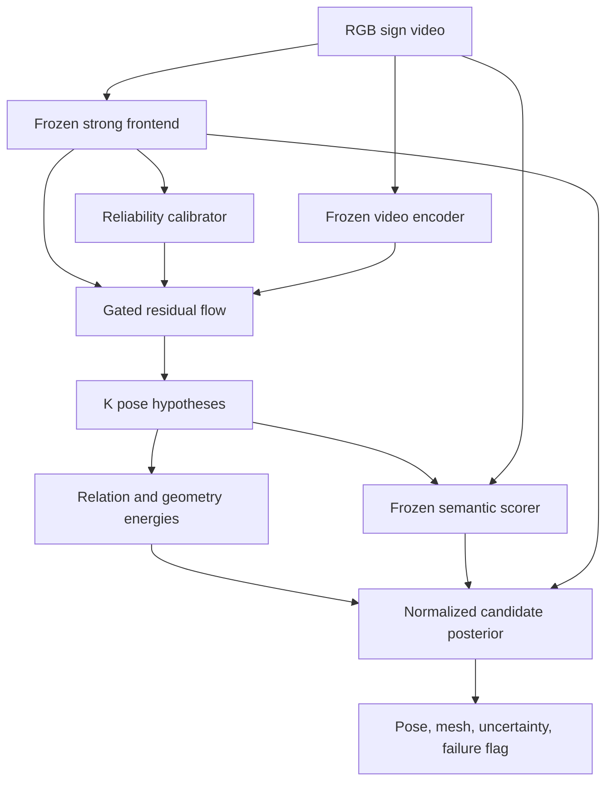

# DexAvatar: Deep Research, SOTA Audit và Thiết kế Method có Novelty

**Ngày cắt dữ liệu:** 19-08-2026 (Asia/Bangkok)
**Paper gốc:** Kaustubh Kundu et al., *DexAvatar: 3D Sign Language Reconstruction with Hand and Body Pose Priors*, WACV 2026.
**Artifact được kiểm tra:** PDF 21 trang (paper + supplementary) và official repository tại commit `a0dfd427f60f5811aadb35c8657b3856d47f56b5` (03-05-2026).
**Quy ước:** **[Evidence]** = nguồn trực tiếp; **[Inference]** = suy luận từ nhiều bằng chứng; **[Hypothesis]** = cần thực nghiệm; **[Unknown]** = chưa đủ dữ liệu. `FT` = đã đọc full text; `AO` = abstract/metadata only; `CA` = code-audited.

---

## 1. Executive verdict

### Kết luận ngắn

| Câu hỏi | Phán quyết |
|---|---|
| DexAvatar có là SOTA khi công bố? | **Có điều kiện.** **[Evidence]** Tại thời điểm WACV 2026, DexAvatar là kết quả peer-reviewed tốt nhất được báo cáo trên SGNify theo bảng TR-V2V của paper: 30.13 mm UBody(-F), 13.53 mm tay trái, 13.08 mm tay phải. Tuy nhiên, paper không báo variance, runtime, failure coverage hay evaluator, nên chỉ nên gọi là **best reported under the stated SGNify setting**. |
| DexAvatar còn SOTA ngày 19-08-2026? | **Không còn là best reported.** Tamaththul3D (preprint, 06-2026) báo cáo 29.28/10.65/8.90 mm và 0.67 s/frame so với 21.60 s/frame của DexAvatar. Nhưng Tamaththul gọi metric là PA-MPVPE, trong khi DexAvatar dùng TR-V2V; hai alignment không tương đương. Vì vậy chưa đủ bằng chứng gọi Tamaththul là SOTA normalized. DexAvatar vẫn là kết quả peer-reviewed mạnh nhất trên protocol TR-V2V được mô tả, nhưng không còn là kết quả số tốt nhất được công bố. |
| Bottleneck quan trọng nhất | **[Inference]** Khi hand/body evidence bị occlusion, blur hoặc detector dropout, DexAvatar tối ưu một point estimate quanh initializer bằng hai VAE pose priors tĩnh, độc lập. Cơ chế này không biểu diễn posterior đa mode và không dùng semantic information của sign để phân giải các nghiệm 3D cùng khớp 2D. |
| Method khuyến nghị | **CUSP-SL — Counterfactual Uncertainty-gated Semantic Posterior for Sign-Language Reconstruction.** Chỉ mở rộng posterior ở các span/joint không chắc chắn; sinh residual hypotheses trên (SO(3)); chọn bằng calibrated observation likelihood + bimanual relation/contact score + frozen video–pose semantic score được huấn luyện bằng phonological counterfactuals. |
| Novelty verdict | **Novelty likely defensible — có điều kiện.** Novelty nằm ở cơ chế *uncertainty-triggered identity-preserving posterior expansion* và *counterfactual semantic reranking for reconstruction*, không nằm ở flow, semantic encoder hay contact loss riêng lẻ. Nếu semantic reranking không thắng geometry-only reranking, novelty giảm thành recombination/incremental. |
| Confidence | SOTA audit: **0.82**; diagnosis bottleneck: **0.78**; novelty defensibility: **0.65**; xác suất cải thiện SOTA accuracy: **chưa định lượng được trước thực nghiệm**. |
| Hành động tiếp theo | Reimplement evaluator TR-V2V; audit denominator/missing frames; reproduce DexAvatar; chạy control `SMPLer-X + WiLoR + coordinate conversion`; đo best-of-(K) oracle gap trên occlusion subset trước khi train full CUSP-SL. |

### Decision memo

**CONDITIONAL GO.** Tiếp tục CUSP-SL chỉ khi bốn điều kiện cùng đạt:

1. Baseline/evaluator được tái tạo trong tolerance định trước và mọi frame failure được tính.
2. Có oracle gap đáng kể giữa top-1 và best-of-(K) ở occlusion subset; nếu không, multi-hypothesis không có room để rerank.
3. Semantic reranker thắng geometry-only và random selection trên hard phonological counterfactuals, giữ được kết quả trên unseen signers/glosses/languages.
4. Gain không thể giải thích chỉ bằng WiLoR, smoothing, thêm compute hoặc frame filtering.

Nếu (2) hoặc (3) thất bại: **PIVOT** sang phương án conservative UGR-Fit. Nếu evaluator không thể chuẩn hóa: không tuyên bố SOTA; chuyển trọng tâm thành reproducibility/robustness/Pareto study.

---

## 2. Assumptions và phạm vi research

### 2.1 Phạm vi

- Input mục tiêu: monocular RGB sign-language video; output: temporally coherent SMPL-X pose/mesh cho upper body, hai tay và, khi khả thi, non-manual components.
- Benchmark chính: SGNify motion-capture evaluation set gồm 57 DGS signs và 2,872 central frames theo DexAvatar.
- So sánh trực tiếp chỉ được coi là hợp lệ khi cùng dataset version, frame list, vertex regions, alignment, external-data policy, backbone, TTA/ensemble và failure denominator.
- Research landscape bao phủ direct sign reconstruction, whole-body/hand recovery, temporal/generative priors, occlusion, bimanual interaction, sign semantics và evaluation.
- Report giữ lại 42 works có vai trò rõ; không dùng số lượng search hits làm bằng chứng. Hai vòng query cuối cùng theo exact combination, synonym, mechanism và citation snowballing không tìm thấy exact prior cho *video-conditioned sign-semantic reranking of 3D reconstruction hypotheses*. Đây là **relative saturation**, không phải bằng chứng rằng prior không tồn tại.

### 2.2 Những gì chưa có

- **[Unknown]** Source code/pretrained weights của Tamaththul3D chưa tìm thấy trong GitHub search tại ngày cắt dữ liệu; chưa thể reproduction-audit.
- **[Unknown]** Official SGNify evaluator/frame manifest dùng bởi DexAvatar không có trong repository.
- **[Unknown]** SignBPoser/SignHPoser training code, exact train/dev/test subject split và original mocap hand dataset không có trong repository.
- **[Unknown]** Không có phép đo độc lập nào xác nhận runtime 21.60 s/frame hoặc số Tamaththul trên cùng evaluator TR-V2V.

### 2.3 Nguồn ưu tiên

Paper/proceedings chính thức, arXiv/OpenReview full text, project page và official code được ưu tiên. Blog/secondary pages không được dùng để hỗ trợ technical claim khi primary source tồn tại.

---

## 3. Technical reconstruction của paper gốc

### 3.1 Problem formulation, input, output, assumptions

**[Evidence]** DexAvatar nhận chuỗi frame monocular (I_{1:T}), khởi tạo SMPL-X/camera/body từ SMPLer-X, hand pose/keypoints từ HaMeR và body 2D keypoints từ Sapiens, rồi tối ưu SMPL-X để sinh upper-body và hand meshes. Paper giả định:

- một signer chính, body/hand detectors chạy thành công;
- camera và shape/pose initializer đủ gần nghiệm đúng để latent fitting hội tụ;
- signing chủ yếu ở upper body; lower-body joint weights bằng 0;
- sign được biết là one-handed hay two-handed; non-dominant arm/hand có thể tắt;
- sign-specific pose manifold học từ pseudo-3D/mocap transfer được sang test signer/language;
- previous-frame pose là regularizer temporal đủ tốt.

Output SMPL-X có topology cố định, về lý thuyết gồm shape \(\beta\), expression \(\psi\), global/body/hand poses \(\theta\) và camera. **[Code Evidence]** Trong released fitter, optimizer thực tế chỉ nhận body latent và một/hai hand latents; camera, shape, global orientation, expression/jaw/eyes không nằm trong `final_params`. Do đó released pipeline là latent pose refinement quanh initializer, không phải joint optimization của toàn bộ \((\beta,\psi,\theta,\text{camera})\).

### 3.2 Dataset, split, preprocessing, augmentation và protocol

#### Body prior data

- **[Evidence, PDF pp. 3–5, Sec. 3.2.1, Fig. 3]** 3D body pseudo-labels lấy từ SignAvatars/How2Sign.
- Frames vi phạm physiological range-of-motion hoặc signer-space envelope ở shoulders, elbows/forearms, wrists bị loại.
- Không thấy augmentation cho prior training được mô tả.
- **[Unknown]** Số frame trước/sau lọc, signer-independent split và data leakage giữa SignAvatars sources không được báo.

#### Hand prior data

- **[Evidence, PDF p. 4, Sec. 3.2.2; Suppl. S3 pp. 9–11]** New mocap dataset: 8 signers (6 Auslan, 2 ASL), 93 fingerspelling words; Vicon 9 cameras + Manus gloves.
- Motion được retarget sang SMPL-X trong Blender/Rokoko; arm IK theo wrist trajectories; bake per-frame rotations.
- 15 hand joints được rectified theo bending/splaying/twisting limits.
- **[Unknown]** Số frame, demographic breakdown, subject-disjoint split, glove calibration error, inter-annotator/retargeting QC và public license không được báo.

#### Evaluation data

- **[Evidence, PDF p. 6, Sec. 4]** SGNify mocap dataset, 57 German signs; chỉ central portions, tổng 2,872 frames.
- Metric: translation-aligned vertex-to-vertex error (TR-V2V), regions UBody(-F), LHand, RHand.
- **[Evidence]** TR alignment chỉ loại translation; PA alignment loại scale, rotation và translation. Vì vậy TR-V2V nghiêm ngặt hơn PA-MPVPE và không được trộn lẫn.
- Không có seed variance, confidence interval, significance test hoặc per-sign error distribution.

### 3.3 Architecture và data flow

1. Chạy SMPLer-X để lấy SMPL-X pose, shape, camera initialization.
2. Chạy HaMeR để lấy per-hand MANO pose, 2D keypoints và wrist-relative 3D hand evidence.
3. Chạy Sapiens để lấy body 2D keypoints/confidences.
4. Đưa body axis-angle vào SignBPoser latent \(\bar\zeta\), left/right hands vào SignHPoser latents \((\epsilon_l,\epsilon_r)\).
5. Dùng one/two-hand label và motion-based dominant-side heuristic để zero non-dominant weights.
6. Tối ưu theo ba stages với LBFGS; previous fitted frame cung cấp temporal target.
7. Decode latents, ghép SMPL-X mesh và render.

### 3.4 Priors và objectives

Hai priors là VAE encoder–decoder, mỗi bên 3 linear layers, hidden size 512. Paper mô tả prior loss:

\[
\mathcal L_{\text{prior-train}}=
c_1\mathcal L_{KL}+c_2\mathcal L_{recon}+c_3\mathcal L_{mesh}
+c_4\mathcal L_{orth}+c_5\mathcal L_{reg}+c_6\mathcal L_{biomech}.
\]

Với:

\[
\mathcal L_{KL}=D_{KL}(q(Z\mid R)\|\mathcal N(0,I)),\quad
\mathcal L_{recon}=\|\alpha-\hat\alpha\|_2^2,
\]

\[
\mathcal L_{mesh}=\|M-\hat M\|_2^2,\quad
\mathcal L_{orth}=\|\hat R\hat R^\top-I\|_2^2,
\]

\[
\mathcal L_{biomech}=\sum_j\left\|
\max(\theta_j-\theta_{j,max},\theta_{j,min}-\theta_j,0)
\right\|_2^2.
\]

Weights được báo:

- SignBPoser: ((0.001,0.999,0.999,0.01,0.0001,1.5)).
- SignHPoser: ((0.0001,0.999,0.999,0.01,0.0001,1.5)).

Fitting objective trong paper (Eq. 12, PDF p. 5):

\[
\mathcal L=\mathcal L_{joint}+\lambda_1\mathcal L_{bprior}
+\lambda_2\mathcal L_{hprior}+\lambda_3\mathcal L_{pen}
+\lambda_4\mathcal L_{temp}+\lambda_5\mathcal L_{bbiomech}
+\lambda_6\mathcal L_{hbiomech}.
\]

Body/hand priors tether decoded poses to initial SMPLer-X/HaMeR poses plus latent norm:

\[
\mathcal L_{bprior}=\rho(\theta_b-\hat\theta_b)+\lambda_{\bar\zeta}\|\bar\zeta\|_2^2,
\]

\[
\mathcal L_{hprior}=\rho(\theta_h-\hat\theta_h)+
\lambda_{\epsilon_l}\|\epsilon_l\|_2^2+
\lambda_{\epsilon_r}\|\epsilon_r\|_2^2.
\]

Temporal term là robust distance tới previous-frame body pose; collision term dùng mesh self-intersection/conic distance. **[Inference]** Đây là anti-penetration, không phải positive contact preservation: không có term hút đúng fingertips/palms vào contact hoặc giữ z-order.

### 3.5 Training, inference và hyperparameters

- Prior training: Adam, learning rate (10^{-3}); 3-layer MLP, hidden 512.
- Best reported body latent: 33 cho filtered data; best hand latent: 23.
- Fitting: LBFGS line-search, learning rate 0.5, max 30 iterations/stage, 3 stages; RTX 4090 24 GB + 64 GB CPU.
- Released config: body prior 4.78; collision 0.5/1.0/1.5; shape 5; hand prior 0/4.78/4.78; body joint 0.5/1.0/1.5; hand joint 0.5/1.5/2.5; body biomechanics 100; initializer body/hand tether 1,200 ở mọi stage; explicit 3D hand weight 0/0/0.
- **[Unknown]** Epochs, batch size, learning-rate schedule, random seeds, early stopping, exact data split và weight decay cho VAE không được báo trong paper/repo.

### 3.6 Main results và ablations

| Method | UBody(-F) ↓ | LHand ↓ | RHand ↓ |
|---|---:|---:|---:|
| FrankMoCap | 78.07 | 20.47 | 19.62 |
| PIXIE | 60.11 | 25.02 | 22.42 |
| PyMAF-X | 68.61 | 21.46 | 19.19 |
| SMPLify-SL | 56.07 | 22.23 | 18.83 |
| SGNify | 55.63 | 19.22 | 17.50 |
| OSX | 47.32 | 18.34 | 18.12 |
| Neural Sign Actors | 46.42 | 16.17 | 15.23 |
| EVA* | 40.38 | 13.73 | 13.68 |
| **DexAvatar** | **30.13** | **13.53** | **13.08** |

**[Evidence, PDF Table 1, p. 6]** Reported gain so với Neural Sign Actors là 35.11% UBody, 16.32% LHand, 14.11% RHand. Đây là reported, chưa phải reproduced gain.

Body ablation (Table 2):

| Prior | FBody | UBody | UBody(-H) | UBody(-F) |
|---|---:|---:|---:|---:|
| BPu | 43.18 | 29.95 | 44.72 | 34.06 |
| BPf | 42.32 | 26.78 | 41.35 | 30.28 |
| BPf+bio | 42.38 | 26.93 | 41.88 | 30.44 |

Hand ablation (Table 3):

| Prior | UBody(-F) | LHand | RHand |
|---|---:|---:|---:|
| HPu | 31.34 | 14.19 | 13.92 |
| HPf | 30.17 | 13.55 | 13.06 |
| HPf+bio | 30.13 | 13.53 | 13.08 |

### 3.7 Module attribution: điều gì thực sự tạo gain?

- **[Evidence] Data cleaning là contributor rõ nhất trong ablations.** BPu→BPf giảm UBody(-F) 34.06→30.28; HPu→HPf giảm hands 14.19/13.92→13.55/13.06.
- **[Evidence] Biomechanical loss cho prior không tạo gain ổn định.** BPf+bio hơi tệ hơn BPf; HPf+bio chỉ thay đổi 0.02/-0.02 mm tùy tay.
- **[Evidence] Body biomechanics tại fitting chỉ tạo 0.05–0.37% relative improvements theo paper.** Đây là rất nhỏ và không có variance.
- **[Inference] Strong initializer/tether là confounder lớn.** Released config giữ SMPLer-X/HaMeR target với weight 1,200 ở cả ba stages; explicit 3D hand term bị zero. Không có ablation `same optimizer + generic prior`, `same initializer + no prior`, matched tuning budget hoặc `HaMeR→WiLoR`.
- **[Evidence from Tamaththul] Trên reported SGNify numbers mới hơn, chỉ thay SMPLer-X hand bằng WiLoR qua coordinate conversion giảm hand error từ 18.17/17.47 xuống 10.71/9.03; geometric alignment sau đó chỉ thêm 0.03/0.08 mm.** Điều này cho thấy backbone/hand estimator có thể giải thích gain lớn hơn domain-specific fitting.
- **[Unknown]** Không đủ bằng chứng tách gain từ pretraining data, filtering, VAE manifold, tuning budget và frame success filtering.

### 3.8 Failure cases và omissions

- Supplement S6 thừa nhận SGNify GT có collapsed fingers/irregular knuckle spacing; TR-V2V có thể phạt một pose hợp lý hơn.
- Robustness với blur, Gaussian noise, self-occlusion chỉ qualitative trên MM-WLAuslan; không có controlled severity curve.
- Không có Deaf signer/expert study, sign intelligibility, mouthing/facial-expression evaluation hoặc semantic preservation metric.
- Không có runtime, parameter count, FLOPs, memory peak, latency distribution hay energy use.
- Không có cross-language quantitative test, OOD signer split hoặc subgroup/fairness report.
- Không báo detector failure rate; released loader bỏ frame thiếu HaMeR hoặc SMPLer-X output.
- One/two-handed classes được pre-filled trong `data/signs.txt`; dominant side là wrist-motion heuristic. Đây không phải released end-to-end classifier.

### 3.9 Baseline technical card

| Thuộc tính | DexAvatar card |
|---|---|
| Input/output | Monocular RGB frames → SMPL-X upper-body/hand pose and mesh. |
| Frontend | SMPLer-X body/camera/shape; HaMeR hand; Sapiens body 2D. |
| Trainable prior | SignBPoser VAE latent 33; SignHPoser VAE latent 23; 3×linear, hidden 512. |
| Optimization | 3-stage LBFGS, lr 0.5, 30 iters/stage; optimize latents only in released code. |
| Key loss | 2D reprojection, latent/initializer tether, self-penetration, previous-frame robust temporal, body ROM. |
| Main result | Reported TR-V2V 30.13/13.53/13.08 mm on 2,872 SGNify central frames. |
| Compute | Paper: RTX 4090 24 GB; no runtime. Later Tamaththul reports 21.60 s/frame on RTX 5070 Ti. |
| Strength | Sign-specific data filtering; simple latent fitting; clear hand/body priors; strong reported SGNify accuracy. |
| Bottleneck | Static independent priors; point estimate; initializer dependence; slow per-frame optimization; weak temporal/contact semantics. |
| Assumptions | Successful detectors, known sign segmentation/class, suitable prior domain, reliable pseudo-labels. |
| Failure modes | Occlusion/dropout, fast hands, OOD sign language/clothing, wrong dominant side, GT mismatch, temporal jitter. |
| Replaceable components | HaMeR→WiLoR/HandOS; per-frame temporal→windowed conditional posterior; fixed tethers→calibrated gate; collision→relation/contact likelihood; TR-V2V-only→geometry+semantic+human evaluation. |

---

## 4. Source-code và reproducibility audit

### 4.1 Những gì chạy được

- Repository clone thành công; 2,076 tracked files, phần lớn là vendored SMPLer-X, HaMeR, neural renderer và mesh-intersection dependencies.
- Static `py_compile` cho custom Python và `bash -n` cho scripts không phát hiện syntax error.
- Config fitting, sign segment/class manifests và inference scripts hiện diện.

### 4.2 Paper–code discrepancies

Các pointer chính đã audit: `dexavatar_fitting/smplifyx/fit_single_frame.py:476–496` (optimizer parameter list), `fitting.py:499,655` (temporal/total loss), `data_parser.py:176–195` (frame filtering), `cfg_files/fit_smplx_vposer_x.yaml:44–116` (stage weights), và `data/signs.txt` (one/two-handed labels).

| Claim/paper | Released code | Tác động |
|---|---|---|
| Jointly fit SMPL-X variables | `final_params` chỉ chứa body/hand latent embeddings | Shape, camera, global pose, face/expression bị fixed theo initializer; phạm vi optimization hẹp hơn cách đọc Eq. 12. |
| Có (mathcal L_{hbiomech}) | Không tìm thấy explicit hand-biomechanics fitting term | Eq. 12 không khớp implementation. |
| Eq. 11 dùng squared (L_2) ngoài bound | Code dùng mean of ReLU violations | Loss geometry và scale khác paper. |
| Configurable temporal loss | Hard-coded GMoF(previous body-pose difference) × 2,000 | Không có hand-specific velocity/acceleration/jerk hoặc schedule; khó ablate/reproduce. |
| Contact-aware/plausible contact | Chỉ có self-penetration search/penalty | Không model positive contact, overlap identity hoặc depth order. |
| 3D hand evidence từ HaMeR | `data_3d_weights=[0,0,0]` | Computed 3D term không đóng góp trong released config. |
| Biomechanical VAE training | Không có SignBPoser/SignHPoser training/preprocessing source | Không audit được Eq. 5, dataset cleaning hay reproduce priors. |
| Face-aware whole-body output | Face keypoints có weights nhưng face params không được optimize | Non-manual channels chủ yếu kế thừa initializer. |
| Evaluate all selected frames | Loader bỏ frame thiếu HaMeR prediction hoặc SMPLer-X pickle | Có nguy cơ conditioning-on-success; cần báo frame coverage và penalized metric. |

### 4.3 Packaging/reproduction blockers

- Không có evaluation script, metric tests, exact frame manifest hoặc reported-results reproduction command.
- Prior checkpoints được trỏ qua Google Drive, không có checksum; training code/dataset không release.
- `sapiens` là gitlink nhưng không có `.gitmodules` mapping; `git submodule` thất bại.
- README dẫn nhầm `preprocess/SMPLer-X/requirements.txt`; path thực tế là `SMPLer-X/requirements.txt`.
- Cần nhiều environment không đồng nhất: Python/CUDA/PyTorch versions khác nhau cho main, SMPLer-X và Sapiens; SMPL-X assets có license/gated download.
- Không có lockfile, Docker/Apptainer image, deterministic settings, seed list hoặc hardware-normalized runtime.

**Reproducibility verdict:** **partial release, not end-to-end reproducible**. Code đủ để hiểu latent fitting và chạy khi có external assets, nhưng không đủ để tái tạo priors hoặc Table 1 từ raw data.

---

## 5. Current SOTA và benchmark normalization

### 5.1 Tại thời điểm công bố

**[Evidence]** Proceedings xác nhận DexAvatar là WACV 2026, pp. 5842–5852. Trong các methods được Table 1 đánh giá trên stated SGNify TR-V2V protocol, DexAvatar có số thấp nhất. Không có direct later peer-reviewed work cùng protocol tại thời điểm paper xuất hiện.

**Verdict lịch sử:** *best reported under the paper's SGNify/TR-V2V setting*, không phải universal SOTA cho mọi whole-body/hand benchmark.

### 5.2 Tại ngày 19-08-2026

Tamaththul3D (arXiv preprint v2, 04-06-2026) báo:

| Method | Body | LHand | RHand | Time (same RTX 5070 Ti) |
|---|---:|---:|---:|---:|
| DexAvatar (Tamaththul reproduction) | 30.13 | 13.53 | 13.08 | 21.60 s/f |
| Tamaththul3D | 29.28 | 10.65 | 8.90 | 0.67 s/f |

**[Evidence]** Tamaththul còn báo hand/body jitter 299.14/289.02 so với 1,783.64/1,791.15 của DexAvatar và RTE 215.53 so với 572.52 trên 560 frames.

### 5.3 Vì sao chưa thể gọi so sánh này apples-to-apples

| Trục | DexAvatar | Tamaththul3D | Kết luận |
|---|---|---|---|
| Metric label | TR-V2V | PA-MPVPE | Không tương đương: PA loại scale+rotation+translation; TR chỉ translation. |
| Region | UBody(-F) | Body | Vertex subset có thể khác. |
| Baseline values | OSX 47.32 | OSX 60.79 | Dấu hiệu evaluator/region/pipeline khác. |
| Other baselines | Nhiều số giống hệt | Nhiều số được lặp lại y nguyên | Có thể copy published values dưới metric label mới; cần source/evaluator. |
| Code | Partial official code | Không tìm thấy official code | Chưa independent reproduction. |
| Publication | WACV peer-reviewed | arXiv preprint | Trạng thái evidence khác nhau. |
| Runtime | Không báo trong paper | Re-ran cả hai trên same GPU | Hữu ích nhưng chưa có scripts/logs để audit. |

**Current verdict:**

- **DexAvatar không còn là best reported number.**
- **Tamaththul3D là stronger reported result và reported accuracy–latency Pareto improvement, nhưng chưa directly comparable.**
- **Chưa đủ bằng chứng để tuyên bố normalized current SOTA.** Cần chạy cùng official frame list, translation-only alignment, identical region vertices và failure policy.

### 5.4 Simple-change warning

Tamaththul ablation cho thấy:

| Configuration | Body | LHand | RHand |
|---|---:|---:|---:|
| SMPLer-X | 28.46 | 18.17 | 17.47 |
| + 2D supervision | 28.35 | 18.17 | 17.47 |
| + WiLoR coordinate conversion | 28.46 | 10.71 | 9.03 |
| + geometric alignment | 29.53 | 10.68 | 8.95 |
| Full | 29.28 | 10.65 | 8.90 |

**[Evidence]** Phần lớn hand gain đến từ WiLoR substitution; geometry/shoulder stages tạo numerical gain nhỏ. Do đó mọi method mới bắt buộc có `SMPLer-X + WiLoR + direct conversion` làm simple control. Nếu không, reviewer có thể quy toàn bộ gain cho stronger hand backbone.

---

## 6. Research landscape

### 6.1 Direct domain: sign-language capture/reconstruction

| Nhánh | Representative works | Điều đã được giải quyết | Khoảng trống còn lại |
|---|---|---|---|
| Linguistic fitting | [SGNify](https://arxiv.org/abs/2304.10482), [DexAvatar](https://arxiv.org/abs/2512.21054) | Hand symmetry/invariance, sign-specific pose manifolds, fitting vào SMPL-X | Point estimate, offline/slow, phụ thuộc initializer; semantics chỉ là class/rule hoặc implicit prior |
| Deterministic modular fusion | [Tamaththul3D](https://arxiv.org/abs/2605.05367) | Ghép SMPL-X body với MANO hand bằng coordinate conversion + geometric forearm alignment; latency thấp hơn | Không biểu diễn ambiguity; severe inter-hand occlusion vẫn là failure; protocol chưa normalized |
| Holistic 3D data/production | [SignAvatars](https://arxiv.org/abs/2310.20436), [Neural Sign Actors](https://arxiv.org/abs/2312.02702), [SignAvatar](https://arxiv.org/abs/2405.07974) | Pseudo-3D datasets và text/image-to-motion generation | Pseudo-label bias; generation prior không tự động trở thành image-conditioned reconstruction posterior |
| Semantic/evaluation | [Meaningful Pose-Based Sign Language Evaluation](https://arxiv.org/abs/2510.07453), [Pose Estimator Evaluation for SLT](https://arxiv.org/abs/2604.24609) | Distance/embedding/back-translation metrics; estimator quality có downstream semantic effect | Chưa dùng semantic score để chọn giữa các 3D hypotheses trong reconstruction; human intelligibility vẫn thiếu |

**[Evidence]** SGNify đã dùng linguistic symmetry, invariance và reference-pose constraints; vì vậy không thể gọi “thêm linguistic prior” vào DexAvatar là mới. **[Evidence]** Tamaththul đã thực hiện phép thay HaMeR bằng WiLoR và geometric integration; do đó backbone swap không phải novelty. **[Inference]** Direct-domain gap hẹp nhưng rõ: chưa có một reconstruction system báo calibrated conditional posterior và sử dụng video–pose semantic consistency để giải ambiguity mà không sửa các vùng evidence đã chắc chắn.

### 6.2 Component-level map

| Component | Evidence family | Mechanism có thể transfer | Điều không nên suy diễn |
|---|---|---|---|
| Strong hand frontend | HaMeR, WiLoR, Hamba, HandOS, HaWoR | Better crop/global context, scale/orientation recovery | Benchmark hand gain không đảm bảo sign semantic fidelity |
| Whole-body temporal model | DanceHMR, MoRo, SMPLest-X | Body–hand fusion, masked temporal context, window inference | Smoothness có thể đến từ rigid/under-articulated hands |
| Generative posterior | MaskHand, HandFlow, DiffPose, FMPose3D | Sample multiple plausible poses under ambiguous evidence | Best-of-\(K\) oracle gain không đảm bảo có selector tốt |
| Occlusion representation | ViDiHand, STRIDE, From-2D-to-3D-Plausibility | Video diffusion features, masked recovery, penetration guidance | Egocentric hand-object priors có domain mismatch với frontal signing |
| Biomechanics/contact | BioPose, ARCTIC-style relation cues, DexAvatar ROM | Joint limits, bimanual relative geometry, collision avoidance | Anti-penetration khác positive linguistic contact |
| Reliability/calibration | Detector confidence, masking models, failure coverage | Trigger compute only when needed; preserve confident estimate | Raw confidence không phải calibrated probability of 3D error |
| Sign semantics | SignBERT+, MASA, SignMAE, SignDINO, meaningful pose metrics | Video–pose contrastive score; hard phonological negatives | Recognition features có thể ignore fine 3D depth/contact |
| Efficiency | Tamaththul, windowed flow, keyframe/interpolation literature | Analytic alignment, sparse ambiguous-span inference | Thêm candidate generation có thể xóa lợi thế latency |

### 6.3 Cross-domain transfer theo cơ chế

1. **Multi-hypothesis 3D pose.** DiffPose/MaskHand/HandFlow giải cùng cấu trúc toán học: ánh xạ \(p(\Theta\mid I)\) là đa mode vì projective ambiguity và occlusion. Transfer hợp lý vì sign reconstruction có cùng inverse problem; khác biệt là selector phải nhạy với phonology.
2. **Selective computation.** Reliability gating tương tự mixture-of-experts/selective prediction: dùng estimator rẻ làm identity path, chỉ gọi posterior model khi expected error cao. Transfer dựa trên decision structure, không dựa trên tên module.
3. **Counterfactual metric learning.** Hard-negative contrastive learning trong representation learning có thể tạo scorer nhạy với minimal pairs. Ở sign language, negative phải đổi đúng một articulatory feature—handshape, orientation, location, movement hoặc contact—để tránh scorer học signer/background.
4. **Factor-graph reranking.** Candidate energy kết hợp observation likelihood, dynamics, relation/contact và semantic compatibility giống structured inference. Đây phù hợp hơn end-to-end semantic loss trực tiếp vì tách generator khỏi nguy cơ “gaming” recognizer.
5. **Uncertainty as an output.** Generative hand/HMR methods cho thấy ambiguity nên được giữ dưới dạng samples/posterior. Với avatar capture, entropy hoặc disagreement có thể dùng để flag human review thay vì che giấu failure trong một point estimate.

### 6.4 Theory/foundational interpretation

Cho observation \(I\), deterministic fitting của DexAvatar xấp xỉ:

\[
\hat\Theta_{\text{MAP}}
=\arg\min_\Theta
\underbrace{E_{\text{obs}}(\Theta;I)}_{\text{2D/initializer}}
+\underbrace{E_{\text{prior}}(\Theta)}_{\text{VAE/ROM}}
+\underbrace{E_{\text{temp}}(\Theta)}_{\text{previous frame}}.
\]

Khi một hand bị che, nhiều \(\Theta\) có gần như cùng \(E_{\text{obs}}\). Prior tĩnh có thể chọn pose phổ biến nhưng sai sign. CUSP-SL thay vì ép posterior về một mode sẽ xấp xỉ:

\[
p(\Theta\mid I)\propto
\exp[-E_{\text{obs}}-E_{\text{dyn}}-E_{\text{rel}}]
\;p_{\text{motion}}(\Theta\mid I),
\]

rồi dùng semantic evidence \(s(I,\Theta)\) như một likelihood factor để chọn candidate. **[Hypothesis]** Nếu video chứa context trước/sau occlusion và scorer thật sự nhạy với minimal-pair phonology, candidate đúng có thể được chọn dù frame-local 2D evidence không phân biệt được.

### 6.5 Search protocol và saturation

- Search theo exact title, author group, dataset, citations backward/forward, arXiv/CVF/OpenReview/GitHub, mechanism synonyms: sign capture, 3D sign reconstruction, whole-body mesh, 4D hand recovery, multi-hypothesis, conditional flow/diffusion, occlusion, semantic reranking, phonological minimal pair, contact/depth order, uncertainty calibration.
- Phạm vi năm chủ yếu 2019–19-08-2026; foundational work cũ hơn được giữ khi cần.
- Vòng phản bác cuối tìm: (i) exact combination trong direct domain; (ii) same mechanism dưới tên candidate ranking, posterior sampling, semantic consistency, recognition-guided reconstruction; (iii) evidence rằng semantics/smoothness không tương quan geometry.
- Hai vòng cuối không phát hiện exact prior mới hoặc bằng chứng thay đổi recommendation. Kết luận saturation là **tương đối**, không biến “không tìm thấy” thành “không tồn tại”.

---

## 7. Evidence ledger

NR = paper không report; ? = chưa xác minh; official = official code/project được paper dẫn; FT/AO/CA theo quy ước đầu báo cáo.

| # / Paper, năm, trạng thái | Domain / bài toán | Mechanism | Dataset / kết quả liên quan | Compute | Code | Giá trị cho hướng đề xuất | Hạn chế |
|---|---|---|---|---|---|---|---|
| 1. [DexAvatar](https://arxiv.org/abs/2512.21054), 2026, WACV, FT+CA | 3D sign capture | SignB/SignH VAE priors + LBFGS | SGNify; 30.13/13.53/13.08 mm reported | RTX 4090; runtime NR | [official](https://github.com/kaustesseract/DexAvatar), partial | Baseline và direct prior | Không evaluator/prior training/seeds; point estimate |
| 2. [SGNify](https://arxiv.org/abs/2304.10482), 2023, CVPR, FT | 3D sign capture | Linguistic symmetry/invariance/reference pose | 57 DGS signs; mocap + perceptual study | Offline; NR | official project/data | Closest linguistic fitting prior | Rule/class assumptions; slow optimization |
| 3. [Tamaththul3D](https://arxiv.org/abs/2605.05367), 2026, preprint, FT | 3D sign capture | SMPLer-X+WiLoR, coordinate conversion, analytic forearm alignment | SGNify reported 29.28/10.65/8.90; 0.67 s/f | RTX 5070 Ti | Không tìm thấy | Strong/simple control; Pareto target | Metric/region conflict; no independent reproduction |
| 4. [SignAvatars](https://arxiv.org/abs/2310.20436), 2024, ECCV, FT | 3D SL dataset + production | Holistic pseudo-SMPL-X annotation, generative benchmark | Large-scale SL video sources | NR here | official | Paired pseudo-3D pretraining pool | Pseudo-label bias; reconstruction quality ceiling |
| 5. [Neural Sign Actors](https://arxiv.org/abs/2312.02702), 2024, CVPR, FT | Text-to-3D signing | Anatomical graph diffusion over SMPL-X | Curated 4D avatars; DexAvatar baseline row | NR here | official | Sign motion prior/semantic conditioning | Generation, not video reconstruction |
| 6. [SignAvatar](https://arxiv.org/abs/2405.07974), 2024, FG, FT | Reconstruction + generation | Transformer CVAE + CLIP | Isolated sign video; text/image prompts | NR | ? | Shows semantic–motion latent alignment | Pseudo-3D and different task/protocol |
| 7. [How2Sign](https://arxiv.org/abs/2008.08143), 2021, CVPR, FT | Multimodal ASL dataset | Multiview RGB/depth/pose/text | \(>80\) h continuous ASL | N/A | official | Video–text–pose pretraining pool | Interpreted ASL; pseudo pose; privacy/license constraints |
| 8. [Meaningful Pose-Based SL Evaluation](https://arxiv.org/abs/2510.07453), 2025, WMT, FT | Evaluation | Distance, embedding, back-translation + human correlation | Multi-language meta-evaluation | NR | official toolkit | Semantic metric/control for CUSP-SL | Metric is not a reconstruction selector by itself |
| 9. [Evaluation of Pose Estimation Systems for SLT](https://arxiv.org/abs/2604.24609), 2026, preprint, FT | Pose→translation | Controlled estimator swap; missing/jitter/occlusion audit | Phoenix: SDPose/Sapiens BLEU \(\sim11.5\), MediaPipe \(\sim10\); 3 runs | V100 FPS reported | [official](https://github.com/ZurichNLP/multimodalhugs-pipelines) | Direct evidence frontend choice affects semantics | 2D pose/SLT, not 3D reconstruction; occlusion \(n=15\) |
| 10. [Large-Scale 3D Representation Dataset and Benchmark](https://doi.org/10.1109/FG67764.2026.11557028), 2026, FG, AO | Continuous SL understanding | Large 3D representation benchmark | Reported \(250+\) h | N/A | ? | Potential scale for semantic encoder | Full data/license/3D provenance need audit |
| 11. [SignDINO](https://openaccess.thecvf.com/content/CVPR2026/html/Gan_Learning_Effective_Sign_Features_without_Text_for_Gloss-free_Sign_Language_CVPR_2026_paper.html), 2026, CVPR, FT | Gloss-free SL representation | Self-supervised sign features without text | Multiple SL understanding benchmarks | Reported in paper | official | Strong video semantic initialization | May encode meaning without metric 3D sensitivity |
| 12. [SignBERT+](https://arxiv.org/abs/2305.04868), 2023, TPAMI, FT | SL understanding | Hand-model-aware self-supervised pretraining | Isolated/continuous SLR | NR here | official | Hand-aware semantic representation | Recognition objective may ignore depth/contact |
| 13. [MASA](https://doi.org/10.1109/TCSVT.2024.3409728), 2024, TCSVT, AO | SL representation | Multi-scale/multi-stream attention | SL recognition benchmarks | NR here | ? | Temporal/manual semantic cues | AO; architecture details not used as evidence |
| 14. [SignMAE](https://arxiv.org/abs/2605.02094), 2026, accepted ICPR, FT | Self-supervised SL | Segmentation-driven masked autoencoding specialized for signing | WLASL/NMFs-CSL/Slovo | NR here | ? | Mask/occlusion pretraining inspiration | No 3D reconstruction result |
| 15. [LVMCN](https://arxiv.org/abs/2412.16944), 2025, ICASSP, FT | SL production | Linguistics–vision monotonic and semantic consistency | PHOENIX14T | NR here | ? | Evidence semantic alignment can score motion | Generation setting; exact transfer unverified |
| 16. [Text-Driven 3D Hand Motion from SL Data](https://arxiv.org/abs/2508.15902), 2026, CVPR, FT | Hand motion generation | Motion descriptions + sign attributes | Large video data with noisy sign labels | Reported in paper | official | Phonological attribute supervision | Text-to-motion, not inverse vision |
| 17. [Phonology-guided SL generation](https://arxiv.org/abs/2603.17388), 2026, CVPRW, FT | SL generation | Explicit phonological factors | SL generation datasets | NR here | ? | Source of minimal-pair/counterfactual axes | Workshop; generation-only evidence |
| 18. [PIDiffSign](https://arxiv.org/abs/2607.14836), 2026, preprint, FT | 3D SL production | Phonology-informed diffusion | Sign motion datasets | NR here | ? | Alternative factorized prior | Very recent; no reconstruction validation |
| 19. [SMPLer-X](https://arxiv.org/abs/2309.17448), 2023, NeurIPS, FT | Expressive whole-body HMR | Generalist SMPL-X regression | Multi-dataset whole-body | Reported in paper | official | DexAvatar body initializer | Image-based; hands weak under sign occlusion |
| 20. [SMPLest-X](https://arxiv.org/abs/2501.09782), 2025, CVPR, FT | Scalable expressive HMR | Scaling data/model for SMPL-X | Whole-body benchmarks | Reported | official | Alternative body frontend/backbone stress test | Smooth hand output can be rigid; SLT study reports low BLEU |
| 21. [OSX](https://arxiv.org/abs/2303.16160), 2023, CVPR, FT | One-stage whole-body mesh | Component-aware transformer | AGORA/UBody; SGNify baseline varies by evaluator | Reported | official | Benchmark normalization warning | Per-frame; region-value inconsistency across papers |
| 22. [AiOS](https://arxiv.org/abs/2403.17934), 2024, CVPR, FT | All-in-one SMPL-X recovery | Unified detection/regression transformer | Whole-body datasets | Reported | official | Matched-backbone/generalization control | Not temporal or sign-specific |
| 23. [Multi-HMR](https://arxiv.org/abs/2402.14654), 2024, ECCV, FT | Multi-person whole-body mesh | Single-shot camera-aware SMPL-X | In-the-wild whole-body | Reported | official | Alternative whole-body frontend | Not specialized for hand occlusion |
| 24. [DanceHMR](https://arxiv.org/abs/2605.18102), 2026, preprint, FT | Video whole-body HMR | Residual body–hand fusion, close-up augmentation, curriculum | Whole-body/video benchmarks; temporal improvements | NR here | ? | Strong temporal joint body-hand prior | New preprint; not sign/semantic; possible data-scale confound |
| 25. [BioPose](https://arxiv.org/abs/2501.07800), 2025, preprint, FT | Biomechanical pose | Differentiable biomechanical constraints | Human pose benchmarks | NR here | ? | Better ROM/control baseline | Plausibility constraints may hurt valid signing extremes |
| 26. [HaMeR](https://arxiv.org/abs/2312.05251), 2024, CVPR, FT | Image hand mesh | ViT + large-scale hand data | Hand benchmarks; DexAvatar initializer | Reported | official | Historical baseline | Crop/detector dependence; scale/wrist integration issues |
| 27. [WiLoR](https://arxiv.org/abs/2409.12259), 2025, CVPR, FT | In-the-wild hand mesh | Scaled data/model, robust detection/regression | Hand benchmarks; Tamaththul strong SGNify gains | Real-time-ish reported | official | Mandatory simple change/control | Per-frame; inter-hand occlusion remains |
| 28. [Hamba](https://arxiv.org/abs/2407.09646), 2024, NeurIPS, FT | Hand mesh recovery | Graph-guided state-space model | Hand benchmarks | Reported | official | Efficient alternative frontend | Still deterministic/image-based |
| 29. [HandOS](https://arxiv.org/abs/2412.01537), 2025, CVPR, FT | Universal hand reconstruction | One-stage multi-hand system | Diverse hand datasets | Reported | official | No-crop/multi-hand control | No sign-specific temporal/semantic validation |
| 30. [HMP](https://arxiv.org/abs/2312.16737), 2024, WACV, FT | 3D hand motion | Learned hand-motion prior + latent optimization | In-the-wild videos | Offline; reported | official | Closest motion-prior optimization | Generic hand; single posterior mode/slow fitting |
| 31. [Dyn-HaMR](https://arxiv.org/abs/2412.12861), 2025, CVPR, FT | 4D hand motion | Dynamic/world-coordinate hand recovery | Video hand datasets | Reported | official | Temporal/world-frame cues | Hand-only; no sign semantics |
| 32. [HaWoR](https://arxiv.org/abs/2501.02973), 2025, CVPR, FT | World-grounded hand motion | Camera/hand motion disentanglement | Egocentric/in-the-wild hand video | Reported | official | World-motion stress test | Camera/domain assumptions differ from frontal sign video |
| 33. [MaskHand](https://arxiv.org/abs/2412.13393), 2025, ICCV, FT | Occluded hand mesh | VQ-MANO masked generative recovery + confidence sampling | Hand benchmarks with occlusion | Reported | official | Closest confidence-guided multi-hypothesis hand prior | Static/image-centered; no whole-body semantic selector |
| 34. [From 2D Alignment to 3D Plausibility](https://arxiv.org/abs/2503.17788), 2026, CVPR, FT | Two-hand reconstruction | Heterogeneous 2D priors + penetration-free diffusion/guidance | Two-hand occlusion benchmarks | Iterative sampling | official project | Closest collision-guided generative two-hand work | No temporal sign semantics; compute |
| 35. [HandFlow](https://arxiv.org/abs/2607.11221), 2026, TOG listing/preprint, FT | 4D hand recovery | Conditional rectified flow, dual-stream temporal model, confidence masking | Reported \(>30\%\) world-space gain; 47 fps | 47 fps reported | official/project | Strongest mechanism precedent for residual posterior | Very recent; hand-only; exact sign transfer untested |
| 36. [ViDiHand](https://arxiv.org/abs/2606.30308), 2026, preprint, FT | Egocentric 4D two-hand | Adapted video-diffusion features + hand-overlay objective | ARCTIC/HOT3D/HOI4D gains | Reported | project | Occlusion/context feature source | Heavy pretrained model; egocentric object bias |
| 37. [MoRo](https://arxiv.org/abs/2601.16079), 2026, 3DV, FT | Masked whole-body motion | Generative recovery under missing/occluded observations | Whole-body motion datasets; 70 fps H200 reported | 70 fps H200 | official | Mask curriculum/reliability precedent | Mocap/motion input, not raw sign video |
| 38. [STRIDE](https://arxiv.org/abs/2312.16221), 2024, ECCV, FT | Test-time 3D motion recovery | Learned motion prior for occlusion/noise | Human motion/video benchmarks | Test-time optimization | official | Strong negative/control for temporal prior | Generic body; iterative compute |
| 39. [DiffPose](https://arxiv.org/abs/2211.16940), 2023, CVPR, FT | 3D pose lifting | Diffusion multi-hypothesis posterior | Human3.6M etc. | Sampling-dependent | official | Foundational ambiguity evidence | Skeleton only; no hands/mesh/semantics |
| 40. [FMPose3D](https://arxiv.org/abs/2602.05755), 2026, preprint, FT | 2D-to-3D pose | Flow matching + Bayesian aggregation | Human/animal pose datasets | Few ODE steps reported | ? | Aggregation/control alternative | Body joints, not SMPL-X/sign |
| 41. [MHFormer](https://arxiv.org/abs/2111.12707), 2022, CVPR, FT | 3D pose from video | Multi-hypothesis temporal transformer | Human3.6M | Reported | official | Temporal hypothesis interaction precedent | Deterministic aggregation can collapse modes |
| 42. [SmoothNet](https://arxiv.org/abs/2112.13715), 2022, ECCV, FT | Pose smoothing | Plug-and-play temporal-only refinement | Multiple pose estimators/datasets | Light | official | Mandatory simple smoothing control | Can hide jitter while erasing meaningful fast articulation |

### 7.1 Evidence conflicts that affect the decision

- **DexAvatar prior quality conflict.** **[Evidence]** Supplementary standalone prior tables favor the unfiltered body prior on some MPJPE/MPVPE measures, while end-pipeline fitting favors the filtered prior. **[Inference]** Filtering may improve optimizer compatibility rather than generative fidelity; the mechanism is unresolved.
- **Geometry versus semantics conflict.** **[Evidence]** Low vertex error is not established as equivalent to comprehensible signing; meaningful-pose evaluation finds metric-dependent trade-offs, and avatar studies highlight mouthing/facial/handshape omissions. CUSP-SL therefore treats geometry and semantics as separate endpoints.
- **Smoothness conflict.** **[Evidence]** The 2026 pose-estimator study observes that SMPLest-X can have low hand jitter while producing rigid/incorrect articulation. Thus jitter alone is not a quality metric.
- **Latest-SOTA conflict.** **[Evidence]** Tamaththul reports stronger numbers nhưng đổi metric label từ TR-V2V/UBody(-F) sang PA-MPVPE/Body và có OSX baseline khác. Current SOTA remains unnormalized.

---

## 8. Bottleneck và gap analysis

### 8.1 Bottleneck table

| Bottleneck / loại gap | Bằng chứng | Nguyên nhân khả dĩ | Ai đã xử lý | Mức độ giải quyết | Cơ hội còn lại |
|---|---|---|---|---|---|
| **B1. Ambiguous/occluded hands → point estimate**; methodological + robustness | DexAvatar chỉ optimize một latent; qualitative failures; generic multi-hypothesis works improve ambiguous pose | Monocular projection, missing crop, motion blur tạo multimodal posterior | MaskHand, DiffPose, HandFlow, FMPose3D | Mạnh trong generic hand/pose; chưa direct SL reconstruction | Conditional residual posterior trên ambiguous spans; đo oracle gap trước |
| **B2. Strong initializer dominates**; empirical + validity | Weight tether 1,200; Tamaththul WiLoR swap tạo phần lớn reported hand gain | Fitter không có image features riêng; prior chỉ perturb initializer | Tamaththul, newer hand frontends | Stronger input đã giúp rõ, nhưng metric chưa normalized | Matched-backbone và direct-conversion controls; identity-preserving residual |
| **B3. Body/left/right priors độc lập**; methodological | DexAvatar dùng separate VAEs; không explicit cross-hand/body interaction likelihood | Mỗi marginal plausible không bảo đảm pair jointly plausible | SGNify symmetry; DanceHMR fusion; two-hand diffusion | Partial: fixed class rule hoặc generic fusion | Learned bimanual relation/contact/depth-order factor conditioned on video |
| **B4. Anti-penetration ≠ linguistic contact**; methodological | Released code chỉ self-intersection; no attraction/contact identity | Collision loss phạt overlap nhưng không biết khi nào/chỗ nào cần touch | SGNify rule priors; two-hand penetration guidance; ARCTIC relation models | Penetration được xử lý, positive sign contact chưa đủ | Predict contact probability + relative transform; use only as likelihood |
| **B5. Weak temporal model**; robustness + efficiency | Previous body pose only; no hand velocity/acceleration; reported DexAvatar jitter rất cao trong Tamaththul | Sequential local minimum; crop identity switches; no window context | HMP, STRIDE, Dyn-HaMR, DanceHMR, HandFlow, SmoothNet | Generic domains strong | Windowed residual posterior; overlap blending; fast-motion-aware dynamics |
| **B6. Geometry-only selection/evaluation**; evaluation gap | TR-V2V may penalize plausible fingers; no semantic/human study; pose metrics have trade-offs | Vertex average does not encode minimal semantic contrasts/non-manuals | Meaningful pose metrics; SLT estimator audit; SGNify perceptual study | Evaluation tools exist; not used as inference factor | Frozen semantic selector + Deaf user study; keep geometry endpoints separate |
| **B7. Incomplete/faulty benchmark normalization**; reproducibility gap | Missing evaluator/frame manifest, no failure coverage; TR vs PA labels; OSX values conflict | Small benchmark, private/misaligned scripts, copied baseline numbers | No later normalized audit found | Low | Release evaluator tests, vertex maps, manifests, logs and penalized failure metric |
| **B8. Data leakage/domain bias risk**; generalization + fairness | Prior split/signers not reported; hand mocap only 8 signers; DGS test versus ASL/Auslan priors | Small subject pool; pseudo-labels inherit estimator bias | Large SL datasets/self-supervised works | Scale improving, controlled 3D still scarce | Signer/gloss/language-disjoint splits; subgroup and cross-language stress tests |
| **B9. Runtime and optimization instability**; efficiency | DexAvatar later reported 21.60 s/f; LBFGS 3×30 iters; no convergence stats | Per-frame iterative collision/prior fitting | Tamaththul 0.67 s/f reported; feed-forward video methods | Large reported Pareto gap | Run generator only on fraction \(r\) ambiguous frames; cap \(K,S\); no full LBFGS |
| **B10. Non-manual information absent/fixed**; semantic gap | Released face/expression params not optimized; literature notes mouthing/facial expression essential | Method and metric focus body/hands | SGNify uses SPECTRE; holistic SL production | Partial, estimator-dependent | Treat as scoped limitation in v1; add face semantic branch only after hand hypothesis passes |

### 8.2 Priority order

1. **B1+B2** là central falsifiable gap: liệu strong deterministic frontend còn một best-of-\(K\) oracle gap ở corrupted/occluded spans hay không?
2. **B6** quyết định publication value: nếu semantic selector không tốt hơn geometry-only selector, proposed novelty không đứng vững.
3. **B3+B4** là interaction factor có thể tạo complementary gain nhưng phải được ablate tách biệt.
4. **B7** phải giải trước mọi SOTA claim; đây là research contribution độc lập nếu benchmark audit phát hiện mismatch.
5. B5/B8/B9 là điều kiện deployment/generalization; B10 nên là next phase để tránh scope explosion.

### 8.3 Causal map of expected gain

\[
\text{Observed gain}
=G_{\text{frontend}}+G_{\text{posterior coverage}}
+G_{\text{selector}}+G_{\text{relation}}
+G_{\text{compute/tuning}}+\epsilon.
\]

Một paper thuyết phục phải đo riêng từng term. Interaction chính cần kiểm tra:

\[
\Delta_{\text{int}}
=\left(M_{A+B}-M_0\right)
-\left(M_A-M_0\right)
-\left(M_B-M_0\right),
\]

với quy ước đổi dấu để “cao hơn là tốt” trước khi tính. Confidence interval của \(\Delta_{\text{int}}\) phải loại 0 mới được gọi là synergy; nếu không chỉ báo additive/redundant gain.

---

## 9. Module analysis và compatibility matrix

### 9.1 Interface/optimization cards

Ký hiệu chung: batch \(B\), window \(T\), SMPL-X upper-body/hand joints \(J\), hypotheses \(K\), feature width \(d\), base rotations \(R^0\in SO(3)^{B\times T\times J}\).

| Module | Bottleneck / I-O interface | Inductive bias và gradient path | Objective/dynamics/data | Cost, dependency, reproducibility |
|---|---|---|---|
| **F — Strong deterministic frontend** | RGB \([B,T,3,H,W]\) → \(R^0,\beta,camera\), 2D joints/confidence; SMPLer-X + WiLoR + coordinate/forearm alignment | High-confidence identity path; frozen in initial experiments; no gradient from CUSP | Pretrained objectives only; infer every frame | Dominant cost but reusable; depends on licensed SMPL-X; WiLoR code available; exact geometric adapter must be tested |
| **Q — Reliability calibrator** | Detector confidence, reprojection residual, crop IoU/visibility, forward–backward/temporal disagreement \([B,T,J,f_q]\) → \(q\in[0,1]^{B\times T\times J}\), gate \(g\) | Monotonic low-confidence trigger; gradient ends at Q, not F | BCE/focal loss for error event + calibration/ECE; train on held-out real/synthetic corruptions | \(<2\)M target params; cheap; requires pseudo/GT error labels; reproducible if corruption seeds/manifests released |
| **G — Residual conditional flow** | \((R^0,C_v,q,\epsilon)\) → \(K\) tangent residual sequences \(\delta^{(k)}\in\mathbb R^{B\times T\times J\times3}\) | Locality around frontend; masked residual means \(g=0\Rightarrow R=R^0\); gradients through Exp-map and flow, F frozen | Conditional flow matching + geodesic/3D/2D/dynamics/relation losses; mask curriculum 15–60%; paired pseudo-3D/mocap | Target ~33M; \(O(KS)\) only on ambiguous fraction \(r\); depends on window features and rotation numerics |
| **S — Counterfactual semantic scorer** | Video features + candidate pose tokens \([B,K,T,J,\cdot]\) → cosine score \(s_k\) | Invariance to signer/background; sensitivity to one-factor phonological changes; frozen during reconstruction | Symmetric InfoNCE + hard counterfactual margin + signer invariance; paired video/pose and constructed minimal negatives | Target ~12M pose tower + frozen video tower; data curation is main cost; independently testable |
| **R — Relation/contact factor** | Candidate hands/body → per-pair distance, relative orientation, depth order, contact probabilities \([B,K,T,P]\) | Joint plausibility rather than independent marginals; gradients only while training G; likelihood at rerank | Contact BCE/ordinal depth/relative-transform loss; generic two-hand/HOI + sign pseudo-labels | \(<2\)M target; pair count \(P\) must be sparse; false positive contact is key risk |
| **D — Dynamics factor** | Candidate rotations/vertices → velocity, acceleration, overlap-consistency energies | Penalize implausible discontinuity but preserve high-speed sign articulation using confidence/adaptive scale | Robust velocity/acceleration loss; overlapping-window velocity blend | Cheap; no learned params in simplest form; high risk of oversmoothing if fixed weight |
| **P — DexAvatar VAE priors (optional control)** | Pose → latent/reconstruction energy | Marginal sign pose manifold; no video conditioning | Frozen latent norm/reconstruction energy | Released training missing; slow if optimized; overlaps with G and should not be in default CUSP |

### 9.2 Gate and tensor alignment

Reliability is defined as estimated probability that the base joint exceeds an error threshold:

\[
q_{tj}\approx P(e_{tj}\le e_0\mid f^q_{tj}),\qquad
g_{tj}=
\operatorname{clip}\left(
\frac{\tau_{\mathrm{hi}}-q_{tj}}
{\tau_{\mathrm{hi}}-\tau_{\mathrm{lo}}},0,1
\right).
\]

Before fusion, all hand estimates are mapped into the SMPL-X wrist frame, rotations use a common continuous 6D representation internally, and tangent residuals are 3-vectors. Projection layers align \(C_v\in\mathbb R^{B\times T\times d_v}\), pose features and reliability embeddings to width \(d=512\). LayerNorm is applied per token; a zero-initialized residual head ensures initial output equals \(R^0\).

### 9.3 Pairwise compatibility matrix

| Module A | Module B | Bổ trợ hay trùng lặp | Interface | Objective conflict | Chi phí | Synergy hypothesis | Rủi ro |
|---|---|---|---|---|---|---|---|
| F | Q | Bổ trợ | Confidence/residuals trực tiếp vào Q | Thấp khi F frozen | Rất thấp | Q học khi nào không tin F | Confidence miscalibration/domain shift |
| F | G | Bổ trợ | \(R^0,C_v\) → residual flow | Thấp với identity gate | Trung bình | G sửa local modes thay vì relearn toàn pose | Base error quá lớn ngoài tangent neighborhood |
| Q | G | **Core complement** | \(g\) mask residual tokens/loss/sampling | Q có thể collapse all-on/all-off | Giảm expected cost theo \(r\) | Dùng capacity đúng chỗ ambiguous; giữ exact confident output | Threshold tuning/selection bias |
| G | S | **Core complement** | \(K\) candidates → semantic scores | Cao nếu joint backprop; thấp nếu S frozen | \(O(K)\) scoring | Posterior tạo coverage, S chọn sign-consistent mode | S gaming hoặc không nhạy 3D |
| G | R | Bổ trợ | Candidate mesh/joints → relation energy | Medium: over-constraint versus diversity | Thấp–trung bình | Loại hypotheses marginally plausible nhưng jointly impossible | Pseudo contact/depth labels sai |
| G | D | Bổ trợ một phần | Sequence candidates → derivatives | Oversmoothing versus flow diversity | Thấp | Temporal coherence without per-frame LBFGS | Xóa intentional fast motion |
| S | R | Bổ trợ | R cung cấp local articulation; S global meaning | Có thể double-count contact semantic cue | Thấp | Local geometric relation + global sign identity | Weight calibration |
| R | D | Bổ trợ | Same temporal pair graph | Contact transition versus smoothness | Thấp | Stable contact onset/offset | Sticky contacts |
| P | G | **Phần lớn trùng lặp** | VAE energy on G samples | Prior mode collapse opposes posterior diversity | Cao nếu latent optimize | Có thể regularize low-data regime | Novelty yếu; released P unreproducible |
| P | F/WiLoR | Có thể xung đột | MANO→SMPL-X pose convention | Strong tether may undo WiLoR gain | High LBFGS | Only if calibrated residual | Mismatch conventions/data domains |
| S (joint train) | F/G | Xung đột tiềm năng | Semantic gradient vào reconstruction | Recognizer gaming; geometry drift | Tăng training | End-to-end adaptation | Không causal/auditable; **không dùng ở v1** |
| Collision | Positive contact R | Bổ trợ có điều kiện | Signed distance + contact labels | Collision phạt đúng contact nếu margin sai | Trung bình | Nonpenetrating but touching hands | Thin-mesh/GT collision artifacts |

### 9.4 Integration decisions

- Dùng **projection + LayerNorm + zero-init gated residual**, không concatenate thẳng.
- Freeze F và S trong primary experiment; Q, G, R train theo stages để tách gradient failure.
- Warm-up G với synthetic masks trước real ambiguous spans; thêm R sau khi G có oracle coverage.
- Calibrate Q bằng temperature/isotonic trên held-out signer split; threshold không tune trên SGNify test.
- Candidate scoring dùng robust z-normalization của từng energy trên validation, rồi constrained weight search; không cho một raw loss scale thống trị.
- P/DexAvatar priors chỉ là control. Nếu G cần P để không diverge, thử simple geodesic-to-\(R^0\) regularizer trước.

---

## 10. Ba phương án method

### 10.1 Conservative — UGR-Fit

**Tên:** Uncertainty-Gated Residual Fitting.

| Hạng mục | Thiết kế |
|---|---|
| Central hypothesis | **[Hypothesis]** Phần lớn frame đã đủ tốt với SMPLer-X+WiLoR; chỉ ambiguous spans cần sign prior/temporal fitting. Selective fitting sẽ giữ accuracy trong khi giảm latency và tránh over-correction. |
| Bottleneck | B2, B5, B9: initializer dependence, jitter và LBFGS cost. |
| Cảm hứng | Tamaththul deterministic frontend + DexAvatar priors + selective prediction/SmoothNet. |
| Giữ | Strong body/hand estimators, coordinate conversion, optional Dex VAE prior. |
| Thay | Per-frame unconditional LBFGS → windowed gated residual optimization; previous-frame term → robust velocity/acceleration. |
| Thêm | Reliability calibrator Q; zero-init residual; overlap blending. |
| Bỏ | Fitting trên high-confidence joints; expensive collision ở non-interacting frames. |
| Compatibility modification | Common SMPL-X rotation convention, calibrated gate, adaptive temporal weight theo motion magnitude. |
| Vì sao có thể tốt hơn | Không để weak prior phá strong WiLoR estimates; dùng temporal context đúng chỗ; expected cost tỷ lệ ambiguous fraction \(r\). |
| Có thể thất bại khi | Q bỏ sót confident-but-wrong estimates; Dex priors mismatch WiLoR; oracle gap không xuất hiện. |
| Expected benefit | **[Hypothesis, không phải measured]** Better accuracy–latency/robustness Pareto; accuracy gain có thể nhỏ. |
| Additional compute | Q rất nhỏ; optimization chỉ \(rT\) frames, mục tiêu thấp hơn full DexAvatar rõ rệt. |
| Novelty / difficulty | Novelty thấp–vừa; implementation dễ–vừa; publication risk cao nếu chỉ là engineering. |
| Minimum falsification | Trên 10–20 clips có synthetic/real occlusion: Q AUROC/calibration, gated versus always-on fitting, matched iteration budget. Kill nếu gated không giữ visible-frame error hoặc latency không giảm. |

### 10.2 Balanced — CUSP-SL (khuyến nghị)

**Tên:** Counterfactual Uncertainty-gated Semantic Posterior for Sign-Language Reconstruction.

| Hạng mục | Thiết kế |
|---|---|
| Central hypothesis | **[Hypothesis]** Ở ambiguous spans, posterior chứa nhiều 3D motions khớp hình học; video context và phonological semantics có thể chọn mode đúng. Chỉ mở posterior tại low-confidence joints sẽ giữ deterministic strength. |
| Bottleneck | B1, B2, B3, B4, B6; B5/B9 được xử lý phụ. |
| Cảm hứng | HandFlow/MaskHand multi-hypothesis; Tamaththul frontend; SGNify linguistic structure; meaningful pose evaluation/contrastive SL encoders. |
| Giữ | Frozen strong frontend; SMPL-X representation; standard 2D/3D geometry metrics. |
| Thay | Static independent VAE point estimate → conditional residual flow over body–two-hand window. |
| Thêm | Calibrated uncertainty gate, \(K\) candidates, bimanual relation/contact factor, frozen video–pose semantic scorer trained bằng hard phonological counterfactuals. |
| Bỏ | Default LBFGS, unconditional sign prior, semantic gradient vào reconstructor, indiscriminate collision. |
| Compatibility modification | Tangent residual on \(SO(3)\), zero-init gate, common wrist frame, staged training, robust-normalized candidate energies. |
| Vì sao có thể tốt hơn | Posterior G tạo coverage; S giải global sign ambiguity; R loại joint impossibility; Q ngăn degradation nơi evidence tốt. |
| Có thể thất bại khi | Strong frontend không còn oracle room; pseudo-3D posterior thiếu correct mode; S học background/gloss shortcut hoặc không nhạy depth; semantics contradict geometry. |
| Expected benefit | **[Hypothesis]** Potential accuracy/robustness/data-efficiency gain ở occlusion; uncertainty output và selective compute tạo contribution độc lập. Không có con số gain giả định. |
| Additional compute | Khoảng 47M trainable parameters mục tiêu, excluding frozen frontends; inference \(O(rKS)\); exact latency chưa đo. |
| Novelty / difficulty | Novelty vừa–cao nếu selector pass; implementation vừa–khó; publication potential tốt hơn UGR-Fit. |
| Minimum falsification | Best-of-\(K\) oracle gap + semantic hard-negative candidate selection. Kill posterior nếu oracle gain không đáng kể; drop S nếu không thắng geometry/random với CI \(>0\). |

### 10.3 High-risk/high-reward — PhaDiF-SL

**Tên:** Phonology-Disentangled Flow for Sign Language.

| Hạng mục | Thiết kế |
|---|---|
| Central hypothesis | **[Hypothesis]** Factor hóa posterior thành handshape, orientation, location, movement và contact tạo compositional generalization sang unseen gloss/language tốt hơn monolithic rotations. |
| Bottleneck | B1, B3, B6, B8, B10. |
| Cảm hứng | Phonological SL generation, vector-quantized hand pose, factorized diffusion/flow, video-diffusion features. |
| Giữ | Strong frontend và uncertainty gate. |
| Thay | Rotation residual flow → hierarchical discrete-continuous latent: codebooks cho handshape/orientation/contact, continuous trajectories cho location/movement/body. |
| Thêm | Cross-factor consistency graph; multilingual semantic encoder; optional facial/non-manual branch. |
| Bỏ | Single monolithic pose token stream. |
| Compatibility modification | Straight-through/Gumbel estimator or staged codebook pretraining; per-factor losses; decoupled optimizer; curriculum from isolated to continuous signs. |
| Vì sao có thể tốt hơn | Combinatorial reuse và interpretable error attribution; counterfactual generation tự nhiên hơn. |
| Có thể thất bại khi | Phonological factors không identifiable từ pseudo-labels; codebook collapse; coarticulation phá factorization; annotation/license bottleneck. |
| Expected benefit | **[Hypothesis]** Stronger OOD/compositional generalization and interpretability; no guaranteed accuracy gain. |
| Additional compute | Heavy video backbone + hierarchical generator; likely \(>2\times\) CUSP training cost; exact unknown. |
| Novelty / difficulty | Novelty cao, implementation/data risk rất cao. |
| Minimum falsification | On a small signer/gloss-disjoint set, factor probes and minimal-pair retrieval must exceed monolithic latent at matched params; otherwise kill factorization. |

### 10.4 Decision scores

Điểm 1–5, cao hơn tốt hơn trừ **Risk** (5 = rủi ro cao).

| Method | Complementarity | Evidence | Novelty | Feasibility | Expected gain | Efficiency | Robustness | Reproducibility | Publication | Risk |
|---|---:|---:|---:|---:|---:|---:|---:|---:|---:|---:|
| UGR-Fit | 4 | 4 | 2 | 5 | 3 | 4 | 4 | 4 | 2 | 2 |
| **CUSP-SL** | **5** | **4** | **4** | **3** | **4** | **3** | **4** | **3** | **4** | **3** |
| PhaDiF-SL | 5 | 3 | 5 | 2 | 4 | 1 | 4 | 2 | 4 | 5 |

**Selection rationale:** CUSP-SL có một falsification path rẻ, tách được gain của coverage và selection, và novelty interaction rõ hơn UGR-Fit mà không cần ontology/data annotation lớn như PhaDiF-SL. Đây không phải dự báo chắc chắn vượt SOTA.

### 10.5 Tổ hợp hấp dẫn nhưng không nên làm

1. **Tamaththul + DexAvatar priors everywhere.** WiLoR đã làm hand estimate mạnh; strong fixed tether/VAE có thể kéo ngược về HaMeR-era manifold, trùng chức năng và trả lại LBFGS cost. Novelty chỉ là nối module.
2. **Chỉ swap HaMeR→WiLoR rồi đặt tên mới.** Tamaththul đã làm và ablation cho thấy đây là nguồn gain chính. Đây là already substantially explored.
3. **Thêm HandFlow hoặc DanceHMR nguyên khối vào DexAvatar.** Hai work đã giải generative hand/temporal body–hand; không có integration mechanism hay sign-specific hypothesis mới, compute tăng và reviewer sẽ gọi incremental.
4. **Collision/contact loss trên mọi frame.** Self-penetration không biết positive linguistic contact; GT còn có collapsed/intersecting fingers. Term này có thể phạt đúng articulation và tạo sticky contacts.
5. **Train semantic scorer và generator end-to-end ngay từ đầu.** Reconstructor có thể tạo pose “đánh lừa” recognizer nhưng sai geometry. Freeze-and-rerank là control causal/auditable hơn.

---

## 11. Phương án khuyến nghị: đặc tả kỹ thuật CUSP-SL

### 11.1 Problem formulation và output contract

Cho monocular sign video \(I_{1:T}\), tìm whole-body pose sequence:

\[
\Theta_{1:T}=
\{\theta^{b}_{1:T},\theta^{lh}_{1:T},\theta^{rh}_{1:T},
\beta,\gamma_{1:T}\},
\]

trong đó \(\theta^b\) là selected upper-body SMPL-X rotations, \(\theta^{lh},\theta^{rh}\) là 15 MANO-compatible joint rotations mỗi tay, \(\beta\) shape và \(\gamma\) global/camera state. CUSP-SL trả:

1. point reconstruction \(\hat\Theta\);
2. candidate posterior \(\{p_k,\Theta^{(k)}\}_{k=1}^K\) cho ambiguous windows;
3. joint/frame uncertainty \(u_{tj}\);
4. failure/coverage flags.

V1 giữ \(\beta,\gamma\) từ strong frontend trừ shoulder/forearm analytic alignment; research target là pose ambiguity, không phải camera/shape.

### 11.2 Baseline formulation

Strong deterministic base:

\[
\Theta^0=F_{\text{base}}(I)
=\operatorname{Fuse}\big(
F_{\text{body}}^{\text{SMPLer-X}}(I),
F_{\text{hand}}^{\text{WiLoR}}(I)
\big),
\]

với MANO rotations converted vào SMPL-X convention, left-hand mirrored đúng chirality, wrist/forearm aligned theo closed-form swing–twist, và optional shoulder refinement từ 2D. Đây là simple-change baseline phải được reproduce trước CUSP.

DexAvatar baseline được viết như MAP fitting:

\[
\hat\Theta_{\mathrm{Dex}}
=\arg\min_{\Theta\in\mathcal M_{\mathrm{VAE}}}
E_{\mathrm{2D}}+E_{\mathrm{init}}+E_{\mathrm{prior}}
+E_{\mathrm{pen}}+E_{\mathrm{temp}}+E_{\mathrm{ROM}}.
\]

CUSP không optimize latent per test frame và không buộc mọi estimate đi qua fixed VAE manifold.

### 11.3 Architecture

#### A. Frozen frontend and feature cache

- Body: SMPLer-X by default; SMPLest-X/AiOS are stress-test alternatives.
- Hands: WiLoR default; HandOS optional no-crop control.
- Video context: frozen SignDINO-like or generic video encoder initialized with SL self-supervision; output \(C_v\in\mathbb R^{B\times T\times d_v}\).
- Cache all base meshes, 2D projections, crop boxes, detector scores and features so all ablations share identical inputs.

#### B. Reliability calibrator Q

Per joint/frame feature:

\[
f^q_{tj}=[
c^{2D}_{tj},c^{det}_{t},
e^{reproj}_{tj},
d(\Theta^0_t,\Theta^0_{t-1}),
d(\Theta^0_t,\tilde\Theta^0_t),
\operatorname{IoU}_{crop},
\operatorname{visibility}_{tj},
\operatorname{cycle}_{tj}],
\]

trong đó \(\tilde\Theta^0\) là prediction dưới flip/scale/time-reversal consistency transform. Temporal Conv/MLP nhỏ sinh:

\[
q_{tj}=\sigma(Q_\omega(f^q_{t-w:t+w,j})).
\]

Training label \(y_{tj}=\mathbb 1[e_{tj}\le e_0]\) từ mocap/validated pseudo-GT. Train focal/BCE rồi temperature hoặc isotonic calibration trên held-out signers:

\[
\mathcal L_Q=\operatorname{BCE}(q,y)+
\lambda_{\mathrm{cal}}\mathcal L_{\mathrm{softECE}}.
\]

Gate \(g\) theo Sec. 9.2; merge thành contiguous ambiguous windows với dilation 2–4 frames để giữ context.

#### C. Conditional residual rectified flow G

Target residual ở tangent space:

\[
\delta^*_{tj}
=\operatorname{Log}\left((R^0_{tj})^\top R^*_{tj}\right)
\in\mathbb R^3.
\]

Chỉ target low-confidence/masked joints:

\[
\bar\delta^*=g\odot\delta^*,\qquad
x_s=(1-s)\epsilon+s\bar\delta^*,\quad
s\sim U[0,1],\ \epsilon\sim\mathcal N(0,I).
\]

Velocity target của rectified flow là \(\bar\delta^*-\epsilon\):

\[
\mathcal L_{\mathrm{FM}}
=\mathbb E
\left\|
M\odot
\left[
v_\phi(x_s,s,C)-(\bar\delta^*-\epsilon)
\right]
\right\|_2^2,
\]

với conditioning:

\[
C=\operatorname{Proj}[
C_v,\operatorname{Rot6D}(R^0),
q,g,\text{body/hand token id},
\text{2D evidence},\text{relative hand geometry}].
\]

Recommended first implementation: 8 temporal–kinematic Transformer blocks, width 512, 8 heads; factorized attention (temporal within joint, kinematic within frame) để tránh full \((TJ)^2\) cost. Residual head zero-initialized.

Candidate assembly:

\[
R^{(k)}_{tj}
=R^0_{tj}\operatorname{Exp}
\left(g_{tj}\delta^{(k)}_{tj}\right).
\]

Vì \(g=0\Rightarrow R^{(k)}=R^0\), high-confidence estimate được giữ đúng bằng construction, không chỉ nhờ loss.

#### D. Bimanual relation/contact factor R

Observation-conditioned relation head dự báo:

- \(\hat c_{t,p}\): contact probability cho sparse landmark pair \(p\);
- \(\hat o_{t,p}\): ordinal depth order;
- \((\hat\mu^{rel}_{t,p},\hat\Sigma^{rel}_{t,p})\): relative transform.

Từ candidate mesh:

\[
c_{t,p}(\Theta)=
\sigma\left((d_0-d_{t,p}(\Theta))/\sigma_d\right),
\]

\[
E_{\mathrm{rel}}(\Theta)=
\sum_{t,p}
\operatorname{BCE}(\hat c,c(\Theta))
+\lambda_o\operatorname{BCE}(\hat o,o(\Theta))
+\lambda_T
\|T^{rel}(\Theta)-\hat\mu^{rel}\|_{\hat\Sigma^{-1}}^2
+\lambda_{\mathrm{pen}}E_{\mathrm{pen}}.
\]

Positive contact và penetration dùng margins riêng; contact term chỉ active khi \(\hat c\) calibrated cao. Pairs gồm fingertip–fingertip, fingertip–palm và hand–selected torso/face landmarks, không all-vertex quadratic search.

#### E. Counterfactual semantic scorer S

Hai frozen towers:

\[
z_v=E_v(I_{1:T}),\qquad
z_p=E_p(\Theta_{1:T}),\qquad
s(I,\Theta)=
\frac{z_v^\top z_p}{\|z_v\|\,\|z_p\|}.
\]

\(E_v\) khởi tạo từ SL video representation; \(E_p\) là 6-layer pose Transformer, width 384, nhận rotations, wrist trajectory, palm normal, relative hand/body locations và optional face landmarks.

Train bằng symmetric InfoNCE trên paired video–pose:

\[
\mathcal L_{\mathrm{NCE}}
=-\frac{1}{B}\sum_i
\log\frac{\exp(s_{ii}/\tau)}
{\sum_j\exp(s_{ij}/\tau)}
+\text{symmetric term}.
\]

Với mỗi positive \(\Theta_i^+\), tạo physically plausible hard negative \(\Theta_{i,p}^{-}\) thay đúng một phonological axis \(p\):

- handshape: swap codebook/prototype trong cùng motion envelope;
- orientation: đổi palm normal nhưng giữ wrist path;
- location: đổi wrist–torso relative location;
- movement: reverse/phase-shift local trajectory, giữ endpoints nếu phù hợp;
- contact: add/remove hoặc đổi contact pair;
- handedness/symmetry: swap dominant relation khi linguistically contrastive.

\[
\mathcal L_{\mathrm{cf}}
=\sum_p
\max\left(0,m-s(I,\Theta^+)+s(I,\Theta_p^-)\right).
\]

Negatives phải pass ROM/collision filter và matched low-level motion statistics, nếu không S chỉ học “pose xấu”. Dùng adversarially mined negatives từ G sau warm-up. Tổng semantic loss:

\[
\mathcal L_S=
\mathcal L_{\mathrm{NCE}}
+\lambda_{\mathrm{cf}}\mathcal L_{\mathrm{cf}}
+\lambda_{\mathrm{inv}}\mathcal L_{\mathrm{signer/background\ inv}}.
\]

#### F. Candidate energy, posterior và uncertainty

Mỗi energy được robust-standardize bằng median/MAD trên validation, không trên test:

\[
E_k=
w_o\tilde E_{\mathrm{obs}}^{(k)}
+w_d\tilde E_{\mathrm{dyn}}^{(k)}
+w_r\tilde E_{\mathrm{rel}}^{(k)}
-w_s\tilde s(I,\Theta^{(k)})
+w_b\tilde E_{\mathrm{ROM}}^{(k)}.
\]

\[
p_k=\frac{\exp(-E_k/T_e)}
{\sum_\ell\exp(-E_\ell/T_e)},\qquad
\hat k=\arg\min_k E_k.
\]

Không average rotations across distant modes. Output candidate \(\hat k\); uncertainty:

\[
u_{\mathrm{win}}=
-\sum_kp_k\log p_k,\qquad
u_{tj}^{\mathrm{geo}}=
\sum_k p_k\,d^2_{SO(3)}
(R^{(k)}_{tj},R^{(\hat k)}_{tj}).
\]

High entropy/disagreement hoặc all-candidate high energy phát warning/human-review flag.

### 11.4 Data flow từng bước

1. Decode video, preserve original FPS/timestamps; no silent frame dropping.
2. Run/cache F on every frame; create explicit missing-output records.
3. Convert all hands to common SMPL-X frames; analytic wrist/forearm alignment.
4. Extract video context and reliability features; Q yields \(q,g\).
5. If no \(g>\epsilon_g\), return \(\Theta^0\) exactly.
6. Otherwise form context window, sample \(K\) noises and integrate G for \(S\) ODE steps only on active tokens.
7. Decode candidate meshes; calculate observation, dynamics and relation energies.
8. Run frozen S on candidates; normalize energies with validation statistics.
9. Select MAP candidate, overlap-blend velocities at window boundaries, retain base values on \(g=0\).
10. Emit mesh/pose, candidate posterior, uncertainty, coverage and runtime logs.

### 11.5 Generator training objective

\[
\mathcal L_G=
\mathcal L_{\mathrm{FM}}
+\lambda_{\mathrm{geo}}\mathcal L_{\mathrm{geod}}
+\lambda_{3D}\mathcal L_{\mathrm{3D}}
+\lambda_{2D}\mathcal L_{\mathrm{proj}}
+\lambda_{\mathrm{dyn}}\mathcal L_{\mathrm{vel/acc}}
+\lambda_{\mathrm{rel}}\mathcal L_{\mathrm{rel}}
+\lambda_{\mathrm{id}}\|(1-g)\odot\delta\|_2^2.
\]

- \(\mathcal L_{\mathrm{geod}}\): rotation geodesic error.
- \(\mathcal L_{\mathrm{3D}}\): joint/vertex loss only where reliable GT exists.
- \(\mathcal L_{\mathrm{proj}}\): confidence-weighted robust 2D reprojection.
- \(\mathcal L_{\mathrm{dyn}}\): Huber velocity/acceleration, scaled down for high motion energy.
- \(\mathcal L_{\mathrm{id}}\): enforces no edit outside gate; in addition to architectural identity.

Semantic score is **not** in \(\mathcal L_G\) for the main claim. A later joint-training experiment is optional and must be labeled separately.

### 11.6 Training algorithm

    Inputs: paired videos and mocap/validated pseudo-3D; frozen frontend F
    1. Build signer/gloss/language-disjoint train/dev/test manifests.
    2. Fit coordinate adapters; cache F predictions and detector/consistency features.
    3. Train semantic towers S with real pairs, cross-batch negatives and
       one-factor phonological counterfactuals; freeze S after retrieval validation.
    4. Label frontend errors where GT exists; train and calibrate Q on dev signers.
    5. For each clean high-confidence clip, synthesize masks/blur/crop loss;
       mix with naturally occluded clips and generate residual target delta*.
    6. Warm up G with L_FM + L_geo + L_id; gradually increase mask rate.
    7. Add projection/dynamics losses; add R only after best-of-K coverage is nonzero.
    8. Mine plausible hard negatives/candidates; retrain S once, then freeze.
    9. Tune energy weights on validation with constrained small grid;
       never inspect SGNify test during tuning.
    10. Save config, commit, manifests, checksums, seeds, calibration bins and logs.

Use consensus pseudo-GT only when at least two independent estimators/multiview cues agree; otherwise mark unknown rather than train confirmation bias. Generic ARCTIC/DexYCB/hand-motion data may pretrain G/R, but SL fine-tuning and external-data status must be reported.

### 11.7 Inference algorithm

    Input: video I, fixed K/S/thresholds, cached validation normalization
    theta0, evidence = F(I)
    q = CalibratedQ(evidence); g = Gate(q)
    windows = DilateAndGroup(g > epsilon)
    output = theta0
    for each window:
        candidates = []
        for k in 1..K:
            delta_k = IntegrateFlow(noise_k, theta0, video_features, q, S steps)
            theta_k = theta0 * Exp(g * delta_k)
            candidates.append(theta_k)
        E = Observation + Dynamics + Relation - SemanticScore
        p = Softmax(-E / temperature)
        output[window] = candidates[argmin(E)] on active tokens
        store entropy, disagreement, all-candidate failure flags
    blend overlap velocities; restore theta0 wherever g == 0
    return output, candidates, posterior, uncertainty, coverage

For deterministic reporting, publish fixed seed for primary output plus distribution over independent sampling seeds. Real-time/online mode can use \(K=1\) and causal window but is a separate operating point.

### 11.8 Initialization, schedule và hyperparameters

| Parameter | Initial value / search range | Rationale |
|---|---|---|
| Window \(T\) | 32, 64, 96 frames; 50% overlap | Covers isolated sign sub-motion without full-video attention |
| Flow blocks/width/heads | 8 / 512 / 8 | Moderate research-scale start |
| Pose semantic tower | 6 / 384 / 6 | Smaller than video tower |
| Candidates \(K\) | 1, 4, 8 | Expose coverage/selection curve |
| ODE steps \(S\) | 4, 8 | Few-step rectified flow target |
| \(\tau_{\mathrm{lo}},\tau_{\mathrm{hi}}\) | 0.25–0.40 / 0.65–0.80 after calibration | Soft rather than binary correction |
| Synthetic mask ratio | 15%, 30%, 45%, 60% curriculum | Match mild→severe missing evidence |
| Counterfactual margin \(m\) | 0.1, 0.2, 0.4 | Validate minimal-pair separation |
| \(\lambda_{\mathrm{cf}}\) | 0.5, 1, 2 | Central scorer sensitivity |
| \(\lambda_{\mathrm{sem}}\) in energy | 0.05, 0.1, 0.2 | Rerank only, bounded contribution |
| \(\lambda_{\mathrm{rel}}\) | 0.1, 0.3, 1 | Avoid contact dominance |
| \(\lambda_{\mathrm{dyn}}\) | 0.01, 0.05, 0.1 | Preserve fast articulation |
| Optimizer | AdamW; lr \(10^{-4}\) G/S, \(3\cdot10^{-4}\) Q/R; wd \(10^{-2}\) | Starting proposal; tune on dev only |
| Warm-up | 5% linear; cosine decay; grad clip 1.0; EMA 0.999 | Stability |
| Precision | bf16 where safe; Exp/Log and collision in fp32 | Rotation/numerical stability |

Run 1 seed only for debug; all model-selection conclusions require at least 3 seeds. Final key results: preferably 5 seeds or clip-cluster bootstrap when training cost prevents 5.

### 11.9 Complexity and deployment estimates

These are **engineering estimates**, not measured results:

| Component | Target parameters | Inference behavior |
|---|---:|---|
| Q calibrator | \(<1\)M | Every frame; negligible |
| G residual flow | \(\sim33\)M | Only ambiguous windows; \(K\times S\) evaluations |
| Pose tower S | \(\sim12\)M | \(K\) candidate windows; video embedding cached once |
| R relation head | \(<2\)M | Sparse pair graph |
| **New trainable total** | **\(\sim47\)M** | Excludes frozen body/hand/video frontends |

\[
C_{\mathrm{CUSP}}
\approx C_F+r\left(KS\,C_G+K(C_S+C_R+C_E)\right),
\]

với \(r\) là fraction active tokens/windows. Transformer memory dùng factorized attention:

\[
O(BTJd^2)+O(B(JT^2+TJ^2)d)+O(KBTJ),
\]

thay vì full \(O(B(TJ)^2d)\). Candidate decoding/scoring có thể sequential để giảm peak memory. Latency, memory peak, FLOPs và energy phải đo trên cùng GPU, batch 1, warm-up cố định; không suy ra từ parameter count.

### 11.10 Khác biệt chính xác

| So với | Khác biệt thực chất của CUSP-SL |
|---|---|
| DexAvatar | Conditional window posterior thay static VAE MAP; strong WiLoR frontend; joint two-hand/body tokens; identity gate; positive relation/contact; semantic candidate selector; no default LBFGS. |
| SGNify | Learned posterior/semantic metric thay fixed eight-class rules/reference poses; outputs calibrated uncertainty; no known sign-class requirement. |
| Tamaththul | Giữ deterministic adapter làm base nhưng mở posterior chỉ khi unreliable; adds semantic/relation selection. |
| MaskHand | Video-window SMPL-X residuals and whole-body/bimanual conditioning; sign counterfactual semantics; not static VQ-MANO completion. |
| HandFlow | Identity-gated residual around strong whole-body frontend, joint sign context and frozen semantic reranking; not unconditional full hand trajectory generation alone. |
| From 2D Alignment to 3D Plausibility | Temporal whole-sign posterior and semantic selection; positive contact/depth likelihood; not just two-hand penetration-guided denoising. |
| DanceHMR | Multi-hypothesis posterior and selector rather than deterministic residual fusion; explicit sign semantic tests. |
| SignAvatar/LVMCN | Inverse reconstruction candidate selection, not text/image-to-motion generation; geometry remains observed/frozen. |

### 11.11 Mechanism predictions và failure signatures

Nếu hypothesis đúng:

1. Best-of-\(K\) error giảm theo \(K\) chủ yếu ở low-\(q\)/occluded bins, gần như không đổi ở high-\(q\).
2. Semantic selector thắng geometry-only đặc biệt trên minimal-pair/corrupted segments; gain tập trung ở orientation/contact/handshape.
3. Proposed gate giữ high-confidence joint error trong noise floor và giảm expected compute so với always-on G.
4. G+S tạo positive interaction \(\Delta_{\mathrm{int}}\); R thêm gain ở bimanual/contact subset, không phải all signs.
5. Posterior entropy tương quan error/failure và cải thiện risk–coverage/AURC.

Nếu hypothesis sai:

- Best-of-\(K\) ≈ top-1: generator không tạo useful modes hoặc frontend đã đủ tốt.
- Oracle tốt nhưng S không tốt hơn random/geometry: semantic representation không phân giải 3D ambiguity.
- S tốt trên synthetic negatives nhưng không real occlusion: counterfactual shortcut.
- Gain xuất hiện cả high-confidence vùng: Q miscalibrated hoặc G đang đơn thuần thay frontend.
- Jitter giảm nhưng velocity amplitude/semantic score giảm: oversmoothing.
- Gain mất khi matched compute/backbone hoặc failure frames được tính: confounded result.
- Entropy không correlate error: uncertainty không calibrated, không nên dùng safety flag.

### 11.12 Simplest alternatives that must be tested first

1. SMPLer-X + WiLoR direct coordinate conversion, không learning.
2. Thêm analytic forearm alignment.
3. SmoothNet/robust Savitzky–Golay/One-Euro-style smoothing với matched latency.
4. Single deterministic residual Transformer \(K=1\).
5. Geometry-only best-of-\(K\) selection.
6. Existing semantic embedding dùng chỉ như evaluation, không candidate selection.

Nếu một alternative đơn giản đạt cùng Pareto front trong confidence interval, ưu tiên alternative đó và hạ scope/claim của CUSP.

---

## 12. Novelty audit và Reviewer #2 attack

### 12.1 Search audit

Đã tìm trực tiếp:

1. Từng module: conditional flow/diffusion for hand/whole-body recovery; uncertainty/confidence masking; sign video–pose contrastive learning; phonological counterfactuals; contact/depth-order reconstruction.
2. Exact combinations: multi-hypothesis sign-language 3D reconstruction; recognition/semantic-guided 3D sign capture; semantic reranking of pose/mesh hypotheses; uncertainty-gated sign reconstruction.
3. Alternative names: posterior sampling, candidate scoring/ranking, energy-based selection, ambiguity-aware HMR, verifier-guided pose recovery, minimal-pair metric learning, linguistic consistency.
4. Direct domain và cross-domain: SL capture/production/translation; hand mesh; whole-body HMR; probabilistic 3D lifting; structured prediction.

**[Evidence]** Có prior mạnh cho mọi component riêng lẻ. **[Unknown]** Search không chứng minh tuyệt đối không có unpublished/concurrent work. **[Inference]** Không tìm thấy work trước ngày cắt dữ liệu thực hiện exact mechanism: giữ deterministic reconstruction theo calibrated identity gate, mở residual posterior chỉ ở ambiguous spans, rồi rerank bằng frozen sign-semantic scorer được kiểm tra với one-factor phonological counterfactuals.

### 12.2 Closest prior art

| Closest work | Điểm giống | Điểm khác của CUSP-SL | Khác biệt có thực chất không? | Nguy cơ reviewer nói incremental |
|---|---|---|---|---|
| DexAvatar | Sign-specific priors; SMPL-X fitting | Conditional multi-mode window posterior, strong WiLoR base, identity gate, semantic/relation selector, no default LBFGS | Có nếu posterior+selector interaction được đo | Medium: vẫn là “prior cải thiện fitting” nếu selector fail |
| SGNify | Linguistic information giải occlusion; bimanual relations | Learned semantic score không cần eight-class sign label; samples posterior; uncertainty output | Có, nhưng phải thắng fixed linguistic controls | Medium |
| Tamaththul3D | Same recommended strong base and coordinate integration | Adds selective ambiguity model and semantic inference | Có nếu matched-base gain tồn tại | High nếu gain thực tế chỉ từ WiLoR |
| MaskHand | Confidence-guided masked generative hand recovery | Temporal whole-body/two-hand residual; calibrated identity; sign-semantic reranking | Có về integration/task | Medium–high; core generative idea đã có |
| HandFlow | Flow matching for ambiguous 4D hand recovery; confidence masking | Residual only on uncertain tokens, whole-body sign context, semantic/relation candidate selection | Có nếu semantics adds non-additive gain | High: dễ bị gọi “HandFlow + classifier” |
| From 2D Alignment to 3D Plausibility | Generative two-hand + collision guidance | Temporal sign posterior, positive contact/depth relation, semantic selector, identity gate | Có | Medium |
| DanceHMR | Temporal body–hand fusion | Multi-hypothesis distribution and sign-specific verifier rather than deterministic fusion | Có nếu posterior coverage shown | Medium |
| FMPose3D/DiffPose | Conditional generative hypotheses and aggregation | SMPL-X hands, video/sign-specific residual, counterfactual semantic aggregation | Chủ yếu new integration/application | Medium–high |
| SignAvatar/LVMCN | Video/motion semantic alignment | Use score for inverse reconstruction candidates; freeze to prevent gaming; geometry evidence retained | Có nhưng scorer objective not wholly new | Medium |
| Meaningful Pose-Based Evaluation | Semantic/embedding/back-translation evaluation | Semantic signal enters inference as a prevalidated reranker, plus uncertainty | Application/integration novelty | Medium; metric-as-loss is common |

### 12.3 Novelty classification

| Category | Verdict |
|---|---|
| New component | **No.** Flow, gate, semantic encoder và contact factor đều đã có precedents. |
| New integration mechanism | **Potentially yes.** Identity-preserving uncertainty-triggered posterior expansion + frozen counterfactual semantic selection. |
| New objective | **Partial.** One-factor phonological counterfactual loss trong video–3D-pose scorer cho reconstruction là candidate novelty; margin/InfoNCE bản thân không mới. |
| New training strategy | **Partial.** Decoupled coverage→calibration→frozen verification protocol is defensible but not foundationally new. |
| New theoretical interpretation | **Partial.** Sign reconstruction as selective posterior expansion plus semantic likelihood factor. |
| New application | **Yes, but insufficient alone.** Multi-hypothesis semantic inference applied to 3D sign capture. |
| New evaluation | **Partial.** Oracle coverage, selector accuracy, risk–coverage, geometry–semantics interaction and Deaf user evaluation together. |
| Recombination | **Yes.** It remains a recombination; defensibility depends on nontrivial interface and interaction evidence. |

### 12.4 Strongest Reviewer #2 attack

> “CUSP-SL is Tamaththul’s WiLoR frontend plus HandFlow/MaskHand sampling and a sign recognizer used as a score. Every component is known. The tiny SGNify benchmark has unreliable fingers, while the semantic tower is trained on much larger external data and may recognize signer/background or gloss-level motion rather than correct 3D articulation. Best-of-\(K\) gains merely buy compute; a frozen verifier can select visually/semantically convenient but geometrically wrong poses. Without the exact evaluator, matched backbone/compute/data, real minimal-pair tests, and an interaction effect, this is incremental engineering and any gain is uninterpretable.”

### 12.5 Response and design hardening

The attack is valid unless the paper does all of the following:

- **Remove backbone confounding:** identical cached F outputs for all primary ablations; report WiLoR-only and Tamaththul-style controls.
- **Separate coverage from selection:** report top-1, random-\(K\), geometry-selected, semantic-selected and oracle best-of-\(K\). No oracle gain → stop.
- **Prevent semantic shortcuts:** same video with physically plausible one-factor pose negatives; signer/gloss/language-disjoint evaluation; probe handshape/orientation/location/movement/contact individually.
- **Prevent verifier gaming:** freeze S; no semantic gradient into G in main result; audit candidates by mocap geometry and blinded human judgment.
- **Match compute/parameters/data:** deterministic \(K=1\), wider matched-parameter model, repeated deterministic restarts, matched latency and external-data disclosure.
- **Normalize benchmark:** open metric/frame/region/failure evaluator; report both TR and PA as separate metrics, never relabel.
- **Demonstrate interaction:** factorial G/S/R ablation and bootstrap CI for \(\Delta_{\mathrm{int}}\).
- **Show value beyond mean accuracy:** calibrated uncertainty, risk–coverage, robustness severity curves, latency/memory and worst-group results.

**Novelty verdict:** **Novelty likely defensible, conditional on passing oracle-gap, semantic-selector and interaction tests.** Before those tests, the honest status is **novelty uncertain**. If S adds no significant gain over geometry-only selection, reclassify CUSP-SL as **likely incremental** and pivot to UGR-Fit/reproducibility.

---

## 13. Experimental plan, ablation và kill criteria

All numerical thresholds below are **provisional preregistration values**, not observed results. Freeze them after Stage 0 estimates seed/clip variance and before evaluating the held-out test.

### 13.1 Stage 0 — Reproduction and evaluator audit

1. Obtain/check hashes for PDF, code commit, weights, SMPL-X assets and raw benchmark.
2. Create exact video/frame manifest, sign IDs, FPS/timestamps, vertex-region index sets and handedness.
3. Unit-test evaluator with synthetic transforms:
   - translation changes must vanish under TR;
   - rotation/scale must remain under TR and vanish under PA;
   - region masks must return known toy errors;
   - missing predictions must be counted, not silently omitted.
4. Reproduce all Table 1 baselines where executable; at minimum DexAvatar official weights and strong F.
5. Report evaluated/expected frames, detector failure rate, per-sign distribution, mean/median and cluster bootstrap CI.
6. Measure runtime after warm-up at batch 1, fixed resolution, same hardware; log peak VRAM/RAM and iterations/convergence.

**Stage-0 pass:** DexAvatar within max(3% relative, 1.0 mm body, 0.5 mm hand) of reported values, or discrepancy fully traced; 100% expected frames represented by prediction or explicit failure. **Kill:** unresolved metric/region/frame mismatch → no SOTA claim; continue only as method/repro study.

### 13.2 Stage 1 — Cheap falsification

Use 10–20% training data, 32-frame windows, one debug seed then 3 confirmation seeds; cap full-resolution training. Include real occlusion subset plus reproducible synthetic mask/blur/crop-drop severity.

Core falsifiers:

- **Oracle coverage:** Does best-of-\(K\) improve high-occlusion geometry over deterministic top-1?
- **Semantic selection:** Given a candidate set containing the correct/better candidate, can S select it over geometry/random?
- **Identity preservation:** Does \(g=0\) reproduce F bitwise/within numerical tolerance?
- **Calibration:** Do q-bins predict actual error under clean and corruption?
- **Compute selectivity:** Is active fraction \(r\) low enough to preserve Pareto value?

Provisional pass:

- best-of-\(K\) ≥5% relative improvement on predeclared high-occlusion endpoint and clip-bootstrap 95% CI excludes 0;
- S improves candidate-selection accuracy ≥2 percentage points over geometry-only and CI excludes 0;
- visible/high-\(q\) degradation ≤max(0.2 mm, one baseline SD);
- ECE ≤0.05 or materially better than raw confidence, with improved AURC;
- no NaN/invalid rotations; >99.9% Exp/Log round-trip within tolerance.

Kill posterior if oracle gain <2% and CI includes 0 at \(K=8\). Drop S if it fails real (not synthetic-only) candidates twice after one redesign. Do not proceed to full benchmark when a central falsifier fails.

### 13.3 Stage 2 — Controlled factorial ablation

Minimum cells using identical F cache/data/tuning budget:

| ID | Configuration | Purpose |
|---|---|---|
| A0 | F direct | Strongest simple baseline |
| A1 | F + analytic alignment | Attribute geometry gain |
| A2 | F + simple smoothing | Cheapest temporal control |
| A3 | F + deterministic residual \(K=1\) | Test whether generation is needed |
| A4 | F + Q + deterministic residual | Test selective correction |
| A5 | F + G, random candidate | Posterior coverage without selector |
| A6 | F + G, geometry selector | Non-semantic aggregation control |
| A7 | F + G + S | Core semantic effect |
| A8 | F + G + R | Relation-only effect |
| A9 | **F + Q + G + S + R** | Proposed CUSP |
| A10 | Same modules, naive concatenate/joint train | Test integration mechanism |
| A11 | Matched-parameter deterministic Transformer | Capacity control |
| A12 | Matched-latency repeated deterministic runs | Sampling/compute control |
| A13 | DexAvatar VAE energy added to A9 | Test redundancy/over-regularization |

Compute interaction effects G×S, G×R and S×R using a factorial model with clip/sign clusters. Report effect sizes and confidence intervals, not only p-values.

### 13.4 Stage 3 — Full benchmark

- SGNify exact protocol, 3–5 seeds for trained components.
- Report TR-V2V and PA-MPVPE in separate columns, exact UBody(-F)/hand vertex lists, single model, no TTA unless labeled.
- Mean, SD across seeds; per-clip/sign cluster bootstrap 95% CI; paired permutation/Wilcoxon as robustness check; Holm correction for planned multiple contrasts.
- Primary endpoint fixed before test: TR-V2V hands on high-occlusion frames or all-frame weighted composite; never switch after seeing results.
- Secondary: UBody, acceleration/jerk plus motion amplitude, contact F1/depth order, semantic retrieval/back-translation, calibration/Brier/AURC.
- Accuracy–compute curve over \(K,S,r\); wall time, p50/p95 latency, VRAM/RAM, params/FLOPs.
- At least one out-of-domain 3D hand/whole-body benchmark (e.g., ARCTIC-compatible hand relation or UBody) to test whether gain is SL-only; do not call it directly comparable SGNify.
- Deaf signer/expert evaluation designed with community involvement, appropriate ethics/consent/compensation, balanced clips and blinded randomized conditions. Measure sign identification/comprehensibility and articulation naturalness separately.

### 13.5 Stage 4 — Stress and fairness tests

- Blur/noise/occlusion/crop loss/missing hand at 20/40/60% severity.
- Reduced labels at 1/5/10/25/100%; quantify data efficiency.
- New body/hand backbones, camera/viewpoint, resolution/FPS.
- Signer, gloss and language-disjoint transfer; one- versus two-handed; left/right dominant.
- Report performance across available skin tone, clothing contrast, gender presentation, signing speed and hand-size proxies, while acknowledging dataset labels/ethics limits.
- Worst-group and risk–coverage curves; abstention/failure flag must not disproportionately reject a subgroup.
- Corrupt calibration distribution and thresholds ±10–20%; weights and ODE steps perturbation.

### 13.6 Experiment matrix

| Experiment | Hypothesis | Biến thay đổi | Control | Metric | Budget cap | Pass criterion | Kill criterion |
|---|---|---|---|---|---|---|---|
| E0 Metric unit tests | Alignment/regions implemented đúng | TR vs PA, transforms, masks | Analytic toy meshes | Exact expected error | <1 engineer-day | All tests exact within fp tolerance | Any unexplained test failure |
| E1 Frame coverage | No conditioning-on-success | Missing detector outputs | Expected manifest | Coverage/failure-penalized error | <1 day | 100% accounted | Silent frame removal |
| E2 Dex reproduction | Baseline understood | Official config/weights | Reported Table 1 | TR-V2V, distribution | 2–4 days/inference | Within Stage-0 tolerance | Unresolved discrepancy |
| E3 Strong F | WiLoR explains large gain | HaMeR/WiLoR, alignment | Same body/cache | Hand/body TR, latency | <2 days | Stable reproducible control | No valid conversion |
| E4 Q calibration | Evidence predicts error | Feature groups/calibrator | Raw confidence | ECE, Brier, AUROC, AURC | <24 GPU-h | ECE ≤0.05 or clear AURC gain | Worse than raw across shifts |
| E5 Identity gate | Confident outputs preserved | \(g=0/soft\) | F direct | Max/mean delta | <4 GPU-h | Numerical identity; ≤0.2 mm | Any systematic drift |
| E6 Oracle \(K\) | Useful posterior modes exist | \(K=1,4,8; S=4,8\) | Deterministic residual | Best-of-K TR/geodesic | ≤72 GPU-h | ≥5% relative, CI \(>0\) | <2% at K=8, CI includes 0 |
| E7 Semantic minimal pairs | S sees phonological changes | Negative axis | Geometry/general embeddings | Top-1, MRR, per-axis AUC | ≤48 GPU-h | Beats controls each key axis | Shortcut or unseen-signer collapse |
| E8 Real candidate selection | Semantics chooses better 3D mode | S/geometry/random | Same candidates | Selection accuracy/regret | ≤24 GPU-h | +2 pp and CI \(>0\) | Two failed redesigns |
| E9 Relation factor | R helps bimanual/contact cases | R on/off | Same G/S | TR, contact F1, penetration | ≤24 GPU-h | Subset gain, no all-set harm | Sticky/wrong contact or no subset gain |
| E10 Dynamics | Coherence without rigidity | loss/weight | SmoothNet/no smoothing | Jerk + motion amplitude + TR | ≤24 GPU-h | Jitter down, amplitude/semantic held | Oversmoothing |
| E11 Factorial synergy | Components interact | G,S,R,Q cells | A0–A13 | \(\Delta_{\mathrm{int}}\), CI | ≤250 GPU-h | Core interaction CI excludes 0 | A9 ≤ best simple cell |
| E12 Matched parameters | Gain not capacity | width/depth | Same params | Primary metric | Included E11 | CUSP retains gain | Gain vanishes |
| E13 Matched compute | Gain not sampling budget | restarts/latency | Same wall time | Primary+Pareto | Included E11 | CUSP on Pareto frontier | Dominated |
| E14 Hyper sensitivity | Not fragile | thresholds/weights/K/S | Central setting | Metric variance | ≤80 GPU-h | Broad stable region | Narrow accidental optimum |
| E15 Full SGNify | General reported gain | 3–5 seeds | Normalized baselines | TR/PA, CI | Stage-3 cap fixed later | Predeclared endpoint pass | CI includes no meaningful gain |
| E16 Robustness curves | Gate/posterior helps shift | severity/type | F, UGR | Relative degradation/AURC | ≤100 GPU-h | Better area under corruption curve | Only clean gain |
| E17 OOD/backbone | Mechanism transfers | signer/gloss/lang/F | In-domain/default F | Error, semantic, calibration | ≤150 GPU-h | Directionally consistent | Complete collapse |
| E18 Data efficiency | Posterior uses data efficiently | label fraction | Same fraction | Learning curve/AUC | ≤100 GPU-h | Better low-data Pareto | Needs substantially more data |
| E19 Human semantic study | Geometry gain preserves meaning | Blinded methods | Source/F/baselines | Identification/naturalness | Power analysis first | Predefined clinically/practically meaningful effect | Semantic harm |
| E20 Efficiency | Selective compute pays | \(r,K,S\) | F/Dex/repeated deterministic | p50/p95, VRAM, energy | Same hardware | Non-dominated point | Slower than Dex with no gain |
| E21 Fairness/risk | Failure not concentrated | subgroup/coverage | Overall | Worst-group, gap, AURC | Data-limited | No material unexplained gap | Severe/reproducible disparity |

### 13.7 Run order to minimize waste

\[
E0\rightarrow E1\rightarrow E2/E3
\rightarrow E5\rightarrow E6
\rightarrow E7/E8
\rightarrow E4
\rightarrow E9/E10
\rightarrow E11\text{--}E14
\rightarrow E15\text{--}E21.
\]

E6 precedes expensive semantic/generator scaling. E7 may use constructed candidates before G is mature. Full Stage 3 begins only after E6 and E8 pass and A9 beats A6/A7 simple controls.

### 13.8 Claim policy

- **Reported gain:** number from an external paper.
- **Reproduced gain:** our run with released artifacts/protocol.
- **Expected gain:** directional hypothesis based on evidence, never a measured number.
- **Speculative gain:** mechanism-level possibility with weak evidence.

An “SOTA” claim is allowed only after matching dataset version, split, metric/alignment, vertex region, external data, backbone, preprocessing, resolution, ensemble/TTA, tuning and compute. Otherwise use “best reported under this setting”, “stronger but not directly comparable” hoặc “Pareto improvement”.

---

## 14. Risks, unknowns và failure modes

### 14.1 Risk register

| Risk | Loại / xác suất–tác động | Early signal | Mitigation | Evidence cần bổ sung |
|---|---|---|---|---|
| Strong F leaves no posterior room | Scientific; medium–high | Best-of-8 ≈ top-1 | Kill G early; publish strong/simple baseline or pivot UGR | Oracle curve by q/occlusion bin |
| G misses correct mode | Scientific; medium–high | Oracle improves only synthetic data | Better conditioning/mask curriculum; use multi-view/mocap teachers | Real occlusion candidate coverage |
| S learns signer/background shortcut | Validity/fairness; high | Same-signer high, unseen signer collapse | Same-video counterfactuals; adversarial nuisance probes; signer-disjoint split | Per-axis retrieval and counterfactual consistency |
| S recognizes gloss but ignores 3D articulation | Scientific; high | No distinction between depth/orientation candidates | Pose tower inputs palm normals/depth/contact; minimal pairs; mocap/human validation | Real minimal-pair candidate set |
| Pseudo-GT confirmation bias | Data; high | G copies same frontend errors | Multi-estimator/multiview consensus; uncertainty filtering; small clean mocap anchor | Teacher disagreement analysis |
| Metric/GT is anatomically wrong | Evaluation; high | Better human plausibility worsens V2V | Report geometry and semantic/human metrics separately; inspect outliers | GT QC and blinded study |
| Interaction/contact labels are noisy | Data/method; medium–high | Sticky contacts, R hurts non-contact signs | Sparse calibrated pairs; R as optional likelihood; hand-label small audit set | Contact precision/recall, onset/offset |
| Q fails under domain shift | Robustness; high | ECE/AURC deteriorates OOD | Shift-aware calibration, ensemble disagreement, conservative abstention | Cross-language/camera calibration curves |
| Oversmoothing erases motion | Method; medium | Jerk down, motion energy/meaning down | Motion-adaptive robust dynamics; report amplitude and semantics | Velocity spectrum and human judgment |
| Rotation/coordinate bugs | Engineering; high impact | Left/right flips, wrist discontinuity, NaN | SO(3) unit tests; chirality fixtures; fp32 Exp/Log; visualization | Round-trip/kinematic tests |
| Compute destroys Pareto value | Deployment; medium | \(r\) or \(KS\) large, p95 latency high | Early-exit; K/S adaptive; sequential candidates; distill selector/posterior | Same-hardware profiling |
| Missing-frame selection bias | Validity; high | Evaluated denominator < manifest | Explicit failure record and penalized coverage metric | Frame-level audit log |
| External-data unfairness | Fair comparison; high | Gain disappears under same-data training | Report matched-data and all-data tracks separately | Dataset/licence/pretraining ledger |
| Tiny SGNify overfit | Statistical; high | Per-sign variance, unstable rankings | No tuning on test; cluster bootstrap; additional datasets | Independent sign/language benchmark |
| Non-manual meaning omitted | Scope/semantic; high | Hand/body good, comprehensibility low | State v1 limitation; retain face from F; plan face branch after gate | Facial/mouthing metric and user feedback |
| Demographic/language bias | Fairness; high | Worst-group calibration/error gap | Community-guided sampling; subgroup report; abstention audit | Richer consented metadata/data |
| Dataset/license/privacy block | Operational; medium–high | Cannot redistribute clips/checkpoints | Use derived features/manifests where lawful; data agreements; model cards | Legal/ethics review |

### 14.2 Unverified hypotheses

| ID | Statement | Status | What would change the recommendation? |
|---|---|---|---|
| H1 | Strong frontend still has multimodal errors recoverable from temporal context | **[Hypothesis]** | No best-of-\(K\) oracle gap → drop CUSP posterior |
| H2 | Semantic video features retain evidence during local occlusion | **[Hypothesis]** | No real-candidate selector advantage → drop S |
| H3 | One-factor counterfactuals approximate meaningful phonological contrasts | **[Hypothesis]** | Deaf/expert review rejects negatives → redesign with linguistic annotation |
| H4 | Gate can be calibrated across signers/languages | **[Hypothesis]** | OOD ECE/AURC poor → use conservative abstention or domain calibration |
| H5 | Positive contact improves bimanual reconstruction | **[Hypothesis]** | R hurts/has no subset gain → remove R; core method remains Q+G+S |
| H6 | Selective flow yields a useful accuracy–latency point | **[Hypothesis]** | Always-on or simple deterministic model dominates → pivot |
| H7 | Tamaththul numbers represent same SGNify frame/evaluator | **[Unknown]** | Shared evaluator may confirm or reverse current SOTA audit |
| H8 | DexAvatar official prior weights reproduce Table 1 | **[Unknown]** | Failure changes baseline status and paper claim strength |
| H9 | New 250+ h 3D representation data is usable/licensed and independently valid | **[Unknown]** | If unavailable, semantic/flow data plan must rely on How2Sign/SignAvatars + clean subset |

### 14.3 Failure taxonomy for error analysis

Every failure clip should receive non-exclusive tags:

- detection/crop missing;
- left–right/identity swap;
- wrist-frame/scale misintegration;
- self-occlusion or hand–hand occlusion;
- blur/fast motion;
- hand–face/body contact;
- wrong handshape/orientation/location/movement/contact;
- temporal drift/jitter/over-smoothing;
- camera/loose clothing/truncation;
- non-manual mismatch;
- GT/evaluator anomaly;
- high-confidence wrong prediction;
- posterior missing mode;
- selector chose wrong available mode;
- uncertainty failed to flag.

This taxonomy separates generation coverage failure from selection failure and prevents a single average metric from hiding mechanism breakdown.

### 14.4 Reproducibility package required for publication

- Immutable dataset/frame/split manifests and SHA-256 checksums where licensing permits.
- Metric package with TR/PA unit tests and named vertex sets.
- Environment lock/container, hardware/CUDA details, exact commit and commands.
- All configs, seeds, calibration parameters, energy normalization constants.
- Cached frontend metadata or reproducible extraction commands; explicit external data table.
- Training curves, failed runs, NaN/failure logs, frame coverage and runtime distributions.
- Model cards covering intended use, languages, known demographic/data limitations and abstention.

---

## 15. Research roadmap

### 15.1 First 48 hours

| Priority | Deliverable | Go/no-go signal |
|---|---|---|
| P0 | Implement TR-V2V/PA-MPVPE toy-tested evaluator; define UBody(-F)/hand vertex maps | Alignment tests exact; frame denominator explicit |
| P0 | Build SGNify manifest from raw videos/mocap and compare 2,872-frame claim | Any mismatch documented before modeling |
| P0 | Run DexAvatar official fitting on 3–5 representative signs; log every missing dependency/frame | Feasibility and discrepancy map |
| P0 | Run/cache SMPLer-X + WiLoR direct conversion on same clips | Strong base established |
| P1 | Visual chirality/wrist/forearm unit fixtures | No left/right or coordinate errors |
| P1 | Hand-label 20–40 short ambiguous spans: occlusion type, visible confidence, rough contact/depth | Small real falsification set |
| P1 | Construct candidate-set oracle from perturbations/existing methods before training G | Any meaningful oracle room? |

At hour 48, do not start full G if evaluator or coordinate integration is unresolved.

### 15.2 First week

**Days 3–4**

- Complete DexAvatar and strong-F reproduction table with frame coverage and same-hardware latency.
- Build Q features/labels; compare raw confidence, logistic/MLP, temperature/isotonic calibration.
- Prepare signer/gloss-disjoint development manifests and synthetic corruption generator with fixed seeds.

**Days 4–5**

- Implement pose/video towers and five counterfactual operators.
- Run minimal-pair retrieval with generic embeddings versus SL initialization.
- Validate negatives with a small linguist/Deaf consultant review before scaling.

**Days 5–7**

- Implement \(K=1\) zero-init residual Transformer, Exp/Log tests and identity gate.
- Extend to small rectified flow on 32-frame, 10% data.
- Run E5–E8. Produce oracle/selection/risk–coverage plots.

**Week-1 decision:**

- E6+E8 pass → continue CUSP.
- E6 pass, E8 fail → keep posterior, pivot selector to explicit phonological/form features; one redesign only.
- E6 fail → stop multi-hypothesis; pivot UGR-Fit or strong-baseline/evaluator paper.

### 15.3 Controlled development phase

1. Add R only on bimanual/contact subset; validate contact calibration.
2. Scale windows/data one axis at a time; freeze test set.
3. Run A0–A13 factorial ablation and matched controls.
4. Select one operating point by validation Pareto frontier, not accuracy alone.
5. Conduct external replication of evaluator/code before drafting SOTA language.

### 15.4 Full experiment phase

- Freeze preregistration: primary endpoint, subsets, MCID, seeds, statistical tests and kill criteria.
- Run Stage 3 full benchmarks and Stage 4 stresses.
- Run human study only after candidates pass safety/quality screen and ethics/community review.
- Draft claim table where every number is tagged reported/reproduced/new-measured.
- Release reproducibility bundle simultaneously with manuscript when licenses allow.

### 15.5 Publication positioning by outcome

| Outcome | Positioning |
|---|---|
| Geometry + semantics + calibrated robustness improve, matched controls pass | Full method paper: selective semantic posterior for 3D sign capture |
| Accuracy tied, but strong latency/risk–coverage/robustness Pareto | Efficiency/uncertainty contribution; no SOTA-accuracy claim |
| S fails but gate/residual improves | UGR-Fit conservative method; novelty likely modest |
| Evaluator mismatch overturns published ranking | Benchmark/reproducibility paper plus normalized leaderboard |
| No robust gain beyond WiLoR/simple smoothing | **NO-GO** for new method; publish negative/reproduction result only if evidence substantial |

---

## 16. References

### 16.1 Primary-source index

Evidence ledger (Sec. 7) là annotated bibliography đầy đủ 42 works, có publication status, access level, mechanism, datasets, result, compute, code và limitation. Các primary sources quan trọng nhất:

1. Kundu et al. [DexAvatar: 3D Sign Language Reconstruction with Hand and Body Pose Priors](https://arxiv.org/abs/2512.21054). WACV 2026, peer-reviewed; [official code](https://github.com/kaustesseract/DexAvatar).
2. Forte et al. [Reconstructing Signing Avatars From Video Using Linguistic Priors (SGNify)](https://arxiv.org/abs/2304.10482). CVPR 2023, peer-reviewed; [project/data](https://sgnify.is.tue.mpg.de/).
3. Alghamdi et al. [Tamaththul3D: High-Fidelity 3D Saudi Sign Language Avatars from Monocular Video](https://arxiv.org/abs/2605.05367). arXiv v2, 2026, preprint.
4. Yu et al. [SignAvatars: A Large-scale 3D Sign Language Holistic Motion Dataset and Benchmark](https://arxiv.org/abs/2310.20436). ECCV 2024, peer-reviewed.
5. Baltatzis et al. [Neural Sign Actors: A Diffusion Model for 3D Sign Language Production from Text](https://arxiv.org/abs/2312.02702). CVPR 2024, peer-reviewed.
6. Duarte et al. [How2Sign: A Large-scale Multimodal Dataset for Continuous American Sign Language](https://arxiv.org/abs/2008.08143). CVPR 2021, peer-reviewed.
7. Jiang et al. [Meaningful Pose-Based Sign Language Evaluation](https://arxiv.org/abs/2510.07453). WMT 2025 proceedings, peer-reviewed.
8. O’Brien et al. [Evaluation of Pose Estimation Systems for Sign Language Translation](https://arxiv.org/abs/2604.24609). 2026 preprint; [code](https://github.com/ZurichNLP/multimodalhugs-pipelines).
9. Cai et al. [SignBERT+: Hand-model-aware Self-supervised Pre-training for Sign Language Understanding](https://arxiv.org/abs/2305.04868). IEEE TPAMI 2023, peer-reviewed.
10. Moon et al. [SMPLer-X: Scaling Up Expressive Human Pose and Shape Estimation](https://arxiv.org/abs/2309.17448). NeurIPS 2023, peer-reviewed.
11. Potamias et al. [WiLoR: End-to-end 3D Hand Localization and Reconstruction in-the-wild](https://arxiv.org/abs/2409.12259). CVPR 2025, peer-reviewed.
12. Pavlakos et al. [Reconstructing Hands in 3D with Transformers (HaMeR)](https://arxiv.org/abs/2312.05251). CVPR 2024, peer-reviewed.
13. Shen et al. [DanceHMR: Hand-Aware Whole-Body Human Mesh Recovery from Monocular Videos](https://arxiv.org/abs/2605.18102). 2026 preprint.
14. Xu et al. [HandFlow: Fully Generative 4D Hand Recovery with Flow Matching](https://arxiv.org/abs/2607.11221). 2026 arXiv/TOG listing; [project/code](https://mxxu00.github.io/HandFlow/).
15. Wang et al. [The Surprising Effectiveness of Video Diffusion Models for Hand Motion Reconstruction (ViDiHand)](https://arxiv.org/abs/2606.30308). 2026 preprint; [project](https://vidihand.github.io/).
16. Han et al. [From 2D Alignment to 3D Plausibility](https://arxiv.org/abs/2503.17788). Accepted CVPR 2026 main.
17. Saleem et al. [MaskHand: Generative Masked Modeling for Robust Hand Mesh Reconstruction in the Wild](https://arxiv.org/abs/2412.13393). ICCV 2025, peer-reviewed.
18. Duran et al. [HMP: Hand Motion Priors for Pose and Shape Estimation From Video](https://arxiv.org/abs/2312.16737). WACV 2024, peer-reviewed.
19. Gong et al. [DiffPose: Toward More Reliable 3D Pose Estimation](https://arxiv.org/abs/2211.16940). CVPR 2023, peer-reviewed.
20. Jiang et al. [MHFormer: Multi-Hypothesis Transformer for 3D Human Pose Estimation](https://arxiv.org/abs/2111.12707). CVPR 2022, peer-reviewed.
21. Zeng et al. [SmoothNet: A Plug-and-Play Network for Refining Human Poses in Videos](https://arxiv.org/abs/2112.13715). ECCV 2022, peer-reviewed.
22. Gan et al. [SignDINO: Learning Effective Sign Features without Text for Gloss-free Sign Language Translation](https://openaccess.thecvf.com/content/CVPR2026/html/Gan_Learning_Effective_Sign_Features_without_Text_for_Gloss-free_Sign_Language_CVPR_2026_paper.html). CVPR 2026, peer-reviewed.
23. Bensabath et al. [Text-Driven 3D Hand Motion Generation from Sign Language Data](https://arxiv.org/abs/2508.15902). CVPR 2026, peer-reviewed.
24. [Large-Scale 3D Representation Dataset and Benchmark for Continuous Sign Language Understanding](https://doi.org/10.1109/FG67764.2026.11557028). FG 2026, peer-reviewed.

Papers 25–42 và exact role của chúng nằm ở ledger; nguồn AO không được dùng để suy diễn architecture chi tiết.

### 16.2 BibTeX for key works

    @inproceedings{kundu2026dexavatar,
      title     = {DexAvatar: 3D Sign Language Reconstruction with Hand and Body Pose Priors},
      author    = {Kundu, Kaustubh and Barua, Hrishav Bakul and Robertson-Bell, Lucy and Cai, Zhixi and Stefanov, Kalin},
      booktitle = {IEEE/CVF Winter Conference on Applications of Computer Vision},
      pages     = {5842--5852},
      year      = {2026},
      eprint    = {2512.21054},
      archivePrefix = {arXiv}
    }

    @inproceedings{forte2023sgnify,
      title     = {Reconstructing Signing Avatars From Video Using Linguistic Priors},
      author    = {Forte, Maria-Paola and Kulits, Peter and Huang, Chun-Hao and Choutas, Vasileios and Tzionas, Dimitrios and Kuchenbecker, Katherine J. and Black, Michael J.},
      booktitle = {IEEE/CVF Conference on Computer Vision and Pattern Recognition},
      year      = {2023},
      eprint    = {2304.10482},
      archivePrefix = {arXiv}
    }

    @article{alghamdi2026tamaththul3d,
      title   = {Tamaththul3D: High-Fidelity 3D Saudi Sign Language Avatars from Monocular Video},
      author  = {Alghamdi, Eyad and Altuuaim, Sattam and Ghulam, Obay and Qutah, Abdulrahman and Basoodan, Yousef},
      journal = {arXiv preprint arXiv:2605.05367},
      year    = {2026}
    }

    @inproceedings{yu2024signavatars,
      title     = {SignAvatars: A Large-scale 3D Sign Language Holistic Motion Dataset and Benchmark},
      author    = {Yu, Zhengdi and Huang, Shaoli and Cheng, Yongkang and Birdal, Tolga},
      booktitle = {European Conference on Computer Vision},
      year      = {2024},
      eprint    = {2310.20436},
      archivePrefix = {arXiv}
    }

    @inproceedings{jiang2025meaningful,
      title     = {Meaningful Pose-Based Sign Language Evaluation},
      author    = {Jiang, Zifan and Leong, Colin and Moryossef, Amit and Cory, Oliver and Ivashechkin, Maksym and Tarigopula, Neha and Zhang, Biao and Goehring, Anne and Rios, Annette and Sennrich, Rico and Ebling, Sarah},
      booktitle = {Proceedings of the Tenth Conference on Machine Translation},
      pages     = {64--80},
      year      = {2025},
      eprint    = {2510.07453},
      archivePrefix = {arXiv}
    }

    @article{xu2026handflow,
      title   = {HandFlow: Fully Generative 4D Hand Recovery with Flow Matching},
      author  = {Xu, Mingxi and Duan, Bowen and Gu, Yi and Shen, Zhengyang and Xu, Renjing and Yue, Yutao},
      journal = {ACM Transactions on Graphics / arXiv:2607.11221},
      year    = {2026}
    }

    @inproceedings{han2026plausibility,
      title     = {From 2D Alignment to 3D Plausibility: Unifying Heterogeneous 2D Priors and Penetration-Free Diffusion for Occlusion-Robust Two-Hand Reconstruction},
      author    = {Han, Gaoge and Cheng, Yongkang and Chen, Zhe and Huang, Shaoli and Liu, Tongliang},
      booktitle = {IEEE/CVF Conference on Computer Vision and Pattern Recognition},
      year      = {2026},
      eprint    = {2503.17788},
      archivePrefix = {arXiv}
    }

    @article{shen2026dancehmr,
      title   = {DanceHMR: Hand-Aware Whole-Body Human Mesh Recovery from Monocular Videos},
      author  = {Shen, Wenhao and Zhou, Ming and Zhang, Hengyuan and Bian, Siyuan and Xu, Youjiang and Zhang, Yuan},
      journal = {arXiv preprint arXiv:2605.18102},
      year    = {2026}
    }

---

## 17. Quality control và final decision memo

### 17.1 Pre-completion audit

| QC question | Kết quả |
|---|---|
| Citation có tồn tại và hỗ trợ claim? | Primary links được dùng; AO được đánh dấu; không dùng blog làm technical evidence. Một số very-recent preprints vẫn cần independent reproduction. |
| Closest current paper có bị bỏ sót? | Search đến 19-08-2026 đã gồm Tamaththul, DanceHMR, HandFlow, ViDiHand, CVPR 2026 two-hand diffusion và pose/SL evaluation. Concurrent/unindexed work vẫn là unknown. |
| Có apples-to-oranges? | Tamaththul versus DexAvatar được gắn incompatible metric/region warning; TR và PA tách riêng. |
| Có nhầm preprint với peer-reviewed? | Mỗi key work có status; Tamaththul/DanceHMR/ViDiHand/FMPose3D không được trình bày như peer-reviewed SOTA. |
| Module nào không giải bottleneck? | Mỗi F/Q/G/S/R/D có mapping B1–B9; Dex VAE P bị loại khỏi default vì overlap. |
| Synergy bị giả định? | Không; \(\Delta_{\mathrm{int}}\), factorial cells và CI được preregister. |
| Giải pháp đơn giản hơn? | WiLoR direct, analytic alignment, smoothing, \(K=1\), geometry-only và matched compute đều bắt buộc. |
| Novelty là mechanism hay tên? | Claim nằm ở gated identity-preserving posterior + counterfactual frozen selection; không claim novelty cho flow/encoder/contact riêng. |
| Gain có thể do compute/data/tuning? | Matched-data/backbone/parameter/latency controls và all-data versus same-data tracks được yêu cầu. |
| Plan có thể bác bỏ hypothesis? | Có oracle, selector, interaction, OOD và human-semantic kill criteria. |
| Evidence/inference/hypothesis/unknown có tách? | Các claim quyết định được tagged; expected gain không được trình bày như measured. |

### 17.2 Counterevidence search result

Vòng search phản bác cuối tìm exact semantic reranking, verifier-guided sign reconstruction, multi-hypothesis sign capture và newer 2026 video hand/whole-body methods. Nó làm recommendation **hẹp hơn**:

- HandFlow đã chiếm phần lớn novelty “generative 4D hand + confidence masking”.
- DanceHMR đã chiếm “joint temporal body–hand residual fusion”.
- Tamaththul đã chiếm “WiLoR + geometric integration cho SL”.
- Meaningful evaluation/SL representation works đã chiếm “semantic pose scoring” ở evaluation/production.

Do đó CUSP chỉ còn defensible khi chứng minh **selective identity mechanism + real counterfactual semantic selection + non-additive interaction**. Đây là một sửa thiết kế thực chất so với ý tưởng ghép module ban đầu.

### 17.3 Final decision

### **CONDITIONAL GO**

Tiếp tục research implementation theo CUSP-SL, nhưng chỉ mở full training nếu:

1. evaluator và strong baselines được normalized;
2. best-of-\(K\) có oracle room trên real ambiguous spans;
3. frozen S thắng geometry/random selection trên unseen, real candidates;
4. proposed integration thắng simple/matched controls mà không dựa vào silent failures hay extra data.

Nếu (2) thất bại: **PIVOT** sang UGR-Fit/benchmark audit. Nếu (3) thất bại: bỏ semantic claim; method còn lại nhiều khả năng incremental. Nếu normalized experiment cho thấy WiLoR + analytic alignment + smoothing đã Pareto-dominate CUSP: **NO-GO** cho paper method mới.

**Không có claim rằng CUSP-SL sẽ vượt SOTA.** Claim hợp lệ hiện tại là: đây là một research hypothesis có cơ chế rõ, novelty có thể bảo vệ và một experimental funnel đủ mạnh để bác bỏ nó với chi phí thấp trước full-scale training.
