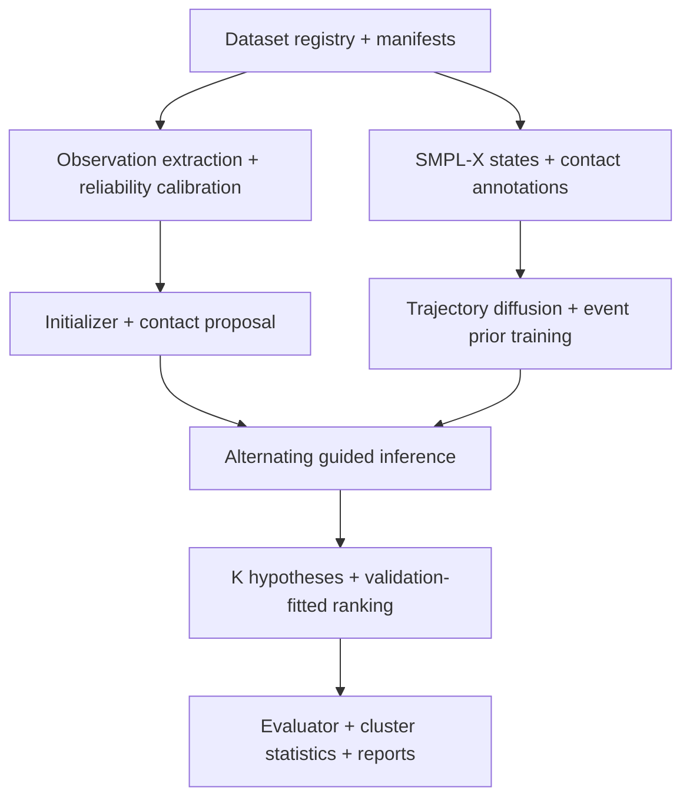

# End-to-End Implementation Blueprint

## Dynamic-contact-guided monocular 4D sign reconstruction

**Working name:** `CoSign4D`  
**Document type:** executable engineering and research specification  
**Audience:** AI coding agent, research engineer, ML scientist và reviewer nội bộ  
**Source of truth:** scientific review + revised Methods ngày 21-08-2026  
**Status:** implementation-ready skeleton; scientific constants còn thiếu phải được tác giả khóa trước final experiment.

> Mục tiêu của tài liệu này là cho phép một AI coding agent triển khai hệ thống theo từng vertical slice có kiểm thử, thay vì tự diễn giải lại paper idea. AI phải coi các acceptance gate, data contract, test và claim boundary trong tài liệu này là bắt buộc.

---

## 0. Quy ước điều hành cho AI

### 0.1 Mức độ chắc chắn

AI phải dùng đúng bốn marker sau trong issue, code comment, config và báo cáo:

- `[LOCKED]`: đã được tác giả xác nhận hoặc được kiểm chứng bằng source/code/data.
- `[PROVISIONAL DEV DEFAULT]`: chỉ dùng để chạy smoke test; không được đưa vào paper như lựa chọn khoa học.
- `[RESEARCH VALUE TO TUNE]`: phải chọn trên validation set theo search space được công bố.
- `[BLOCKING AUTHOR DECISION]`: không được chạy final training/evaluation khi còn trống.

Không tự chuyển marker thành `[LOCKED]`. Mọi thay đổi trạng thái phải được ghi trong `docs/decision_register.md` cùng người quyết định, ngày, bằng chứng và config bị ảnh hưởng.

### 0.2 Nguyên tắc triển khai

1. Không viết toàn bộ hệ thống trong một lượt. Mỗi phase phải tạo một vertical slice chạy được và có test.
2. Không bịa dataset path, SMPL-X asset, evaluator behavior, threshold, kết quả hoặc citation.
3. Không đánh dấu phase `DONE` chỉ vì code import được; phải có artifact và acceptance test tương ứng.
4. Baseline và proposed model phải dùng cùng data split, initialization, cue cache và evaluation commit.
5. Test set là read-once. Mọi threshold, calibration, loss weight, sampler và ranker phải khóa trên train/validation.
6. Không dùng `best-of-K` làm top-1 result; không dùng unnormalized energy như NLL.
7. Không gọi phương pháp “calibrated posterior” trước khi hoàn thành uncertainty protocol.
8. Không chỉnh file kết quả thủ công. Report phải được sinh từ machine-readable outputs.
9. Mọi CLI job phải ghi config resolved, Git commit, seed, environment, input manifest hash và output checksum.
10. Nếu một gate thất bại, dừng nhánh phụ thuộc; tạo `artifacts/gates/<gate_id>/failure_report.md` thay vì tiếp tục để “xem thử”.

### 0.3 Trạng thái task

Mỗi task trong implementation log chỉ có một trong các trạng thái:

`NOT_STARTED → IN_PROGRESS → READY_FOR_REVIEW → DONE`

hoặc chuyển sang `BLOCKED`/`FAILED_GATE`. `DONE` yêu cầu:

- code đã merge hoặc patch đã được duyệt;
- unit/integration tests liên quan pass;
- artifact được tạo;
- config và command tái lập được ghi;
- known limitations được cập nhật.

---

## 1. Scope, hypothesis và non-goals

### 1.1 Task

Input là clip RGB đơn nhãn quan `Y_1:T`. Output là:

1. `K` SMPL-X trajectory hypotheses `X_1:T^(k)`;
2. `K` dynamic contact-event sequences `C_1:T^(k)`;
3. score xếp hạng không dùng ground truth;
4. uncertainty/risk metadata chỉ khi protocol tương ứng được bật.

Hypothesis trung tâm:

> Khi bàn tay bị che khuất, dynamic contact-event sequence được suy luận đồng thời với holistic SMPL-X trajectory sẽ giảm hand-placement error so với holistic prior và static-contact constraint có cùng data, capacity và compute, mà không làm xấu local articulation hoặc non-contact motion vượt practical margin đã khóa.

### 1.2 Contribution boundary

Hệ thống chỉ được claim novelty tại giao của:

- sign-specific temporal trajectory;
- positive self-contact identity và onset–hold–release events;
- reliability/visibility-weighted image evidence;
- joint approximate inverse inference.

Không claim rằng self-contact, diffusion, graph, visibility hoặc multi-hypothesis tự thân là mới.

### 1.3 Non-goals cho MVP

- Không xây renderer photorealistic hoặc avatar appearance model.
- Không claim facial expression reconstruction nếu không có face supervision.
- Không tự huấn luyện foundation keypoint/segmentation model từ đầu.
- Không tối ưu semantic metric làm headline objective.
- Không xây exact normalized probabilistic model.
- Không hỗ trợ arbitrary human-object interaction ngoài admissible contact ontology đã khóa.

---

## 2. Decision register bắt buộc

Trước final experiment, AI phải tạo `docs/decision_register.md` với bảng dưới đây. Giá trị dev chỉ cho smoke test.

| ID | Quyết định | Trạng thái ban đầu | Dev default | Điều kiện khóa |
|---|---|---|---|---|
| D-01 | Tên phương pháp | `[BLOCKING AUTHOR DECISION]` | `CoSign4D` nội bộ | Kiểm tra naming collision với CoSIGN; tác giả duyệt tên public. |
| D-02 | Camera model | `[BLOCKING AUTHOR DECISION]` | weak-perspective adapter | Xác nhận từ dataset/evaluator; unit test projection. |
| D-03 | Canonical coordinate system | `[LOCKED]` sau Phase 0 | meters, right-handed, +Y up | Round-trip conversion và render sanity pass. |
| D-04 | Frame rate chuẩn | `[BLOCKING AUTHOR DECISION]` | giữ native cho smoke | Chọn theo benchmark; resampling protocol được audit. |
| D-05 | Window/stride | `[RESEARCH VALUE TO TUNE]` | smoke: 16/8 frames | Chọn validation; báo latency và boundary error. |
| D-06 | SMPL-X degrees of freedom | `[BLOCKING AUTHOR DECISION]` | body + 2 hands; face off | Xác nhận label/data coverage. |
| D-07 | Patch ontology và admissible edges | `[BLOCKING AUTHOR DECISION]` | coarse hand–hand/face/torso | Gold annotation pilot đạt gate G1. |
| D-08 | Contact threshold/duration | `[RESEARCH VALUE TO TUNE]` | không dùng cho final | Chọn từ gold subset; sensitivity analysis. |
| D-09 | Dataset versions/licenses/splits | `[BLOCKING AUTHOR DECISION]` | synthetic fixture only | Manifest và license audit hoàn tất. |
| D-10 | Cue extractors | `[BLOCKING AUTHOR DECISION]` | adapters + mock cues | Đóng băng model version và preprocessing. |
| D-11 | Diffusion parameterization/sampler | `[RESEARCH VALUE TO TUNE]` | epsilon + tiny DDIM smoke | Validation search; stability tests. |
| D-12 | `K` hypotheses và `R` alternating rounds | `[RESEARCH VALUE TO TUNE]` | smoke: K=2, R=1 | Risk–coverage/latency validation. |
| D-13 | Compute budget | `[BLOCKING AUTHOR DECISION]` | single-device smoke | GPU-hours và memory ceiling được ghi. |
| D-14 | Primary endpoint | `[BLOCKING AUTHOR DECISION]` | root-aligned hand PVE | Statistical analysis plan được ký. |
| D-15 | Smallest practical effect/regression margin | `[BLOCKING AUTHOR DECISION]` | không có default khoa học | Pilot variance + domain judgment. |

Production config phải fail validation nếu D-02, D-04, D-06, D-07, D-09, D-10, D-13, D-14 hoặc D-15 chưa khóa.

---

## 3. Kiến trúc end-to-end



### 3.1 Luồng training

1. Register datasets và khóa manifest/splits.
2. Chuẩn hóa SMPL-X/camera/coordinate system.
3. Trích và cache observations.
4. Fit reliability calibrators trên validation-calibration split.
5. Tạo gold contact subset; audit pseudo labels.
6. Train contact proposal và semi-Markov event model.
7. Train graph-conditioned trajectory diffusion.
8. Optional joint fine-tuning chỉ sau khi hai model độc lập đạt gate.
9. Fit hypothesis ranking weights trên validation outputs.

### 3.2 Luồng inference

1. Đọc clip và manifest metadata.
2. Trích/cached `O,M`.
3. Chạy initializer cố định để có `X^(0)`.
4. Dự đoán/decode `C^(0)`.
5. Với mỗi hypothesis, chạy guided reverse diffusion.
6. Cập nhật graph riêng cho hypothesis; lặp `R` rounds.
7. Tính ranking score không dùng GT.
8. Lưu top-1, tất cả K samples, graph và diagnostics.
9. Evaluator đọc artifact bất biến; không gọi lại model.

---

## 4. Repository layout

AI phải tạo hoặc ánh xạ code hiện có vào layout tương đương:

```text
project/
├── pyproject.toml
├── README.md
├── LICENSES.md
├── .pre-commit-config.yaml
├── configs/
│   ├── schema/
│   ├── data/
│   ├── model/
│   ├── inference/
│   ├── evaluation/
│   └── experiment/{smoke,baseline,ablation,full}/
├── assets/
│   └── patch_maps/
├── docs/
│   ├── decision_register.md
│   ├── coordinate_system.md
│   ├── annotation_guide.md
│   ├── metric_spec.md
│   └── implementation_log.md
├── src/cosign4d/
│   ├── cli.py
│   ├── config.py
│   ├── schemas/
│   ├── data/
│   │   ├── registry.py
│   │   ├── manifest.py
│   │   ├── datasets.py
│   │   ├── windowing.py
│   │   └── collate.py
│   ├── geometry/
│   │   ├── rotations.py
│   │   ├── coordinates.py
│   │   ├── smplx_adapter.py
│   │   ├── patches.py
│   │   ├── contact_distance.py
│   │   └── penetration.py
│   ├── observations/
│   │   ├── base.py
│   │   ├── keypoints.py
│   │   ├── masks.py
│   │   ├── tracks.py
│   │   ├── depth_order.py
│   │   ├── cache.py
│   │   └── calibration.py
│   ├── contact/
│   │   ├── ontology.py
│   │   ├── labels.py
│   │   ├── pseudo_label.py
│   │   ├── proposal.py
│   │   ├── losses.py
│   │   └── semi_markov.py
│   ├── models/
│   │   ├── state_codec.py
│   │   ├── trajectory_diffusion.py
│   │   ├── graph_conditioner.py
│   │   └── ema.py
│   ├── inference/
│   │   ├── initializer.py
│   │   ├── likelihoods.py
│   │   ├── guidance.py
│   │   ├── alternating.py
│   │   └── ranking.py
│   ├── evaluation/
│   │   ├── alignment.py
│   │   ├── geometry_metrics.py
│   │   ├── contact_metrics.py
│   │   ├── temporal_metrics.py
│   │   ├── uncertainty_metrics.py
│   │   └── runner.py
│   ├── statistics/
│   │   ├── bootstrap.py
│   │   └── multiplicity.py
│   └── reporting/
│       ├── tables.py
│       └── failure_cases.py
├── tests/
│   ├── unit/
│   ├── integration/
│   ├── regression/
│   ├── numerical/
│   └── fixtures/
├── scripts/
└── artifacts/                  # gitignored; immutable run outputs
```

### 4.1 Stack mặc định

- Python + PyTorch; exact versions khóa trong lockfile.
- `pydantic` hoặc dataclass schema cho config/data validation.
- Hydra/OmegaConf hoặc hệ config hiện có; không duy trì hai config systems.
- `pytest` cho test; formatter/linter/type checker theo convention của repository.
- Parquet cho manifests; NPZ per clip cho MVP feature cache. Chỉ chuyển sang sharding sau profiling.
- TensorBoard hoặc experiment tracker đã được dự án phê duyệt; local JSONL log luôn là bắt buộc.

AI phải ưu tiên dependency đã có trong repository. Không thêm PyTorch3D, differentiable renderer hoặc graph library trước khi viết một design note chứng minh module hiện có không đáp ứng được.

---

## 5. Data contracts và coordinate conventions

### 5.1 Manifest

Mỗi row trong `manifest.parquet`:

| Field | Type | Bắt buộc | Ý nghĩa |
|---|---|---:|---|
| `schema_version` | string | ✓ | Version của data contract. |
| `clip_id` | string | ✓ | ID ổn định, không chứa path tuyệt đối. |
| `dataset_id` | string | ✓ | Dataset + version. |
| `signer_id` | string | ✓ | Dùng cho split/bootstrap. |
| `sign_id`/`gloss_id` | string/null | ✓ | Null được phép nếu dataset không có. |
| `video_path` | string | ✓ | Path tương đối từ dataset root. |
| `fps` | float | ✓ | FPS gốc. |
| `num_frames` | int | ✓ | Số frame giải mã được. |
| `split` | enum | ✓ | `train`, `val`, `calibration`, `test`. |
| `camera_type` | enum | ✓ | Theo D-02. |
| `has_3d_gt` | bool | ✓ | Có geometry GT hay không. |
| `has_contact_gt` | bool | ✓ | Có gold contact labels hay không. |
| `license_tag` | string | ✓ | Khóa usage/release. |
| `source_hash` | string | ✓ | Hash file hoặc source metadata. |

Không tạo split bằng glob ngầm. `splits/*.txt` chứa ordered `clip_id`; manifest builder phải fail khi clip xuất hiện ở nhiều split.

### 5.2 Canonical geometry

- Đơn vị hình học: meters.
- Canonical body/world frame: right-handed; trục cụ thể ghi trong `docs/coordinate_system.md`.
- Camera adapter là nơi duy nhất chuyển canonical ↔ camera coordinates.
- Rotation trong network: 6D; rotation matrix dùng cho forward kinematics; axis-angle chỉ ở SMPL-X boundary.
- `beta` cố định theo clip trừ khi experiment nói khác.
- Mọi velocity/acceleration được tính sau khi normalize frame rate.

Required tests:

1. axis-angle → matrix → 6D → matrix round-trip;
2. canonical → camera → canonical;
3. projection của synthetic joints có expected pixels;
4. đổi unit mm/m bị phát hiện bằng schema/range check;
5. root translation toàn clip không đổi local articulation metric.

### 5.3 State tensor

Logical representation:

```python
TrajectoryState(
    root_translation: Float[B, T, 3],
    root_rotation_6d: Float[B, T, 6],
    body_rotation_6d: Float[B, T, J_body, 6],
    left_hand_rotation_6d: Float[B, T, J_hand, 6],
    right_hand_rotation_6d: Float[B, T, J_hand, 6],
    betas: Float[B, N_beta],
    frame_mask: Bool[B, T],
)
```

`StateCodec.pack()` tạo `[B,T,D]`; `unpack()` phải exact round-trip trong floating-point tolerance. Channel slices và normalization statistics được lưu trong checkpoint metadata.

### 5.4 Observation cache

`features/<clip_id>.npz` phải chứa:

- `keypoints_2d [T,J,2]`, `keypoint_score_raw [T,J]`;
- `part_mask` hoặc reference tới compressed masks;
- `tracks [T,J,2]`, `track_valid [T,J]`;
- `depth_order [T,P,P]` hoặc sparse edge list;
- `cue_valid` masks;
- extractor name/version/config hash;
- frame indices và original timestamps.

Calibrated reliability không ghi đè raw score. Lưu riêng `reliability/<calibrator_id>/<clip_id>.npz` để có thể audit calibrator.

### 5.5 Contact labels

```python
ContactLabels(
    edge_index: Int[E, 2],
    state: Int8[T, E],          # 0 off, 1 onset, 2 hold, 3 release
    confidence: Float[T, E],
    uncertain: Bool[T, E],
    source: Enum["gold", "pseudo", "oracle"],
    annotator_ids: list[str] | None,
    ontology_version: str,
)
```

Edge ordering phải theo `assets/patch_maps/<version>/edges.json`; không suy ra ordering từ dictionary iteration. Mọi checkpoint lưu `ontology_version` và từ chối inference nếu mismatch.

### 5.6 Data governance

- Signer IDs trong artifacts/reports phải là pseudonymous IDs.
- Không ghi raw frames, absolute private paths hoặc access tokens vào experiment logs.
- Không gửi video/meshes tới external API nếu license/consent chưa cho phép.
- Dataset adapter enforce allowed purposes: train-only, evaluation-only, redistribution prohibited.
- Tạo deletion/takedown map từ source clip tới mọi derived cache/checkpoint manifest.
- Public synthetic fixtures không được lấy frame từ restricted dataset.
- Report số signer/clip theo cách không tái định danh subject hiếm.

---

## 6. Phase G0 — Baseline reproduction và evaluator repair

Đây là phase đầu tiên, trước mọi model mới.

### 6.1 Inputs

- Exact evaluator source + commit/hash.
- Baseline predictions và ground truth tối thiểu cho một validation subset.
- SMPL-X vertex/joint indices và alignment convention.

Nếu evaluator chưa được cung cấp, phase ở trạng thái `BLOCKED`; AI chỉ được xây synthetic evaluator tests, không được kết luận bug đã verified.

### 6.2 Metric definitions

Root-aligned hand PVE:

\[
E_{RA}=\frac{1}{|V_h|}\sum_{v\in V_h}
\left\| (v^{pred}-p_{root}^{pred})-(v^{gt}-p_{root}^{gt}) \right\|_2.
\]

Wrist-aligned hand PVE:

\[
E_{WA}=\frac{1}{|V_h|}\sum_{v\in V_h}
\left\| (v^{pred}-p_{wrist}^{pred})-(v^{gt}-p_{wrist}^{gt}) \right\|_2.
\]

Không rotate-align bàn tay trừ khi metric spec định nghĩa một metric thứ ba. Left/right hands được tính riêng trước khi aggregate.

### 6.3 Unit tests bắt buộc

| Perturbation | Root-aligned PVE | Wrist-aligned PVE | Expected interpretation |
|---|---:|---:|---|
| Dịch toàn body + camera-consistent | ≈0 | ≈0 | Global translation invariance. |
| Chỉ dịch rigid hand | tăng đúng độ dịch | ≈0 | Placement thay đổi, articulation giữ. |
| Đổi finger articulation | tăng | tăng | Cả placement-relative geometry và local articulation đổi. |
| Rotate rigid hand quanh wrist | tăng | tăng | Hand orientation đổi; wrist position giữ. |
| Đổi body root nhưng hand không đổi | tăng | tùy local hand | Phát hiện relative placement inconsistency. |
| Hoán đổi left/right index | fail loudly | fail loudly | Index schema check. |
| mm/m mismatch | fail range check | fail range check | Không âm thầm scale. |

Tolerance của synthetic tests có thể là engineering tolerance cố định; scientific threshold không được suy ra từ tolerance này.

### 6.4 Outputs

- `docs/metric_spec.md`;
- `tests/unit/test_hand_metrics.py`;
- `artifacts/gates/G0/evaluator_diff.md`;
- old-vs-new metrics per clip;
- list bảng/kết luận cũ bị ảnh hưởng.

### 6.5 G0 acceptance

- Synthetic tests pass.
- Exact evaluator source đã được audit.
- Baseline reproduction dùng cùng inputs cho old/new evaluator.
- Không còn phép center biến placement metric thành articulation duplicate.

---

## 7. Contact ontology, annotation và pseudo-label pipeline

### 7.1 Patch-map construction

Mỗi patch asset gồm:

```text
patch_map.json       # patch_id, name, vertex_ids, face_ids, parent_region
edges.json           # admissible pairs, symmetry group, edge category
exclusions.json      # adjacent/trivial anatomical pairs
visual_preview.png   # rendered inspection
README.md            # topology + SMPL-X version + author
```

Technique:

1. Bắt đầu với coarse patches có ý nghĩa annotation: palms, fingertip groups, face/head, torso, upper/lower arms.
2. Render patch colors trên nhiều poses và viewpoints.
3. Loại các patch quá nhỏ để ổn định ở video resolution.
4. Loại anatomically adjacent pairs tạo contact thường trực/trivial.
5. Version ontology; không sửa vertex membership in-place sau khi có labels.

### 7.2 Gold annotation workflow

1. Sample clips stratified theo signer, sign, occlusion và candidate contact type.
2. Annotator A/B gán độc lập patch pair, onset, hold interval, release, uncertain.
3. UI hiển thị RGB đồng bộ; 3D/multi-view chỉ khi license/availability cho phép.
4. Không hiển thị pseudo-label mặc định để tránh anchoring bias; có thể dùng ở adjudication view.
5. Adjudicator giải quyết disagreement; lưu cả raw annotations.
6. Tính agreement theo edge category và transition tolerance.

Gold data format dùng event intervals:

```json
{
  "clip_id": "...",
  "edge_id": 12,
  "start_frame": 30,
  "hold_start_frame": 33,
  "end_frame": 51,
  "uncertain": false,
  "annotator_id": "A"
}
```

Framewise state được compile từ interval; compiler phải check overlap, invalid transition và out-of-range frames.

### 7.3 Differentiable contact observables

Implement hai chế độ:

- **Training/guidance:** differentiable soft distance giữa patch surfaces; dùng soft-min hoặc differentiable point-to-triangle primitive.
- **Evaluation/pseudo-label:** deterministic geometric distance với fixed tolerance và exact configuration hash.

Để giảm chi phí:

1. AABB/centroid culling cho non-candidate patches.
2. Chỉ tính admissible edges.
3. Cache face/vertex indices trên device.
4. Chunk theo edge nếu memory vượt budget.
5. Không dùng centroid distance làm final contact distance.

Required invariants:

- `d(A,B)=d(B,A)` trong tolerance;
- distance không âm;
- gradient finite ở near-contact synthetic cases;
- normal compatibility gần -1 cho hai bề mặt đối nhau;
- relative velocity gần 0 cho rigid co-motion;
- penetration metric tách riêng khỏi positive contact.

### 7.4 Pseudo-label state machine

Pseudo-label generator nhận fitted mesh trajectory và tạo candidate events:

```text
OFF
  └─ distance enters candidate band for n_on frames → ONSET
ONSET
  ├─ geometry + duration valid → HOLD
  └─ evidence collapses → OFF/UNCERTAIN
HOLD
  └─ distance exits release band for n_off frames → RELEASE
RELEASE
  └─ duration complete → OFF
```

Thresholds `delta_on`, `delta_off`, normal/velocity limits và minimum durations là `[RESEARCH VALUE TO TUNE]`. Chọn chúng trên gold calibration subset; report sensitivity grid. Frames gần boundary hoặc geometry disagreement được `uncertain=True`, không ép hard label.

### 7.5 Pseudo-label quality report

Bắt buộc báo trên gold subset:

- edge-level micro/macro precision, recall, F1;
- onset/release timing error;
- performance theo hand–hand, hand–face, hand–torso;
- coverage sau khi bỏ uncertain labels;
- class support;
- sensitivity theo threshold.

Không train contact proposal trên pseudo labels trước khi report này được duyệt.

### 7.6 G1 acceptance

- Patch ontology annotatable và versioned.
- Double annotation/adjudication hoàn tất trên pilot.
- Agreement và pseudo-label precision/coverage đủ theo tiêu chí D-15/D-07 đã khóa.
- Không có split leakage trong gold subset.
- Nếu G1 fail: thu hẹp ontology hoặc chuyển contact thành latent qualitative mechanism; không báo contact F1 toàn benchmark.

---

## 8. Observation extraction và reliability calibration

### 8.1 Adapter interface

```python
class ObservationExtractor(Protocol):
    name: str
    version: str

    def extract(self, frames, metadata) -> RawObservation:
        """Deterministic for fixed inputs/config; no silent fallback."""
```

Mỗi adapter phải:

- expose model/version/checkpoint hash;
- giữ mapping source joint → canonical joint;
- trả raw confidence và valid mask riêng;
- không tự interpolate missing frames;
- cache theo `video_hash + extractor_config_hash`;
- lưu runtime/error code.

### 8.2 Cue-specific implementation

**Keypoints**

- Body và hands giữ detector outputs riêng trước fusion.
- Convert về pixel coordinates có resolution metadata.
- Reject NaN/out-of-frame bằng valid mask, không clamp âm thầm.

**Masks/silhouettes**

- Lưu compressed binary/soft mask và resize transform.
- Differentiable silhouette likelihood dùng cùng camera/crop transform với keypoints.

**Tracks/flow**

- Track ID phải xuyên suốt crop changes.
- Forward–backward consistency tạo một raw reliability feature, không phải calibrated probability.

**Depth ordering**

- Biểu diễn sparse pair constraints: `(part_a, part_b, relation, score)`.
- Unknown là mask, không phải class `equal`.

### 8.3 Calibration split

Tách `calibration` khỏi hyperparameter validation nếu dataset đủ lớn. Nếu không đủ, dùng nested/cross-fitting protocol và ghi rõ limitation; tuyệt đối không fit calibrator trên test.

Với mỗi cue:

1. Xác định binary/continuous target visibility có annotation.
2. Fit temperature scaling và isotonic regression trên calibration set.
3. Chọn phương pháp bằng Brier score/NLL + reliability diagram, không chỉ ECE.
4. Khóa calibrator và hash.
5. Áp dụng cho validation/test cache mà không refit.

### 8.4 Reliability usage

Ví dụ keypoint likelihood:

\[
-\log p_{kp}=\sum_{t,j}\rho_{Huber}\left(
\frac{\|\Pi(J_j(X_t))-u_{t,j}\|_2}
{\sigma_{min}+(1-M_{t,j})\sigma_{occ}}
\right).
\]

Khi cue missing, mask hạng loss. Không dùng confidence vừa làm variance vừa nhân weight nếu chưa có ablation, vì có thể double-downweight.

### 8.5 Tests và outputs

- calibrator output trong `[0,1]`;
- monotonicity nếu dùng isotonic;
- serialization round-trip;
- same cache hash → byte-identical metadata;
- crop/projection round-trip;
- missing cue không tạo gradient/coordinate giả;
- report ECE, Brier, NLL và reliability plots.

Outputs: `artifacts/calibration/<id>/calibrator.*`, `metrics.json`, `reliability_plot.*`, `config.yaml`.

---

## 9. Contact proposal và semi-Markov decoder

### 9.1 Input features

Với mỗi admissible edge `e=(a,b)` và frame `t`, tạo edge token:

```text
patch_a embedding
patch_b embedding
relative 3D geometry: distance, normal compatibility, relative velocity
relative 2D cues: projected distance, track relation, depth order
visibility/reliability của hai patches
initializer state features
edge identity + category + time embedding
```

Tensor contract:

- patch features: `[B,T,P,Fp]`;
- edge features: `[B,T,E,Fe]`;
- valid/uncertain mask: `[B,T,E]`;
- event logits: `[B,T,E,4]`.

AI không materialize dense `P×P` graph nếu chỉ có `E_adm` sparse edges.

### 9.2 Kiến trúc MVP

1. Patch encoder chia sẻ weights giữa patches cùng type; thêm learned patch identity.
2. Edge MLP ghép `a`, `b`, absolute difference và pair features.
3. Temporal encoder theo từng edge bằng TCN hoặc Transformer.
4. Optional cross-edge block cho interactions cạnh tranh, nhưng chỉ thêm sau MVP.
5. Event head dự đoán bốn state logits.
6. Duration head dự đoán discrete duration bins hoặc duration score nếu semi-Markov decoder cần.

MVP ưu tiên temporal encoder đơn giản và có profile. Không thêm GNN chỉ vì dữ liệu được gọi là graph; edge list + shared temporal encoder có thể là baseline mạnh và dễ audit hơn.

### 9.3 Contact proposal interface

```python
class ContactProposal(nn.Module):
    def forward(
        self,
        observations: ObservationBatch,
        state: TrajectoryState,
        reliability: ReliabilityBatch,
        edge_index: Tensor,       # [E,2]
        frame_mask: Tensor,       # [B,T]
    ) -> ContactProposalOutput:
        # event_logits [B,T,E,4]
        # duration_logits optional
        # diagnostics: feature masks, entropy, invalid rates
        ...
```

### 9.4 Loss

\[
\mathcal L_{graph}=
\mathcal L_{event}
+\lambda_{dur}\mathcal L_{duration}
+\lambda_{trans}\mathcal L_{invalid-transition}
+\lambda_{geo}\mathcal L_{geometry-consistency}.
\]

Implementation rules:

- Gold labels có sample weight cao hơn pseudo labels theo config đã khóa.
- `uncertain=True` mask khỏi hard CE; có thể dùng consistency loss riêng sau ablation.
- Class weights tính từ train split duy nhất và lưu vào checkpoint.
- So sánh weighted CE, focal loss và logit adjustment trên validation; không tune theo test F1.
- Báo per-class support và entropy để phát hiện collapse về `off`.

### 9.5 Semi-Markov decoder

Allowed transition matrix mặc định:

| From \ To | off | onset | hold | release |
|---|---:|---:|---:|---:|
| off | ✓ | ✓ | ✗ | ✗ |
| onset | ✓/uncertain | ✗ | ✓ | ✗ |
| hold | ✗ | ✗ | ✓ | ✓ |
| release | ✓ | ✓/optional | ✗ | ✗ |

Final matrix là `[LOCKED]` theo annotation guide. Decoder nhận emission log-probabilities, transition scores và duration prior; trả state path + path score. Implement dynamic programming bằng log-space, có backpointer và mask theo clip length.

Required tests:

- brute-force equivalence trên sequence rất ngắn;
- không sinh invalid transition;
- padding không đổi decoded prefix;
- all-off emissions → all-off path;
- strong onset–hold–release emissions → expected path;
- deterministic tie-breaking được document;
- batch result bằng loop result.

### 9.6 Contact model acceptance

- Train loss giảm trên tiny overfit set.
- Không NaN với all-missing cues.
- Macro F1 và transition metrics báo trên gold validation.
- Oracle geometry features và image-only features được tách ablation.
- Checkpoint chứa ontology/config/calibrator hashes.

---

## 10. Graph-conditioned holistic trajectory diffusion

### 10.1 State codec

`StateCodec` chịu trách nhiệm duy nhất cho:

- pack/unpack structured SMPL-X state;
- normalization/denormalization;
- frame/part masks;
- mapping noise tensor ↔ clean state;
- forward kinematics boundary.

Không để model tự biết channel offsets bằng magic indices. Offsets được sinh từ schema và lưu trong checkpoint.

### 10.2 Backbone đề xuất

MVP dùng temporal Transformer/DiT-style backbone với part-aware tokens:

- part tokens: root, body, left hand, right hand, optional face;
- diffusion timestep embedding;
- temporal positional embedding;
- graph event tokens theo time/edge;
- reliability/missingness embedding;
- cross-attention hoặc FiLM/AdaLN để inject graph conditioning.

Output có cùng shape với packed state và dự đoán `epsilon` hoặc `v`. D-11 khóa parameterization; không trộn hai target trong cùng bảng kết quả.

### 10.3 Matched-capacity variants

Để claim graph dynamics hợp lệ, dùng cùng backbone:

- **No-graph:** learned null graph tokens; module vẫn tồn tại.
- **Static graph:** event tokens pooled hoặc giữ một state toàn window.
- **Dynamic graph:** framewise event tokens.
- **Oracle graph:** gold graph; chỉ gold subset.

Parameter count phải giống hoặc sai khác được báo. Không xóa cross-attention ở no-graph variant nếu việc đó giảm capacity.

### 10.4 Denoising training

\[
x_\tau=\sqrt{\bar\alpha_\tau}x_0+
\sqrt{1-\bar\alpha_\tau}\epsilon,
\qquad \epsilon\sim\mathcal N(0,I),
\]

\[
\mathcal L_{diff}=\mathbb E\left[
w(\tau)\|\epsilon-\epsilon_\phi(x_\tau,\tau,C,M)\|_2^2
\right].
\]

Training techniques:

1. Normalize channels từ train statistics; freeze stats cho val/test.
2. Frame mask áp dụng cả attention và loss.
3. Graph dropout tạo null/static/dynamic conditions theo config.
4. Reliability-mask augmentation mô phỏng missingness nhưng không thay calibrated evaluation.
5. Gradient clipping, mixed precision và EMA chỉ bật qua config; log overflow/skipped step.
6. Save last + validation-selected checkpoint; không chọn checkpoint bằng test metric.
7. Tiny-set overfit trước full training.
8. Log loss theo body/left-hand/right-hand channels để tránh hands bị body dimension lấn át.

### 10.5 Channel weighting

Vì số body/hand dimensions khác nhau, loss phải có explicit part weights:

\[
\mathcal L_{diff}=w_rL_{root}+w_bL_{body}+w_{lh}L_{lh}+w_{rh}L_{rh}+[w_fL_{face}].
\]

Weights là `[RESEARCH VALUE TO TUNE]`; một baseline dùng equal-per-dimension và một baseline equal-per-part. Báo cả hai nếu lựa chọn làm thay đổi kết luận.

### 10.6 Window stitching

Nếu clip dài hơn window:

1. Dùng overlapping windows với timestamps gốc.
2. Convert rotations sang representation thích hợp để blend; không average axis-angle trực tiếp.
3. Blend root translation/velocity bằng overlap weights.
4. Với graph states, decode ở clip level hoặc reconcile bằng log-probability + semi-Markov pass; không majority vote từng frame.
5. Đánh giá boundary error riêng để chọn window/stride.

### 10.7 Diffusion tests

- pack/unpack round-trip;
- noise schedule monotonic và finite;
- one-step forward shape/mask;
- tiny-set overfit;
- unconditional/null condition chạy được;
- graph permutation test chỉ thay đổi output khi edge identity mapping thay đổi hợp lệ;
- deterministic sample với fixed seed/config/device class;
- checkpoint load từ clean process;
- no leakage của GT graph vào non-oracle variants.

---

## 11. Observation likelihoods và geometry guidance

### 11.1 Interface

```python
class ObservationLikelihood(Protocol):
    name: str

    def log_prob(
        self,
        clean_state: TrajectoryState,
        observation: ObservationBatch,
        reliability: ReliabilityBatch,
    ) -> Tensor:
        """Return [B] or [B,T] log-score; higher is better."""
```

Mỗi likelihood phải có:

- differentiable implementation cho guidance;
- non-differentiable diagnostic implementation nếu cần;
- unit/scale definition;
- valid-mask behavior;
- gradient norm logging.

### 11.2 Keypoint likelihood

- Project canonical SMPL-X joints qua camera adapter.
- Robust Huber/Geman–McClure loss với reliability-dependent variance.
- Body và hands có noise scales riêng nếu calibration hỗ trợ.
- Không tối ưu crop coordinates nếu evaluator dùng full-frame coordinates mà không invert transform.

### 11.3 Silhouette likelihood

- Dùng differentiable rasterization chỉ khi camera/mask transforms đã pass tests.
- Loss có thể là soft IoU + boundary distance transform.
- Mask cue bị occluded hoặc segmentation lỗi phải có reliability gate.
- Rasterizer resolution và antialiasing khóa trong config/report.

### 11.4 Track likelihood

- Penalize projected joint/patch displacement so với reliable 2D tracks.
- Mask track gaps.
- Không tính cùng keypoint residual hai lần; track term dùng temporal displacement hoặc track-consistency information khác keypoint position.

### 11.5 Depth-order likelihood

Với reliable relation `a in front of b`, dùng margin loss trên projected/camera depth. Unknown relations bị mask. Báo violation rate như diagnostic.

### 11.6 Geometry/contact factor

\[
\log\psi_{geo}(X,C)=-E_{geo}(X,C).
\]

Tách log components:

- positive contact distance;
- normal compatibility;
- hold relative velocity;
- negative hard-edge separation;
- penetration.

Mỗi component được log riêng để phát hiện một term chi phối toàn bộ guidance.

### 11.7 Gradient stabilization

At each reverse step:

1. Tính clean estimate `D_tau(x_tau)`.
2. Tính từng guidance gradient riêng.
3. Check finite; invalid term bị disable cho sample đó và ghi diagnostic, không âm thầm zero toàn batch.
4. Normalize/clip theo per-sample RMS hoặc percentile đã khóa.
5. Áp dụng time-dependent schedule `lambda_k(tau)`.
6. Log ratio `||guidance|| / ||prior_score||`.

Reject run nếu tỷ lệ vượt safety range liên tục hoặc NaN rate vượt engineering threshold trong config.

---

## 12. Approximate alternating inference

### 12.1 Target

\[
\pi(X,C\mid O,M)\propto
p_\phi(X\mid C,M)p_\rho(C)\psi_{geo}(X,C)
\prod_k p_k(O^{(k)}\mid X,M^{(k)}).
\]

`q_eta(C|O,X,M)` chỉ là proposal/update network; không nhân lại vào target.

### 12.2 Algorithm

```python
def infer_clip(clip, cfg):
    O_raw = observation_cache.load_or_extract(clip)
    M = calibrators.apply(O_raw)
    X0 = initializer.run(clip, O_raw)

    hypotheses = []
    for k in range(cfg.num_hypotheses):
        C = semi_markov.decode(contact_proposal(O_raw, X0, M), cfg.event_prior)
        X = X0

        for r in range(cfg.alternating_rounds):
            X = guided_sampler.sample(
                init=X,
                graph=C,
                observations=O_raw,
                reliability=M,
                seed=derive_seed(cfg.seed, clip.clip_id, k, r),
            )
            proposal = contact_proposal(O_raw, X, M)
            C = semi_markov.decode(proposal, cfg.event_prior)

        score, components = ranker.score(X, C, O_raw, M)
        hypotheses.append(Hypothesis(X, C, score, components))

    return sort_without_ground_truth(hypotheses)
```

### 12.3 Posterior-score guidance

\[
\hat s=s_\phi+s_{obs}+s_{contact},
\]

\[
s_{obs}=\sum_k\lambda_k(\tau)\nabla_{x_\tau}
\log p_k(O^{(k)}\mid D_\tau(x_\tau),M^{(k)}),
\]

\[
s_{contact}=\lambda_c(\tau)\nabla_{x_\tau}
\log\psi_{geo}(D_\tau(x_\tau),C).
\]

### 12.4 Hypothesis independence

- Mỗi `k` có seed và graph riêng.
- Không average graph giữa hypotheses.
- Không chọn sample bằng GT.
- Deduplicate gần-identical samples chỉ cho storage/analysis; không thay đổi K đã sinh khi tính compute.
- Lưu initial state, graph per round và guidance diagnostics để replay failure.

### 12.5 Stopping

MVP dùng fixed `R`. Adaptive stopping chỉ thêm khi có criterion độc lập với GT, ví dụ graph path ổn định + observation score change nhỏ. Criterion và max rounds phải khóa trên validation.

### 12.6 Ranking

\[
S(X,C)=\sum_k\omega_k\log p_k(O^{(k)}\mid X,M^{(k)})
+\omega_c\log\psi_{geo}(X,C)+\omega_t\log p_\rho(C)
+[S_{rank}].
\]

Technique:

1. Bắt đầu bằng linear weighted score có components được normalize trên validation.
2. Fit weights trên validation bằng ranking objective không dùng test.
3. So sánh fixed equal weights và fitted weights.
4. Learned ranker chỉ được thêm khi validation set đủ lớn và có cross-fitting.
5. Semantic score không làm default component trước domain validation.

### 12.7 Inference artifact

Mỗi clip sinh một directory bất biến:

```text
predictions/<run_id>/<clip_id>/
├── metadata.json
├── observations_ref.json
├── initialization.npz
├── hypothesis_000.npz
├── hypothesis_000_contact.npz
├── hypothesis_000_diagnostics.json
├── ...
└── ranking.json
```

`metadata.json` chứa code/config/checkpoint/data hashes. Evaluator không được gọi model; chỉ đọc các artifact này.

---

## 13. Training curriculum và experiment control

### 13.1 Stage A — Contact geometry/proposal

Inputs: self-contact/interaction data + gold/pseudo sign labels.  
Train: patch encoder, edge temporal encoder, event/duration heads.  
Exit: contact model acceptance tại §9.6.

### 13.2 Stage B — Sign trajectory prior

Inputs: sign trajectories, frame masks, contact conditions theo availability.  
Train: state codec + diffusion backbone; graph dropout.  
Exit: tiny overfit, validation denoising, sample plausibility và baseline evaluation.

### 13.3 Stage C — Sign contact adaptation

Fine-tune contact proposal với gold + filtered pseudo labels. Pseudo-label sampling ratio là explicit config; không dựa vào dataset size/batch accident.

### 13.4 Stage D — Optional joint fine-tuning

Chỉ mở khi A–C pass. Freeze/unfreeze schedule phải có ablation. Nếu joint training destabilize geometry/contact metrics, giữ modules riêng và dùng alternating inference.

### 13.5 Experiment identity

`run_id` được sinh từ:

```text
experiment_name + resolved_config_hash + git_commit + data_manifest_hash + seed
```

Run directory:

```text
artifacts/runs/<run_id>/
├── resolved_config.yaml
├── environment.json
├── data_manifest_ref.json
├── checkpoints/
├── logs/train.jsonl
├── metrics/validation.json
├── samples/
└── status.json
```

Không overwrite completed run. Resume phải tạo resume record và giữ checkpoint ancestry.

### 13.6 Smoke config

Smoke config chỉ kiểm tra plumbing, không dùng cho paper:

```yaml
mode: smoke
data:
  source: synthetic_fixture
  window_frames: 16
  stride_frames: 8
model:
  hidden_dim: 64
  layers: 2
training:
  batch_size: 2
  max_steps: 5
inference:
  diffusion_steps: 4
  num_hypotheses: 2
  alternating_rounds: 1
evaluation:
  allow_test_split: false
```

Production config schema phải từ chối `source=synthetic_fixture` và các unresolved decisions.

### 13.7 Profiling và compute controls

Trước full training, profile ba workload riêng:

1. observation extraction throughput;
2. contact geometry/proposal training step;
3. diffusion inference theo `T`, reverse steps, `K`, `R`.

Ghi peak VRAM, host RAM, samples/second, wall time và cache hit rate. Chỉ sau profile mới quyết định gradient accumulation, edge chunking, activation checkpointing hoặc sharded cache. Mỗi optimization phải có regression test xác nhận output/tolerance và không làm baseline/proposed dùng compute khác ngoài factor được công bố.

---

## 14. CLI orchestration

Một CLI thống nhất là bắt buộc. Tên command có thể đổi theo repository, nhưng semantics phải giữ.

| Command | Input | Output | Idempotency |
|---|---|---|---|
| `audit-env` | config | environment report | Có |
| `build-manifest` | dataset roots + split spec | manifest.parquet + hashes | Có |
| `validate-data` | manifest | integrity report | Có |
| `build-patch-map` | SMPL-X assets + ontology spec | versioned patch assets | Có |
| `extract-observations` | manifest + extractor config | raw cue cache | Có theo hash |
| `fit-calibrators` | calibration split | calibrators + report | Có theo hash |
| `compile-annotations` | raw annotations | gold labels + agreement | Có |
| `generate-pseudo-contact` | fitted meshes | pseudo labels + diagnostics | Có |
| `audit-pseudo-contact` | gold + pseudo | quality report | Có |
| `train-contact` | config | checkpoint + val metrics | Resume-aware |
| `train-diffusion` | config | checkpoint + val metrics | Resume-aware |
| `run-inference` | checkpoint/config/manifest | immutable predictions | Có theo run id |
| `evaluate` | predictions + GT manifest | per-clip metrics | Có |
| `bootstrap` | per-clip metrics | CI/statistical report | Seeded |
| `make-report` | machine-readable metrics | tables/figures/failures | Có |

Mọi command hỗ trợ `--dry-run` để resolve paths/config/split mà không chạy compute nặng. Dry run phải phát hiện missing asset, split leakage, ontology mismatch và test-set access violation.

---

## 15. Evaluation và statistics implementation

### 15.1 Output schema

Evaluator tạo `per_clip_metrics.parquet`, một row cho mỗi `run_id × clip_id × hypothesis_mode`:

- identifiers: dataset, signer, sign, split;
- top-1/oracle/expected flag;
- root-aligned hand PVE left/right;
- wrist-aligned hand PVE left/right;
- body metrics;
- contact event metrics nếu có GT;
- penetration metrics;
- temporal metrics;
- visibility/contact strata;
- ranking/uncertainty fields;
- failure flags.

Aggregate report chỉ được sinh từ file này.

### 15.2 Geometry metrics

- Root-aligned hand PVE là primary candidate.
- Wrist-aligned PVE tách local articulation/orientation.
- Body MPJPE/PVE giữ alignment protocol trong column name.
- Không đặt PA và non-PA values dưới cùng tên metric.
- Units lưu trong metadata và column suffix nếu cần.

### 15.3 Contact-event metrics

Chỉ gold subset:

- edge macro/micro precision, recall, F1;
- segmental/event F1;
- onset/release timing error với tolerance đã khóa;
- interval IoU;
- edge-category breakdown;
- support và uncertain exclusions.

### 15.4 Temporal metrics

- velocity/acceleration/jerk error so với GT;
- spectral distance;
- motion amplitude ratio;
- high-frequency energy ratio;
- contact-transition timing.

Không diễn giải raw jerk thấp là tốt nếu GT jerk không giảm tương ứng.

### 15.5 Multi-hypothesis/uncertainty

Tách:

- `top1`: ranker không dùng GT;
- `oracle_k`: best-of-K, upper bound;
- `expected`: chỉ nếu sample weights có định nghĩa hợp lệ.

Báo risk–coverage, area under risk–coverage, empirical coverage–width và error–uncertainty rank correlation. AUSE là bổ sung, không thay calibration.

### 15.6 Cluster bootstrap

Algorithm:

1. Aggregate frame → clip trước.
2. Sample signer clusters với replacement.
3. Trong signer, sample sign/clip theo hierarchical plan đã khóa.
4. Recompute paired method difference.
5. Lặp số lần trong statistical config với seed cố định.
6. Báo point estimate, 95% CI, cluster count và effective sample size.

Không bootstrap frame độc lập. So sánh methods theo paired clip IDs; fail nếu prediction coverage khác mà không có missingness analysis.

### 15.7 Multiplicity

Một primary endpoint. Secondary inferential tests dùng Holm/FDR theo preregistered family. Exploratory plots không được viết như confirmatory claim.

### 15.8 Required report tables

1. Main top-1 table.
2. Placement vs articulation table.
3. Contact+occluded strata table.
4. Matched baseline/ablation table B0–B7.
5. Top-1 vs oracle-K table.
6. Reliability/calibration table.
7. Compute/latency/parameter table.
8. Failure-case taxonomy.

---

## 16. Testing, CI và numerical safety

### 16.1 Unit tests

- config schema và unresolved decision guard;
- manifest uniqueness/split leakage;
- rotation and coordinate conversions;
- state codec round-trip;
- camera projection/crop transforms;
- patch/edge ordering;
- contact distance symmetry/gradients;
- pseudo-label state machine;
- semi-Markov brute-force equivalence;
- reliability calibration serialization;
- masked loss behavior;
- evaluator perturbation suite;
- top-1 ranking không truy cập GT fields.

### 16.2 Integration tests

1. Synthetic 16-frame clip đi qua extraction → initialization → proposal → tiny diffusion → inference → evaluation.
2. One batch/one optimizer step cho contact và diffusion models.
3. Save/load checkpoint rồi tái tạo output shape/hash metadata.
4. Một real clip đã được cấp phép chạy full preprocessing.
5. Prediction artifact được evaluator đọc trong process độc lập.

### 16.3 Numerical tests

- finite outputs/gradients;
- gradcheck cho contact distance trên tiny mesh;
- no-NaN với all-missing cue;
- rotation orthogonality/determinant;
- guidance norm/clipping behavior;
- mixed-precision vs full-precision sanity;
- deterministic seeded smoke run.

### 16.4 Regression tests

- baseline evaluator outputs trên frozen synthetic fixture;
- manifest/config hash stability;
- patch ontology version mismatch fail;
- old-vs-new evaluator comparison;
- no-graph/static/dynamic variants giữ parameter/config invariants.

### 16.5 CI tiers

| Tier | Khi chạy | Nội dung | Budget |
|---|---|---|---|
| Fast | mỗi patch/PR | lint, unit, schema | CPU minutes |
| Medium | merge/main | integration + tiny training | CPU/small GPU |
| Nightly | định kỳ | numerical, deterministic, real clip | GPU constrained |
| Release | trước experiment freeze | full smoke matrix + evaluator | approved budget |

Không tải private dataset trong public CI. Dùng synthetic fixtures có license rõ.

---

## 17. Execution phases và go/no-go gates

### Mandatory baseline matrix

| ID | Trajectory prior | Contact representation | Visibility/reliability | Vai trò |
|---|---|---|---|---|
| B0 | DexAvatar/current optimization | penetration only | current detector confidence | Anchor reproduction |
| B1 | Holistic pose/trajectory prior | none | fixed weights | Tách gain của holistic prior |
| B2 | PAPoseDiff/DPoser-X-style prior | static geometric contact | fixed weights | Closest static-contact baseline |
| B3 | Matched trajectory diffusion | none/null graph | calibrated | No-graph control |
| B4 | Matched trajectory diffusion | static graph | calibrated | Test dynamic events |
| B5 | Matched trajectory diffusion | dynamic graph | constant cue weights | Test visibility mechanism |
| B6 | Matched trajectory diffusion | dynamic graph | calibrated | Full proposed system |
| B7 | Same as B6 | oracle graph | calibrated | Mechanism upper bound; gold subset only |

All variants dùng cùng split, initialization, state codec, sampler budget và evaluator. B3–B7 dùng **single-pass inference** trong structural comparison để không trộn architecture gain với alternating-update gain. Nếu prior/code B2 không khả dụng, reimplementation phải được gắn rõ và không được gọi là exact reproduction.

Inference ablations trên cấu hình B6:

| ID | Graph update | K | Mục đích |
|---|---|---:|---|
| A-INF0 | initialize once; không alternating update | 1 | Single-pass control |
| A-INF1 | alternating trajectory ↔ graph | 1 | Test alternating mechanism |
| A-K | same as A-INF1 | `K>1` | Test multi-hypothesis/ranker utility |

### Phase 0 — Governance và environment

**Tasks:** audit repo, dependency/license, decision register, config schema, synthetic fixture, CI.  
**Artifacts:** environment report, repo map, decision register.  
**Exit:** smoke test skeleton pass; production config chặn unresolved decisions.

### Phase 1 — G0 evaluator

**Tasks:** audit evaluator, implement metrics/tests, rerun baseline.  
**Exit:** G0 tại §6.5.  
**Stop:** không có evaluator source → chỉ synthetic test, không claim verified bug.

### Phase 2 — Data/observation foundation

**Tasks:** manifests, coordinate adapters, observation cache, calibrators.  
**Exit:** no leakage, cache reproducible, calibration report pass review.

### Phase 3 — G1 contact feasibility

**Tasks:** patch ontology, annotation pilot, pseudo-label pipeline/audit.  
**Exit:** G1 tại §7.6.  
**Stop/fallback:** ontology quá chi tiết hoặc agreement thấp → coarsen patches; vẫn fail → bỏ contact metric claim.

### Phase 4 — Static-contact baselines

**Tasks:** B0/B1/B2, penetration/positive contact separation, root/wrist metrics.  
**Exit:** baseline reproduction và compute-matched report.  
**Decision:** static contact không giúp → kiểm tra label/metric trước khi xây dynamic model.

### Phase 5 — Dynamic contact proposal

**Tasks:** train proposal + semi-Markov; so sánh framewise classifier, static graph và dynamic event decoder trên gold validation.  
**Exit:** event representation cải thiện contact segment/timing metrics mà không chỉ tăng framewise micro-F1.

### Phase 6 — Trajectory diffusion

**Tasks:** state codec, no-graph/static/dynamic backbone, training stages B/C; chạy B3–B6 bằng single-pass inference.  
**Exit:** stable samples; B6 hơn B4 cho dynamic-graph effect và hơn B5 cho calibrated-visibility effect; không regression quá margin ở articulation/non-contact.

### Phase 7 — Alternating inference

**Tasks:** likelihood modules, guided sampler, graph update, A-INF0/A-INF1/A-K, B7 oracle mechanism bound.  
**Exit:** alternating gain tách khỏi architecture gain; top-1, oracle-K và risk–coverage được tách đúng.

### Phase 8 — Final evaluation

**Tasks:** freeze configs, one-time test run, cluster bootstrap, multiplicity, failure analysis.  
**Exit:** immutable per-clip metrics, tables, confidence intervals và compute report.

### Phase 9 — Claim/paper package

**Tasks:** map evidence → claims, release configs/code/data documentation theo license.  
**Exit:** không có claim vượt claim ladder; mọi table truy được run IDs.

### Gate summary

| Gate | Câu hỏi | Pass requirement | Nếu fail |
|---|---|---|---|
| G0 | Metric có đo hand placement đúng không? | Source-audited + perturbation tests | Dừng model claim; sửa evaluator. |
| G1 | Contact labels có audit được không? | Gold agreement + pseudo quality | Coarsen/thu hẹp contact claim. |
| G2 | Static contact có tạo signal không? | B2 hơn relevant baseline theo CI/practical effect | Sửa data/metric hoặc dừng contact direction. |
| G3 | Dynamic event graph có hơn static graph? | B6 hơn B4; B6 hơn B5 cho visibility effect; matched capacity/single pass | Không claim temporal graph hoặc visibility mechanism tương ứng. |
| G4 | Alternating inference có hơn single pass? | A-INF1 hơn A-INF0 trên cùng B6/K=1 | Giữ single-pass method. |
| G5 | Multi-hypothesis hữu ích khi deploy? | A-K top-1/risk–coverage hơn K=1, không chỉ oracle | Không claim uncertainty utility. |

Scientific pass thresholds lấy từ D-15/pilot, không hard-code trong tài liệu này.

---

## 18. AI execution protocol

### 18.1 Trước mỗi phase

AI phải:

1. đọc `decision_register.md`, phase inputs và gate;
2. inspect repository, không giả định file/module chưa thấy;
3. liệt kê files sẽ sửa và artifacts sẽ sinh;
4. xác nhận không truy cập test split;
5. tạo plan nhỏ 3–7 tasks;
6. triển khai vertical slice nhỏ nhất.

### 18.2 Sau mỗi task

AI phải trả:

```text
Outcome:
- What changed
- Files changed
- Tests run and exact result
- Artifacts created
- Decisions still provisional
- New blockers/risks
- Next task
```

Không dùng “should work”, “likely pass” hoặc tự ước lượng metric. Nếu không chạy được test, ghi `NOT RUN` và lý do.

### 18.3 Implementation log

Mỗi entry trong `docs/implementation_log.md`:

```markdown
## YYYY-MM-DD — TASK-ID
- Status:
- Scope:
- Git commit:
- Resolved config hash:
- Input artifact hashes:
- Code/files changed:
- Tests:
- Outputs:
- Deviations from blueprint:
- Reviewer decision:
```

### 18.4 Blocker behavior

Nếu thiếu external asset/quyền/license/author decision:

- dừng operation phụ thuộc;
- không tìm cách vượt quyền;
- tạo blocker với exact required input;
- tiếp tục module độc lập bằng synthetic fixture nếu không làm thay đổi claim;
- không thay real dataset bằng dữ liệu khác mà vẫn giữ tên experiment.

### 18.5 Prompt để giao cho AI coding agent

```text
Bạn là research implementation agent. Hãy triển khai đúng phase được chỉ định
trong 04_end_to_end_implementation_blueprint.md.

Quy tắc:
1. Đọc blueprint, decision register và code hiện có trước khi sửa.
2. Chỉ thực hiện phase/task được giao; không nhảy sang downstream phase.
3. Không tự khóa [BLOCKING AUTHOR DECISION] hoặc bịa dataset/hyperparameter/result.
4. Tạo vertical slice nhỏ nhất, tests và artifact theo acceptance criteria.
5. Baseline/proposed phải dùng cùng input/config/evaluator trừ factor đang ablate.
6. Không đọc test split trong development.
7. Sau khi làm, cập nhật implementation log và trả outcome theo §18.2.
8. Nếu gate fail, dừng và viết failure report; không tối ưu tiếp để che failure.

Phase hiện tại: {{PHASE_ID}}
Task hiện tại: {{TASK_ID}}
Repository: {{REPO_PATH}}
Author-locked decisions: {{DECISION_IDS}}
Available assets: {{ASSET_LIST}}
Compute budget: {{BUDGET}}
```

---

## 19. Risk register và fallback implementations

| Risk | Detection | Primary mitigation | Fallback không overclaim |
|---|---|---|---|
| Evaluator source thiếu/sai | G0 blocked/tests fail | Yêu cầu exact file/commit | Chỉ phát hành synthetic metric audit. |
| Contact annotation agreement thấp | G1 report | Coarsen ontology, tăng guide/adjudication | Static broad contact/no-contact hoặc bỏ graph metric. |
| Pseudo labels noisy | Gold audit | Uncertain mask, threshold tuning, gold weighting | Train proposal chỉ gold/synthetic; giảm claim. |
| Dataset leakage | Manifest audit | signer/sign split + hash duplicate check | Loại contaminated clips, rerun. |
| Diffusion hands bị body lấn át | per-part loss/samples | part weights/tokens | Hand-focused refiner với honest scope. |
| Guidance diverges | NaN/norm logs | schedule, RMS clipping, smaller steps | Single-pass/contact refinement. |
| Dynamic graph không hơn static | B3/B4 | debug event labels/duration | Paper claim static contact only. |
| Joint fine-tuning unstable | val regressions | freeze modules/alternating inference | Không joint-train. |
| K chỉ giúp oracle | top-1 vs oracle | validation ranker, diversity analysis | Không claim deployable uncertainty. |
| Semantic metric lệch domain | human correlation thấp | standardized renders/domain validation | Bỏ semantic headline. |
| Closest-prior code không khả dụng | reproduction audit | official implementation/contact authors | Reimplementation được gắn rõ, không gọi exact baseline. |
| Compute thiếu | budget monitor | profiling, smaller matched models | Làm G0–G3 mechanism paper trước. |

---

## 20. Reproducibility package

Final release/internal archive tối thiểu:

- source commit/tag;
- locked environment;
- decision register;
- dataset manifests và license notes;
- split files + hashes;
- SMPL-X version và patch assets;
- observation extractor/calibrator configs;
- annotation guide, raw agreement và adjudication summary;
- pseudo-label audit;
- model configs/checkpoints;
- inference run metadata;
- evaluator source + tests;
- per-clip metrics;
- bootstrap/statistics config;
- generated tables/figures;
- failure cases và known limitations.

Không phát hành restricted assets; cung cấp acquisition instructions/checksums theo license.

---

## 21. Definition of Done toàn dự án

### Engineering

- [ ] Clean environment chạy được smoke pipeline end-to-end.
- [ ] Production config không còn unresolved blocking decisions.
- [ ] Data/coordinate/ontology schemas versioned.
- [ ] Unit, integration, numerical và regression suites pass.
- [ ] Model/checkpoint/inference artifacts có full provenance.
- [ ] Không có manual-edited result tables.

### Scientific

- [ ] G0 evaluator được source-audit.
- [ ] G1 contact annotation/pseudo labels được audit.
- [ ] B0–B7 hoặc justified subset chạy matched data/capacity/compute.
- [ ] Primary endpoint và practical margin khóa trước test.
- [ ] Test được chạy một lần sau freeze.
- [ ] Clip/signer-level confidence intervals được báo.
- [ ] Top-1 và oracle-K tách riêng.
- [ ] Placement/articulation/non-contact regressions được tách riêng.
- [ ] Failure/falsification outcomes được báo kể cả khi negative.

### Claim safety

- [ ] Không dùng “first/SOTA/calibrated posterior” nếu evidence chưa đủ.
- [ ] Không gọi DPoser-X temporal model.
- [ ] PAPoseDiff/Goliath-SC và closest priors xuất hiện trong baseline/positioning.
- [ ] Award/status claims có nguồn chính thức hoặc bị bỏ.
- [ ] Method name đã xử lý collision với CoSIGN.

---

## 22. Evidence-dependent claim ladder

| Highest gate passed | Claim tối đa |
|---|---|
| G0 | Corrected hand-placement evaluation protocol. |
| G1 + G2 | Contact-aware refinement improves hand placement trên phạm vi đã đánh giá. |
| G3 | Temporal contact events hơn matched static-contact model dưới contact/occlusion. |
| G4 | Alternating geometry–contact updates tạo additional gain. |
| G5 | Multiple hypotheses cải thiện risk-aware selection. |
| Chưa có normalized/calibrated model | Không claim calibrated posterior hoặc exact NLL. |

Nếu gate cao hơn fail, paper phải lùi về claim của gate cao nhất đã pass; không giữ abstract/title cũ.

---

## 23. Mandatory reading/positioning trước experiment freeze

- [DexAvatar](https://openaccess.thecvf.com/content/WACV2026/html/Kundu_DexAvatar_3D_Sign_Language_Reconstruction_with_Hand_and_Body_Pose_WACV_2026_paper.html)
- [PAPoseDiff / Goliath-SC](https://arxiv.org/html/2509.23393v1)
- [TUCH](https://arxiv.org/abs/2104.03176)
- [DPoser-X](https://arxiv.org/html/2508.00599v2)
- [ScoreHMR](https://openaccess.thecvf.com/content/CVPR2024/papers/Stathopoulos_Score-Guided_Diffusion_for_3D_Human_Recovery_CVPR_2024_paper.pdf)
- [HandX](https://arxiv.org/html/2603.28766v1)
- [Visibility-Aware HOI Tracking](https://openaccess.thecvf.com/content/CVPR2023/papers/Xie_Visibility_Aware_Human-Object_Interaction_Tracking_From_Single_RGB_Camera_CVPR_2023_paper.pdf)
- [GraphiContact](https://arxiv.org/html/2603.20310v1)
- [HACO](https://arxiv.org/html/2505.11152v2)
- [Decaf](https://dl.acm.org/doi/10.1145/3618329) và [DICE](https://arxiv.org/abs/2406.17988)

AI không cần tái làm literature review ở mỗi task, nhưng phải kiểm tra source/status lại trước paper freeze nếu thời gian đã trôi qua hoặc claim thay đổi.

---

## 24. Next concrete action

Thứ tự hành động ngay sau khi nhận tài liệu này:

1. Tạo `docs/decision_register.md` từ §2.
2. Yêu cầu exact evaluator source/commit; đồng thời dựng synthetic evaluator fixtures.
3. Audit repository và map code hiện có vào §4; không rewrite phần đã hoạt động.
4. Tạo config schema với smoke/production separation.
5. Chạy Phase 0 smoke skeleton.
6. Chỉ sau G0 mới bắt đầu contact ontology/data pilot.

**Blocker quan trọng nhất hiện tại:** evaluator source chưa có trong bộ artifact đã review.  
**Quyết định khoa học quan trọng nhất:** dataset/split/contact ontology và primary endpoint phải được tác giả khóa trước full implementation.

---

## 25. Initial executable backlog

AI tạo issue/task theo thứ tự phụ thuộc dưới đây. Không mở downstream task khi dependency/gate chưa pass.

| Task ID | Owner | Dependency | Việc phải làm | Artifact/DoD |
|---|---|---|---|---|
| P0-001 | AI | none | Audit repository, dependencies, existing evaluator/model/data code | `repo_audit.md`; không sửa code |
| P0-002 | Human + AI | P0-001 | Tạo và điền decision register | Blocking decisions có owner/status |
| P0-003 | AI | P0-001 | Xây strict config schema + smoke/production modes | Schema tests pass |
| P0-004 | AI | P0-003 | Tạo licensed synthetic clip/mesh/contact fixture | Fixture manifest + checksum |
| P0-005 | AI | P0-003/004 | Thiết lập fast/medium CI skeleton | CI chạy smoke import/schema |
| G0-001 | Human | none | Cung cấp exact evaluator + commit + old result reference | File/hash được ghi |
| G0-002 | AI | G0-001/P0-004 | Audit evaluator và viết perturbation tests | `test_hand_metrics.py` pass |
| G0-003 | AI | G0-002 | Rerun baseline bằng old/new metrics | per-clip diff + G0 report |
| D1-001 | AI | P0-002 | Dataset registry + manifest/split validator | No-leakage tests pass |
| D1-002 | AI | D1-001 | Coordinate/camera adapters | Round-trip/projection tests pass |
| D1-003 | AI | D1-002 | SMPL-X adapter + state codec | Pack/unpack/FK tests pass |
| D1-004 | AI | D1-001/002 | Observation extractor adapters + cache | One synthetic + one approved real clip |
| D1-005 | AI | D1-004 | Reliability calibrator pipeline | Calibration artifact/report |
| G1-001 | Human + AI | D1-003 | Draft coarse patch ontology, preview và admissible edges | Versioned patch asset |
| G1-002 | AI | G1-001 | Annotation schema/compiler/validator | Interval→state tests pass |
| G1-003 | Human | G1-002 | Double-annotated pilot + adjudication | Raw/gold pilot labels |
| G1-004 | AI | G1-001/D1-003 | Differentiable geometry + pseudo-label generator | Geometry/state-machine tests |
| G1-005 | AI | G1-003/004 | Gold agreement + pseudo quality audit | G1 report/pass or failure |
| C1-001 | AI | G1 pass/D1-004 | Edge feature builder + contact proposal | Shape/mask/tiny-overfit tests |
| C1-002 | AI | C1-001 | Semi-Markov decoder | Brute-force equivalence tests |
| C1-003 | AI | C1-001/002 | Train/evaluate contact model | Gold validation metrics/report |
| B1-001 | AI | G0/D1-003 | B0/B1 reproduction harness | Same inputs/evaluator hashes |
| B1-002 | AI | G1/B1-001 | Static contact B2 | G2 paired report |
| M2-001 | AI | D1-003 | State normalization + diffusion codec | Round-trip/noise tests |
| M2-002 | AI | M2-001/C1-003 | Backbone + graph conditioner/null/static/dynamic modes | Matched parameter report |
| M2-003 | AI | M2-002 | Stage-B diffusion training | Tiny overfit + val checkpoint |
| M2-004 | AI | M2-003 | B3–B6 single-pass experiment harness | G3 structural report |
| I1-001 | AI | D1-004/M2-003 | Differentiable observation likelihoods | Unit/gradient tests |
| I1-002 | AI | I1-001/G1-004 | Guided sampler + diagnostics | Finite/stability smoke tests |
| I1-003 | AI | I1-002/C1-002 | Alternating inference A-INF0/A-INF1 | G4 paired report |
| I1-004 | AI | I1-003 | K-hypothesis generation + validation ranker | A-K top-1/oracle separation |
| E1-001 | AI | G0/I1-004 | Immutable prediction/evaluation runner | `per_clip_metrics.parquet` |
| E1-002 | AI | E1-001 | Hierarchical cluster bootstrap + multiplicity | Statistical report |
| E1-003 | AI | E1-002 | Tables, calibration plots, failure taxonomy | Generated report package |
| R1-001 | Human + AI | E1-003 | Claim-evidence review và test freeze sign-off | Claim ladder + release checklist |

Mỗi task được phép chia nhỏ, nhưng ID gốc phải giữ trong implementation log để truy vết dependency.
