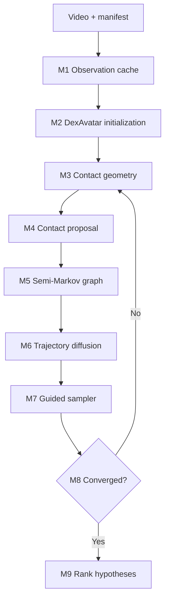

# DCG-Sign4D — Official Method Freeze và End-to-End Implementation Specification

> **Tên đầy đủ:** Dynamic-Contact-Guided Monocular 4D Sign Reconstruction  
> **Tên mã triển khai:** `DCG-Sign4D`  
> **Phiên bản:** Method Freeze v1.0  
> **Ngày khóa:** 2026-08-22  
> **Trạng thái:** phương pháp chính thức để triển khai; thay thế các bản mô tả còn nhiều nhánh lựa chọn trước đó.  
> **Mục tiêu tài liệu:** một AI coding agent có thể bám theo từng module, interface, phase và acceptance gate để xây hệ thống mà không tự diễn giải lại research scope.

---

## 0. Tuyên bố chốt method

DCG-Sign4D nhận một video RGB monocular và đồng thời phục hồi:

1. trajectory SMPL-X toàn thân, hai tay và tùy chọn khuôn mặt;
2. chuỗi contact events động giữa các surface patches;
3. nhiều giả thuyết reconstruction có ranking không dùng ground truth.

Ý tưởng trung tâm là **pose và contact phải được suy luận luân phiên**:

- pose hiện tại giúp xác định bộ phận nào có khả năng tiếp xúc;
- contact event giúp sửa depth và placement của tay khi quan sát 2D bị che hoặc không đáng tin cậy;
- quá trình lặp lại cho tới khi trajectory và contact graph nhất quán hoặc đạt số vòng cố định.

Method chính thức chỉ có một runtime path:

```text
RGB video
→ calibrated observations
→ DexAvatar SMPL-X initialization
→ shape-aware contact geometry
→ dynamic contact proposal
→ semi-Markov event decoding
→ graph-conditioned trajectory diffusion
→ observation/contact-guided sampling
→ alternating geometry–contact inference
→ K hypotheses + ranking
→ final trajectory + contact events
```

Không đưa các model tùy chọn như DICE, VisTracker, GraphiContact hoặc ProsePose vào runtime chính thức.

---

## 1. Problem formulation

### 1.1 Input

Một clip RGB monocular:

\[
Y_{1:T}=\{Y_t\}_{t=1}^{T},
\qquad
Y_t\in\mathbb{R}^{H\times W\times 3}.
\]

Manifest đầu vào tối thiểu phải có:

```yaml
clip_id: signer001_clip0001
video_path: data/raw/signer001/clip0001.mp4
fps_native: 30.0
frame_count: 180
width: 1920
height: 1080
signer_id: signer001
split: train
camera_id: cam0
dataset_name: author_dataset
dataset_version: AUTHOR_REQUIRED
license_id: AUTHOR_REQUIRED
```

### 1.2 Output

Hệ thống trả về `K` giả thuyết:

\[
\mathcal{H}=
\left\{
(X_{1:T}^{(k)},C_{1:T}^{(k)},S^{(k)})
\right\}_{k=1}^{K}.
\]

Mỗi trajectory:

\[
X_t=
(R_t^{root},p_t^{root},\theta_t^{body},
\theta_t^{lh},\theta_t^{rh},[\theta_t^{face}]),
\]

với:

- `beta`: body shape dùng chung cho toàn clip;
- `camera_t`: camera parameters theo protocol đã khóa;
- rotation bên trong network dùng 6D representation;
- rotation matrix được tạo trước forward kinematics;
- mọi translation dùng mét trong hệ tọa độ canonical.

Mỗi contact graph:

\[
C_t=(V,\{z_{e,t}\}_{e\in E_{adm}}),
\]

trong đó:

\[
z_{e,t}\in
\{\texttt{off},\texttt{onset},\texttt{hold},\texttt{release}\}.
\]

### 1.3 Unnormalized target

Method sử dụng target:

\[
\boxed{
\pi(X,C\mid O,M)
\propto
p_\phi(X\mid C,M,\beta)
p_\rho(C)
\psi_{geo}(X,C,\beta)
\prod_q p_q(O^{(q)}\mid X,M^{(q)})
}
\]

Trong đó:

- `p_phi`: graph-conditioned trajectory diffusion prior;
- `p_rho`: semi-Markov contact-event prior;
- `psi_geo`: positive contact, negative separation và penetration factor;
- `p_q`: observation likelihood cho keypoint, mask, track và depth;
- `M`: calibrated reliability.

Đây là unnormalized target. Không báo exact NLL và không gọi output là calibrated posterior nếu chưa có calibration protocol tương ứng.

---

## 2. Method provenance và codebase policy

### 2.1 Ba codebase nền bắt buộc

| Codebase | Vai trò | Chính sách tích hợp | GitHub chính thức |
|---|---|---|---|
| DexAvatar | preprocessing, SMPL-X initialization, sign-specific body/hand fitting | fork hoặc vendor ở commit cố định | [kaustesseract/DexAvatar](https://github.com/kaustesseract/DexAvatar) |
| TUCH/selfcontact | surface segmentation, positive contact và penetration geometry | import utilities đã audit; không dùng toàn bộ TUCH regressor | [muelea/tuch](https://github.com/muelea/tuch), [muelea/selfcontact](https://github.com/muelea/selfcontact) |
| DPoser-X | whole-body diffusion infrastructure | dùng làm diffusion backbone chính rồi mở rộng sang trajectory/contact conditioning | [moonbow721/DPoser-X](https://github.com/moonbow721/DPoser-X) |

### 2.2 Kỹ thuật được chuyển thể, không import toàn bộ model

| Paper | Kỹ thuật được apply | Không apply | Code/project |
|---|---|---|---|
| HACO | balanced contact sampling; class/spatial-frequency-balanced loss | không dùng nguyên dense-contact backbone | [dqj5182/HACO_RELEASE](https://github.com/dqj5182/HACO_RELEASE) |
| PAPoseDiff / Goliath-SC | body-shape conditioning; part-aware hand/body/face interaction | không chạy PAPoseDiff model riêng; chưa phụ thuộc code chưa public | [Project page](https://tkhkaeio.github.io/projects/25-scgen/), [paper](https://arxiv.org/abs/2509.23393) |
| Neural Sign Actors | SMPL-X low-dimensional sign trajectory representation; anatomical temporal encoding | không dùng text-to-sign generation model | [repository hiện có nhưng chưa đủ full reproduction](https://github.com/baltatzisv/neural-sign-actors), [paper](https://openaccess.thecvf.com/content/CVPR2024/html/Baltatzis_Neural_Sign_Actors_A_Diffusion_Model_for_3D_Sign_Language_CVPR_2024_paper.html) |
| Semi-Markov CRF | segment duration; segment score; dynamic-programming decode | không dùng NLP features/dataset | [paper](https://proceedings.neurips.cc/paper/2004/hash/eb06b9db06012a7a4179b8f3cb5384d3-Abstract.html) |
| HandX | contact-event representation; duration/frequency metrics | không dùng HandX generation model trong runtime | [handx-project/HandX](https://github.com/handx-project/HandX) |
| DPS | measurement-likelihood gradient trong reverse diffusion | không dùng image operator hoặc image diffusion model | [DPS2022/diffusion-posterior-sampling](https://github.com/DPS2022/diffusion-posterior-sampling) |
| Calibration | temperature scaling, ECE, reliability diagram | không coi raw detector confidence là probability | [paper](https://proceedings.mlr.press/v70/guo17a.html) |
| DDPM | forward noising, denoising objective, stochastic sampling | không dùng image U-Net | [hojonathanho/diffusion](https://github.com/hojonathanho/diffusion) |

### 2.3 Related work không thuộc runtime chính

Các công trình sau chỉ dùng cho related work, baseline, data hoặc future extension:

- [VisTracker](https://github.com/xiexh20/VisTracker): visibility-aware HOI reference;
- [GraphiContact](https://github.com/Aveiro-Lin/GraphiContact): contact/reconstruction baseline;
- [ProsePose](https://github.com/sanjayss34/prosepose): region-pair constraint reference;
- [DICE](https://github.com/Qingxuan-Wu/DICE): optional hand–face teacher, không thuộc core;
- [Decaf dataset scripts](https://github.com/soshishimada/DecafDatasetScript): hand–face data/reference;
- [DPMesh](https://github.com/EternalEvan/DPMesh): occluded mesh diffusion baseline.

AI không được tự thêm các codebase này vào runtime chỉ vì chúng xuất hiện trong Related Work.

---

## 3. End-to-end system flow



### 3.1 Luồng preprocessing

```text
video.mp4
→ validate/decode frames
→ canonical frame index and timestamps
→ extract keypoints/masks/tracks/depth
→ calibrate per-cue reliability
→ immutable observation cache
→ run DexAvatar using the same frames/cache
→ initial SMPL-X trajectory
```

### 3.2 Luồng contact inference

```text
initial/current SMPL-X
→ SMPL-X forward(beta, pose)
→ vertices/joints
→ patch-pair geometry features
→ combine with visual and reliability features
→ temporal contact proposal logits
→ semi-Markov decoding
→ dynamic contact-event graph
```

### 3.3 Luồng trajectory refinement

```text
current trajectory + decoded graph
→ encode trajectory state
→ reverse diffusion
→ add calibrated observation gradient
→ add contact geometry gradient
→ decode clean trajectory
→ SMPL-X forward
→ numerical/geometry checks
```

### 3.4 Luồng alternating inference

```text
round 0: DexAvatar X0 → graph C0
round 1: C0 guides diffusion → X1 → update graph C1
round 2: C1 guides diffusion → X2 → update graph C2
...
stop: fixed R or preregistered convergence rule
```

### 3.5 Luồng multi-hypothesis

```text
same input/cache/init
→ K independent random seeds
→ each hypothesis owns its own X and C
→ no averaging of graphs across hypotheses
→ rank without GT
→ output top-1 and retain all K
```

---

## 4. Repository layout chính thức

```text
dcg-sign4d/
├── README.md
├── LICENSES.md
├── CITATION.cff
├── pyproject.toml
├── configs/
│   ├── data/
│   ├── observation/
│   ├── contact/
│   ├── diffusion/
│   ├── inference/
│   ├── evaluation/
│   └── smoke.yaml
├── third_party/
│   ├── DexAvatar/
│   ├── tuch/
│   ├── selfcontact/
│   └── DPoser-X/
├── dcg_sign4d/
│   ├── data/
│   │   ├── manifest.py
│   │   ├── video_reader.py
│   │   ├── splits.py
│   │   └── validation.py
│   ├── observations/
│   │   ├── schema.py
│   │   ├── extractors.py
│   │   ├── calibration.py
│   │   ├── cache.py
│   │   └── adapters/
│   ├── initialization/
│   │   ├── dexavatar_adapter.py
│   │   └── trajectory_io.py
│   ├── geometry/
│   │   ├── smplx_adapter.py
│   │   ├── patch_map.py
│   │   ├── patch_distance.py
│   │   ├── normals.py
│   │   ├── relative_velocity.py
│   │   ├── penetration.py
│   │   └── contact_energy.py
│   ├── contact/
│   │   ├── ontology.py
│   │   ├── labels.py
│   │   ├── feature_builder.py
│   │   ├── proposal.py
│   │   ├── losses.py
│   │   ├── balanced_sampler.py
│   │   └── semi_markov.py
│   ├── diffusion/
│   │   ├── state_codec.py
│   │   ├── schedule.py
│   │   ├── contact_encoder.py
│   │   ├── trajectory_denoiser.py
│   │   ├── training.py
│   │   └── sampler.py
│   ├── guidance/
│   │   ├── base.py
│   │   ├── keypoint.py
│   │   ├── silhouette.py
│   │   ├── track.py
│   │   ├── depth.py
│   │   ├── contact.py
│   │   └── stabilizer.py
│   ├── inference/
│   │   ├── alternating.py
│   │   ├── hypothesis.py
│   │   ├── ranking.py
│   │   └── artifacts.py
│   ├── evaluation/
│   │   ├── hand_metrics.py
│   │   ├── body_metrics.py
│   │   ├── contact_metrics.py
│   │   ├── temporal_metrics.py
│   │   ├── uncertainty.py
│   │   └── bootstrap.py
│   └── cli/
├── scripts/
├── tests/
│   ├── unit/
│   ├── integration/
│   ├── numerical/
│   └── regression/
├── assets/
│   └── patch_maps/
├── manifests/
├── runs/
└── artifacts/
```

### 4.1 Dependency pinning

Mỗi third-party repository phải được khóa bằng:

```yaml
name: DexAvatar
url: https://github.com/kaustesseract/DexAvatar
commit: AUTHOR_REQUIRED
license_file_sha256: AUTHOR_REQUIRED
local_patches:
  - patches/dexavatar_adapter.patch
```

Không dùng branch head trong experiment chính thức.

---

## 5. Data contracts và coordinate conventions

### 5.1 Frame convention

- `frame_idx` bắt đầu từ `0`;
- `timestamp_sec = frame_idx / fps_effective`;
- mọi cache và prediction phải giữ cả frame index lẫn timestamp;
- không resample ngầm;
- nếu resample, manifest phải lưu native/effective FPS và exact mapping.

### 5.2 Coordinate convention

- world/camera convention phải được khóa sau evaluator audit;
- units: mét trong model, millimét chỉ khi report;
- `root_translation` là global/camera-frame translation;
- body/hand rotations dùng local kinematic convention của SMPL-X;
- patch distance, velocity và penetration dùng cùng scale;
- relative velocity được chia theo `delta_t`, không theo frame index thuần túy.

### 5.3 Trajectory state schema

```python
@dataclass(frozen=True)
class TrajectoryState:
    root_rot6d: Tensor       # [B, T, 6]
    root_translation: Tensor # [B, T, 3], meters
    root_velocity: Tensor    # [B, T, 3], meters/second
    body_rot6d: Tensor       # [B, T, J_body, 6]
    left_hand_rot6d: Tensor  # [B, T, J_hand, 6]
    right_hand_rot6d: Tensor # [B, T, J_hand, 6]
    face_state: Tensor | None
    beta: Tensor             # [B, n_beta], clip-shared
    valid_mask: BoolTensor   # [B, T]
```

### 5.4 Observation schema

```python
@dataclass(frozen=True)
class ObservationBatch:
    keypoints_2d: Tensor       # [B, T, J, 2]
    keypoint_reliability: Tensor # [B, T, J]
    keypoint_valid: BoolTensor # [B, T, J]
    part_masks: Tensor | None  # [B, T, P, Hm, Wm]
    mask_reliability: Tensor | None
    tracks_2d: Tensor | None
    track_reliability: Tensor | None
    depth_order: Tensor | None
    depth_reliability: Tensor | None
    frame_valid: BoolTensor    # [B, T]
    metadata: list[dict]
```

### 5.5 Contact schema

```python
class EventState(IntEnum):
    OFF = 0
    ONSET = 1
    HOLD = 2
    RELEASE = 3

@dataclass(frozen=True)
class ContactGraphBatch:
    event_state: LongTensor       # [B, T, E]
    event_probability: Tensor     # [B, T, E, 4]
    edge_valid: BoolTensor        # [B, E]
    uncertain_mask: BoolTensor    # [B, T, E]
    segment_id: LongTensor        # [B, T, E]
    segment_duration: Tensor      # [B, T, E], seconds
```

### 5.6 Patch-map asset

Mỗi patch-map version phải lưu:

```yaml
patch_map_version: coarse_v1
smplx_model_version: AUTHOR_REQUIRED
mesh_vertex_count: AUTHOR_REQUIRED
patches:
  right_index_tip: [vertex_ids...]
  right_palm: [vertex_ids...]
  left_cheek: [vertex_ids...]
admissible_edges:
  - [right_index_tip, left_cheek]
excluded_edges:
  - [right_forearm, right_upper_arm]
sha256: GENERATED
```

Patch map và admissible edges là versioned scientific assets, không phải hard-coded list rải rác trong source.

---

## 6. M1 — Observation extraction và reliability calibration

### 6.1 Trách nhiệm

1. đọc video đúng manifest;
2. chạy detector/extractor đã khóa;
3. chuẩn hóa joint/part topology;
4. tính raw confidence và missingness;
5. calibrate reliability trên validation split;
6. ghi immutable observation cache.

### 6.2 Applied methods

**Từ DexAvatar:** preprocessing, body/hand observations, camera/init-compatible topology.  
**Từ Guo et al.:** temperature scaling, reliability diagram và ECE.

Không dùng VisTracker network trong method chính thức.

### 6.3 Calibration rule

Với raw detector score `s_raw`, fit:

\[
M=g(s^{raw};\tau)
\]

bằng temperature scaling trên calibration split. Nếu temperature scaling fail calibration gate, isotonic regression được phép dùng nhưng phải được khóa trước test.

Detector confidence không được dùng trực tiếp sau calibration stage.

### 6.4 Keypoint likelihood

\[
-\log p_{kp}
=
\sum_{t,j}
m_{t,j}
\rho_{Huber}
\left(
\frac{
\|\Pi_t(J_j(X_t))-u_{t,j}\|_2
}{
\sigma_{min}+(1-M_{t,j})\sigma_{occ}
}
\right).
\]

Trong đó `m_tj` là validity mask. Cue bị thiếu không được thay bằng tọa độ zero.

### 6.5 Cache identity

Cache key:

```text
sha256(
  video_hash
  + extractor_name/version/checkpoint_hash
  + preprocessing_config_hash
  + calibration_model_hash
)
```

### 6.6 Acceptance tests

- frame mapping round-trip chính xác;
- tất cả valid reliability nằm trong `[0,1]`;
- missing cue không tạo NaN hoặc tọa độ giả;
- calibration metric tốt hơn hoặc không xấu hơn raw confidence theo preregistered rule;
- cache hash thay đổi khi extractor/config thay đổi;
- cùng input/config tạo cùng cache.

---

## 7. M2 — DexAvatar initialization

### 7.1 Trách nhiệm

Chạy DexAvatar trên đúng video frames và observation conventions để tạo:

- initial SMPL-X pose;
- clip-shared shape;
- camera/root trajectory;
- baseline prediction artifact.

### 7.2 Applied methods từ DexAvatar

- sign-specific hand/body priors;
- SignBPoser và SignHPoser;
- SMPL-X fitting;
- hand/body initialization;
- baseline reconstruction/evaluation path.

### 7.3 Adapter interface

```python
class Initializer(Protocol):
    def reconstruct(
        self,
        manifest_item: ManifestItem,
        observations: ObservationBatch,
    ) -> TrajectoryState:
        ...
```

### 7.4 Artifact

```text
artifacts/initialization/{clip_id}/
├── trajectory.npz
├── camera.npz
├── metadata.json
├── preview.mp4
└── source_hashes.json
```

`metadata.json` phải ghi DexAvatar commit, config hash, checkpoint hashes và runtime.

### 7.5 Acceptance tests

- output finite;
- rotation matrices hợp lệ;
- SMPL-X forward pass thành công;
- frame count khớp manifest;
- replay artifact tạo cùng vertices trong tolerance;
- baseline result tái lập được trước khi thêm contact/diffusion.

---

## 8. M3 — Shape-aware contact geometry

### 8.1 Applied methods

**TUCH/selfcontact trực tiếp:** surface segmentation, positive contact, collision/intersection geometry.  
**PAPoseDiff ở mức thiết kế:** contact phụ thuộc `beta`; part-aware interaction giữa hands/body/face.

Không có PAPoseDiff runtime riêng.

### 8.2 Geometry features

Với edge `e=(a,b)`:

\[
g_{e,t}=
[d_{e,t},n_{e,t},v_{e,t},p_{e,t},r_{e,t}],
\]

trong đó:

- `d`: robust symmetric patch distance;
- `n`: normal compatibility;
- `v`: relative patch velocity;
- `p`: penetration depth/area;
- `r`: reliability aggregate của hai patch.

### 8.3 Positive contact energy

\[
E_{positive}=
\sum_{t,e} w_{e,t}^{+}
\left[
\rho(d_{e,t}/\sigma_d)
+\lambda_n\rho((n_{e,t}+1)/\sigma_n)
+\mathbb{I}[z_{e,t}=\texttt{hold}]
\lambda_v\rho(\|v_{e,t}\|/\sigma_v)
\right].
\]

### 8.4 Negative separation

\[
E_{negative}=
\sum_{t,e}w_{e,t}^{-}
\rho([\delta_{sep}-d_{e,t}]_+/\sigma_d).
\]

Chỉ áp dụng cho annotated/hard-negative edges. Không ép mọi edge `off` phải xa nhau.

### 8.5 Penetration

\[
E_{penetration}
=
E_{depth}+\lambda_{area}E_{area}.
\]

Positive contact và penetration phải báo riêng. Một prediction có penetration thấp chưa chắc có contact đúng.

### 8.6 Geometry API

```python
class ContactGeometry(nn.Module):
    def features(
        self,
        state: TrajectoryState,
        patch_map: PatchMap,
    ) -> Tensor:  # [B, T, E, F_geo]
        ...

    def energy(
        self,
        state: TrajectoryState,
        graph: ContactGraphBatch,
    ) -> dict[str, Tensor]:
        # positive, negative, penetration, total
        ...
```

### 8.7 Required tests

- identical patches produce near-zero distance;
- known separated patches fail positive contact;
- translating one patch changes distance đúng hướng;
- rigid global transform không đổi pair distance;
- finite-difference gradient khớp autograd;
- known penetration fixture tăng penetration energy;
- changing `beta` can change contact geometry;
- FPS normalization làm velocity invariant trong tolerance.

---

## 9. Contact labels và annotation pipeline

### 9.1 Gold subset

Gold subset phải được double-annotated:

- patch pair;
- onset frame;
- hold interval;
- release frame;
- uncertain flag;
- annotator confidence;
- adjudication result.

### 9.2 Raw annotation format

```json
{
  "clip_id": "signer001_clip0001",
  "edge": ["right_index_tip", "left_cheek"],
  "onset_frame": 40,
  "hold_start": 41,
  "hold_end": 54,
  "release_frame": 55,
  "uncertain": false,
  "annotator_id": "ann02"
}
```

### 9.3 Pseudo-label state machine

Pseudo labels từ fitted SMPL-X sử dụng hysteresis:

```text
off
→ candidate_onset if distance < enter_threshold
→ hold if contact conditions persist N_enter frames
→ candidate_release if distance > exit_threshold
→ off if release persists N_exit frames
```

Pseudo labels gần threshold phải gắn `uncertain`, không ép thành hard label.

### 9.4 Quality gate

Pseudo labels chỉ được dùng training sau khi báo trên gold subset:

- macro/micro precision, recall, F1;
- per-edge-group metrics;
- onset/release timing error;
- support từng class;
- calibration/coverage của uncertain mask.

Nếu quality không đạt preregistered threshold, ontology phải coarsen hoặc contact claim phải thu hẹp.

---

## 10. M4 — Dynamic contact proposal

### 10.1 Input features

Mỗi edge/time nhận:

```text
geometry features
+ left/right patch pose embeddings
+ 2D keypoint distances
+ track motion features
+ depth-order features
+ reliability features
+ event-history positional encoding
```

### 10.2 Backbone chính thức

```text
edge feature projection
→ temporal Transformer encoder
→ edge-wise event head
→ duration head
```

Không dùng GraphiContact, DICE hoặc HACO backbone trong runtime chính.

### 10.3 Applied methods từ HACO

1. balanced contact sampling;
2. cân bằng contact/non-contact;
3. frequency-aware reweighting cho rare patches/edges;
4. class-balanced objective.

HACO vertex-level weighting được chuyển thành edge-level weighting:

\[
w_e=
\left(\frac{1-\beta_{cb}}{1-\beta_{cb}^{n_e}}\right),
\]

với `n_e` là support của edge/event class trong training split.

### 10.4 Proposal API

```python
@dataclass
class ContactProposalOutput:
    event_logits: Tensor    # [B, T, E, 4]
    duration_logits: Tensor # [B, T, E, D]
    edge_embedding: Tensor  # [B, T, E, H]

class ContactProposal(nn.Module):
    def forward(
        self,
        observations: ObservationBatch,
        trajectory: TrajectoryState,
        geometry_features: Tensor,
    ) -> ContactProposalOutput:
        ...
```

### 10.5 Loss

\[
\mathcal{L}_{proposal}
=
\mathcal{L}_{event}^{balanced}
+\lambda_{dur}\mathcal{L}_{duration}
+\lambda_{trans}\mathcal{L}_{invalid-transition}
+\lambda_{cal}\mathcal{L}_{calibration}.
\]

### 10.6 Training behavior

- gold labels có weight cao nhất;
- accepted pseudo labels có weight thấp hơn;
- uncertain labels có zero event loss;
- missing edges được mask;
- sampler ghi distribution từng batch;
- selection hyperparameters chỉ tune trên validation.

### 10.7 Tests

- tensor shapes/masks;
- rare-edge sampler thực sự tăng coverage;
- uncertain labels có zero gradient;
- tiny dataset overfit;
- invalid transitions bị phạt;
- all-off batch không NaN;
- event calibration report reproducible.

---

## 11. M5 — Semi-Markov contact-event decoder

### 11.1 Applied methods

**Semi-Markov CRF:** segment-level score, explicit duration và dynamic programming.  
**HandX:** contact-event duration/frequency representation và bimanual evaluation concepts.

Không dùng HandX model.

### 11.2 Valid transition matrix

```text
off     → off | onset
onset   → hold
hold    → hold | release
release → off
```

Các transition khác có score `-inf` trong decoder chính thức.

### 11.3 Segment score

\[
S(s,e,z)=
\sum_{t=s}^{e}\ell_{t,z}
+b_{z}(e-s+1)
+a_{z_{prev},z},
\]

trong đó:

- `ell`: proposal log-probability;
- `b_z`: duration score;
- `a`: transition score.

### 11.4 Decoder API

```python
class SemiMarkovDecoder:
    def decode(
        self,
        event_logits: Tensor,
        duration_logits: Tensor,
        edge_valid: BoolTensor,
    ) -> ContactGraphBatch:
        ...
```

### 11.5 Requirements

- exact DP, không greedy thresholding trong final method;
- supports batched edges;
- max duration bounded theo config;
- padded frames không tạo segments;
- output includes segment IDs/durations;
- decode deterministic với cùng logits/config.

### 11.6 Tests

- brute-force equality trên sequence cực ngắn;
- known logits decode đúng event chain;
- invalid transition không xuất hiện;
- padding không ảnh hưởng valid prefix;
- duration preference hoạt động;
- onset/release timing tolerance test.

---

## 12. M6 — Graph-conditioned holistic trajectory diffusion

### 12.1 Backbone provenance

**DPoser-X là codebase chính:** scheduler, pose normalization, whole-body diffusion và inverse-problem sampling.  
**PAPoseDiff được apply:** body-shape conditioning và part-aware hand/body/face attention.  
**Neural Sign Actors được apply:** low-dimensional SMPL-X sign-motion state và anatomical temporal encoding.

Không chạy ba diffusion models. Chỉ có **một** denoiser dựa trên DPoser-X.

### 12.2 State codec

```text
TrajectoryState
→ remove/encode clip-shared beta
→ root-relative translation + velocity
→ rotations to 6D
→ concatenate body/left hand/right hand/[face]
→ normalize with training statistics
→ x0 [B,T,D]
```

Decoder phải đảo ngược chính xác và có round-trip unit test.

### 12.3 Contact token encoder

Mỗi token gồm:

```text
source patch embedding
target patch embedding
event-state embedding
duration embedding
time embedding
edge reliability
```

Output:

```python
contact_tokens: Tensor  # [B, T, E, H]
```

### 12.4 Denoiser architecture

```text
noisy trajectory tokens
→ temporal self-attention
→ part-aware blocks
→ cross-attention to contact tokens
→ reliability/missingness conditioning
→ noise or velocity prediction
```

Part streams:

- root/body;
- left hand;
- right hand;
- optional face.

Cross-part exchange chỉ qua matched-capacity part-aware blocks.

### 12.5 Forward diffusion

\[
x_\tau=
\sqrt{\bar\alpha_\tau}x_0
+\sqrt{1-\bar\alpha_\tau}\epsilon,
\qquad
\epsilon\sim\mathcal{N}(0,I).
\]

### 12.6 Training loss

\[
\mathcal{L}_{diff}
=
\mathbb{E}
\left[
w(\tau)
\|W(\epsilon-\epsilon_\phi(x_\tau,\tau,C,M,\beta))\|_2^2
\right].
\]

`W` là channel weighting để root/body không lấn át finger channels.

### 12.7 Training conditioning

- contact graph dropout;
- edge dropout;
- reliability/missingness dropout;
- temporal crop/window augmentation;
- left/right mirroring chỉ khi semantics và labels cho phép;
- classifier-free style null-contact condition để tạo no-graph control.

### 12.8 Windowing

Training/inference dùng fixed-length windows với overlap. Stitching phải:

- blend translation/velocity trong overlap;
- blend rotations bằng rotation-aware interpolation;
- không average raw 6D rotations trực tiếp nếu làm mất orthogonality;
- reconcile contact segments theo timestamps;
- giữ clip-shared shape/camera consistent.

### 12.9 Matched-capacity variants

Ba variant dùng cùng parameter budget:

```text
no-graph: null contact tokens
static-graph: edge identity/contact bit, không event state
dynamic-graph: full onset/hold/release tokens
```

### 12.10 Tests

- codec round trip;
- valid rotation matrices;
- forward/reverse schedule sanity;
- padding invariance;
- graph dropout produces valid null condition;
- tiny-set overfit;
- deterministic sampling with fixed seed;
- different seeds yield non-identical hypotheses;
- overlap stitching continuity;
- gradient finite across all part streams.

---

## 13. M7 — Observation- and contact-guided sampler

### 13.1 Applied methods

**DPS:** likelihood-gradient guidance trong reverse diffusion cho noisy nonlinear inverse problem.  
**TUCH/selfcontact:** differentiable contact và penetration gradients.  
**Calibration:** per-cue reliability controls uncertainty/influence.

### 13.2 Clean-state estimate

Tại diffusion step `tau`, sampler tạo:

\[
\hat{x}_0=D_\tau(x_\tau).
\]

Mọi observation/contact loss được tính trên decoded clean-state estimate, không trực tiếp trên noisy state nếu không có định nghĩa hợp lệ.

### 13.3 Guided score

\[
\hat{s}(x_\tau,\tau)
=
s_\phi(x_\tau,\tau\mid C,M,\beta)
+s_{obs}(x_\tau,\tau)
+s_{contact}(x_\tau,\tau).
\]

\[
s_{obs}
=
\sum_q\lambda_q(\tau)
\nabla_{x_\tau}
\log p_q(O^{(q)}\mid D_\tau(x_\tau),M^{(q)}).
\]

\[
s_{contact}
=
\lambda_c(\tau)
\nabla_{x_\tau}
\log\psi_{geo}(D_\tau(x_\tau),C,\beta).
\]

### 13.4 Guidance modules

```python
class GuidanceTerm(Protocol):
    def loss(
        self,
        clean_state: TrajectoryState,
        observations: ObservationBatch,
        graph: ContactGraphBatch,
    ) -> Tensor:
        ...
```

Required terms:

- robust keypoint reprojection;
- silhouette/part-mask alignment nếu mask tồn tại;
- temporal track consistency;
- relative-depth ordering nếu cue tồn tại;
- contact positive/negative/penetration geometry.

### 13.5 Gradient stabilization

Chính thức áp dụng:

- gradient norm clipping theo term;
- time-dependent schedules;
- NaN/Inf guard;
- trust-region cap trên decoded pose delta;
- lower guidance ở noisy steps;
- diagnostic log từng term;
- early abort hypothesis nếu numerical failure không recoverable.

### 13.6 Sampler API

```python
class GuidedTrajectorySampler:
    def sample(
        self,
        initial: TrajectoryState,
        graph: ContactGraphBatch,
        observations: ObservationBatch,
        seed: int,
        num_steps: int,
    ) -> tuple[TrajectoryState, SamplerDiagnostics]:
        ...
```

### 13.7 Tests

- zero guidance equals base sampler;
- stronger keypoint guidance reduces synthetic reprojection error;
- contact guidance reduces synthetic positive-contact error;
- penetration guidance reduces known penetration;
- missing cue has zero gradient;
- gradient clipping activates in stress fixture;
- no NaN across smoke steps;
- sampler diagnostics complete.

---

## 14. M8 — Approximate alternating geometry–contact inference

### 14.1 Đây là phần tích hợp mới

Không paper nào cung cấp nguyên vòng lặp giữa dynamic sign contact graph và SMPL-X trajectory. Module này là contribution tích hợp chính, cần ablation riêng.

### 14.2 Algorithm chính thức

```python
def reconstruct_clip(video, config):
    O, M = observation_pipeline(video, config.observation)
    X_init = dexavatar_initializer(video, O, config.initialization)

    hypotheses = []

    for k in range(config.inference.num_hypotheses):
        seed = derive_seed(config.seed, k)
        X_k = initialize_hypothesis(X_init, seed)

        G_k = contact_geometry.features(X_k, patch_map)
        proposal_k = contact_proposal(O, X_k, G_k)
        C_k = semi_markov.decode(
            proposal_k.event_logits,
            proposal_k.duration_logits,
            edge_valid=patch_map.edge_valid,
        )

        previous_objective = None

        for r in range(config.inference.rounds):
            X_k, sampler_diag = guided_sampler.sample(
                initial=X_k,
                graph=C_k,
                observations=O,
                seed=derive_round_seed(seed, r),
                num_steps=config.inference.diffusion_steps,
            )

            validate_trajectory(X_k)

            G_k = contact_geometry.features(X_k, patch_map)
            proposal_k = contact_proposal(O, X_k, G_k)
            C_new = semi_markov.decode(
                proposal_k.event_logits,
                proposal_k.duration_logits,
                edge_valid=patch_map.edge_valid,
            )

            objective = compute_runtime_objective(
                trajectory=X_k,
                graph=C_new,
                observations=O,
            )

            save_round_artifact(k, r, X_k, C_new, sampler_diag, objective)

            if should_stop(previous_objective, objective, C_k, C_new, config):
                C_k = C_new
                break

            C_k = C_new
            previous_objective = objective

        score = rank_without_ground_truth(X_k, C_k, O, M)
        hypotheses.append(Hypothesis(X_k, C_k, score))

    return sort_hypotheses(hypotheses)
```

### 14.3 Hypothesis independence

- mỗi hypothesis có seed riêng;
- mỗi hypothesis có graph riêng;
- không average graph/trajectory giữa hypotheses trong inference;
- cache observations/init được dùng chung;
- sampler state và diagnostics tách biệt.

### 14.4 Stopping rule

Method freeze mặc định dùng `R` vòng cố định để dễ audit. Convergence-based early stop chỉ được bật sau khi:

- criterion được định nghĩa trước test;
- không phụ thuộc ground truth;
- không làm compute budget lệch giữa baselines;
- regression tests được thêm.

### 14.5 Failure containment

Nếu một hypothesis fail numerical check:

1. ghi failure reason;
2. retry một lần bằng guidance thấp hơn nếu config cho phép;
3. không thay seed một cách không ghi log;
4. không làm các hypothesis khác bị mất;
5. nếu toàn bộ fail, trả DexAvatar initialization kèm failure status, không bịa output.

---

## 15. M9 — Multi-hypothesis ranking

### 15.1 Ranking không dùng ground truth

\[
S(X,C)
=
\omega_{obs}S_{obs}
+\omega_{contact}S_{contact}
+\omega_{event}S_{event}
+\omega_{motion}S_{motion}.
\]

Trong đó:

- `S_obs`: robust observation likelihood;
- `S_contact`: positive/negative/penetration consistency;
- `S_event`: semi-Markov sequence score;
- `S_motion`: trajectory prior/plausibility diagnostics hợp lệ.

Weights được fit/khóa trên validation set.

### 15.2 Output modes

- `top1`: hypothesis có ranking cao nhất;
- `all_k`: toàn bộ hypotheses và weights/scores;
- `oracle_best_of_k`: chỉ tính trong evaluator với GT, không deploy;
- không trộn oracle và top-1 trong headline table.

### 15.3 Ranking artifact

```json
{
  "clip_id": "signer001_clip0001",
  "selected_hypothesis": 2,
  "hypotheses": [
    {
      "id": 0,
      "total": -31.2,
      "observation": -20.1,
      "contact": -4.8,
      "event": -2.0,
      "motion": -4.3
    }
  ],
  "ranker_config_hash": "..."
}
```

---

## 16. Training protocol chính thức

### 16.1 Nguyên tắc

Method v1 dùng staged training. Không train toàn bộ pipeline end-to-end ngay từ đầu.

Lý do:

- tách failure của contact labels khỏi diffusion;
- kiểm tra từng module;
- attribution rõ;
- giảm instability;
- dễ tạo matched baselines.

### 16.2 Stage 0 — Evaluator và DexAvatar reproduction

Tasks:

1. pin DexAvatar commit/environment;
2. reproduce baseline;
3. audit hand metrics;
4. thêm rigid-transform perturbation tests;
5. lưu old/new metric comparison.

Exit:

- evaluator pass source audit;
- root-aligned và wrist-aligned metrics được tách;
- baseline reproducible.

### 16.3 Stage 1 — Contact assets và labels

Tasks:

1. chốt SMPL-X patch map;
2. chốt admissible edges;
3. xây annotation tool/schema;
4. double-annotate gold pilot;
5. tạo pseudo labels;
6. audit pseudo-label quality.

Exit:

- gold agreement đạt threshold đã khóa;
- pseudo labels đạt quality gate hoặc ontology được coarsen;
- patch-map asset versioned.

### 16.4 Stage 2 — Contact proposal

Training data:

- gold labels;
- accepted pseudo labels;
- hard negatives;
- optional compatible self-contact datasets nếu license cho phép.

Curriculum:

```text
geometry-only features
→ geometry + pose features
→ geometry + pose + visual/reliability features
→ duration/semi-Markov calibration
```

Exit:

- contact event metrics trên gold validation;
- calibration report;
- tiny-overfit và transition tests pass.

### 16.5 Stage 3 — Trajectory diffusion

Training sequence:

1. initialize from DPoser-X weights nếu topology compatible;
2. train sign trajectory state codec/backbone;
3. add part-aware hand/body/face blocks;
4. add contact tokens;
5. apply graph/reliability dropout;
6. validate no-graph/static/dynamic variants.

Data masking:

- dataset có pose nhưng không graph: null graph hoặc accepted pseudo graph theo config;
- dataset chỉ có part labels: masked part training;
- không giả định mọi dataset có cùng supervision.

Exit:

- valid samples;
- reconstruction sanity;
- matched-capacity variants train ổn định;
- dynamic graph không gây regression vượt margin trên non-contact/articulation validation.

### 16.6 Stage 4 — Guided sampler integration

Tasks:

1. implement observation terms;
2. implement contact gradients;
3. tune schedules trên validation;
4. stress-test occlusion/missing cues;
5. lock sampler steps và compute budget.

Exit:

- synthetic recovery tests pass;
- numerical failure dưới threshold;
- no-GT diagnostics correlate hợp lý với validation error.

### 16.7 Stage 5 — Alternating inference

Tasks:

1. single-pass control;
2. alternating `K=1`;
3. alternating `K>1`;
4. oracle graph upper bound trên gold subset;
5. profile runtime/memory.

Exit:

- alternating gain được đo trên matched compute hoặc compute được báo rõ;
- top-1 benefit tách khỏi oracle best-of-K;
- all artifacts reproducible.

---

## 17. Configuration schema

```yaml
experiment:
  name: dcg_sign4d_v1
  seed: 12345
  deterministic: true

data:
  manifest: manifests/train.jsonl
  fps_policy: native
  window_length: AUTHOR_REQUIRED
  window_overlap: AUTHOR_REQUIRED

observation:
  dexavatar_compatible: true
  calibration: temperature_scaling
  cues: [keypoint, mask, track, depth]

initialization:
  backend: dexavatar
  commit: AUTHOR_REQUIRED

geometry:
  patch_map: assets/patch_maps/coarse_v1.yaml
  distance: robust_symmetric
  normal_term: true
  velocity_term: true
  penetration_term: true

contact:
  backbone: temporal_transformer
  event_states: [off, onset, hold, release]
  balanced_sampling: true
  class_balanced_loss: true
  semi_markov:
    max_duration: AUTHOR_REQUIRED

diffusion:
  base: dposer_x
  prediction_type: epsilon
  contact_conditioning: dynamic
  shape_conditioning: true
  part_aware: true
  train_steps: AUTHOR_REQUIRED

guidance:
  keypoint: true
  silhouette: true
  track: true
  depth: true
  contact: true
  gradient_clip_norm: AUTHOR_REQUIRED

inference:
  rounds: AUTHOR_REQUIRED
  diffusion_steps: AUTHOR_REQUIRED
  num_hypotheses: AUTHOR_REQUIRED
  fixed_rounds: true

ranking:
  fit_split: validation
  use_ground_truth: false

evaluation:
  primary_endpoint: root_aligned_hand_pve
  bootstrap_unit: signer
```

Mọi `AUTHOR_REQUIRED` là blocking scientific decision; AI không tự chọn final value.

### 17.1 Development smoke defaults

Để AI có thể kiểm tra wiring trước khi các quyết định khoa học được khóa, chỉ cấu hình `configs/smoke.yaml` được phép dùng các development defaults sau:

```yaml
data:
  window_length: 32
  window_overlap: 8

contact:
  semi_markov:
    max_duration: 32

diffusion:
  train_steps: 10

guidance:
  gradient_clip_norm: 1.0

inference:
  rounds: 1
  diffusion_steps: 4
  num_hypotheses: 1
```

Các giá trị này chỉ nhằm kiểm tra shape, dependency, gradients và artifact flow. Chúng:

- không được dùng để tạo scientific result;
- không được copy sang final config;
- không được mô tả là tuned hyperparameters;
- phải mang marker `development_only: true` trong run identity.

---

## 18. CLI orchestration

### 18.1 Environment và audit

```bash
python -m dcg_sign4d.cli.audit_environment \
  --config configs/smoke.yaml

python -m dcg_sign4d.cli.audit_licenses \
  --third-party third_party/
```

### 18.2 Data preparation

```bash
python -m dcg_sign4d.cli.validate_manifest \
  --manifest manifests/train.jsonl

python -m dcg_sign4d.cli.extract_observations \
  --config configs/observation/default.yaml \
  --manifest manifests/train.jsonl

python -m dcg_sign4d.cli.fit_calibrators \
  --config configs/observation/default.yaml \
  --split calibration
```

### 18.3 Initialization

```bash
python -m dcg_sign4d.cli.run_initialization \
  --config configs/initialization/dexavatar.yaml \
  --manifest manifests/train.jsonl
```

### 18.4 Contact assets/training

```bash
python -m dcg_sign4d.cli.build_patch_assets \
  --config configs/contact/coarse_v1.yaml

python -m dcg_sign4d.cli.generate_pseudo_contacts \
  --config configs/contact/coarse_v1.yaml \
  --split train

python -m dcg_sign4d.cli.audit_contact_labels \
  --config configs/contact/coarse_v1.yaml \
  --gold-split gold_validation

python -m dcg_sign4d.cli.train_contact \
  --config configs/contact/proposal_v1.yaml
```

### 18.5 Diffusion training

```bash
python -m dcg_sign4d.cli.train_diffusion \
  --config configs/diffusion/no_graph.yaml

python -m dcg_sign4d.cli.train_diffusion \
  --config configs/diffusion/static_graph.yaml

python -m dcg_sign4d.cli.train_diffusion \
  --config configs/diffusion/dynamic_graph.yaml
```

### 18.6 Inference

```bash
python -m dcg_sign4d.cli.reconstruct \
  --config configs/inference/dcg_sign4d_v1.yaml \
  --manifest manifests/test.jsonl \
  --output artifacts/predictions/dcg_sign4d_v1
```

### 18.7 Evaluation

```bash
python -m dcg_sign4d.cli.evaluate \
  --predictions artifacts/predictions/dcg_sign4d_v1 \
  --config configs/evaluation/final.yaml

python -m dcg_sign4d.cli.bootstrap_report \
  --metrics artifacts/evaluation/per_clip_metrics.parquet \
  --cluster signer_id
```

---

## 19. Prediction artifact contract

```text
artifacts/predictions/{run_id}/{clip_id}/
├── input_manifest.json
├── observation_hashes.json
├── initialization/
├── hypothesis_000/
│   ├── trajectory.npz
│   ├── contact_graph.npz
│   ├── ranking_terms.json
│   ├── diagnostics.json
│   ├── preview.mp4
│   └── rounds/
│       ├── round_000/
│       └── round_001/
├── hypothesis_001/
├── ranking.json
├── selected_hypothesis.txt
└── run_identity.json
```

`run_identity.json` phải chứa:

- git commit;
- dirty-worktree flag/diff hash;
- config hash;
- dataset manifest hash;
- codebase commits;
- model/checkpoint hashes;
- random seeds;
- environment lock hash;
- hardware;
- start/end time;
- peak memory;
- failure/retry count.

---

## 20. Evaluation protocol

### 20.1 Primary endpoint

**Clip-macro root-aligned hand PVE** trên test set.

Alignment dùng body/root frame, không align riêng tại wrist. Metric đo hand placement tương đối với cơ thể.

### 20.2 Articulation endpoint

**Wrist-aligned hand PVE** đo local finger articulation.

Không dùng wrist-aligned metric để claim hand placement.

### 20.3 Body metrics

- body MPJPE/PVE;
- root trajectory error nếu GT tồn tại;
- PA và non-PA report tách biệt;
- left/right hand report riêng.

### 20.4 Contact-event metrics

Chỉ trên gold subset:

- macro/micro precision, recall, F1;
- onset/release timing error;
- segmental F1 hoặc interval IoU;
- per-edge-group support;
- hand–hand, hand–face, hand–torso breakdown;
- penetration depth/area report riêng.

### 20.5 Temporal metrics

- velocity/acceleration error so với GT;
- jerk error, không dùng raw low jerk như quality;
- spectral distance;
- motion amplitude ratio;
- high-frequency energy ratio;
- contact-transition timing.

### 20.6 Occlusion analysis

Visibility bins phải được khóa trên validation:

- low occlusion;
- medium occlusion;
- high occlusion.

Báo interaction giữa:

```text
contact/non-contact × occlusion level
```

### 20.7 Multi-hypothesis

Báo tách:

- top-1;
- oracle best-of-K;
- risk–coverage;
- error–uncertainty rank correlation;
- selection failure cases.

### 20.8 Statistics

- aggregate frame → clip trước;
- signer-cluster bootstrap;
- hierarchical signer/sign bootstrap nếu phù hợp;
- effect size + 95% CI;
- một primary endpoint;
- secondary inferential tests dùng Holm/FDR;
- test set chỉ chạy sau experiment freeze.

---

## 21. Mandatory baselines và ablations

| ID | Trajectory prior | Contact | Reliability | Inference | Mục đích |
|---|---|---|---|---|---|
| B0 | DexAvatar | penetration only | raw/current | original | Anchor reproduction |
| B1 | matched holistic prior | none | fixed | single pass | Tách gain trajectory prior |
| B2 | DPoser-X/PAPoseDiff-style | static geometry | fixed | single pass | Closest static-contact baseline |
| B3 | matched diffusion | null graph | calibrated | single pass | No-graph control |
| B4 | matched diffusion | static graph | calibrated | single pass | Dynamic event effect |
| B5 | matched diffusion | dynamic graph | constant weights | single pass | Reliability effect |
| B6 | matched diffusion | dynamic graph | calibrated | single pass | Full architecture trước alternating |
| B7 | B6 | oracle graph | calibrated | single pass | Mechanism upper bound; gold only |

Inference ablations:

| ID | Base | Alternating | K | Mục đích |
|---|---|---:|---:|---|
| A-INF0 | B6 | no | 1 | Single-pass control |
| A-INF1 | B6 | yes | 1 | Alternating contribution |
| A-K | B6 | yes | >1 | Multi-hypothesis/ranking utility |

Tất cả matched variants phải dùng cùng:

- split;
- initialization;
- state codec;
- data;
- parameter budget trong tolerance;
- sampler steps;
- evaluator;
- checkpoint-selection rule.

---

## 22. Go/no-go gates

| Gate | Câu hỏi | Bằng chứng tối thiểu | Nếu fail |
|---|---|---|---|
| G0 | Evaluator đo đúng hand placement không? | source audit + perturbation tests | dừng model claim, sửa evaluator |
| G1 | Contact labels đủ tin cậy không? | gold agreement + pseudo-label audit | coarsen ontology/thu hẹp claim |
| G2 | Static contact có signal không? | B2 hơn relevant baseline theo CI/practical effect | sửa data/metric hoặc dừng contact direction |
| G3 | Dynamic graph có hơn static không? | B6 hơn B4; reliability effect B6 hơn B5 | bỏ claim tương ứng |
| G4 | Alternating inference có ích không? | A-INF1 hơn A-INF0 | giữ single-pass method |
| G5 | Multi-hypothesis có ích khi deploy không? | A-K top-1/risk–coverage hơn K=1 | bỏ uncertainty utility claim |

Không được vượt gate bằng qualitative examples đơn lẻ.

---

## 23. Testing và CI

### 23.1 Unit tests

- manifest/schema validation;
- rotation conversion;
- state codec round trip;
- patch-map completeness;
- geometry distances/normals/velocity;
- penetration fixture;
- balanced sampler statistics;
- class-balanced loss masks;
- semi-Markov brute-force equality;
- likelihood masks/reliability;
- ranking determinism.

### 23.2 Integration tests

- synthetic clip → observation cache;
- observation cache → DexAvatar adapter;
- trajectory → contact proposal/decode;
- graph → diffusion conditioning;
- guided sampling 2–5 steps;
- one alternating round;
- artifact write/read;
- evaluator on synthetic GT.

### 23.3 Numerical tests

- no NaN/Inf;
- rotation determinant/orthogonality;
- geometry finite-difference gradients;
- guidance gradient norms;
- sampler stress with missing cues;
- collision/contact extreme fixtures;
- mixed precision vs FP32 tolerance.

### 23.4 Regression tests

- frozen synthetic metric outputs;
- frozen short-clip predictions;
- artifact schema backward compatibility;
- dependency commit identity;
- deterministic rank order;
- baseline B0 reproduction within tolerance.

### 23.5 CI tiers

```text
PR CI:
  lint + types + unit + CPU synthetic tests

Nightly CI:
  GPU smoke + tiny overfit + short inference

Release CI:
  frozen subset regression + evaluator audit + artifact validation
```

---

## 24. Compute và profiling

Mỗi stage phải báo:

- parameter count;
- trainable parameter count;
- FLOPs hoặc consistent proxy;
- GPU model/count;
- GPU-hours;
- peak memory;
- batch/window size;
- inference time per frame/clip;
- diffusion steps;
- alternating rounds;
- number of hypotheses.

Matched comparison không được tăng `K`, steps hoặc rounds cho proposed method mà không báo compute difference.

---

## 25. License và data governance

### 25.1 Required audits

- DexAvatar license;
- TUCH/selfcontact research/commercial terms;
- DPoser-X license;
- SMPL-X/MANO/FLAME access terms;
- SGNify/sign dataset terms;
- Goliath/Goliath-SC availability nếu dùng;
- HACO source datasets nếu tái train trên chúng.

### 25.2 Rules

- public GitHub không đồng nghĩa với unrestricted data/model use;
- không commit proprietary body-model files;
- không phát hành contact labels nếu dataset terms không cho phép;
- lưu provenance và consent/license ID trong manifest;
- dataset mixing phải có supervision mask và source ID.

---

## 26. Definition of Done

### 26.1 Engineering

- [ ] Repo cài được từ clean environment.
- [ ] Ba third-party commits được pin.
- [ ] Smoke pipeline chạy end-to-end.
- [ ] Unit/integration/numerical/regression tests pass.
- [ ] Prediction artifacts có đủ hashes/config/seeds.
- [ ] Inference finite trên frozen subset.
- [ ] README chứa exact commands.

### 26.2 Scientific

- [ ] G0 evaluator pass.
- [ ] G1 label pipeline pass.
- [ ] B0–B7 hoặc justified subset được chạy matched.
- [ ] A-INF0/A-INF1/A-K được chạy.
- [ ] Primary endpoint khóa trước test.
- [ ] Cluster bootstrap report hoàn tất.
- [ ] Failure cases và regressions được công bố.

### 26.3 Claim safety

- [ ] Không gọi penetration avoidance là full contact modeling.
- [ ] Không gọi raw confidence là calibrated reliability.
- [ ] Không gọi best-of-K là deployable top-1.
- [ ] Không gọi unnormalized target là exact posterior/NLL.
- [ ] Không claim dynamic graph nếu G3 fail.
- [ ] Không claim alternating gain nếu G4 fail.

---

## 27. Claim ladder

| Evidence đạt | Claim tối đa |
|---|---|
| G0 | Corrected hand-placement evaluation protocol |
| G1 + G2 | Contact-aware refinement improves hand placement trong phạm vi đánh giá |
| G3 | Dynamic contact events outperform matched static contact under contact/occlusion |
| G4 | Alternating geometry–contact updates add measurable benefit |
| G5 | Multiple hypotheses improve risk-aware top-1 selection |

Không vượt claim level tương ứng với gate đã pass.

---

## 28. AI coding-agent execution rules

### 28.1 Trước mỗi task

AI phải ghi:

1. task ID;
2. input/output contracts;
3. source files dự kiến sửa;
4. tests sẽ thêm/chạy;
5. scientific decision nào đang blocked;
6. third-party method nào được áp dụng;
7. phần nào là adaptation, không phải exact reproduction.

### 28.2 Sau mỗi task

AI phải cung cấp:

- changed files;
- behavior change;
- commands/tests và kết quả;
- config/hash ảnh hưởng;
- known limitations;
- next dependency;
- không bịa metric/result chưa chạy.

### 28.3 Quy tắc bắt buộc

- không tự chọn final `AUTHOR_REQUIRED` values;
- không tự đổi method architecture;
- không thêm optional paper/model vào core;
- không dùng test set để tune;
- không gọi reimplementation là official reproduction;
- không collapse hypotheses;
- không làm mất missingness masks;
- không trộn units/coordinate systems;
- không báo result nếu artifact/evaluator chưa tồn tại.

### 28.4 Prompt bàn giao cho AI

```text
Bạn đang triển khai DCG-Sign4D theo Method Freeze v1.0.

Hãy xem tài liệu này là nguồn kỹ thuật ưu tiên. Runtime path duy nhất là:
DexAvatar initialization → TUCH contact geometry → HACO-style dynamic
contact proposal → semi-Markov decoding → DPoser-X-based graph-conditioned
trajectory diffusion → DPS-style observation/contact guidance → alternating
inference → K-hypothesis ranking.

Không thêm DICE, VisTracker, GraphiContact, ProsePose hoặc DPMesh vào runtime
trừ khi có task/decision mới bằng văn bản. Không tự điền AUTHOR_REQUIRED.

Với task hiện tại:
1. nêu input/output contracts;
2. xác định direct reuse và adaptation từ paper;
3. triển khai thay đổi nhỏ nhất hoàn chỉnh;
4. thêm unit/integration tests;
5. chạy smoke test phù hợp;
6. báo changed files, commands, results, limitations và blocker;
7. dừng nếu cần scientific decision chưa được khóa.
```

---

## 29. Execution backlog ban đầu

| ID | Dependency | Task | Acceptance |
|---|---|---|---|
| P0-001 | none | Pin Python/CUDA/PyTorch environment | clean install smoke |
| P0-002 | P0-001 | Pin/audit DexAvatar, TUCH, selfcontact, DPoser-X | commit/license manifest |
| P0-003 | none | Implement manifest/schema validation | unit tests pass |
| P0-004 | P0-003 | Implement experiment identity/hashing | replayable run ID |
| G0-001 | P0-002 | Reproduce DexAvatar baseline | frozen subset result |
| G0-002 | G0-001 | Audit evaluator/perturbation tests | G0 report |
| O1-001 | P0-003 | Observation schema/cache | round-trip tests |
| O1-002 | O1-001 | Calibration fit/report | ECE/reliability artifact |
| I0-001 | G0-001/O1-001 | DexAvatar adapter | trajectory artifact |
| C0-001 | P0-002 | Patch-map compiler/validator | asset hash/tests |
| C0-002 | C0-001/I0-001 | TUCH geometry adapter | gradient fixtures pass |
| C0-003 | C0-002 | Annotation/pseudo-label compiler | state-machine tests |
| C0-004 | C0-003 | Gold/pseudo audit | G1 report |
| C1-001 | C0-004 | Balanced contact sampler/loss | distribution tests |
| C1-002 | C1-001/C0-002 | Contact proposal | tiny-overfit pass |
| C1-003 | C1-002 | Semi-Markov decoder | brute-force equality |
| D0-001 | P0-002 | DPoser-X state-codec adapter | round-trip tests |
| D0-002 | D0-001 | Temporal/part-aware denoiser | no-graph smoke |
| D0-003 | D0-002/C1-003 | Contact token conditioning | matched variants |
| D0-004 | D0-003 | Window stitching | continuity tests |
| S0-001 | D0-003/O1-002 | Observation guidance terms | synthetic recovery |
| S0-002 | S0-001/C0-002 | Contact guidance | contact/penetration fixtures |
| A0-001 | S0-002/C1-003 | Alternating `K=1` | A-INF0/A-INF1 artifacts |
| A0-002 | A0-001 | K hypotheses/ranker | deterministic ranking |
| E0-001 | G0-002/A0-002 | Immutable evaluator runner | per-clip parquet |
| E0-002 | E0-001 | Cluster bootstrap/report | CI tables |
| R0-001 | all | Reproducibility package | release checklist pass |

---

## 30. Final method summary

DCG-Sign4D chính thức gồm chín module runtime:

1. **Observation + calibration:** DexAvatar observations và temperature scaling.
2. **Initialization:** DexAvatar SMPL-X trajectory.
3. **Contact geometry:** TUCH/selfcontact, shape-aware theo PAPoseDiff.
4. **Contact proposal:** custom temporal Transformer với HACO balanced sampling/loss.
5. **Event decoding:** semi-Markov onset–hold–release; HandX-inspired event statistics.
6. **Trajectory diffusion:** một DPoser-X-based denoiser, mở rộng part-aware và sign-temporal.
7. **Guided sampler:** DPS observation gradient + TUCH contact gradient.
8. **Alternating inference:** contribution mới, cập nhật trajectory và graph luân phiên.
9. **Multi-hypothesis ranking:** stochastic diffusion samples, rank không dùng GT.

Ba codebase bắt buộc:

- [DexAvatar](https://github.com/kaustesseract/DexAvatar);
- [TUCH/selfcontact](https://github.com/muelea/tuch) / [selfcontact](https://github.com/muelea/selfcontact);
- [DPoser-X](https://github.com/moonbow721/DPoser-X).

Những paper khác cung cấp kỹ thuật cụ thể đã ghi rõ; chúng không phải các model chạy song song trong final system.
